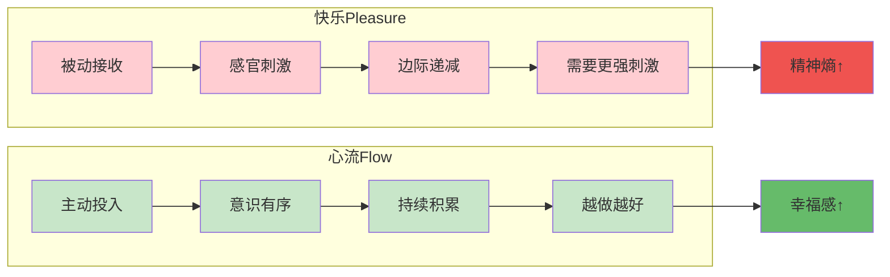
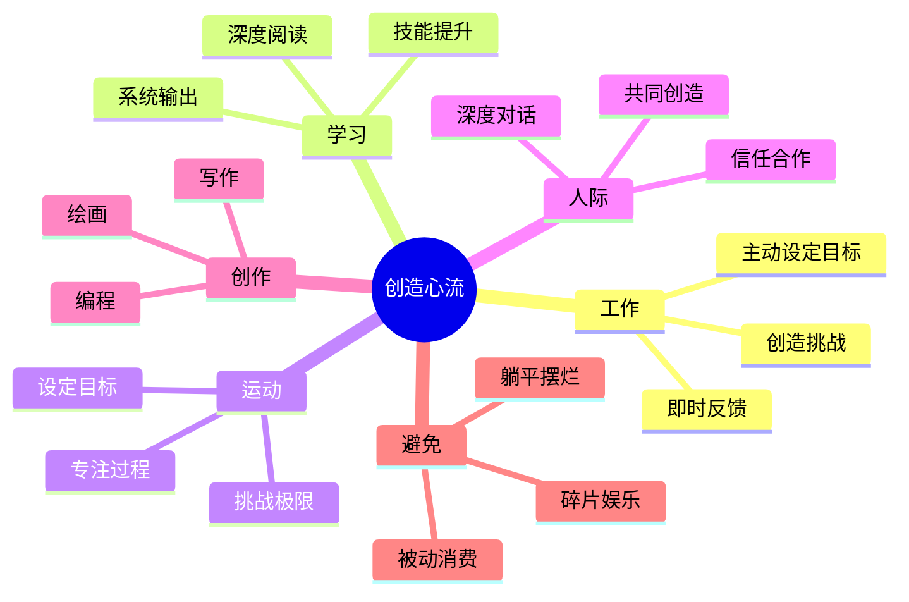

# 第3章 快乐与心流

## 📍 章节定位

**全书位置**：本章探讨快乐（Pleasure）与心流（Flow/Enjoyment）的本质区别，回答"为什么追求快乐反而得不到快乐，而心流才是幸福的真正来源"这一核心问题。

**章节序列**：第3章，承接心流要素的讲解，是理解"如何在生活工作中创造心流"的理论基础。

**一句话定位**：
> 快乐是感官的被动享受，心流是主动的投入创造。真正的幸福不是"舒服"，而是"忘我"。当你停止追逐快乐，开始创造心流，幸福反而来了。

---

## 🎯 核心观点（三层提取）

### 观点1：快乐≠心流——两种体验的本质区别

| 层次 | 内容 |
|------|------|

**降维翻译**：
- **原文**：Pleasure is a feeling of contentment that one achieves whenever information in consciousness says that expectations set by biological programs or by social conditioning have been met.
- **降维**：快乐是"得到想要的"，心流是"忘了自己"
- **类比**：快乐像吃糖，爽一下就没了；心流像爬山，累但回头看全是风景

---

### 观点2：快乐的陷阱——为什么追求快乐反而得不到快乐

| 层次 | 内容 |
|------|------|

**降维翻译**：
- **原文**：Pleasure helps to maintain order, but by itself does not create new order in consciousness.
- **降维**：越想爽越不爽，越想舒服越空虚
- **类比**：快乐像借钱消费，爽完要还；心流像投资增值，越投越有

---

### 观点3：心流的本质——主动创造内在秩序

| 层次 | 内容 |
|------|------|

**降维翻译**：
- **原文**：The optimal state of inner experience is one in which there is order in consciousness.
- **降维**：幸福不是外面的东西好，是里面的东西顺
- **类比**：心流像整理房间，乱的时候烦躁，整理完舒服——整理的是意识

---

### 观点4：如何在日常生活中创造心流

| 层次 | 内容 |
|------|------|

**降维翻译**：
- **原文**：It is the full involvement in flow, rather than happiness, that makes for excellence in life.
- **降维**：干什么不重要，怎么干才重要
- **类比**：生活像打游戏，被动刷怪最无聊，主动挑战才有意思

---

### 观点5：工作与心流——最大的心流来源

| 层次 | 内容 |
|------|------|

**降维翻译**：
- **原文**：Work is the most efficient way to create a complex consciousness.
- **降维**：工作干好了，比啥都爽
- **类比**：工作像健身房，累但让你变强；躺平像沙发，舒服但让你变弱

---

### 观点6：人际关系中的心流——共同创造

| 层次 | 内容 |
|------|------|

**降维翻译**：
- **原文**：The most intense flow experiences are reported to occur in social interactions.
- **降维**：一个人爽不如一群人爽
- **类比**：独奏好听，合奏更震撼

---

## 💬 金句库

### 原书金句
> "快乐是满足期望，心流是超越自我。"

> "追求快乐就像追逐地平线，永远追不上。但当你转身投入一件事，快乐自己会来。"

> "真正的生活不是发生在你身上，而是你主动创造的东西。"

> "人类能体验的最美好状态，不是感官享受，而是全神贯注。"

> "心流不在于你做什么，而在于你怎么做。"

### 降维金句
> "快乐像吃糖，爽一下就没了；心流像爬山，累但回头看全是风景。"

> "越想爽越不爽，越想舒服越空虚——这是快乐的陷阱。"

> "幸福不是外面的东西好，是里面的东西顺。"

> "干什么不重要，怎么干才重要。"

> "工作干好了，比啥都爽；躺平躺久了，比啥都空。"

> "一个人爽不如一群人爽，独奏好听，合奏更震撼。"

> "生活像打游戏，被动刷怪最无聊，主动挑战才有意思。"

## 🔗 当下映射

### 💰 财富应用

| 场景 | 快乐陷阱 | 心流解法 |
|------|----------|----------|
| 投资 | 看盘涨跌，情绪起伏 | 研究企业，深度分析 |
| 副业 | 赚快钱，追风口 | 打磨技能，创造价值 |
| 消费 | 买买买，爽完空虚 | 投资自己，持续成长 |

### 💼 职场应用

| 场景 | 快乐陷阱 | 心流解法 |
|------|----------|----------|
| 工作 | 摸鱼混日子，等下班 | 主动找挑战，提升技能 |
| 会议 | 被动听，刷手机 | 主动参与，贡献想法 |
| 学习 | 碎片化刷课，应付考试 | 系统学习，深度思考 |

### 🏠 生活应用

| 场景 | 快乐陷阱 | 心流解法 |
|------|----------|----------|
| 休闲 | 刷短视频、打游戏 | 运动、阅读、创作 |
| 社交 | 聚会八卦、玩手机 | 深度对话、共同活动 |
| 假期 | 躺平睡觉、追剧 | 学习新技能、挑战自我 |

### 72小时应用计划
1. **今天**：找出你生活中3件"舒服但空虚"的事，思考能否改造成"累但充实"
2. **明天**：选择一件日常事务（如做饭、打扫），用"心流四要素"重新设计体验
3. **本周**：创造一个"心流时间块"——2小时，关掉手机，专注一件事，记录感受

---

## 🕸️ 章节关联

### 向上：整书关联
- **核心问题**：本章回答"为什么快乐不是幸福，心流才是"——快乐vs心流是理解全书的钥匙
- **论证位置**：第1章讲心流定义，本章讲心流与快乐的本质区别，为后续应用奠定理论基础

### 横向：章节序列

| 章节编号 | 章节标题 | 关联类型 | 连接描述 |
|----------|----------|----------|----------|
| 第1章 | 幸福的新解 | 基础 | 第1章定义幸福，本章区分快乐与幸福 |
| 第3章 | 心流的要素 | 互补 | 要素讲"如何进入"，本章讲"为什么值得进入" |
| 第6章 | 心流与工作 | 应用 | 本章理论在工作场景的具体应用 |
| 第8章 | 心流与人际 | 延伸 | 从个人心流到人际心流 |

### 跨书关联

| 书籍 | 概念 | 关系 | 备注 |
|------|------|------|------|
| [[心理学与生活-津巴多-拆解记录]] | 奖赏系统 | 基础 | 快乐是多巴胺奖赏，心流是内在动机 |
| [[被讨厌的勇气-岸见一郎-拆解记录]] | 贡献感 | 呼应 | 阿德勒的"贡献感"≈心流的"创造价值" |
| [[思考快与慢-丹尼尔·卡尼曼-拆解记录]] | 系统1/2 | 深化 | 快乐偏系统1，心流是系统2的极致 |
| [[少有人走的路-派克-拆解记录]] | 延迟满足 | 对比 | 派克讲放弃眼前快乐，契克森米哈赖讲创造心流 |

### 快乐vs心流对比图

### 生活中心流创造路径

---

## ❓ 问答设计

### Q1: 快乐和心流有什么本质区别？（理解型）
**认知层次**: 理解
**难度**: 中
**答案要点**:
- **快乐**：感官层面的刺激-反应，被动接收，边际递减
- **心流**：意识层面的投入-创造，主动输出，持续积累
- 关键区别：一个是"得到"，一个是"成为"；一个消耗，一个创造

### Q2: 为什么追求快乐反而得不到快乐？（分析型）
**认知层次**: 分析
**难度**: 高
**答案要点**:
- 享乐适应：大脑对重复刺激产生耐受
- 期望升级：满足一个期望，产生更大期望
- 精神熵增加：被动消费消耗精神能量但不产生秩序
- 快乐悖论：越追求，越远；越放手，越来

### Q3: 如何在日常生活中创造心流？（应用型）
**认知层次**: 应用
**难度**: 中
**答案要点**:
1. **明确目标**：知道要做什么
2. **即时反馈**：做完就知道好不好
3. **挑战匹配**：不太难也不太简单
4. **主动投入**：自己决定怎么做
- 任何活动只要具备这四点，都可能产生心流

### Q4: 为什么说工作是心流的最大来源？（理解型）
**认知层次**: 理解
**难度**: 中
**答案要点**:
- 工作天然具备心流条件：目标、反馈、技能提升
- 不是工作本身多有趣，而是主动投入让它变有趣
- 拒绝工作=拒绝最大成长机会
- 关键是态度：被动做是煎熬，主动做是享受

### Q5: 如何区分"真正的休息"和"假休息"？（分析型）
**认知层次**: 分析
**难度**: 中
**答案要点**:
| 假休息 | 真休息 |
|--------|--------|
| 刷短视频、追剧 | 运动、阅读、创作 |
| 被动消费 | 主动投入 |
| 消耗精神能量 | 创造内心秩序 |
| 越休息越累 | 越休息越精神 |
| 增加精神熵 | 降低精神熵 |

### Q6: 心流和《被讨厌的勇气》的"贡献感"有什么关联？（分析型）
**认知层次**: 分析
**难度**: 高
**答案要点**:
- 阿德勒的"贡献感"≈心流的"创造价值"
- 都强调主动创造而非被动接受
- 都认为幸福来自"给予"而非"得到"
- 区别：阿德勒聚焦人际关系，契克森米哈赖聚焦活动本身
- 互补：贡献感是人际维度的心流

### Q7: 在AI时代，心流为什么更重要？（综合型）
**认知层次**: 综合
**难度**: 高
**答案要点**:
- AI能帮你干活，但只有你能体验干活的快乐
- AI替代的是被动执行，无法替代主动创造
- AI时代更需要：专注力、创造力、深度思考——都来自心流
- 心流是人类最后的堡垒：AI无法体验，只能模拟

### Q8: 如果工作本身很无聊，怎么创造心流？（应用型）
**认知层次**: 应用
**难度**: 高
**答案要点**:
1. **重新定义目标**：从"完成任务"到"提升技能"
2. **创造挑战**：在有限范围内找突破点
3. **主动反馈**：自己给自己肯定
4. **提升技能**：让困难任务变"可完成"
5. **终极选择**：如果完全无法创造心流，可能是换工作的信号

### Q9: "一个人爽不如一群人爽"怎么理解？（理解型）
**认知层次**: 理解
**难度**: 低
**答案要点**:
- 人类是社会性动物
- 人际心流需要：共同目标、角色互补、即时反馈、深度信任
- 共享心流会产生"共振效应"，体验更强
- 独奏好听，合奏更震撼

### Q10: 快乐vs心流，应该追求哪个？（评价型）
**认知层次**: 评价
**难度**: 高
**答案要点**:
- **不是二选一**，而是懂得区分
- 快乐不是坏事，但不能是唯一追求
- 心流带来更深层的满足，但需要主动投入
- 最佳策略：把快乐当作心流的"副产品"，而不是"目标"
- 当你停止追逐快乐，开始创造心流，快乐自己会来

---
