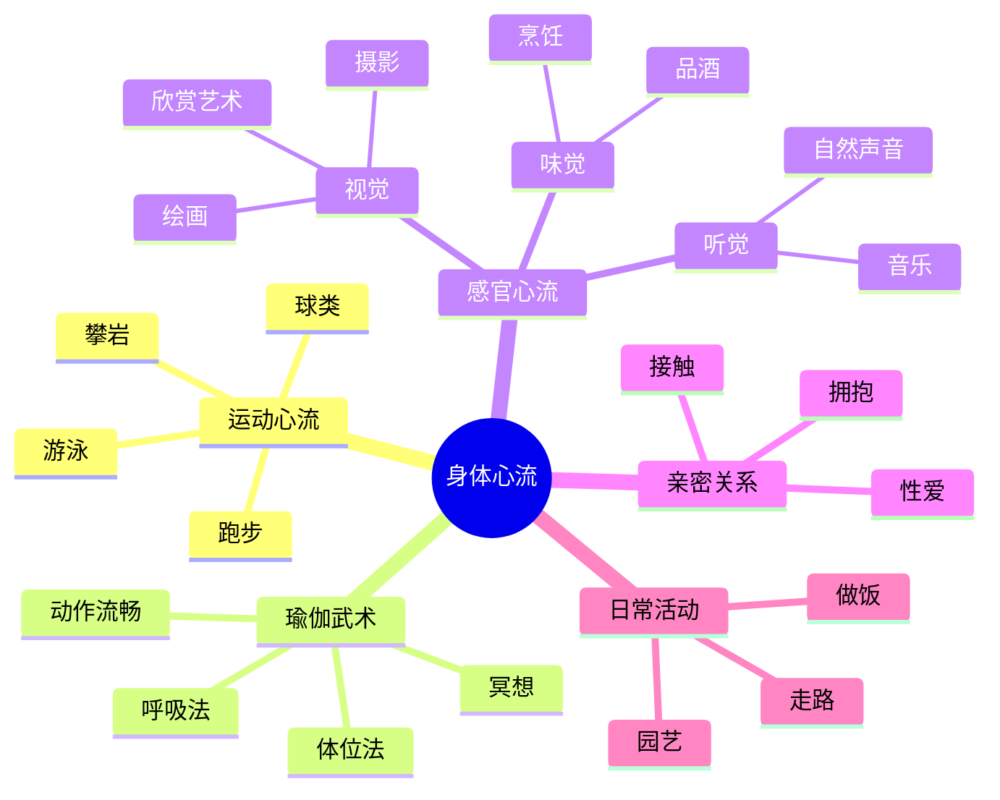
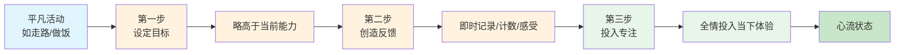

# 第4章 心流与身体

## 📍 章节定位

**全书位置**：第4章是心流理论的身体应用章节，回答"如何在身体活动中创造心流"，展示身体技能与心流体验的深度连接。本章是心流具体化实践的重要起点。

**章节序列**：第4章（共10章），承接第3章的心流要素，为第5章的思维心流提供对比

**一句话定位**：
> 身体是心流体验最直接的入口——通过培养运动、感官、瑜伽等身体技能，任何人都能在日常活动中创造最优体验，把"身体的活动"变成"心灵的享受"。

**核心问题**：
- 身体活动中如何创造心流？
- 运动、瑜伽、音乐、美食中的心流有何不同？
- 如何培养身体技能，把平凡活动变成心流体验？

---

## 🎯 核心观点（三层提取）

### 观点1：运动是心流最自然的入口

| 层次 | 内容 |
|------|------|
| 📖 **表层（案例）** | 跑步者在晨跑时，呼吸的节奏、脚步的节奏、身体的节奏融为一体，大脑放空，只有纯粹的"跑"。攀岩者在岩壁上，每一步都需要精确判断，全部注意力集中在"下一步"，忘记恐惧，忘记疲劳。游泳者在水中，水的浮力、划水的节奏、呼吸的配合，形成完美的流动感。 |
| ⚙️ **中层（机制）** | 运动的心流来自"身体与行动的同步"——当身体技能与挑战匹配，动作变得自动化、流畅化，注意力完全投入当下，身体和意识合而为一。运动的特点是：即时反馈（做对了立刻知道）、明确节奏（心跳、呼吸、步伐）、清晰目标（跑到终点、游到对岸）。这些天然符合心流八要素。 |
| 🔮 **底层（规律）** | 身体是为心流而设计的——人类进化出的运动本能（奔跑、跳跃、攀爬），在古代是生存技能，在现代可以转化为心流体验。运动是最容易进入心流的活动，因为它：反馈即时、节奏清晰、目标明确、身体参与。这就是为什么"动起来"是摆脱精神熵最直接的方法。 |

**降维翻译**：
- **原文**：运动是心流最自然的入口
- **中学生懂**：跑步、打球、游泳这些运动，最容易让人专注忘我
- **奶奶懂**：动起来，心里就舒服；练到顺，人就自在

---

### 观点2：挑战-技能平衡在运动中的体现

| 层次 | 内容 |
|------|------|
| 📖 **表层（案例）** | 初学者跑步500米就气喘吁吁，感到力不从心（挑战>技能）；马拉松运动员跑5公里毫无压力，感到无聊（技能>挑战）；只有当距离略高于当前能力，又不过于困难，才能找到"刚刚好"的挑战——比如从5公里提升到6公里，需要努力但可以完成。 |
| ⚙️ **中层（机制）** | 运动中的心流需要"动态平衡"——随着技能提升，挑战必须同步提升。新手挑战简单任务，高手挑战困难任务，但每个人都要找到自己的"刚刚好"。这个平衡点是动态的：今天状态好，可以挑战更难；今天状态差，可以降低难度。关键是保持"有点挑战但能搞定"的状态。 |
| 🔮 **底层（规律）** | 身体的可塑性——通过练习，技能会提升，原来的困难会变容易。这就是为什么运动能创造持续的挑战：你永远可以设定一个新的、略高于当前能力的目标。运动心流的循环是：练习→技能提升→挑战升级→进入新心流。 |

**降维翻译**：
- **原文**：运动中需要技能与挑战的动态平衡
- **中学生懂**：运动不能太难也不能太简单，刚好"跳一跳够得着"最爽
- **奶奶懂**：慢慢来，一点点加码，太难了累，太简单了没劲

---

### 观点3：瑜伽与武术——身体控制的极致

| 层次 | 内容 |
|------|------|
| 📖 **表层（案例）** | 瑜伽练习者在做平衡动作时，全部注意力集中在身体的每一个肌肉，呼吸平稳，精神完全内收。武术家在练习时，动作行云流水，力量、速度、精准度完美配合，仿佛身体自己在动，意识只是观察。 |
| ⚙️ **中层（机制）** | 瑜伽和武术是"身体控制的极致"——它们通过系统训练，让身体技能高度精细化、自动化。在这种状态下，身体不再需要意识持续"指挥"，而能自然流畅地行动。意识从"控制身体"解放出来，可以专注于更高级的体验（冥想、直觉、觉知）。 |
| 🔮 **底层（规律）** | 身心合一的最高境界——当身体技能达到极致，身体和意识的界限消失。瑜伽和武术的终极目标不是"练得更厉害"，而是"练到忘记身体"，进入纯粹的觉知状态。这是东方智慧对心流的极致诠释：从"控制身体"到"超越身体"。 |

**降维翻译**：
- **原文**：瑜伽和武术是身心合一的最高境界
- **中学生懂**：练到极致，身体就像自己的延伸，不需要想，它就自己动
- **奶奶懂**：练到顺了，身体像自己会动，你就在旁边看着就行

---

### 观点4：感官心流——视觉、听觉、味觉的沉浸

| 层次 | 内容 |
|------|------|
| 📖 **表层（案例）** | 摄影师在取景时，全部注意力集中在光线、构图、色彩，世界缩小到镜头里，只有眼前的画面。音乐家在演奏时，全部注意力集中在音符、节奏、音色，世界缩小到音乐里，只有流动的旋律。美食家在品酒时，全部注意力集中在香气、口感、余味，世界缩小到味蕾里，只有复杂的风味。 |
| ⚙️ **中层（机制）** | 感官心流是"注意力聚焦于单一感官"——当注意力完全投入视觉、听觉或味觉，其他感官和意识自动"关闭"，进入纯净的感官体验。这种状态下，世界变得简单、清晰、美好，因为复杂的信息被过滤了，只剩下特定感官接收的信息。 |
| 🔮 **底层（规律）** | 感官是意识的"过滤器"——通过训练，可以让注意力聚焦于某一感官，创造纯净的心流体验。视觉、听觉、味觉都能成为心流的入口，关键是：全情投入，不带杂念。这就是为什么"认真看一朵花"也能成为心流——因为注意力完全聚焦于视觉，世界简化为那朵花。 |

**降维翻译**：
- **原文**：感官心流是注意力聚焦于单一感官的纯净体验
- **中学生懂**：专心看、专心听、专心尝，都能让人忘记其他一切
- **奶奶懂**：仔细看一朵花，仔细听一段音乐，心里就安静了

---

### 观点5：性爱中的心流——身体与情感的结合

| 层次 | 内容 |
|------|------|
| 📖 **表层（案例）** | 在亲密关系中，当双方都能放下"表现焦虑"，全身心投入当下的亲密体验，时间消失，自我意识消失，只有纯粹的"在一起"。这种状态下，身体和情感融为一体，是最深刻的心流体验之一。 |
| ⚙️ **中层（机制）** | 性爱心流是"身体与情感的同步"——当身体接触和情感连接同时达到深度沉浸，双方进入共同的节奏和流动。这种状态需要：放下自我监控（不担心"我表现好不好"）、全情投入（注意力完全在对方和当下）、互相呼应（彼此的节奏和感受同步）。 |
| 🔮 **底层（规律）** | 最深层的心流是"两个人合一"——当双方的意识、身体、情感完全同步，界限消失，进入共同的流动。这是心流在社会关系中的极致体验，也是为什么亲密关系能带来最深层的幸福。关键是：放下"我"，投入"我们"。 |

**降维翻译**：
- **原文**：性爱中的心流是身体与情感的深度结合
- **中学生懂**：两个人真心投入，忘记时间，忘记自己，只有彼此
- **奶奶懂**：两个人真正在一起，心在一起，人在一起，什么都不想

---

### 观点6：培养身体技能——把平凡变成非凡

| 层次 | 内容 |
|------|------|
| 📖 **表层（案例）** | 一个普通人学会弹吉他，从"乱按"到"流畅演奏"，经历了上千小时练习。但当他能闭着眼睛弹奏一段旋律时，他获得的不仅是技能，还有心流体验。他在演奏时忘记时间，忘记自己，只有音乐在流动。这个体验的价值，远超过吉他的技术价值。 |
| ⚙️ **中层（机制）** | 培养身体技能的过程，就是培养心流能力的过程。技能越好，心流越容易出现。但心流的价值不在于"技能有多高"，而在于"体验有多深"。即使简单的技能（如散步、做饭、园艺），只要用心培养，也能创造心流体验。关键是：投入注意力，发现挑战，感受反馈。 |
| 🔮 **底层（规律）** | 任何身体活动都能成为心流入口——不在于"做什么"，而在于"怎么做"。走路可以成为心流（关注步伐节奏），做饭可以成为心流（关注食材变化），园艺可以成为心流（关注植物生长）。心流不在远方，就在当下的身体活动里。 |

**降维翻译**：
- **原文**：任何身体活动都能成为心流入口
- **中学生懂**：不在于做什么运动，在于怎么投入地做
- **奶奶懂**：干什么不重要，专心干、用心干，就能干出滋味

---

### 观点7：身体心流 vs 思维心流——两种不同的心流体验

| 层次 | 内容 |
|------|------|
| 📖 **表层（案例）** | 跑步时的心流：身体在动，意识放空，感受节奏、呼吸、风。下棋时的心流：身体不动，意识高度集中，感受思考、计算、判断。两种心流都能让人忘记时间，但体验不同：身体心流是"动中的静"，思维心流是"静中的动"。 |
| ⚙️ **中层（机制）** | **身体心流**：身体活跃，意识简化。注意力集中在身体感觉（肌肉、呼吸、节奏），大脑停止复杂思考。**思维心流**：身体静止，意识活跃。注意力集中在思维活动（推理、创造、解决问题），身体进入自动模式。两种心流都要求：全情投入、忘记自我、时间消失。 |
| 🔮 **底层（规律）** | 人类有两种心流路径：身体路径和思维路径。身体路径（运动、感官、瑜伽）适合需要放松、减压时；思维路径（思考、写作、学习）适合需要创造、解决问题时。两种路径互补：身体心流为思维心流充电，思维心流为身体心流提供意义。 |

**降维翻译**：
- **原文**：身体心流是动中的静，思维心流是静中的动
- **中学生懂**：运动时心里静，思考时身不动，两种都能忘我
- **奶奶懂**：动起来心里静，静下来脑子动，都是好的

---

### 观点8：从"活动"到"心流"的三步转化法

| 层次 | 内容 |
|------|------|
| 📖 **表层（案例）** | 把"走路"变成心流：第一步，设定目标（"今天走6000步，比昨天多500步"）；第二步，创造反馈（用计步器，每1000步给自己肯定）；第三步，投入注意力（感受每一步的节奏，观察沿途的风景）。就这样，平凡的走路变成了有心流体验的活动。 |
| ⚙️ **中层（机制）** | 三步转化法：**1. 设定略高于当前能力的目标**（目标）；**2. 创造即时反馈机制**（反馈）；**3. 全情投入当下体验**（专注）。任何身体活动，只要加上这三步，就能转化为心流体验。核心是：主动创造心流条件，而不是等待活动"自然有趣"。 |
| 🔮 **底层（规律）** | 心流是可以主动创造的——不在于活动本身，而在于你如何组织活动。通过设定目标、创造反馈、投入注意力，你可以把任何平凡活动变成心流体验。这就是契克森米哈赖的核心观点：幸福不在于你"拥有"什么，而在于你"如何做"什么。 |

**降维翻译**：
- **原文**：通过目标、反馈、专注，任何活动都能转化为心流
- **中学生懂**：给活动定个小目标，自己给自己反馈，专心投入，就能有心流
- **奶奶懂**：干啥都有办法让它有意思：定目标、看出彩、专心干

---

## 💬 金句库

### 原书金句
> "身体是为心流而设计的——运动是摆脱精神熵最直接的方法。"

> "能否感到乐趣，不在于你做了什么，而在于你怎么做。"

> "瑜伽和武术的最高境界，是从'控制身体'到'超越身体'。"

> "感官是意识的过滤器，通过训练可以创造纯净的心流体验。"

> "培养身体技能的过程，就是培养心流能力的过程。"

> "任何活动都能成为心流入口，关键是你如何组织它。"

### 降维金句
> "动起来，心里就顺；练到顺，人就自在。"

> "运动不难不很容易，刚刚好最爽。"

> "练到极致，身体就像自己的延伸。"

> "专心看、专心听，心里就安静。"

> "不在于做什么，在于怎么投入地做。"

> "走路、做饭、园艺，专心干都有滋味。"

> "定目标、看出彩、专心干，啥事都有意思。"

## 🔗 当下映射

### 💰 财富应用

| 场景 | 具体行动 | 心流要素 | 预期效果 |
|------|----------|----------|----------|
| 股票分析 | 设定分析时间块+记录心得 | 专注+明确目标+即时反馈 | 从焦虑变专注 |
| 创业项目 | 把大任务拆成小挑战 | 挑战匹配+即时反馈 | 从压力变享受 |

### 💼 职场应用

| 场景 | 具体行动 | 身体心流方法 | 适用职级 |
|------|----------|--------------|----------|
| 会议中 | 深呼吸+关注自己能贡献什么 | 呼吸练习+掌控感 | 全职级 |
| 深度工作 | 站立办公+定时休息 | 身体运动+节奏感 | 全职级 |
| 压力大时 | 5分钟快走或拉伸 | 身体活动+即解放松 | 全职级 |

### 🏠 生活应用

| 场景 | 具体行动 | 可行性 | 见效时间 |
|------|----------|--------|----------|
| 运动 | 设定略高于当前能力的目标 | 高 | 即时 |
| 听音乐 | 关闭干扰，全情聆听 | 高 | 即时 |
| 做饭 | 把做饭变成创作，创造反馈 | 中 | 1周 |
| 散步 | 关注步伐节奏和沿途风景 | 高 | 即时 |

### 72小时应用计划
1. **今天**：选择一个身体活动（跑步、走路、瑜伽），设定一个小目标。
2. **明天**：在活动中创造即时反馈（记录、计数、感受进步）。
3. **本周**：每天花15分钟，把一个平凡活动变成心流体验。

---

## 🕸️ 章节关联

### 向上：整书关联
- **核心问题**：本章回答"如何在身体活动中创造心流"——身体是最容易的心流入口
- **全书定位**：第4章是心流应用的第一站（身体），为第5章（思维）提供对比

### 横向：章节序列

| 章节编号 | 章节标题 | 关联类型 | 连接描述 |
|----------|----------|----------|----------|
| 第3章 | 心流的要素 | 基础 | 第3章讲八要素，第4章在身体活动中应用 |
| 第5章 | 心流与思维 | 对比 | 第4章身体心流，第5章思维心流，两种路径互补 |
| 第6章 | 心流与工作 | 应用 | 第4章的身体技能可提升工作中的状态 |

### 跨书关联

| 书籍 | 概念 | 关系 | 备注 |
|------|------|------|------|
| [[当下的力量-埃克哈特·托利-拆解记录]] | 身体觉察 | 呼应 | 都强调通过身体连接当下 |
| [[庄子]] | 养生 | 对比 | 都重视身体与精神的和谐 |
| [[瑜伽经典]]| 瑜伽实践 | 深化 | 契克森米哈赖引用瑜伽作为心流的极致案例 |

### 身体心流类型图

### 心流转化三步法

---

## ❓ 问答设计

### Q1: 为什么说身体是心流最自然的入口？（理解型）
**答案要点**:
- 运动有即时反馈（做对了立刻知道）
- 运动有明确节奏（心跳、呼吸、步伐）
- 运动有清晰目标（跑到终点、游到对岸）
- 这些天然符合心流八要素
- 身体进化出的运动本能，在古代是生存技能，在现代可以转化为心流体验

### Q2: 运动中如何保持技能-挑战的动态平衡？（应用型）
**答案要点**:
- 新手挑战简单任务，高手挑战困难任务
- 每个人都要找到自己的"刚刚好"
- 随着技能提升，挑战必须同步提升
- 今天状态好，可以挑战更难；今天状态差，可以降低难度
- 关键是保持"有点挑战但能搞定"的状态

### Q3: 瑜伽和武术如何实现"身心合一"？（理解型）
**答案要点**:
- 通过系统训练，让身体技能高度精细化、自动化
- 在这种状态下，身体不再需要意识持续"指挥"，而能自然流畅地行动
- 意识从"控制身体"解放出来，可以专注于更高级的体验（冥想、直觉、觉知）
- 终极目标不是"练得更厉害"，而是"练到忘记身体"，进入纯粹的觉知状态

### Q4: 感官心流是什么？如何创造？（应用型）
**答案要点**:
- 感官心流是"注意力聚焦于单一感官"的纯净体验
- 视觉心流：摄影、绘画、欣赏艺术
- 听觉心流：音乐、自然声音
- 味觉心流：品酒、烹饪
- 创造方法：全情投入，不带杂念，专注于单一感官

### Q5: 身体心流和思维心流有什么区别？（对比型）
**答案要点**:
- **身体心流**：身体活跃，意识简化。注意力集中在身体感觉。
- **思维心流**：身体静止，意识活跃。注意力集中在思维活动。
- 身体心流适合放松、减压；思维心流适合创造、解决问题
- 两者互补：身体心流为思维心流充电，思维心流为身体心流提供意义

### Q6: 如何把"走路"变成心流体验？（应用型）
**答案要点**:
- 第一步：设定目标（今天走6000步，比昨天多500步）
- 第二步：创造反馈（用计步器，每1000步给自己肯定）
- 第三步：投入注意力（感受每一步的节奏，观察沿途的风景）
- 这样，平凡的走路就变成了有心流体验的活动

### Q7: 为什么说"能否感到乐趣，不在于你做了什么，而在于你怎么做"？（理解型）
**答案要点**:
- 任何活动都能创造心流，不取决于活动本身
- 关键在于如何组织活动：设定目标、创造反馈、投入注意力
- 走路、做饭、园艺、读书、工作——只要用心，都能有心流
- 幸福不在于你"拥有"什么，而在于你"如何做"什么

### Q8: 身体心流如何帮助减压？（应用型）
**答案要点**:
- 身体心流时，注意力完全投入身体感觉
- 大脑停止复杂思考，杂念自动消失
- 身体活动释放内啡肽（天然的减压荷尔蒙）
- 5-10分钟的身体心流就能显著减压
- 适合的身体活动：快走、拉伸、瑜伽、舞蹈

### Q9: 培养身体技能和培养心流能力有什么关系？（分析型）
**答案要点**:
- 培养身体技能的过程，就是培养心流能力的过程
- 技能越好，心流越容易出现
- 但心流的价值不在于"技能有多高"，而在于"体验有多深"
- 即使简单的技能，只要用心培养，也能创造心流体验
- 核心是：投入注意力，发现挑战，感受反馈

### Q10: 在2026年，为什么身体心流越来越重要？（综合型）
**答案要点**:
- 现代人坐得太多、想得太多，动得太少
- 身体被束缚，心流就很难来
- 身体活动减少导致注意力分散、精神熵增加
- 身体心流是最直接、最便宜的减压方法
- 不需要健身房，不需要瑜伽馆——只需要动起来，投入注意力

### Q11: 如何在日常中创造身体心流？（应用型）
**答案要点**:
**早晨**：
- 起床后做5分钟拉伸或瑜伽
- 设定小目标（比昨天多做一个动作）
- 感受身体的每一个伸展

**工作间隙**：
- 每小时站起来走5分钟
- 关注步伐的节奏，观察周围的景色
- 让注意力从大脑转移到身体

**晚上**：
- 做15分钟运动或瑜伽
- 创造即时反馈（记录次数、感受进步）
- 全情投入，放下一天的杂念

**周末**：
- 选择一项身体活动（爬山、游泳、骑车）
- 设定略高于当前能力的目标
- 享受活动本身，不追求结果

### Q12: 性爱中的心流需要什么条件？（理解型）
**答案要点**:
- 放下自我监控（不担心"我表现好不好"）
- 全情投入（注意力完全在对方和当下）
- 互相呼应（彼此的节奏和感受同步）
- 身体接触和情感连接同时达到深度沉浸
- 双方进入共同的节奏和流动

### Q13: 感官心流有什么价值？（综合型）
**答案要点**:
**减压价值**：
- 注意力聚焦单一感官，其他杂念自动消失
- 大脑从复杂思考中解放，得到休息

**审美价值**：
- 用纯粹的眼光看世界，发现平时忽略的美
- 摄影、绘画、音乐、美食——都是心流的审美体验

**疗愈价值**：
- 专注当下，忘记过去和未来
- 从精神熵中解脱，获得平静

**学习价值**：
- 深度感知，提升感官敏锐度
- 培养全情投入的能力

### Q14: 如何判断自己是否进入了身体心流？（应用型）
**答案要点**:
**身体感觉**：
- 动作流畅，毫不费力
- 身体和意识融为一体
- 时间感扭曲（感觉时间过得很快）

**心理状态**：
- 忘记自我（不担心"我表现得好不好"）
- 杂念消失（只关注当下的活动）
- 感到快乐、充实、满足

**事后反馈**：
- 回忆活动时，感到愉悦
- 想要重复这个体验
- 活动本身成为奖赏（无需外部奖励）

### Q15: 身体心流和冥想有什么关系？（分析型）
**答案要点**:
**共同点**：
- 都要求注意力集中
- 都能达到意识有序的状态
- 都能减压、平静身心

**区别**：
- **身体心流**：身体活跃，注意力在身体感觉
- **冥想**：身体静止，注意力在呼吸或觉知

**互补关系**：
- 身体心流可以作为冥想的准备（通过活动安定身心）
- 冥想可以增强身体心流的能力（提升注意力控制）
- 瑜伽是两者的结合（身体练习+冥想）

---
