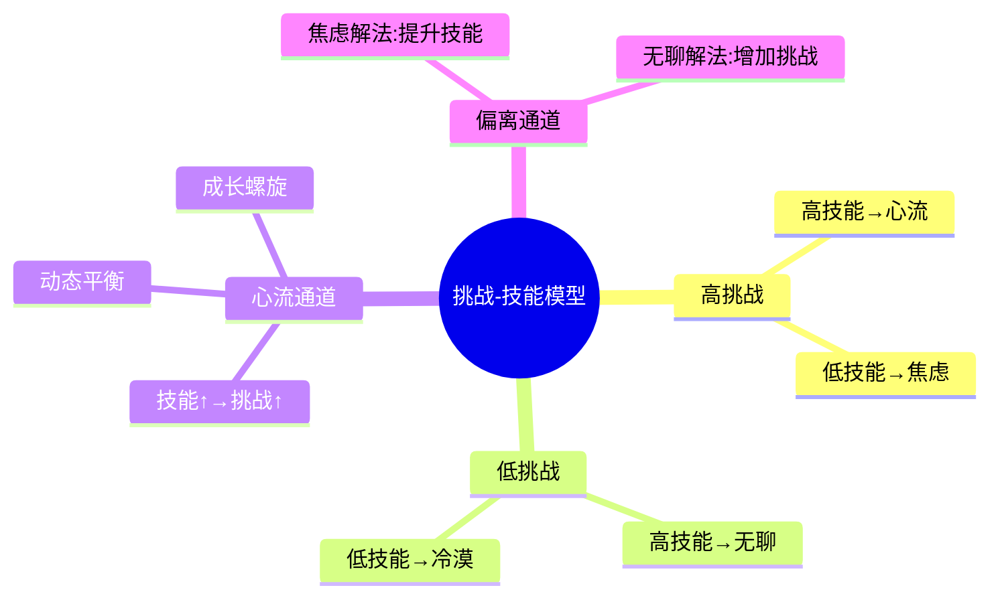
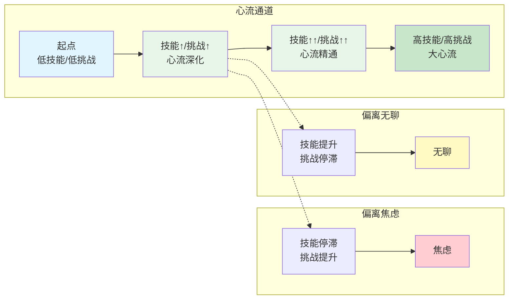

# 第4章 心流的条件

## 📍 章节定位

**全书位置**：本章深度解析心流产生的核心条件——挑战与技能的动态平衡。这是心流理论最核心的操作模型，理解这个模型就掌握了"如何进入心流"的关键密码。

**章节序列**：第4章，承接第3章的八大要素，深入探讨最重要的第一要素"挑战与技能平衡"。

**一句话定位**：
> 心流的黄金法则：挑战与技能的动态平衡——太难会焦虑，太简单会无聊，刚刚好才是心流。找到你的"心流通道"，就能在任何活动中创造最优体验。

---

## 🎯 核心观点（三层提取）

### 观点1：挑战-技能平衡模型——心流的核心公式

| 层次 | 内容 |
|------|------|
| 📖 **表层（案例）** | 游戏玩家：简单关卡无聊，困难关卡焦虑，适中关卡上瘾。学生学习：太简单的内容走神，太难的内容放弃，略高于能力的最专注。运动员训练：轻松完成无挑战，超负荷训练受伤，适度挑战最佳状态。 |
| ⚙️ **中层（机制）** | 人类大脑有一个"难度感应器"——当任务难度与当前技能匹配时，大脑会判断"值得投入"并释放注意力资源；当难度远超技能，大脑判断"不可能"而产生焦虑；当难度远低于技能，大脑判断"没意思"而走神。 |
| 🔮 **底层（规律）** | **心流黄金比例**：挑战略高于当前技能（约5-10%）时，心流最容易产生。这个比例既能激发努力，又能保持信心。人类天生被"适度困难"的事物吸引——这是进化遗留在神经系统中的机制。 |

**降维翻译**：
- **原文**：挑战与技能的动态平衡是心流产生的核心条件
- **降维**：事情不能太难也不能太简单，做起来"有点挑战但能搞定"最爽
- **类比**：就像游戏关卡设计——太简单没人玩，太难没人过，刚刚好让人上瘾

---

### 观点2：四象限状态模型——你处在哪个区域？

| 层次 | 内容 |
|------|------|
| 📖 **表层（案例）** | 高挑战/低技能：新工作第一天，什么都听不懂，心跳加速，手心出汗。低挑战/低技能：躺在沙发上刷短视频，什么都不用想，但越刷越空虚。低挑战/高技能：做了十年的流水线工作，闭着眼都能完成，机械重复。高挑战/高技能：外科医生做高难度手术，全神贯注，忘记时间——心流。 |
| ⚙️ **中层（机制）** | 挑战与技能的高低组合，形成四种心理状态：**焦虑区**（高挑战/低技能）、**冷漠区**（低挑战/低技能）、**无聊区**（低挑战/高技能）、**心流区**（高挑战/高技能）。心流区是唯一能产生最优体验的区域。 |
| 🔮 **底层（规律）** | **状态决定论**：你当前的心理状态，由你面临的挑战和你拥有的技能共同决定。改变状态只有两条路：提升技能（解决焦虑），或增加挑战（解决无聊）。 |

**降维翻译**：
- **原文**：四象限状态由挑战和技能的高低组合决定
- **降维**：太强了嫌简单（无聊），太弱了嫌困难（焦虑），刚刚好（心流）
- **类比**：就像找工作——能力太强嫌活儿太简单，能力太弱嫌活儿太难，刚刚好才干得带劲

---

### 观点3：心流通道——成长的动态路径

| 层次 | 内容 |
|------|------|
| 📖 **表层（案例）** | 钢琴学习者：从简单练习曲开始，练熟了升级难度，十年后能弹李斯特。程序员：从Hello World开始，做小项目，做大项目，最后能设计系统架构。运动员：从跑1公里开始，每次加500米，最后完成马拉松。 |
| ⚙️ **中层（机制）** | 心流通道是一条动态平衡的路径：技能提升→挑战升级→进入新心流→技能再提升→挑战再升级...形成正向循环。偏离通道会进入焦虑或无聊：技能固定但挑战提升→焦虑；技能提升但挑战固定→无聊。 |
| 🔮 **底层（规律）** | **成长螺旋**：持续成长的本质是"保持心流通道"。不是达到某个终点，而是持续走在通道上。停滞的本质是偏离通道——要么停在舒适区，要么冲进恐慌区。 |

**降维翻译**：
- **原文**：心流通道是技能与挑战同步提升的动态路径
- **降维**：越练越强，越强越挑战，形成良性循环
- **类比**：就像打怪升级——怪物越来越强，你的装备也越来越好，一直"刚刚好"

---

### 观点4：焦虑的解法——提升技能，回到通道

| 层次 | 内容 |
|------|------|
| 📖 **表层（案例）** | 新工作焦虑：什么都不懂→虚心学习，请教前辈→三个月后上手→焦虑消失。公开演讲恐惧：不敢上台→先在镜子前练，再找朋友听→最后敢在几百人面前讲。学新技能卡壳：看不懂教程→找人教，反复练习→突然开窍。 |
| ⚙️ **中层（机制）** | 焦虑的本质是"挑战>技能"。解法是缩小差距：要么降低挑战（换个更简单的任务），要么提升技能（学习、练习、请教）。最可持续的解法是提升技能，因为挑战通常不由我们控制。 |
| 🔮 **底层（规律）** | **焦虑转化定律**：焦虑不是敌人，是"技能不足"的信号。把焦虑当作"该学习了"的提醒，焦虑就转化为成长动力。焦虑的唯一解法是行动——任何能提升技能的行动。 |

**降维翻译**：
- **原文**：焦虑的解法是提升技能，回到心流通道
- **降维**：觉得难？说明你该练了。练好了就不难了。
- **类比**：就像打不过的BOSS——回去练级，练够了再回来打

---

### 观点5：无聊的解法——增加挑战，回到通道

| 层次 | 内容 |
|------|------|
| 📖 **表层（案例）** | 工作无聊：重复做了三年，闭着眼都能完成→主动申请新项目，学新技能→重新找到激情。生活无聊：每天两点一线→尝试新爱好，设定新目标→重新感到充实。关系无聊：相敬如宾变成相敬如冰→一起做新事情，共同挑战→重新燃起火花。 |
| ⚙️ **中层（机制）** | 无聊的本质是"技能>挑战"。解法是：要么降低技能（退化，不推荐），要么增加挑战（设定更高目标，承担更大责任）。最可持续的解法是增加挑战，因为技能不进则退。 |
| 🔮 **底层（规律）** | **无聊转化定律**：无聊不是休息，是"潜力闲置"的信号。把无聊当作"该升级了"的提醒，无聊就转化为进取动力。无聊的唯一解法是挑战——任何能让你感到有点吃力的挑战。 |

**降维翻译**：
- **原文**：无聊的解法是增加挑战，回到心流通道
- **降维**：觉得简单？给自己加点难度。难度来了，激情就来了。
- **类比**：就像通关后没意思——开新难度，或者换个新游戏

---

### 观点6：心流的黄金比例——5-10%的挑战略超

| 层次 | 内容 |
|------|------|
| 📖 **表层（案例）** | 跑步训练：平时跑5公里，今天跑5.5公里——刚好有点累但能完成。学习新技能：掌握80%的内容，留20%探索——既有成就感又有新鲜感。工作目标：比上周多完成10%——刚好需要努力但不会崩溃。 |
| ⚙️ **中层（机制）** | 心流最容易产生的"甜蜜点"是：挑战略高于当前技能5-10%。这个比例既能让大脑感到"有挑战"，又能让大脑判断"能完成"。太高会触发焦虑，太低会触发无聊。 |
| 🔮 **底层（规律）** | **甜蜜点定律**：成长最快的区间不是"轻松完成"，也不是"困难到放弃"，而是"跳一跳够得着"。这个区间是人类的最佳学习区、最佳表现区、最佳幸福感区。 |

**降维翻译**：
- **原文**：心流黄金比例是挑战略高于技能5-10%
- **降维**：每次比上次多一点点，不多不少，刚刚好
- **类比**：就像举重——每次加一点点重量，练到不累不轻

---

### 观点7：不同人的心流点不同——找到你的通道

| 层次 | 内容 |
|------|------|
| 📖 **表层（案例）** | 马拉松冠军的心流：跑42公里，配速3分钟——普通人做不了。钢琴大师的心流：弹奏李斯特狂想曲——初学者做不了。初学者的心流：跑3公里、弹简单练习曲——大师觉得无聊。每个人的心流点不同，但找到心流的"方法"相同。 |
| ⚙️ **中层（机制）** | 心流通道是个性化的——每个人的技能水平不同，对应的挑战阈值也不同。关键不是"挑战有多难"，而是"挑战对你有多难"。找到属于自己的心流通道，比模仿别人的更重要。 |
| 🔮 **底层（规律）** | **个性化心流定律**：心流不是外在标准，是内在感受。别人的心流可能是你的焦虑，你的心流可能是别人的无聊。唯一重要的是：找到属于你的"刚刚好"。 |

**降维翻译**：
- **原文**：每个人的心流点不同，关键是找到属于自己的通道
- **降维**：别跟别人比，跟自己比。你的刚刚好，就是最好的。
- **类比**：就像买鞋——别人的鞋合脚，不一定适合你

---

### 观点8：心流通道的可视化——画出你的成长地图

| 层次 | 内容 |
|------|------|
| 📖 **表层（案例）** | 职业规划：画出从新手→骨干→主管→经理→高管的技能-挑战曲线，标出当前位置，规划下一步目标。技能学习：画出从入门→熟练→精通→大师的路径，每个阶段设定具体挑战。健身计划：画出从3公里→5公里→10公里→半马→全马的训练路线。 |
| ⚙️ **中层（机制）** | 把抽象的"成长"变成可视化的"地图"——横轴是技能，纵轴是挑战，对角线是心流通道。当前点在通道上=心流状态；偏离通道=焦虑或无聊。画出地图，就能看见差距，规划路径。 |
| 🔮 **底层（规律）** | **可视化定律**：看见才能管理。把心流通道画出来，就能：诊断当前状态、规划成长路径、预测偏离风险、调整行动计划。可视化的心流通道，是个人成长的GPS。 |

**降维翻译**：
- **原文**：心流通道可视化帮助你诊断状态、规划路径
- **降维**：画出来，就知道自己在哪、该往哪走
- **类比**：就像开车用导航——看着地图，知道自己在哪、怎么走

---

## 💬 金句库

### 原书金句
> "当挑战与技能平衡时，人最容易进入心流——太难会焦虑，太简单会无聊。"

> "心流的秘密：挑战略高于当前能力。"

> "焦虑不是敌人，是'技能不足'的信号；无聊不是休息，是'潜力闲置'的提醒。"

> "成长螺旋：技能提升→挑战升级→进入新心流→技能再提升..."

> "找到属于自己的心流通道，比模仿别人的更重要。"

### 降维金句
> "事情不能太难也不能太简单，做起来'有点挑战但能搞定'——这才是心流的甜点区。"

> "太强了嫌简单（无聊），太弱了嫌困难（焦虑），刚刚好（心流）。"

> "觉得难？说明你该练了。觉得简单？给自己加点难度。"

> "每次比上次多一点点，不多不少，刚刚好。"

> "别跟别人比，跟自己比。你的刚刚好，就是最好的。"

> "画出来，就知道自己在哪、该往哪走。"

## 🔗 当下映射

### 💰 财富应用

| 场景 | 具体行动 | 心流条件 | 预期效果 |
|------|----------|----------|----------|
| 投资学习 | 从简单书籍开始，逐步深入 | 挑战略高于理解力 | 学习效率3倍提升 |
| 副业启动 | 选择技能匹配的项目 | 技能与挑战平衡 | 副业变心流，不累 |
| 技能变现 | 在能力边界接单 | 适度挑战 | 收入与成长同步 |

### 💼 职场应用

| 场景 | 具体行动 | 心流方法 | 适用职级 |
|------|----------|----------|----------|
| 新工作焦虑 | 列出要学的技能，逐一攻克 | 提升技能回到通道 | 新人 |
| 工作无聊 | 主动申请新项目/新技能 | 增加挑战回到通道 | 老员工 |
| 升职压力 | 把大目标拆成小挑战 | 每步都在心流区 | 管理层 |
| 职业规划 | 画出技能-挑战成长地图 | 可视化成长路径 | 全职级 |

### 🏠 生活应用

| 场景 | 具体行动 | 可行性 | 见效时间 |
|------|----------|--------|----------|
| 运动健身 | 每次比上周多5% | 高 | 即时 |
| 学习新技能 | 找略高于当前水平的材料 | 高 | 1周 |
| 亲子互动 | 和孩子一起挑战新游戏 | 中 | 即时 |
| 亲密关系 | 一起设定共同目标 | 中 | 2周 |

### 72小时应用计划
1. **今天**：找一个你经常做但感到无聊或焦虑的事情，用"四象限模型"诊断状态。
2. **明天**：根据诊断结果，设计一个"回到心流通道"的行动（提升技能或增加挑战）。
3. **本周**：画出一个你正在追求的目标的"心流通道地图"，标出当前位置和下一步。

---

## 🕸️ 章节关联

### 向上：整书关联
- **核心问题**：本章回答"心流产生的核心条件是什么"——挑战与技能的动态平衡
- **论证位置**：承接第3章八要素，深入探讨第一要素"可完成的挑战"

### 横向：章节序列

| 章节编号 | 章节标题 | 关联类型 | 连接描述 |
|----------|----------|----------|----------|
| 第3章 | 心流的要素 | 基础 | 第3章讲八要素，本章深入第一要素"挑战-技能平衡" |
| 第5章 | 心流与思维 | 应用 | 本章的平衡模型在思维活动中的具体应用 |
| 第6章 | 心流与工作 | 应用 | 本章的平衡模型在工作场景中的具体应用 |

### 跨书关联

| 书籍 | 概念 | 关系 | 备注 |
|------|------|------|------|
| [[03-Resources/书籍拆解/1-拆解记录/心理学与生活-津巴多-拆解记录]] | 耶克斯-多德森定律 | 呼应 | 倒U型曲线：唤醒水平与表现的关系 |
| [[被讨厌的勇气-岸见一郎-拆解记录]] | 课题分离 | 对比 | 阿德勒聚焦关系，契克森米哈赖聚焦活动 |
| [[刻意练习-安德斯·艾利克森]] | 舒适区-学习区-恐慌区 | 深化 | 三区模型是心流通道的另一种表达 |

### 挑战-技能四象限模型

### 心流通道动态图

---

## ❓ 问答设计

### Q1: 心流产生的核心条件是什么？（记忆型）
**认知层次**: 记忆
**难度**: 低
**答案要点**:
1. 挑战与技能的动态平衡
2. 挑战略高于当前技能5-10%
3. 太难会焦虑，太简单会无聊
4. 刚刚好才是心流

### Q2: 四象限模型中，四种心理状态分别是什么？（理解型）
**认知层次**: 理解
**难度**: 中
**答案要点**:
- **心流区**：高挑战/高技能——全神贯注，忘记时间
- **焦虑区**：高挑战/低技能——压力山大，手足无措
- **无聊区**：低挑战/高技能——机械重复，提不起劲
- **冷漠区**：低挑战/低技能——无感无觉，不痛不痒

### Q3: 为什么"挑战略高于技能5-10%"是心流的黄金比例？（理解型）
**认知层次**: 理解
**难度**: 中
**答案要点**:
- 这个比例既能让大脑感到"有挑战"
- 又能让大脑判断"能完成"
- 太高（>15%）会触发焦虑
- 太低（<3%）会触发无聊
- 这是人类的最佳学习区、最佳表现区、最佳幸福感区

### Q4: 如何解决焦虑？为什么这是正确的方法？（应用型）
**认知层次**: 应用
**难度**: 中
**答案要点**:
- 焦虑的本质是"挑战>技能"
- 解法是提升技能（学习、练习、请教）
- 或者降低挑战（换个更简单的任务）
- 最可持续的解法是提升技能
- 把焦虑当作"该学习了"的信号
- 焦虑的唯一解法是行动

### Q5: 如何解决无聊？为什么这是正确的方法？（应用型）
**认知层次**: 应用
**难度**: 中
**答案要点**:
- 无聊的本质是"技能>挑战"
- 解法是增加挑战（设定更高目标、承担更大责任）
- 或者降低技能（退化，不推荐）
- 最可持续的解法是增加挑战
- 把无聊当作"该升级了"的信号
- 无聊的唯一解法是挑战

### Q6: 什么是"心流通道"？它有什么意义？（理解型）
**认知层次**: 理解
**难度**: 中
**答案要点**:
- 心流通道是技能与挑战同步提升的动态路径
- 技能提升→挑战升级→进入新心流→技能再提升...
- 形成正向循环（成长螺旋）
- 偏离通道会进入焦虑或无聊
- 持续成长的本质是"保持心流通道"

### Q7: 不同人的心流点为什么不同？这告诉我们什么？（分析型）
**认知层次**: 分析
**难度**: 高
**答案要点**:
- 每个人的技能水平不同
- 对应的挑战阈值也不同
- 马拉松冠军的心流≠初学者的心流
- 关键不是"挑战有多难"，而是"挑战对你有多难"
- 心流不是外在标准，是内在感受
- 找到属于自己的心流通道最重要

### Q8: 如何用"可视化"来管理自己的心流状态？（应用型）
**认知层次**: 应用
**难度**: 中
**答案要点**:
1. 画出技能-挑战坐标图
2. 横轴是技能，纵轴是挑战
3. 对角线是心流通道
4. 标出当前位置
5. 诊断：在通道上=心流，偏离=焦虑/无聊
6. 规划：画出成长路径
7. 可视化的心流通道是个人成长的GPS

### Q9: 为什么说"焦虑不是敌人，无聊不是休息"？（分析型）
**认知层次**: 分析
**难度**: 高
**答案要点**:
- 焦虑是"技能不足"的信号，不是敌人
- 无聊是"潜力闲置"的信号，不是休息
- 两者都是偏离心流通道的警示
- 正确的回应是：焦虑→提升技能，无聊→增加挑战
- 把负面情绪转化为成长动力

### Q10: 在2026年的环境下，心流通道理论有什么特殊意义？（综合型）
**认知层次**: 综合
**难度**: 高
**答案要点**:
- **信息过载**：焦虑成为常态，需要主动管理挑战水平
- **内卷**：所有人都挤在同一条通道，需要找到自己的通道
- **AI替代**：重复工作被替代，需要持续提升技能走在通道上
- **远程办公**：挑战边界模糊，需要自己设定心流条件
- **终身学习**：成长螺旋成为必需品，不是选择题

---
