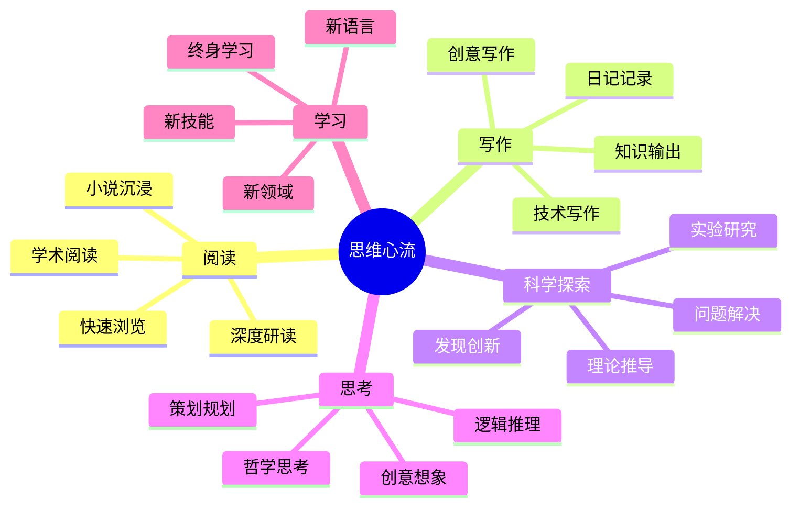
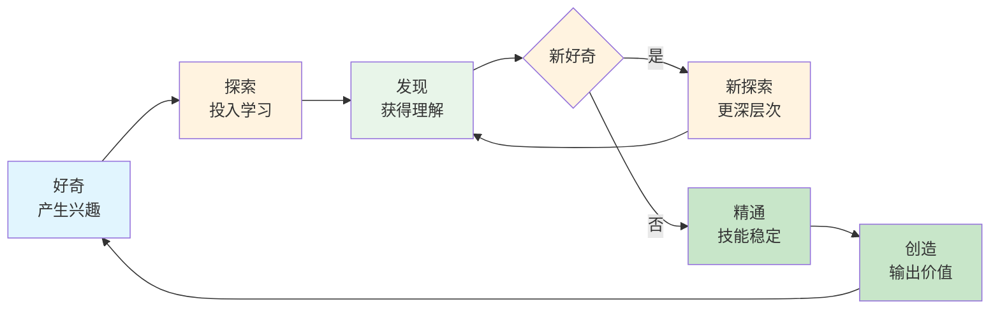

# 第5章 心流与思维

## 📍 章节定位

**全书位置**：第5章是心流理论的思维应用章节，回答"如何在思维活动中创造心流"，展示阅读、写作、思考、科学等精神活动如何成为最优体验。本章是心流在创造性工作中的核心应用。

**章节序列**：第5章（共10章），承接第4章的身体心流，为第6章的工作心流提供理论基础

**一句话定位**：
> 思维活动是人类最高级的心流入口——通过培养阅读、写作、思考、科学探索等精神技能，任何人都能在智力挑战中创造深刻体验，把"思考的痛苦"变成"创造的快乐"。

**核心问题**：
- 思维活动中如何创造心流？
- 阅读、写作、科学探索中的心流有何特点？
- 如何培养思维技能，把困难转化为乐趣？

---

## 🎯 核心观点（三层提取）

### 观点1：阅读是心流最易得的入口

| 层次 | 内容 |
|------|------|
| 📖 **表层（案例）** | 一个读者沉浸在小说中，忘记了周围的一切，忘记了时间，只记得故事在眼前展开。一个学者在读论文时，全部注意力集中在理解每个概念、推导每个结论，忘记了吃饭，忘记了睡觉。阅读时，世界缩小到书本的页面，只剩下文字、思想、想象。 |
| ⚙️ **中层（机制）** | 阅读的心流来自"思维与文本的对话"——当注意力完全投入文字，大脑在解读、理解、想象，与作者的思想进行对话。阅读的特点是：节奏可控（想快就快，想慢就慢）、反馈明确（理解了就能继续，不理解可以重读）、挑战可调（简单书快速读，困难书慢点读）。这些让阅读成为最容易进入心流的思维活动。 |
| 🔮 **底层（规律）** | 阅读是意识的"扩展器"——通过阅读，意识可以超越时空，体验他人的思想，探索未知的世界。在心流状态，读者与文本融为一体，作者的思想通过文字进入读者的意识，阅读不再是"被动的接收"，而是"主动的创造"。 |

**降维翻译**：
- **原文**：阅读是思维活动中心流最易得的入口
- **中学生懂**：读进去、读进去，忘了时间，忘了自己，只有书里的故事
- **奶奶懂**：看进去了，书里的人和事儿就活起来，你也跟着进去了

---

### 观点2：写作是心流最深刻的创造

| 层次 | 内容 |
|------|------|
| 📖 **表层（案例）** | 一个作家在写作时，灵感如泉涌，笔尖飞舞，忘记了自己在"写作"，只记得"故事在流出"。一个程序员在编码时，代码行行流动，逻辑清晰，忘记了时间，只记得"问题在被解决"。写作时，意识与行动融为一体，创造在发生。 |
| ⚙️ **中层（机制）** | 写作的心流来自"思维与行动的同步"——当思维与输出同步发生，没有"想→写"的延迟，而是"想到就是写出"。在这种状态，思维的速度和表达的速度匹配，意识完全投入创造，自我监控关闭。写作的特点是：即时反馈（写了就知道好不好）、明确目标（完成这篇文章）、挑战匹配（略高于当前能力）。 |
| 🔮 **底层（规律）** | 写作是意识的"外化器"——通过写作，把内在的思维变成外在的存在，让思想变得可见、可分享。在心流状态，写作不是"完成任务"，而是"创造意义"。每一次写作，都是一次意识的扩展：你通过文字，创造了新的思想。 |

**降维翻译**：
- **原文**：写作是思维活动中创造最深刻的心流体验
- **中学生懂**：写得顺手了，不想了，自然就出来了，写完自己也惊讶
- **奶奶懂**：写顺了，笔像自己会动，写出来的东西连自己都感动

---

### 观点3：科学探索的心流——追求真理的乐趣

| 层次 | 内容 |
|------|------|
| 📖 **表层（案例）** | 一个科学家在实验室里，观察到意想不到的现象，全部注意力集中在"这是为什么"。他忘记了吃饭，忘记了睡觉，只记得"要弄清楚"。当他找到答案的那一刻，那种快乐比任何外在奖励都深刻。这就是科学探索的心流。 |
| ⚙️ **中层（机制）** | 科学的心流来自"好奇与发现的节奏"——当好奇心驱动探索，每一个发现带来新的问题，形成"问题→探索→发现→新问题"的循环。在这种循环中，挑战永远在前面，技能永远在提升，心流可以无限持续。科学的特点是：终极目标（追求真理）、即时反馈（实验结果）、无限挑战（知识边缘永远在前）。 |
| 🔮 **底层（规律）** | 科学是人类最纯粹的心流形式——因为它的目标是"内在的"（追求真理），而非"外在的"（金钱、名声）。当一个人为真理而探索，他的动机是自足的——发现本身就是奖赏。这就是为什么科学家可以终其一生专注一个问题，因为问题本身就足够迷人。 |

**降维翻译**：
- **原文**：科学探索是追求真理的心流，发现本身就是奖赏
- **中学生懂**：搞懂一个问题，那感觉太爽了，比什么都强
- **奶奶懂**：弄明白个事儿，心里就像开了扇窗户，豁然开朗

---

### 观点4：思维活动的"内在反馈"机制

| 层次 | 内容 |
|------|------|
| 📖 **表层（案例）** | 读书时，你读到一个概念，突然"懂了"——这就是内在反馈。写作时，你写出一段话，觉得"这就对了"——这也是内在反馈。解数学题时，你找到答案，确认"没错"——还是内在反馈。思维活动的反馈不像运动那样外显，但同样清晰。 |
| ⚙️ **中层（机制）** | 思维活动的反馈来自"内在确认"——大脑知道自己是否理解、是否正确、是否满意。这种内在确认比外部反馈更直接、更持续。当你思考一个问题，你感觉到"越来越清楚"，这就是反馈；当你写作，你感觉到"越来越准确"，这也是反馈。关键是：学会"听见"这些内在反馈。 |
| 🔮 **底层（规律）** | 人类大脑有内置的"质量检测器"——它知道什么是好理解、什么是好思考、什么是好表达。当我们学会倾听这个内在检测器，就不需要外在的肯定。思维心流的核心是：让内在反馈成为主要动力，而非外在评价。 |

**降维翻译**：
- **原文**：思维活动有内在反馈机制，大脑知道什么是好理解、好思考
- **中学生懂**：你脑子里知道自己懂没懂、对不对，不用别人告诉你
- **奶奶懂**：心里明镜似的，事儿想通了就是想通了，骗不了自己

---

### 观点5：从"痛苦"到"乐趣"的转化

| 层次 | 内容 |
|------|------|
| 📖 **表层（案例）** | 一个学生一开始觉得数学很难，很痛苦。但当他开始享受"解出难题"的快乐，他开始挑战更难的题目。慢慢地，他从"怕数学"变成"爱数学"。这不是因为他变聪明了，而是因为他找到了数学的心流——每一个难题都是一个挑战，每一个解法都是一种创造。 |
| ⚙️ **中层（机制）** | 从痛苦到乐趣的转化，关键是"重新定义目标"——如果把目标从"完成任务"变成"提升技能"，困难就从"负担"变成"挑战"。当技能提升，原来的困难变简单，新的挑战出现，心流就可持续。这个过程需要：接受困难是成长的必要；相信自己能进步；专注于"我学到了什么"而非"我没做对什么"。 |
| 🔮 **底层（规律）** | 智力活动遵循"成长型思维"——当你相信能力可以提升，困难就成了挑战而非威胁。契克森米哈赖发现：那些在思维活动中找到心流的人，都有一个共同点——他们不怕困难，而是享受"克服困难"的过程。因为他们知道：困难=成长=快乐。 |

**降维翻译**：
- **原文**：从痛苦到乐趣的转化，关键是重新定义目标
- **中学生懂**：别想"这题好难"，想"这题解出来太爽"
- **奶奶懂**：难事儿就是长本事的机会，啃下来了，心里美

---

### 观点6：爱好与职业——思维心流的两种形式

| 层次 | 内容 |
|------|------|
| 📖 **表层（案例）** | 一个工程师，上班时写代码，只是完成任务；下班后弹吉他，却完全沉浸其中。为什么？因为弹吉他是他的"爱好心流"——完全为自己而弹；写代码是他的"职业心流"——为别人而写。当职业变成爱好（找到工作的意义），爱好变成职业（把爱好做成事业），心流就能最大化。 |
| ⚙️ **中层（机制）** | **爱好心流**：动机纯粹（为自己而做）、目标自足（做这件事本身就是目的）、压力最小（没有外在要求）。**职业心流**：动机可能混合（为自己+为别人）、目标可能外设（完成任务）、压力较大（有考核要求）。真正的幸福是：职业变成爱好——即使为别人工作，也为自己而享受。 |
| 🔮 **底层（规律）** | 心流在爱好和职业中的区别，本质上是"动机的纯粹性"。当一个人能为自己的热爱而工作，而不仅仅为生存而工作，职业就变成了心流。这就是为什么"找到热爱的工作"是幸福的最高目标之一——因为它把生存需要和心流体验合二为一。 |

**降维翻译**：
- **原文**：爱好心流纯粹为自己，职业心流可能混合动机
- **中学生懂**：干自己喜欢的事儿最爽，干工作如果不爱干就累
- **奶奶懂**：能把爱好当工作干，那日子就过美了

---

### 观点7：培养思维技能——从好奇到精通

| 层次 | 内容 |
|------|------|
| 📖 **表层（案例）** | 一个孩子对恐龙好奇，开始读恐龙书。读完觉得不够，又看纪录片，又去博物馆，甚至自己写恐龙故事。几年后，他成了"恐龙专家"。这个过程不是别人强迫的，而是好奇心驱动的。当好奇心变成精通，爱好变成了技能，技能又创造了新的心流体验。 |
| ⚙️ **中层（机制）** | 培养思维技能的循环是：好奇→探索→发现→新好奇→新探索→新发现。在这个循环中，技能不断提升，挑战不断升级，心流可以持续多年。关键在于：**保护好奇心**——不要让外在压力或比较扼杀好奇；**支持探索**——允许试错，允许走弯路；**庆祝发现**——每一次突破，都给自己肯定。 |
| 🔮 **底层（规律）** | 思维技能的培养遵循"兴趣驱动"而非"任务驱动"。当一个人被内在兴趣驱动，他能投入数百小时而不觉得累；当一个人被外在任务驱动，几十小时就觉得痛苦。培养思维技能的关键是：找到那些让你"忘记时间"的事情，然后投入时间去精通。 |

**降维翻译**：
- **原文**：培养思维技能关键是保护好奇心，让它驱动探索和发现
- **中学生懂**：喜欢啥就钻研啥，越钻越有意思，越有意思越想钻
- **奶奶懂**：人这一辈子，得有件自己真心喜欢的事儿，越活越有滋味

---

### 观点8：终身学习的心流——无限的可能性

| 层次 | 内容 |
|------|------|
| 📖 **表层（案例）** | 一位80岁的老人，还在学习编程。他说："学习让我觉得活着。"对他来说，学习不是任务，而是心流——每一个新概念都是挑战，每一个小程序都是创造。他没有停止学习的年龄，因为他知道：学习=心流=快乐。 |
| ⚙️ **中层（机制）** | 终身学习的心流来自"无限的可能性"——知识是无限的，因此挑战永远在前。当你掌握了当前水平的内容，总有新的领域可以探索。这就是为什么终身学习的人不会感到无聊——他们的"游戏"永远有新的关卡。关键心态：把学习看作"探索"而非"任务"。 |
| 🔮 **底层（规律）** | 人类大脑的可塑性是终生的——无论多大年龄，都能学习新技能、创造新连接。当一个人保持学习，他的大脑就保持年轻，他的心流就持续不断。这就是契克森米哈赖的终极建议：培养一个能终身投入的兴趣，让它成为你的心流之源。 |

**降维翻译**：
- **原文**：终身学习是持续的心流，知识无限，挑战永远在前
- **中学生懂**：学习是一辈子的事，总有新东西可以学，越学越有意思
- **奶奶懂**：活到老学到老，脑子就不生，人就年轻

---

## 💬 金句库

### 原书金句
> "阅读是意识扩展器，通过阅读可以超越时空。"

> "写作是意识的外化器，把内在思维变成外在存在。"

> "科学探索的心流是最纯粹的，发现本身就是奖赏。"

> "大脑有内置的质量检测器，它会告诉你什么是好思考。"

> "从痛苦到乐趣，关键是重新定义目标。"

> "爱好心流纯粹为自己，职业心流需要找到工作的意义。"

### 降维金句
> "读进去，书里的人和事儿就活起来了。"

> "写顺了，笔像自己会动。"

> "搞懂个事儿，心里像开了扇窗。"

> "你脑子知道自己懂没懂，骗不了自己。"

> "别想这题好难，想这题解出来太爽。"

> "把爱好当工作干，日子就过美了。"

> "喜欢啥就钻研啥，越钻越有意思。"

## 🔗 当下映射

### 💰 财富应用

| 场景 | 具体行动 | 思维心流要素 | 预期效果 |
|------|----------|--------------|----------|
| 投资研究 | 深度分析+写研报 | 好奇+挑战+即时反馈 | 从焦虑变专注 |
| 技能学习 | 拆分技能+每日练习 | 挑战匹配+目标明确 | 学习效率翻倍 |

### 💼 职场应用

| 场景 | 具体行动 | 思维心流方法 | 适用职级 |
|------|----------|--------------|----------|
| 深度工作 | 关闭通知+思考时间块 | 内在反馈+专注 | 全职级 |
| 学习新技能 | 设定小挑战+记录进步 | 好奇驱动+即时反馈 | 全职级 |
| 创造性工作 | 把任务当创作 | 自成目标+自我肯定 | 创意类 |

### 🏠 生活应用

| 场景 | 具体行动 | 可行性 | 见效时间 |
|------|----------|--------|----------|
| 阅读 | 选择感兴趣的书+做笔记 | 高 | 即时 |
| 写作 | 设定小目标+记录灵感 | 中 | 1周 |
| 学习新爱好 | 从好奇开始+持续练习 | 高 | 1个月 |

### 72小时应用计划
1. **今天**：选择一个思维活动（读书、写作、学新东西），投入30分钟。
2. **明天**：在活动中关注内在反馈，记录"我觉得懂了/我想通了"的时刻。
3. **本周**：每天15分钟，把学习从"任务"变成"探索"。

---

## 🕸️ 章节关联

### 向上：整书关联
- **核心问题**：本章回答"如何在思维活动中创造心流"——思维活动是最深刻的心流形式
- **全书定位**：第5章是思维心流详解，为第6章的工作心流提供理论基础

### 横向：章节序列

| 章节编号 | 章节标题 | 关联类型 | 连接描述 |
|----------|----------|----------|----------|
| 第4章 | 心流与身体 | 对比 | 第4章身体心流，第5章思维心流，两种路径 |
| 第6章 | 心流与工作 | 应用 | 第5章思维技能在第6章工作中应用 |

### 跨书关联

| 书籍 | 概念 | 关系 | 备注 |
|------|------|------|------|
| [[思考快与慢-丹尼尔·卡尼曼-拆解记录]] | 系统2 | 深化 | 思维心流是系统2的极致专注 |
| [[深度工作-卡尔·纽波特-拆解记录]] | 深度工作 | 呼应 | 都是关于专注和创造 |
| [[当下的力量-埃克哈特·托利-拆解记录]] | 觉知 | 呼应 | 思维心流也需要放下自我意识 |

### 思维心流类型图

### 思维心流循环

---

## ❓ 问答设计

### Q1: 为什么说阅读是思维心流最易得的入口？（理解型）
**答案要点**:
- 阅读的节奏可控（想快就快，想慢就慢）
- 反馈明确（理解了就能继续，不理解可以重读）
- 挑战可调（简单书快速读，困难书慢点读）
- 阅读让意识超越时空，体验他人的思想
- 在心流状态，读者与文本融为一体

### Q2: 写作时如何进入心流状态？（应用型）
**答案要点**:
- 选择你真正感兴趣的话题
- 设定明确的小目标（今天写500字）
- 创造即时反馈（写完就读一遍，给自己肯定）
- 接受"不完美的初稿"，先写后改
- 当思维与表达同步，心流就会发生

### Q3: 科学探索的心流有什么独特之处？（理解型）
**答案要点**:
- 目标纯粹：追求真理，而非金钱或名声
- 终极挑战：知识边缘永远在前
- 无限循环：问题→探索→发现→新问题
- 发现本身就是奖赏，不需要外在肯定
- 可以持续终生，永不无聊

### Q4: 什么是"内在反馈"？如何感知它？（应用型）
**答案要点**:
- 内在反馈是大脑对自己理解、思考质量的确认
- 感知方法：注意"我觉得懂了/我想通了/这就对了"的时刻
- 培养方法：多做自我检查（"我真的理解了吗？"）、多做反思
- 相信自己的判断，不依赖外在评价

### Q5: 如何把学习从痛苦转化为乐趣？（应用型）
**答案要点**:
- 重新定义目标：从"完成任务"到"提升技能"
- 把困难重新框架：从"负担"到"挑战"
- 关注进步而非完美：记录"我今天学会了什么"
- 培养成长型思维：相信能力可以提升
- 找到学习的乐趣：在"弄明白"的瞬间感受快乐

### Q6: 爱好心流和职业心流有什么区别？（对比型）
**答案要点**:

| 维度 | 爱好心流 | 职业心流 |
|------|----------|----------|
| 动机 | 纯粹为自己 | 可能混合（自己+别人） |
| 目标 | 自足（做这件事本身就是目的） | 可能外设（完成任务） |
| 压力 | 最小 | 较大（有考核要求） |
| 纯粹性 | 最高 | 需要寻找意义 |

### Q7: 如何培养思维技能？（综合型）
**答案要点**:
- 保护好奇心：找到让你忘记时间的事情
- 支持探索：允许试错，允许走弯路
- 庆祝发现：每一次突破，都给自己肯定
- 投入时间：技能需要积累，心流会随之增强
- 保持循环：好奇→探索→发现→新好奇

### Q8: 终身学习为什么能持续创造心流？（理解型）
**答案要点**:
- 知识是无限的，挑战永远在前
- 大脑的可塑性是终生的，任何年龄都能学习
- 每一个新领域都是新的"游戏关卡"
- 学习从"任务"变成"探索"
- 心流可以持续，因为总有新的好奇

### Q9: 在AI时代，为什么思维心流仍然重要？（综合型）
**答案要点**:
- AI能输出结果，但只有人类能享受思考的过程
- AI能解决问题，但只有人类能感受发现的快乐
- AI能生成内容，但只有人类能体验创造的兴奋
- 思维心流是人类独有的价值
- AI时代，人类更需要在思维活动中找到意义

### Q10: 如何在阅读中创造心流？（应用型）
**答案要点**:
- 选择你真正感兴趣的书
- 创造环境：安静、舒适、无干扰
- 设定小目标：今天读30页或1章
- 做笔记：写下你的理解和想法
- 注意内在反馈："我理解了吗？""我有新想法了吗？"
- 不要追求速度，享受理解的过程

### Q11: 如何在写作中创造即时反馈？（应用型）
**答案要点**:
- 写完一段就读一遍，检查是否清晰
- 给自己设定小目标（每100字检查一次）
- 记录灵感，让自己看到进步
- 不求完美，先求完成，再修改
- 关注"我写得顺畅吗？"而非"别人会怎么评价"

### Q12: 为什么科学家能终身投入一个问题？（理解型）
**答案要点**:
- 好奇心驱动：问题本身足够迷人
- 目标纯粹：追求真理，而非外在回报
- 无限挑战：一个问题的解答会带来新问题
- 发现的快感：每一次突破都带来深刻快乐
- 意义感：感受到自己为人类知识做贡献

### Q13: 如何把职业变成爱好？（应用型）
**答案要点**:
- 找到工作的意义：我为什么要做这个？
- 把任务重新框架：这不是"工作"，这是"创造"
- 设定个人目标：不是为了老板，而是为了自己成长
- 创造小挑战：让日常工作也变得有趣
- 寻找工作中的"心流时刻"并放大它们

### Q14: 如何保护好奇心？（应用型）
**答案要点**:
- 不要让比较扼杀好奇：别人学得快，不代表你学得慢
- 允许走弯路：试错是学习的一部分
- 给自己自由：探索感兴趣的方向，即使看起来"没用"
- 记录你的好奇：写下你的问题、你的猜想
- 庆祝每一次发现：无论大小

### Q15: 如何判断自己进入了思维心流？（应用型）
**答案要点**:
**身体感觉**：
- 忘记时间
- 忘记周围环境
- 身体放松或感觉不到身体

**心理状态**：
- 杂念消失
- 感到快乐、充实
- 想要继续，不想停下

**事后反馈**：
- 回忆活动时感到愉悦
- 想要重复这个体验
- 有新的想法或理解

---
