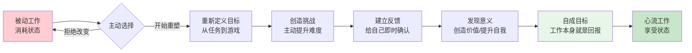

# 第7章 工作中的心流

## 📍 章节定位

**全书位置**：本章是心流理论在工作场景的深度应用，回答"如何在占据人生最大时间的活动中找到意义"，展示从"被迫工作"到"主动创造"的转化路径。

**一句话定位**：
> 工作不是谋生手段，而是创造意义的场域——通过重新定义目标、主动创造挑战、建立反馈机制，任何人都能把"上班"变成"心流时间"。

---

## 🎯 核心观点（三层提取）

### 观点1：工作是心流体验最丰富的来源

| 层次 | 内容 |
|------|------|

**降维翻译**：
- **原文**：工作具备心流产生的天然条件
- **降维**：干顺了的工作，比啥都爽——目标清晰、做完有反馈、越干越溜
- **类比**：工作就像游戏关卡，有人觉得无聊，有人玩到上瘾

---

### 观点2：工作痛苦的根源——被动性

| 层次 | 内容 |
|------|------|

**降维翻译**：
- **原文**：被动性是工作痛苦的根源
- **降维**：被动干活最累，不是活累，是心累
- **类比**：同样是跑步，自己想跑是锻炼，被人追着跑是逃命

---

### 观点3：重塑工作——从"任务"到"游戏"

| 层次 | 内容 |
|------|------|

**降维翻译**：
- **原文**：通过重新定义目标、创造挑战、建立反馈来重塑工作
- **降维**：给工作加点"游戏感"——自己定目标、找挑战、给奖励
- **类比**：工作不是任务列表，是游戏关卡，你是玩家

---

### 观点4：工作的意义——从"谋生"到"创造"

| 层次 | 内容 |
|------|------|

**降维翻译**：
- **原文**：通过发现工作的意义来增强心流体验
- **降维**：工作能帮到人、能让自己更强，心里就踏实
- **类比**：同样的砖，有人说是"搬砖"，有人说是"盖教堂"

---

### 观点5：心流工作的终极——自成目标

| 层次 | 内容 |
|------|------|

**降维翻译**：
- **原文**：自成目标是工作的终极心流状态
- **降维**：干到"这事本身就爽"，不用老板夸、不用钱多也愿意干
- **类比**：打游戏不是为了通关奖励，是玩游戏本身就很爽

---

## 💬 金句库

### 原书金句
> "工作可以成为心流体验最丰富的来源——比休闲时光更多。"

> "工作痛苦的根源不是工作本身，而是被动性——被动接受、被动等待、被动消耗。"

> "重塑工作的关键是把外在目标转化为内在目标。"

> "自成目标是工作的终极境界——做事本身就是回报。"

> "工作中找到意义的人，比赚更多钱的人更幸福。"

### 降维金句
> "干顺了的工作，比啥都爽——目标清晰、做完有反馈、越干越溜。"

> "被动干活最累，不是活累，是心累。"

> "给工作加点'游戏感'——自己定目标、找挑战、给奖励。"

> "同样的砖，有人说是'搬砖'，有人说是'盖教堂'——差别在意义。"

> "干到'这事本身就爽'，不用老板夸也愿意干——这就是自成目标。"

> "工作不是任务列表，是游戏关卡，你是玩家。"

> "AI能做你的工作，但只有你能体验工作的心流。"

## 🔗 当下映射

### 💰 财富应用

| 场景 | 具体行动 | 心流要素 | 预期效果 |
|------|----------|----------|----------|
| 副业创业 | 选择有挑战但可完成的项目 | 挑战匹配+明确目标 | 副业从负担变成享受 |
| 技能投资 | 设定小目标+每日练习+即时记录 | 即时反馈+技能提升 | 学习效率提升3倍 |
| 投资研究 | 深度研究一家公司+写分析笔记 | 专注+意义感 | 研究变成享受而非负担 |

### 💼 职场应用

| 场景 | 具体行动 | 心流要素 | 适用人群 |
|------|----------|----------|----------|
| 日常任务 | 把任务变成"提升效率"的挑战 | 挑战匹配+即时反馈 | 全职级 |
| 会议时间 | 聚焦"我能贡献什么" | 目标明确+意义感 | 中层以上 |
| 学习新技能 | 设定里程碑+每日练习+记录进步 | 技能提升+即时反馈 | 全职级 |
| 处理邮件 | 批量处理+计时挑战 | 时间消失+挑战匹配 | 全职级 |
| 深度工作 | 关闭通知+90分钟专注块 | 专注+目标清晰 | 知识工作者 |

### 🏠 生活应用

| 场景 | 具体行动 | 可行性 | 见效时间 |
|------|----------|--------|----------|
| 家务整理 | 播放音乐+计时挑战+完成奖励 | 高 | 即时 |
| 运动健身 | 设定小目标+记录数据+社群分享 | 高 | 即时 |
| 阅读写作 | 设定阅读目标+做笔记输出+发表分享 | 高 | 1周 |

### 72小时应用计划
1. **今天**：检查你现在的工作——缺了哪几个心流要素？（目标？反馈？挑战？意义？）
2. **明天**：选择一个要素（如"即时反馈"），设计一个方法让它出现在你的工作中
3. **本周**：创造一个"心流时间块"——90分钟，关闭干扰，按自己的方式工作，完成后给自己奖励

---

## 🕸️ 章节关联

### 向上：整书关联
- 本章回答"如何在工作这个最大时间的活动中创造心流并找到意义"
- 与第3章（心流要素）形成理论-应用闭环

### 横向：章节序列

| 章节 | 关联类型 | 连接描述 |
|------|----------|----------|
| 第3章-心流的要素 | 基础 | 八要素在工作场景的具体应用 |
| 第6章-心流与工作 | 深化 | 本章聚焦"如何找到意义"的深度解析 |
| 第8章-心流与人际 | 延伸 | 工作中的人际心流 |

### 跨书关联

| 书籍 | 概念 | 关系 | 备注 |
|------|------|------|------|
| [[深度工作-拆解记录]] | 深度工作 | 呼应 | 纽波特讲专注，契克森米哈赖讲心流——同一本质的不同表达 |
| [[被讨厌的勇气-岸见一郎-拆解记录]] | 课题分离 | 互补 | 阿德勒的"专注自己的课题"与心流的"自成目标"相通 |
| [[干法-稻盛和夫-拆解记录]] | 工作的意义 | 深化 | 稻盛和夫讲"工作是修行"，与"工作即心流"异曲同工 |

### 工作心流转化路径图

---

## ❓ 问答设计

### Q1: 为什么说工作比休闲更容易产生心流？（理解型）
**认知层次**: 理解
**难度**: 中
**答案要点**:
- 工作天然具备心流四要素：目标清晰、反馈及时、难度可调、价值感强
- 休闲往往目标模糊、反馈缺失、没有挑战
- 研究数据支持：工作时的心流体验比休闲时更频繁

### Q2: 工作痛苦的根源是什么？如何解决？（分析型）
**认知层次**: 分析
**难度**: 中
**答案要点**:
- 根源是"被动性"——被动接受任务、被动等待评价、被动消耗时间
- 被动状态消耗精神能量处理"我不想做"的情绪
- 解决方法：主动重塑——重新定义目标、创造挑战、建立反馈

### Q3: 什么是"重塑工作"的三步法？如何在日常工作中应用？（应用型）
**认知层次**: 应用
**难度**: 中
**答案要点**:
1. **重新定义目标**：从"完成任务"变成"提升技能"
2. **创造挑战**：在有限范围内寻找突破点
3. **主动反馈**：自己给自己肯定
- 应用示例：处理邮件时设定"30分钟清空收件箱"的目标，完成后打勾确认

### Q4: "自成目标"是什么意思？为什么它是工作的终极境界？（评价型）
**认知层次**: 评价
**难度**: 高
**答案要点**:
- 自成目标：做事本身就是回报，不需要外在奖励
- 这是心流的最高境界——工作从"手段"变成"目的"
- 外在动机（薪资、晋升）会边际递减，内在动机则越用越强
- 达到这个境界的人，工作本身就是享受

### Q5: 如何在AI时代保持工作的心流体验？（综合型）
**认知层次**: 综合
**难度**: 高
**答案要点**:
- AI能做任务，但只有人类能体验心流
- 重复性工作交给AI，把精力放在创造性工作上
- 心流的四个层次AI无法替代：目标设定、意义发现、自我提升、价值创造
- 2026年最稀缺的能力：在任何工作中创造心流八要素

### Q6: 同样的工作，为什么有人痛苦有人享受？（分析型）
**认知层次**: 分析
**难度**: 中
**答案要点**:
- 差别在于"意义感"——同样的砖，有人说是"搬砖"，有人说是"盖教堂"
- 享受的人找到了工作的三层意义：创造价值、提升自我、贡献社会
- 痛苦的人只看到外在奖励（薪资），一旦奖励不足就失去动力
- 关键是主动发现意义，而不是等待工作本身变得有意义

---
