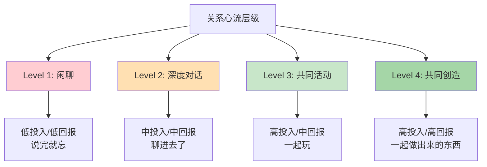
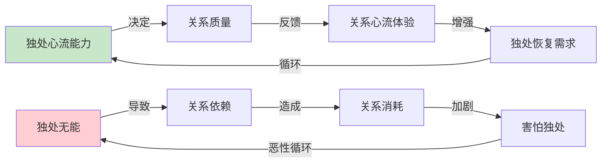

# 第8章 人际中的心流

## 📍 章节定位

**全书位置**：本章探讨心流在人际关系中的应用——如何在家庭、朋友、社区中创造心流体验，把关系从消耗变成滋养，展示从"独自心流"到"共同心流"的扩展路径。

**一句话定位**：
> 人际关系不是精神能量的消耗场，而是心流体验的放大器——当两个人的注意力聚焦于同一件事，心流就从"我的"变成"我们的"。

---

## 🎯 核心观点（三层提取）

### 观点1：关系心流的本质——共同注意

| 层次 | 内容 |
|------|------|

**降维翻译**：
- **原文**：共同注意产生关系心流
- **降维**：两个人一心一意干一件事，比一个人干更爽——时间忘得更快
- **类比**：一个人唱歌是爱好，两个人合唱是享受，一整个合唱团是震撼

---

### 观点2：孤独的两面性

| 层次 | 内容 |
|------|------|

**降维翻译**：
- **原文**：独处的能力决定关系的质量
- **降维**：一个人待不住的人，跟谁在一起都累
- **类比**：电池需要单独充电，人需要独处蓄能，才能在关系中发光

---

### 观点3：家庭心流的创造

| 层次 | 内容 |
|------|------|

**降维翻译**：
- **原文**：家庭心流需要共同目标和互相支持
- **降维**：一家人一起干活、一起玩，感情就深；各玩各的手机，同屋异梦
- **类比**：家庭像一支乐队，各玩各的是噪音，合拍配合是交响乐

---

### 观点4：社交心流的质量层级

| 层次 | 内容 |
|------|------|

**降维翻译**：
- **原文**：社交心流质量取决于互动深度
- **降维**：聊进去了，时间就忘了，心里也美；聊完了啥也没留下，就是瞎聊
- **类比**：社交像吃饭，零食填肚子，正餐才养人

---

### 观点5：关系心流的最高形式——共同创造

| 层次 | 内容 |
|------|------|

**降维翻译**：
- **原文**：共同创造是关系心流的最高形式
- **降维**：一起做出来的东西，比一起吃过的饭，更让人记得住
- **类比**：一起盖房子的人，比一起看电影的人，关系更铁

---

## 💬 金句库

### 原书金句
> "关系心流是我们合一的状态——自我意识消失，只剩下'我们'。"

> "孤独的痛苦来自精神熵——没有外部输入时，意识容易陷入负面循环。"

> "家庭心流是共同成长，每个人都变得更完整。"

> "社交心流的本质是思想共振——当两个人的思维同步、情感同频，心流就发生了。"

> "共同创造把关系从消费型变成生产型——一起做出来的东西，比一起吃过的饭更持久。"

### 降维金句
> "两个人一心一意干一件事，比一个人干更爽——时间忘得更快。"

> "一个人待不住的人，跟谁在一起都累。"

> "一家人一起干活、一起玩，感情就深；各玩各的手机，同屋异梦。"

> "聊进去了，时间就忘了，心里也美。"

> "一起做出来的东西，比一起吃过的饭，更让人记得住。"

> "社交像吃饭，零食填肚子，正餐才养人。"

> "家庭像一支乐队，各玩各的是噪音，合拍配合是交响乐。"

> "电池需要单独充电，人需要独处蓄能，才能在关系中发光。"

## 🔗 当下映射

### 💰 财富应用

| 场景 | 具体行动 | 心流要素 | 预期效果 |
|------|----------|----------|----------|
| 夫妻理财 | 一起设定财务目标、一起复盘账单、一起庆祝里程碑 | 共同目标+即时反馈 | 理财从争吵变成协作 |
| 合伙创业 | 明确分工、互补技能、定期复盘 | 共同创造+互相呼应 | 创业从压力变成享受 |
| 投资社群 | 深度讨论、共同研究、分享发现 | 思想共振+即时反馈 | 投资从孤独变成共鸣 |

### 💼 职场应用

| 场景 | 具体行动 | 心流要素 | 适用人群 |
|------|----------|----------|----------|
| 团队协作 | 明确共同目标、互相补位、即时反馈 | 共同目标+互相呼应 | 全员 |
| 深度会议 | 关掉手机、聚焦议题、人人发言 | 共同注意+即时反馈 | 会议组织者 |
| 师徒关系 | 共同完成项目、即时指导、一起复盘 | 共同创造+互相呼应 | 新人+老员工 |
| 跨部门合作 | 找到共同利益、建立信任、共享成果 | 共同目标+互相呼应 | 中层以上 |

### 🏠 生活应用

| 场景 | 具体行动 | 可行性 | 见效时间 |
|------|----------|--------|----------|
| 家庭聚餐 | 关掉电视、放下手机、轮流分享今天最棒的事 | 高 | 即时 |
| 夫妻约会 | 一起做件没做过的事（学陶艺、攀岩、烹饪） | 中 | 1-2次 |
| 朋友聚会 | 把闲聊变成深度对话（每人分享一个困惑） | 高 | 即时 |
| 亲子活动 | 一起搭乐高、一起画画、一起运动 | 高 | 即时 |
| 独处时间 | 阅读、写作、运动、冥想——主动创造心流 | 高 | 即时 |

### 72小时应用计划
1. **今天**：选择一段关系（家人/朋友/同事），设计一个"共同心流"活动（一起做饭、一起运动、一起讨论一个深度话题）
2. **明天**：练习独处心流——给自己30分钟，不看手机，做一件需要专注的事（阅读/写作/运动）
3. **本周**：把一次社交活动升级——把闲聊变成深度对话，把消费变成创造

---

## 🕸️ 章节关联

### 向上：整书关联
- 本章回答"如何在人际关系中创造心流，把关系从消耗变成滋养"
- 与第3章（心流要素）形成理论-应用闭环：八要素在关系场景的具体应用

### 横向：章节序列

| 章节 | 关联类型 | 连接描述 |
|------|----------|----------|
| 第3章-心流的要素 | 基础 | 八要素在关系场景的具体应用 |
| 第7章-工作中的心流 | 平行 | 工作中的人际心流 |
| 第9章-挫折中的心流 | 延伸 | 关系困境中的心流创造 |

### 跨书关联

| 书籍 | 概念 | 关系 | 备注 |
|------|------|------|------|
| [[被讨厌的勇气-岸见一郎-拆解记录]] | 课题分离 | 互补 | 阿德勒讲"专注自己的课题"，契克森米哈赖讲"专注共同目标"——一个是独立，一个是融合 |
| [[亲密关系-罗兰·米勒-拆解记录]] | 亲密关系 | 呼应 | 米勒讲关系科学，契克森米哈赖讲关系心流——理论与实践的结合 |
| [[非暴力沟通-章节拆解/_导航]] | 深度沟通 | 方法 | 非暴力沟通是创造社交心流的具体方法 |

### 关系心流层级图

### 独处与关系平衡图

---

## ❓ 问答设计

### Q1: 为什么说"一个人待不住的人，跟谁在一起都累"？（理解型）
**认知层次**: 理解
**难度**: 中
**答案要点**:
- 独处时精神熵增加，需要外部输入来稳定意识
- 不能和自己相处的人，会把关系当作逃避孤独的工具
- 关系变成"依赖"而非"选择"，消耗双方的精神能量
- 能在独处中创造心流的人，关系是"锦上添花"而非"雪中送炭"

### Q2: 关系心流需要哪三个条件？如何在日常生活中创造？（应用型）
**认知层次**: 应用
**难度**: 中
**答案要点**:
- **共同目标**：明确一起做什么（一起做饭、一起运动、一起解决问题）
- **互相呼应**：彼此回应、互相补位（你切菜、我炒菜；你传球、我接球）
- **节奏同步**：步调一致（说话节奏、行动节奏、情绪节奏）
- 日常应用：家庭聚餐时放下手机、朋友聚会时设计共同活动、夫妻约会时一起尝试新事物

### Q3: 为什么"共同创造"比"共同消费"更能产生心流？（分析型）
**认知层次**: 分析
**难度**: 中
**答案要点**:
- 共同消费（吃饭、看电影）目标模糊、反馈弱、挑战低
- 共同创造（做项目、解决问题）目标清晰、反馈强、挑战可调
- 共同创造满足"意义需求"——一起做有价值的事
- 共同创造的回忆更持久——这是"我们一起做出来的"

### Q4: 如何把闲聊升级为深度对话？（应用型）
**认知层次**: 应用
**难度**: 中
**答案要点**:
- **准备话题**：每人分享一个困惑或一个最近学到的东西
- **放下手机**：创造专注的对话环境
- **深度提问**：不只问"怎么样"，问"为什么""你怎么想"
- **真诚回应**：分享自己的真实想法，不做表面应答
- **控制时间**：30-60分钟的深度对话，比3小时的闲聊更有价值

### Q5: 社交软件时代，如何保持关系的深度？（综合型）
**认知层次**: 综合
**难度**: 高
**答案要点**:
- 社交软件增加连接数量，但降低连接质量
- 深度关系需要：共同注意、共同时间、共同创造
- 策略：用社交软件维持弱关系，用线下活动培养深关系
- 标准：能一起进入心流的关系，才是真正的关系
- 2026年最稀缺的不是社交能力，是深度相处的能力

### Q6: 家庭心流如何创造？有什么具体方法？（应用型）
**认知层次**: 应用
**难度**: 中
**答案要点**:
- **共同活动**：一起做饭、一起游戏、一起运动、一起旅行
- **放下手机**：真正的在一起，不是物理在场、精神缺席
- **互相支持**：不互相批评、不互相打扰、给对方空间
- **即时反馈**：互相肯定、一起庆祝、分享感受
- **创造传统**：每周固定的家庭活动（周五电影夜、周日户外活动）

---
