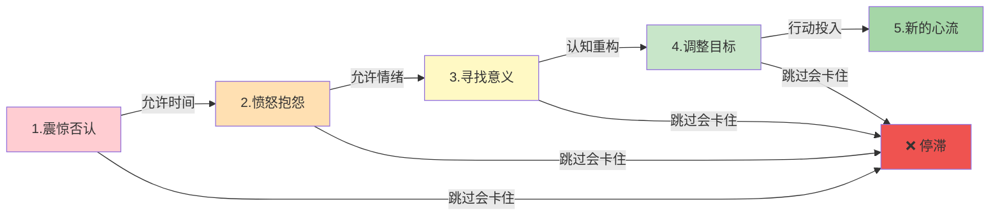
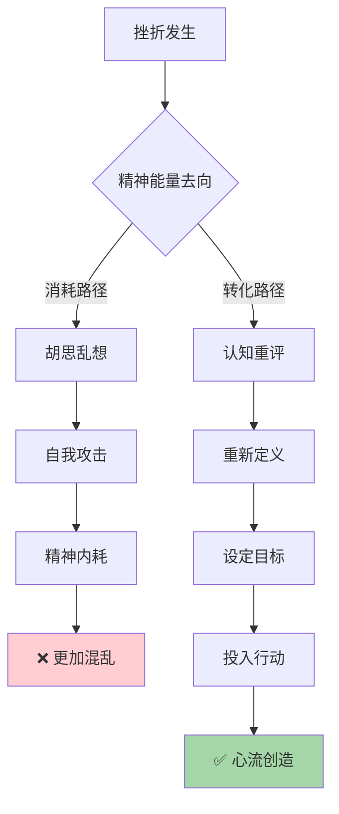
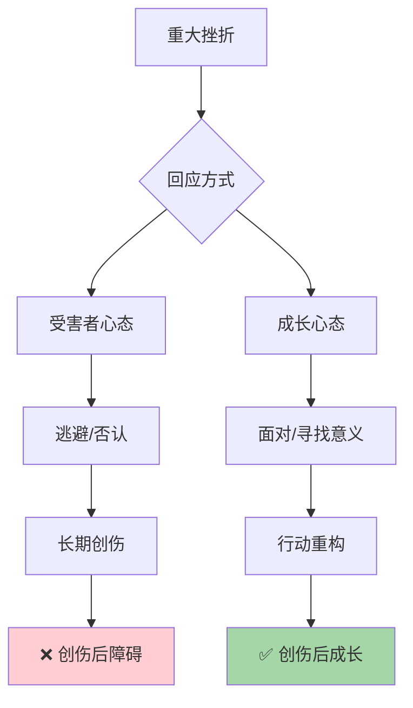

# 第9章 挫折中的心流

## 📍 章节定位

**全书位置**：本章是心流理论的终极应用——当一切顺利时进入心流是能力，当逆境重重时创造心流是境界。探讨如何在困境中把精神熵转化为意识有序，把挫折转化为成长的力量。

**一句话定位**：
> 真正的心流高手不是在顺境中"顺便进入心流"，而是在逆境中"主动创造心流"——越难的时候，越能看出一个人能不能稳住。

---

## 🎯 核心观点（三层提取）

### 观点1：挫折是心流的终极考验

| 层次 | 内容 |
|------|------|
| 📖 **表层（案例）** | 有人失业后一蹶不振，整天刷手机消磨时间；有人失业后把它当成"重新选择人生"的机会，学习新技能、尝试新方向。同样的困境，结局天差地别。 |
| ⚙️ **中层（机制）** | 挫折时，意识最容易失序（精神熵达到峰值）。负面情绪、自我怀疑、胡思乱想把精神能量消耗殆尽。但这恰恰是考验心流能力的最佳时机——能在混乱中创造有序，才是真正掌握了心流。 |
| 🔮 **底层（规律）** | 心流的本质是"在混乱中建立秩序"。正常情况下建立秩序不难，但在高精神熵状态下建立秩序，是人类最高级的认知能力——这就是"韧性"的本质。 |

**降维翻译**：
- **原文**：挫折是心流的终极考验
- **降维**：越难的时候，越能看出一个人能不能稳住
- **类比**：平静的湖面谁都能划船，大风大浪还能稳住舵的才是真船长

---

### 观点2：把挫折重新定义为挑战

| 层次 | 内容 |
|------|------|
| 📖 **表层（案例）** | 失业了，有人陷入"我被抛弃了"的受害者心态；有人把它当作"这是我可以重新选择的机会"。生病了，有人抱怨"为什么是我"；有人把它当作"重新认识身体"的契机。同样的客观处境，主观体验完全不同。 |
| ⚙️ **中层（机制）** | 挫折转化为心流的关键是"认知重评"——把"我被击倒了"变成"这是我面临的挑战"。心态变了，注意力就变了，体验就变了。注意力从"为什么是我"转向"我能做什么"，精神能量从消耗变成创造。 |
| 🔮 **底层（规律）** | 心流的核心是"主动控制体验"。你无法控制发生什么，但永远能控制"如何回应"。这个控制权是人的终极自由——在最困难的情况下，你也总能选择态度。 |

**降维翻译**：
- **原文**：把挫折转化为心流的关键是重新定义
- **降维**：事儿发生了改不了，但你怎么想能改
- **类比**：生活发牌你控制不了，怎么打这手牌你说了算

---

### 观点3：创伤后的成长

| 层次 | 内容 |
|------|------|
| 📖 **表层（案例）** | 经历过重大挫折的人，往往变得更坚强、更深刻、更懂得珍惜。失去工作后发现真正热爱的事，失去健康后学会真正照顾自己，失去亲人后更珍惜眼前人。这种成长不是回到原来的状态，而是成为更完整的自己。 |
| ⚙️ **中层（机制）** | 创伤后的成长是心流的最高形式——在最深的精神熵中，创造了最高级的意识有序。三个步骤：1.接纳（承认发生了）；2.意义化（找到这件事的意义）；3.行动（用新的理解去生活）。 |
| 🔮 **底层（规律）** | 心流理论告诉我们：混乱不是终点，是契机。尼采说"杀不死我的让我更强大"，心流理论解释了为什么——在混乱中创造有序的过程，本身就是成长。 |

**降维翻译**：
- **原文**：创伤后的成长是心流的最高形式
- **降维**：熬过去了，你就更强了
- **类比**：竹子被压弯后弹起来，比原来跳得更高

---

### 观点4：精神熵的转化法则

| 层次 | 内容 |
|------|------|
| 📖 **表层（案例）** | 同样的能量，可以变成焦虑（胡思乱想），也可以变成行动（解决问题）。失恋了，有人反复刷前任动态、深夜痛哭；有人把能量投入运动、学习、创作。能量守恒，但方向决定结果。 |
| ⚙️ **中层（机制）** | 精神能量是有限的，但方向可以选择。挫折产生的负面情绪是"高势能"，可以被消耗（发泄、逃避），也可以被转化（建设性行动）。心流就是把精神熵的势能，转化为有序行动的动能。 |
| 🔮 **底层（规律）** | 熵增是宇宙的基本规律，但生命是"负熵系统"——人类可以在混乱中创造有序。这是人之所以为人的核心能力，也是心流的本质：用有限的注意力，在无限的信息中创造意义。 |

**降维翻译**：
- **原文**：精神熵的势能可以转化为有序行动的动能
- **降维**：难受的能量不用掉，就会变成内伤；用掉了，就是动力
- **类比**：水往低处流是天性，但修个水电站就能发电

---

### 观点5：困境心流的五个阶段

| 层次 | 内容 |
|------|------|
| 📖 **表层（案例）** | 研究发现，从重大挫折中恢复并成长的人，都经历了类似的阶段：震惊否认→愤怒抱怨→寻找意义→调整目标→新的投入。跳过任何一个阶段都会卡住，走过所有阶段才能完成转化。 |
| ⚙️ **中层（机制）** | 困境心流是分阶段的"意识重构"：1.承认现实（不再否认）；2.允许情绪（不再压抑）；3.寻找意义（为什么发生）；4.设定目标（现在做什么）；5.投入行动（进入心流）。每个阶段都是一层"有序化"。 |
| 🔮 **底层（规律）** | 心流理论揭示了一个悖论：你越想逃避痛苦，痛苦越大；你越愿意面对，转化越快。情绪是信号，不是敌人——它告诉你有些事需要注意，而不是让你一直沉浸其中。 |

**降维翻译**：
- **原文**：困境心流是分阶段的意识重构
- **降维**：难过的坎儿没法跳过，但可以走完——承认、允许、找意义、定目标、动起来
- **类比**：过山车你不想坐也得坐完，但你可以选择尖叫还是享受

---

## 💬 金句库

### 原书金句
> "真正的考验不是在顺境中保持心流，而是在逆境中创造心流。"

> "你不能控制发生什么，但永远能控制如何回应。这个控制权是你的终极自由。"

> "混乱不是终点，是契机。在混乱中创造有序，是人类最高级的自由。"

> "精神熵的势能，可以被消耗，也可以被转化。心流就是转化的艺术。"

> "经历过重大挫折的人，往往变得更深刻、更懂得珍惜。这种成长是混乱中创造的有序。"

### 降维金句
> "越难的时候，越能看出一个人能不能稳住。"

> "事儿发生了改不了，但你怎么想能改。"

> "熬过去了，你就更强了。"

> "难受的能量不用掉，就会变成内伤；用掉了，就是动力。"

> "生活发牌你控制不了，怎么打这手牌你说了算。"

> "难过的坎儿没法跳过，但可以走完。"

> "平静的湖面谁都能划船，大风大浪还能稳住舵的才是真船长。"

> "竹子被压弯后弹起来，比原来跳得更高。"

> "水往低处流是天性，但修个水电站就能发电。"

> "过山车你不想坐也得坐完，但你可以选择尖叫还是享受。"

## 🔗 当下映射

### 💰 财富应用

| 场景 | 具体行动 | 心流要素 | 预期效果 |
|------|----------|----------|----------|
| 投资亏损 | 重新定义：这是学习的机会，分析原因，调整策略 | 目标重设+即时反馈 | 从情绪化操作变成系统化投资 |
| 失业转型 | 把失业当"职业探索期"，学习新技能，尝试新方向 | 清晰目标+即时反馈 | 从被动等待变成主动创造 |
| 创业失败 | 复盘而不是自责，提取经验，带着教训重新出发 | 挑战匹配+意义化 | 失败变成学费而非创伤 |
| 收入下降 | 把它当"简化生活的契机"，发现真正需要的是什么 | 注意力重构 | 从物质焦虑变成精神自由 |

### 💼 职场应用

| 场景 | 具体行动 | 心流要素 | 适用人群 |
|------|----------|----------|----------|
| 项目失败 | 不甩锅不自责，复盘三件事：做对了什么、做错了什么、下次怎么做 | 目标清晰+即时反馈 | 项目管理者 |
| 职业瓶颈 | 把瓶颈当"升级信号"，学习新技能，拓展新能力 | 挑战匹配+成长心态 | 中层职场人 |
| 裁员危机 | 如果被裁，把它当"重新选择"而非"被抛弃"；如果没被裁，思考如何让自己不可替代 | 主动控制+意义化 | 所有职场人 |
| 职场冲突 | 不陷入受害者心态，思考"我能学到什么""我能改变什么" | 注意力转向+行动导向 | 职场新人 |

### 🏠 生活应用

| 场景 | 具体行动 | 可行性 | 见效时间 |
|------|----------|--------|----------|
| 健康危机 | 把它当"重新认识身体"的机会，建立新的健康习惯 | 高 | 1-3个月 |
| 关系破裂 | 允许悲伤，但不沉溺；反思成长，带着教训走向下一段 | 中 | 3-6个月 |
| 人生迷茫 | 把迷茫当"寻找意义的契机"，而不是"人生失败的证据" | 高 | 持续过程 |
| 年龄焦虑 | 把它当"新的开始"，而不是"结束的倒计时" | 高 | 即时心态转变 |

### 72小时应用计划
1. **今天**：回想一个最近的挫折，用"认知重评"重新定义它——从"为什么是我"变成"我能学到什么"
2. **明天**：检查自己的精神能量去哪了——是消耗在胡思乱想，还是转化为建设性行动
3. **本周**：设定一个小挑战，在"不太舒服但能承受"的区间里练习心流——这就是困境心流的训练

---

## 🕸️ 章节关联

### 向上：整书关联
- 本章是心流理论的终极应用——前8章都在讲"如何进入心流"，这一章讲"如何在最困难的情况下创造心流"
- 回答全书核心问题的最后一环：心流不只是快乐的工具，更是应对苦难的力量

### 横向：章节序列

| 章节 | 关联类型 | 连接描述 |
|------|----------|----------|
| 第3章-心流的要素 | 基础 | 八要素在困境场景的具体应用——目标重设、反馈重寻、挑战重配 |
| 第7章-工作中的心流 | 平行 | 工作困境（失业、瓶颈）中的心流创造 |
| 第8章-人际中的心流 | 延伸 | 关系困境（失恋、冲突）中的心流创造 |
| 第10章-创造意义 | 升华 | 困境心流的终极形态——把苦难转化为人生意义 |

### 跨书关联

| 书籍 | 概念 | 关系 | 备注 |
|------|------|------|------|
| [[少有人走的路-派克-拆解记录]] | 人生苦难重重 | 呼应 | 派克说"苦难是人生常态"，契克森米哈赖说"在苦难中创造心流"——世界观与方法的结合 |
| [[反脆弱-塔勒布-拆解记录]] | 从混乱中获益 | 互补 | 塔勒布讲"反脆弱系统"，契克森米哈赖讲"反脆弱意识"——系统论与心理学的呼应 |
| [[活出生命的意义-弗兰克尔-拆解记录]] | 意义疗法 | 深度呼应 | 弗兰克尔在集中营发现"意义是最强的生存力量"，契克森米哈赖发现"意义是最强的心流入口" |
| [[非对称风险-塔勒布-拆解记录]] | 切肤之痛 | 方法论 | 经历过的人才真正懂——困境心流需要真实体验，不能纸上谈兵 |

### 困境心流五阶段图

### 精神熵转化路径图

### 创伤成长的双向路径

---

## ❓ 问答设计

### Q1: 为什么说"挫折是心流的终极考验"？（理解型）
**认知层次**: 理解
**难度**: 中
**答案要点**:
- 正常情况下创造有序不难，环境本身就有序
- 挫折时精神熵达到峰值，意识最容易失序
- 能在高熵环境中创造有序，才是真正掌握了心流
- 这就是"韧性"的本质——在混乱中稳住的能力

### Q2: 如何把"挫折"重新定义为"挑战"？有什么具体方法？（应用型）
**认知层次**: 应用
**难度**: 中
**答案要点**:
- **语言重框**：从"为什么是我"变成"我能学到什么"
- **时间拉伸**：想象5年后的自己看这件事，会有什么不同
- **角色转换**：如果这事发生在朋友身上，你会怎么劝他
- **意义追问**：这件事想教会我什么
- 注意力从"受害者"转向"主动者"，能量从消耗转向创造

### Q3: 什么是"创伤后的成长"？和"恢复"有什么区别？（分析型）
**认知层次**: 分析
**难度**: 中
**答案要点**:
- 恢复是回到原来的状态，成长是成为更好的自己
- 创伤后成长包含：更深刻的人生理解、更强的心理韧性、更珍惜当下的态度
- 成长不是否认痛苦，而是在痛苦中找到意义
- 类比：骨折愈合后，断点处骨头更硬

### Q4: 困境心流的五个阶段是什么？能跳过吗？（理解型）
**认知层次**: 理解
**难度**: 中
**答案要点**:
- **五阶段**：震惊否认→愤怒抱怨→寻找意义→调整目标→新的投入
- 不能跳过，每个阶段都是一层"有序化"
- 跳过会卡住——否认的情绪会反复回来，没处理的意义会持续困扰
- 但可以加速——允许情绪但不沉溺，主动寻找意义

### Q5: 如何把"精神熵"转化为"心流动能"？（应用型）
**认知层次**: 应用
**难度**: 高
**答案要点**:
- **承认能量存在**：不舒服是正常的，不舒服说明有能量
- **选择能量方向**：消耗（发泄、逃避）vs 转化（建设性行动）
- **设置转化器**：运动、创作、学习——把负面情绪变成正向产出
- **立即行动**：想太多能量就消耗了，行动才能转化
- 类比：水往低处流是天性，修个水电站就能发电

### Q6: 2026年，为什么"困境心流"越来越重要？（综合型）
**认知层次**: 综合
**难度**: 高
**答案要点**:
- 世界越来越不确定（AI冲击、经济波动、社会变革）
- 规避风险越来越难，在风险中创造价值越来越重要
- 能稳住的人越来越稀缺——这是核心竞争力
- 困境心流是一种"元能力"：有了它，任何困境都能转化为成长
- 拥有这种能力的人，不是等风平浪静，而是学会在大浪中划船

---
