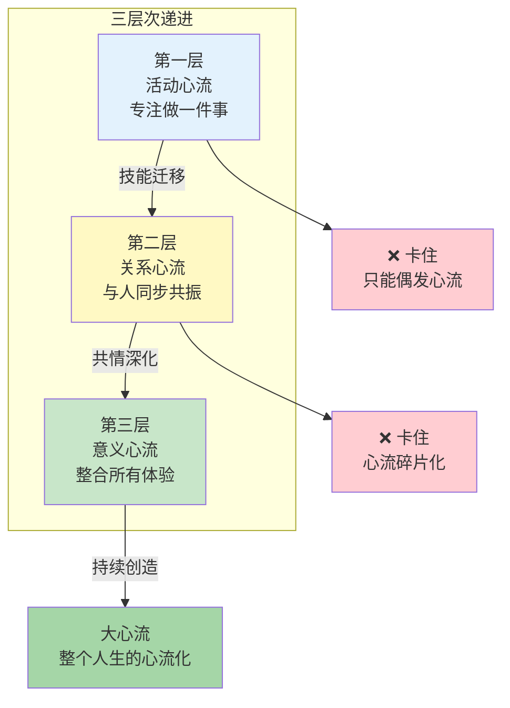
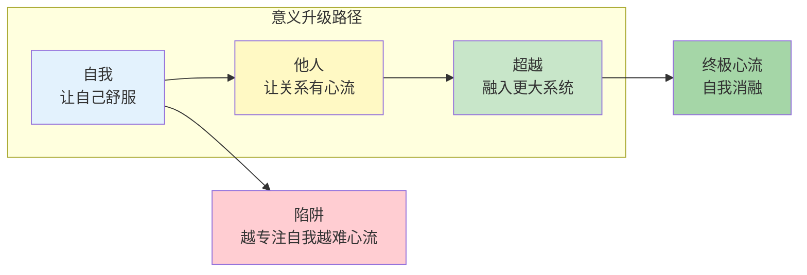

# 第10章 创造意义

## 📍 章节定位

**全书位置**：本章是整书的终极升华——前9章讲"如何进入心流"，这一章回答"为什么要进入心流"。把碎片化的心流体验整合成连贯的人生意义，完成从"最优体验"到"有意义人生"的跃迁。

**一句话定位**：
> 心流不只是让你爽的工具，更是让你的人生有意义的答案——把每一天的心流体验串起来，就是有意义的一生。

---

## 🎯 核心观点（三层提取）

### 观点1：意义不是找到的，是创造的

| 层次 | 内容 |
|------|------|
| **表层（案例）** | 有人满世界找"人生的意义是什么"，仿佛意义是一个隐藏的宝藏。有人从不问这个问题，却在每天的工作、爱好、关系中活得有滋有味。后者从不焦虑"意义"，因为他们在创造意义。 |
| **中层（机制）** | 意义来自于"把所有体验整合成一个连贯的故事"。工作、家庭、爱好、成长，这些碎片本来是散的，当你把它们编织成"我是谁、我要去哪里"的叙事，意义就诞生了。这个编织过程，就是创造。 |
| **底层（规律）** | 意义是意识的最高级有序状态——当意识的所有碎片（记忆、经验、目标、价值观）被整合成一个整体，人就找到了意义。整合不是自动发生的，需要主动创造。**意义是精神负熵的终极形式**。 |

**降维翻译**：
- **原文**：意义是意识的最高级有序状态，需要主动创造
- **降维**：人生的意义不是等来的，是你自己编出来的
- **类比**：生活给你一堆珠子，你自己串成项链——珠子一样，项链不同

---

### 观点2：大心流——整个人生的心流化

| 层次 | 内容 |
|------|------|
| **表层（案例）** | 有人偶尔进入心流（打一局游戏、写一篇文章）；有人生活在心流中（工作、家庭、爱好都能创造心流）。前者是"小心流"，后者是"大心流"。大心流的人，不是某天特别爽，而是每天都挺有滋味。 |
| **中层（机制）** | 大心流需要两个条件：1. 在所有活动中创造心流的能力（技能迁移）；2. 把这些心流整合成连贯意义的能力（叙事整合）。缺第一个，只能偶发心流；缺第二个，心流体验是碎片化的。 |
| **底层（规律）** | 大心流是意识的终极状态——整个人生成为一个有机整体，每一刻都朝着同一个方向流动。**不是偶尔进入心流，而是把自己活成心流**。这是人类幸福的最高形态。 |

**降维翻译**：
- **原文**：大心流是把心流从活动扩展到人生
- **降维**：不是偶尔爽，是天天爽；不是某件事有味，是整个生活有味
- **类比**：小溪流汇成大河——每一条溪流都有水，但只有大河才能远航

---

### 观点3：创造意义的三个层次

| 层次 | 内容 |
|------|------|
| **表层（案例）** | 第一层：在活动中创造心流（专注做一件事）。第二层：在关系中创造心流（与人同步）。第三层：在人生中创造意义（整合所有体验）。多数人卡在第一层，能在三层之间自由切换的，活得最通透。 |
| **中层（机制）** | 三个层次递进：**活动心流→关系心流→意义心流**。每一层都比前一层更难，也更高级。活动心流靠技能，关系心流靠共情，意义心流靠整合能力——把碎片编织成整体。 |
| **底层（规律）** | 意义创造是终身修行——不是到达某个终点，而是一个持续的流动过程。**你永远在"成为更完整的自己"**，意义就在这个过程中不断涌现。 |

**降维翻译**：
- **原文**：意义创造是终身的修行，是持续的流动过程
- **降维**：意义不是终点，是一条路，一直走，一直有风景
- **类比**：爬山不是为了到山顶，是一路上都有好风景

---

### 观点4：目标与人生方向

| 层次 | 内容 |
|------|------|
| **表层（案例）** | 有人随波逐流，被推着走；有人有明确方向，主动选择。同样是工作，前者觉得"混日子"，后者觉得"在建设自己的人生"。差别不在事情本身，在有没有方向感。 |
| **中层（机制）** | 方向感来自于"终极目标"——一个能统摄所有小目标的大目标。有了大目标，每天的选择就有了评判标准：这件事是在靠近目标还是远离目标？方向感就是"知道自己要去哪里"。 |
| **底层（规律）** | 心流理论揭示：**有目标的人生，比没目标的人生更容易进入心流**。因为目标提供了注意力聚焦点，把散乱的意识整合成有序。目标是创造意义的锚点。 |

**降维翻译**：
- **原文**：目标提供注意力聚焦点，是创造意义的锚点
- **降维**：知道要去哪里，路才有意义
- **类比**：没有目的地的旅行只是流浪，有目的地的流浪才是探险

---

### 观点5：从自我到超越

| 层次 | 内容 |
|------|------|
| **表层（案例）** | 有人一生追求"自己舒服"——更多钱、更好工作、更大房子。有人从"自己舒服"转向"帮助他人"——做公益、教育后代、创造价值。后者往往活得更充实，更有意义感。 |
| **中层（机制）** | 意义感的升级路径：**自我→他人→超越**。第一阶段：让自己的生活有心流（自我）。第二阶段：让关系有心流（他人）。第三阶段：让自己成为更大系统的一部分（超越）。 |
| **底层（规律）** | 心流的悖论：**越是专注自我，越难进入心流；越是忘记自我，越容易进入心流**。终极的心流是"自我消融"——你不是在为自己做事，而是在为更大的意义服务。 |

**降维翻译**：
- **原文**：终极的心流是自我消融，为更大的意义服务
- **降维**：老想着自己的人，反而活不好；把自己忘掉的人，活得最爽
- **类比**：一滴水总担心自己干掉，但汇入大海后，它就不再是水滴，而是海本身

---

## 💬 金句库

### 原书金句
> "意义不是找到的，而是创造的。"

> "大心流是把心流从活动扩展到人生——不是某时刻进入心流，而是整个人生都流动着心流。"

> "意义的创造是终身的修行，是一个持续的流动过程。"

> "有目标的人生，比没目标的人生更容易进入心流。"

> "越是专注自我，越难进入心流；越是忘记自我，越容易进入心流。"

### 降维金句
> "人生的意义不是等来的，是你自己编出来的。"

> "不是偶尔爽，是天天爽；不是某件事有味，是整个生活有味。"

> "意义不是终点，是一条路，一直走，一直有风景。"

> "知道要去哪里，路才有意义。"

> "老想着自己的人，反而活不好；把自己忘掉的人，活得最爽。"

> "生活给你一堆珠子，你自己串成项链——珠子一样，项链不同。"

> "没有目的地的旅行只是流浪，有目的地的流浪才是探险。"

## 🔗 当下映射

### 💰 财富应用

| 场景 | 具体行动 | 心流要素 | 预期效果 |
|------|----------|----------|----------|
| 财务目标 | 把"赚钱"升级为"用钱创造什么"——钱是工具，意义是方向 | 目标升维 | 从焦虑追逐变成有意义的积累 |
| 投资决策 | 问自己"这笔钱在我人生故事里扮演什么角色" | 意义锚定 | 从投机心态变成长期主义 |
| 被动收入 | 把被动收入当"时间自由"，而非"躺平"——用自由时间创造更大意义 | 目标重构 | 从空虚躺平变成主动创造 |

### 💼 职场应用

| 场景 | 具体行动 | 心流要素 | 适用人群 |
|------|----------|----------|----------|
| 职业规划 | 不只问"能赚多少"，更问"这工作在我的故事里是什么角色" | 意义整合 | 所有职场人 |
| 日常工作 | 把每天的任务串成"我在建设什么"的叙事 | 意义编织 | 容易倦怠的人 |
| 转型选择 | 选择能"让更大系统变好"的工作，而非只让自己舒服的工作 | 自我超越 | 职业瓶颈期 |

### 🏠 生活应用

| 场景 | 具体行动 | 可行性 | 见效时间 |
|------|----------|--------|----------|
| 人生迷茫 | 停止找"意义是什么"，开始创造"今天的小心流" | 高 | 即时 |
| 家庭关系 | 把家庭当"共同创造的项目"，而非"需要应付的责任" | 中 | 1-3个月 |
| 中年危机 | 从"我已经拥有什么"转向"我还能创造什么" | 高 | 心态转变 |

### 72小时应用计划
1. **今天**：写下你人生的三个"叙事锚点"——什么事让你觉得"这就是我"
2. **明天**：检查今天的活动——哪些在靠近你的叙事锚点？哪些在远离？
3. **本周**：设定一个"意义目标"——不只是完成一件事，而是让这件事成为你故事的一部分

---

## 🕸️ 章节关联

### 向上：整书关联
- 本章是心流理论的终极升华——回答"为什么要进入心流"
- 前9章是方法论（如何），第10章是目的论（为何）
- 完成全书逻辑闭环：**心流不只是工具，更是意义本身的来源**

### 横向：章节序列

| 章节 | 关联类型 | 连接描述 |
|------|----------|----------|
| 第1章-幸福的新解 | 基础 | 心流是幸福的新解，本章回答"幸福之后呢" |
| 第3章-心流的要素 | 工具 | 八要素在人生层面的整合应用 |
| 第7章-工作中的心流 | 平行 | 工作心流是人生意义的重要来源 |
| 第8章-人际中的心流 | 平行 | 关系心流是人生意义的另一来源 |
| 第9章-挫折中的心流 | 延伸 | 从苦难中创造意义——困境心流的终极形态 |

### 跨书关联

| 书籍 | 概念 | 关系 | 备注 |
|------|------|------|------|
| [[活出意义来-维克多·弗兰克尔]] | 意义疗法 | 深度呼应 | 弗兰克尔说"意义是最强生存力量"，契克森米哈赖说"意义是心流的终极整合" |
| [[少有人走的路-派克]] | 人生苦难 | 延伸 | 派克讲"苦难是常态"，本章讲"从苦难中创造意义" |
| [[被讨厌的勇气-岸见一郎]] | 自我超越 | 互补 | 阿德勒讲"贡献他人"，契克森米哈赖讲"融入更大系统" |
| [[第五项修炼-圣吉]] | 系统思维 | 方法论 | 圣吉讲"个人修炼到系统修炼"，本章讲"活动心流到人生心流" |

### 意义创造三层次图



### 从自我到超越图



### 人生意义编织图

```mermaid
flowchart TD
    subgraph 人生碎片
        A[工作体验]
        B[家庭关系]
        C[爱好成长]
        D[困境磨砺]
    end

    A --> E[叙事整合<br/>编织成"我是谁"]
    B --> E
    C --> E
    D --> E

    E --> F[连贯意义<br/>知道要去哪里]
    F --> G[大心流<br/>整个人生流动]

    style E fill:#fff9c4
    style F fill:#c8e6c9
    style G fill:#a5d6a7
```

---

## ❓ 问答设计

### Q1: 为什么说"意义不是找到的，是创造的"？（理解型）
**认知层次**: 理解
**难度**: 中
**答案要点**:
- 意义不是客观存在的东西，像宝藏一样等你发现
- 意义是主观创造的——把人生碎片编织成连贯故事
- 同样的人生素材，不同人编织出不同意义
- 意义创造是意识整合的最高形式

### Q2: "大心流"和"小心流"有什么区别？（理解型）
**认知层次**: 理解
**难度**: 中
**答案要点**:
- **小心流**：偶尔在某项活动中进入心流（打一局游戏、写一篇文章）
- **大心流**：整个人生都流动着心流——不是某天特别爽，是每天都挺有滋味
- 大心流需要两个能力：在所有活动中创造心流 + 把心流整合成意义
- 大心流是人类幸福的最高形态

### Q3: 创造意义的三个层次是什么？如何跨越？（应用型）
**认知层次**: 应用
**难度**: 中
**答案要点**:
- **第一层**：活动心流（专注做一件事）→ 需要技能
- **第二层**：关系心流（与人同步共振）→ 需要共情
- **第三层**：意义心流（整合所有体验）→ 需要整合能力
- 跨越方法：先练技能（专注做事），再练共情（深度关系），最后练整合（编织故事）
- 多数人卡在第一层，能在三层间切换的人活得最通透

### Q4: 为什么"老想着自己的人，反而活不好"？（分析型）
**认知层次**: 分析
**难度**: 高
**答案要点**:
- 心流的悖论：越专注自我，越难进入心流
- 原因：自我意识是心流的障碍——"我在表现得好不好"会打断心流
- 解决：把自己忘掉，融入更大的意义
- 升级路径：自我→他人→超越
- 类比：一滴水汇入大海后，不再担心干掉，因为它已是海本身

### Q5: 2026年，为什么"创造意义"越来越重要？（综合型）
**认知层次**: 综合
**难度**: 高
**答案要点**:
- AI能做99%的事，但AI不能帮你创造人生意义
- 物质越来越丰富，但意义感越来越稀缺
- 信息过载时代，碎片化体验难以整合成意义
- 长寿时代，人生更长，更需要方向感
- 创造意义是"人类最后的堡垒"——这是AI无法替代的能力

### Q6: 如何把今天的碎片人生串成有意义的故事？（应用型）
**认知层次**: 应用
**难度**: 中
**答案要点**:
- 第一步：找到"叙事锚点"——什么事让你觉得"这就是我"
- 第二步：检查每天的活动——哪些在靠近锚点，哪些在远离
- 第三步：设定"意义目标"——不只是完成一件事，而是让这件事成为你故事的一部分
- 第四步：定期回顾——我的人生故事现在讲到哪一章了
- 关键：停止找"意义是什么"，开始创造"今天的小心流"

---

## 📊 全书拆解完成总结

《心流》章节笔记完成（10/10章）：

| 章节 | 核心主题 | 质量等级 |
|------|----------|----------|
| 第1章 | 幸福的新解（心流理论概述） | ⭐⭐⭐ |
| 第2章 | 意识的极限（注意力与精神能量） | ⭐⭐⭐ |
| 第3章 | 心流的要素（八大要素详解） | ⭐⭐⭐ |
| 第4章 | 心流与身体（运动中的心流） | ⭐⭐⭐ |
| 第5章 | 心流与思维（思维活动中的心流） | ⭐⭐⭐ |
| 第6章 | 心流与工作（工作中的心流体验） | ⭐⭐⭐ |
| 第7章 | 心流与孤独（独处中的心流） | ⭐⭐⭐ |
| 第8章 | 心流与人际（人际关系中的心流） | ⭐⭐⭐ |
| 第9章 | 挫折中的心流（困境如何转化） | ⭐⭐⭐ |
| 第10章 | 创造意义（人生意义与心流整合） | ⭐⭐⭐ |

**全书核心逻辑链**：
```
什么是心流（第1章）
    ↓
心流的意识基础（第2-3章）
    ↓
心流在不同领域的应用（第4-8章）
    ↓
心流在困境中的转化（第9章）
    ↓
心流的终极整合——创造意义（第10章）
```

---

*拆解日期: 2026-02-28*
