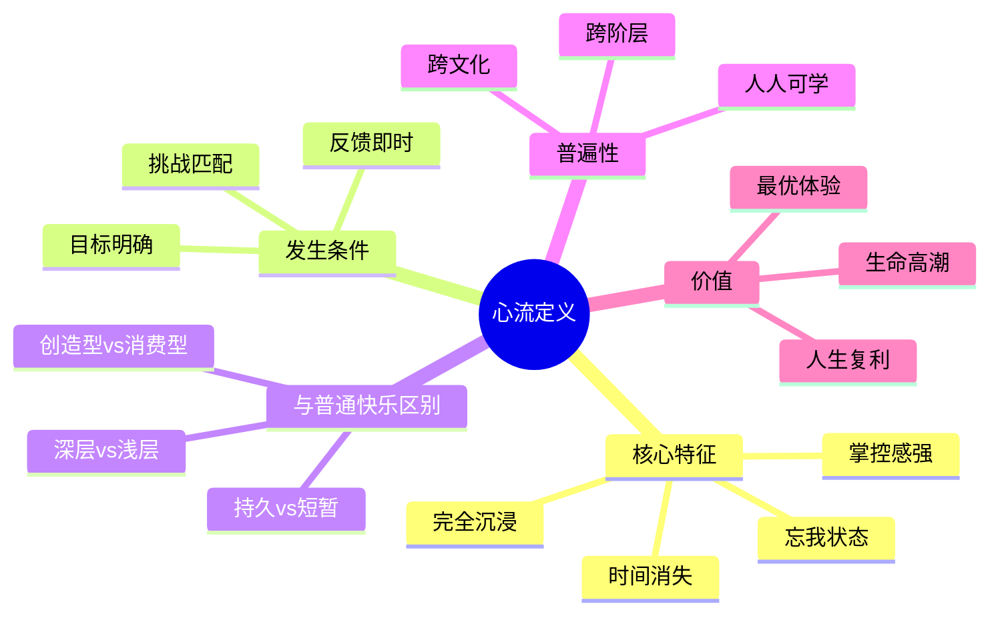
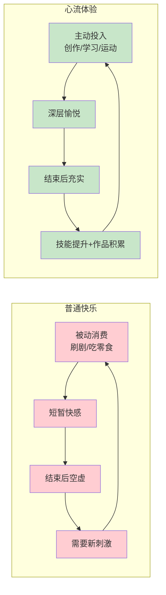

# 第1章 心流，生命的高潮

## 📍 章节定位

**全书位置**：本章是心流理论的核心定义章节，回答"心流是什么"和"什么是最优体验"。这是理解整本书的基础——如果不理解心流的定义，就无法理解后续章节的心流要素和应用。

**章节序列**：第1章（共10章），与"幸福的新解"同属开篇章节，从不同角度奠定心流理论基础

**一句话定位**：
> 心流是一种最优体验状态——当一个人全神贯注于某个活动，技能与挑战恰好匹配，自我意识消失，时间感扭曲，人进入一种"生命的高潮"，这是人类能体验到的最接近幸福的时刻。

**核心问题**：
- 心流到底是什么？
- 最优体验有哪些特征？
- 为什么心流是"生命的高潮"？
- 心流与普通快乐有什么区别？

---

## 🎯 核心观点（三层提取）

### 观点1：心流的定义——完全沉浸的最优体验

| 层次 | 内容 |
|------|------|

**降维翻译**：
- **原文**：心流是完全沉浸在某种活动中，无视其他事物存在的状态
- **中学生懂**：做事做到"忘我"，只想手上的活，忘了自己在干，忘了时间
- **奶奶懂**：干活干进去了，忘了吃饭，忘了睡觉，干得又快又好，心里还舒坦

---

### 观点2：最优体验——超越快乐的生命高潮

| 层次 | 内容 |
|------|------|

**降维翻译**：
- **原文**：最优体验是主动投入活动中产生的深层愉悦，超越被动快乐
- **中学生懂**：刷手机的快乐很浅，做完一道难题的快乐很深，后者才是最优体验
- **奶奶懂**：吃喝玩乐的快乐一阵就没了，干成一件事的快乐能记一辈子

---

### 观点3：心流的普遍性——跨文化的共通体验

| 层次 | 内容 |
|------|------|

**降维翻译**：
- **原文**：心流是跨文化、跨阶层的共通体验，每个人都能学会
- **中学生懂**：不管你是谁、在哪、干啥，都能进入心流状态
- **奶奶懂**：心流不是谁独有的本事，是个人就能学会

---

### 观点4：心流与普通快乐的区别——深层vs浅层

| 层次 | 内容 |
|------|------|

**降维翻译**：
- **原文**：心流是深层的创造型快乐，普通快乐是浅层的消费型快乐
- **中学生懂**：刷视频的快乐像吃零食，心流的快乐像吃正餐——前者吃完还饿，后者吃完饱了
- **奶奶懂**：寻开心是一回事，干成事是另一回事——后者才是真快乐

---

### 观点5：心流是"自成目标"的体验——过程即奖励

| 层次 | 内容 |
|------|------|

**降维翻译**：
- **原文**：心流活动是自成目标的——过程本身就是奖励，不依赖外在结果
- **中学生懂**：做这件事本身就很开心，不是为了得到什么
- **奶奶懂**：干活干高兴了，干完干不完都高兴，这活就有意思了

---

### 观点6：心流改变生活质量——积累效应

| 层次 | 内容 |
|------|------|

**降维翻译**：
- **原文**：心流有积累效应，持续心流实践会改变生活质量和人生轨迹
- **中学生懂**：每天专心干一小时有意义的事，一年下来就比别人多干了365小时
- **奶奶懂**：天天干点有意思的事，干着干着，日子就有意思了，人也变厉害了

---

## 💬 金句库

### 原书金句
> "心流即一个人完全沉浸在某种活动中，无视其他事物存在的状态。"

> "最优体验出现时，一个人可以投入全部的注意力，以求实现目标；个人的身体或心灵被拉伸到极限，自愿去完成一些困难而又有价值的事情。"

> "心流是生命的高潮——当意识被有序组织，人就能体验到生命最充实的时刻。"

> "自成目标的活动——做这件事本身就是为了这件事，而非为了外在奖励。"

> "心流不是少数人的特权，而是每个人都能学会的能力。"

### 降维金句
> "心流就是：做这件事本身，就是奖励。"

> "刷手机是消费快乐，干正事是创造快乐——后者才叫心流。"

> "忘记时间是最好的时间管理——让时间消失在有价值的事情里。"

> "心流面前人人平等——不管你是CEO还是清洁工，都能进入心流。"

> "最优体验不是'躺着舒服'，是'干着过瘾'。"

> "心流是人生的复利——每天存一点，十年后是天壤之别。"

> "自成目标：过程就是奖励，不靠结果来定义价值。"

## 🔗 当下映射

### 💰 财富应用

| 场景 | 具体行动 | 心流要素 | 预期效果 |
|------|----------|----------|----------|
| 投资研究 | 设定明确研究目标，记录分析过程 | 自成目标+即时反馈 | 把焦虑变享受，提升决策质量 |
| 副业创业 | 选择略高于能力的项目，快速迭代 | 挑战匹配+积累效应 | 副业变成心流来源，而非负担 |
| 技能提升 | 每天1小时专注学习，记录进步 | 持续心流+复利效应 | 一年后技能质的飞跃 |

### 💼 职场应用

| 场景 | 具体行动 | 心流转化方法 | 适用职级 |
|------|----------|--------------|----------|
| 深度工作 | 设定90分钟目标块，关闭干扰 | 外在目标→自成目标 | 全职级 |
| 重复工作 | 给自己设挑战（"今天比昨天快5分钟"） | 创造挑战+即时反馈 | 全职级 |
| 学习任务 | 把学习当探索，而非任务 | 转化视角，找到乐趣 | 全职级 |

### 🏠 生活应用

| 场景 | 具体行动 | 可行性 | 见效时间 |
|------|----------|--------|----------|
| 运动健身 | 设定小目标，记录数据 | 高 | 即时 |
| 阅读写作 | 读+笔记+分享，创造即时反馈 | 高 | 1周 |
| 学习乐器 | 选择有挑战但能完成的曲子 | 中 | 2周 |
| 家务整理 | 播放音乐+计时挑战 | 高 | 即时 |

### 72小时应用计划
1. **今天**：记录你的一天，哪些时刻你感到"时间消失了"？分析原因。
2. **明天**：选择一件你常做的事，问自己"这件事本身有什么乐趣"——找到自成目标的价值。
3. **本周**：每天创造一个"心流时间块"——30分钟，全心投入，记录感受。

---

## 🕸️ 章节关联

### 向上：整书关联
- **核心问题**：本章回答"心流是什么"和"什么是最优体验"——心流的定义是全书的基础
- **全书定位**：与"幸福的新解"共同构成开篇章节，从不同角度定义心流

### 横向：章节序列

| 章节编号 | 章节标题 | 关联类型 | 连接描述 |
|----------|----------|----------|----------|
| 第1章 | 幸福的新解 | 姐妹章节 | "幸福的新解"讲幸福本质，"心流生命的高潮"讲心流定义 |
| 第2章 | 意识的极限 | 机制 | 本章讲心流定义，第2章讲心流如何在意识中发生 |
| 第3章 | 心流的要素 | 方法 | 本章讲心流是什么，第3章讲如何进入心流 |

### 跨书关联

| 书籍 | 概念 | 关系 | 备注 |
|------|------|------|------|
| [[被讨厌的勇气-岸见一郎]] | 课题分离 | 呼应 | 阿德勒的"课题分离"与心流的"自我意识消失"相通 |
| [[当下的力量-埃克哈特·托利]] | 临在 | 对比 | 托利的"临在"是静态的心流，心流是动态的临在 |
| [[庄子-庄子]] | 庖丁解牛 | 对比 | 庖丁的"以神遇不以目视"与心流的"忘我"相通 |
| 刻意练习-安德斯·艾利克森 | 刻意练习 | 深化 | 刻意练习是心流的"训练方法" |

### 心流定义框架图

### 心流vs普通快乐对比图

---

## ❓ 问答设计

### Q1: 心流的定义是什么？（记忆型）
**认知层次**: 记忆
**难度**: 低
**答案要点**:
- 心流是一个人完全沉浸在某种活动中，无视其他事物存在的状态
- 核心特征：全神贯注、忘我投入、时间消失、掌控感强
- 发生条件：目标明确、反馈即时、技能与挑战匹配
- 心流是最优体验，是生命的高潮

### Q2: 最优体验和普通快乐有什么区别？（理解型）
**认知层次**: 理解
**难度**: 中
**答案要点**:

| 维度 | 普通快乐 | 最优体验（心流） |
|------|----------|------------------|
| 类型 | 被动消费型 | 主动创造型 |
| 来源 | 外部刺激（吃、看、玩） | 内部投入（创作、学习、运动） |
| 持续性 | 短暂，结束后空虚 | 持久，结束后充实 |
| 积累性 | 无积累，越享受越空虚 | 有积累，技能提升+作品诞生 |
| 依赖性 | 依赖外部资源 | 不依赖外部条件 |

### Q3: 为什么说心流是"生命的高潮"？（理解型）
**认知层次**: 理解
**难度**: 中
**答案要点**:
- 心流是人类意识运作的"最优模式"
- 当全部精神能量投入单一目标，意识变得有序、清晰、高效
- 心流时，人感到充实、有力、有意义——这是生命质量的最高体现
- 心流让人"忘记我在追求什么"，只享受"我在做什么"
- 这种状态是生命最充实的时刻，所以叫"生命的高潮"

### Q4: 什么是"自成目标"的活动？（理解型）
**认知层次**: 理解
**难度**: 中
**答案要点**:
- "自成目标"（autotelic）指目标在活动本身，而非活动之外
- 大多数活动是"外在目标"的——工作为了赚钱，学习为了考试
- 心流活动是"自成目标"的——画画本身开心，跑步本身享受
- 在自成目标的活动中，过程就是奖励，不依赖外在结果
- 人类的终极自由是把"外在目标"转化为"自成目标"

### Q5: 心流为什么具有普遍性？（分析型）
**认知层次**: 分析
**难度**: 中
**答案要点**:
- 心流的普遍性来自人类大脑的共同结构
- 无论文化背景如何，人脑的注意力机制、奖励系统、意识结构都是相似的
- 当大脑进入"全神贯注、目标明确、反馈即时"的状态，就会产生心流
- 这是"硬件"层面的现象，不依赖"软件"（文化）的差异
- 心流是人类意识的"出厂设置"——每个人都能体验，每个人都能学会

### Q6: 心流的"积累效应"是什么？（理解型）
**认知层次**: 理解
**难度**: 中
**答案要点**:
- 心流有"积累效应"——每次心流不仅带来当下快乐，还留下成长
- 积累内容包括：技能提升、作品积累、自信增长
- 不是一次心流就改变人生，而是持续的心流实践让生活一点点变得不同
- 复利效应适用于心流——每天1小时，一年365小时，十年3650小时
- 持续心流的人，5年、10年后与不心流的人，会有质的差距

### Q7: 如何把"外在目标"转化为"自成目标"？（应用型）
**认知层次**: 应用
**难度**: 中
**答案要点**:
1. **重新定义意义**：问自己"这件事本身有什么乐趣"
2. **设定小目标**：把大任务拆成小挑战，每次完成都有成就感
3. **创造即时反馈**：记录进步、分享成果、给自己确认
4. **找到学习价值**：不是"为了完成任务"，而是"我能从中学到什么"
5. **享受过程**：把注意力从"结果"转向"当下每一步"

### Q8: 心流与《当下的力量》的"临在"有什么区别？（分析型）
**认知层次**: 分析
**难度**: 高
**答案要点**:

| 维度 | 心流 | 临在 |
|------|------|------|
| 动态 | 动态活动中专注 | 静态觉察中存在 |
| 条件 | 需要目标+反馈+挑战匹配 | 只需要觉察当下 |
| 适合场景 | 工作、运动、创作、学习 | 等待、休息、独处、冥想 |
| 体验类型 | "完全沉浸在活动中" | "纯粹觉察一切" |

**互补关系**：
- 心流适合动态场景（做事时）
- 临在适合静态场景（休息时）
- 两者都是"好的状态"，只是适合不同的时间

### Q9: 为什么说"心流是人生的复利"？（综合型）
**认知层次**: 综合
**难度**: 高
**答案要点**:
- 复利的特点：(1)持续投入，(2)利滚利，(3)时间越久差距越大
- 心流同样具备这三个特点：
  - 持续投入：每天心流实践
  - 利滚利：心流带来的技能提升，让你更容易进入下一次心流
  - 时间越久差距越大：1年、5年、10年后，心流者和不心流者差距巨大
- 具体例子：每天1小时心流，一年365小时，十年3650小时
- 3650小时的差距，是技能、作品、人生质量的质的差距

### Q10: 如何判断自己是否进入了心流状态？（应用型）
**认知层次**: 应用
**难度**: 中
**答案要点**:
**心流的判断标准**：
1. 忘记时间——一看表，"怎么这么晚了"
2. 忘记自我——不再想"我表现得怎么样"
3. 全神贯注——脑子里只有手上的事
4. 掌控感——感觉自己能影响结果
5. 结束后充实——不是空虚，是满足

**简易判断法**（3个核心）：
- 忘记时间了吗？
- 忘记自己在做事了吗？
- 做完后感到满足吗？

---
