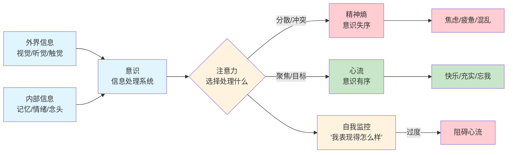
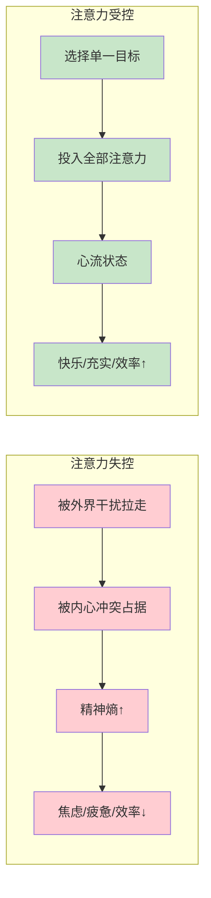

# 第2章 意识的极限

## 📍 章节定位

**全书位置**：第2章是心流理论的底层机制章节，回答"心流如何在意识中发生"，揭示注意力的本质和自我在意识中的角色。本章是理解心流的科学基础。

**章节序列**：第2章（共10章），承接第1章的幸福理论，为第3章的心流要素提供机制解释

**一句话定位**：
> 意识是人类最宝贵的资源——它像能量一样有限，但可以被主动控制；当我们把注意力投入有意义的目标，就能创造意识秩序（心流），对抗混乱（精神熵）。

**核心问题**：
- 意识是什么？它如何工作？
- 注意力为什么是有限资源？
- 自我在意识中扮演什么角色？
- 精神熵和心流是什么关系？

---

## 🎯 核心观点（三层提取）

### 观点1：意识——信息处理的内在宇宙

| 层次 | 内容 |
|------|------|

**降维翻译**：
- **原文**：意识是信息处理的系统，是体验一切的唯一场所
- **中学生懂**：意识就像你的"大脑屏幕"，上面播放着你看到的一切
- **奶奶懂**：意识就是你的"心里有个小世界"，你看见的、想的、感觉的，都在这个小世界里

---

### 观点2：注意力——精神能量，意识的生命线

| 层次 | 内容 |
|------|------|

**降维翻译**：
- **原文**：注意力是有限的精神能量，是意识的生命线
- **中学生懂**：注意力就像你的"精神电池"，每次只能用在一件事情上
- **奶奶懂**：精力有限，你只能专心干一件事，不能这想那想

---

### 观点3：精神熵——意识失序的混乱状态

| 层次 | 内容 |
|------|------|

**降维翻译**：
- **原文**：精神熵是意识失序的混乱状态，导致焦虑和疲惫
- **中学生懂**：脑子像一团乱麻，不知道该干什么，这就叫精神熵
- **奶奶懂**：心里七上八下，什么都不顺，这就是心里乱了

---

### 观点4：心流——意识有序的最优状态

| 层次 | 内容 |
|------|------|

**降维翻译**：
- **原文**：心流是意识有序的最优状态，精神能量的高效利用
- **中学生懂**：专心干一件事，脑子里没杂念，干得又快又爽，这就是心流
- **奶奶懂**：心无杂念，一心一意，这事儿就干得顺，心里也舒坦

---

### 观点5：自我——意识的锚点与障碍

| 层次 | 内容 |
|------|------|

**降维翻译**：
- **原文**：自我既是意识的锚点，也可能是心流的障碍
- **中学生懂**："我"让你知道自己是谁，但总想"我好不好"会让你紧张
- **奶奶懂**：知道自己是谁很重要，但太在意自己好不好，反而干不好事

---

### 观点6：意识容量——有限但可扩展

| 层次 | 内容 |
|------|------|

**降维翻译**：
- **原文**：意识容量有限，但可以通过训练提高效率
- **中学生懂**：脑子一次想不了太多事，但练多了，复杂的事也能轻松搞定
- **奶奶懂**：人脑是有限的，但多练练，原来觉得难的事，后来就变得简单了

---

### 观点7：记忆与想象——意识的延伸与陷阱

| 层次 | 内容 |
|------|------|

**降维翻译**：
- **原文**：记忆和想象让意识超越当下，但也可能成为陷阱
- **中学生懂**：回忆过去、想象未来很有用，但总想过去和未来，就没法专心现在
- **奶奶懂**：以前的事、以后的事，都想太多，就顾不上眼前的事

---

### 观点8：注意力控制——自由的核心

| 层次 | 内容 |
|------|------|

**降维翻译**：
- **原文**：注意力控制是人类最核心的自由，控制注意力就是控制幸福
- **中学生懂**：你控制不了外面发生什么，但你能控制自己想什么
- **奶奶懂**：世事难料，但你怎么想，日子就怎么过

---

## 💬 金句库

### 原书金句
> "我们无法控制外界发生的事情，但可以控制自己的意识，选择如何解读和应对。"

> "注意力是无价的资源——它决定我们体验什么，也决定我们成为什么样的人。"

> "意识有序时，人感到快乐；意识失序时，人感到焦虑。"

> "精神熵是意识失序的状态，心流是意识有序的状态。"

> "自我的价值在于创造目标，但过度关注自我会阻碍心流。"

> "意识的容量有限，但可以通过训练提高效率。"

### 降维金句
> "脑子像一块地，种什么就长什么——你关注什么，就变成什么样。"

> "精神熵就是心里乱，心流就是心里顺。"

> "注意力是精神电池，一次只能充一件事，别浪费。"

> "太在意'我好不好'，反而干不好事。"

> "脑子一次想不了太多，但练多了，复杂的事也变简单了。"

> "控制不了外面，但能控制自己怎么想。"

> "幸福的核心不是'碰上什么'，而是'怎么过'。"

## 🔗 当下映射

### 💰 财富应用

| 场景 | 具体行动 | 注意力控制 | 预期效果 |
|------|----------|------------|----------|
| 股票投资 | 设定研究时间块，关闭一切干扰 | 专注当下，不被市场噪音影响 | 决策质量提升，焦虑降低 |
| 副业创业 | 把大项目拆成小目标，专注完成一个 | 每次只关注一个任务 | 从压力变享受，成功率提升 |
| 学习新技能 | 设定练习时间，记录进步 | 专注练习，不比较他人 | 学习效率翻倍 |

### 💼 职场应用

| 场景 | 具体行动 | 精神熵降低方法 | 适用职级 |
|------|----------|----------------|----------|
| 深度工作 | 设定90分钟目标块，关闭通知 | 单一目标，多任务变为单一任务 | 全职级 |
| 会议中 | 聚焦"我能贡献什么" | 停止"别人怎么看我"的自我监控 | 全职级 |
| 处理冲突 | 把冲突当作挑战 | 从"我受委屈"转向"我能解决什么" | 管理层 |
| 厌倦工作 | 重新定义目标 | 从"应付工作"转向"从中学习" | 全职级 |

### 🏠 生活应用

| 场景 | 具体行动 | 可行性 | 见效时间 |
|------|----------|--------|----------|
| 运动健身 | 专注每一次动作，不看手机 | 高 | 即时 |
| 阅读 | 读+笔记，不对照进度 | 高 | 1周 |
| 亲子 | 全心陪伴孩子，不看手机 | 高 | 即时 |
| 冥想练习 | 每天10分钟，专注呼吸 | 中 | 1周 |

### 72小时应用计划
1. **今天**：记录你的一天，哪些时刻注意力最集中？哪些最分散？分析原因。
2. **明天**：选择一件你常做的事，给它设定一个"专注时间块"（30分钟，关闭干扰）。
3. **本周**：每天练习一次"注意力训练"——坐5分钟，专注呼吸，每次走神就温柔拉回来。

---

## 🕸️ 章节关联

### 向上：整书关联
- **核心问题**：本章回答"心流如何在意识中发生"——心流是通过控制注意力，创造意识有序状态
- **全书定位**：第2章是心流的底层机制，第3章是在此基础上的操作方法

### 横向：章节序列

| 章节编号 | 章节标题 | 关联类型 | 连接描述 |
|----------|----------|----------|----------|
| 第1章 | 幸福的新解 | 理论 | 第1章说"幸福=控制内在体验"，第2章讲"意识如何工作" |
| 第3章 | 心流的要素 | 应用 | 第2章讲"意识机制"，第3章讲"如何利用意识创造心流" |
| 第4-10章 | 心流的应用 | 展开 | 第2章是理论基础，第4-10章是应用场景 |

### 跨书关联

| 书籍 | 概念 | 关系 | 备注 |
|------|------|------|------|
| [[心理学与生活-津巴多]] | 注意力机制 | 基础 | 津巴多讲"专注"如何发生，契克森米哈赖讲"如何利用专注" |
| [[思考快与慢-丹尼尔·卡尼曼]] | 系统1/系统2 | 深化 | 心流是系统2的极致专注状态 |
| [[当下的力量-埃克哈特·托利]] | 临在 | 呼应 | 都强调把注意力拉回当下 |
| [[庄子-庄子]] | 心斋坐忘 | 对比 | 都指向"忘我"状态，但路径不同 |

### 意识工作流程图

### 注意力控制能力对比

---

## ❓ 问答设计

### Q1: 意识是什么？它如何工作？（记忆型）
**认知层次**: 记忆
**难度**: 低
**答案要点**:
- 意识是体验一切的唯一场所，是感知、思考、感觉、意愿的舞台
- 意识是一个信息处理系统，接收外界信息（视觉、听觉）和内部信息（记忆、情绪）
- 意识把信息整合成连贯的"体验"
- 意识的容量有限（每秒约126比特），必须选择处理哪些信息

### Q2: 为什么说注意力是"精神能量"？（理解型）
**认知层次**: 理解
**难度**: 中
**答案要点**:
- 注意力是驱动意识运转的动力
- 没有注意力，意识就会陷入混乱（精神熵）
- 有注意力的定向投入，意识才能有序（心流）
- 注意力的本质是"选择"——选择处理哪些信息，忽略哪些信息
- 注意力消耗精神能量，像电池一样有限，需要合理分配

### Q3: 什么是"精神熵"？它与焦虑有什么关系？（理解型）
**认知层次**: 理解
**难度**: 中
**答案要点**:
- 精神熵是"意识失序"的状态
- 当注意力的方向不一致、互相冲突，意识就会陷入混乱
- 精神熵高时，人感到焦虑、压力、混乱、疲惫
- 精神熵低时，人感到平静、清晰、有序
- 控制注意力就是控制精神熵——聚焦目标=降低精神熵=减少焦虑

### Q4: 心流与意识有序是什么关系？（理解型）
**认知层次**: 理解
**难度**: 中
**答案要点**:
- 心流是"意识有序"的最优状态
- 当注意力全部投入有意义的目标，精神熵降到最低
- 在心流状态，意识变得有序、清晰、高效
- 心流让人感到快乐、充实、忘我
- 心流的本质是主动创造意识秩序，而非被动等待外界提供快乐

### Q5: 自我在意识中扮演什么角色？它既是锚点又可能是障碍？（分析型）
**认知层次**: 分析
**难度**: 中
**答案要点**:
**自我作为锚点**:
- 自我帮我们区分"我"和"非我"
- 自我给我们方向感和安全感
- 自我帮助我们设定目标（"我想成为什么样的人"）

**自我作为障碍**:
- 过度关注"我表现得怎么样"会消耗大量注意力
- 自我监控会阻碍心流（比如演讲时太在意表现会忘词）
- 过度在意他人评价会让人无法专注活动本身

**心流的智慧**:
- 用自我创造目标
- 然后用忘我来达成目标
- 就像游泳运动员：用自我设定"破纪录"的目标，但在游泳时忘记"我"只记得"划水"

### Q6: 意识容量有限，为什么还能做复杂的事？（理解型）
**认知层次**: 理解
**难度**: 中
**答案要点**:
- 意识容量有限（每秒126比特），但可以"压缩"和"自动化"
- 通过练习，把复杂的任务变成自动化的"模块"
- 自动化后，这些任务不再消耗注意力
- 释放的注意力可以用于更高层级的思考
- 心流训练的本质就是把复杂任务自动化，释放注意力用于创造

### Q7: 记忆和想象如何成为意识的陷阱？（分析型）
**认知层次**: 分析
**难度**: 中
**答案要点**:
**记忆和想象的价值**:
- 让人类超越当下，这是人类独有的优势
- 帮助我们回忆过去的经验，想象未来的可能
- 是计划、学习、创造的基础

**记忆和想象的陷阱**:
- 当意识被回忆占据，就无法专注于当下（比如总想过去的痛苦）
- 当意识被想象占据，就无法体验现在（比如总想未来的担忧）
- 过度的回忆和想象会拉走注意力，阻碍心流

**心流的解决方案**:
- 用记忆和想象来计划
- 但用当下的行动来体验
- 把注意力拉回"此时此刻"

### Q8: 为什么说"控制注意力就是控制幸福"？（综合型）
**认知层次**: 综合
**难度**: 中
**答案要点**:
- 我们无法控制外界发生什么（天气、战争、经济、他人的行为）
- 但我们可以控制自己的意识，选择如何解读和应对
- 注意力决定我们体验什么（你关注什么，就体验什么）
- 注意力决定我们成为什么样的人（你关注什么，就强化什么）
- 当注意力投入有意义的目标，就创造心流（快乐）
- 当注意力被冲突占据，就陷入精神熵（焦虑）
- 控制注意力是人类最核心的自由，也是控制幸福的关键

### Q9: 如何训练注意力？（应用型）
**认知层次**: 应用
**难度**: 中
**答案要点**:
**具体方法**:
1. **从小事开始**：不要从90分钟开始，从5-10分钟开始
2. **选择单一目标**：专注于一件事（比如读书、跑步、做饭）
3. **减少干扰**：关闭手机通知，清理桌面
4. **观察注意力**：当注意力走神，温柔地拉回来，不要自责
5. **培养习惯**：每天同一时间、同一地点练习
6. **接受不完美**：开始专注比完美专注更重要

**长期训练**:
- 注意力像肌肉，越练越强
- 每天练习，3个月后你会发现自己专注力显著提升
- 可以用冥想、呼吸练习辅助训练

### Q10: 精神熵和心流有什么区别？（对比型）
**认知层次**: 对比
**难度**: 中
**答案要点**:

| 维度 | 精神熵 | 心流 |
|------|--------|------|
| 意识状态 | 失序 | 有序 |
| 注意力 | 分散、冲突 | 聚焦、统一 |
| 情绪感受 | 焦虑、疲惫、混乱 | 快乐、充实、忘我 |
| 效率 | 低下 | 高效 |
| 体验质量 | 糟糕 | 最优 |
| 发生条件 | 注意力失控 | 注意力受控+目标明确+反馈即时 |

### Q11: 为什么现代人的精神熵越来越高？（分析型）
**认知层次**: 分析
**难度**: 中
**答案要点**:
**外部原因**:
- 信息爆炸：信息太多，注意力不够用
- 社交媒体：不断推送内容，争夺注意力
- 短视频：高强度刺激，让注意力碎片化
- 手机通知：随时打断专注

**内部原因**:
- 欲望升级：物质满足后，欲望不断升级
- 自我意识过强：过度在意他人评价
- 焦虑感：对未来的担忧，对过去的遗憾

**解决方法**:
- 主动创造"专注时间块"：关闭干扰，设定目标
- 培养注意力控制能力：通过练习提升
- 选择有意义的目标投入注意力：不是被外界牵着走

### Q12: 第2章与《心理学与生活》的"注意力"有什么关系？（分析型）
**认知层次**: 分析
**难度**: 高
**答案要点**:
**共同底层**:
- 都研究注意力机制和意识状态
- 都承认注意力是有限的资源

**互补关系**:
- 《心理学与生活》（津巴多）：讲注意力的科学机制
  - 注意力如何工作
  - 注意力为什么会分散
  - 注意力的认知科学基础

- 《心流》（契克森米哈赖）：讲如何利用注意力创造最优体验
  - 如何控制注意力
  - 如何把注意力投入心流
  - 如何通过注意力创造幸福

**比喻**:
- 津巴多是"机制的说明书"
- 契克森米哈赖是"操作手册"
- 两本书一起读：从理解注意力到掌控注意力

### Q13: 如果我总是分心，无法专注，是意识容量不够吗？（诊断型）
**认知层次**: 诊断
**难度**: 中
**答案要点**:
**不一定**：
- 大多数人的注意力不集中，不是因为容量不够，而是因为缺乏训练
- 意识容量有限（126比特），但对大多数人来说，瓶颈不是容量，而是控制能力

**诊断原因**:
1. **任务无聊/太难**：没有挑战或挑战过度
2. **外部干扰太多**：手机通知、噪音、社交媒体
3. **内心冲突**：担忧、焦虑、欲望争夺注意力
4. **缺乏训练**：从小到大没有系统训练过专注力
5. **目标不明确**：不知道要做什么，注意力自然分散

**解决方法**:
- 如果是任务问题：调整任务难度，拆分目标
- 如果是外部干扰：关闭通知，创造安静环境
- 如果是内心冲突：记录担忧，设定"担忧时间"，然后专注
- 如果是缺乏训练：从小事开始练习，像练肌肉一样练注意力

### Q14: 如何判断自己的精神熵水平？（应用型）
**认知层次**: 应用
**难度**: 中
**答案要点**:
**精神熵高的症状**:
- 脑子像一团乱麻，不知道该干什么
- 同时想很多事，什么也做不好
- 感到焦虑、混乱、压力大
- 效率低下，事情越积越多
- 容易分心，很难专注

**精神熵低的症状**:
- 脑子清晰，知道该干什么
- 一次专注一件事，做得又快又好
- 感到平静、有序、充实
- 效率高，事情轻松完成
- 容易进入心流状态

**简易判断法**：
- 问自己：我现在能清楚知道接下来1小时要做什么吗？
- 如果不能，说明精神熵较高，需要整理

### Q15: 记忆、想象和当下体验，如何平衡？（综合型）
**认知层次**: 综合
**难度**: 高
**答案要点**:
**三者都有价值**：
- **记忆**：从过去学习经验
- **想象**：为未来做计划
- **当下**：体验现实，活在现在

**失衡的陷阱**:
- 过度沉溺记忆：活在过去的遗憾和荣耀中，无法前进
- 过度沉溺想象：活在未来的担忧和幻想中，无法行动
- 只活在当下：没有经验和计划，行动盲目

**心流的平衡之道**:
- **计划阶段**（不在心流中）：用记忆和想象设定目标
- **行动阶段**（在心流中）：把注意力完全投入当下
- **反思阶段**（心流结束后）：用记忆总结经验，用想象调整目标

**具体方法**:
- 每天花10分钟回顾昨天、计划明天（记忆+想象）
- 其他时间专注当下（心流）
- 这样既有方向感，又能全身心投入

---
