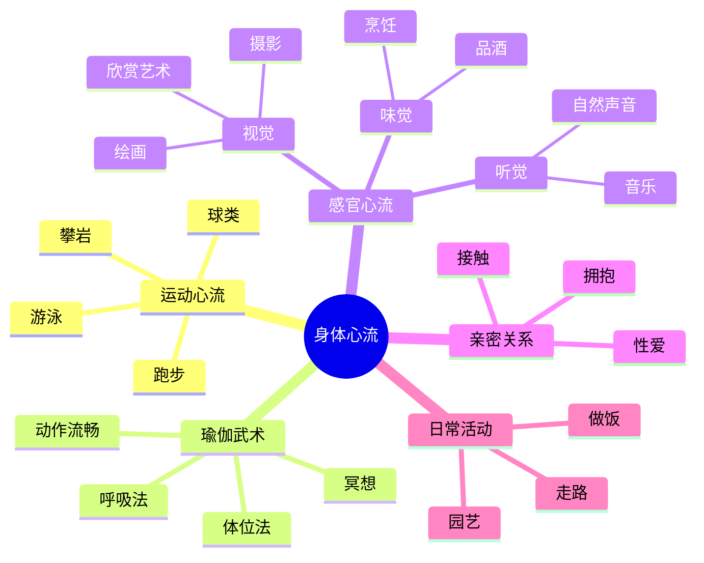
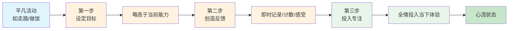

# 第5章 身体的心流

## 📍 章节定位

**全书位置**：本章深入探讨身体作为心流入口的多维可能性，从运动、感官、性爱到日常身体活动，展示如何通过培养身体技能把"身体的活动"变成"心灵的享受"。

**章节序列**：第5章，承接第4章身体心流的引入，深化到具体的身体心流类型与培养方法

**一句话定位**：
> 身体不只是工具，更是心流体验的天然入口。从跑步游泳到瑜伽武术，从感官享受到亲密关系，任何身体活动都能通过培养变成心流之源。

**核心问题**：
- 运动为什么是最自然的心流入口？
- 瑜伽和武术如何实现身心合一？
- 感官心流与运动心流有何不同？
- 如何培养身体技能，把平凡活动变成心流？

---

## 🎯 核心观点（三层提取）

### 观点1：运动是心流最自然入口

| 层次 | 内容 |
|------|------|

**降维翻译**：
- **原文**：运动是心流最自然的入口
- **中学生懂**：跑步、打球、游泳这些运动，最容易让人专注忘我
- **奶奶懂**：动起来，心里就舒服；练到顺，人就自在

---

### 观点2：挑战-技能的动态平衡

| 层次 | 内容 |
|------|------|

**降维翻译**：
- **原文**：运动中需要技能与挑战的动态平衡
- **中学生懂**：运动不能太难也不能太简单，刚好"跳一跳够得着"最爽
- **奶奶懂**：慢慢来，一点点加码，太难了累，太简单了没劲

---

### 观点3：瑜伽与武术的身心合一

| 层次 | 内容 |
|------|------|

**降维翻译**：
- **原文**：瑜伽和武术是身心合一的最高境界
- **中学生懂**：练到极致，身体就像自己的延伸，不需要想，它就自己动
- **奶奶懂**：练到顺了，身体像自己会动，你就在旁边看着就行

---

### 观点4：感官心流的纯净体验

| 层次 | 内容 |
|------|------|

**降维翻译**：
- **原文**：感官心流是注意力聚焦于单一感官的纯净体验
- **中学生懂**：专心看、专心听、专心尝，都能让人忘记其他一切
- **奶奶懂**：仔细看一朵花，仔细听一段音乐，心里就安静了

---

### 观点5：亲密关系中的心流

| 层次 | 内容 |
|------|------|

**降维翻译**：
- **原文**：性爱中的心流是身体与情感的深度结合
- **中学生懂**：两个人真心投入，忘记时间，忘记自己，只有彼此
- **奶奶懂**：两个人真正在一起，心在一起，人在一起，什么都不想

---

### 观点6：培养身体技能的方法论

| 层次 | 内容 |
|------|------|

**降维翻译**：
- **原文**：任何身体活动都能成为心流入口
- **中学生懂**：不在于做什么运动，在于怎么投入地做
- **奶奶懂**：干什么不重要，专心干、用心干，就能干出滋味

---

### 观点7：身体心流与思维心流的对比

| 层次 | 内容 |
|------|------|

**降维翻译**：
- **原文**：身体心流是动中的静，思维心流是静中的动
- **中学生懂**：运动时心里静，思考时身不动，两种都能忘我
- **奶奶懂**：动起来心里静，静下来脑子动，都是好的

---

### 观点8：活动到心流的三步转化法

| 层次 | 内容 |
|------|------|

**降维翻译**：
- **原文**：通过目标、反馈、专注，任何活动都能转化为心流
- **中学生懂**：给活动定个小目标，自己给自己反馈，专心投入，就能有心流
- **奶奶懂**：干啥都有办法让它有意思：定目标、看出彩、专心干

---

## 💬 金句库

### 原书金句
> "身体是为心流而设计的——运动是摆脱精神熵最直接的方法。"

> "能否感到乐趣，不在于你做了什么，而在于你怎么做。"

> "瑜伽和武术的最高境界，是从'控制身体'到'超越身体'。"

> "感官是意识的过滤器，通过训练可以创造纯净的心流体验。"

> "培养身体技能的过程，就是培养心流能力的过程。"

> "任何活动都能成为心流入口，关键是你如何组织它。"

### 降维金句
> "动起来，心里就顺；练到顺，人就自在。"

> "运动不难不很容易，刚刚好最爽。"

> "练到极致，身体就像自己的延伸。"

> "专心看、专心听，心里就安静。"

> "不在于做什么，在于怎么投入地做。"

> "走路、做饭、园艺，专心干都有滋味。"

> "定目标、看出彩、专心干，啥事都有意思。"

## 🔗 当下映射

### 💰 财富应用

| 场景 | 具体行动 | 心流要素 | 预期效果 |
|------|----------|----------|----------|
| 股票分析 | 设定分析时间块+记录心得 | 专注+明确目标+即时反馈 | 从焦虑变专注 |
| 创业项目 | 把大任务拆成小挑战 | 挑战匹配+即时反馈 | 从压力变享受 |
| 技能投资 | 选择有挑战但能学会的技能 | 挑战匹配+即时反馈 | 学习效率提升 |

### 💼 职场应用

| 场景 | 具体行动 | 身体心流方法 | 适用职级 |
|------|----------|--------------|----------|
| 会议中 | 深呼吸+关注自己能贡献什么 | 呼吸练习+掌控感 | 全职级 |
| 深度工作 | 站立办公+定时休息 | 身体运动+节奏感 | 全职级 |
| 压力大时 | 5分钟快走或拉伸 | 身体活动+即刻放松 | 全职级 |
| 久坐疲劳 | 每小时起身活动3分钟 | 身体激活+注意力转移 | 全职级 |

### 🏠 生活应用

| 场景 | 具体行动 | 可行性 | 见效时间 |
|------|----------|--------|----------|
| 晨间运动 | 设定略高于当前能力的目标 | 高 | 即时 |
| 听音乐 | 关闭干扰，全情聆听 | 高 | 即时 |
| 做饭 | 把做饭变成创作，创造反馈 | 中 | 1周 |
| 散步 | 关注步伐节奏和沿途风景 | 高 | 即时 |
| 园艺 | 关注植物变化，感受成长 | 中 | 2周 |

### 72小时应用计划
1. **今天**：选择一个身体活动（跑步、走路、瑜伽），设定一个小目标
2. **明天**：在活动中创造即时反馈（记录、计数、感受进步）
3. **本周**：每天花15分钟，把一个平凡活动变成心流体验

---

## 🕸️ 章节关联

### 向上：整书关联
- **核心问题**：本章回答"如何在身体活动中创造心流"——身体是最容易的心流入口
- **全书定位**：第5章是心流具体化实践的重要一站，承接心流要素理论

### 横向：章节序列

| 章节编号 | 章节标题 | 关联类型 | 连接描述 |
|----------|----------|----------|----------|
| 第3章 | 心流的要素 | 基础 | 第3章讲八要素，本章在身体活动中应用 |
| 第4章 | 心流与身体 | 深化 | 第4章引入概念，本章深化具体方法 |
| 第6章 | 心流与工作 | 应用 | 身体心流方法可提升工作状态 |
| 第7章 | 心流与孤独 | 延伸 | 身体心流可转化为独处能力 |

### 跨书关联

| 书籍 | 概念 | 关系 | 备注 |
|------|------|------|------|
| [[当下的力量-埃克哈特·托利]] | 身体觉察 | 呼应 | 都强调通过身体连接当下 |
| [[庄子-庄子]] | 养生 | 对比 | 都重视身体与精神的和谐 |
| [[瑜伽经典]] | 瑜伽实践 | 深化 | 契克森米哈赖引用瑜伽作为心流的极致案例 |

### 身体心流类型图

### 心流转化三步法

---

## ❓ 问答设计

### Q1: 为什么说身体是心流最自然的入口？（理解型）
**答案要点**:
- 运动有即时反馈（做对了立刻知道）
- 运动有明确节奏（心跳、呼吸、步伐）
- 运动有清晰目标（跑到终点、游到对岸）
- 这些天然符合心流八要素
- 身体进化出的运动本能，在古代是生存技能，在现代可以转化为心流体验

### Q2: 运动中如何保持技能-挑战的动态平衡？（应用型）
**答案要点**:
- 新手挑战简单任务，高手挑战困难任务
- 每个人都要找到自己的"刚刚好"
- 随着技能提升，挑战必须同步提升
- 今天状态好，可以挑战更难；今天状态差，可以降低难度
- 关键是保持"有点挑战但能搞定"的状态

### Q3: 瑜伽和武术如何实现"身心合一"？（理解型）
**答案要点**:
- 通过系统训练，让身体技能高度精细化、自动化
- 在这种状态下，身体不再需要意识持续"指挥"，而能自然流畅地行动
- 意识从"控制身体"解放出来，可以专注于更高级的体验（冥想、直觉、觉知）
- 终极目标不是"练得更厉害"，而是"练到忘记身体"，进入纯粹的觉知状态

### Q4: 感官心流是什么？如何创造？（应用型）
**答案要点**:
- 感官心流是"注意力聚焦于单一感官"的纯净体验
- 视觉心流：摄影、绘画、欣赏艺术
- 听觉心流：音乐、自然声音
- 味觉心流：品酒、烹饪
- 创造方法：全情投入，不带杂念，专注于单一感官

### Q5: 身体心流和思维心流有什么区别？（对比型）
**答案要点**:
- **身体心流**：身体活跃，意识简化。注意力集中在身体感觉。
- **思维心流**：身体静止，意识活跃。注意力集中在思维活动。
- 身体心流适合放松、减压；思维心流适合创造、解决问题
- 两者互补：身体心流为思维心流充电，思维心流为身体心流提供意义

### Q6: 如何把"走路"变成心流体验？（应用型）
**答案要点**:
- 第一步：设定目标（今天走6000步，比昨天多500步）
- 第二步：创造反馈（用计步器，每1000步给自己肯定）
- 第三步：投入注意力（感受每一步的节奏，观察沿途的风景）
- 这样，平凡的走路就变成了有心流体验的活动

### Q7: 为什么说"能否感到乐趣，不在于你做了什么，而在于你怎么做"？（理解型）
**答案要点**:
- 任何活动都能创造心流，不取决于活动本身
- 关键在于如何组织活动：设定目标、创造反馈、投入注意力
- 走路、做饭、园艺、读书、工作——只要用心，都能有心流
- 幸福不在于你"拥有"什么，而在于你"如何做"什么

### Q8: 身体心流如何帮助减压？（应用型）
**答案要点**:
- 身体心流时，注意力完全投入身体感觉
- 大脑停止复杂思考，杂念自动消失
- 身体活动释放内啡肽（天然的减压荷尔蒙）
- 5-10分钟的身体心流就能显著减压
- 适合的身体活动：快走、拉伸、瑜伽、舞蹈

### Q9: 培养身体技能和培养心流能力有什么关系？（分析型）
**答案要点**:
- 培养身体技能的过程，就是培养心流能力的过程
- 技能越好，心流越容易出现
- 但心流的价值不在于"技能有多高"，而在于"体验有多深"
- 即使简单的技能，只要用心培养，也能创造心流体验
- 核心是：投入注意力，发现挑战，感受反馈

### Q10: 在2026年，为什么身体心流越来越重要？（综合型）
**答案要点**:
- 现代人坐得太多、想得太多，动得太少
- 身体被束缚，心流就很难来
- 身体活动减少导致注意力分散、精神熵增加
- 身体心流是最直接、最便宜的减压方法
- 不需要健身房，不需要瑜伽馆——只需要动起来，投入注意力

---
