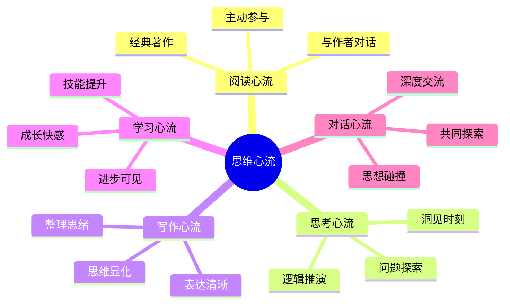
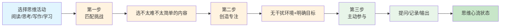

# 第6章 思维的心流

## 📍 章节定位

**全书位置**：本章深入探讨思维作为心流入口的多维可能性，从阅读、思考到写作、学习，展示如何通过培养心智活动把"脑力活动"变成"心灵享受"。

**章节序列**：第6章，承接第5章身体心流，转向思维心流——人类独有的心流形态

**一句话定位**：
> 思维不只是工具，更是心流体验的高阶入口。从阅读思考到写作学习，任何心智活动都能通过培养变成心流之源，这是人类区别于动物的心流形态。

**核心问题**：
- 为什么说思维是最复杂的心流形式？
- 阅读如何从"获取信息"升华为"心灵对话"？
- 思考的心流与身体的心流有何本质区别？
- 如何培养思维能力，让日常学习成为享受？

---

## 🎯 核心观点（三层提取）

### 观点1：思维心流的独特性——人类独有

| 层次 | 内容 |
|------|------|

**降维翻译**：
- **原文**：思维心流是人类独有的心流形态
- **中学生懂**：只有人能从"想事情"中获得快乐，动物做不到
- **奶奶懂**：用脑想事情，想透了、想通了，心里就舒坦

---

### 观点2：阅读的心流——与伟大心灵的对话

| 层次 | 内容 |
|------|------|

**降维翻译**：
- **原文**：阅读是与伟大心灵的对话，是最方便的思维心流入口
- **中学生懂**：读好书像和聪明人聊天，越读越有意思
- **奶奶懂**：认真读书，和作者聊天，书里有人生的道理

---

### 观点3：思考的心流——从问题到洞见

| 层次 | 内容 |
|------|------|

**降维翻译**：
- **原文**：思考心流来自问题到洞见的探索过程
- **中学生懂**：想问题想通了，比玩游戏还爽
- **奶奶懂**：问题想透了、道理想通了，心里就亮堂

---

### 观点4：写作的心流——思维的显化

| 层次 | 内容 |
|------|------|

**降维翻译**：
- **原文**：写作是思维的显化，让思考有了形状
- **中学生懂**：写东西的时候，想法就变清晰了
- **奶奶懂**：心里想的事，写出来就清楚了

---

### 观点5：学习的心流——成长的快感

| 层次 | 内容 |
|------|------|

**降维翻译**：
- **原文**：学习心流来自成长快感和掌控感
- **中学生懂**：学会新东西的感觉，比考满分还爽
- **奶奶懂**：学会一样本事，心里就踏实

---

### 观点6：对话的心流——思想的碰撞

| 层次 | 内容 |
|------|------|

**降维翻译**：
- **原文**：对话是思想实时碰撞的社会化心流
- **中学生懂**：和聪明人聊天，脑子越聊越活
- **奶奶懂**：和明白人说话，越说越明白

---

### 观点7：思维心流的敌人——精神熵

| 层次 | 内容 |
|------|------|

**降维翻译**：
- **原文**：思维心流的敌人是精神熵——信息过载、注意力分散
- **中学生懂**：脑子里乱糟糟的，啥也想不进去
- **奶奶懂**：心乱的时候，啥也干不好

---

### 观点8：培养思维心流的三步法

| 层次 | 内容 |
|------|------|

**降维翻译**：
- **原文**：选对挑战、创造专注、主动参与，思维活动就能变成心流
- **中学生懂**：选不太难的书、找个安静地方、边读边想，读书就有意思
- **奶奶懂**：学东西要有挑有选，专心学、用心想，才能学进去

---

## 💬 金句库

### 原书金句
> "思维心流是人类独有的能力——我们能从纯粹的思考中获得幸福。"

> "阅读是与伟大心灵的对话，是最方便的思维心流入口。"

> "写作是思考的外化——你写得越清楚，说明你想得越清楚。"

> "学习心流的底层逻辑是成长——我们天生想变得更好。"

> "对话是思想实时碰撞的社会化心流。"

> "思维心流比身体心流更脆弱——一个念头就能打断你。"

### 降维金句
> "只有人能从'想事情'中获得快乐。"

> "读好书像和聪明人聊天，越读越有意思。"

> "问题想通了，比玩游戏还爽。"

> "心里想的事，写出来就清楚了。"

> "学会新东西的感觉，比考满分还爽。"

> "和明白人说话，越说越明白。"

> "脑子乱糟糟，啥也想不进去。"

> "学东西要选对难度，专心学、用心想。"

## 🔗 当下映射

### 💰 财富应用

| 场景 | 具体行动 | 思维心流方法 | 预期效果 |
|------|----------|--------------|----------|
| 投资研究 | 深度研究一家公司，而非碎片化信息 | 目标明确+主动分析+记录洞见 | 投资决策更清晰 |
| 技能学习 | 选择有挑战但能学会的技能 | 挑战匹配+即时反馈+持续练习 | 技能内化为能力 |
| 创业规划 | 用写作梳理商业逻辑 | 写作显化思维+迭代修正 | 战略更清晰 |

### 💼 职场应用

| 场景 | 具体行动 | 思维心流方法 | 适用职级 |
|------|----------|--------------|----------|
| 深度工作 | 每天设定2小时无干扰时间 | 创造专注环境+明确目标 | 全职级 |
| 问题解决 | 用写作梳理问题本质 | 写作显化+逻辑推演 | 中高级 |
| 学习成长 | 主动学习而非被动培训 | 主动参与+挑战匹配 | 全职级 |
| 会议讨论 | 深度讨论而非信息同步 | 思想碰撞+共同探索 | 中高级 |

### 🏠 生活应用

| 场景 | 具体行动 | 可行性 | 见效时间 |
|------|----------|--------|----------|
| 每日阅读 | 选一本"跳一跳够得着"的书 | 高 | 即时 |
| 写作反思 | 每天写10分钟日记 | 高 | 1周 |
| 深度对话 | 找一个能聊深度的朋友 | 中 | 即时 |
| 学习新知 | 选择一个感兴趣的领域深入 | 中 | 1月 |

### 72小时应用计划
1. **今天**：选择一个思维活动（阅读/写作/学习），设定小目标
2. **明天**：在活动中创造专注条件（手机静音、固定时间、固定地点）
3. **本周**：每天花30分钟，把一个思维活动变成心流体验

---

## 🕸️ 章节关联

### 向上：整书关联
- **核心问题**：本章回答"如何在思维活动中创造心流"——思维是最高级的心流形态
- **全书定位**：第6章是身体心流之后的深化，展示人类独有的心流能力

### 横向：章节序列

| 章节编号 | 章节标题 | 关联类型 | 连接描述 |
|----------|----------|----------|----------|
| 第3章 | 心流的要素 | 基础 | 第3章讲八要素，本章在思维活动中应用 |
| 第4章 | 心流与身体 | 对比 | 身体心流是动中静，思维心流是静中动 |
| 第5章 | 身体的心流 | 深化 | 身体心流减压，思维心流增智 |
| 第7章 | 心流与工作 | 延伸 | 思维心流能力可提升工作质量 |

### 跨书关联

| 书籍 | 概念 | 关系 | 备注 |
|------|------|------|------|
| [[思考快与慢-丹尼尔·卡尼曼]] | 系统1/系统2 | 深化 | 思维心流是系统2的极致专注 |
| 如何阅读一本书-艾德勒 | 主动阅读 | 呼应 | 阅读心流需要主动参与 |
| 深度工作 | 深度工作 | 共振 | 深度工作就是思维心流在工作场景的应用 |
| [[庄子-庄子]] | 坐忘心斋 | 对比 | 东方静坐vs西方思考，殊途同归 |

### 思维心流类型图

### 思维心流培养三步法

---

## ❓ 问答设计

### Q1: 为什么说思维心流是人类独有的能力？（理解型）
**答案要点**:
- 动物可以体验身体心流（奔跑、狩猎），但无法体验思维心流
- 人类拥有符号系统、抽象思维、自我意识
- 我们能从纯粹的思考中获得幸福
- 思维心流是人类意识进化的顶峰

### Q2: 阅读心流的核心是什么？如何创造？（应用型）
**答案要点**:
- 阅读心流的核心是"与伟大心灵的对话"
- 不是被动接受信息，而是主动参与
- 创造方法：选对书（有挑战但能读懂）、创造专注环境、主动参与（提问、记笔记、写感想）
- 经典书籍是经过时间检验的心流源泉

### Q3: 思考心流与身体心流有什么本质区别？（对比型）
**答案要点**:
- **身体心流**：身体活跃，意识简化；注意力集中在身体感觉
- **思维心流**：身体静止，意识活跃；注意力集中在思维活动
- 身体心流是"动中的静"，思维心流是"静中的动"
- 两者互补：身体心流减压，思维心流增智

### Q4: 为什么说"写作是思考的外化"？（理解型）
**答案要点**:
- 写作把隐性的、模糊的思维变成显性的、清晰的文字
- "你写得越清楚，说明你想得越清楚"
- 写作不是记录思维，写作就是思维本身
- 契克森米哈赖说："我写故我思"

### Q5: 学习心流的底层逻辑是什么？（分析型）
**答案要点**:
- 学习心流的底层逻辑是"成长"
- 人类天生有成长的渴望——想变得更好、更强、更懂
- 学习满足了这种渴望，因此天然能创造心流
- 但现代教育破坏了学习心流（标准化考试、被动灌输、分数竞争）

### Q6: 对话心流和阅读心流有什么不同？（对比型）
**答案要点**:
- **阅读心流**：单向对话，与作者的跨越时空交流
- **对话心流**：双向互动，思想的实时碰撞
- 对话是心流的社会化形态——从私密变成共享
- 好的对话伙伴是最珍贵的心流资源

### Q7: 思维心流的敌人是什么？如何对抗？（应用型）
**答案要点**:
- 思维心流的敌人是"精神熵"——意识失序、信息混乱
- 现代社会的信息过载是最大的精神熵来源
- 思维心流比身体心流更脆弱——一个念头就能打断
- 对抗方法：创造无干扰环境、设定明确目标、培养专注习惯

### Q8: 如何培养思维心流？（应用型）
**答案要点**:
- 三步培养法：
  1. 选择匹配挑战的素材（选不太难不太简单的内容）
  2. 创造专注条件（时间、空间、工具）
  3. 主动参与而非被动消费（提问、记录、输出）
- 关键是主动组织思维活动，而非等待心流降临

### Q9: 为什么有些人"越学越带劲"，有些人"越学越累"？（分析型）
**答案要点**:
- 区别不在于智力，而在于方法
- "越学越带劲"的人在心流中学习：挑战匹配、即时反馈、内在动机
- "越学越累"的人被动学习：目标模糊、反馈太慢、外在驱动
- 关键是主动创造心流条件，而非被动接受任务

### Q10: 在2026年，思维心流为什么更重要？（综合型）
**答案要点**:
- 信息过载时代，专注力成为稀缺资源
- AI能做搜索和整理，但只有人类能体验思考的心流
- 深度思考能力是人类相对于AI的最后堡垒
- 短视频争夺注意力，会思考的人永远有竞争力
- 思维心流是最可持续的幸福来源——不需要外部条件

---
