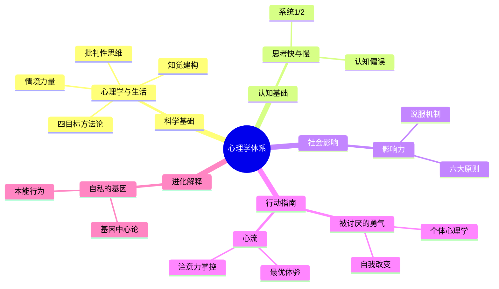

# 《心理学与生活》读书笔记

## 这本书要解决什么问题？

**核心困境**：心理学到底是科学还是算命？如何用科学方法理解人类行为和心理过程？

美国700+所院校使用的心理学入门经典，ETS推荐GRE考试参考书，豆瓣评分9.4。作者菲利普·津巴多是斯坦福大学实验心理学家，用科学方法论构建了心理学的完整体系。

**一句话定位**：
> 心理学是关于个体的行为及心智过程的科学研究——用证据说话，不是瞎猜。

### 作者站在什么位置说这些话？

| 维度 | 定位 |
|------|------|
| 主领域 | 普通心理学、科学方法论、批判性思维 |
| 跨界领域 | 社会心理学、认知科学、跨文化研究 |
| 作者背景 | 斯坦福大学心理学教授，斯坦福监狱实验设计者，美国高校最广泛使用的心理学教材作者 |
| 历史语境 | 1937年首版，持续更新至第19版。津巴多站在实验心理学家的位置，用科学方法论为心理学正名 |

### 和其他书有什么关系？

| 关联书籍 | 关联关系 | 共同底层逻辑 |
|----------|----------|--------------|
| [[被讨厌的勇气-岸见一郎]] | 理解→行动 | 津巴多解释"为什么"，阿德勒告诉你"如何改变" |
| [[心流-契克森米哈赖]] | 注意力两面 | 津巴多解释注意力机制，契克森米哈赖教你掌控注意力 |
| [[影响力-西奥迪尼]] | 深层→实战 | 津巴多研究社会影响机制，西奥迪尼总结说服实战技巧 |
| [[思考快与慢-丹尼尔·卡尼曼]] | 理论基础 | 认知偏误、双系统理论是津巴多社会心理学的认知基础 |
| [[自私的基因-道金斯]] | 跨界融合 | 心理机制背后的基因逻辑，本能行为的进化解释 |

### 知识网络图

---

## 作者的核心论点

### 心理学的科学本质：四目标方法论

心理学不是"读心术"或"算命"，是用科学方法研究行为和心理过程。

心理学家做四件事：描述行为（发生了什么）；解释原因（为什么会发生）；预测未来（什么情况下会再发生）；控制/改善（怎么让它变得更好）。

> **心理学科学定律**：心理学结论必须建立在科学方法收集的证据之上，而非主观臆断。科学的四个步骤——描述、解释、预测、控制——让我们从观察走向理解，从理解走向应用。

以前我以为心理学是"猜你在想什么"，现在意识到心理学是"用科学方法搞清楚人为什么会这样想、这样做"。心理学=科学方法+人类行为+心智过程。下次遇到有人说"心理学不科学"，我不会再附和，而是问他：你知道心理学的研究方法吗？

但这还没完，作者进一步指出：即使掌握了科学方法，你还需要一把"防护盾"来抵御伪心理学。

### 批判性思维：心理学的防护盾

书中特设"生活中的批判性思维"专栏，教读者如何区分科学心理学与伪心理学。

遇到任何心理学观点，问六个问题：观点是什么？证据是什么？其他解释？其他可能性？结论的科学性？结论的适用性？

> **批判性思维定律**：任何心理学观点都需要经过证据检验、逻辑审查、替代解释排除、适用性评估。科学的怀疑精神是心理学的防护盾。

这个观点让我重新理解了"心理学鸡汤"。他说"这个心理技巧100%有效"——问：证据在哪？有没有其他原因？对所有人都有效吗？心理学教会你：不被骗，也不自欺。

有了批判性思维这把防护盾，还会遇到一个更根本的挑战：你看到的现实本身可能就是大脑"编造"的。

### 知觉与现实：你看到的不是世界本来的样子

知觉不是"拍照"，而是大脑主动建构。

过程是这样的：外界刺激（光/声/触）→感觉器官（眼/耳/皮肤）→感觉输入（原始信号）→知觉过程（大脑主动建构）→主观现实（你感知到的）。

期望、经验、动机会影响知觉过程。两个人同处一室，看到的可能是两个不同的世界。

> **知觉建构定律**：我们感知的不是客观现实，而是大脑基于经验、期望、动机主动建构的主观现实。

这打碎了我对"客观"的迷信。你看见的"现实"不是世界本来的样子，而是你大脑"编辑"后的版本。理解了这一点，就能理解分歧、误解、偏见从何而来。

这引出了另一个问题：如果个人知觉都不可靠，群体行为会怎样？

### 社会情境的力量：为什么好人会做坏事

津巴多最著名的实验是斯坦福监狱实验：好学生穿上"狱警"制服，几天内变成了"施暴者"。不是人坏了，是情境变了。

从众（阿希实验）：别人怎么做，我也怎么做。服从（米尔格拉姆实验）：权威让我做，我就做。旁观者效应：别人都不管，我也不管。

> **情境力量定律**：人的行为深受社会情境影响。从众、服从、旁观者效应都是"情境力量"的体现。理解社会影响，才能理解"好人"为何会做"坏事"。

下次遇到"好人做坏事"的新闻，我不会再简单归因于"人品不行"，而是问：是什么样的情境把他变成了这样？

---

## 这本书的局限

> 津巴多的心理学体系是从西方实验心理学传统出发的，这套方法有它的边界。

| 批评点 | 谁在批评 | 怎么说 | 实际情况 |
|--------|---------|--------|---------|
| 教材厚重 | 普通读者 | "700+页，从入门到放弃" | 核心章节稳定，可选章节阅读 |
| 西方中心 | 跨文化研究者 | "理论和案例主要基于西方文化" | 非西方文化适用性需验证 |
| 更新频繁 | 读者 | "版本更新快，旧版可能过时" | 核心原理稳定，可关注最新版 |
| 实验伦理争议 | 学术界 | "斯坦福监狱实验存在伦理争议" | 实验结果有争议，但理论影响深远 |
| 可复制性危机 | 心理学界 | "部分经典实验无法复制" | 科学在自我修正中前进 |

**一句话总结局限性**：
> 作为心理学入门教材无可替代，但部分经典实验需要关注后续的学术争议和修正。

---

## 最值得记住的话

**原书说的**：
1. "心理学是关于个体的行为及心智过程的科学研究。"
2. "心理学的目标是描述、解释、预测和控制行为。"
3. "我们感知的不是客观现实，而是大脑主动建构的主观现实。"
4. "情境的力量可以超越个人性格，好人也可能在坏情境下做坏事。"
5. "批判性思维是评估观点的科学性的最重要的工具。"

**翻译成人话**：
1. 心理学不是算命，是用科学方法理解人为什么这样想、这样做
2. 你看见的"现实"不是世界本来的样子，而是你大脑编辑后的版本
3. 从众、服从、旁观者效应——不是性格问题，是情境的力量
4. 批判性思维=心理学的打假工具——不被骗，也不自欺
5. 心理学的四步法：描述、解释、预测、控制——从观察到行动
6. 两个人同处一室，看到的可能是两个不同的世界
7. 好"狱警"变成"施暴者"——不是人变了，是情境变了

---

## 讲给没读过的人听

心理学不是算命，是科学。津巴多是美国最著名的心理学教授之一，他写的这本书是美国700多所大学的心理学教材。

他教你四件事：描述行为——发生了什么；解释原因——为什么会发生；预测未来——什么情况下会再发生；控制改善——怎么让它变得更好。

他最有名的实验是斯坦福监狱实验：好学生穿上"狱警"制服，几天内就变成了"施暴者"。不是人坏了，是情境变了。这叫"情境力量"——你以为自己是独立的个体，实际上你随时被环境影响。

他还说，你看到的"现实"不是世界本来的样子，而是你大脑"编辑"后的版本。两个人同处一室，看到的可能是两个不同的世界。理解了这一点，就能理解分歧、误解、偏见从何而来。

---

## 用来检验理解的问题

**基础回忆**：
1. Q: 心理学的四个目标是什么？
   A: 描述行为、解释原因、预测未来、控制/改善。

2. Q: 批判性思维的六个问题是什么？
   A: 观点是什么？证据是什么？其他解释？其他可能性？结论的科学性？结论的适用性？

3. Q: 斯坦福监狱实验说明了什么？
   A: 情境力量可以超越个人性格，好人也可能在坏情境下做坏事。

**理解验证**：
1. Q: 为什么说"你看到的现实是大脑编辑的版本"？
   A: 知觉不是拍照，而是大脑主动建构。期望、经验、动机会影响知觉过程，所以两个人看到的世界可能完全不同。

2. Q: 如何区分科学心理学和伪心理学？
   A: 看证据：是否有实验验证？是否有替代解释？是否考虑适用范围？批判性思维是打假工具。

3. Q: 从众、服从、旁观者效应的共同底层逻辑是什么？
   A: 社会情境的力量——人的行为深受环境影响，往往超出个人意志。

**实际应用**：
1. Q: 下次看到"心理学技巧"，如何用批判性思维评估？
   A: 问：证据在哪？有没有其他原因？对所有人都有效吗？是否有科学实验支持？

2. Q: 回忆最近一次和别人产生分歧的经历，用"知觉建构"理论重新理解。
   A: 你们看到的可能不是同一个"现实"，而是各自大脑编辑的不同版本。

**深度分析**：
1. Q: 津巴多的情境力量和道金斯的基因自私论有什么关联？
   A: 一个从心理层面解释行为（情境操控），一个从进化层面解释本能（基因驱动）。结合起来看：情境触发的行为，底层可能有基因编码的本能。

---

## 和其他书的对话

阿德勒和津巴多站在不同的位置。津巴多是科学心理学，阿德勒是个体心理学。津巴多告诉你人类行为"为什么"这样运作，阿德勒告诉你"如何改变"自己的人生。津巴多是理解的地图，阿德勒是行动的指南。两本书一起读，理解+行动=完整的心理自由。

契克森米哈赖和津巴多在探讨注意力的两面。津巴多告诉你注意力如何工作、为什么会分散，契克森米哈赖告诉你如何让注意力持续集中。一个是机制的说明书，一个是操作手册。

西奥迪尼和津巴多在探讨社会影响的不同层面。津巴多研究从众、服从、旁观者效应——社会影响的深层机制；西奥迪尼总结六大说服原则——影响技巧的实战应用。一个是社会影响的科学实验，一个是说服技巧的实战手册。

道金斯给津巴多提供了一个更底层的解释框架。津巴多说情境力量让好人做坏事，道金斯说这些行为的底层可能是基因的自私策略——从众是为了群体生存，服从权威是为了社会秩序，旁观者效应是为了降低个体风险。心理学解释"怎么了"，进化论解释"为什么进化成这样"。

---

*拆解日期：2026-02-14*
*下次回访：1周后回顾「讲给没读过的人听」和「检验问题」*