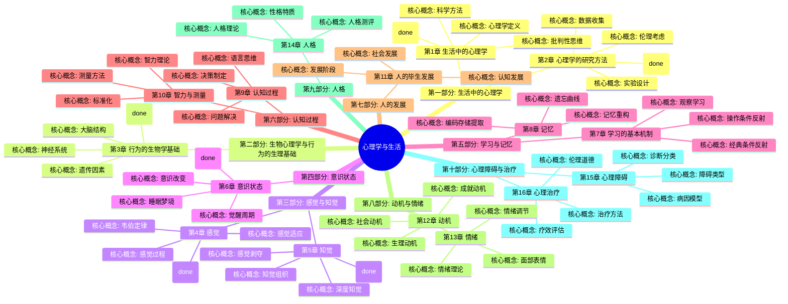
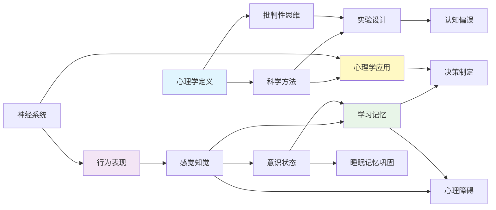

# 《心理学与生活》- 章节导航

> **作者**: 菲利普·津巴多、理查德·格里格  
> **总章节**: 16章  
> **拆解状态**: ✅ 已完成
> **核心主题**: 普通心理学+科学方法论+批判性思维+应用实践  
> **最后更新**: 2026-02-27  

---

## 📚 章节结构（Mermaid Mindmap）

---

## 🔗 核心概念关联图

---

## 📊 拆解进度追踪

| 章节 | 标题 | 状态 | 完成日期 | 核心收获 |
|------|------|------|----------|----------|
| 第1章 | 生活中的心理学 | ✅ | 2026-02-27 | 心理学的科学本质、四个目标 |
| 第2章 | 心理学的研究方法 | ✅ | 2026-02-27 | 实验法、相关法、伦理考量 |
| 第3章 | 行为的生物学基础 | ✅ | 2026-02-27 | 神经系统、大脑分区、基因影响 |
| 第4章 | 感觉 | ✅ | 2026-02-27 | 韦伯定律、感觉适应、感觉阈限 |
| 第5章 | 知觉 | ✅ | 2026-02-27 | 知觉组织、深度知觉、知觉恒常性 |
| 第6章 | 意识状态 | ✅ | 2026-02-27 | 注意机制、睡眠周期、意识改变 |
| 第7章 | 学习的基本机制 | ✅ | 2026-02-27 | 经典条件反射、操作条件反射、观察学习 |
| 第8章 | 记忆 | ✅ | 2026-02-27 | 编码存储提取、遗忘曲线、记忆重构 |
| 第8章 | 记忆 | ⏳ 待开始 | - | - |
| 第9章 | 认知过程 | ✅ | 2026-02-27 | 双系统理论、框架效应、证实偏误 |
| 第10章 | 智力与测量 | ✅ | 2026-02-27 | g因素、多元智能、信度效度、遗传环境 |
| 第11章 | 人的毕生发展 | ✅ | 2026-02-27 | 皮亚杰认知发展、埃里克森社会性发展、依恋理论 |
| 第12章 | 动机 | ✅ | 2026-02-27 | 生理动机、社会动机、成就动机 |
| 第13章 | 情绪 | ✅ | 2026-02-27 | 詹姆斯-兰格理论、沙赫特-辛格两因素理论、认知评价、情绪调节 |
| 第14章 | 人格 | ✅ | 2026-02-27 | 大五人格、防御机制、先天与后天 |
| 第15章 | 心理障碍 | ✅ | 2026-02-27 | 焦虑障碍、心境障碍、精神分裂症 |
| 第16章 | 心理治疗 | ✅ | 2026-02-27 | 精神分析、行为治疗、认知治疗、人本治疗 |
| 第16章 | 心理治疗 | ⏳ 待开始 | - | - |

**状态说明:**
- ✅ 已完成
- 🔄 进行中
- ⏳ 待开始
- ⏸️ 暂停

---

## 🚀 快速跳转

### 按章节跳转
- [[第1章-生活中的心理学]]
- [[第2章-心理学的研究方法]]
- [[第3章-行为的生物学基础]]
- [[第4章-感觉]]
- [[第5章-知觉]]
- [[第6章-意识状态]]
- [[第7章-学习的基本机制]]
- [[第8章-记忆]]
- [[第9章-认知过程]]
- [[第10章-智力与测量]]
- [[第11章-人的毕生发展]]
- [[第12章-动机]]
- [[第13章-情绪]]
- [[第14章-人格]]
- [[第15章-心理障碍]]
- [[第16章-心理治疗]]

### 按主题跳转
- [[心理学定义]]
- [[科学方法]]
- [[批判性思维]]
- [[神经系统]]
- [[学习与记忆]]
- [[认知过程]]
- [[情绪]]
- [[人格]]
- [[心理障碍与治疗]]
- [[感觉阈限]]
- [[韦伯定律]]
- [[感觉适应]]
- [[实验法]]
- [[注意机制]]
- [[睡眠科学]]
- [[意识状态]]

### 相关资源
- [[03-Resources/书籍拆解/1-拆解记录/心理学与生活-津巴多-拆解记录]]
- [[批判性思维]]
- [[社会心理学]]
- [[认知心理学]]
- [[发展心理学]]
- [[行为主义心理学]]
- [[神经科学]]
- [[被讨厌的勇气]]
- [[心流]]
- [[思考快与慢]]
- [[影响力]]
- [[积极心理学]]
- [[实验心理学]]
- [[人格心理学]]

---
