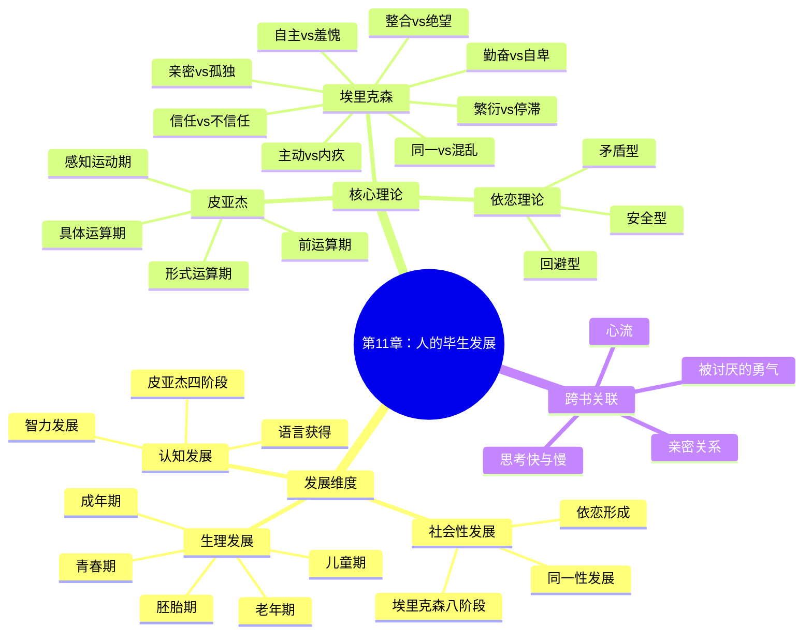

# 第11章 人的毕生发展

## 📍 章节定位

### 全书位置
> 本章位于认知与人格研究的转折点，承接智力的个体差异研究，转向个体在整个生命周期中如何发展变化的主题。探讨人从受精卵到死亡的全过程，整合生理、认知和社会性三个维度的发展规律。

- **全书核心问题**: 如何用科学方法理解人类行为和心理过程？心理学研究如何在日常生活中应用？
- **本章回答的问题**: 人是如何从婴儿成长为成人的？发展是阶段性的还是连续的？遗传和环境如何共同影响发展？
- **角色类型**: 核心概念型
- **论证位置**: 连接个体差异与生命历程的桥梁章节

### 章节序列
| 方向 | 章节标题 | 逻辑连接 |
|------|----------|----------|
| 前章 | [[第10章-智力与测量]] | 承接：智力存在个体差异 → 差异从何而来？发展视角 |
| 后章 | [[第12章-动机]] | 铺垫：了解发展规律 → 理解成年人的动机来源 |

### 一句话定位
> 第11章系统阐述人从出生到死亡的发展历程，整合皮亚杰的认知发展理论、埃里克森的社会性发展阶段论，揭示发展是遗传与环境、连续性与阶段性交织的复杂过程。

---

## 🎯 核心观点

### 第一层：表层案例
> 章节中的具体案例、故事、数据

| 案例名称 | 简要描述 | 关键引文 |
|----------|----------|----------|
| 皮亚杰三山实验 | 幼儿无法从他人视角看世界 | "前运算阶段的自我中心特征" |
| 埃里克森八阶段 | 从信任到自我整合的发展任务 | "每个阶段都有特定的心理社会危机" |
| 依恋实验 | 婴儿对照料者的依恋模式 | "安全型依恋是社会发展的基础" |
| 青春期风暴 | 青少年与父母的冲突 | "同一性危机是成长的必经之路" |
| 临终五阶段 | 库伯勒-罗斯的死亡态度研究 | "从否认到接受的转变过程" |

### 第二层：中层机制
> 案例背后的运行机制、方法论

| 机制名称 | 组成要素 | 因果链条 | 证据来源 |
|----------|----------|----------|----------|
| 认知发展阶段 | 感知运动→前运算→具体运算→形式运算 | 神经成熟 + 经验积累 → 认知结构质变 | 皮亚杰实验研究 |
| 社会性发展阶段 | 8个心理社会危机 | 社会期待 + 个体能力 → 心理危机 → 解决或固着 | 埃里克森临床观察 |
| 依恋形成机制 | 安全基地 + 探索行为 | 敏感回应 → 安全依恋 → 探索世界 | 鲍尔比依恋理论 |
| 同一性发展 | 探索 + 承诺 | 角色混乱 → 主动探索 → 身份确立 | 马西亚同一性状态研究 |

### 第三层：底层规律
> 可迁移的普遍规律

| 规律陈述 | 抽象层级 | 知识连接 | 适用范围 |
|----------|----------|----------|----------|
| 发展是遗传与环境交互作用的结果 | 生物学/心理学 | [[被讨厌的勇气-岸见一郎-拆解记录]]目的论vs决定论 | 所有生命发展 |
| 认知发展呈现阶段性而非连续性 | 认知发展理论 | [[思考快与慢-丹尼尔·卡尼曼-拆解记录]]系统发育 | 儿童认知教育 |
| 社会性发展依赖于早期依恋经验 | 依恋理论 | [[亲密关系-罗兰·米勒-拆解记录]]依恋类型 | 人际关系/亲子教育 |
| 成功老化需要持续的社会参与 | 成功老化理论 | [[心流-契克森米哈赖-拆解记录]]投入感 | 中老年生活规划 |

---

## 💬 降维翻译

### 观点1: 皮亚杰认知发展四阶段论

#### 原文表达
> 儿童的认知发展经历四个不变的阶段：感知运动阶段（0-2岁）、前运算阶段（2-7岁）、具体运算阶段（7-11岁）、形式运算阶段（11岁以上）。每个阶段的思维方式有质的不同，发展是阶段性的而非连续渐进的。

#### 降维翻译（中学生能懂）
皮亚杰发现，小孩子的思考方式和大孩子完全不同，不是一点点变聪明，而是会发生"突变"。就像玩游戏升级一样，每升一级，你的技能和能力都会发生根本性的变化。

**四个阶段可以这样理解**：
- **0-2岁 感知运动期**：婴儿只会用身体去探索，"我看到、我摸到、所以我理解"
- **2-7岁 前运算期**：小朋友开始用语言思考，但还是以自我为中心，觉得"我看到什么，别人也看到什么"
- **7-11岁 具体运算期**：可以逻辑思考了，但需要有具体的东西摆在面前，还不能想象太抽象的东西
- **11岁以上 形式运算期**：终于可以像科学家一样思考了，可以假设、推理、抽象思维

#### 日常类比（奶奶能懂）
就像种庄稼，不同的阶段需要不同的照料方式。你不能拔苗助长，让刚发芽的苗就结出果实。每个阶段有每个阶段的任务，急不来，跳不过。

**教育启示**：教小学生数学，得用苹果、糖果这些看得见摸得着的东西；但教初中生，就可以用字母x、y来代表数字了。

#### 检验
- Q: 如果一个中学生问你为什么不能直接教小孩抽象数学？
- A: 因为小孩的大脑还没发育到那个阶段，就像你不能让刚学会走路的婴儿去跑马拉松一样，认知能力是需要分阶段发展的。

---

### 观点2: 埃里克森社会性发展八阶段

#### 原文表达
> 埃里克森认为，人的一生要经历八个心理社会危机，每个阶段都有特定的发展任务。成功解决危机则发展出积极品质，失败则可能导致心理问题。这八个阶段从婴儿期的信任vs不信任开始，到老年期的自我整合vs绝望结束。

#### 降维翻译（中学生能懂）
人这一辈子，每个年龄段都有自己的"人生关卡"要过。就像游戏里的关卡Boss，打败了就能获得新能力，打不过就可能卡在那里。

**八个关卡简化版**：
1. **婴儿期**：我能相信这个世界吗？（信任感）
2. **幼儿期**：我能自己做主吗？（自主感）
3. **学前期**：我能主动做事吗？（主动性）
4. **学龄期**：我能做好事情吗？（勤奋感）
5. **青春期**：我是谁？（同一性）
6. **成年早期**：我能爱别人吗？（亲密感）
7. **成年中期**：我能贡献什么？（繁衍感）
8. **老年期**：我的人生有意义吗？（自我整合）

#### 日常类比（奶奶能懂）
就像打铁，一块铁要经过多次锤炼才能成器。每个阶段都是一次锤炼，锤得好就成为好钢，锤不好就可能留下缺陷。

**人生启示**：年轻时候的困难其实是在帮我们"过关卡"，每过一个关卡，心理就更成熟一分。

#### 检验
- Q: 如果一个中学生问为什么青春期会迷茫？
- A: 青春期是人生的"身份确认关"，你正在回答"我是谁"这个问题，迷茫说明你在认真思考这个问题，这是成长的必经之路。

---

### 观点3: 早期依恋影响一生的人际模式

#### 原文表达
> 婴儿与主要照料者之间形成的依恋模式会影响其后续的人际关系。安全型依恋的婴儿更自信、更愿意探索世界；而不安全型依恋可能导致成年后的人际困难。依恋关系为个体的内部工作模型奠定基础。

#### 降维翻译（中学生能懂）
小时候和爸妈的关系，会影响你长大后交朋友、谈恋爱的方式。如果小时候你觉得"我需要帮助时，爸妈总会出现"，你就会觉得这个世界是可靠的，以后交朋友也会更自信。

如果小时候你总觉得没人理你，或者爸妈很反复无常，你可能就会觉得"反正没人会真正关心我"，长大后就很难相信别人。

#### 日常类比（奶奶能懂）
就像盖房子打地基，地基打得牢，房子就稳；地基打得歪，房子就会出问题。小时候的经历就是人生的"地基"。

**好消息是**：地基不够好，房子还能修补。成年后通过好的关系、心理咨询，可以"重建"安全感。

#### 检验
- Q: 如果一个中学生问"小时候的事真能影响一辈子吗？"
- A: 影响是有的，但不是绝对的。就像种子需要好土壤，但也需要阳光雨露。小时候的经历是"土壤"，但后天的好经历可以改变我们的"生长"。

---

## ✨ 金句库

### 原书金句
| 金句 | 适用场景 |
|------|----------|
| "发展是贯穿生命全程的持续过程。" | 毕生发展观 |
| "每个发展阶段都有其特定的任务和危机。" | 阶段理论 |
| "早期经验为后续发展奠定基础。" | 早期教育 |
| "认知发展是阶段性的质变，而非连续的量变。" | 认知发展 |
| "成功的 aging 需要选择、优化和补偿。" | 成功老化 |

### 降维金句
| 金句 | 来源观点 | 适用场景 |
|------|----------|----------|
| 人生是打游戏，每个阶段都有要过的关。 | 社会性发展 | 人生规划 |
| 认知升级像手机系统更新，每个版本功能都不一样。 | 认知发展 | 教育理解 |
| 小时候的依恋是人生的"安全密码"。 | 依恋理论 | 亲子关系 |
| 青春期迷茫不是病，是成长的信号。 | 同一性危机 | 青少年教育 |
| 活到老学到老不是鸡汤，是脑科学。 | 神经可塑性 | 终身学习 |
| 基因给你画了蓝图，但房子怎么盖看你。 | 天性教养 | 自我成长 |

## 🔗 当下映射

### 💰 财富应用
| 场景 | 具体行动 | 预期效果 | 风险提示 |
|------|----------|----------|----------|
| 职业规划 | 用发展阶段理论规划职业生涯 | 避免在不适合的阶段做重大决定 | 过度规划失去灵活性 |
| 教育投资 | 理解认知发展规律投资教育 | 在关键期投入资源效益更高 | 不要被"关键期"焦虑绑架 |
| 养老准备 | 理解成功老化理论规划退休 | 保持社会参与延缓认知衰退 | 忽视心理健康 |

### 💼 职场应用
| 场景 | 具体行动 | 所需能力 | 适用职级 |
|------|----------|----------|----------|
| 团队管理 | 理解不同年龄员工的发展任务 | 发展心理学知识 | 管理者 |
| 青年培养 | 帮助年轻员工建立职业同一性 | 指导能力 | 带教者 |
| 职业转型 | 评估自己的发展阶段再决策 | 自我认知 | 所有阶段 |

### 🏠 生活应用
| 场景 | 具体行动 | 可行性 | 见效时间 |
|------|----------|--------|----------|
| 亲子教育 | 按认知发展阶段调整教育方式 | 高，需要学习 | 1-3个月 |
| 夫妻关系 | 理解双方不同的发展阶段需求 | 高，需要沟通 | 即时 |
| 老年生活 | 保持社会参与和终身学习 | 高，需要主动 | 长期 |

### 72小时行动计划
1. [明天可以做的第一件事]：回顾自己的成长经历，识别当前处于哪个发展阶段
2. [本周内可以尝试的事]：用皮亚杰的视角观察一个小孩，猜测他的认知发展阶段
3. [需要准备资源才能做的事]：阅读《终身成长》或《依恋》深化理解

---

## 🕸️ 章节关联

### 向上关联 → 整书
- **贡献**: 为全书提供发展的时间维度，解释个体差异的发展起源
- **位置**: 连接静态的个体差异与动态的生命历程

### 横向关联 → 章节间
| 章节编号 | 章节标题 | 关联类型 | 连接描述 |
|----------|----------|----------|----------|
| 第3章 | 行为的生物学基础 | 基础 | 遗传因素为发展奠定基础 |
| 第7章 | 学习的基本机制 | 机制 | 学习是发展的重要途径 |
| 第10章 | 智力与测量 | 前置 | 智力发展是认知发展的一部分 |
| 第12章 | 动机 | 后续 | 动机在不同发展阶段有不同特点 |
| 第14章 | 人格 | 后续 | 人格在发展中逐步形成 |

### 向下关联 → 具体应用
| 应用场景 | 难度 | 前置知识 |
|----------|------|----------|
| 亲子教育规划 | 中 | 认知发展阶段 |
| 职业生涯规划 | 中 | 社会性发展阶段 |
| 老年生活规划 | 中 | 成功老化理论 |

### 跨书关联 → 知识网络
| 书籍 | 概念 | 关系 | 备注 |
|------|------|------|------|
| [[被讨厌的勇气-岸见一郎-拆解记录]] | 目的论vs决定论 | 对话 | 阿德勒质疑弗洛伊德的童年决定论 |
| [[思考快与慢-丹尼尔·卡尼曼-拆解记录]] | 认知发展 | 延伸 | 系统思维的发展历程 |
| [[心流-契克森米哈赖-拆解记录]] | 发展任务 | 补充 | 不同年龄的心流来源 |
| [[亲密关系-罗兰·米勒-拆解记录]] | 依恋理论 | 扩展 | 成人依恋的延续 |
| [[终身成长-拆解记录]] | 成长型思维 | 应用 | 发展观的现实应用 |

### 关联可视化

---

## ❓ 问答设计

### Q1: [记忆型问题]
**认知层次**: 记忆  
**难度**: 低  
**题目**: 皮亚杰认知发展的四个阶段是什么？  
**答案要点**:
- 感知运动阶段（0-2岁）
- 前运算阶段（2-7岁）
- 具体运算阶段（7-11岁）
- 形式运算阶段（11岁以上）

### Q2: [理解型问题]
**认知层次**: 理解  
**难度**: 中  
**题目**: 为什么皮亚杰认为认知发展是阶段性的而非连续的？  
**答案要点**:
- 每个阶段的思维方式有质的差异
- 发展是非线式的，存在"飞跃"
- 儿童需要达到一定成熟度才能进入下一阶段
- 神经系统的成熟是阶段性的

### Q3: [应用型问题]
**认知层次**: 应用  
**难度**: 中  
**题目**: 如何运用皮亚杰的理论指导小学三年级学生的数学教学？  
**答案要点**:
- 三年级学生处于具体运算阶段
- 教学需要使用具体教具和实例
- 避免过于抽象的概念
- 鼓励动手操作和体验

### Q4: [分析型问题]
**认知层次**: 分析  
**难度**: 高  
**题目**: 比较皮亚杰和埃里克森发展理论的异同。  
**答案要点**:
- 相同点：都强调发展的阶段性
- 不同点：皮亚杰聚焦认知，埃里克森聚焦社会性
- 皮亚杰关注儿童期，埃里克森覆盖全生命周期
- 皮亚杰强调生物成熟，埃里克森强调社会互动

### Q5: [评估型问题]
**认知层次**: 评估  
**难度**: 高  
**题目**: "三岁看大，七岁看老"这句话在多大程度上符合发展心理学的研究发现？  
**答案要点**:
- 早期经验确实有重要影响
- 依恋模式有延续性
- 但发展是终身过程，不是完全决定
- 后期经验可以修正早期影响
- 神经可塑性贯穿一生

### Q6: [创造型问题]
**认知层次**: 创造  
**难度**: 高  
**题目**: 假设你要为不同年龄的人设计一套"人生发展指南"，你会如何设计？  
**答案要点**:
- 按埃里克森八阶段划分
- 每个阶段说明核心任务
- 提供具体行动建议
- 包含常见困惑和应对策略
- 强调终身发展的可能性

### Q7: [理解型问题]
**认知层次**: 理解  
**难度**: 低  
**题目**: 什么是"同一性危机"？它通常发生在什么年龄？  
**答案要点**:
- 青春期对"我是谁"的困惑
- 通常发生在12-18岁
- 是探索自我认同的过程
- 是成长的正常阶段

### Q8: [应用型问题]
**认知层次**: 应用  
**难度**: 中  
**题目**: 作为父母，如何帮助孩子建立安全型依恋？  
**答案要点**:
- 对婴儿的需求做出敏感回应
- 保持照料的一致性和可预测性
- 提供安全的探索基地
- 允许适度分离但保证回归

### Q9: [分析型问题]
**认知层次**: 分析  
**难度**: 中  
**题目**: 分析遗传和环境在人类发展中的相对作用。  
**答案要点**:
- 遗传提供发展可能性的范围
- 环境决定在此范围内的发展水平
- 两者存在复杂的交互作用
- 不同特质受影响程度不同
- 基因表达受环境影响

### Q10: [评估型问题]
**认知层次**: 评估  
**难度**: 中  
**题目**: 评估"关键期"概念在教育实践中的应用价值和潜在风险。  
**答案要点**:
- 价值：提醒重视某些发展机会
- 风险：可能导致过度焦虑
- 实际上多数能力存在"敏感期"而非关键期
- 后期补偿是可能的
- 应平衡科学认知与家长压力

### Q11: [创造型问题]
**认知层次**: 创造  
**难度**: 高  
**题目**: 如果你能重新设计自己的成长经历，你会如何利用发展心理学知识？  
**答案要点**:
- 识别关键发展阶段
- 思考每个阶段的发展任务
- 设计促进发展的活动
- 建立支持性的人际关系
- 但也要接受发展不可完全控制

### Q12: [记忆型问题]
**认知层次**: 记忆  
**难度**: 低  
**题目**: 埃里克森社会性发展的前四个阶段分别是什么？  
**答案要点**:
- 信任vs不信任（婴儿期）
- 自主vs羞愧/怀疑（幼儿期）
- 主动vs内疚（学前期）
- 勤奋vs自卑（学龄期）

### Q13: [应用型问题]
**认知层次**: 应用  
**难度**: 中  
**题目**: 运用发展心理学知识，解释为什么青春期孩子容易与父母发生冲突。  
**答案要点**:
- 青春期面临同一性危机
- 需要通过"反抗"确立独立性
- 大脑前额叶尚未完全发育
- 渴望被当作成年人对待
- 是成长的正常过程

### Q14: [分析型问题]
**认知层次**: 分析  
**难度**: 高  
**题目**: 分析"成功老化"需要具备哪些条件？  
**答案要点**:
- 选择：聚焦重要目标
- 优化：发挥优势能力
- 补偿：弥补衰退功能
- 保持社会参与
- 终身学习和成长心态

### Q15: [创造型问题]
**认知层次**: 创造  
**难度**: 高  
**题目**: 设计一套针对中年人的"人生下半场规划"方案。  
**答案要点**:
- 基于繁衍vs停滞的发展任务
- 平衡工作、家庭和个人发展
- 设计有意义的贡献方式
- 培养新技能和兴趣
- 为老年期做好准备

---
