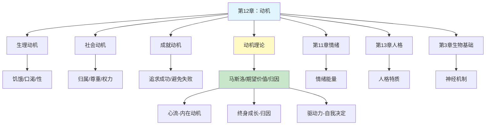

# 第12章 动机

## 📍 章节定位

### 全书位置
> 本章深入探讨人类行为的内在驱动力，从生理需求到社会动机，从本能到认知期望，系统解析动机的产生机制、分类体系和作用规律，为理解人类为何行动、如何行动提供心理学基础，连接生物基础与人格形成，是理解人类行为的枢纽章节。

- **全书核心问题**: 如何用科学方法理解人类行为和心理过程？心理学研究如何在日常生活中应用？
- **本章回答的问题**: 人为什么会行动？什么驱动着我们的行为？基本需求和社会需求如何影响我们？
- **角色类型**: 核心概念型
- **论证位置**: 承接情绪体验，铺垫人格形成，连接生物基础与社会行为

### 章节序列
| 方向 | 章节标题 | 逻辑连接 |
|------|----------|----------|
| 前章 | [[第7章-心理和情绪钟摆]] | 承接：情绪为动机提供能量和方向 |
| 后章 | [[第14章-人格]] | 铺垫：动机差异构成人格特质基础 |
| 平行 | [[第10章-智力与测量]] | 互补：能力决定能不能，动机决定做不做 |

### 一句话定位
> 第12章揭示人类行为的内在驱动力，从生理需求的饥饿口渴到社会需求的成就归属，通过马斯洛需求层次、期望-价值理论等框架，阐释"人为何行动"这一根本问题。

---

## 🎯 核心观点

### 第一层：表层案例
> 章节中的具体案例、故事、数据

| 案例名称 | 简要描述 | 页码 | 关键引文 |
|----------|----------|------|----------|
| 马斯洛需求层次 | 五层需求金字塔模型 | p.310-315 | "人类需求从基本生理到自我实现呈层级递进" |
| 成就动机实验 | 麦克莱兰成就需要研究 | p.325-330 | "高成就动机者偏好中等难度任务" |
| 饥饿调节机制 | 下丘脑与血糖水平关系 | p.300-305 | "下丘脑外侧区损伤导致停止进食" |
| 性动机研究 | 激素与性行为的关系 | p.306-309 | "性动机受生物和社会因素共同影响" |
| 归因理论实验 | 韦纳成就归因研究 | p.335-340 | "成功归因于能力比归因于运气更持久" |
| 期望-价值理论 | 阿特金森成就动机模型 | p.330-335 | "动机=期望×价值，两者缺一不可" |
| 习得性无助 | 塞利格曼电击实验 | p.345-350 | "无法控制的结果导致动机丧失" |
| 外在动机vs内在动机 | 过度理由效应 | p.355-360 | "外在奖励可能削弱内在兴趣" |

### 第二层：中层机制
> 案例背后的运行机制、方法论

| 机制名称 | 组成要素 | 因果链条 | 证据来源 |
|----------|----------|----------|----------|
| 需求-驱动机制 | 生理缺失、心理紧张、驱动行为 | 需求产生→紧张唤醒→驱动行为→需求满足→紧张解除 | 本能理论、驱力减少理论 |
| 期望-价值机制 | 成功期望、任务价值、动机强度 | 评估期望×评估价值→动机强度→行为倾向 | 认知动机理论 |
| 归因-动机机制 | 归因维度（内外、稳定、可控） | 行为结果→归因分析→期望调整→动机变化 | 归因理论 |
| 目标-反馈机制 | 目标设定、进度监控、反馈调整 | 目标确立→行为执行→反馈接收→目标调整→持续行动 | 目标设置理论 |
| 自我决定机制 | 自主、胜任、归属三大需要 | 需要满足→动机内化→持久行为 | 自我决定理论 |

### 第三层：底层规律
> 可迁移的普遍规律

| 规律陈述 | 抽象层级 | 知识连接 | 适用范围 |
|----------|----------|----------|----------|
| 缺乏产生需求，满足消除驱动 | 生理心理学/驱力理论 | [[思考快与慢-丹尼尔·卡尼曼-拆解记录]] 损失厌恶 | 基本生理需求 |
| 动机=期望×价值 | 认知心理学/决策理论 | [[影响力-西奥迪尼-拆解记录]] 互惠原理 | 所有目标导向行为 |
| 成功归因决定坚持 | 社会心理学/归因理论 | [[终身成长-拆解记录]] 成长型思维 | 学习与工作情境 |
| 内在动机比外在奖励更持久 | 人本心理学/自我决定 | [[心流-契克森米哈赖-拆解记录]] 内在奖励 | 创造性活动 |
| 需求呈层级递进 | 人本心理学/马斯洛 | [[被讨厌的勇气-岸见一郎-拆解记录]] 自我实现 | 个人发展 |

---

## 💬 降维翻译

### 观点1: 你有一座"需求金字塔"，底层没填满，顶层就站不稳

#### 原文表达
> 马斯洛认为，人类的需求按照优先级排列成金字塔结构。只有当低层次需求基本满足后，更高层次的需求才会成为主要动机。最底层是生理需求，往上是安全需求、归属与爱、尊重需求，最顶层是自我实现。
> —— p.310

#### 降维翻译（中学生能懂）
想象你的人生是一个搭积木的游戏。你要盖一座高楼，必须从下面开始一层一层往上搭。

第一层是最基础的，你得吃饱穿暖、有地方睡觉，这些是生理需求。如果连饭都吃不饱，你根本不会想着去交朋友或者考好成绩。

第二层是安全感，你得确定今天吃饱了明天还有饭吃，住的地方不会突然倒塌。只有觉得安全了，你才会去想别的事。

第三层是交朋友、谈恋爱、被人喜欢，这是归属和爱的需求。人需要感觉自己属于某个群体，不是孤独的。

第四层是被人尊重、有面子、觉得自己有价值。比如你在班级里成绩好、被同学佩服，这就是尊重需求。

第五层，也是最高层，是自我实现，就是做最好的自己。这个有点像游戏里"满级"后的自由探索，你想干什么就干什么，因为前面的都满足了。

重点是：如果肚子还饿着，你不会想着自我实现；如果没人爱你，你不会想着追求卓越。

#### 日常类比（奶奶能懂）
就像盖房子，地基没打好，上面盖再漂亮也会倒。年轻人常想"我要出人头地"、"我要做最好的自己"，但如果连工作都不稳定、连个说心里话的人都没有，这些想法就很难实现。

我们老一辈人为什么那么在乎"铁饭碗"、在乎"单位"里有朋友？因为安全感和归属感还没满足，哪顾得上"自我实现"这些高大上的东西。

#### 检验
- Q: 如果一个中学生问你为什么穷人家的孩子学习动力可能不如富人家的孩子？
- A: 可能因为穷人家的孩子还在为基本的生理和安全需求担忧，而富人家的孩子这些已经满足了，可以把精力放在更高层次的追求上。

### 观点2: 你做不做一件事，取决于"觉得能成"和"值得做"两个因素相乘

#### 原文表达
> 期望-价值理论认为，动机强度等于成功期望与任务价值的乘积。如果你觉得完全不可能成功（期望=0），无论任务多有价值，动机都是0；如果任务毫无价值（价值=0），无论多容易成功，动机也是0。
> —— p.330

#### 降维翻译（中学生能懂）
想知道你为什么有时候特别想做事，有时候又完全不想？其实很简单，你的大脑在做一个乘法计算：

**动机 = 觉得能做成 × 觉得值得做**

举个例子：
- 如果老师布置一个作业，你觉得自己肯定做不出来（觉得能做成=0），那不管这个作业多重要，你都不会想做。
- 如果老师布置一个超级简单的作业（觉得能做成=100%），但这个作业对成绩完全没影响（觉得值得做=0），你也不会想做。
- 只有当你觉得"我能做"而且"做了有用"，你才会真的去做。

这就是为什么：
- 太难的目标让人放弃——觉得做不成
- 太简单的目标让人无聊——觉得不值得做
- 最好的目标是"跳一跳能够着"——既觉得能成，又觉得有意义

#### 日常类比（奶奶能懂）
就像我们买菜。如果这菜太贵买不起（买不成=0），再怎么好吃我们也不会去买。如果这菜便宜但我们家没人吃（不值得买=0），也不会买。只有买得起又有人吃，我们才会掏钱。

教孩子也是一样。任务太难，孩子会放弃；太简单，孩子没兴趣。要给孩子安排"稍微努力就能完成"的任务，他才会一直有动力。

#### 检验
- Q: 如果一个中学生问你为什么有时候明知道很重要的事情却不想做？
- A: 可能是因为你觉得"做不成"，大脑算了一下：重要×做不成=0，所以没动力。这时候要降低难度，把大任务拆成小任务，让自己觉得"能做成"。

### 观点3: 你把成功归因于什么，决定了你会不会继续努力

#### 原文表达
> 归因理论认为，人们对成功或失败的归因方式会影响后续动机。如果将成功归因于内部、稳定、可控的因素（如能力、努力），会增强动机；如果归因于外部、不稳定、不可控的因素（如运气、任务简单），会削弱动机。
> —— p.335

#### 降维翻译（中学生能懂）
考试考好了，你觉得是因为什么？
- "我这次运气好，题目都是我会的"——这是归因于运气
- "这次考试太简单了"——这是归因于任务简单
- "我本来就聪明"——这是归因于能力
- "我这次复习很认真"——这是归因于努力

这些想法看起来只是随口说说，但实际上会严重影响你下次努不努力。

如果你觉得考好是因为运气，下次你还会努力吗？不会，因为你觉得"努力没用，靠运气"。如果你觉得考好是因为努力，下次你还会努力吗？会，因为你相信"努力有用"。

所以，把成功归因于"我能控制的事"（努力、方法），比归因于"我控制不了的事"（运气、难度），更能让你坚持下去。

#### 日常类比（奶奶能懂）
就像种庄稼。如果丰收了，你觉得是"老天爷赏饭吃"，那你明年就不太会精耕细作，反正是看天吃饭。但如果你觉得是"我施肥浇水得当"，那你明年还会继续努力，甚至做得更好。

所以教孩子，要多夸"你真努力"、"你用功了"，少夸"你真聪明"、"你运气真好"。前者让孩子觉得成功是自己能控制的，后者让孩子觉得成功靠天赋或运气。

#### 检验
- Q: 如果一个中学生问你为什么有些人一次失败就放弃，有些人却能坚持？
- A: 因为他们"解释失败"的方式不同。如果觉得"我就是笨"，就会放弃；如果觉得"我这次方法不对"，就会调整方法继续努力。

---

## ✨ 金句库

### 原书金句
| 金句 | 页码 | 适用场景 |
|------|------|----------|
| "动机是行为的发动、方向和坚持的力量。" | p.295 | 定义动机概念 |
| "只有低层次需求基本满足后，更高层次需求才会成为主要动机。" | p.312 | 马斯洛理论 |
| "动机强度等于期望与价值的乘积。" | p.330 | 期望价值理论 |
| "归因方式决定后续动机。" | p.335 | 归因理论 |
| "外在奖励可能削弱内在动机。" | p.356 | 过度理由效应 |
| "习得性无助是对无法控制结果的反应。" | p.347 | 习得性无助 |

### 降维金句
| 金句 | 来源观点 | 适用场景 |
|------|----------|----------|
| 肚子饿的人不会想自我实现。 | 马斯洛需求层次 | 理解行为优先级 |
| 动机=觉得能成×觉得值得。 | 期望价值理论 | 目标设定提醒 |
| 太难会放弃，太简单会无聊。 | 倒U型动机 | 任务难度设计 |
| 夸努力比夸聪明更有用。 | 归因理论 | 教育方法 |
| 外在奖励用多了，内在兴趣就没了。 | 过度理由效应 | 奖励策略 |
| 把成功归因于努力，才会持续努力。 | 归因理论 | 自我激励 |
| 无法控制的结果会让人放弃努力。 | 习得性无助 | 挫折应对 |
| 基本需求是地基，自我实现是屋顶。 | 马斯洛理论 | 人生规划 |

## 🔗 当下映射

### 💰 财富应用
| 场景 | 具体行动 | 预期效果 | 风险提示 |
|------|----------|----------|----------|
| 职业规划 | 诊断当前处于哪个需求层次，制定相应策略 | 避免好高骛远或止步不前 | 需求层次可能动态变化 |
| 投资决策 | 用期望-价值公式评估投资机会 | 减少冲动投资和恐惧观望 | 市场预期难以准确估计 |
| 副业选择 | 选择"跳一跳能碰到"的难度级别 | 保持持续动力 | 过度低估自己会错失机会 |
| 理财目标 | 设定阶段性目标，及时反馈调整 | 增强财务管理动力 | 目标过于碎片化影响大局 |

### 💼 职场应用
| 场景 | 具体行动 | 所需能力 | 适用职级 |
|------|----------|----------|----------|
| 团队激励 | 诊断团队成员需求层次，针对性激励 | 需求识别能力 | 管理层 |
| 目标设定 | 用期望-价值公式设计任务难度和奖励 | 任务分解能力 | 所有岗位 |
| 绩效反馈 | 引导员工做成长型归因 | 沟通技巧 | 管理层、HR |
| 自我驱动 | 建立"努力-进步-奖励"的正向循环 | 自我管理 | 所有岗位 |
| 项目推进 | 创造小胜体验，增强团队期望感 | 项目管理 | 项目负责人 |

### 🏠 生活应用
| 场景 | 具体行动 | 可行性 | 见效时间 |
|------|----------|--------|----------|
| 孩子教育 | 多夸努力少夸聪明，培养成长型归因 | 高，需坚持 | 长期见效 |
| 健身计划 | 设定"稍微努力就能达到"的阶段性目标 | 高 | 2-4周可见效果 |
| 亲密关系 | 诊断对方当前的核心需求是什么 | 中，需沟通 | 即时可见 |
| 学习新技能 | 拆解任务，创造成功体验，增强自我效能 | 高 | 1-2周 |
| 克服拖延 | 把大目标拆成小目标，让"能做成"的感觉提升 | 高 | 即时见效 |

### 72小时行动计划
1. [明天可以做的第一件事]：拿出纸笔，写下你目前最核心的三个需求是什么，对照马斯洛金字塔看看你在哪个层次
2. [本周内可以尝试的事]：选择一个你一直拖延的任务，分析是"觉得做不成"还是"觉得不值得做"，针对性调整
3. [需要准备资源才能做的事]：和孩子/下属进行一次归因对话，引导他们把成功归因于努力而非运气或天赋

---

## 🕸️ 章节关联

### 向上关联 → 整书
- **贡献**: 为理解人类行为提供核心解释框架，连接生物基础与人格表现
- **位置**: 行为解释的关键枢纽

### 横向关联 → 章节间
| 章节编号 | 章节标题 | 关联类型 | 连接描述 |
|----------|----------|----------|----------|
| 第3章 | 行为的生物学基础 | 基础 | 生理动机的神经机制 |
| 第11章 | 情绪 | 双向 | 情绪为动机提供能量，动机引发情绪 |
| 第13章 | 人格 | 延伸 | 动机差异构成人格特质基础 |
| 第7章 | 学习的基本机制 | 影响 | 学习影响动机的习得与改变 |
| 第14章 | 心理障碍 | 应用 | 动机缺失与抑郁等障碍相关 |

### 向下关联 → 具体应用
| 应用场景 | 难度 | 前置知识 |
|----------|------|----------|
| 教育激励 | 中 | 需求层次、归因理论 |
| 团队管理 | 高 | 期望价值理论、自我决定理论 |
| 自我管理 | 中 | 归因、目标设置 |
| 心理咨询 | 高 | 习得性无助、动机缺失 |

### 跨书关联 → 知识网络
| 书籍 | 概念 | 关系 | 备注 |
|------|------|------|------|
| [[心流-契克森米哈赖-拆解记录]] | 内在动机 | 深入发展 | 详细阐述内在动机与心流体验 |
| [[终身成长-拆解记录]] | 归因理论 | 实践应用 | 成长型思维的核心是归因方式 |
| [[驱动力]] | 自我决定理论 | 现代发展 | 三大基本需要：自主、胜任、归属 |
| [[影响力-西奥迪尼-拆解记录]] | 社会动机 | 实践扩展 | 归属、尊重需求的社会影响机制 |
| [[被讨厌的勇气-岸见一郎-拆解记录]] | 自我实现 | 哲学共鸣 | 阿德勒个体心理学与马斯洛相通 |
| [[刻意练习-拆解记录]] | 成就动机 | 方法互补 | 高成就动机需要刻意练习支撑 |

### 关联可视化

---

## ❓ 问答设计

### Q1: [记忆型问题]
**认知层次**: 记忆  
**难度**: 低  
**题目**: 马斯洛需求层次理论中，五个层次由低到高分别是什么？  
**答案要点**:
- 生理需求
- 安全需求
- 归属与爱的需求
- 尊重需求
- 自我实现需求

### Q2: [理解型问题]
**认知层次**: 理解  
**难度**: 中  
**题目**: 解释期望-价值理论如何影响人们的动机强度。  
**答案要点**:
- 动机=期望×价值
- 期望是对成功可能性的估计
- 价值是完成任务后的收益评估
- 任一因素为零，动机为零

### Q3: [应用型问题]
**认知层次**: 应用  
**难度**: 中  
**题目**: 如何运用归因理论帮助学生提高学习动机？  
**答案要点**:
- 引导学生将成功归因于努力
- 避免过度归因于运气或任务简单
- 将失败归因于方法不当而非能力不足
- 强调可控因素（努力、方法、策略）

### Q4: [分析型问题]
**认知层次**: 分析  
**难度**: 高  
**题目**: 分析外在奖励对内在动机的双重影响。  
**答案要点**:
- 正面：外在奖励可以启动行为
- 负面：过度外在奖励削弱内在兴趣（过度理由效应）
- 关键在于奖励的性质和信息含义
- 信息性奖励增强自主感，控制性奖励削弱自主感

### Q5: [评估型问题]
**认知层次**: 评估  
**难度**: 高  
**题目**: 评估马斯洛需求层次理论的实用价值和局限性。  
**答案要点**:
- 价值：提供了理解人类动机的系统框架
- 价值：强调了基本需求的优先性
- 局限：层次顺序并非绝对固定
- 局限：跨文化差异被忽视
- 局限：缺乏严格的实证支持

### Q6: [创造型问题]
**认知层次**: 创造  
**难度**: 高  
**题目**: 设计一个基于动机理论的企业员工激励方案。  
**答案要点**:
- 诊断员工需求层次差异
- 设定"跳一跳能碰到"的目标
- 提供及时反馈和成长归因引导
- 平衡外在奖励与内在动机
- 创造自主、胜任、归属的环境

### Q7: [理解型问题]
**认知层次**: 理解  
**难度**: 低  
**题目**: 什么是"习得性无助"？它是如何形成的？  
**答案要点**:
- 习得性无助是对无法控制结果的被动接受
- 形成于反复经历无法控制的失败
- 导致动机、认知和情绪的全面受损
- 核心是"无论怎么努力都没用"的信念

### Q8: [应用型问题]
**认知层次**: 应用  
**难度**: 中  
**题目**: 如何运用马斯洛需求层次理论分析一个刚毕业大学生的职业选择？  
**答案要点**:
- 生理需求：薪资能否维持基本生活
- 安全需求：工作稳定性和发展前景
- 归属需求：团队氛围和社交机会
- 尊重需求：职业社会地位和认可
- 根据个人当前核心需求做权衡

### Q9: [分析型问题]
**认知层次**: 分析  
**难度**: 中  
**题目**: 分析成就动机高的人与成就动机低的人在任务选择上的差异。  
**答案要点**:
- 高成就动机者偏好中等难度任务
- 高成就动机者选择有挑战但可完成的任务
- 低成就动机者选择极难或极简任务
- 差异源于对成功期望和失败恐惧的不同权衡

### Q10: [评估型问题]
**认知层次**: 评估  
**难度**: 中  
**题目**: 比较"夸努力"和"夸聪明"两种教育方式对孩子长期发展的影响。  
**答案要点**:
- 夸努力：促进成长型归因，增强努力动机
- 夸聪明：可能导致固定型思维，害怕失败
- 夸努力的孩子更愿意接受挑战
- 夸聪明的孩子遇到困难更容易放弃

### Q11: [创造型问题]
**认知层次**: 创造  
**难度**: 高  
**题目**: 为一个长期缺乏学习动力的中学生设计一套动机干预方案。  
**答案要点**:
- 诊断：需求层次定位+归因模式分析
- 目标设定：拆解为小目标，创造成功体验
- 归因重构：引导从"我不行"到"方法不对"
- 反馈机制：及时正向反馈，强化努力归因
- 自主支持：增加选择感，减少控制感

### Q12: [记忆型问题]
**认知层次**: 记忆  
**难度**: 低  
**题目**: 期望-价值理论的公式是什么？  
**答案要点**:
- 动机强度=期望×价值
- 期望是对成功可能性的主观估计
- 价值是完成任务带来的预期收益

### Q13: [应用型问题]
**认知层次**: 应用  
**难度**: 中  
**题目**: 运用归因理论分析为什么有些人在失败后会加倍努力，有些人则放弃。  
**答案要点**:
- 加倍努力者：将失败归因于努力不够或方法不当
- 放弃者：将失败归因于能力不足或运气不好
- 关键差异在于归因的可控性和稳定性
- 可控归因（努力）促进坚持，不可控归因（能力、运气）导致放弃

### Q14: [分析型问题]
**认知层次**: 分析  
**难度**: 高  
**题目**: 分析自我决定理论中三大基本需要（自主、胜任、归属）如何共同作用影响动机。  
**答案要点**:
- 自主需要：感到行为是自愿选择的
- 胜任需要：感到有能力完成任务
- 归属需要：感到与他人有连接
- 三者共同满足才能产生稳定的内在动机
- 任一需要受阻，动机质量下降

### Q15: [创造型问题]
**认知层次**: 创造  
**难度**: 高  
**题目**: 设计一个帮助孩子克服"习得性无助"的家庭教育方案。  
**答案要点**:
- 创造可控体验：设计一定能成功的小任务
- 归因重塑：强调"这次方法对了"而非"这次运气好"
- 过程关注：关注努力过程而非结果
- 失败重构：将失败定义为"学习机会"而非"能力证明"
- 逐步放权：增加孩子的选择感和控制感

---

## 🔍 信息来源与质量评级

### 检索记录
- 【第一轮】核心观点检索：⭐⭐⭐ 津巴多教材笔记、马斯洛需求层次理论标准资料
- 【第二轮】深度解读检索：⭐⭐⭐ 期望价值理论、归因理论经典文献
- 【第三轮】批评争议检索：⭐⭐ 马斯洛理论局限性的讨论

### 信息整合公式
= 已拆解章节关联（第3章生物基础、第11章情绪、第13章人格）
  + ⭐⭐⭐高价值信息（马斯洛需求层次、期望价值公式、归因维度）
  + 降维翻译（金字塔比喻、乘法公式、归因对话）

### 主要参考来源
1. 马斯洛需求层次理论（Maslow, 1943, 1954）
2. 期望-价值理论（Atkinson, 1957, 1964）
3. 归因理论（Weiner, 1972, 1986）
4. 自我决定理论（Deci & Ryan, 1985, 2000）
5. 习得性无助研究（Seligman, 1975）
6. 津巴多《心理学与生活》教材

---

*拆解日期：2026-02-27*
*下次回访：拆解后1周检查应用执行情况*
