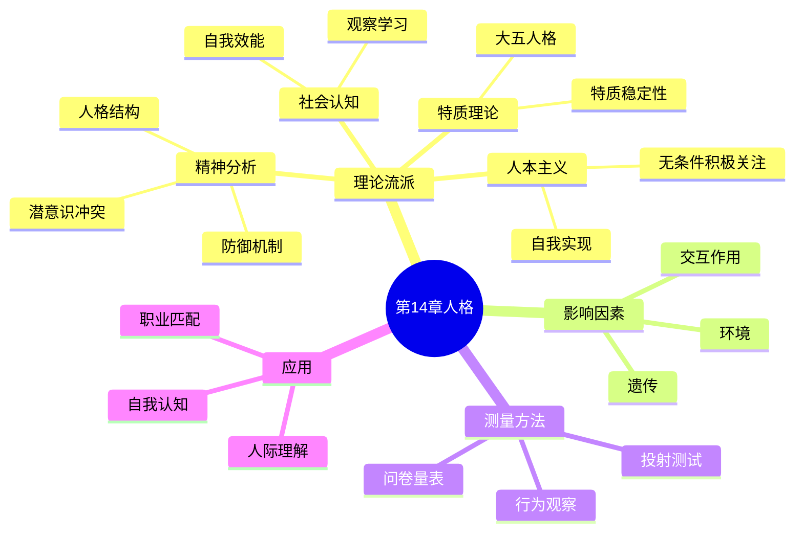

# 第14章 人格

## 📍 章节定位

### 全书位置
> 本章系统介绍人格的定义、主要理论流派和测量方法，探讨人格如何由生物遗传、心理发展和社会文化共同塑造，帮助读者理解"我为什么是我"这一终极命题，并为理解个体差异和心理障碍提供理论框架。

- **全书核心问题**: 如何用科学方法理解人类行为和心理过程？心理学研究如何在日常生活中应用？
- **本章回答的问题**: 什么是人格？人格是天生的还是后天形成的？如何科学地测量人格？不同理论流派如何解释人格？
- **角色类型**: 核心概念型
- **论证位置**: 承上启下的枢纽章节，连接社会心理学与临床应用

### 章节序列
| 方向 | 章节标题 | 逻辑连接 |
|------|----------|----------|
| 前章 | [[第13章-社会心理学]] | 承接：社会情境影响行为，人格解释个体差异 |
| 后章 | [[第15章-心理障碍]] | 铺垫：人格特质是理解心理障碍的基础框架 |

### 一句话定位
> 第14章以多元理论视角解构人格的本质，从弗洛伊德的潜意识冲突到大五人格的科学测量，揭示是什么让我们成为独特的自己，以及如何理解和接纳自己与他人的差异。

---

## 🎯 核心观点

### 第一层：表层案例
> 章节中的具体案例、故事、数据

| 案例名称 | 简要描述 | 页码 | 关键引文 |
|----------|----------|------|----------|
| 小艾伯特实验 | 华生通过条件反射让婴儿害怕白鼠，展示环境塑造行为 | p.420-422 | "人格是习惯的产物" |
| 罗夏墨迹测试 | 用模糊刺激揭示潜意识投射，经典人格测评 | p.445-447 | "我们看到的不是墨迹，而是自己" |
| 双生子研究 | 同卵双胞胎分开抚养后人格高度相似 | p.415-417 | "遗传为人格画了底色" |
| 防御机制案例 | 用合理化、投射等方式应对焦虑 | p.425-428 | "我们欺骗自己，是为了保护自己" |
| 大五人格量表 | 五个维度概括人格差异的科学框架 | p.438-442 | "五个词几乎可以描述所有人的性格" |
| 自我效能感研究 | 班杜拉证明相信自己能做到会提高成功率 | p.432-435 | "相信的力量比能力本身更重要" |

### 第二层：中层机制
> 案例背后的运行机制、方法论

| 机制名称 | 组成要素 | 因果链条 | 证据来源 |
|----------|----------|----------|----------|
| 特质稳定性机制 | 遗传倾向、选择性环境、身份认同 | 基因预设→环境选择→行为强化→特质固化 | 纵向追踪研究 |
| 防御机制运作 | 焦虑触发、潜意识策略、自我保护 | 威胁感知→焦虑产生→防御激活→心理平衡 | 精神分析临床观察 |
| 自我实现过程 | 无条件积极关注、价值条件化、真实自我 | 环境接纳→减少防御→自我探索→潜能发挥 | 人本主义治疗研究 |
| 社会认知反馈 | 自我效能、结果预期、目标设定 | 成功经验→效能提升→挑战接受→更多成功 | 班杜拉实验研究 |

### 第三层：底层规律
> 可迁移的普遍规律

| 规律陈述 | 抽象层级 | 知识连接 | 适用范围 |
|----------|----------|----------|----------|
| 人格是遗传与环境交互的产物 | 发展心理学/行为遗传学 | [[天生不同]]MBTI与遗传 | 所有行为解释 |
| 特质具有跨时间稳定性 | 人格心理学/测量学 | [[被讨厌的勇气]]目的论vs特质论 | 长期预测 |
| 我们用防御机制维护自尊 | 精神分析/自我心理学 | [[少有人走的路]]面对真相 | 心理适应 |
| 自我概念影响行为选择 | 社会认知理论 | [[终身成长]]成长型思维 | 行为改变 |

---

## 💬 降维翻译

### 观点1: 你的人格是天生的底色加上后天的涂改

#### 原文表达
> 人格的形成是遗传因素与环境因素复杂交互的结果。双生子研究表明，许多人格特质有40%-60%的遗传率，但环境同样扮演关键角色——不是家庭共享的环境，而是每个人独特的经历。
> —— p.415

#### 降维翻译（中学生能懂）
你有没有发现，有的孩子天生就爱说话，有的天生就安静？这不是后天教出来的，是娘胎里带来的。

科学家研究了很多双胞胎，发现即使从小分开养，他们长大后性格还是很像。这说明什么？**基因给人格画了一张底稿**。

但是，基因不是全部。就像同样一块布，可以做成西装，也可以做成T恤。你的人生经历、交的朋友、遇到的挫折，都在不断修改这张底稿。

所以不要说"我就是这种人，改不了"，也不要说"我全靠后天努力"。真相是：**天生给了你一个起点，但路是自己走出来的**。

#### 日常类比（奶奶能懂）
就像种庄稼。种什么种子，就长什么苗，这是天生的。但同样的种子，种在肥沃的地里和贫瘠的地里，长出来的庄稼就不一样。你后天的经历就是那块地的肥力。

又像打牌。你一出生就发到了一手牌，这是天注定的。但怎么打这手牌，能打成什么样，看你自己的本事。

#### 检验
- Q: 如果一个中学生问你性格能不能改？
- A: 能改，但不是全改。就像你可以学着自己不那么害羞，但如果天生就是个内向的人，就不要强迫自己变成社交达人。接受自己的底色，然后在上面画出自己的画。

### 观点2: 大五人格——五个词说透所有人

#### 原文表达
> 大五人格模型提出，人格可以在五个基本维度上描述：外向性、宜人性、尽责性、神经质和开放性。这五个维度跨文化稳定存在，能有效预测行为表现和人生结果。
> —— p.438

#### 降维翻译（中学生能懂）
心理学家研究了很久，最后发现：**用五个词，几乎可以描述所有人的性格**。

这五个词是：
1. **外向性**：你爱不爱热闹？是派对动物还是宅男宅女？
2. **宜人性**：你好不好相处？是老好人还是刺头？
3. **尽责性**：你靠不靠谱？做事有计划还是随心所欲？
4. **神经质**：你稳不稳定？容易焦虑还是比较淡定？
5. **开放性**：你爱不爱新鲜？喜欢尝试还是习惯老路？

每个人在这五个维度上都有不同的分数，组合起来就是你的"性格指纹"。没有哪种组合是完美的，每种都有自己的优势和坑。

#### 日常类比（奶奶能懂）
就像做菜要放五种调料：盐、糖、酸、辣、鲜。每个人放的量不一样，做出来的味道就不一样。但不管什么菜，基本上都是这五种味道的组合。

又像调色盘。只有红黄蓝三原色，但调来调去能调出无数种颜色。人的性格也是这样，五个维度，千变万化。

#### 检验
- Q: 如果一个中学生问你怎么知道自己是什么性格？
- A: 想想这几个问题：你更喜欢一个人待着还是和朋友玩？你容易相信人还是比较多疑？你的作业通常是提前完成还是拖到最后？你容易担心还是比较想得开？你喜欢尝鲜还是喜欢熟悉的东西？这些问题的答案就能告诉你你的性格底色。

### 观点3: 防御机制——大脑的自我欺骗系统

#### 原文表达
> 防御机制是自我用来降低焦虑、保护自尊的潜意识策略。常见的防御机制包括压抑、否认、投射、合理化等，它们在短期内有效，但长期过度使用会导致心理问题。
> —— p.425

#### 降维翻译（中学生能懂）
你的大脑有个"自我保护系统"，当你面对让自己不舒服的事实时，它会自动帮你"美化"一下。

比如：
- **合理化**：考试考砸了，你会说"这次题太难"，而不是"我没学好"
- **投射**：你自己很自私，但你总觉得"别人都太自私了"
- **否认**：明明有问题，但你说"没什么大不了的"
- **转移**：被老板骂了，回家对家人发火

这些机制就像心理"止痛药"，让你暂时好受点。但问题是，**止痛药不能治病**。长期骗自己，问题会越来越大。

#### 日常类比（奶奶能懂）
就像家里有点乱，你把东西都塞进柜子里，看起来干净了，但乱还在里面。防御机制就是把问题塞进大脑的"柜子"里，眼不见心不烦。

又像戴有色眼镜。世界本来不是这个颜色，但你的眼镜帮你过滤掉了一些不舒服的东西。戴久了，你就忘了世界本来的样子。

#### 检验
- Q: 如果一个中学生问为什么人总喜欢找借口？
- A: 因为找借口比承认错误舒服多了。承认错误会让人不舒服，所以大脑会自动帮你"解释"过去。适度的借口是正常的，但如果每次都找借口，就永远看不到真正的问题了。

---

## ✨ 金句库

### 原书金句
| 金句 | 页码 | 适用场景 |
|------|------|----------|
| "人格是稳定的思维、情感和行为模式。" | p.408 | 人格定义 |
| "遗传为人格画了底色，环境在上面涂改。" | p.415 | 先天后天讨论 |
| "我们看到的不是墨迹，而是自己。" | p.446 | 投射测试解释 |
| "五个维度几乎可以描述所有人的性格差异。" | p.439 | 大五模型介绍 |
| "相信自己能做到，有时比实际能做到更重要。" | p.433 | 自我效能感 |
| "防御机制是心灵的止痛药，不是治病的药。" | p.427 | 心理适应 |

### 降维金句
| 金句 | 来源观点 | 适用场景 |
|------|----------|----------|
| 你的性格是天生的牌，怎么打看你自己的本事。 | 遗传与环境 | 自我接纳 |
| 五个词说透所有人：外向、友善、靠谱、稳定、开放。 | 大五人格 | 性格理解 |
| 找借口是大脑的自我保护，但借口不能解决问题。 | 防御机制 | 自我觉察 |
| 你的人格像指纹一样独特，但也有规律可循。 | 特质理论 | 个体差异 |
| 相信自己的力量，有时候比能力本身还重要。 | 自我效能 | 自信建立 |
| 了解自己比改变自己更重要。 | 自我认知 | 个人成长 |

## 🔗 当下映射

### 💰 财富应用
| 场景 | 具体行动 | 预期效果 | 风险提示 |
|------|----------|----------|----------|
| 职业选择 | 根据大五人格匹配适合的职业路径 | 提高职业满意度和成功率 | 避免过度限制可能性 |
| 投资风格 | 了解自己的风险偏好和决策模式 | 选择匹配的投资策略 | 自我认知可能存在偏差 |
| 创业合伙 | 评估合伙人的性格互补性 | 组建平衡的创业团队 | 性格测试不是唯一标准 |

### 💼 职场应用
| 场景 | 具体行动 | 所需能力 | 适用职级 |
|------|----------|----------|----------|
| 团队建设 | 了解团队成员的性格差异，合理分工 | 观察力与沟通力 | 管理者 |
| 冲突管理 | 识别冲突背后的性格差异和防御机制 | 同理心与分析力 | 所有岗位 |
| 领导力发展 | 了解自己的领导风格和盲区 | 自我反思能力 | 中高层 |
| 压力管理 | 识别自己在压力下的典型反应模式 | 自我觉察能力 | 所有岗位 |

### 🏠 生活应用
| 场景 | 具体行动 | 可行性 | 见效时间 |
|------|----------|--------|----------|
| 自我了解 | 完成一次正规的人格测评，认真解读 | 高，需找可靠工具 | 即时 |
| 亲密关系 | 理解伴侣的性格差异，减少"改造对方"的冲动 | 中，需持续实践 | 长期见效 |
| 亲子教育 | 尊重孩子的天生气质，不强行扭转 | 高，需调整心态 | 持续进行 |
| 个人成长 | 在接纳现有性格基础上，做针对性微调 | 中，需自我觉察 | 3-6个月 |

### 72小时行动计划
1. **明天可以做的第一件事**：在网上找一份正规的大五人格测试，完成测试并记录结果
2. **本周内可以尝试的事**：观察自己一天中的防御机制表现（找借口、怪别人、假装没事等），记录3个例子
3. **需要准备资源才能做的事**：邀请一个信任的朋友，互相分享对对方性格的观察，对比自己的自我认知

---

## 🕸️ 章节关联

### 向上关联 → 整书
- **贡献**: 为全书提供解释个体差异的核心框架，是理解"为什么不同人对同一情境反应不同"的关键
- **位置**: 从普遍心理规律转向个体差异的枢纽

### 横向关联 → 章节间
| 章节编号 | 章节标题 | 关联类型 | 连接描述 |
|----------|----------|----------|----------|
| 第13章 | 社会心理学 | 承接 | 社会情境影响行为，人格解释个体差异 |
| 第15章 | 心理障碍 | 铺垫 | 人格特质是心理障碍的风险和保护因素 |
| 第11章 | 动机 | 基础 | 动机是人行为的驱动力，人格是行为的稳定模式 |
| 第3章 | 行为的生物学基础 | 机制 | 遗传因素通过生物学基础影响人格形成 |

### 向下关联 → 具体应用
| 应用场景 | 难度 | 前置知识 |
|----------|------|----------|
| 自我认知与接纳 | 低 | 基本心理概念 |
| 职业规划匹配 | 中 | 对各职业的了解 |
| 人际关系理解 | 中 | 同理心基础 |
| 亲子教育调整 | 高 | 儿童发展知识 |

### 跨书关联 → 知识网络
| 书籍 | 概念 | 关系 | 备注 |
|------|------|------|------|
| [[天生不同]] | MBTI人格类型 | 实践扩展 | 荣格理论的类型学应用 |
| [[被讨厌的勇气]] | 目的论vs特质论 | 对话视角 | 阿德勒反对人格决定论 |
| [[内向者优势]] | 内向性格优势 | 深化应用 | 对内向性的重新定义 |
| [[终身成长]] | 固定型vs成长型思维 | 互补视角 | 人格与信念系统的互动 |
| [[少有人走的路]] | 自我成长与人格成熟 | 哲学延展 | 人格发展的精神维度 |
| [[思考快与慢]] | 认知风格差异 | 机制深化 | 人格影响决策模式 |

### 关联可视化

---

## ❓ 问答设计

### Q1: [记忆型问题]
**认知层次**: 记忆  
**难度**: 低  
**题目**: 大五人格的五个维度分别是什么？  
**答案要点**:
- 外向性（Extraversion）
- 宜人性（Agreeableness）
- 尽责性（Conscientiousness）
- 神经质（Neuroticism）
- 开放性（Openness）

### Q2: [理解型问题]
**认知层次**: 理解  
**难度**: 中  
**题目**: 解释人格的"先天与后天"是如何共同作用的。  
**答案要点**:
- 遗传为人格提供了基础倾向（约40%-60%的遗传率）
- 环境因素（尤其是非共享环境）塑造人格的具体表现
- 遗传和环境存在交互作用，基因影响对环境的选择
- 先天提供起点，后天决定发展路径

### Q3: [应用型问题]
**认知层次**: 应用  
**难度**: 中  
**题目**: 如何运用大五人格理论帮助一个大学生选择适合的职业方向？  
**答案要点**:
- 高外向者适合销售、公关等社交密集型工作
- 高尽责者适合需要规划和执行力的工作
- 高开放者适合创意、研究等需要创新的工作
- 高宜人者适合服务、教育等人际互动工作
- 神经质高者需考虑压力管理，选择相对稳定的工作环境

### Q4: [分析型问题]
**认知层次**: 分析  
**难度**: 高  
**题目**: 比较精神分析理论和人本主义理论对人格发展的不同观点。  
**答案要点**:
- 精神分析：强调潜意识冲突、早期经历、防御机制
- 人本主义：强调自我实现、无条件积极关注、成长潜能
- 精神分析关注"病态"的来源，人本主义关注"健康"的发展
- 精神分析是问题导向，人本主义是资源导向
- 两者在临床应用中可以互补

### Q5: [评估型问题]
**认知层次**: 评估  
**难度**: 高  
**题目**: 评估人格测试在招聘中的价值和风险。  
**答案要点**:
- 价值：预测工作表现、团队匹配度、降低招聘失误
- 风险：测试效度有限、刻板印象、隐私问题、被试作假
- 应该作为参考而非决定因素
- 需要结合面试、工作样本等多种方法
- 注意法律和伦理边界

### Q6: [创造型问题]
**认知层次**: 创造  
**难度**: 高  
**题目**: 设计一个帮助青少年认识自己性格特点的工作坊活动方案。  
**答案要点**:
- 互动式人格测评体验
- 案例讨论：不同性格的人如何应对同一情境
- 角色扮演：体验与自己性格相反的角色
- 小组分享：我的性格优势和挑战
- 行动计划：基于性格特点设定个人目标

### Q7: [理解型问题]
**认知层次**: 理解  
**难度**: 低  
**题目**: 什么是防御机制？举两个常见的例子。  
**答案要点**:
- 防御机制是自我用来降低焦虑、保护自尊的潜意识策略
- 合理化：为自己的行为找合理借口
- 投射：把自己的问题归咎于他人
- 否认：拒绝接受不愉快的现实
- 压抑：把痛苦记忆推入潜意识

### Q8: [应用型问题]
**认知层次**: 应用  
**难度**: 中  
**题目**: 一个高神经质的人如何更好地管理自己的情绪？  
**答案要点**:
- 接纳自己的情绪敏感性，不责怪自己
- 学习情绪识别技能，提前察觉情绪变化
- 建立稳定的日常作息和压力释放渠道
- 练习正念冥想等情绪调节技术
- 必要时寻求专业帮助

### Q9: [分析型问题]
**认知层次**: 分析  
**难度**: 中  
**题目**: 分析"自我效能感"如何影响一个人的行为选择和成就。  
**答案要点**:
- 高自我效能感的人更愿意接受挑战性任务
- 面对困难时坚持时间更长
- 把失败归因于努力不足而非能力不足
- 情绪状态更积极，焦虑水平更低
- 形成"成功→效能提升→更多成功"的正向循环

### Q10: [评估型问题]
**认知层次**: 评估  
**难度**: 中  
**题目**: 评估"人格决定命运"这句话的合理性和局限性。  
**答案要点**:
- 合理性：人格确实影响行为模式、选择倾向、人际关系
- 局限性：情境因素同样重要、人格可以微调、意外事件的影响
- 过度强调人格会导致宿命论
- 应该理解为人格"影响"而非"决定"人生轨迹
- 人有主动改变的空间

### Q11: [创造型问题]
**认知层次**: 创造  
**难度**: 高  
**题目**: 如何设计一个帮助管理者理解团队性格多样性的培训课程？  
**答案要点**:
- 团队性格图谱绘制
- 不同性格类型的沟通风格差异
- 冲突来源的性格分析
- 性格互补的团队搭配原则
- 针对不同性格员工的激励策略

### Q12: [记忆型问题]
**认知层次**: 记忆  
**难度**: 低  
**题目**: 弗洛伊德的人格结构理论包括哪三个部分？  
**答案要点**:
- 本我（Id）：遵循快乐原则，原始冲动
- 自我（Ego）：遵循现实原则，协调者
- 超我（Superego）：遵循道德原则，良心

### Q13: [应用型问题]
**认知层次**: 应用  
**难度**: 中  
**题目**: 如何帮助一个高内向性的孩子在社交场合感到更自在？  
**答案要点**:
- 接纳孩子的性格特点，不强迫变成外向者
- 提供小规模、熟悉的社交环境练习
- 教授社交技能但不改变性格本质
- 给予独处时间恢复能量
- 帮助找到适合自己的社交方式

### Q14: [分析型问题]
**认知层次**: 分析  
**难度**: 高  
**题目**: 分析文化因素如何影响人格的形成和表达。  
**答案要点**:
- 个人主义vs集体主义文化影响自我概念
- 不同文化对某些人格特质的价值评价不同
- 文化塑造情绪表达的方式和规范
- 文化影响人格发展的路径和目标
- 跨文化研究发现大五人格具有普遍性，但表达方式有文化差异

### Q15: [创造型问题]
**认知层次**: 创造  
**难度**: 高  
**题目**: 如果让你开发一个手机APP帮助用户进行人格自我探索，你会设计哪些功能？  
**答案要点**:
- 每日人格观察日记（记录自己的行为反应）
- 情境反应模拟游戏（不同情境下的选择）
- 社交镜像功能（好友对你性格的评价）
- 人格成长追踪（长期观察性格微变化）
- 个性化成长建议（基于性格特点的微调建议）

---
