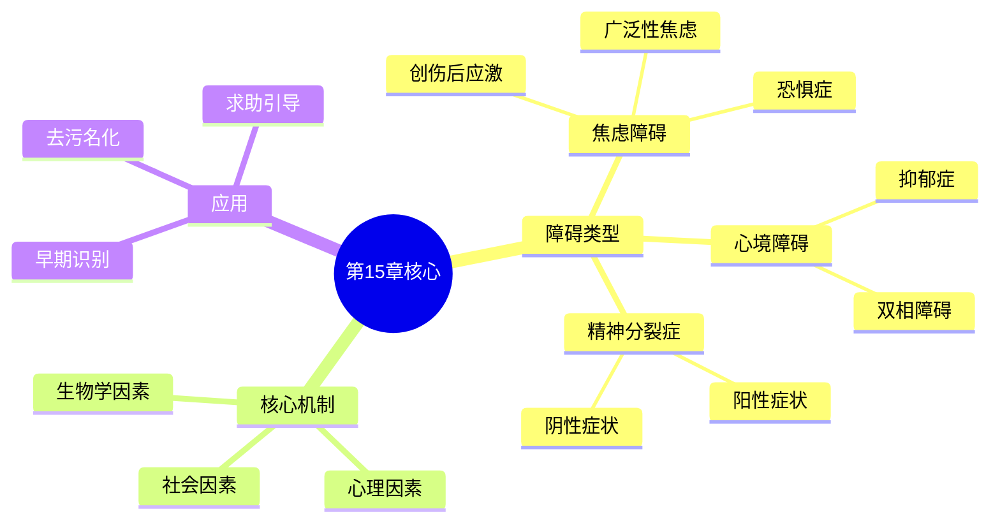

# 第15章 心理障碍

## 📍 章节定位

### 全书位置
> 本章从临床视角探讨心理障碍的本质、分类与成因，系统介绍焦虑障碍、心境障碍和精神分裂症等主要心理疾病，帮助读者理解"正常"与"异常"的边界，为下一章心理治疗奠定诊断基础。

- **全书核心问题**: 如何用科学方法理解人类行为和心理过程？心理学研究如何在日常生活中应用？
- **本章回答的问题**: 什么是心理障碍？如何区分正常心理反应与心理疾病？焦虑、抑郁、精神分裂等常见障碍的成因是什么？
- **角色类型**: 临床应用型
- **论证位置**: 从基础理论转向临床实践的关键章节

### 章节序列
| 方向 | 章节标题 | 逻辑连接 |
| 前章 | [[第14章-人格]] | 承接：人格特质是理解个体差异的基础，也是心理障碍的风险因素 |
| 后章 | [[第16章-心理治疗]] | 铺垫：本章建立诊断框架 → 第16章详述治疗方法 |

### 一句话定位
> 第15章以生物-心理-社会模型为框架，系统解读心理障碍的本质与分类，帮助读者科学理解"心理生病"这一常见却常被误解的现象，消除对心理疾病的污名化。

---

## 🎯 核心观点

### 第一层：表层案例
> 章节中的具体案例、故事、数据

| 案例名称 | 简要描述 | 页码 | 关键引文 |
|----------|----------|------|----------|
| 广场恐惧症案例 | 患者害怕开放空间，无法独自出门购物 | p.520-522 | "恐惧的程度与实际危险严重不匹配" |
| 抑郁症典型案例 | 持续两周以上的情绪低落、兴趣丧失 | p.535-538 | "抑郁不只是悲伤，是活力的全面消退" |
| 双相障碍案例 | 情绪在躁狂与抑郁两极间剧烈波动 | p.540-542 | "像是坐过山车，高峰和低谷都让人精疲力竭" |
| 精神分裂症案例 | 幻听、妄想、思维混乱 | p.548-552 | "分不清什么是真实的，什么是想象的" |
| 创伤后应激障碍 | 经历创伤后持续闪回、回避行为 | p.525-528 | "过去的创伤像幽灵一样纠缠着现在的生活" |

### 第二层：中层机制
> 案例背后的运行机制、方法论

| 机制名称 | 组成要素 | 因果链条 | 证据来源 |
|----------|----------|----------|----------|
| 焦虑维持循环 | 威胁过度评估、回避行为、安全信号依赖 | 感知威胁→产生焦虑→回避行为→短期缓解→长期强化恐惧 | 行为实验与认知研究 |
| 抑郁认知三角 | 对自我、世界、未来的消极认知 | 负性生活事件→消极归因→绝望感→抑郁症状→功能受损→更多负性事件 | Beck认知理论 |
| 多巴胺失调假说 | 多巴胺过度活跃、受体敏感性异常 | 神经递质失调→感知异常→幻听妄想→行为紊乱 | 神经影像与药理研究 |
| 遗传-环境交互 | 遗传易感性、环境压力源、保护因子 | 基因风险+环境压力>阈值→心理障碍发生 | 双生子研究 |

### 第三层：底层规律
> 可迁移的普遍规律

| 规律陈述 | 抽象层级 | 知识连接 | 适用范围 |
|----------|----------|----------|----------|
| 心理障碍是连续谱而非二元对立 | 心理测量学/分类学 | [[内向者优势]]正常与异常的边界 | 心理健康评估 |
| 回避维持恐惧，暴露消除恐惧 | 学习理论/行为矫正 | [[被讨厌的勇气]]面对而非逃避 | 恐惧症治疗原则 |
| 认知影响情绪，情绪影响行为 | 认知心理学/临床应用 | [[思考快与慢]]认知偏误 | 情绪调节策略 |
| 生物-心理-社会因素交互作用 | 系统论/整合模型 | [[身体从未忘记]]创伤与身体 | 健康整体观 |

---

## 💬 降维翻译

### 观点1: 正常与异常之间没有绝对分界线

#### 原文表达
> 心理障碍的诊断不是发现一种客观存在的疾病实体，而是根据一系列标准判断个体的思维、情感和行为是否导致了显著的痛苦或功能损害。
> —— p.510

#### 降维翻译（中学生能懂）
心理健康和心理生病之间，并没有一条清晰的分界线。就像身体检查中的某些指标，不是说到了某个数值就突然"生病"了，而是一个渐进的过程。

判断一个人是否需要帮助，主要看三点：
- 这种状态持续了多长时间？
- 是否给自己带来了明显痛苦？
- 是否严重影响了学习、工作或人际关系？

比如考前紧张是正常的，但如果紧张到完全无法复习、连续失眠，那可能就需要关注了。

#### 日常类比（奶奶能懂）
就像血压一样，高一点不一定就是病，但高到一定程度就需要吃药控制。心理健康也是这样，有点焦虑、有点低落都是正常的，但如果严重到影响日常生活，就需要重视了。

不是"要么完全正常，要么完全疯了"，而是在一个连续的谱上，我们每个人都在某个位置，位置是可以变化的。

#### 检验
- Q: 如果一个中学生问你怎么判断自己是不是有心理问题？
- A: 关键是看有没有影响正常生活。如果只是偶尔心情不好但还能正常学习玩耍，那就没事；如果连续两周以上都提不起精神，干什么都没兴趣，那可能需要找大人帮忙了。

### 观点2: 焦虑的核心是过度预测危险并试图回避

#### 原文表达
> 焦虑障碍的特征是对未来威胁的过度预期，以及为减少焦虑而采取的回避行为，这些行为短期内缓解焦虑，长期却强化了恐惧。
> —— p.518

#### 降维翻译（中学生能懂）
焦虑就像是一个过于敏感的警报器，明明没有火灾，它却一直在响。大脑总是把普通的事情想象得很危险，比如：
- 一次考试失利 → 觉得自己的人生完了
- 一个朋友没回消息 → 觉得自己被讨厌了
- 一次发言结巴 → 觉得所有人都在嘲笑自己

然后为了避免这种"危险"，我们会选择逃避。但问题是，越逃避，大脑越相信那个东西真的危险，恐惧反而更深了。

打破这个循环的方法是：慢慢去接触那些让你害怕的东西，让大脑发现"原来没那么可怕"。

#### 日常类比（奶奶能懂）
就像小孩怕黑一样，越是不敢进黑房间，越觉得里面有什么可怕的东西。但如果有人陪着他进去，打开灯，发现什么都没有，慢慢地就不怕了。

焦虑的人就像一直不敢开灯的小孩，在自己的想象里把危险放大了。解决方法就是鼓起勇气，去看看那些"可怕的东西"到底是什么。

#### 检验
- Q: 如果一个中学生问你有焦虑是不是很丢人？
- A: 焦虑是人类进化的产物，适度焦虑还能帮我们避开危险呢。只是有些人的警报系统太敏感了，需要调整一下。这不丢人，就像近视需要戴眼镜一样正常。

### 观点3: 抑郁是认知-情绪-行为的恶性循环

#### 原文表达
> 抑郁症不仅是情绪低落，更涉及对自我、世界和未来的系统性消极认知，这种认知模式会反过来加重情绪问题，形成自我维持的恶性循环。
> —— p.536

#### 降维翻译（中学生能懂）
抑郁就像掉进一个情绪的陷阱里，爬不出来。它不只是"不开心"，而是整个人都"不对劲"了：

- **怎么想**：觉得"我很差劲"、"什么事都没意思"、"未来没希望"
- **怎么感觉**：心情沉重、提不起劲、对以前喜欢的事也失去兴趣
- **怎么做**：不想动、不想见人、连吃饭洗澡都觉得累

最麻烦的是，这三个方面会互相加强。因为觉得没希望，所以什么都不想做；因为什么都不做，事情变得更糟；因为事情更糟，更觉得没希望……

要想打破这个循环，通常需要外界的帮助，就像溺水的人需要有人拉一把。

#### 日常类比（奶奶能懂）
就像冬天被困在冰天雪地里，越冷越不想动，越不动身体越冷，最后就冻僵了。这时候光靠自己是不行的，得有人来生火、给热水、扶你起来走动，才能慢慢暖过来。

抑郁的人也是这样，不是他们不想好起来，是已经被困在里面出不来了，需要别人帮忙才能打破那个循环。

#### 检验
- Q: 如果一个中学生问你抑郁症是不是就是心情不好？
- A: 不只是心情不好。如果只是心情不好，过几天就好了。抑郁症是那种"整个人都灰掉了"的感觉，持续时间超过两周，睡觉、吃饭、学习、社交都受影响。这就像感冒和肺炎的区别，不是同一种程度。

---

## ✨ 金句库

### 原书金句
| 金句 | 页码 | 适用场景 |
|------|------|----------|
| "心理障碍的诊断核心是痛苦和功能损害，而非简单的行为偏离。" | p.510 | 解释诊断标准 |
| "焦虑是对未来威胁的预期，恐惧是对当下威胁的反应。" | p.516 | 区分焦虑与恐惧 |
| "回避是焦虑最好的朋友——它让焦虑持续存在。" | p.519 | 揭示焦虑维持机制 |
| "抑郁症最可怕的不是悲伤，而是麻木——对一切都失去感觉。" | p.537 | 描述抑郁体验 |
| "精神分裂症不是人格分裂，而是与现实世界的联结断裂。" | p.548 | 澄清常见误解 |

### 降维金句
| 金句 | 来源观点 | 适用场景 |
|------|----------|----------|
| 正常和异常之间没有明显的鸿沟，只有渐变的坡度。 | 诊断连续谱 | 心理健康教育 |
| 焦虑是警报器太敏感，不是真的着火了。 | 焦虑本质 | 安慰焦虑者 |
| 回避是焦虑的帮凶，暴露是焦虑的克星。 | 回避机制 | 治疗原则说明 |
| 抑郁不是不想好起来，是陷在里面出不来。 | 抑郁认知 | 消除误解 |
| 大脑有时会骗我们，把想象当成真实。 | 认知扭曲 | 认知调整 |

## 🔗 当下映射

### 💰 财富应用
| 场景 | 具体行动 | 预期效果 | 风险提示 |
|------|----------|----------|----------|
| 投资决策中的焦虑管理 | 识别过度焦虑对决策的干扰 | 避免恐慌性抛售或过度保守 | 需区分合理担忧与病理性焦虑 |
| 创业压力应对 | 建立心理健康监测机制 | 预防创业者抑郁高发风险 | 需要专业支持网络 |
| 财富与心理健康平衡 | 意识到金钱不能解决心理问题 | 避免"财富越多越幸福"的误区 | 需调整价值观预期 |

### 💼 职场应用
| 场景 | 具体行动 | 所需能力 | 适用职级 |
|------|----------|----------|----------|
| 压力管理 | 识别自己的焦虑模式，建立应对策略 | 自我觉察能力 | 所有岗位 |
| 团队心理健康 | 识别同事可能的求救信号 | 同理心与观察力 | 管理者 |
| 工作焦虑调试 | 区分促进性焦虑与阻碍性焦虑 | 认知调节能力 | 所有岗位 |

### 🏠 生活应用
| 场景 | 具体行动 | 可行性 | 见效时间 |
|------|----------|--------|----------|
| 自我情绪监测 | 学习识别焦虑和抑郁的早期信号 | 高，需坚持观察 | 持续进行 |
| 家人心理支持 | 理解而非评判有情绪困扰的家人 | 中，需要学习技巧 | 长期积累 |
| 压力应对策略 | 建立运动、社交、冥想等应对资源库 | 高，从小事做起 | 2-4周可见改善 |

### 72小时行动计划
1. **明天可以做的第一件事**：回顾自己过去一周的情绪状态，记录是否有持续超过2天的低落或焦虑
2. **本周内可以尝试的事**：学习腹式呼吸法，每天练习5分钟，观察对焦虑情绪的影响
3. **需要准备资源才能做的事**：整理自己可用的心理支持资源清单（信任的朋友、热线电话、咨询渠道等）

---

## 🕸️ 章节关联

### 向上关联 → 整书
- **贡献**: 将前14章的生物学、认知、社会心理学知识整合应用于临床领域
- **位置**: 从理论转向实践的关键枢纽

### 横向关联 → 章节间
| 章节编号 | 章节标题 | 关联类型 | 连接描述 |
|----------|----------|----------|----------|
| 第14章 | 理解人格 | 承接 | 人格特质是心理障碍的风险和保护因素 |
| 第16章 | 心理治疗 | 铺垫 | 本章建立诊断基础 → 下章详述治疗方法 |
| 第12章 | 情绪 | 基础 | 情绪调节异常是多种障碍的核心 |
| 第3章 | 行为的生物学基础 | 机制 | 神经递质异常解释多种障碍的生物学基础 |

### 向下关联 → 具体应用
| 应用场景 | 难度 | 前置知识 |
|----------|------|----------|
| 自我情绪监测与早期识别 | 中 | 基础心理知识 |
| 支持有心理困扰的朋友 | 高 | 同理心与边界意识 |
| 理解和减少心理疾病污名化 | 中 | 社会心理学基础 |

### 跨书关联 → 知识网络
| 书籍 | 概念 | 关系 | 备注 |
|------|------|------|------|
| [[身体从未忘记]] | 创伤与身体记忆 | 深化 | 范德考克详述创伤如何储存在身体中 |
| [[蛤蟆先生看心理医生]] | 抑郁与咨询过程 | 故事化 | 用寓言形式展示抑郁症与治疗过程 |
| [[被讨厌的勇气]] | 目的论视角 | 互补 | 阿德勒视角与医学模型形成对话 |
| [[少有人走的路]] | 心理成长与痛苦 | 哲学延展 | 将心理困扰视为成长的契机 |

### 关联可视化

---

## ❓ 问答设计

### Q1: [记忆型问题]
**认知层次**: 记忆  
**难度**: 低  
**题目**: DSM-5中判断心理障碍的三个核心标准是什么？  
**答案要点**:
- 显著的痛苦体验
- 功能损害（工作、学习、社交等）
- 偏离文化预期的行为模式

### Q2: [理解型问题]
**认知层次**: 理解  
**难度**: 中  
**题目**: 为什么说"正常"和"异常"之间没有绝对的分界线？  
**答案要点**:
- 心理特征呈连续分布
- 同一行为在不同情境下有不同意义
- 文化背景影响判断标准
- 程度和持续时间是关键考量

### Q3: [应用型问题]
**认知层次**: 应用  
**难度**: 中  
**题目**: 如果你的朋友持续两周情绪低落，对以前喜欢的活动失去兴趣，你应该如何帮助他？  
**答案要点**:
- 表达关心，倾听而非评判
- 不轻易说"想开点"或"振作起来"
- 鼓励寻求专业帮助
- 陪伴但不过度承担
- 如果有自伤迹象，立即告知成年人

### Q4: [分析型问题]
**认知层次**: 分析  
**难度**: 高  
**题目**: 分析回避行为如何维持和强化焦虑障碍。  
**答案要点**:
- 回避短期降低焦虑（负强化）
- 长期阻碍对恐惧对象的重新评估
- 大脑没有机会学习"其实没那么危险"
- 回避范围可能逐渐扩大
- 功能受损加重，形成恶性循环

### Q5: [评估型问题]
**认知层次**: 评估  
**难度**: 高  
**题目**: 评估社会对心理疾病的污名化会带来哪些负面影响？  
**答案要点**:
- 延迟求助，错过最佳治疗时机
- 患者自我污名化，加重心理负担
- 影响就业、社交等机会
- 家庭成员连带承受压力
- 社会整体健康成本增加

### Q6: [创造型问题]
**认知层次**: 创造  
**难度**: 高  
**题目**: 如果让你设计一个面向中学生的心理健康科普活动，你会如何帮助他们正确认识心理障碍？  
**答案要点**:
- 用真实案例打破刻板印象
- 强调心理疾病的普遍性和可治疗性
- 教授早期识别和求助渠道
- 设计互动体验增强同理心
- 提供具体的支持策略

### Q7: [理解型问题]
**认知层次**: 理解  
**难度**: 低  
**题目**: 抑郁症和普通的情绪低落有什么区别？  
**答案要点**:
- 持续时间（抑郁症超过两周）
- 程度（更严重，影响功能）
- 范围（对几乎所有活动失去兴趣）
- 伴随症状（睡眠、食欲、精力改变）

### Q8: [应用型问题]
**认知层次**: 应用  
**难度**: 中  
**题目**: 运用"认知三角"概念，分析一个人如何在失业后陷入抑郁。  
**答案要点**:
- 对自我："我没用，什么都做不好"
- 对世界："这个世界太残酷了"
- 对未来："我永远找不到工作了"
- 三者互相强化，形成恶性循环

### Q9: [分析型问题]
**认知层次**: 分析  
**难度**: 中  
**题目**: 比较焦虑障碍和心境障碍在情绪体验上的主要差异。  
**答案要点**:
- 焦虑：指向未来的威胁预期，紧张不安
- 抑郁：指向过去的丧失或当下的无望，低落空虚
- 焦虑：生理唤醒增强（心跳加速等）
- 抑郁：生理活动减弱（疲惫迟缓）

### Q10: [评估型问题]
**认知层次**: 评估  
**难度**: 中  
**题目**: 生物-心理-社会模型相比单一因素模型有哪些优势？  
**答案要点**:
- 更全面地理解障碍成因
- 指导多维度治疗方案
- 避免过度简化或归因
- 尊重个体差异
- 整合不同学科视角

### Q11: [创造型问题]
**认知层次**: 创造  
**难度**: 高  
**题目**: 如何设计一个手机APP来帮助用户进行日常心理健康监测和早期预警？  
**答案要点**:
- 情绪日记功能（记录情绪变化）
- 睡眠、活动量等行为数据追踪
- 标准化筛查问卷定期推送
- 异常模式识别与提醒
- 专业资源对接入口

### Q12: [记忆型问题]
**认知层次**: 记忆  
**难度**: 低  
**题目**: 精神分裂症的"阳性症状"和"阴性症状"分别指什么？  
**答案要点**:
- 阳性症状：幻觉、妄想、思维混乱（多了不该有的）
- 阴性症状：情感淡漠、社交退缩、意志减退（少了该有的）

### Q13: [应用型问题]
**认知层次**: 应用  
**难度**: 中  
**题目**: 考试焦虑在什么情况下可能成为一种需要关注的问题？  
**答案要点**:
- 严重影响学习效率或考试成绩
- 伴随明显的生理症状（失眠、头痛等）
- 采取回避行为（逃课、放弃考试）
- 焦虑水平与考试重要性严重不匹配
- 持续时间长，影响其他生活领域

### Q14: [分析型问题]
**认知层次**: 分析  
**难度**: 高  
**题目**: 分析遗传因素和环境因素在心理障碍发生中的交互作用。  
**答案要点**:
- 遗传提供易感性（风险基础）
- 环境压力触发易感性表达
- 保护性环境可降低发病风险
- 基因-环境交互具有复杂性
- 理解交互有助于精准预防和治疗

### Q15: [创造型问题]
**认知层次**: 创造  
**难度**: 高  
**题目**: 如何向一个对心理疾病有偏见的老年人解释抑郁症不是"想太多"或"不够坚强"？  
**答案要点**:
- 使用他熟悉的身体疾病类比（如高血压）
- 解释大脑的神经递质变化
- 强调意志力不能治愈生理问题
- 用具体案例展示抑郁症的真实面貌
- 表达理解而非对抗，逐步引导

---
