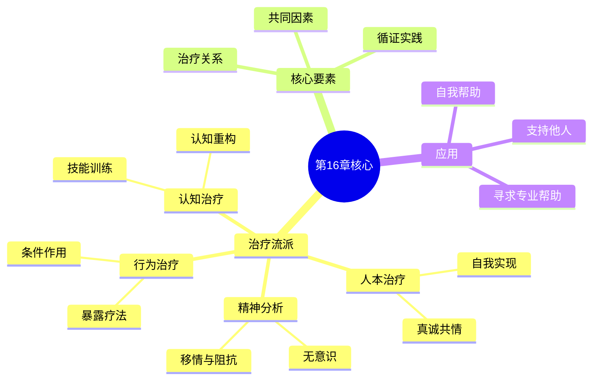

# 第16章 心理治疗

## 📍 章节定位

### 全书位置
> 本章系统介绍心理治疗的主要流派和方法，从精神分析的深层探索到认知行为治疗的技能训练，从人本主义的真诚相遇到药物治疗的生物学干预，帮助读者理解"心理治疗如何帮助人改变"这一核心问题。

- **全书核心问题**: 如何用科学方法理解人类行为和心理过程？心理学研究如何在日常生活中应用？
- **本章回答的问题**: 心理治疗有哪些主要流派？不同治疗方法的理论基础和技术是什么？如何选择适合自己的治疗方法？
- **角色类型**: 实践应用型
- **论证位置**: 全书的临床实践核心章节

### 章节序列
| 方向 | 章节标题 | 逻辑连接 |
|------|----------|----------|
| 前章 | [[第15章-心理障碍]] | 承接：第15章建立诊断框架 → 本章提供治疗方案 |
| 后章 | 终章 | 全书收官，将心理治疗作为心理学应用的终极体现 |

### 一句话定位
> 第16章以循证实践为原则，全景式展现心理治疗的多元图景，帮助读者理解不同流派如何从不同角度促进人的改变，为有需要的人提供寻求专业帮助的指南。

---

## 🎯 核心观点

### 第一层：表层案例
> 章节中的具体案例、故事、数据

| 案例名称 | 简要描述 | 页码 | 关键引文 |
|----------|----------|------|----------|
| 自由联想案例 | 患者说出脑海中浮现的一切念头 | p.570-572 | "梦是通往无意识的皇道" |
| 系统脱敏案例 | 逐步暴露治疗恐惧症 | p.580-582 | "恐惧的对象本身并不可怕，可怕的是我们对它的想象" |
| 认知重构案例 | 识别并改变自动化消极思维 | p.588-590 | "改变你看待世界的方式，世界就会改变" |
| 来访者中心案例 | 治疗师的无条件积极关注 | p.595-597 | "当一个人被真正理解和接纳时，他就开始改变" |
| 团体治疗案例 | 成员间互动促进成长 | p.605-607 | "他人的镜子能让我们看到自己看不到的部分" |

### 第二层：中层机制
> 案例背后的运行机制、方法论

| 机制名称 | 组成要素 | 因果链条 | 证据来源 |
|----------|----------|----------|----------|
| 领悟机制 | 无意识意识化、情感体验、修通 | 阻抗→移情→解释→领悟→改变 | 精神分析临床观察 |
| 学习机制 | 放松训练、恐惧等级、逐步暴露 | 焦虑反应→放松反应→脱敏→新条件反射 | 行为实验验证 |
| 认知机制 | 识别歪曲、苏格拉底提问、认知重构 | 消极自动思维→检验证据→替代想法→情绪改善 | 认知疗效研究 |
| 关系机制 | 真诚、共情、无条件积极关注 | 被接纳→自我接纳→探索→成长 | 人本治疗案例研究 |

### 第三层：底层规律
> 可迁移的普遍规律

| 规律陈述 | 抽象层级 | 知识连接 | 适用范围 |
|----------|----------|----------|----------|
| 治疗关系是改变的核心载体 | 心理治疗学/共同要素理论 | [[被讨厌的勇气-岸见一郎-拆解记录]]关系中的成长 | 所有助人关系 |
| 暴露是消除恐惧的唯一途径 | 学习理论/情绪加工 | [[少有人走的路-派克-拆解记录]]面对痛苦 | 恐惧、焦虑处理 |
| 认知改变先于情绪和行为改变 | 认知心理学/临床应用 | [[思考快与慢-丹尼尔·卡尼曼-拆解记录]]系统2介入 | 情绪调节 |
| 人有自我实现的内在倾向 | 人本心理学/发展观 | [[活出生命的意义]]内在动力 | 个人成长 |

---

## 💬 降维翻译

### 观点1: 治疗关系比技术更重要

#### 原文表达
> 跨越不同治疗流派的研究一致发现，治疗效果中最大的变异来自治疗关系的质量，而非特定的治疗技术。一个安全、信任、被理解的关系本身就是疗愈因素。
> —— p.610

#### 降维翻译（中学生能懂）
你可能以为心理治疗就是医生用一些"神奇的方法"把你的问题治好。但研究发现，最重要的不是医生用了什么方法，而是你和医生之间的关系怎么样。

如果你的心理医生：
- 真心地想理解你，而不是随便敷衍
- 不评判你，就算你说了一些"不好的事"
- 你觉得跟他说心里话很安全

那治疗效果就会好很多。就像一个好的朋友能让你感觉好起来一样，一个好的治疗关系本身就能带来改变。

所以选心理医生时，别只看他有什么证书，更要看他是不是让你感觉舒服、被理解。

#### 日常类比（奶奶能懂）
就像我们生病去找医生，如果那个医生态度冷冰冰的，看都不看就开药，你可能心里就不太舒服。但如果一个医生很耐心地听你说哪里不舒服，认真检查，然后解释给你听是什么问题，就算开的药是一样的，你也会觉得安心很多。

心理治疗就更明显了，因为它本来就是"心"的问题，医生的态度和你们之间的信任，本身就是药的一部分。

#### 检验
- Q: 如果一个中学生问你怎么知道一个心理医生好不好？
- A: 主要看你跟他说完话之后的感觉。如果觉得被他理解了、不孤单了、有希望了，那就是对的医生。如果觉得被评判、被敷衍、更难受了，那可能要换一个。

### 观点2: 认知行为治疗是教会你做自己的治疗师

#### 原文表达
> 认知行为治疗的核心目标不是让治疗师治愈来访者，而是教会来访者成为自己的治疗师，掌握一套可以终身使用的思维和情绪管理工具。
> —— p.592

#### 降维翻译（中学生能懂）
认知行为治疗有点像学骑自行车。教练不会一直骑车载你，而是教你方法，让你自己学会骑。等你学会了，就算教练不在，你也能自己骑车。

这种治疗会教你：
- **怎么捕捉"坏想法"**：比如考试前脑子里冒出来"我肯定会考砸"
- **怎么检验"坏想法"**：这个想法是真的吗？有什么证据支持？有什么证据反对？
- **怎么换一个"好想法"**：比如"我准备得还不错，尽力就好"

学会这些方法后，你以后遇到类似的情况，就能自己帮自己了。医生只是教你方法的人，真正治好你的是你自己。

#### 日常类比（奶奶能懂）
就像学做菜一样，一开始老师手把手教你，告诉你放多少盐、什么时候翻锅。等你学会了，自己就能做，不用每次都问老师。

认知行为治疗就是教你"调节心情的菜谱"。比如情绪不好时，第一步做什么，第二步做什么。学会后，你就是自己的心理医生了。

#### 检验
- Q: 如果一个中学生问认知行为治疗要多久才能好？
- A: 一般需要12-20次，大概3-4个月。但重点是，你学会的那些方法，以后一辈子都能用。就像学游泳，学会就不会忘了。

### 观点3: 真正的接纳带来真正的改变

#### 原文表达
> 人本主义治疗的悖论在于：当一个人完全接纳自己本来的样子时，改变反而自然发生了。抗拒和否认维持问题，接纳和允许开启转变。
> —— p.598

#### 降维翻译（中学生能懂）
听起来有点奇怪：想要改变，第一步竟然是"接受自己现在这个样子"？

举个例子：
- 如果你不承认自己数学不好，你就会逃避数学课、逃避考试，结果越来越差
- 但如果你承认"我现在数学是不好"，你就会开始想：那我该怎么办？是不是该多练习？

所以，承认问题不是放弃改变，而是改变的第一步。

同样的道理，如果你总是告诉自己"我不应该难过"、"难过是错的"，你反而会陷在难过里出不来。但如果你允许自己难过一会儿，难过反而会慢慢过去。

接纳不是认命，而是停止跟自己打架，把力气用来真正解决问题。

#### 日常类比（奶奶能懂）
就像一个人的房间很乱，如果他一直不承认房间乱，说"没有啊挺好的"，那房间永远乱下去。但如果他承认"房间是挺乱的"，他才会开始收拾。

接纳就是承认"现在我就是这样"，这不丢人。承认之后，才有可能改变。一直否认，就永远困在原地了。

#### 检验
- Q: 如果一个中学生问你接纳自己是不是就不用改了？
- A: 刚好相反。接纳是改变的前提。就像承认迷路了，才能开始找路；一直不承认迷路，就永远走不出去。接纳自己现在的问题，才能开始想办法解决它。

### 观点4: 暴露是恐惧的唯一真正解药

#### 原文表达
> 回避行为在短期内降低焦虑，却长期维持恐惧。唯一能真正减少恐惧的方法是暴露——在安全的环境中逐步接触恐惧对象，让大脑重新学习"这其实没有那么危险"。
> —— p.582

#### 降维翻译（中学生能懂）
每个人都有害怕的东西，比如怕黑、怕社交、怕考试。我们的第一反应往往是躲开它——不进黑房间、不参加聚会、不想考试的事。

但是，越躲越怕。因为你的大脑一直以为那个东西"真的很危险"，从来没有机会验证"其实没那么可怕"。

唯一能真正消除恐惧的方法是：慢慢去接触它。
- 怕黑？先在有光的地方待着，然后慢慢减光，最后在完全黑暗中待一会儿，发现什么都没发生。
- 怕当众演讲？先在小群体说一句话，然后多几个人、多说几句，慢慢就不怕了。

这就是"暴露治疗"的原理。当然，要一步一步来，不能一下子把自己吓死。

#### 日常类比（奶奶能懂）
就像小孩怕水、学游泳一样。如果一直不碰水，永远都会怕。但如果先在岸边玩水，然后扶着慢慢下水，最后学会游泳，就不会再怕了。

恐惧也是这样，你越躲它越凶。你敢面对它，它就会变小。

#### 检验
- Q: 如果一个中学生问你怕当众发言怎么办？
- A: 不要躲，越躲越怕。从简单的开始：先在小组里说一句话，然后慢慢增加人数和时间。你会发现，最可怕的是"想象中的可怕"，真的去做了反而没那么吓人。

---

## ✨ 金句库

### 原书金句
| 金句 | 页码 | 适用场景 |
|------|------|----------|
| "治疗关系是心理治疗最强大的共同因素。" | p.610 | 强调关系重要性 |
| "认知行为治疗教来访者成为自己的治疗师。" | p.592 | 治疗目标 |
| "改变的关键是暴露，而非回避。" | p.582 | 行为治疗原则 |
| "当一个人被完全接纳时，他就开始改变。" | p.598 | 人本主义精髓 |
| "梦是通往无意识的皇道。" | p.571 | 精神分析名言 |

### 降维金句
| 金句 | 来源观点 | 适用场景 |
|------|----------|----------|
| 治疗关系比治疗方法更重要。 | 共同要素理论 | 选择心理医生 |
| 认知行为治疗教你做自己的心理医生。 | CBT理念 | 治疗预期管理 |
| 接纳是改变的第一步，不是放弃。 | 人本悖论 | 自我接纳引导 |
| 面对恐惧，恐惧就会变小。 | 暴露原理 | 鼓励面对挑战 |
| 心理医生是教练，真正比赛的是你自己。 | 治疗定位 | 治疗角色理解 |

## 🔗 当下映射

### 💰 财富应用
| 场景 | 具体行动 | 预期效果 | 风险提示 |
|------|----------|----------|----------|
| 心理健康投资 | 将心理咨询视为必要开支而非奢侈消费 | 提升整体生活质量和决策能力 | 需选择合适的咨询师 |
| 投资心理建设 | 运用认知技术管理投资焦虑 | 减少情绪化决策，提高收益稳定性 | 需结合投资知识 |
| 财富与幸福关系 | 理解金钱不能替代心理治疗 | 避免"财富焦虑"的陷阱 | 需调整财富预期 |

### 💼 职场应用
| 场景 | 具体行动 | 所需能力 | 适用职级 |
|------|----------|----------|----------|
| 职场压力管理 | 运用认知重构技术应对工作压力 | 自我觉察能力 | 所有岗位 |
| 人际关系改善 | 借鉴共情和无条件积极关注原则 | 人际沟通能力 | 所有岗位 |
| 领导力提升 | 将治疗关系原则应用于管理 | 情绪智力 | 中高层管理者 |

### 🏠 生活应用
| 场景 | 具体行动 | 可行性 | 见效时间 |
|------|----------|--------|----------|
| 自我认知提升 | 运用自动思维记录觉察自己的认知模式 | 高，每天10分钟 | 2-4周 |
| 人际沟通优化 | 学习共情倾听，不评判地理解他人 | 中，需要练习 | 1-2个月 |
| 情绪管理能力 | 建立情绪日记，识别情绪背后的认知 | 高，手机即可 | 持续改善 |

### 72小时行动计划
1. **明天可以做的第一件事**：记录一次情绪波动，写下当时脑子里冒出的想法，问自己"这个想法是真的吗"
2. **本周内可以尝试的事**：找一个信任的人，练习"只倾听不给建议"的对话方式
3. **需要准备资源才能做的事**：如果一直有心理困扰，查找本地的心理咨询资源，了解预约流程

---

## 🕸️ 章节关联

### 向上关联 → 整书
- **贡献**: 将全书心理学知识整合应用于心理治疗实践
- **位置**: 全书的应用终章，体现心理学的实践价值

### 横向关联 → 章节间
| 章节编号 | 章节标题 | 关联类型 | 连接描述 |
|----------|----------|----------|----------|
| 第15章 | 心理障碍 | 承接 | 第15章建立诊断基础 → 本章提供治疗方案 |
| 第14章 | 理解人格 | 基础 | 人格理论影响治疗取向选择 |
| 第12章 | 情绪 | 机制 | 情绪调节是多种治疗的核心目标 |
| 第9章 | 认知过程 | 基础 | 认知治疗直接应用认知心理学原理 |

### 向下关联 → 具体应用
| 应用场景 | 难度 | 前置知识 |
|----------|------|----------|
| 自我认知觉察 | 低 | 基础心理知识 |
| 支持性倾听 | 中 | 沟通技巧 |
| 选择合适治疗方法 | 高 | 需了解不同流派特点 |

### 跨书关联 → 知识网络
| 书籍 | 概念 | 关系 | 备注 |
|------|------|------|------|
| [[蛤蟆先生看心理医生]] | 沟通分析与治疗过程 | 故事化呈现 | 用寓言展示心理咨询全过程 |
| [[被讨厌的勇气-岸见一郎-拆解记录]] | 目的论与自我改变 | 哲学延展 | 阿德勒心理学的自我帮助版本 |
| [[身体从未忘记-拆解记录]] | 创伤治疗与身体工作 | 深化补充 | 聚焦创伤治疗的身体取向 |
| [[少有人走的路-派克-拆解记录]] | 自我成长与心理成熟 | 哲学升华 | 将心理治疗视为成长旅程 |

### 关联可视化

---

## ❓ 问答设计

### Q1: [记忆型问题]
**认知层次**: 记忆  
**难度**: 低  
**题目**: 心理治疗的四大主要流派是什么？  
**答案要点**:
- 精神分析/心理动力学治疗
- 行为治疗
- 认知治疗（及认知行为治疗）
- 人本主义治疗

### Q2: [理解型问题]
**认知层次**: 理解  
**难度**: 中  
**题目**: 为什么说"治疗关系比治疗技术更重要"？  
**答案要点**:
- 研究发现治疗效果主要来自关系质量
- 安全信任的关系本身就是疗愈因素
- 好的关系促进来访者开放和探索
- 技术需要在良好关系中才能发挥作用

### Q3: [应用型问题]
**认知层次**: 应用  
**难度**: 中  
**题目**: 当你感到焦虑时，可以如何运用认知行为治疗的方法帮助自己？  
**答案要点**:
- 识别自动思维（"我肯定会失败"）
- 检验证据（支持这个想法的证据是什么？反对的证据呢？）
- 形成替代想法（"我准备得还不错，尽力就好"）
- 观察情绪变化

### Q4: [分析型问题]
**认知层次**: 分析  
**难度**: 高  
**题目**: 比较精神分析和认知行为治疗在"改变机制"上的差异。  
**答案要点**:
- 精神分析：通过领悟无意识冲突，实现深层人格改变
- 认知行为治疗：通过改变思维和行为模式，实现症状缓解
- 前者强调过去和深度，后者强调现在和技巧
- 治疗时长和焦点不同

### Q5: [评估型问题]
**认知层次**: 评估  
**难度**: 高  
**题目**: 评估"自我帮助书籍"和"专业心理治疗"各自的优缺点。  
**答案要点**:
- 自我帮助：成本低、可及性高、保护隐私；但缺乏个性化、难以坚持、可能误用
- 专业治疗：个性化、有反馈、处理复杂问题；但成本高、时间受限、有病耻感
- 两者可以互补，轻中度问题可从自助开始

### Q6: [创造型问题]
**认知层次**: 创造  
**难度**: 高  
**题目**: 如果让你设计一个面向大学生的"情绪管理"工作坊，你会包含哪些核心内容？  
**答案要点**:
- 情绪识别与命名练习
- 认知-情绪-行为三角的体验活动
- 认知重构的实际案例演练
- 正念和放松技巧介绍
- 制定个人情绪管理计划

### Q7: [理解型问题]
**认知层次**: 理解  
**难度**: 低  
**题目**: 人本主义治疗的核心理念是什么？  
**答案要点**:
- 人有自我实现的内在倾向
- 无条件积极关注是改变的土壤
- 真诚、共情、接纳是治疗师的基本态度
- 治疗是陪伴探索，而非指导修正

### Q8: [应用型问题]
**认知层次**: 应用  
**难度**: 中  
**题目**: 你的朋友正在经历情绪困扰，你可以如何运用"共情倾听"的技巧支持他？  
**答案要点**:
- 全神贯注地听，不打断
- 反映对方的感受（"听起来你很难过"）
- 不急于给建议或评判
- 允许沉默，给对方空间
- 表达理解和陪伴

### Q9: [分析型问题]
**认知层次**: 分析  
**难度**: 中  
**题目**: 分析暴露疗法为什么对恐惧症有效，它的原理是什么？  
**答案要点**:
- 回避维持恐惧，暴露打破循环
- 让大脑重新学习"其实没那么危险"
- 习惯化：重复暴露后焦虑自然下降
- 在安全环境中体验"什么都没发生"
- 需要渐进式进行，避免过度恐惧

### Q10: [评估型问题]
**认知层次**: 评估  
**难度**: 中  
**题目**: 如何判断一个人是否需要寻求专业心理帮助？  
**答案要点**:
- 症状持续时间和严重程度
- 对日常功能的影响（学习、工作、社交）
- 自身痛苦程度
- 自助方法是否有效
- 是否有自伤或伤人风险（需立即求助）

### Q11: [创造型问题]
**认知层次**: 创造  
**难度**: 高  
**题目**: 如何设计一个"情绪日记"模板，帮助用户识别自己的认知模式？  
**答案要点**:
- 情境描述（发生了什么）
- 自动思维（脑子里冒出了什么想法）
- 情绪强度评分（1-10分）
- 证据检验（支持/反对这个想法的证据）
- 替代想法（更平衡的想法是什么）
- 新情绪评分

### Q12: [记忆型问题]
**认知层次**: 记忆  
**难度**: 低  
**题目**: 认知行为治疗中识别的常见认知歪曲有哪些？  
**答案要点**:
- 非黑即白思维
- 灾难化
- 过度概括
- 心理过滤
- 读心术
- 情绪化推理

### Q13: [应用型问题]
**认知层次**: 应用  
**难度**: 中  
**题目**: 运用"非黑即白思维"的概念，分析一个完美主义者可能面临的困扰。  
**答案要点**:
- 标准：要么100分要么0分
- 后果：无法接受任何不完美
- 表现：拖延（怕做不到完美）、自我批评、焦虑
- 调整：学习接受"足够好"，看到灰色地带

### Q14: [分析型问题]
**认知层次**: 分析  
**难度**: 高  
**题目**: 分析"药物治疗"和"心理治疗"在心理障碍治疗中各自的作用和局限。  
**答案要点**:
- 药物：快速缓解症状，生物机制明确；但治标不治本，有副作用
- 心理治疗：针对心理机制，效果持久；但见效慢，需要主动参与
- 两者常常结合使用，互为补充
- 轻度问题可单用心理治疗，重度常需结合

### Q15: [创造型问题]
**认知层次**: 创造  
**难度**: 高  
**题目**: 如果让你为一所中学设计心理健康服务体系，你会包含哪些要素？  
**答案要点**:
- 预防层面：心理健康课程、情绪管理训练
- 识别层面：定期筛查、教师培训
- 干预层面：学校咨询师、个体和团体辅导
- 转介层面：与校外专业机构建立合作
- 家校合作：家长心理健康教育

---
