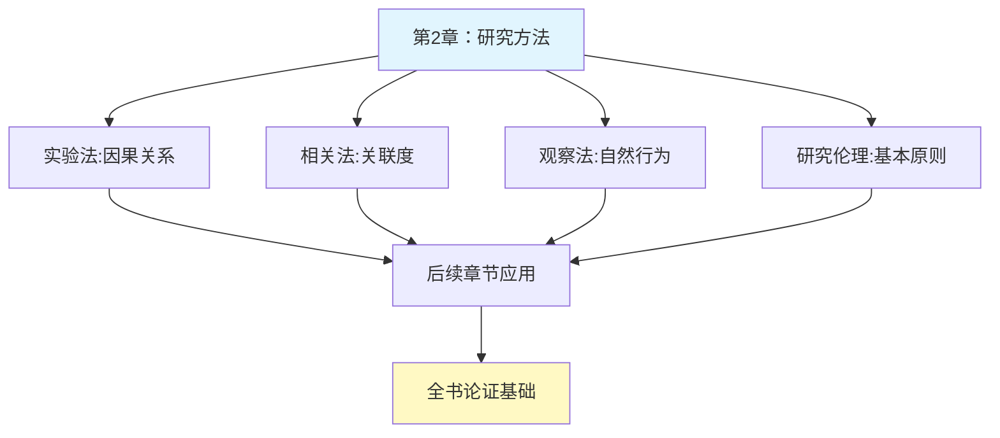

# 第2章 心理学的研究方法

## 📍 章节定位

### 全书位置
> 紧承第1章心理学科学方法的介绍，详细阐述心理学研究的具体方法、原理及伦理考量，是全书16章的"科学操作基础"，为之后每一章节提供研究支撑框架。

- **全书核心问题**: 如何用科学方法理解人类行为和心理过程？心理学研究如何在日常生活中应用？
- **本章回答的问题**: 心理学研究的具体方法有哪些？如何设计心理学实验？研究中需要注意哪些伦理问题？
- **角色类型**: 核心概念型
- **论证位置**: 在定义了心理学科学属性后，具体展示科学方法如何实现

### 章节序列
| 方向 | 章节标题 | 逻辑连接 |
|------|----------|----------|
| 前章 | [[第1章-生活中的心理学]] | 承接：第1章定义科学方法 → 本章详解具体操作 |
| 后章 | [[第3章-行为的生物学基础]] | 铺垫：为后续章节的生物学研究方法奠定基础 |

### 一句话定位
> 第2章从抽象的科学方法转向具体的研究技术，系统介绍观察法、相关法、实验法等心理学研究工具，为后续14章的实证研究奠定技术基础。

---

## 🎯 核心观点

### 第一层：表层案例
> 章节中的具体案例、故事、数据

| 案例名称 | 简要描述 | 页码 | 关键引文 |
|----------|----------|------|----------|
| 罗森塔尔效应实验 | 教师期望如何影响学生表现 | p.35-38 | "人们会成为他人预期的样子" |
| 双盲实验 | 消除研究者和被试者的偏见 | p.45-48 | 消除期望效应影响 |
| 自然观察法 | 研究儿童在游戏中行为 | p.60-62 | 自然环境下行为分析 |

### 第二层：中层机制
> 案例背后的运行机制、方法论

| 机制名称 | 组成要素 | 因果链条 | 证据来源 |
|----------|----------|----------|----------|
| 实验设计控制 | 自变量-因变量-控制变量 | 控制无关变量 → 确保因果关系 → 提高内部效度 | 经典实验心理学研究 |
| 随机分配 | 分组随机化过程 | 随机分组 → 减少个体差异影响 → 提高结果可靠性 | 实验设计原理 |
| 信效度评估 | 内部一致性检验、重测分析 | 指标稳定性+准确性 → 测量有效性 → 结果可信赖 | 心理测量学 |

### 第三层：底层规律
> 可迁移的普遍规律

| 规律陈述 | 抽象层级 | 知识连接 | 适用范围 |
|----------|----------|----------|----------|
| 科学探索需要控制变量来确认因果关系 | 因果推理/科学哲学 | [[思考快与慢-丹尼尔·卡尼曼-拆解记录]]因果关系错觉 | 所有经验科学领域 |
| 观察者偏见影响研究结果的有效性 | 认知偏差理论/社会心理学 | [[被讨厌的勇气-岸见一郎-拆解记录]]目的影响认知 | 人类认知过程普遍现象 |
| 研究伦理要求尊重人类尊严与权利 | 伦理学/科学道德 | [[影响力-西奥迪尼-拆解记录]]道德边界 | 人文科学研究核心原则 |

---

## 💬 降维翻译

### 观点1: 实验法是验证因果关系的黄金标准

#### 原文表达
> 实验法允许研究者对自变量进行操作，并控制其他潜在干扰变量，从而推断因果关系。这种设计使心理学研究能够确定是什么导致了某种行为或心理现象。
> —— p.42

#### 降维翻译（中学生能懂）
实验法就像是做化学实验，研究人员可以"主动改变"某个因素（比如温度、光线等），然后观察是否会引起相应的变化（比如反应速度、情绪表现等）。

关键是研究人员能控制其他变量不变，这样才能确定确实是那个因素引起了变化。就像为了研究光照对孩子成绩的影响，我们需要控制其他所有因素（老师、课程、家长等）都相同，只改变教室的光线明暗。

#### 日常类比（奶奶能懂）
就像你种两盆同样的花，给它们一样的水和土，但一盆晒太阳，一盆放阴凉地方。如果后来日照的那个长得好，你就能肯定阳光促进了生长。这就是"实验法" - 控制其他条件一样，就看一个因素到底有没有用。

科学研究就按照这个原理，只不过研究的是人的思想和行为。

#### 检验
- Q: 如果一个中学生问你什么是实验法在心理学研究中的作用？
- A: 就是为了搞清楚某个因素是不是真的会引起某些心理或行为变化。

### 观点2: 相关法只能显示关系不能证明因果性

#### 原文表达
> 相关关系并不等于因果关系 —— 两个变量之间的相关并不能说明其中一个引起了另一个。
> —— p.38

#### 降维翻译（中学生能懂）
相关法只是告诉我们两件事情是否一起变化，但不能告诉我们谁导致谁。比如我们发现冰棍销量增加和溺水事故增加有关，但这不意味着冰棍导致溺水。

实际上是因为天气热，更多人吃冰棍，同时也有更多人游泳而发生意外。所以相关性不等于因果性。

#### 日常类比（奶奶能懂）
就像你发现每次下大雨都停电，你会以为是雨导致停电。但实际上是因为大风刮倒了电线杆，雨和停电都受同一个原因（大风雨）影响。

心理学研究中也经常发现这样的情况：两件事经常一起出现，但我们不能马上说是其中一件导致另一件。

#### 检验
- Q: 如果一个中学生问你为什么相关关系不能证明因果关系？
- A: 因为两个相关的事情都可能受到第三个没观察到的因素影响。

---

## ✨ 金句库

### 原书金句
| 金句 | 页码 | 适用场景 |
|------|------|----------|
| "相关关系并不等于因果关系。" | p.38 | 强调科学推理 |
| "在实验中，研究者操纵自变量，测量因变量，控制无关变量。" | p.40 | 解释实验设计 |
| "内部效度关乎因果推断，外部效度关乎结果推广。" | p.50 | 评价研究质量 |
| "研究伦理是心理学研究的生命线。" | p.55 | 强调伦理重要性 |
| "双盲实验是消除期望效应的有效工具。" | p.47 | 介绍控制偏见方法 |

### 降维金句
| 金句 | 来源观点 | 适用场景 |
|------|----------|----------|
| 看到两件事一起发生，不代表一件事导致另一件。 | 相关关系局限 | 反驳伪科学 |
| 科学验证需要控制其他因素，只改变你想测的那个。 | 实验法原则 | 介绍实验设计 |
| 如果你希望什么结果，往往会得到你希望的结果。 | 研究者期望 | 警告偏见影响 |
| 实验伦理是科学研究不可突破的底线。 | 研究伦理 | 强调道德原则 |
| 双重保障机制避免先入为主的影响。 | 双盲实验 | 介绍控制方法 |

## 🔗 当下映射

### 💰 财富应用
| 场景 | 具体行动 | 预期效果 | 风险提示 |
|------|----------|----------|----------|
| 投资评估 | 区分相关与因果，不做数据陷阱决策 | 减少基于虚假相关性的投资损失 | 可能错过一些真正有效的指标 |
| 广告策略 | 设立对照组测试广告效果 | 真实评估广告转化率 | 测试成本较高 |
| 客户研究 | 采用严格的调研方法收集数据 | 获得真实的客户需求反馈 | 遵循隐私伦理原则 |

### 💼 职场应用
| 场景 | 具体行动 | 所需能力 | 适用职级 |
|------|----------|----------|----------|
| 项目效果评估 | 设置控制组来评估培训有效性 | 数据分析和实验设计能力 | 中高层管理者 |
| 市场策略制定 | 区分市场指标间的因果关系 | 逻辑思维和数据分析能力 | 市场分析师 |
| 品质管控 | 严格控制变量寻找质量问题根源 | 系统分析能力 | 质量控制经理 |

### 🏠 生活应用
| 场景 | 具体行动 | 可行性 | 见效时间 |
|------|----------|--------|----------|
| 教育子女 | 控制其他变量，确定哪些养育方式更有效 | 高，有一定难度 | 2-3个月可见趋势 |
| 健康改善 | 记录单一变量的变化效果 | 中，需坚持记录 | 1周内可见初步变化 |
| 个人效率 | 系统测试不同工作方法的效果 | 高，有日程记录习惯 | 1周内可对比分析 |

### 72小时行动计划
1. [明天可以做的第一件事]：回想最近看到的一个"相关数据分析"，分析其是否暗示了因果关系
2. [本周内可以尝试的事]：对自己的一个小习惯进行"实验": 有意识控制一周，看看影响其他方面
3. [需要准备资源才能做的事]：学习简单的实验设计方法，在生活中进行小规模测试

---

## 🕸️ 章节关联

### 向上关联 → 整书
- **贡献**: 为全书16个章节提供研究方法框架
- **位置**: 全书实验方法论的基石章节

### 横向关联 → 章节间
| 章节编号 | 章节标题 | 关联类型 | 连接描述 |
|----------|----------|----------|----------|
| 第1章 | 生活中的心理学 | 承接 | 第1章介绍科学方法 → 第2章阐述具体方法 |
| 第3-16章 | 各个专题章节 | 铺垫 | 所有章节均采用研究方法进行验证研究 |
| 第3章 | 行为的生物学基础 | 铺垫 | 生物心理学研究需要实验设计原则 |

### 向下关联 → 具体应用
| 应用场景 | 难度 | 前置知识 |
|----------|------|----------|
| 实验设计 | 高 | 基础统计和逻辑思维 |
| 伦理判断 | 中 | 基本人文素养 |
| 概率理解 | 中 | 统计基础知识 |

### 跨书关联 → 知识网络
| 书籍 | 概念 | 关系 | 备注 |
|------|------|------|------|
| [[思考快与慢-丹尼尔·卡尼曼-拆解记录]] | 系统2理性分析 | 交叉应用 | 第2章的实验方法 vs 卡尼曼的认知偏误研究实例 |
| [[社会科学方法论]] | 社会研究设计 | 理论扩展 | 心理学研究方法作为社会科学研究的重要分支 |
| [[乌合之众-勒庞-拆解记录]] | 群体心理研究伦理 | 警示参考 | 研究伦理在群体研究中的重要意义 |

### 关联可视化

---

## ❓ 问答设计

### Q1: [记忆型问题]
**认知层次**: 记忆  
**难度**: 低  
**题目**: 心理学研究的三种主要方法是什么？  
**答案要点**:
- 观察法
- 相关法  
- 实验法

### Q2: [理解型问题]
**认知层次**: 理解  
**难度**: 中  
**题目**: 为什么说相关关系不等于因果关系？  
**答案要点**:
- 可能存在第三变量
- 方向性不确定
- 纯属巧合关系

### Q3: [应用型问题]
**认知层次**: 应用  
**难度**: 中  
**题目**: 请设计一个简单的实验来验证音乐对工作效率的影响。  
**答案要点**:
- 确定自变量（音乐类型）和因变量（工作效率）
- 设立控制组和实验组
- 控制其他影响因子

### Q4: [分析型问题]
**认知层次**: 分析  
**难度**: 高  
**题目**: 分析双盲实验的设计原理及其必要性。  
**答案要点**:
- 消除研究者期望效应
- 减少被试者反应偏差
- 保证结果客观性

### Q5: [评估型问题]
**认知层次**: 评估  
**难度**: 高  
**题目**: 评价一个声称发现相关性的研究报告的可信度。  
**答案要点**:
- 样本规模和代表性
- 数据收集方法
- 研究设计类型
- 有无混淆变量

### Q6: [创造型问题]
**认知层次**: 创造  
**难度**: 高  
**题目**: 为研究一个全新的心理学现象设计完整的研究方案。  
**答案要点**:
- 研究问题构建
- 方法选择和理由
- 控制变量考虑
- 伦理审核

### Q7: [理解型问题]
**认知层次**: 理解  
**难度**: 低  
**题目**: 如何向初学者解释"信度"和"效度"的区别？  
**答案要点**:
- 信度：多次测量结果一致性
- 效度：测量工具确实测量目标内容

### Q8: [应用型问题]
**认知层次**: 应用  
**难度**: 中  
**题目**: 如何在公司环境中应用实验法验证团建活动效果？  
**答案要点**:
- 定义因变量（如员工满意度）
- 控制无关变量
- 比较前后结果

### Q9: [分析型问题]
**认知层次**: 分析  
**难度**: 中  
**题目**: 实验设计中内外效度的平衡关系如何处理？  
**答案要点**:
- 内部效度高但外部效度可能低
- 外部效度高但内部效度可能低
- 实际应用中需权衡

### Q10: [评估型问题]
**认知层次**: 评估  
**难度**: 中  
**题目**: 比较实验法和观察法的优势和局限。  
**答案要点**:
- 实验法可建立因果关系但可能缺失生态效度
- 观察法有生态效度但难以确定因果

### Q11: [创造型问题]
**认知层次**: 创造  
**难度**: 高  
**题目**: 设计一种新的心理测量工具并说明评估方法。  
**答案要点**:
- 确定测量目标
- 设计题目
- 信效度检验方案

### Q12: [记忆型问题]
**认知层次**: 记忆  
**难度**: 低  
**题目**: 心理学研究的基本伦理原则包括哪些？  
**答案要点**:
- 知情同意
- 保密原则  
- 避免伤害
- 可撤销同意权

### Q13: [应用型问题]
**认知层次**: 应用  
**难度**: 中  
**题目**: 如何在日常决策中避免"相关即因果"的误区？  
**答案要点**:
- 仔细思考第三因素
- 寻找逻辑联系证据
- 考虑反例

### Q14: [分析型问题]
**认知层次**: 分析  
**难度**: 高  
**题目**: 分析安慰剂效应如何影响实验结果。  
**答案要点**:
- 被试期望的影响
- 研究者的无意识偏见
- 如何控制该效应

### Q15: [创造型问题]
**认知层次**: 创造  
**难度**: 高  
**题目**: 为在线心理学研究设计一套伦理保障机制。  
**答案要点**:
- 数据安全保障
- 匿名参与机制
- 知情同意程序
- 反馈和退出权

---
