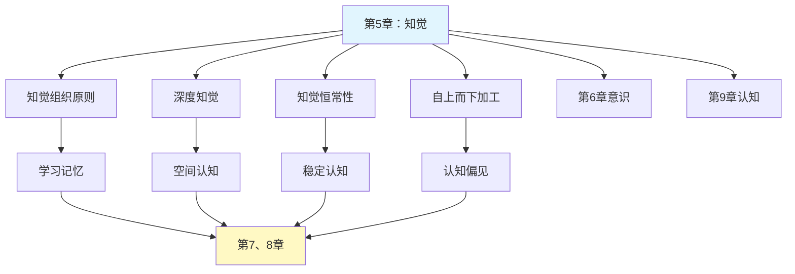

# 第5章 知觉

## 📍 章节定位

### 全书位置
> 本章紧承第四章感觉过程，在获取感觉信息基础上探讨如何组织和理解这些信息，为后续学习记忆、认知加工奠定基础，揭示我们如何从感觉材料到有意义的心理体验，构成认知过程的重要环节。

- **全书核心问题**: 如何用科学方法理解人类行为和心理过程？心理学研究如何在日常生活中应用？
- **本章回答的问题**: 感觉信息如何组织成有意义的知觉？我们如何理解三维世界？知觉如何受到经验和期待影响？
- **角色类型**: 核心概念型
- **论证位置**: 连接感觉与认知的关键环节

### 章节序列
| 方向 | 章节标题 | 逻辑连接 |
|------|----------|----------|
| 前章 | [[第4章-感觉]] | 承接：感觉是知觉的原材料 → 知觉对感觉信息进一步加工 |
| 后章 | [[第6章-意识状态]] | 铺垫：知觉机制涉及意识程度的影响 |

### 一句话定位
> 第5章探讨大脑如何将感觉信息组织成有意义的整体知觉，分析知觉组织原则、深度知觉机制和知觉恒常性，揭示人类理解世界的认知基础。

---

## 🎯 核心观点

### 第一层：表层案例
> 章节中的具体案例、故事、数据

| 案例名称 | 简要描述 | 页码 | 关键引文 |
|----------|----------|------|----------|
| 完形组织原则 | 点线图形的知觉组织 | p.145-148 | "整体大于部分之和" |
| 穆勒-莱尔错觉 | 不同箭头导致知觉长度不同 | p.150-152 | 知觉并非完全客观的加工 |
| 深度知觉实验证明 | 双眼立体视觉 | p.158-160 | 知觉的主动建构特性 |
| 恒常性实验 | 不同光照条件下的颜色知觉 | p.165-168 | 世界理解的稳定性机制 |

### 第二层：中层机制
> 案例背后的运行机制、方法论

| 机制名称 | 组成要素 | 因果链条 | 证据来源 |
|----------|----------|----------|----------|
| 知觉组织原则 | 邻近性、相似性、连续性、闭合性 | 简单刺激组合 → 复杂模式识别 → 意义建构 | 完形心理学实验 |
| 深度线索加工 | 双眼线索、单眼线索、运动视差 | 视觉信息处理 → 距离估计 → 空间定位 | 神经认知实验 |
| 知觉期望效应 | 自上而下加工 | 过去经验 → 决定期望 → 影响知觉解释 | 期待效应实验 |

### 第三层：底层规律
> 可迁移的普遍规律

| 规律陈述 | 抽象层级 | 知识连接 | 适用范围 |
|----------|----------|----------|----------|
| 人类倾向于寻找模式和意义 | 完形心理学/模式识别理论 | [[心流]]模式匹配 | 认知工具设计原则 |
| 知觉是构造过程而非被动接收 | 主动建构理论/认知科学 | [[被讨厌的勇气]]主动选择观 | 心理健康管理 |
| 经验与期待塑造新知觉 | 自上而下加工理论 | [[思考快与慢]]系统性偏见 | 人际交往原则 |

---

## 💬 降维翻译

### 观点1: 知觉是主动建构而非被动接收

#### 原文表达
> 知觉不是对我们接受的感觉信息的被动复制，而是主动组织和解释的过程，我们将感觉信息填充入更宏大且更熟悉的形式和意义之中。
> —— p.145

#### 降维翻译（中学生能懂）
我们的大脑不是一台录音机或摄像机，被动地记录外界的信息。相反，大脑更像是一个聪明的侦探，它会主动寻找线索、组织信息、填补空白，把零散的感觉材料整理成完整、有意义的画面。

我们会用自己的经验、知识和期待来"加工"收到的感觉信息，所以两个人面对同样的外界刺激，可能会看见不同的"画面"。

#### 日常类比（奶奶能懂）
这就像是你们看到天上飘的几朵云彩，有人说是老虎，有人说是棉花糖。天空的云本身没有变，但是你们根据自己的想象把它"组合"成了不同的东西。

我们对世界的理解都是如此：眼睛看到的是零碎的信息，但心里想到的却是完整的故事。

#### 检验
- Q: 如果一个中学生问你什么叫"知觉是主观建构的"？
- A: 就是我们并不是像镜子那样直接反映出世界，而是用自己的经验、想法、心情来"重新塑造"我们感受到的内容。

### 观点2: 知觉恒常性帮助我们理解稳定的世界

#### 原文表达
> 知觉恒常性是指尽管感觉图像在不断改变，但我们仍能知觉到世界是稳定的。例如，无论观察角度或照明条件如何变化，我们通常能把熟悉的物体识别为恒定的实体。
> —— p.165

#### 降维翻译（中学生能懂）
虽然我们眼睛收到的图像一直在变（比如同一个房子，不同光照、不同角度看会很大不一样），但我们的大脑有一套聪明的方法，帮我们将这些不同的图像识别为同一个熟悉的物体。

就像你知道你妈妈在照片里、在人群中，甚至在昏暗灯光下还是同一个妈妈，而不是变成另一个人。

#### 日常类比（奶奶能懂）
就像你们家里的桌子，无论是白天太阳底下看，还是晚上灯光下面看，颜色看起来可能都不太一样，但你都知道那是同一张桌子。你的眼睛"骗"了脑，但这是为了让世界更稳定，让我们不会每天都感到混乱。

#### 检验
- Q: 如果一个中学生问你为什么要具备知觉恒常性？
- A: 为了让我们的世界感觉起来稳定，不会因为光线、角度改变就认不出熟悉的东西。

---

## ✨ 金句库

### 原书金句
| 金句 | 页码 | 适用场景 |
|------|------|----------|
| "知觉是大脑对感觉信息的组织和解释。" | p.140 | 界定知觉概念 |
| "整体大于部分之和。" | p.147 | 阐述完形原理 |
| "知觉恒常性使我们看到稳定的世界。" | p.165 | 强调恒常性重要 |
| "自上而下与自下而上加工共同构成知觉。" | p.170 | 说明知觉机制 |
| "期待可以影响我们感知到的内容。" | p.172 | 提示认知偏向 |

### 降维金句
| 金句 | 来源观点 | 适用场景 |
|------|----------|----------|
| 世界不是你看到的样子，而是你脑海中的样子。 | 知觉构造性 | 反对绝对客观主义 |
| 大脑是积极的解释者而非消极的接收器。 | 主动建构论 | 强调主观能动性 |
| 经验塑造我们看到的世界。 | 期待效应 | 理解认知差异 |
| 恒定世界来自流动大脑。 | 恒常性机制 | 解释稳定性感知 |
| 我们的脑袋会填写缺失的信息。 | 完形原理 | 理解推断过程 |

## 🔗 当下映射

### 💰 财富应用
| 场景 | 具体行动 | 预期效果 | 风险提示 |
|------|----------|----------|----------|
| 视觉营销设计 | 利用知觉完形组织原则设计广告布局 | 引导消费者视觉焦点，提升转化率 | 过度操纵消费者决策 |
| 财务风险感知 | 了解知觉恒定性对估值判断的影响 | 更客观评估资产真实价值，避免认知偏差 | 不完全消除个人经验色彩 |
| 投资决策制定 | 注意期待效应在判断走势中作用 | 减少情绪化投资，更加理性分析 | 过分依赖理论忽视实际情况 |

### 💼 职场应用
| 场景 | 具体行动 | 所需能力 | 适用职级 |
|------|----------|----------|----------|
| 信息可视化制作 | 利用知觉组织原则优化数据图表 | 完形原理应用 | 所有岗位 |
| 演示文稿策划 | 基于知觉原理组织展示顺序 | 知觉机制认知 | 管理层、汇报者 |
| 冲突调解处理 | 理解知觉差异造成冲突的认知根源 | 沟通协调能力 | 中层管理 |

### 🏠 生活应用
| 场景 | 具体行动 | 可行性 | 见效时间 |
|------|----------|--------|----------|
| 消除人际偏见 | 认识知觉主观性缓解固执己见 | 高，需要意识转变 | 长期积累效果 |
| 环境布置优化 | 基于知觉完形组织原则安排生活空间 | 中，有一定难度 | 2周内可见效果变化 |
| 学习效率提升 | 了解注意分配原理优化阅读方法 | 高，易实践 | 1周内可感知效果 |

### 72小时行动计划
1. [明天可以做的第一件事]：观察一个日常物品，思考在不同光照、角度下自己的知觉是否发生了变化但仍认出是同一物体
2. [本周内可以尝试的事]：注意自己在看待同一件事时，过去的经验是否影响了自己的理解
3. [需要准备资源才能做的事]：制作一个知觉错觉图，和朋友们分享并讨论他们的不同看法

---

## 🕸️ 章节关联

### 向上关联 → 整书
- **贡献**: 为全书的知觉、学习、记忆、认知部分奠定基础，建立感觉-知觉-认知的序列链条
- **位置**: 承接感觉输入，为认知加工提供基础

### 横向关联 → 章节间
| 章节编号 | 章节标题 | 关联类型 | 连接描述 |
|----------|----------|----------|----------|
| 第4章 | 感觉 | 承接 | 知觉基于感觉信息 |
| 第6章 | 意识状态 | 交互 | 意识程度影响知觉过程 |
| 第7章 | 学习的基本机制 | 延伸 | 知觉经验影响学习过程 |
| 第8章 | 记忆 | 依赖 | 知觉形成影响记忆编码 |
| 第9章 | 认知过程 | 发展 | 知觉是认知过程的初级阶段 |
| 第13章 | 情绪 | 交互 | 情绪影响知觉解释，知觉形成情感对象 |

### 向下关联 → 具体应用
| 应用场景 | 难度 | 前置知识 |
|----------|------|----------|
| 设计思维工具 | 中 | 知觉原理基础 |  
| 认知偏见纠正 | 高 | 自我觉察训练 |
| 错觉体验研究 | 中 | 心理学实验基础 |

### 跨书关联 → 知识网络
| 书籍 | 概念 | 关系 | 备注 |
|------|------|------|------|
| [[思考快与慢]] | 系统1的直觉判断 | 互补 | 知觉属于系统1的快速认知过程 |
| [[被讨厌的勇气]] | 主动选择视角 | 延伸 | 心理自由始于知觉醒悟 |
| [[心流]] | 注意力资源管理 | 应用 | 知觉选择影响注意力分配 |
| [[感知力]] | 感知敏锐度培养 | 专项发展 | 深入探讨感知技巧训练 |

### 关联可视化

---

## ❓ 问答设计

### Q1: [记忆型问题]
**认知层次**: 记忆  
**难度**: 低  
**题目**: 完形心理学的知觉组织原则有哪几个？  
**答案要点**:
- 邻近性（接近的元素被归为一类）
- 相似性（相似的元素被归为一类）
- 连续性（排列朝向一致的元素被归为整体）
- 闭合性（倾向于将不完整图形补充为闭合图形）

### Q2: [理解型问题]
**认知层次**: 理解  
**难度**: 中  
**题目**: 解释自下而上和自上而下知觉加工的区别。  
**答案要点**:
- 自下而上：基于感觉信息的逐级加工
- 自上而下：已有经验、期待对知觉的影响
- 两种路径共同作用形成完整知觉

### Q3: [应用型问题]
**认知层次**: 应用  
**难度**: 中  
**题目**: 如何应用知觉组织原则优化一份演示文档？  
**答案要点**:
- 相关内容靠近排列（邻近性）
- 同类信息使用相似格式（相似性）
- 逻辑流畅避免跳跃（连续性）
- 合适留白突出重点（闭合性）

### Q4: [分析型问题]
**认知层次**: 分析  
**难度**: 高  
**题目**: 分析错觉现象对知觉适应性意义。  
**答案要点**:
- 错觉是正常知觉规律的副产物
- 知觉系统优先考虑生存适用性
- 适应性比物理准确性更重要

### Q5: [评估型问题]
**认知层次**: 评估  
**难度**: 高  
**题目**: 评价期待对知觉影响的积极及消极之处。  
**答案要点**:
- 积极：提高识别效率，节约认知资源
- 消极：可能导致偏见和错误判断
- 需要在效率与准确性间平衡

### Q6: [创造型问题]
**认知层次**: 创造  
**难度**: 高  
**题目**: 设计一个双盲实验验证期待对知觉的影响。  
**答案要点**:
- 制作歧义图形
- 建立实验组和控制组
- 施加不同期待诱导
- 统计知觉判断差异

### Q7: [理解型问题]
**认知层次**: 理解  
**难度**: 低  
**题目**: 为什么说"我们感知的不是事物本身而是大脑的解释"？  
**答案要点**:
- 感觉信息经过加工
- 个人经验和期待参与
- 最终形成主观理解

### Q8: [应用型问题]
**认知层次**: 应用  
**难度**: 中  
**题目**: 如何利用深度知觉原理解释影视拍摄效果？  
**答案要点**:
- 近大远小形成距离感
- 叠影、遮挡体现层次
- 运动视差创造立体感

### Q9: [分析型问题]
**认知层次**: 分析  
**难度**: 中  
**题目**: 分析知觉恒常性的适应性意义。  
**答案要点**:
- 维持世界稳定性理解
- 避免频繁认知重组的消耗
- 保障行为的一致性指导

### Q10: [评估型问题]
**认知层次**: 评估  
**难度**: 中  
**题目**: 比较感觉适应与知觉恒常性的异同。  
**答案要点**:
- 相同：都为提高认知效率
- 不同：前者是对刺激减少反应，后者是维持对象一致性

### Q11: [创造型问题]
**认知层次**: 创造  
**难度**: 高  
**题目**: 为视障人士设计代替视觉的空间理解装置。  
**答案要点**:
- 基于听觉空间定位原理
- 语音地标系统
- 振动触觉模拟空间结构

### Q12: [记忆型问题]
**认知层次**: 记忆  
**难度**: 低  
**题目**: 知觉恒常性包括哪些类型？  
**答案要点**:
- 大小恒常性
- 形状恒常性  
- 亮度恒常性
- 颜色恒常性

### Q13: [应用型问题]
**认知层次**: 应用  
**难度**: 中  
**题目**: 运用知觉原理分析为什么人们会存在认知偏见？  
**答案要点**:
- 自上而下加工导致
- 期望影响信息解释
- 经验框架限定理解范围

### Q14: [分析型问题]
**认知层次**: 分析  
**难度**: 高  
**题目**: 分析双目立体视觉的知觉加工过程。  
**答案要点**:
- 两眼视差产生深度符号
- 视觉皮层整合信息
- 构建三维空间模型

### Q15: [创造型问题]
**认知层次**: 创造  
**难度**: 高  
**题目**: 如何训练提高知觉敏锐度？  
**答案要点**:
- 细致观察能力训练
- 多视角切换练习
- 知觉验证与反思

---
