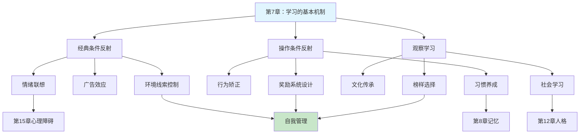

# 第7章 学习的基本机制

## 📍 章节定位

### 全书位置
> 本章探讨学习这一基本心理过程的三种核心机制——经典条件反射、操作条件反射和观察学习，承接意识状态对认知的影响，为后续记忆、认知过程章节奠定行为改变的理论基础，揭示人类如何通过经验获得新行为。

- **全书核心问题**: 如何用科学方法理解人类行为和心理过程？心理学研究如何在日常生活中应用？
- **本章回答的问题**: 我们如何学会新行为？经验如何改变行为？学习的三种基本机制是什么？
- **角色类型**: 核心概念型
- **论证位置**: 连接意识状态与记忆认知的关键桥梁

### 章节序列
| 方向 | 章节标题 | 逻辑连接 |
|------|----------|----------|
| 前章 | [[第6章-意识状态]] | 承接：意识状态影响学习效率 |
| 后章 | [[第8章-记忆]] | 铺垫：学习成果需要记忆来保存 |

### 一句话定位
> 第7章系统阐述学习的三种基本机制——经典条件反射、操作条件反射和观察学习，揭示人类行为如何通过联想、强化和模仿而改变，为理解习惯养成、行为矫正和社会学习提供科学框架。

---

## 🎯 核心观点

### 第一层：表层案例
> 章节中的具体案例、故事、数据

| 案例名称 | 简要描述 | 页码 | 关键引文 |
|----------|----------|------|----------|
| 巴甫洛夫的狗 | 铃声引发狗分泌唾液的经典实验 | p.210-215 | "中性刺激通过与无条件刺激配对获得引发反应的能力" |
| 斯金纳箱 | 白鼠按压杠杆获得食物的实验 | p.220-225 | "行为由其结果塑造" |
| 波波玩偶实验 | 儿童模仿成人攻击行为的观察学习 | p.235-240 | "学习可以不通过直接经验发生" |
| 小艾伯特实验 | 婴儿对白鼠建立恐惧条件反射 | p.216-218 | "情绪反应可以通过条件作用习得" |
| 代币强化系统 | 精神病院用代币奖励适应性行为 | p.228-230 | "次级强化物可以有效塑造复杂行为" |

### 第二层：中层机制
> 案例背后的运行机制、方法论

| 机制名称 | 组成要素 | 因果链条 | 证据来源 |
|----------|----------|----------|----------|
| 经典条件反射 | CS（条件刺激）、US（无条件刺激）、CR（条件反应） | 中性刺激+无条件刺激→中性刺激获得引发反应能力 | 巴甫洛夫唾液分泌实验 |
| 操作条件反射 | 辨别刺激、操作反应、强化物 | 行为→结果→行为频率改变 | 斯金纳箱系列实验 |
| 观察学习 | 注意、保持、再现、动机 | 观察榜样→心理表征→行为再现 | 班杜拉波波玩偶实验 |
| 强化程式 | 连续强化、间歇强化、固定/可变比率、固定/可变间隔 | 强化模式→反应速度→抗消退性 | 赌博机与定时薪水实验 |

### 第三层：底层规律
> 可迁移的普遍规律

| 规律陈述 | 抽象层级 | 知识连接 | 适用范围 |
|----------|----------|----------|----------|
| 联想是学习的基础机制 | 行为主义/联想主义 | [[思考快与慢]]系统1联想 | 广泛适用 |
| 行为受其后果调控 | 强化理论/效果律 | [[原子习惯]]行为设计 | 习惯养成 |
| 人类可以通过观察习得行为 | 社会学习理论 | [[影响力]]榜样效应 | 教育、营销 |

---

## 💬 降维翻译

### 观点1: 经典条件反射——你的大脑会自动联想

#### 原文表达
> 经典条件反射是一种学习形式，通过这种形式，一个中性刺激在与一个能够自然引发反应的刺激反复配对后，获得了引发类似反应的能力。
> —— p.210

#### 降维翻译（中学生能懂）
想象一下，每次你听到下课铃声，就会感到轻松和开心。为什么？因为铃声本来只是一个普通的声音，但由于它总是和"放学"这件让人高兴的事一起出现，你的大脑就把"铃声"和"开心"联系在了一起。

这就是经典条件反射——两个东西总是同时出现，大脑就会自动把它们绑在一起。以后只需要出现其中一个，你就会想到另一个。

就像听到手机提示音就想看微信，闻到食堂的味道就知道到饭点了，这些都是你的大脑在自动"联想"。

#### 日常类比（奶奶能懂）
就像你们家的狗，每次你拿狗绳的时候它就特别兴奋，又跳又叫。为什么？因为拿狗绳就意味着要出门遛弯了。狗绳本身只是一根绳子，但因为总是和"出门玩"连在一起，狗看到绳子就想到了玩。

人也一样。有些人听到某首老歌就会想起年轻时候的事，闻到某种菜香就想起妈妈做的饭。这些都是因为大脑把两件事"绑"在了一起。

#### 检验
- Q: 如果一个中学生问你什么叫经典条件反射？
- A: 就是两个东西总是一起出现，大脑就会自动把它们连起来。以后看到其中一个，就会想到另一个。

### 观点2: 操作条件反射——行为是结果塑造的

#### 原文表达
> 在操作条件反射中，有机体的行为是根据其后果而改变的吗，被强化的行为更可能重复出现，被惩罚的行为更可能被抑制。
> —— p.220

#### 降维翻译（中学生能懂）
简单来说：做什么事有好处，你就会多做；做什么事有坏处，你就会少做。

比如你在课堂上举手发言被老师表扬了，下次你就更愿意举手；如果你玩手机被没收了，下次你就更不敢玩了。你的行为不是凭空决定的，而是根据"结果"来调整的。

这就是为什么游戏公司会用奖励让你上瘾，为什么家长会用零花钱让你做家务——他们都在用"结果"来塑造你的行为。

#### 日常类比（奶奶能懂）
就像种庄稼一样，种瓜得瓜、种豆得豆。你付出什么行为，就会得到什么结果。好的行为得到好结果，坏的行为得到坏结果，人就会根据这些结果来调整自己以后怎么做。

就像小孩子，做完作业有糖吃，他就会主动做作业；捣蛋被骂了，他就会少捣蛋。不是孩子天生就懂，而是他在实践中学会了什么该做、什么不该做。

#### 检验
- Q: 如果一个中学生问你什么是操作条件反射？
- A: 就是"做什么得什么"。好的结果让你多做这件事，坏的结果让你少做这件事。

### 观点3: 观察学习——不需要亲身体验也能学会

#### 原文表达
> 观察学习是指个体通过观察他人的行为及其后果而进行学习的过程。这种学习不需要直接的强化或惩罚，只需要注意观察并记住他人的行为及其结果。
> —— p.235

#### 降维翻译（中学生能懂）
你不需要自己撞了墙才知道墙是硬的，你可以看着别人撞墙，然后记住"别撞墙"。

这就是观察学习——通过看别人怎么做、看别人得到什么结果，你就学会了。不需要自己去试错，不需要自己去挨打，看着别人的经历就能学到东西。

这就是为什么家长总说"不要跟坏孩子玩"，为什么老师会让你看"学霸是怎么学习的"，因为他们知道你会模仿身边的人。

#### 日常类比（奶奶能懂）
就像老人说的"吃一堑长一智"，但观察学习的智慧是"看别人吃一堑，自己长一智"。不用自己摔跟头，看着别人摔就知道那里有坑。

小孩子看大人怎么拿筷子，自己就学会了；看别人怎么骑自行车，自己就会骑了。很多时候我们不是靠反复试验学会的，而是靠"看"会的。

#### 检验
- Q: 如果一个中学生问你什么是观察学习？
- A: 就是通过看别人怎么做、看别人得到什么结果来学习。不用自己亲身经历，看别人的经历就能学会。

---

## ✨ 金句库

### 原书金句
| 金句 | 页码 | 适用场景 |
|------|------|----------|
| "学习是基于经验的行为改变。" | p.205 | 界定学习概念 |
| "中性刺激通过与无条件刺激配对而获得引发反应的能力。" | p.212 | 解释条件作用 |
| "行为由其后果塑造。" | p.222 | 概括操作性条件作用 |
| "强化增加行为频率，惩罚减少行为频率。" | p.225 | 区分强化与惩罚 |
| "学习可以不通过直接经验发生。" | p.236 | 强调观察学习 |

### 降维金句
| 金句 | 来源观点 | 适用场景 |
|------|----------|----------|
| 大脑是自动联想机器，总是在找规律做配对。 | 经典条件反射 | 理解习惯形成 |
| 做什么得什么，结果决定行为。 | 操作条件反射 | 行为改变指导 |
| 奖励塑造行为，惩罚抑制行为。 | 强化与惩罚 | 教育与自我管理 |
| 不用亲身试错，看别人跌倒也能学会绕路。 | 观察学习 | 学习效率提升 |
| 你是周围人的平均，因为你一直在模仿。 | 社会学习 | 环境选择警示 |

## 🔗 当下映射

### 💰 财富应用
| 场景 | 具体行动 | 预期效果 | 风险提示 |
|------|----------|----------|----------|
| 消费习惯矫正 | 识别消费触发条件刺激，打破"看到广告就想买"的联想 | 减少冲动消费，增加储蓄 | 需要持续监控和替代行为 |
| 投资纪律养成 | 用固定奖励强化定期投资行为 | 建立长期投资习惯 | 奖励设计不当可能本末倒置 |
| 职业技能学习 | 选择高质量榜样进行观察学习 | 加速技能习得 | 需要辨别榜样行为的有效性 |

### 💼 职场应用
| 场景 | 具体行动 | 所需能力 | 适用职级 |
|------|----------|----------|----------|
| 团队激励设计 | 运用强化程式原理设计激励机制 | 行为心理学基础 | 管理者 |
| 培训效果提升 | 结合三种学习机制设计培训方案 | 教学设计能力 | 培训师/HR |
| 职业发展加速 | 选择优秀同事作为观察学习对象 | 社交与观察能力 | 所有岗位 |

### 🏠 生活应用
| 场景 | 具体行动 | 可行性 | 见效时间 |
|------|----------|--------|----------|
| 习惯养成 | 用正强化设计习惯回路 | 高，易实践 | 2-4周 |
| 戒除坏习惯 | 识别触发线索，阻断条件反射链 | 中，需坚持 | 4-8周 |
| 亲子教育 | 用示范代替说教 | 高 | 即时可见 |
| 健康生活方式 | 环境设计减少不良线索，增加健康线索 | 中 | 2-3周 |

### 72小时行动计划
1. [明天可以做的第一件事]：记录今天发生的三次"自动行为"（如听到通知声就拿起手机），分析背后的条件反射机制
2. [本周内可以尝试的事]：选择一个想养成的习惯，设计一个小的即时奖励，连续执行3天观察效果
3. [需要准备资源才能做的事]：列出你经常接触的三个人，分析他们的哪些行为你在模仿，决定是否需要调整社交圈

---

## 🕸️ 章节关联

### 向上关联 → 整书
- **贡献**: 为全书的行为理解提供核心学习机制解释，奠定行为改变的科学基础
- **位置**: 连接生物基础与复杂认知的中间环节

### 横向关联 → 章节间
| 章节编号 | 章节标题 | 关联类型 | 连接描述 |
|----------|----------|----------|----------|
| 第6章 | 意识状态 | 前置 | 意识状态影响学习效率，注意分配影响条件反射建立 |
| 第8章 | 记忆 | 延伸 | 学习成果依赖记忆保存，记忆巩固强化学习效果 |
| 第9章 | 认知过程 | 发展 | 学习为认知提供素材，认知参与复杂学习过程 |
| 第12章 | 人格 | 影响 | 学习经验塑造人格特质，人格影响学习风格 |
| 第15章 | 心理障碍 | 应用 | 异常行为可通过学习机制解释和矫正 |

### 向下关联 → 具体应用
| 应用场景 | 难度 | 前置知识 |
|----------|------|----------|
| 习惯设计与改变 | 中 | 强化原理理解 |
| 教育培训设计 | 高 | 三种机制整合 |
| 行为矫正治疗 | 高 | 临床心理学基础 |

### 跨书关联 → 知识网络
| 书籍 | 概念 | 关系 | 备注 |
|------|------|------|------|
| [[原子习惯]] | 习惯回路（提示-行为-奖励） | 应用发展 | 操作条件反射的实践化 |
| [[思考快与慢]] | 系统1的联想机制 | 理论支持 | 经典条件反射的神经基础 |
| [[影响力]] | 社会认同原理 | 机制扩展 | 观察学习的营销应用 |
| [[心流]] | 即时反馈的重要性 | 强化补充 | 内在奖励的强化作用 |
| [[被讨厌的勇气]] | 目的论vs原因论 | 理论对话 | 与行为主义决定论的不同视角 |

### 关联可视化

---

## ❓ 问答设计

### Q1: [记忆型问题]
**认知层次**: 记忆  
**难度**: 低  
**题目**: 学习的三种基本机制是什么？  
**答案要点**:
- 经典条件反射
- 操作条件反射
- 观察学习

### Q2: [理解型问题]
**认知层次**: 理解  
**难度**: 中  
**题目**: 解释经典条件反射中条件刺激和无条件刺激的区别。  
**答案要点**:
- 无条件刺激：天然能引发反应的刺激（如食物引发唾液）
- 条件刺激：原本中性，通过配对获得引发反应能力的刺激（如铃声）
- 配对反复出现后，条件刺激能单独引发类似反应

### Q3: [应用型问题]
**认知层次**: 应用  
**难度**:**: 中  
**题目**: 如何运用操作条件反射原理帮助学生养成完成作业的习惯？  
**答案要点**:
- 识别目标行为（按时完成作业）
- 设计即时正向强化（如完成后获得游戏时间）
- 保持强化一致性
- 逐步从连续强化过渡到间歇强化
- 最终目标是行为内化

### Q4: [分析型问题]
**认知层次**: 分析  
**难度**: 高  
**题目**: 比较正强化、负强化和惩罚的区别及各自的效果。  
**答案要点**:
- 正强化：呈现愉快刺激增加行为（奖励）
- 负强化：移除不愉快刺激增加行为（如系安全带消除警报声）
- 惩罚：呈现不愉快或移除愉快刺激减少行为
- 强化增加行为，惩罚减少行为
- 正强化通常比惩罚更有效且副作用更小

### Q5: [评估型问题]
**认知层次**: 评估  
**难度**: 高  
**题目**: 评估观察学习在媒体暴力影响儿童行为中的作用。  
**答案要点**:
- 观察学习理论支持媒体暴力可能被模仿
- 需要考虑注意、保持、再现、动机四个条件
- 儿童比成人更容易受影响
- 榜样是否被奖励影响模仿可能性
- 需要结合其他因素综合评估

### Q6: [创造型问题]
**认知层次**: 创造  
**难度**: 高  
**题目**: 设计一个基于学习原理的健康生活习惯培养方案。  
**答案要点**:
- 运用经典条件反射：建立固定时间地点线索
- 运用操作条件反射：设计即时正向强化
- 运用观察学习：寻找榜样或加入社群
- 考虑强化程式：从连续到间歇
- 包含消退预防策略

### Q7: [理解型问题]
**认知层次**: 理解  
**难度**: 低  
**题目**: 为什么说"行为由其后果塑造"？  
**答案要点**:
- 行为的结果影响未来行为发生的概率
- 被强化的行为更可能重复
- 被惩罚的行为更可能被抑制
- 这就是操作条件反射的核心原理

### Q8: [应用型问题]
**认知层次**: 应用  
**难度**: 中  
**题目**: 运用条件反射原理解释"考前焦虑"的形成过程。  
**答案要点**:
- 考试（原本中性刺激）与紧张情绪（无条件反应）反复配对
- 形成条件反射：想到考试就焦虑
- 可能泛化到学习场景
- 可通过系统脱敏等方法消退

### Q9: [分析型问题]
**认知层次**: 分析  
**难度**: 中  
**题目**: 分析连续强化和间歇强化的优缺点及适用场景。  
**答案要点**:
- 连续强化：每次行为都强化，学习快但易消退
- 间歇强化：偶尔强化，学习慢但抗消退
- 新行为建立用连续强化
- 维持行为用间歇强化
- 可变程式比固定程式更抗消退

### Q10: [评估型问题]
**认知层次**: 评估  
**难度**: 中  
**题目**: 比较行为主义学习观和认知学习观的异同。  
**答案要点**:
- 行为主义：强调外部刺激-反应，忽视内部过程
- 认知观：强调内部心理表征和信息加工
- 共同点：都承认经验对行为的影响
- 观察学习整合了认知因素
- 现代学习理论趋向整合

### Q11: [创造型问题]
**认知层次**: 创造  
**难度**: 高  
**题目**: 设计一个减少手机依赖的行为干预方案。  
**答案要点**:
- 识别触发线索（经典条件反射）
- 移除或减少正向强化（如关闭通知）
- 增加使用成本（如设置使用限制）
- 替代行为的正强化（如阅读替代刷手机）
- 环境设计减少触发机会

### Q12: [记忆型问题]
**认知层次**: 记忆  
**难度**: 低  
**题目**: 观察学习的四个过程是什么？  
**答案要点**:
- 注意过程
- 保持过程
- 再现过程
- 动机过程

### Q13: [应用型问题]
**认知层次**: 应用  
**难度**: 中  
**题目**: 运用学习原理解释"习惯养成"的机制。  
**答案要点**:
- 提示触发行为（经典条件反射）
- 行为产生即时奖励（操作条件反射）
- 奖励强化行为回路
- 反复执行形成自动化
- 习惯=提示+行为+奖励的神经通路

### Q14: [分析型问题]
**认知层次**: 分析  
**难度**: 高  
**题目**: 分析"赌徒效应"中可变比率强化的作用机制。  
**答案要点**:
- 赌博机使用可变比率强化
- 行为与奖励之间关系不确定
- 产生强烈的持续反应倾向
- 极难消退
- 多巴胺系统参与奖励预期

### Q15: [创造型问题]
**认知层次**: 创造  
**难度**: 高  
**题目**: 设计一个基于社会学习理论的企业文化培训方案。  
**答案要点**:
- 选择合适榜样（优秀员工）
- 确保榜样行为被观察和注意
- 提供行为再现的机会和资源
- 对模范行为给予正向强化
- 创造观察学习和实践的环境

---
