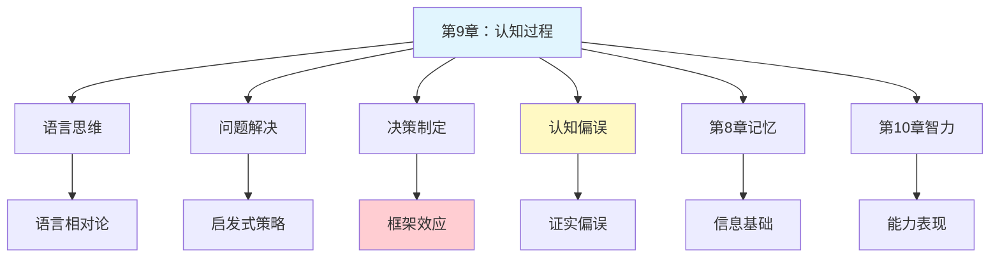

# 第9章 认知过程

## 📍 章节定位

### 全书位置
> 本章探讨人类认知的核心过程，包括语言结构、思维推理、问题解决策略和决策制定机制，是理解人类智能活动的关键章节，将感觉、知觉、意识、记忆等基础过程整合为高级认知功能，体现津巴多对认知科学的系统整合视角。

- **全书核心问题**: 如何用科学方法理解人类行为和心理过程？心理学研究如何在日常生活中应用？
- **本章回答的问题**: 人类如何使用语言进行思考和交流？我们如何解决问题和做出决策？认知过程中存在哪些系统性偏误？
- **角色类型**: 核心概念型
- **论证位置**: 认知整合章节，连接基础心理过程与高级智能活动

### 章节序列
| 方向 | 章节标题 | 逻辑连接 |
|------|----------|----------|
| 前章 | [[第8章-记忆]] | 承接：记忆为认知过程提供信息基础 |
| 后章 | [[第10章-智力与测量]] | 铺垫：认知过程是智力表现的核心机制 |

### 一句话定位
> 第9章深入探讨人类认知的核心过程，揭示语言、思维、问题解决和决策背后的心理机制，为理解人类智能的本质提供科学框架，同时揭示认知偏误如何影响我们的日常判断。

---

## 🎯 核心观点

### 第一层：表层案例
> 章节中的具体案例、故事、数据

| 案例名称 | 简要描述 | 页码 | 关键引文 |
|----------|----------|------|----------|
| 沃森选择任务 | 检验假设验证偏误的经典实验 | p.280-282 | "人们倾向于寻找证实而非证伪自己假设的证据" |
| 框架效应实验 | 同一问题不同表述导致不同决策 | p.295-297 | "决策不仅取决于内容，更取决于呈现方式" |
| 功能固着实验 | 蜡烛问题展示思维定势对问题解决的阻碍 | p.285-287 | "固着于物体惯常用途会限制创造性解决" |
| 启发式决策案例 | 可得性启发式影响风险判断 | p.290-292 | "我们用容易想到的例子来估计概率" |
| 语言相对论研究 | 萨皮尔-沃尔夫假说验证 | p.270-272 | "语言结构影响思维方式和认知分类" |
| 算法与启发式对比 | 系统性方法与经验捷径的效果差异 | p.288-290 | "启发式节省认知资源但可能引入偏误" |

### 第二层：中层机制
> 案例背后的运行机制、方法论

| 机制名称 | 组成要素 | 因果链条 | 证据来源 |
|----------|----------|----------|----------|
| 双系统加工机制 | 系统1（快速直觉）、系统2（慢速分析） | 情境触发→系统选择→认知加工→决策输出 | 认知心理学实验 |
| 启发式决策机制 | 可得性、代表性、锚定效应 | 问题呈现→启发式激活→快速判断→决策 | 行为经济学研究 |
| 问题解决机制 | 问题表征、策略选择、执行监控 | 问题识别→表征建构→策略检索→执行验证 | 问题解决研究 |
| 语言思维机制 | 词汇、语法、语义、语用 | 概念激活→语言编码→表达输出→理解解码 | 心理语言学研究 |

### 第三层：底层规律
> 可迁移的普遍规律

| 规律陈述 | 抽象层级 | 知识连接 | 适用范围 |
|----------|----------|----------|----------|
| 认知经济性原则 | 认知心理学/资源优化 | [[思考快与慢]] 双系统理论 | 日常决策与判断 |
| 证实偏误普遍性 | 认知偏误/动机推理 | [[影响力]] 承诺一致性 | 信念形成与维护 |
| 框架决定选择 | 行为经济学/前景理论 | [[助推]] 选择架构 | 政策设计与营销 |
| 语言塑造思维 | 心理语言学/语言相对论 | [[1984]] 新话控制思想 | 跨文化认知差异 |

---

## 💬 降维翻译

### 观点1: 你的大脑有两套操作系统——快与慢

#### 原文表达
> 认知加工存在两种基本模式：一种是快速的、自动的、无需努力的过程；另一种是缓慢的、可控的、需要努力的过程。两种系统在不同情境下被选择性激活。
> —— p.275

#### 降维翻译（中学生能懂）
想象你的大脑里装着两套操作系统。一套是"快捷模式"，像是手机上的常用功能快捷键，点一下就能反应过来，不用想太多。比如看到红灯就停下，听到自己名字就转头，这些都是"快系统"在工作。

另一套是"专业模式"，像是电脑上的专业软件，需要你专心致志地操作。比如解一道复杂的数学题，或者规划一次旅行行程，这些需要"慢系统"来处理。

有趣的是，大部分时候我们都在用"快系统"，因为它省力又快速。但正因为太快，有时候会犯错，就像手机快捷键有时候会按错一样。

#### 日常类比（奶奶能懂）
就像我们做饭有两套方法。平时炒个青菜，根本不用想，油热了放菜，加点盐，几分钟就搞定——这就是"快系统"，习惯成自然。

但如果要做一桌年夜饭，那就得好好规划：先做什么后做什么，每种菜要多长时间，火候怎么控制——这就是"慢系统"，需要动脑子认真想。

我们平时大部分时候都在用"快系统"，因为省事。但如果什么都用快系统，那就容易出问题，比如把盐当成糖放进去。

#### 检验
- Q: 如果一个中学生问你为什么有时候会冲动做错决定？
- A: 因为这时候用的是"快系统"，反应快但容易出错，就像考试时第一反应的答案不一定是对的。

### 观点2: 你看到的不是事实本身，而是被"包装"过的事实

#### 原文表达
> 决策不仅取决于问题内容本身，更取决于问题的呈现方式。同一问题的不同表述框架会导致截然不同的选择偏好，这就是框架效应。
> —— p.295

#### 降维翻译（中学生能懂）
同样的信息，换个说法，你的决定可能就完全不同。

举个例子，如果医生告诉你"这个手术有90%的成功率"，你可能会觉得很放心，愿意做手术。但如果医生说"这个手术有10%的失败率"，听起来就让人害怕，可能会犹豫要不要做。

但实际上，90%成功和10%失败说的是同一回事。我们的脑子会被"包装"影响，看到"成功"两个字就觉得积极，看到"失败"两个字就觉得消极。

所以广告里总是写"含有50%果肉"，而不是"一半是水"；写"加量不加价"，而不是"原价买更多"。

#### 日常类比（奶奶能懂）
就像买菜时，卖菜的会说"这瓜甜得很"，而不是说"这瓜不太酸"。说的都是同一个瓜，但听起来的感觉完全不一样。

又像年轻人相亲，介绍人说"这个人很老实本分"，听起来挺好；但如果说"这个人不会来事"，听起来就不太好。其实说的是同一种性格特点，只是包装不同。

所以我们要学会"拆包装"，看事情的本质，不要被表面的说法迷惑。

#### 检验
- Q: 如果一个中学生问你为什么同样的商品换个广告词就愿意买了？
- A: 因为广告词就是在给商品"换包装"，用积极的说法让你觉得更好，实际上东西还是那个东西。

### 观点3: 你的脑子喜欢"证实"自己是对的，不喜欢"证伪"自己

#### 原文表达
> 人们在检验假设时，存在强烈的证实偏误倾向，即倾向于寻找支持自己观点的证据，而忽视或低估与自己观点相矛盾的信息。
> —— p.280

#### 降维翻译（中学生能懂）
你有没有发现，当你认定一件事的时候，你看到的都是支持你的证据，而反对的证据你都会忽略或者找理由解释掉？

比如你觉得某个人不好，他做的每一件小事你都会解读成"看吧，他就是不好"。但如果他做了一件好事，你可能会想"肯定是装的"或者"偶然的"。

这就是证实偏误。我们的脑子不喜欢承认自己错了，所以会主动寻找"我是对的"的证据，而对"我可能是错的"的证据视而不见。

#### 日常类比（奶奶能懂）
就像老一辈人看病，认准了一个偏方有效，就会记住每一次用偏方治好的例子，但记不住那些没治好甚至加重的情况。

又像看手相算命，算命先生说的每一条，你会去想"好像真的是这样"，然后记住那些准的，忘掉那些不准的。

所以做人要谦虚，要敢于承认"我可能是错的"，多听听不同的意见。

#### 检验
- Q: 如果一个中学生问你为什么和人争论时总觉得对方不讲道理？
- A: 可能是因为你只看到支持自己的证据，自动过滤了对方说的有道理的部分，对方也是一样的。

---

## ✨ 金句库

### 原书金句
| 金句 | 页码 | 适用场景 |
|------|------|----------|
| "语言不仅是交流工具，更是思维工具。" | p.268 | 强调语言与思维的关系 |
| "问题解决始于正确的问题表征。" | p.283 | 阐述问题解决的关键 |
| "决策不仅取决于内容，更取决于框架。" | p.295 | 解释框架效应 |
| "启发式是认知的捷径，但也可能是认知的陷阱。" | p.291 | 双刃剑性质 |
| "我们用容易想到的例子来判断概率，而非真实概率。" | p.290 | 可得性启发式 |
| "证实偏误是阻碍科学思维的最大障碍之一。" | p.281 | 批判性思维培养 |

### 降维金句
| 金句 | 来源观点 | 适用场景 |
|------|----------|----------|
| 大脑有两套系统，快系统省力但易错，慢系统靠谱但费劲。 | 双系统理论 | 决策质量提醒 |
| 同样的事实换个说法，你的选择可能完全不同。 | 框架效应 | 批判性思考 |
| 你看到的都是你想看到的，这就是证实偏误。 | 证实偏误 | 开放心态培养 |
| 问题是"怎么问的"往往比"问的是什么"更重要。 | 问题表征 | 沟通技巧 |
| 第一直觉可能是对的，但只有验证后才能确定。 | 启发式与理性 | 决策方法 |
| 语言塑造思维，词汇框定认知边界。 | 语言相对论 | 语言学习意义 |

## 🔗 当下映射

### 💰 财富应用
| 场景 | 具体行动 | 预期效果 | 风险提示 |
|------|----------|----------|----------|
| 投资决策 | 用慢系统分析重大投资，避免启发式陷阱 | 减少冲动投资损失 | 过度分析导致错失机会 |
| 消费选择 | 识别营销框架效应，看穿价格包装 | 避免被促销话术忽悠 | 过度理性化降低生活乐趣 |
| 财务规划 | 用系统2制定长期规划，用系统1执行日常 | 提高规划执行效率 | 规划过于僵化缺乏弹性 |

### 💼 职场应用
| 场景 | 具体行动 | 所需能力 | 适用职级 |
|------|----------|----------|----------|
| 问题分析 | 先正确表征问题再寻找解决方案 | 系统思维 | 所有岗位 |
| 方案汇报 | 用积极框架呈现提案优势 | 沟通说服力 | 中层及以上 |
| 团队决策 | 引入"魔鬼代言人"对抗证实偏误 | 开放心态 | 管理层 |
| 创新工作 | 突破功能固着，尝试非常规组合 | 创造性思维 | 创新岗位 |

### 🏠 生活应用
| 场景 | 具体行动 | 可行性 | 见效时间 |
|------|----------|--------|----------|
| 人际沟通 | 注意语言的框架效应，用积极表达 | 高，需练习 | 即时可见 |
| 学习方法 | 建立问题意识，先定义问题再找答案 | 中，需调整习惯 | 1-2周 |
| 健康决策 | 重大健康决策用慢系统，日常用快系统 | 高 | 即时 |
| 育儿教育 | 教孩子识别广告框架，培养批判性思维 | 中，需耐心 | 长期见效 |

### 72小时行动计划
1. [明天可以做的第一件事]：观察自己在社交媒体上转发内容时的决策过程，记录是否用了快系统还是慢系统
2. [本周内可以尝试的事]：面对一个重要决定时，刻意用"慢系统"分析，写下决策过程，与平时习惯对比
3. [需要准备资源才能做的事]：学习一个新概念时，先用自己的话表述问题，再寻找答案，验证问题表征的重要性

---

## 🕸️ 章节关联

### 向上关联 → 整书
- **贡献**: 为全书的核心认知过程提供理论框架，整合感觉、知觉、记忆等基础过程
- **位置**: 高级认知功能层面

### 横向关联 → 章节间
| 章节编号 | 章节标题 | 关联类型 | 连接描述 |
|----------|----------|----------|----------|
| 第8章 | 记忆 | 承接 | 记忆提供认知加工的信息基础 |
| 第10章 | 智力与测量 | 铺垫 | 认知过程是智力表现的核心机制 |
| 第6章 | 意识状态 | 影响 | 意识状态决定认知资源的可用性 |
| 第7章 | 学习的基本机制 | 基础 | 学习机制影响问题解决策略的习得 |

### 向下关联 → 具体应用
| 应用场景 | 难度 | 前置知识 |
|----------|------|----------|
| 批判性思维培养 | 中 | 基本逻辑概念 |
| 决策能力提升 | 高 | 自我觉察能力 |
| 沟通说服技巧 | 中 | 语言表达能力 |
| 问题分析方法 | 中 | 系统思维基础 |

### 跨书关联 → 知识网络
| 书籍 | 概念 | 关系 | 备注 |
|------|------|------|------|
| [[思考快与慢]] | 双系统理论 | 核心来源 | 卡尼曼对系统1和系统2的系统阐述 |
| [[影响力]] | 框架与说服 | 实践扩展 | 框架效应在说服中的应用 |
| [[助推]] | 选择架构 | 政策应用 | 利用认知偏误设计更好的选择环境 |
| [[黑天鹅]] | 认知偏误 | 深入分析 | 证实偏误如何导致对黑天鹅事件的忽视 |
| [[穷查理宝典]] | 思维模型 | 互补发展 | 多元思维模型对抗单一视角的证实偏误 |
| [[学会提问]] | 批判性思维 | 方法论 | 对抗证实偏误的具体方法 |

### 关联可视化

---

## ❓ 问答设计

### Q1: [记忆型问题]
**认知层次**: 记忆  
**难度**: 低  
**题目**: 认知过程的两大加工系统是什么？各有什么特点？  
**答案要点**:
- 系统1：快速、自动、无需努力
- 系统2：缓慢、可控、需要努力
- 两者在不同情境下选择性激活

### Q2: [理解型问题]
**认知层次**: 理解  
**难度**: 中  
**题目**: 解释框架效应如何影响人们的决策。  
**答案要点**:
- 同一问题的不同表述导致不同决策
- 积极框架与消极框架的选择偏好差异
- 本质相同的信息被"包装"后产生不同感知

### Q3: [应用型问题]
**认知层次**: 应用  
**难度**: 中  
**题目**: 如何在实际生活中避免证实偏误的陷阱？  
**答案要点**:
- 主动寻找反面证据
- 引入"魔鬼代言人"角色
- 区分"证明自己是对的"和"找到正确答案"
- 保持开放心态，愿意修正观点

### Q4: [分析型问题]
**认知层次**: 分析  
**难度**: 高  
**题目**: 分析启发式策略的优点和缺点。  
**答案要点**:
- 优点：节省认知资源、快速反应、进化适应
- 缺点：可能引入系统性偏误、忽视重要信息
- 环境匹配：在简单熟悉情境有效，复杂陌生情境可能失效

### Q5: [评估型问题]
**认知层次**: 评估  
**难度**: 高  
**题目**: 评估语言相对论假说的合理性和局限性。  
**答案要点**:
- 合理性：语言影响思维习惯和认知分类
- 局限性：语言不是思维的唯一决定因素
- 跨语言认知共性的存在
- 双语者的认知灵活性证据

### Q6: [创造型问题]
**认知层次**: 创造  
**难度**: 高  
**题目**: 设计一个帮助人们克服证实偏误的决策工具或方法。  
**答案要点**:
- 强制列出反对意见的功能
- 第三方视角的模拟
- 反证假设的检验步骤
- 认知提醒和反思机制

### Q7: [理解型问题]
**认知层次**: 理解  
**难度**: 低  
**题目**: 为什么说"问题表征"是问题解决的关键第一步？  
**答案要点**:
- 表征决定信息提取方向
- 错误表征导致错误解决路径
- 重新表征可能带来突破

### Q8: [应用型问题]
**认知层次**: 应用  
**难度**: 中  
**题目**: 如何利用框架效应设计更有效的健康宣传信息？  
**答案要点**:
- 使用积极框架强调行为益处
- 对风险行为使用损失框架
- 目标受众的价值观匹配
- A/B测试验证效果

### Q9: [分析型问题]
**认知层次**: 分析  
**难度**: 中  
**题目**: 分析功能固着现象对创新思维的阻碍。  
**答案要点**:
- 固着于物体的惯常用途
- 限制了思维的灵活性
- 经验既是资产也是负担
- 突破需要刻意练习反常规思考

### Q10: [评估型问题]
**认知层次**: 评估  
**难度**: 中  
**题目**: 比较算法策略和启发式策略的适用场景。  
**答案要点**:
- 算法：有明确步骤、保证正确、耗时
- 启发式：经验规则、不保证正确、快速
- 高风险决策适用算法
- 时间紧迫场景适用启发式

### Q11: [创造型问题]
**认知层次**: 创造  
**难度**: 高  
**题目**: 如何设计一个认知偏误识别与干预的培训课程？  
**答案要点**:
- 常见偏误的案例分析
- 个人偏误模式的自我觉察
- 实时识别与纠正练习
- 慢系统激活的触发机制

### Q12: [记忆型问题]
**认知层次**: 记忆  
**难度**: 低  
**题目**: 常见的启发式策略有哪些？  
**答案要点**:
- 可得性启发式
- 代表性启发式
- 锚定与调整启发式

### Q13: [应用型问题]
**认知层次**: 应用  
**难度**: 中  
**题目**: 运用双系统理论分析"冲动消费"现象。  
**答案要点**:
- 冲动消费是系统1主导的结果
- 营销刺激触发快速情感反应
- 系统2未充分参与理性评估
- 预防策略：延迟决策、预算约束

### Q14: [分析型问题]
**认知层次**: 分析  
**难度**: 高  
**题目**: 分析语言如何影响我们对时间和空间的认知。  
**答案要点**:
- 不同语言的时间隐喻差异
- 空间参照系的语言差异
- 语言习惯塑造思维习惯
- 跨文化认知研究的证据

### Q15: [创造型问题]
**认知层次**: 创造  
**难度**: 高  
**题目**: 为小学生设计一套培养批判性思维的游戏活动。  
**答案要点**:
- 识别广告框架的游戏
- "找反例"的逻辑游戏
- 多角度故事重述活动
- 假设检验的小实验

---
