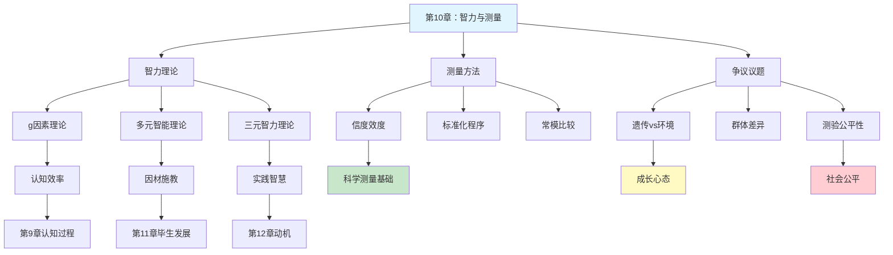

---

category:
  - 书籍拆解
  - - - 心理学与生活
status: draft
chapter:
number: 10
title: 智力与测量
links:

  - "[[第9章-认知过程]]"
  - "[[第11章-人的毕生发展]]"
created: 2026-02-27
tags:
  - 心理学与生活
  - 智力理论
  - 智力测量
  - IQ测验
  - 信度效度
  - 津巴多
---

# 第10章 智力与测量

## 📍 章节定位

### 全书位置
> 本章探讨智力的本质与测量，承接认知过程的理论基础，为毕生发展中的个体差异解释提供框架，揭示心理学家如何定义、测量和理解人类智力的核心议题。

- **全书核心问题**: 如何用科学方法理解人类行为和心理过程？心理学研究如何在日常生活中应用？
- **本章回答的问题**: 智力是什么？智力可以测量吗？智力测验公平吗？智力是天生的还是后天培养的？
- **角色类型**: 核心概念型+争议议题型
- **论证位置**: 认知能力评估的核心章节，连接个体差异与社会应用

### 章节序列
| 方向 | 章节标题 | 逻辑连接 |
|------|----------|----------|
| 前章 | [[第9章-认知过程]] | 承接：认知能力是智力的基础成分 |
| 后章 | [[第11章-人的毕生发展]] | 铺垫：智力发展贯穿毕生，个体差异影响发展轨迹 |

### 一句话定位
> 第10章系统梳理智力的多种理论定义——从斯皮尔曼的g因素到加德纳的多元智能——并深入探讨智力测量的历史、方法与争议，为理解"聪明"这一人类最关注的特质提供科学框架。

---

## 🎯 核心观点

### 第一层：表层案例
> 章节中的具体案例、故事、数据

| 案例名称 | 简要描述 | 页码 | 关键引文 |
|----------|----------|------|----------|
| 比奈智力测验的诞生 | 1904年法国教育部长委托比奈识别需要特殊教育的儿童 | p.295 | "智力不是固定不变的，可以通过训练提高" |
| 斯坦福-比奈量表 | 推孟将比奈测验引入美国并标准化 | p.298 | "IQ=心理年龄÷生理年龄×100" |
| 韦克斯勒测验 | 将智力分为言语和操作两个维度 | p.302 | "成人智力应与同龄人比较而非儿童" |
| 加德纳多元智能 | 提出8种相对独立的智能类型 | p.315 | "语言和数学能力高的人可能在音乐或空间能力上很弱" |
| 弗林效应 | 20世纪IQ分数持续上升的现象 | p.325 | "环境改善导致智力测验分数代际提高" |
| 种族IQ差异争议 | 关于不同种族群体IQ差异的激烈争论 | p.328 | "群体内差异远大于群体间差异" |

### 第二层：中层机制
> 案例背后的运行机制、方法论

| 机制名称 | 组成要素 | 因果链条 | 证据来源 |
|----------|----------|----------|----------|
| 二因素理论 | g因素（一般智力）+ s因素（特殊能力） | 所有认知任务共享g因素，不同任务有独特s因素 | 斯皮尔曼统计分析 |
| 多元智能理论 | 语言、逻辑数学、空间、音乐、身体运动、人际、内省、自然 | 智力是多维度而非单一维度 | 脑损伤病人选择性缺失 |
| 三元智力理论 | 分析性、创造性、实践性智力 | 真正的聪明需要三种智力结合 | 斯腾伯格跨文化研究 |
| 信度效度框架 | 重测信度、内部一致性、内容效度、效标效度 | 好测验必须稳定且准确测量目标构念 | 心理测量学标准 |
| 遗传率估计 | 双生子研究、收养研究 | 同卵双生子IQ相关性高于异卵双生子和亲生兄弟 | 明尼苏达双生子研究 |

### 第三层：底层规律
> 可迁移的普遍规律

| 规律陈述 | 抽象层级 | 知识连接 | 适用范围 |
|----------|----------|----------|----------|
| 测量定义构念 | 科学哲学 | [[第2章-心理学的研究方法]]操作性定义 | 所有科学测量 |
| 遗传提供可能性，环境决定实现性 | 基因-环境交互 | [[第3章-行为的生物学基础]] | 发展心理学 |
| 测验偏差反映社会偏差而非真实差异 | 批判性测量学 | [[第1章-生活中的心理学]]文化公平 | 教育测评 |
| 智力是多元的而非单一的 | 多元视角 | [[思考快与慢-丹尼尔·卡尼曼]]系统1/系统2 | 人才评估 |

---

## 💬 降维翻译

### 观点1: g因素——聪明的"底色"是一样的

#### 原文表达
> 斯皮尔曼发现，在一个认知任务上表现好的人，倾向于在所有认知任务上都表现好。他提出存在一个一般智力因素g，它影响所有认知活动的效率。
> —— p.310

#### 降维翻译（中学生能懂）
你有没有发现，班里有些同学好像"什么都会"——数学好、语文好、学英语也快？而有些同学可能某一科特别好，但其他科目就一般？

这不是巧合。心理学家发现，各种能力之间确实有联系：一个人在一个领域聪明，在其他领域往往也不差。这种"通用的聪明劲儿"就叫g因素。

就像手机，有的手机处理器快，跑什么软件都快；有的处理器慢，干什么都卡。这个"处理器速度"就是g因素。

#### 日常类比（奶奶能懂）
就像一块田地，土质好（g因素高），种什么都长得好；土质差（g因素低），种什么都长不好。当然，每种作物还需要不同的照顾（特殊能力s因素），但底子好不好也很重要。

#### 检验
- Q: 如果一个中学生问你什么是g因素？
- A: 就是一种"通用的聪明"，有这种聪明的人学什么都快，理解什么都容易。

### 观点2: 多元智能——聪明不止一种样子

#### 原文表达
> 加德纳认为，传统智力测验只测量了语言和逻辑数学能力，忽略了其他同样重要的智能形式。他提出至少存在8种相对独立的智能。
> —— p.315

#### 降维翻译（中学生能懂）
考试分数高就是聪明吗？不一定。

加德纳告诉我们，聪明有很多种样子：
- 有的人数学好（逻辑数学智能）
- 有的人会说话（语言智能）
- 有的人画画好看（空间智能）
- 有的人唱歌好听（音乐智能）
- 有的人运动厉害（身体运动智能）
- 有的人特别会交朋友（人际智能）
- 有的人特别了解自己（内省智能）
- 有的人对自然特别敏感（自然智能）

你可能在某一方面特别厉害，其他方面一般。这不代表你不聪明，只是你的聪明在另一个领域。

#### 日常类比（奶奶能懂）
就像一个果园，有的树结苹果，有的结梨，有的结橘子。你不能因为苹果树结不出梨，就说它是棵"笨树"。每种树都有它的价值，人也一样，每种聪明都有用处。

#### 检验
- Q: 如果一个中学生问你多元智能是什么意思？
- A: 聪明不只是考试分数高。会说话、会画画、会唱歌、会交朋友、了解自己……这些都是聪明，只是形式不同。

### 观点3: 信度与效度——测验好不好，看这两把尺子

#### 原文表达
> 信度指测验结果的一致性和稳定性，效度指测验是否真正测量了它想要测量的东西。一个好的智力测验必须同时具备高信度和高效度。
> —— p.305

#### 降维翻译（中学生能懂）
怎么判断一个测验好不好？两把尺子：

**信度**=稳定性。今天测你IQ是110，明天测还是110左右，这个测验就有信度。如果今天110，明天80，后天130，这个测验就不可靠。

**效度**=准确性。一个英语测验如果考的都是数学题，那它信度再高也没用——因为它测的根本不是英语能力。效度就是问：这个测验测的到底是不是它声称要测的东西？

好测验=信度高+效度高。

#### 日常类比（奶奶能懂）
就像称体重的秤：
- 信度：今天称60公斤，明天再称还是60公斤，这秤靠谱。
- 效度：这秤真的在称体重，不是在量身高。如果秤出来的数字跟体重没关系，这秤就没效。

好秤要两样都占。

#### 检验
- Q: 如果一个中学生问你什么是信度和效度？
- A: 信度就是测得稳不稳，效度就是测得准不准。好测验既要稳又要准。

### 观点4: 遗传与环境——先天开底牌，后天打牌技

#### 原文表达
> 双生子研究表明，智力的遗传率约为50%-70%，但环境因素同样重要。遗传决定潜力范围，环境决定在这个范围内的实际位置。
> —— p.322

#### 降维翻译（中学生能懂）
你聪明不聪明，天生占一半，后天也占一半。

基因决定了你的"上限"和"下限"：你可能再努力也成不了爱因斯坦，但再怎么躺平也不会太笨。这是天生的牌面。

但在这副牌能打成什么样，靠后天：有没有好的教育、有没有人鼓励你、你自己努不努力。这是打牌的技巧。

所以，别把"我天生不聪明"当借口，也别觉得"反正天生聪明就不用努力"。牌好牌坏都要打，打好打坏看自己。

#### 日常类比（奶奶能懂）
就像种庄稼：种子好不好（遗传）决定能长多高，但水肥够不够、阳光好不好（环境）也决定最后能收多少。好种子+好环境=好收成；坏种子+好环境，比坏种子+坏环境强；好种子+坏环境，也会长不好。

#### 检验
- Q: 如果一个中学生问你智力是天生的还是后天培养的？
- A: 两样都重要。天生决定你能到什么高度，后天决定你能不能到达那个高度。

---

## ✨ 金句库

### 原书金句
| 金句 | 页码 | 适用场景 |
|------|------|----------|
| "智力是一种综合能力，包括推理、计划、解决问题、抽象思维、理解复杂观念、快速学习和从经验中学习的能力。" | p.294 | 定义智力 |
| "智力测验测量的是在特定文化背景下被认为有价值的能力。" | p.308 | 批判测验 |
| "智商分数只是一个数字，它不能定义一个人的全部价值。" | p.312 | 人文关怀 |
| "遗传提供原材料，环境负责塑造成品。" | p.323 | 基因环境交互 |
| "群体内的差异永远大于群体间的差异。" | p.329 | 反刻板印象 |

### 降维金句
| 金句 | 来源观点 | 适用场景 |
|------|----------|----------|
| g因素就是"通用的聪明劲儿"，有人学什么都快，有人学什么都慢。 | 二因素理论 | 理解个体差异 |
| 聪明不止一种，考试分数高只是其中一种。 | 多元智能 | 鼓励多元发展 |
| 信度看稳不稳定，效度看准不准确——好测验两样都要。 | 测验评估 | 批判性思维 |
| 基因发牌，环境打牌，打得怎么样看自己。 | 遗传环境 | 成长心态 |
| IQ只是数字，不能定义你是谁。 | 测验局限 | 人文关怀 |
| 智力测验测的不是"聪明程度"，而是"在某个文化里被重视的能力"。 | 文化偏见 | 批判意识 |

## 🔗 当下映射

### 💰 财富应用
| 场景 | 具体行动 | 预期效果 | 风险提示 |
|------|----------|----------|----------|
| 职业选择 | 了解自己的智能优势，选择匹配的职业赛道 | 发挥优势，事半功倍 | 避免单一IQ思维，多元评估自己 |
| 投资学习 | 承认自己的认知局限，扬长避短 | 减少认知盲区导致的损失 | 过度自信或过度自卑都有害 |
| 子女教育投资 | 发现孩子多元智能，针对性投入资源 | 因材施教，效率更高 | 避免唯IQ论，忽视非认知能力 |

### 💼 职场应用
| 场景 | 具体行动 | 所需能力 | 适用职级 |
|------|----------|----------|----------|
| 招聘选拔 | 使用多元评估而非单一智力测验 | 心理测量知识 | HR/管理者 |
| 团队搭配 | 组合不同智能优势的成员 | 人才识别能力 | 团队管理者 |
| 自我发展 | 识别自己的实践智力短板并弥补 | 自我认知 | 所有岗位 |

### 🏠 生活应用
| 场景 | 具体行动 | 可行性 | 见效时间 |
|------|----------|--------|----------|
| 亲子教育 | 观察孩子多种智能表现，不强求全面发展 | 高，需要耐心 | 持续观察 |
| 自我认知 | 做一次正规智力测验，客观了解自己 | 中，需要专业机构 | 即时了解 |
| 破除标签 | 拒绝被IQ分数定义，也拒绝用IQ定义他人 | 高，观念转变 | 立即生效 |

### 72小时行动计划
1. [明天可以做的第一件事]：列出自己最强的2-3种智能（参考多元智能8种类型），思考如何在工作生活中更多运用
2. [本周内可以尝试的事]：回忆一个被"标签化"的经历（自己或他人），用多元智能视角重新解读
3. [需要准备资源才能做的事]：如果条件允许，做一次专业的职业能力/优势测评，不是IQ测验，而是多元能力评估

---

## 🕸️ 章节关联

### 向上关联 → 整书
- **贡献**: 为全书提供智力评估的科学框架，解释个体差异的认知基础
- **位置**: 认知能力评估核心章节，连接基础认知与个体发展

### 横向关联 → 章节间
| 章节编号 | 章节标题 | 关联类型 | 连接描述 |
|----------|----------|----------|----------|
| 第9章 | 认知过程 | 前置 | 认知过程是智力的基础成分 |
| 第11章 | 人的毕生发展 | 延伸 | 智力发展贯穿毕生，呈现不同轨迹 |
| 第12章 | 人格 | 并列 | 智力与人格构成个体差异两大维度 |
| 第14章 | 人格测评 | 方法共享 | 智力测验与人格测验共同构成心理测评 |
| 第15章 | 心理障碍 | 应用 | 智力障碍的诊断需要标准化测量 |

### 向下关联 → 具体应用
| 应用场景 | 难度 | 前置知识 |
|----------|------|----------|
| 教育评估 | 中 | 测验理论、多元智能 |
| 职业选拔 | 高 | 效度分析、公平性考量 |
| 临床诊断 | 高 | 标准化程序、常模理解 |

### 跨书关联 → 知识网络
| 书籍 | 概念 | 关系 | 备注 |
|------|------|------|------|
| [[思考快与慢-丹尼尔·卡尼曼]] | 系统1/系统2 | 理论对话 | g因素可能与系统2效率相关 |
| [[异类]] | 10000小时定律 | 争议补充 | 练习vs天赋的永恒争论 |
| [[刻意练习]] | 天才的养成 | 理论对话 | 强调环境作用，弱化遗传 |
| [[天赋优势]] | 盖洛普优势识别器 | 应用发展 | 多元智能的商业化应用 |
| [[被讨厌的勇气-岸见一郎]] | 人的价值 | 哲学延伸 | IQ不定义人的价值 |

### 关联可视化

---

## ❓ 问答设计

### Q1: [记忆型问题]
**认知层次**: 记忆  
**难度**: 低  
**题目**: 加德纳提出的多元智能包括哪8种？  
**答案要点**:
- 语言智能
- 逻辑数学智能
- 空间智能
- 音乐智能
- 身体运动智能
- 人际智能
- 内省智能
- 自然智能

### Q2: [理解型问题]
**认知层次**: 理解  
**难度**: 中  
**题目**: 解释斯皮尔曼的g因素和s因素的区别。  
**答案要点**:
- g因素：一般智力，影响所有认知任务
- s因素：特殊能力，只影响特定任务
- g因素决定整体认知效率
- s因素解释特定领域的能力差异

### Q3: [应用型问题]
**认知层次**: 应用  
**难度**: 中  
**题目**: 如果一个智力测验的重测信度只有0.3，你能得出什么结论？  
**答案要点**:
- 信度过低，不可接受
- 测验结果不稳定，今天测和明天测差异很大
- 不能用于重要决策
- 需要重新设计或废弃该测验
- 好的智力测验重测信度应在0.8以上

### Q4: [分析型问题]
**认知层次**: 分析  
**难度**: 高  
**题目**: 比较斯腾伯格的三元智力理论和加德纳的多元智能理论的异同。  
**答案要点**:
- 相同点：都反对单一智力观，强调智力多元性
- 加德纳：8种相对独立的内容领域
- 斯腾伯格：3种加工过程（分析、创造、实践）
- 加德纳侧重"智力在哪里"（内容）
- 斯腾伯格侧重"智力怎么运作"（过程）
- 两种理论可以整合理解

### Q5: [评估型问题]
**认知层次**: 评估  
**难度**: 高  
**题目**: 评估智力测验在教育选拔中的利弊。  
**答案要点**:
- 利：提供客观数据，识别特殊需求学生，预测学业表现
- 弊：可能造成标签效应，文化不公平，忽视非认知能力
- 关键在于如何使用：辅助决策而非唯一标准
- 需要结合多元评估
- 需要定期审查测验的公平性

### Q6: [创造型问题]
**认知层次**: 创造  
**难度**: 高  
**题目**: 如果让你设计一个"文化公平"的智力测验，你会考虑哪些因素？  
**答案要点**:
- 减少语言依赖，使用非言语材料
- 避免特定文化背景知识
- 测试基本认知能力而非文化习得技能
- 在多个文化群体中标准化
- 建立不同群体的常模
- 持续监测偏差并修正

### Q7: [理解型问题]
**认知层次**: 理解  
**难度**: 低  
**题目**: 什么是弗林效应？它说明了什么？  
**答案要点**:
- 弗林效应：20世纪IQ分数持续上升的现象
- 说明智力表现受环境因素影响
- 可能原因：营养改善、教育普及、信息环境复杂化
- 证明智力不是固定不变的
- 对"智力天生决定论"提出挑战

### Q8: [应用型问题]
**认知层次**: 应用  
**难度**: 中  
**题目**: 如何用多元智能理论指导孩子的教育？  
**答案要点**:
- 首先观察识别孩子的优势智能
- 用优势智能带动弱势领域学习
- 不强求全面发展，接受智能组合的差异性
- 创造展示不同智能的机会
- 避免用单一标准（如考试分数）评价孩子

### Q9: [分析型问题]
**认知层次**: 分析  
**难度**: 中  
**题目**: 分析双生子研究如何帮助区分遗传和环境影响。  
**答案要点**:
- 同卵双生子基因100%相同，异卵双生子50%相同
- 如果同卵双生子IQ相关性显著高于异卵双生子，说明遗传有作用
- 分开抚养的双生子可以分离环境因素
- 收养研究可以分离遗传和家庭环境
- 遗传率估计基于这些比较

### Q10: [评估型问题]
**认知层次**: 评估  
**难度**: 中  
**题目**: "智力测验测量的是在特定文化中被重视的能力"——这句话对理解智力测验有什么启示？  
**答案要点**:
- 智力不是纯客观存在，而是文化建构
- 测验内容反映设计者的文化价值观
- 不同文化可能重视不同能力
- 跨文化比较需要谨慎
- 不应把测验结果绝对化
- 需要发展多元文化视角的评估

### Q11: [创造型问题]
**认知层次**: 创造  
**难度**: 高  
**题目**: 设计一个帮助职场人士发现自身智能优势的自我评估工具大纲。  
**答案要点**:
- 基于8种智能设计情境问题
- 每种智能5-10个日常生活/工作场景
- 采用自评+行为指标结合
- 提供优势组合分析而非单一分数
- 配套职业建议和发展路径
- 强调发展建议而非固定标签

### Q12: [记忆型问题]
**认知层次**: 记忆  
**难度**: 低  
**题目**: 信度和效度分别指什么？  
**答案要点**:
- 信度：测验结果的稳定性和一致性
- 效度：测验是否测量了它想要测量的东西
- 好的测验需要高信度+高效度

### Q13: [应用型问题]
**认知层次**: 应用  
**难度**: 中  
**题目**: 一个人的IQ是85，这意味着什么？不意味着什么？  
**答案要点**:
- 意味着：在常模群体中低于平均水平约1个标准差
- 不意味着：这个人"不聪明"或"没价值"
- 不意味着：无法取得成功或幸福
- 意味着：可能在某些学术任务上需要更多支持
- 需要结合多元评估理解这个人

### Q14: [分析型问题]
**认知层次**: 分析  
**难度**: 高  
**题目**: 分析"群体内差异大于群体间差异"这句话对理解种族IQ差异的启示。  
**答案要点**:
- 任何群体内部的个体差异远大于群体平均值差异
- 知道一个人的种族几乎不能预测其IQ
- 群体平均值差异可能是环境因素导致
- 不应该用群体平均值判断个人
- 消除刻板印象的重要依据

### Q15: [评估型问题]
**认知层次**: 评估  
**难度**: 高  
**题目**: 评估"智力是天生的"这一观点。  
**答案要点**:
- 部分正确：遗传率估计约50%-70%
- 但不完整：环境至少贡献30%
- 遗传决定潜力范围，环境决定实际位置
- "天生"不等于"不可改变"
- 早期干预和持续教育都有影响
- 过分强调先天会忽视环境改善的价值

---
