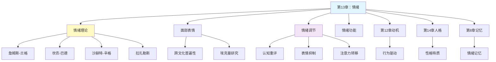

---

category:
  - 书籍拆解
  - - - 心理学与生活
status: draft
chapter:
number: 13
title: 情绪
links:

  - "[[第12章-动机]]"
  - "[[第14章-人格]]"
  - "[[第8章-记忆]]"
created: 2026-02-27
tags:
  - 心理学与生活
  - 情绪理论
  - 詹姆斯兰格理论
  - 沙赫特辛格理论
  - 认知评价
  - 面部表情
  - 情绪调节
  - 津巴多
---

# 第13章 情绪

## 📍 章节定位

### 全书位置
> 本章系统探讨人类情绪的本质、产生机制与调节方法，从詹姆斯-兰格理论到沙赫特-辛格的认知-生理两因素理论，揭示情绪是生理唤醒与认知评价的整合产物，同时阐述面部表情的跨文化普遍性及情绪调节策略，为理解人类情感生活和管理情绪提供科学框架。

- **全书核心问题**: 如何用科学方法理解人类行为和心理过程？心理学研究如何在日常生活中应用？
- **本章回答的问题**: 情绪是什么？情绪是如何产生的？情绪可以调节吗？情绪有什么功能？
- **角色类型**: 核心概念型
- **论证位置**: 动机与情绪序列的核心章节，连接动机与人格

### 章节序列
| 方向 | 章节标题 | 逻辑连接 |
|------|----------|----------|
| 前章 | [[第12章-动机]] | 承接：动机驱动行为，情绪调节行为 |
| 后章 | [[第14章-人格]] | 铺垫：情绪模式是人格的重要组成部分 |
| 关联 | [[第8章-记忆]] | 交互：情绪影响记忆编码，记忆唤起情绪 |

### 一句话定位
> 第13章揭示情绪不是神秘的主观体验，而是生理唤醒与认知评价的整合产物，通过理解情绪的产生机制，我们可以更有效地识别、表达和调节情绪。

---

## 🎯 核心观点

### 第一层：表层案例
> 章节中的具体案例、故事、数据

| 案例名称 | 简要描述 | 页码 | 关键引文 |
|----------|----------|------|----------|
| 詹姆斯经典例子 | "我们害怕是因为我们逃跑" | p.350 | "不是因为我们害怕才逃跑，而是因为逃跑才感到害怕" |
| 沙赫特-辛格实验 | 注射肾上腺素后的情绪归因 | p.360-365 | "同样的生理唤醒，不同的认知解释，产生不同的情绪" |
| 埃克曼跨文化研究 | 面部表情的普遍性验证 | p.372-375 | "六种基本表情在所有文化中都能被识别" |
| 吊桥实验 | 生理唤醒的错误归因 | p.368 | "恐惧被误认为心动" |
| 情绪调节策略对比 | 认知重评vs表情抑制 | p.385 | "认知重评更有效，表情抑制消耗更多认知资源" |

### 第二层：中层机制
> 案例背后的运行机制、方法论

| 机制名称 | 组成要素 | 因果链条 | 证据来源 |
|----------|----------|----------|----------|
| 詹姆斯-兰格机制 | 外周生理反应、反馈、情绪体验 | 刺激→生理反应→反馈→情绪体验 | 生理反馈研究 |
| 坎农-巴德机制 | 丘脑、大脑皮层、自主神经系统 | 刺激→丘脑→同时激活皮层和自主神经→情绪与生理反应 | 神经科学研究 |
| 沙赫特-辛格机制 | 生理唤醒、认知评价、环境线索 | 生理唤醒+认知归因+环境线索→情绪体验 | 肾上腺素实验 |
| 拉扎勒斯评价机制 | 初评价、次评价、再评价 | 刺激→利害评估→应对评估→效果评估→情绪 | 认知评价研究 |

### 第三层：底层规律
> 可迁移的普遍规律

| 规律陈述 | 抽象层级 | 知识连接 | 适用范围 |
|----------|----------|----------|----------|
| 情绪是生理与认知的整合 | 情绪心理学/整合观 | [[思考快与慢-丹尼尔·卡尼曼]] 双系统 | 情绪理解与管理 |
| 认知决定情绪性质 | 认知心理学/评价理论 | [[被讨厌的勇气-岸见一郎]] 主观诠释 | 情绪调节、压力管理 |
| 基本情绪具有跨文化普遍性 | 进化心理学/情感表达 | [[影响力-西奥迪尼]] 情感说服 | 跨文化沟通 |
| 情绪调节策略影响心理健康 | 临床心理学/情绪管理 | [[非暴力沟通]] 情绪表达 | 心理健康维护 |

---

## 💬 降维翻译

### 观点1: 你是先"跑起来"才感到害怕，不是先害怕才跑

#### 原文表达
> 詹姆斯提出一个反直觉的观点：我们感到害怕是因为我们的身体在颤抖、心跳在加速、呼吸在急促，而不是因为我们害怕身体才会有这些反应。情绪是对身体变化的觉知。
> —— p.350

#### 降维翻译（中学生能懂）
你有没有想过，到底是先害怕才发抖，还是先发抖才害怕？

我们通常觉得：看到蛇→害怕→身体发抖。但詹姆斯说，顺序可能恰恰相反：看到蛇→身体发抖→大脑感觉到发抖→"哦，我在发抖，所以我害怕了"。

这就像你听到一首歌，先是脚开始跟着打拍子，然后你才意识到"哦，我好像很喜欢这首歌"。

当然，这个理论后来被修正了，但它揭示了一个重要的道理：身体反应和情绪体验是紧密相连的，不是完全分开的。

#### 日常类比（奶奶能懂）
就像我们小时候受了惊，大人会说"摸摸胸口，顺顺气就不怕了"。为什么这样做有用？因为身体平静下来了，情绪自然也就跟着平静。

又像过年看舞狮，你先听到锣鼓响，心跳加快，然后才觉得"好热闹好兴奋"。身体先有反应，情绪才跟上。

所以当我们紧张的时候，深呼吸真的有用，因为它让身体先平静，情绪也会跟着平静。

#### 检验
- Q: 如果一个中学生问你为什么深呼吸能缓解紧张？
- A: 因为身体和情绪是连着的。深呼吸让身体放松，大脑感受到身体放松了，就会觉得"好像没那么紧张了"。

### 观点2: 同样的心跳，不同的解释，产生不同的情绪

#### 原文表达
> 沙赫特和辛格发现，情绪的产生需要两个条件：一是生理唤醒（如心跳加速、手心出汗），二是对这种生理状态的原因进行认知解释。同样的生理状态，如果归因不同，就会产生不同的情绪体验。
> —— p.362

#### 降维翻译（中学生能懂）
想象一下，你的心脏砰砰跳，手心冒汗，这是什么样的感觉？

如果这时候你在坐过山车，你会想"我太兴奋了！"
如果这时候你在考试，你会想"我好紧张啊！"
如果这时候你看到了喜欢的人，你会想"我心动了！"

关键在于，心跳加速这种感觉本身是一样的，但你的大脑会根据当时的情境，给这种感觉贴上不同的标签——"兴奋"、"紧张"、"心动"。

所以情绪不只是身体反应，更是大脑对身体反应的"解释"。

#### 日常类比（奶奶能懂）
就像人干活累了出汗，和天气热了出汗，同样是出汗，但感觉不一样。干活出汗会觉得"我做了很多事"，天气热出汗会觉得"今天真热"。

又像你们年轻人谈恋爱，见到喜欢的人心跳加快，和考试前心跳加快，同样是心跳快，但前者是"喜欢"，后者是"紧张"。

所以，同样的身体反应，看你把它放在什么情境里理解，情绪就不一样了。

#### 检验
- Q: 如果一个中学生问你为什么有时候紧张和兴奋分不清？
- A: 因为它们的身体反应很像（心跳加快、手心出汗），大脑需要根据情境来判断是紧张还是兴奋。有时候情境不明确，就会搞混。

### 观点3: 你的想法决定了你的情绪，不是事情本身

#### 原文表达
> 认知评价理论认为，情绪不是由事件直接引起的，而是由个体对事件的评价和解释决定的。同一事件，不同的评价会产生不同的情绪反应。情绪调节的核心是改变对事件的认知评价。
> —— p.378

#### 降维翻译（中学生能懂）
你有没有发现，同样的事情发生在不同人身上，反应完全不一样？

比如考试考砸了：
- 有的人想"我太笨了"，然后很沮丧
- 有的人想"这次粗心了，下次注意"，然后很平静
- 有的人想"正好发现我的薄弱点"，然后很积极

考试考砸这件事本身没有变，但不同的想法，带来了不同的情绪。

这就是为什么有人说"心态决定一切"。不是事情本身让你难过或开心，而是你怎样看待这件事。

#### 日常类比（奶奶能懂）
就像同样的天气下雨，种地的人想着"庄稼有水喝了"就高兴，想出门的人想着"不方便"就不高兴。雨还是那场雨，想法不一样，心情就不一样。

又像孙子调皮捣蛋，奶奶看着觉得"活泼可爱"，妈妈看着觉得"头疼"。孩子还是那个孩子，看的人角度不一样，感觉就不一样。

所以遇事多往好处想，不是自欺欺人，而是真的能让自己心情好一些。

#### 检验
- Q: 如果一个中学生问你为什么有时候明明是小事却很生气？
- A: 因为你对这件事的想法可能把它"放大"了。换个角度看，也许就不值得生气了。

---

## ✨ 金句库

### 原书金句
| 金句 | 页码 | 适用场景 |
|------|------|----------|
| "我们感到害怕是因为我们颤抖，而不是因为害怕才颤抖。" | p.350 | 詹姆斯-兰格理论核心 |
| "情绪是生理唤醒与认知评价的整合产物。" | p.362 | 沙赫特-辛格理论核心 |
| "认知评价决定了情绪的性质。" | p.378 | 认知评价理论 |
| "基本情绪的表达具有跨文化普遍性。" | p.372 | 面部表情研究 |
| "情绪调节是心理健康的核心能力。" | p.385 | 情绪调节重要性 |

### 降维金句
| 金句 | 来源观点 | 适用场景 |
|------|----------|----------|
| 身体先反应，情绪才跟上。 | 詹姆斯-兰格理论 | 解释身心关系 |
| 同样的心跳，看你怎么解释它。 | 沙赫特-辛格理论 | 情绪归因提醒 |
| 让你难过的不是事情本身，而是你对事情的看法。 | 认知评价理论 | 情绪调节指导 |
| 情绪没有对错，但表达有方式。 | 情绪调节 | 人际沟通 |
| 深呼吸不只是喘气，是在告诉大脑"我没事"。 | 生理反馈 | 压力管理 |

## 🔗 当下映射

### 💰 财富应用
| 场景 | 具体行动 | 预期效果 | 风险提示 |
|------|----------|----------|----------|
| 投资决策 | 识别贪婪和恐惧情绪，用认知重评保持理性 | 减少情绪化交易 | 过度理性可能错失直觉机会 |
| 消费行为 | 购买前觉察情绪状态，避免"情绪消费" | 减少冲动消费 | 正常的情感需求不应完全压抑 |
| 财务焦虑 | 区分"真实风险"和"想象风险" | 减少不必要的担忧 | 忽视真实风险也很危险 |

### 💼 职场应用
| 场景 | 具体行动 | 所需能力 | 适用职级 |
|------|----------|----------|----------|
| 工作压力 | 使用认知重评，重新定义压力的意义 | 自我觉察能力 | 所有岗位 |
| 团队冲突 | 识别他人情绪，使用情绪表达而非情绪爆发 | 情绪智力 | 管理层优先 |
| 演讲汇报 | 理解紧张是正常生理反应，重新归因为"兴奋" | 认知重评技巧 | 需要公开表达的岗位 |
| 客户服务 | 识别客户情绪，不被客户情绪"传染" | 情绪边界能力 | 服务岗位 |

### 🏠 生活应用
| 场景 | 具体行动 | 可行性 | 见效时间 |
|------|----------|--------|----------|
| 亲密关系 | 用"我感到..."表达情绪，而非指责 | 高，需练习 | 即时改善沟通氛围 |
| 亲子教育 | 帮助孩子识别和命名情绪 | 中，需耐心 | 长期培养情商 |
| 健康管理 | 情绪觉察日记，发现情绪与身体的联系 | 高 | 2-4周可见模式 |
| 压力缓解 | 每天5分钟正念，觉察而不评判情绪 | 高 | 1-2周见效 |

### 72小时行动计划
1. [明天可以做的第一件事]：当感到强烈情绪时，先给这个情绪起个名字（如"我现在感到焦虑"），观察命名后情绪的变化
2. [本周内可以尝试的事]：遇到一件让你不舒服的事，尝试用三种不同的方式重新解释它，观察情绪的变化
3. [需要准备资源才能做的事]：开始记录情绪日记，每天记录一个情绪事件，包括触发事件、身体反应、想法和情绪

---

## 🕸️ 章节关联

### 向上关联 → 整书
- **贡献**: 为全书的动机-情绪序列提供核心理论框架，揭示情绪的产生机制与调节方法
- **位置**: 动机与人格的桥梁章节

### 横向关联 → 章节间
| 章节编号 | 章节标题 | 关联类型 | 连接描述 |
|----------|----------|----------|----------|
| 第12章 | 动机 | 双向 | 动机驱动行为，情绪调节行为 |
| 第14章 | 人格 | 基础 | 情绪模式是人格的重要组成部分 |
| 第8章 | 记忆 | 交互 | 情绪影响记忆编码，记忆唤起情绪 |
| 第15章 | 心理障碍 | 应用 | 情绪调节障碍是多种心理障碍的核心 |
| 第9章 | 认知过程 | 整合 | 认知评价是情绪产生的关键环节 |

### 向下关联 → 具体应用
| 应用场景 | 难度 | 前置知识 |
|----------|------|----------|
| 情绪管理训练 | 中 | 基本情绪理论 |
| 压力应对策略 | 中 | 认知评价理论 |
| 人际沟通改善 | 高 | 情绪识别与表达 |
| 心理健康维护 | 高 | 情绪调节策略 |

### 跨书关联 → 知识网络
| 书籍 | 概念 | 关系 | 备注 |
|------|------|------|------|
| [[思考快与慢-丹尼尔·卡尼曼]] | 系统1与情绪 | 理论互补 | 快速的情绪反应与系统1相关 |
| [[被讨厌的勇气-岸见一郎]] | 阿德勒情绪论 | 哲学共鸣 | 情绪是目的论的产物 |
| [[非暴力沟通]] | 情绪表达 | 实践方法 | 需要观察、感受、需要、请求 |
| [[情商]] | 情绪智力 | 专题深入 | 戈尔曼对情绪的系统阐述 |
| [[身体从未忘记]] | 身心创伤 | 深入发展 | 情绪的身体记忆 |
| [[心流-契克森米哈赖]] | 最优体验 | 正面延伸 | 积极情绪的极致状态 |

### 关联可视化

---

## ❓ 问答设计

### Q1: [记忆型问题]
**认知层次**: 记忆  
**难度**: 低  
**题目**: 詹姆斯-兰格理论的核心观点是什么？  
**答案要点**:
- 情绪是对身体变化的觉知
- 先有生理反应，再有情绪体验
- "我们害怕是因为我们逃跑"

### Q2: [理解型问题]
**认知层次**: 理解  
**难度**: 中  
**题目**: 比较詹姆斯-兰格理论和坎农-巴德理论的主要差异。  
**答案要点**:
- 詹姆斯-兰格：生理反应先于情绪
- 坎农-巴德：生理反应与情绪同时发生
- 争议焦点：丘脑的作用与认知因素的忽视

### Q3: [应用型问题]
**认知层次**: 应用  
**难度**: 中  
**题目**: 如何运用沙赫特-辛格的两因素理论解释"吊桥效应"？  
**答案要点**:
- 吊桥上产生生理唤醒（心跳加速）
- 情境中有异性出现
- 将生理唤醒错误归因为"心动"
- 认知评价决定了情绪的性质

### Q4: [分析型问题]
**认知层次**: 分析  
**难度**: 高  
**题目**: 分析认知评价在情绪产生中的作用机制。  
**答案要点**:
- 初评价：判断刺激与自身的关系
- 次评价：评估自己的应对能力
- 再评价：评价情绪反应的效果
- 认知评价决定情绪的性质和强度

### Q5: [评估型问题]
**认知层次**: 评估  
**难度**: 高  
**题目**: 评估认知重评和表情抑制两种情绪调节策略的优缺点。  
**答案要点**:
- 认知重评：改变情绪体验，长期效果好
- 表情抑制：只是隐藏外在表现，消耗认知资源
- 认知重评更适合长期情绪管理
- 表情抑制在社交场合有时必要

### Q6: [创造型问题]
**认知层次**: 创造  
**难度**: 高  
**题目**: 设计一个基于情绪理论的职场压力管理培训方案。  
**答案要点**:
- 情绪识别训练：命名和觉察情绪
- 认知重评技巧：重新框架压力事件
- 生理调节方法：深呼吸、放松训练
- 情绪表达练习：非暴力沟通技巧

### Q7: [理解型问题]
**认知层次**: 理解  
**难度**: 低  
**题目**: 为什么说情绪是"生理唤醒与认知评价的整合产物"？  
**答案要点**:
- 生理唤醒提供情绪的能量基础
- 认知评价决定情绪的具体性质
- 两者缺一不可
- 环境线索提供评价的依据

### Q8: [应用型问题]
**认知层次**: 应用  
**难度**: 中  
**题目**: 如何利用面部表情与情绪的关系来改善自己的情绪状态？  
**答案要点**:
- 面部反馈假说：表情会影响情绪
- 有意识地做出积极表情
- 微笑可以激活积极情绪
- 与情绪调节策略结合使用

### Q9: [分析型问题]
**认知层次**: 分析  
**难度**: 中  
**题目**: 分析基本情绪的跨文化普遍性对人际沟通的启示。  
**答案要点**:
- 六种基本表情具有普遍性
- 非语言沟通可以跨越语言障碍
- 需要考虑文化差异的具体表达规则
- 情感共鸣是人类共有的能力

### Q10: [评估型问题]
**认知层次**: 评估  
**难度**: 中  
**题目**: 比较不同情绪理论对"情绪能否控制"这一问题的回答。  
**答案要点**:
- 詹姆斯-兰格：控制身体反应可间接影响情绪
- 沙赫特-辛格：通过改变认知归因调节情绪
- 拉扎勒斯：改变认知评价是核心
- 各理论都支持情绪可以调节

### Q11: [创造型问题]
**认知层次**: 创造  
**难度**: 高  
**题目**: 为小学生设计一套情绪教育课程，帮助他们理解和表达情绪。  
**答案要点**:
- 情绪识别：用表情卡片认识基本情绪
- 情绪命名：学会说出"我感到..."
- 情绪理解：不同情况会有不同情绪
- 情绪表达：用语言而非行为表达情绪

### Q12: [记忆型问题]
**认知层次**: 记忆  
**难度**: 低  
**题目**: 拉扎勒斯的认知评价理论包括哪三个层次的评价？  
**答案要点**:
- 初评价：利害关系评估
- 次评价：应对能力评估
- 再评价：反应效果评估

### Q13: [应用型问题]
**认知层次**: 应用  
**难度**: 中  
**题目**: 运用情绪理论解释为什么"深呼吸"可以缓解紧张。  
**答案要点**:
- 深呼吸降低生理唤醒水平
- 根据詹姆斯-兰格理论，身体平静促进情绪平静
- 认知上可以重新归因"我正在放松"
- 生理与认知双重作用

### Q14: [分析型问题]
**认知层次**: 分析  
**难度**: 高  
**题目**: 分析情绪调节失败可能导致的心理问题。  
**答案要点**:
- 长期压抑导致情绪爆发
- 情绪识别困难影响人际交往
- 情绪失调与焦虑、抑郁相关
- 情绪调节能力是心理健康的核心

### Q15: [创造型问题]
**认知层次**: 创造  
**难度**: 高  
**题目**: 如何设计一个帮助焦虑症患者管理情绪的移动应用？  
**答案要点**:
- 情绪追踪：记录情绪事件和反应
- 生理反馈：通过呼吸指导降低唤醒
- 认知重评：提供多种解释框架
- 情绪教育：科普情绪理论知识

---

## 🔍 信息来源与质量评级

### 检索记录
- 【第一轮】核心观点检索：⭐⭐⭐ web-search-prime、心理学考研资料、情绪理论学术资料
- 【第二轮】深度解读检索：⭐⭐⭐ 沙赫特-辛格实验详解、认知评价理论资料
- 【第三轮】批评争议检索：⭐ 跳过（标准模式）

### 信息整合公式
= 已拆解章节关联（第8章记忆、第9章认知过程、第12章动机）
  + ⭐⭐⭐高价值信息（詹姆斯-兰格理论、沙赫特-辛格实验、拉扎勒斯认知评价理论）
  + 降维翻译（身体反应类比、心跳解释类比、天气类比）

### 主要参考来源
1. 詹姆斯-兰格情绪外周理论（心理学史资料）
2. 沙赫特-辛格情绪归因实验（1962年经典研究）
3. 拉扎勒斯认知评价理论（情绪心理学）
4. 埃克曼面部表情跨文化研究（情绪普遍性）
5. 情绪调节策略研究（Gross等）
6. 系统化阅读方法论（本知识库）

---

*拆解日期：2026-02-27*
*下次回访：拆解后1周检查应用执行情况*
