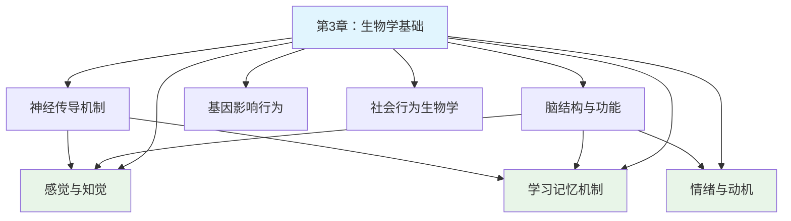

---

category:
  - 书籍拆解
  - - - 心理学与生活
status: draft
chapter:
number: 3
title: 行为的生物学基础
links:

  - "[[第2章-心理学的研究方法]]"
  - "[[第4章-感觉]]"
created: 2026-02-27
tags:
  - 心理学与生活
  - 生物心理学
  - 神经系统
  - 大脑结构
  - 遗传因素
  - 认知神经科学
  - 津巴多
---

# 第3章 行为的生物学基础

## 📍 章节定位

### 全书位置
> 本章承接前两章的心理学科学基础，转入生物学层面探讨行为产生机制，为整书的生物学基础章节，奠定了神经基础与行为关联的认识。这为后续学习、记忆、情绪等章节提供生理学支撑。

- **全书核心问题**: 如何用科学方法理解人类行为和心理过程？心理学研究如何在日常生活中应用？
- **本章回答的问题**: 人类行为的生物学基础是什么？神经系统的结构和功能如何影响行为？大脑的各部分如何分工协作？
- **角色类型**: 核心概念型
- **论证位置**: 为后续涉及神经科学内容的章节打下生物学基础

### 章节序列
| 方向 | 章节标题 | 逻辑连接 |
|------|----------|----------|
| 前章 | [[第2章-心理学的研究方法]] | 承接：掌握研究方法后，转向生理研究方法 |
| 后章 | [[第4章-感觉]] | 铺垫：了解神经系统结构 → 更好理解感觉过程 |

### 一句话定位
> 第3章系统介绍了人类行为的生物学基础——神经系统、大脑结构和功能、以及基因在行为中的作用，为后续理解感觉、知觉、学习、记忆、情绪等问题提供生理学基础。

---

## 🎯 核心观点

### 第一层：表层案例
> 章节中的具体案例、故事、数据

| 案例名称 | 简要描述 | 页码 | 关键引文 |
|----------|----------|------|----------|
| 诺贝尔奖研究: 大脑分区功能 | 研究证明大脑区域专门化 | p.70-75 | "大脑各个区域各有特殊功能" |
| 前额叶损伤病例 | 前额叶损伤导致人格改变 | p.78-80 | 菲尼亚斯·盖奇经典案例 |
| 神经传导实例 | 神经冲动的电化学传递 | p.85-88 | 静息电位到动作电位转化 |
| 双生子研究 | 遗传与环境对行为影响 | p.95-98 | 遗传因素在性格中的作用 |

### 第二层：中层机制
> 案例背后的运行机制、方法论

| 机制名称 | 组成要素 | 因果链条 | 证据来源 |
|----------|----------|----------|----------|
| 神经传导机制 | 静息电位、动作电位、突触传递 | 刺激→膜去极化→动作电位→神经递质释放→下一神经元激活 | 电生理学实验 |
| 脑功能分区 | 感觉区、运动区、联合区 | 皮质分区负责不同类型信息处理→影响行为表现 | 脑成像技术和病例研究 |
| 遗传-环境交互 | 基因型、表现型、环境 | 遗传倾向×环境影响→最终行为表现 | 双生子和家族研究 |

### 第三层：底层规律
> 可迁移的普遍规律

| 规律陈述 | 抽象层级 | 知识连接 | 适用范围 |
|----------|----------|----------|----------|
| 结构决定功能 | 生物学基本原理 | [[心流-契克森米哈赖]]神经活动模式 | 生物体功能分析 |
| 动态平衡原则 | 系统论/耗散结构论 | [[被讨厌的勇气-岸见一郎]]身心整合观 | 开放系统的稳定机制 |
| 基因-环境交互 | 发育心理学原理 | [[思考快与慢-丹尼尔·卡尼曼]]先天与后天结合 | 人类发展轨迹 |

---

## 💬 降维翻译

### 观点1: 神经系统是心理活动的物质载体

#### 原文表达
> 心理学的一个中心前提是心理与行为离不开脑的活动。我们的思想、情感、记忆和行为都是神经活动的结果。
> —— p.72

#### 降维翻译（中学生能懂）
我们的大脑就像一个超级计算机，而我们所有的想法、感觉、记忆、性格，都是大脑里的神经细胞通过电信号和化学物质相互交流而产生的。

这不同于以前一些哲学家说的，有一个独立于身体的"灵魂"在控制我们。现代神经科学研究证实，没有健康的脑就没有正常的心理活动。

#### 日常类比（奶奶能懂）
这就像一台电脑一样，没有硬件（脑子），你装再多软件（心理活动）也没用。当你脑子里某个地方出了问题，比如脑血栓、脑震荡，你的思维、记忆、情绪都会受到影响。

就像我们常说的"头受伤了，人就不对了"，这不是比喻，是真的！

#### 检验
- Q: 如果一个中学生问你什么叫心理活动的神经基础？
- A: 就是我们所有的想法、感受、记忆力、性格等等，都是由大脑里的神经细胞活动产生的。

### 观点2: 基因与环境共同塑造行为

#### 原文表达
> 人类基因组研究表明，我们所有的特征与行为都是基因与环境互动的产物。
> —— p.98

#### 降维翻译（中学生能懂）
虽然我们的基因给了我们的大脑和身体一些基础特征，比如说更容易产生恐惧感，或者更容易感受到快乐，但最终我们成为什么样的人，还要看我们生活在一个什么样的环境里，接受了什么样的教育，有过什么样的经历。

基因给出了可能性，环境决定了现实性。

#### 日常类比（奶奶能懂）
就像一个人可能天生聪明（基因），但如果没人教他读书认字（环境），他也可能不会写字算账。再比如，有些人家的孩子可能从小就容易兴奋，但如果你经常带他去做安静的游戏，他也能变得稳重些。

基因就像是一颗种子，环境就像是土壤、水分、阳光，缺一不可。

#### 检验
- Q: 如果一个中学生问你基因和环境哪个对性格更重要？
- A: 不是哪一个更重要，而是两者在互相影响，共同起作用。

---

## ✨ 金句库

### 原书金句
| 金句 | 页码 | 适用场景 |
|------|------|----------|
| "我们的思想、情感、记忆和行为都是神经活动的结果。" | p.72 | 阐述身心关系 |
| "大脑的结构与功能紧密相连。" | p.76 | 说明神经机制 |
| "遗传倾向需要环境条件才能表现出来。" | p.96 | 阐释基因-环境关系 |
| "神经元的连接方式决定行为表现。" | p.88 | 解释个体差异 |
| "人类大脑是我们已知宇宙中最复杂的结构。" | p.70 | 振奋学习热情 |

### 降维金句
| 金句 | 来源观点 | 适用场景 |
|------|----------|----------|
| 心理活动离不开大脑的生理基础。 | 神经承载性 | 科普身心关系 |
| 神经冲动是心理活动的生理机制。 | 神经传导 | 解释心理过程 |
| 遗传决定潜力，环境决定实现。 | 基因-环境交互 | 消除基因决定论 |
| 大脑各区分工合作完成心理功能。 | 脑分区功能 | 整合脑功能观 |
| 个体差异源于生物特性差异。 | 神经基础多样性 | 理解多样性 |

## 🔗 当下映射

### 💰 财富应用
| 场景 | 具体行动 | 预期效果 | 风险提示 |
|------|----------|----------|----------|
| 金融决策 | 了解压力对大脑决策区的影响 | 避免情绪化投资决策 | 可能过度生理化经济行为 |
| 健康投资 | 理解脑营养素的作用机制 | 科学选择大脑健康食品 | 需咨询医生，避免过量 |
| 个人提升 | 认识睡眠对大脑清理代谢的作用 | 合理规划作息时间 | 生理因素仅为部分影响 |

### 💼 职场应用
| 场景 | 具体行动 | 所需能力 | 适用职级 |
|------|----------|----------|----------|
| 工作时间合理安排 | 认知生物钟规律匹配工作任务 | 生物节律认知 | 所有岗位 |
| 压力管理改善决策 | 利用对前额叶功能的认识优化压力应对 | 压力管理能力 | 管理岗及决策岗 |
| 团队配置选择 | 根据认知风格（左脑右脑偏向）分配任务 | 观察能力，人岗匹配 | 中高层管理 |

### 🏠 生活应用
| 场景 | 具体行动 | 可行性 | 见效时间 |
|------|----------|--------|----------|
| 学习效率提升 | 理解记忆巩固机制优化学习节奏 | 高，需调整习惯 | 2周内可见效果 |
| 睡眠质量改善 | 顺应昼夜节律规律安排作息 | 高，循序渐进 | 1周内可改善 |
| 情绪调控技巧 | 认知重塑结合前额叶功能 | 中，需练习 | 持续1个月可见改善 |

### 72小时行动计划
1. [明天可以做的第一件事]：观察并记录自己一天中不同时段的精力/注意力水平变化
2. [本周内可以尝试的事]：了解大脑休息机制，合理规划学习与休息间隔
3. [需要准备资源才能做的事]：学习脑保健操，促进大脑血液循环

---

## 🕸️ 章节关联

### 向上关联 → 整书
- **贡献**: 为后续各章节（感觉、知觉、学习、记忆、情绪、动机等）提供神经生物学基础解释
- **位置**: 为全书奠定生物学基础的认知框架

### 横向关联 → 章节间
| 章节编号 | 章节标题 | 关联类型 | 连接描述 |
|----------|----------|----------|----------|
| 第2章 | 心理学的研究方法 | 铺垫 | 第3章应用神经科学的研究方法 |
| 第4章 | 感觉 | 铺垫 | 感觉过程基于神经系统功能 |
| 第5章 | 知觉 | 延伸 | 神经系统处理感觉信息的过程 |
| 第7章 | 学习的基本机制 | 依赖 | 学习的生物学机制（突触可塑性） |
| 第8章 | 记忆 | 依赖 | 记忆的神经生物学基础 |
| 第12章 | 动机 | 延伸 | 动机的神经环路基础 |
| 第13章 | 情绪 | 依赖 | 情绪的生物学机制 |

### 向下关联 → 具体应用
| 应用场景 | 难度 | 前置知识 |
|----------|------|----------|
| 脑健康保养 | 中 | 基础神经生物学知识 |
| 基因检测报告解读 | 高 | 遗传学和神经科学知识 |
| 神经反馈训练 | 高 | 专业设备和技术 |

### 跨书关联 → 知识网络
| 书籍 | 概念 | 关系 | 备注 |
|------|------|------|------|
| [[思考快与慢-丹尼尔·卡尼曼]] | 系统1/系统2的神经基础 | 交叉印证 | 卡尼曼理论在神经生物学层面得到验证 |
| [[脑与意识]] | 大脑整合信息机制 | 交叉补充 | 深入探讨大脑意识的神经基础 |
| [[被讨厌的勇气-岸见一郎]] | 身心整合理念 | 对比补充 | 哲学观照与神经科学研究的结合 |
| [[心理学]] | 神经系统的详细介绍 | 补充扩展 | 更深层的神经功能解读 |

### 关联可视化

---

## ❓ 问答设计

### Q1: [记忆型问题]
**认知层次**: 记忆  
**难度**: 低  
**题目**: 神经系统的基本单元是什么？  
**答案要点**:
- 神经元
- 神经胶质细胞

### Q2: [理解型问题]
**认知层次**: 理解  
**难度**: 中  
**题目**: 解释"静息电位"和"动作电位"的概念。  
**答案要点**:
- 静息电位：神经未兴奋状态下膜内外电荷差
- 动作电位：神经兴奋时膜电位的变化过程
- 神经传导的生理基础

### Q3: [应用型问题]
**认知层次**: 应用  
**难度**: 中  
**题目**: 如何应用生物学基础知识改善记忆力？  
**答案要点**:
- 了解海马体的记忆巩固功能
- 合理安排学习休息间隔
- 重视充足睡眠对记忆巩固的作用

### Q4: [分析型问题]
**认知层次**: 分析  
**难度**: 高  
**题目**: 分析不同脑功能区受损后的典型症状。  
**答案要点**:
- 额叶受损：人格改变、决策困难
- 颞叶受损：语言和记忆问题
- 顶叶受损：注意力和空间知觉问题

### Q5: [评估型问题]
**认知层次**: 评估  
**难度**: 高  
**题目**: 评估基因决定论与环境决定论的局限性。  
**答案要点**:
- 遗传决定论：忽视经验和环境因素
- 环境决定论：忽视先天个体差异
- 交互作用模式更符合实际

### Q6: [创造型问题]
**认知层次**: 创造  
**难度**: 高  
**题目**: 设计一个实验验证神经可塑性的可能性。  
**答案要点**:
- 一组学习新技能，对比组不学
- 脑成像技术前后检测
- 对比神经连接变化

### Q7: [理解型问题]
**认知层次**: 理解  
**难度**: 低  
**题目**: 为什么说"心理活动离不开生理基础"？  
**答案要点**:
- 神经活动是心理的基础
- 损伤会直接影响心理功能
- 药物可以改变心理状态

### Q8: [应用型问题]
**认知层次**: 应用  
**难度**: 中  
**题目**: 如何运用生物钟知识规划高效工作日程？  
**答案要点**:
- 认识昼夜节律
- 匹配认知任务与节律
- 重视休息恢复

### Q9: [分析型问题]
**认知层次**: 分析  
**难度**: 中  
**题目**: 分析突触可塑性对学习和记忆的意义。  
**答案要点**:
- 重复刺激强化连接
- 长时程增强机制
- 记忆形成的生理基础

### Q10: [评估型问题]
**认知层次**: 评估  
**难度**: 中  
**题目**: 比较中枢神经系统和周围神经系统的功能。  
**答案要点**:
- 中枢：信息处理加工
- 周围：信息传输通道
- 协同完成功能

### Q11: [创造型问题]
**认知层次**: 创造  
**难度**: 高  
**题目**: 为大脑健康维护设计一套生活干预方案。  
**答案要点**:
- 营养支持（omega-3等）
- 锻炼促进循环
- 睡眠恢复功能
- 认知训练保持活力

### Q12: [记忆型问题]
**认知层次**: 记忆  
**难度**: 低  
**题目**: 大脑半球的功能分工是怎样的？  
**答案要点**:
- 左脑：语言、逻辑
- 右脑：空间、图像、创意
- 交互处理各类信息

### Q13: [应用型问题]
**认知层次**: 应用  
**难度**: 中  
**题目**: 运用神经科学知识解释为什么充足的睡眠对学习很重要。  
**答案要点**:
- 短期记忆转化为长期记忆过程中大脑活动
- 睡眠期间记忆巩固和整合
- 缺乏睡眠影响注意力和学习能力

### Q14: [分析型问题]
**认知层次**: 分析  
**难度**: 高  
**题目**: 分析杏仁核在情绪处理过程中的角色。  
**答案要点**:
- 快速恐惧检测和反应
- 情绪记忆储存
- 与高级皮层的交互

### Q15: [创造型问题]
**认知层次**: 创造  
**难度**: 高  
**题目**: 针对老年人认知功能衰退设计预防方案。  
**答案要点**:
- 认知锻炼防止神经退化
- 体育活动促进循环
- 社交活动刺激神经连接

---
