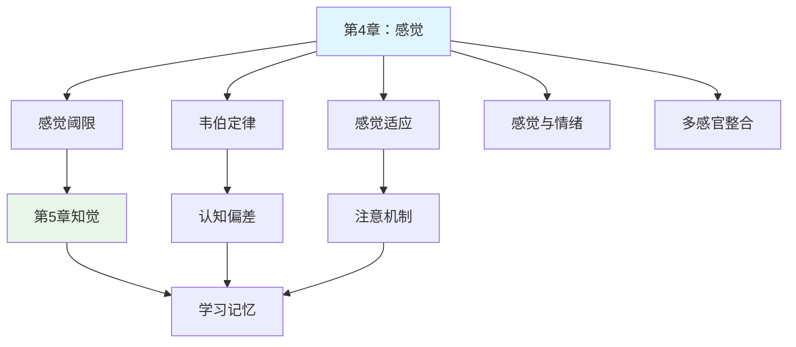

---

category:
  - 书籍拆解
  - - - 心理学与生活
status: draft
chapter:
number: 4
title: 感觉
links:

  - "[[第3章-行为的生物学基础]]"
  - "[[第5章-知觉]]"
created: 2026-02-27
tags:
  - 心理学与生活
  - 感觉过程
  - 感觉阈限
  - 感觉适应
  - 生理心理学
  - 津巴多
  - 认知科学
---

# 第4章 感觉

## 📍 章节定位

### 全书位置
> 本章承接第三章的生理基础，正式踏入心理过程研究领域，探讨感觉——心理活动的第一个环节，为第五章"知觉"铺垫基础，同时也为后续的情感、认知过程奠定感官输入的生理机制。

- **全书核心问题**: 如何用科学方法理解人类行为和心理过程？心理学研究如何在日常生活中应用？
- **本章回答的问题**: 感觉是如何产生的？我们的各种感官系统如何工作？感觉的生理机制和物理机制是什么？
- **角色类型**: 核心概念型
- **论证位置**: 心理过程的起始点，连接物理世界与心理世界

### 章节序列
| 方向 | 章节标题 | 逻辑连接 |
|------|----------|----------|
| 前章 | [[第3章-行为的生物学基础]] | 承接：已知神经系统基础 → 开始探讨感觉过程 |
| 后章 | [[第5章-知觉]] | 铺垫：感觉是知觉的基础，知觉进一步加工感觉信息 |

### 一句话定位
> 第4章深入探讨感觉的生理机制，系统介绍视觉、听觉、触觉、味觉、嗅觉等各种感觉系统的结构和功能，为从外部世界获取信息到心理世界的转化奠定基础。

---

## 🎯 核心观点

### 第一层：表层案例
> 章节中的具体案例、故事、数据

| 案例名称 | 简要描述 | 页码 | 关键引文 |
|----------|----------|------|----------|
| 韦伯定律实验 | 重量差别阈限演示 | p.115-118 | "我们感知的是差异而非绝对值" |
| 感觉适应现象 | 空气异味适应实例 | p.125-128 | 适应让我们忽略常态刺激 |
| 视觉盲点实验 | 证明存在生理盲点 | p.130-132 | 大脑填补缺失部分 |
| 色觉缺陷 | 红绿色盲的遗传基础 | p.135-138 | 感觉差异源于生理结构 |

### 第二层：中层机制
> 案例背后的运行机制、方法论

| 机制名称 | 组成要素 | 因果链条 | 证据来源 |
|----------|----------|----------|----------|
| 感觉阈限 | 绝对阈限与差别阈限 | 物理刺激强度 → 感觉神经激活 → 主观感觉 | 心理物理学实验 |
| 感觉适应 | 持续刺激 → 神经敏感性下降 → 阈限提高 | 感觉神经疲劳/调节 → 达成适应状态 | 感觉生理实验 |
| 感觉编码 | 神经激活频率 → 编码刺激强度 | 刺激强度 → 感觉编码 → 大脑解码 | 神经生理学研究 |

### 第三层：底层规律
> 可迁移的普遍规律

| 规律陈述 | 抽象层级 | 知识连接 | 适用范围 |
|----------|----------|----------|----------|
| 人类只能感知一定范围的物理刺激 | 知觉有限性/感知带宽理论 | [[心流-契克森米哈赖]]感知阈值匹配技能 | 认知工具设计基础 |
| 差别感知比绝对感知更重要 | 适应性/进化的认知优势 | [[思考快与慢-丹尼尔·卡尼曼]]相对判断偏向 | 经济决策/市场行为 |
| 感觉系统的能量守恒原则 | 生理经济学原理 | [[被讨厌的勇气-岸见一郎]]有限心理能量 | 认知资源管理 |

---

## 💬 降维翻译

### 观点1: 韦伯定律揭示感知的关键机制

#### 原文表达
> 韦伯定律表明，差别阈限取决于两个刺激强度的比率而非绝对差值，这一原理称为韦伯分数，说明我们感知的是变化而非静态状态。
> —— p.116

#### 降维翻译（中学生能懂）
我们的感官不是像尺子一样测量事物的绝对大小的，而是测量变化的。比如你手上拿着一个200克的东西，这时候再加10克你就很可能感觉得到；但是如果你手上有2000克东西，同样再加10克你可能就感觉得不太到了。

你需要加更多的分量（比如100克）才能感觉得出区别。这说明我们更敏感于相对变化，而非绝对数值。

#### 日常类比（奶奶能懂）
就像你的钱包，当你只有100块钱的时候，花掉50块钱你会感觉很心疼；但当你有了10000块钱的时候，花掉1000块可能感觉也不算太多。我们感知变化的比例远比感知绝对金额更敏感。

或者你住在农村，很少的噪音就会影响你睡觉；但搬到市中心后，习惯了嘈杂的声音，反而需要更大的声响才会被吵醒。

#### 检验
- Q: 如果一个中学生问你什么叫韦伯定律？
- A: 就是说我们不关心事物有多"绝对"有多"大",而是关心它有多"相对"有多"不同",我们更善于感知"变化"而不是"现状"。

### 观点2: 感觉适应是适应环境的必要机制

#### 原文表达
> 感觉适应是在持续刺激下感觉感受性发生变化的现象。适应使我们忽略环境中恒定部分，而专注于变化性信息，这对于生存具有重要意义。
> —— p.126

#### 降维翻译（中学生能懂）
我们的感官有一种重要的自我调节能力: 如果某种刺激长时间存在,我们对它的敏感性就会降低。这样做是有意义的,因为如果大脑一直处理相同的刺激信息,就无法关注环境中的重要变化。

想象一下,如果你一直能闻到衣服上的洗衣粉味道,那你就永远无法注意到家中燃气泄漏的危险气味。

#### 日常类比（奶奶能懂）
就像你在家里刚打开香水瓶的时候香味很浓,过一会儿就几乎闻不到了,这就是感觉适应。还有你从亮的地方进到屋里,刚开始觉得特别暗,眼睛需要适应一下。

这就好比你的感官是个"消息过滤器",那些老不变的东西,它就不提醒你关注了,让你能专心看重要信息。

#### 检验
- Q: 如果一个中学生问你为什么要适应熟悉的刺激?
- A: 因为我们不能把所有信息都记住,需要过滤掉稳定的,关注重要的,这是为了更好地生存。

---

## ✨ 金句库

### 原书金句
| 金句 | 页码 | 适用场景 |
|------|------|----------|
| "我们感知的是变化而非静态的环境。" | p.115 | 强调适应机制 |
| "感觉是我们心理历程的入口。" | p.110 | 阐述感觉重要性 |
| "感觉阈限决定了我们能感知的世界范围。" | p.120 | 解释感觉边界 |
| "感觉适应使我们能够聚焦变化的信息。" | p.125 | 强调适应意义 |
| "不同物种进化出适应其生存的不同感觉能力。" | p.140 | 比较物种差异 |

### 降维金句
| 金句 | 来源观点 | 适用场景 |
|------|----------|----------|
| 感觉是我们与世界连接的门户。 | 感觉基础作用 | 认知科学入门 |
| 我们更善于感知差异而非绝对值。 | 韦伯定律 | 日常用理解释 |
| 大脑过滤熟悉信息以专注变化点。 | 感觉适应 | 注意力管理 |
| 感知范围存在生物学上限。 | 感觉阈限 | 能力局限认知 |
| 感觉系统经过进化高度优化。 | 感官适应性 | 人类适应能力 |

## 🔗 当下映射

### 💰 财富应用
| 场景 | 具体行动 | 预期效果 | 风险提示 |
|------|----------|----------|----------|
| 价格策略 | 利用感觉适应，调整优惠策略 | 促销效果最大化 | 过度使用导致顾客麻木 |
| 环境营造 | 定期更换办公环境刺激感觉适应 | 增强创新氛围 | 频繁变动影响稳定感 |
| 品牌营销 | 创新产品体验避免感觉适应 | 增添新鲜感，提升吸引力 | 成本投入较大 |

### 💼 职场应用
| 场景 | 具体行动 | 所需能力 | 适用职级 |
|------|----------|----------|----------|
| 工作效率优化 | 利用感觉适应规律安排单调工作 | 韦伯定律应用 | 所有岗位 |
| 新手引导 | 合理安排环境变化避免感觉冲击 | 环境管理能力 | 主管级别 |
| 注意力管理 | 了解注意力维持周期规划任务分布 | 自我管理能力 | 所有岗位 |

### 🏠 生活应用
| 场景 | 具体行动 | 可行性 | 见效时间 |
|------|----------|--------|----------|
| 生活品质改善 | 增加生活变化元素避免适应性麻木 | 高，需有意识操作 | 1-2周见效 |
| 情感关系维护 | 通过新鲜体验延缓感觉适应 | 高，需伴侣配合 | 1个月内可见变化 |
| 学习效率提升 | 理解感觉适应优化阅读和学习节奏 | 高，易实践 | 1周内可感差异 |

### 72小时行动计划
1. [明天可以做的第一件事]：记录今天对环境中几种刺激的感觉敏锐度（音量、光照、气味等），并预计明天的感受会有何变化
2. [本周内可以尝试的事]：尝试改变一个已熟悉的环境或习惯，观察自己的感觉适应过程
3. [需要准备资源才能做的事]：学习并实践几种可以调节感官敏锐度的训练技巧

---

## 🕸️ 章节关联

### 向上关联 → 整书
- **贡献**: 为全书的感觉知觉部分奠定基础，从最基础的感觉生理机制入手
- **位置**: 连接生物基础与心理过程的桥梁

### 横向关联 → 章节间
| 章节编号 | 章节标题 | 关联类型 | 连接描述 |
|----------|----------|----------|----------|
| 第3章 | 行为的生物学基础 | 承接 | 感觉机制建立在神经系统结构上 |
| 第5章 | 知觉 | 延伸 | 感觉信息在知觉中被组织和解释 |
| 第6章 | 意识状态 | 依赖 | 意识程度影响感觉阈限 |
| 第13章 | 情绪 | 应用 | 情绪会影响感觉敏感度 |
| 第12章 | 动机 | 交互 | 动机状态影响感觉注意分配 |

### 向下关联 → 具体应用
| 应用场景 | 难度 | 前置知识 |
|----------|------|----------|
| 感官训练优化 | 中 | 认知基础 |
| 环境适应技巧 | 高 | 感觉生理原理 |
| 注意力管理方法 | 中 | 感觉过程认知 |

### 跨书关联 → 知识网络
| 书籍 | 概念 | 关系 | 备注 |
|------|------|------|------|
| [[思考快与慢-丹尼尔·卡尼曼]] | 感官引发的系统1响应 | 交集扩展 | 感觉启动快速认知过程 |
| [[被讨厌的勇气-岸见一郎]] | 身心一致性原理 | 互补 | 感觉作为身心统一的接口 |
| [[心流-契克森米哈赖]] | 专注时注意资源管理 | 机制补充 | 感觉输入与注意资源的关系 |
| [[心理学]] | 详细神经传导机制 | 扩充 | 深入探讨感官转换机制 |

### 关联可视化

---

## ❓ 问答设计

### Q1: [记忆型问题]
**认知层次**: 记忆  
**难度**: 低  
**题目**: 什么是感觉的绝对阈限？  
**答案要点**:
- 刚好能引起感觉的最小刺激量
- 不是指零刺激，而是有50%概率产生感觉的刺激强度
- 不同感觉的绝对阈限不同

### Q2: [理解型问题]
**认知层次**: 理解  
**难度**: 中  
**题目**: 解释韦伯定律的核心含义。  
**答案要点**:
- 差别阈限与标准刺激成比例
- 感知的是相对变化而非绝对大小
- 存在恒定的韦伯分数比例

### Q3: [应用型问题]
**认知层次**: 应用  
**难度**: 中  
**题目**: 如何应用感觉适应原理改善工作效率？  
**答案要点**:
- 适当变换工作环境避免适应性疲劳
- 定期轮换单调任务以保持注意力
- 创建适度的环境变化促进感觉兴奋

### Q4: [分析型问题]
**认知层次**: 分析  
**难度**: 高  
**题目**: 分析感觉适应机制的进化意义。  
**答案要点**:
- 节省神经能量，专注重要信息
- 避免感觉系统的过载
- 提升对危险变化的觉察力

### Q5: [评估型问题]
**认知层次**: 评估  
**难度**: 高  
**题目**: 评估感觉阈限在人际关系交往中的影响。  
**答案要点**:
- 个人气质差异的生理基础
- 感触敏感度影响亲密关系
- 环境耐受差异影响兼容性

### Q6: [创造型问题]
**认知层次**: 创造  
**难度**: 高  
**题目**: 设计一个实验检测声音频率差别阈限。  
**答案要点**:
- 设置基准频率声音
- 梯度改变频率进行对比
- 统计被试者分辨能力

### Q7: [理解型问题]
**认知层次**: 理解  
**难度**: 低  
**题目**: 为什么在完全漆黑的房间里久了会觉得看到光影？  
**答案要点**:
- 感觉道缺乏刺激导致自发活动
- 信号检测理论中的噪声概念
- 感觉门限变化导致假信号

### Q8: [应用型问题]
**认知层次**: 应用  
**难度**: 中  
**题目**: 如何运用感觉阈限知识优化睡眠环境？  
**答案要点**:
- 减少光刺激（黑色窗帘）
- 控制噪音阈限
- 调节温度适应性

### Q9: [分析型问题]
**认知层次**: 分析  
**难度**: 中  
**题目**: 分析为什么人们对价格变化更敏感于价格水平。  
**答案要点**:
- 经济行为符合韦伯定律
- 相对变化比绝对数值更容易比较和计算
- 进化上对变化的关注优先

### Q10: [评估型问题]
**认知层次**: 评估  
**难度**: 中  
**题目**: 比较差别阈限和绝对阈限在营销中的应用。  
**答案要点**:
- 绝对阈限决定能否察觉新产品
- 差别阈限决定差异化策略的效果
- 两者的营销策略应用差异

### Q11: [创造型问题]
**认知层次**: 创造  
**难度**: 高  
**题目**: 为感觉损伤患者设计辅助装置。  
**答案要点**:
- 跨模态感知转化
- 增强剩余感官能力
- 优化替代感官输入

### Q12: [记忆型问题]
**认知层次**: 记忆  
**难度**: 低  
**题目**: 感觉的五大类型是什么？  
**答案要点**:
- 视觉
- 听觉
- 触觉
- 味觉
- 嗅觉

### Q13: [应用型问题]
**认知层次**: 应用  
**难度**: 中  
**题目**: 运用韦伯定律设计逐步改善学习环境的策略。  
**答案要点**:
- 从小的改善开始（降低噪音分贝）
- 阶段渐进性改良（照明度调节）
- 避免一步到位的浪费

### Q14: [分析型问题]
**认知层次**: 分析  
**难度**: 高  
**题目**: 分析长期处于相同环境如何影响感觉阈限。  
**答案要点**:
- 阈限会逐渐升高（适应）
- 对原有刺激敏感性下降
- 对新刺激更敏感

### Q15: [创造型问题]
**认知层次**: 创造  
**难度**: 高  
**题目**: 如何训练提高感觉敏锐度？  
**答案要点**:
- 微量刺激强化训练
- 交叉感官补偿训练
- 注意力集中感知锻炼

---
