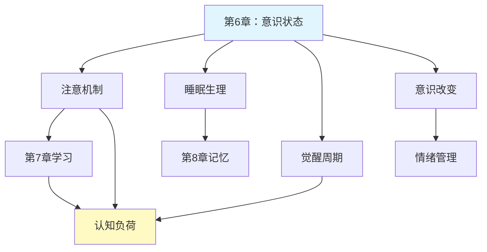

---

category:
  - 书籍拆解
  - - - 心理学与生活
status: draft
chapter:
number: 6
title: 意识状态
links:

  - "[[第5章-知觉]]"
  - "[[第7章-学习的基本机制]]"
created: 2026-02-27
tags:
  - 心理学与生活
  - 意识状态
  - 睡眠梦境
  - 注意力
  - 意识改变
  - 认知科学
  - 心理生理学
  - 津巴多
description: "本章探讨意识的本质及其不同状态，在认知加工的宏观背景下探讨注意力机制、睡眠与觉醒周期，以及意识改变状态，既承上启下地将生物基础与心理过程联结，也为后续学习记忆机制打下基础，体现津巴多重视生物-心理-社会整合的特色。"
---

# 第6章 意识状态

## 📍 章节定位

### 全书位置
> 本章探讨意识的本质及其不同状态，在认知加工的宏观背景下探讨注意力机制、睡眠与觉醒周期，以及意识改变状态，既承上启下地将生物基础与心理过程联结，也为后续学习记忆机制打下基础，体现津巴多重视生物-心理-社会整合的特色。

- **全书核心问题**: 如何用科学方法理解人类行为和心理过程？心理学研究如何在日常生活中应用？
- **本章回答的问题**: 什么是意识？意识的不同状态如何影响认知功能？睡眠与觉醒的神经机制是什么？催眠与药物引起的意识改变有何特点？
- **角色类型**: 核心概念型
- **论证位置**: 连接生理机制(第3章)与认知过程(第5章)的桥梁章节

### 章节序列
| 方向 | 章节标题 | 逻辑连接 |
|------|----------|----------|
| 前章 | [[第5章-知觉]] | 承接：知觉过程在意识层面的发生 |
| 后章 | [[第7章-学习的基本机制]] | 铺垫：意识状态影响学习机制的发挥 |

### 一句话定位
> 第6章深入探讨人类意识的不同状态及其对认知功能的影响，揭示睡眠觉醒周期的生理基础和意识改变状态，为理解学习、记忆、认知功能提供生理-心理整合的框架。

---

## 🎯 核心观点

### 第一层：表层案例
> 章节中的具体案例、故事、数据

| 案例名称 | 简要描述 | 页码 | 关键引文 |
|----------|----------|------|----------|
| 睡眠剥夺实验 | 研究严重缺乏睡眠对认知功能的影响 | p.180-182 | "严重睡眠剥夺会导致严重的认知障碍" |
| 催眠实验 | 催眠状态下的感知和行为改变 | p.195-198 | "催眠中个体对建议高度响应" |
| 注意分配任务 | 研究有限认知资源的分配机制 | p.175-178 | "注意窗口有限是普遍认知特征" |
| 昼夜节律紊乱 | 轮班工人的生物钟与工作效率 | p.185-187 | "生物钟紊乱影响多项认知能力" |

### 第二层：中层机制
> 案例背后的运行机制、方法论

| 机制名称 | 组成要素 | 因果链条 | 证据来源 |
|----------|----------|----------|----------|
| 注意选择机制 | 注意焦点、过滤器、资源分配 | 感觉输入→过滤选择→认知加工→行为输出 | 选择性注意实验 |
| 睡眠周期调控 | REM/NREM相、脑波模式、神经递质 | 生物钟→神经调控→睡眠结构→记忆整合 | 睡眠生理研究 |
| 意识改变机制 | 神经递质调节、大脑区域活性变化 | 外因介入→神经化学改变→意识变化→认知改变 | 药理与神经影像研究 |

### 第三层：底层规律
> 可迁移的普遍规律

| 规律陈述 | 抽象层级 | 知识连接 | 适用范围 |
|----------|----------|----------|----------|
| 认知资源有限分配原则 | 心理物理学/资源理论 | [[心流-契克森米哈赖]]注意力管理 | 学习工作效率 |
| 生物节律影响认知功能 | 生理心理学/昼夜节律 | [[被讨厌的勇气-岸见一郎]]生活节奏与心理健康 | 健康生活习惯 |
| 意识状态可变可调节 | 意识科学/自我调节 | [[思考快与慢-丹尼尔·卡尼曼]]认知资源分配 | 认知表现优化 |

---

## 💬 降维翻译

### 观点1: 注意是有限的聚光灯而非无限的探照灯

#### 原文表达
> 注意是我们对环境中特定刺激或刺激的特定方面的意识指向与集中的过程。注意的容量有限，这意味着我们不能同时关注所有事物。
> —— p.175

#### 降维翻译（中学生能懂）
想象一下，我们的注意力就像一个手电筒，只能照亮一处地方。当我们把注意力集中在某一件事上的时候，自然就会忽略其他的事情。我们的大脑没有能力同时处理所有进入感官的信息，所以必须有选择地关注一些信息，忽略另一些信息。

就像司机开车时不能一边认真看路，一边同时认真回微信；又像学生听课时如果分心想到放学后的游戏，听讲的质量就会下降。

#### 日常类比（奶奶能懂）
就像我们的眼睛一样，虽然能看到一大片东西，但能看得最清楚的只是你正在看的那个小点。如果你仔细看着远处的山峰，身边的花草就会模糊；如果你仔细盯着一朵花，远处的树就会不清楚。

我们的大脑也是这样分配的，不能一下子看清所有东西，所以它会选择性地"照亮"某一件事，其它的事就变得模糊。这就是为什么吃饭时看电视，往往会不太能尝出饭菜的味道。

#### 检验
- Q: 如果一个中学生问你什么叫注意力有限性？
- A: 就是我们的大脑不能同时做很多事情，必须专注于某件事，其他事情就照顾不了了。

### 观点2: 睡眠不只是休息而是重要信息整理工厂

#### 原文表达
> 睡眠在大脑的自我清洁和记忆巩固过程中发挥着关键作用。特别是REM睡眠阶段，与情绪处理和记忆整合密切相关。
> —— p.190

#### 降维翻译（中学生能懂）
睡眠并不是浪费时间的"关机状态"，而是大脑非常忙碌地处理白天收到的大量信息。在睡眠中，大脑会：
- 整理和归纳白天学到的知识
- 清除大脑中的代谢废物
- 加工白天的情绪体验
- 为第二天的精神状态做准备

就像一间工厂在夜里整理白天生产的产品，清理垃圾，准备生产原料，好让明天的工作能够顺利进行。

#### 日常类比（奶奶能懂）
就像我们晚上要洗碗、收拾房间、整理衣物，为第二天做准备一样，我们的大脑也需要在夜晚进行整理工作。白天接触了很多事，大脑里积累了"废纸""垃圾"，需要趁睡着的时候全部清理干净，重要的东西好好收藏起来，没用的东西扔掉。

不按时睡觉，大脑没法"打扫卫生"，第二天自然就糊里糊涂、健忘发闷。

#### 检验
- Q: 如果一个中学生问你为什么要充足睡眠？
- A: 因为大脑需要在睡眠时整理知识、清理废物，为第二天做好准备。

---

## ✨ 金句库

### 原书金句
| 金句 | 页码 | 适用场景 |
|------|------|----------|
| "意识是对外部和内部事件的认识和觉知。" | p.170 | 解释意识概念 |
| "注意是有选择地对外部世界的某些方面进行认知加工。" | p.175 | 阐述注意机制 |
| "睡眠是大脑的自我修复和记忆重组过程。" | p.188 | 强调睡眠意义 |
| "催眠状态下个体对暗示高度响应。" | p.196 | 理解催眠特性 |
| "我们的意识状态影响认知能力和自我感知。" | p.200 | 展示意识功能 |

### 降维金句
| 金句 | 来源观点 | 适用场景 |
|------|----------|----------|
| 注意是一个定向手电筒而非照射全场大灯。 | 注意有限性 | 解释分心原因 |
| 睡眠是大脑内部的信息整理和清洁工程。 | 睡眠功能 | 强调睡眠价值 |
| 意识状态决定认知资源的使用效率。 | 意识影响认知 | 指导效率提升 |
| 生物钟是我们认知能力的调节器。 | 昼夜节律 | 生活节奏规划 |
| 我们不能同时高度关注多个事物。 | 多任务局限 | 多任务警示 |

## 🔗 当下映射

### 💰 财富应用
| 场景 | 具体行动 | 预期效果 | 风险提示 |
|------|----------|----------|----------|
| 高效工作时段安排 | 根据生物钟规律规划创造性工作 | 提升工作效率和产出 | 过分依赖模式而忽视突发任务 |
| 午休时间投资 | 用20分钟短暂休息恢复认知资源 | 避免下午认知疲劳 | 时间控制不够精准造成睡眠惯性 |
| 数字极简实践 | 减少多任务行为节约注意预算 | 增加单位时间工作的价值密度 | 初始阶段注意力易分散 |

### 💼 职场应用
| 场景 | 具体行动 | 所需能力 | 适用职级 |
|------|----------|----------|----------|
| 周会效率提升 | 利用注意力分配原理优化议程设计 | 认知科学应用 | 中高层管理者 |
| 睡眠与决策力关联 | 了解睡眠对判断准确性的影响 | 生物节律认知 | 决策制定者 |
| 集中会议安排 | 批量处理同类型认知任务 | 自我管理能力 | 所有岗位 |

### 🏠 生活应用
| 场景 | 具体行动 | 可行性 | 见效时间 |
|------|----------|--------|----------|
| 养成良好睡眠习惯 | 遵循日夜节律进行作息安排 | 高，但需坚持 | 2-3周可见精神状态改善 |
| 家务与娱乐专注分割 | 多任务转化为任务排序执行 | 高，易实践 | 1周内可见执行质量提升 |
| 学习效率提升 | 应用注意机制优化学习策略 | 中，需调整习惯 | 1周内可感知学习质量改变 |

### 72小时行动计划
1. [明天可以做的第一件事]：观察自己的注意力集中和疲劳的时间模式，记录在表格中分析规律
2. [本周内可以尝试的事]：调整晚睡前1小时不用电子设备，观察对睡眠质量的影响
3. [需要准备资源才能做的事]：学习番茄工作法，结合意识状态管理提升工作效率

---

## 🕸️ 章节关联

### 向上关联 → 整书
- **贡献**: 为全书的生物-认知过程序列奠定基础，连接生理机制与心理过程
- **位置**: 生理与认知的整合层面

### 横向关联 → 章节间
| 章节编号 | 章节标题 | 关联类型 | 连接描述 |
|----------|----------|----------|----------|
| 第5章 | 知觉 | 承接 | 注意力影响知觉选择加工 |
| 第7章 | 学习的基本机制 | 铺垫 | 意识状态影响学习效率和记忆巩固 |
| 第8章 | 记忆 | 双向 | 睡眠促进记忆巩固；记忆也影响意识状态 |
| 第9章 | 认知过程 | 影响 | 意识状态决定认知资源可用性 |

### 向下关联 → 具体应用
| 应用场景 | 难度 | 前置知识 |
|----------|------|----------|
| 睡眠健康优化 | 中 | 生物钟基础认识 |
| 注意力训练 | 高 | 自我觉察能力和监控 |
| 意识状态管理 | 高 | 日常生活实践 |

### 跨书关联 → 知识网络
| 书籍 | 概念 | 关系 | 备注 |
|------|------|------|------|
| [[思考快与慢-丹尼尔·卡尼曼]] | 注意资源有限性 | 交叉应用 | 注意力机制影响系统1和系统2调用 |
| [[被讨厌的勇气-岸见一郎]] | 生活节奏与心理状态 | 互补发展 | 津巴多提供生理基础，阿德勒提供建构视角 |
| [[心流-契克森米哈赖]] | 注意力专注机制 | 机制补充 | 睡眠和注意机制作为流体验的基础条件 |
| 深度工作 | 注意力管理策略 | 实践扩展 | 深入探讨如何在数字化时代专注 |

### 关联可视化

---

## ❓ 问答设计

### Q1: [记忆型问题]
**认知层次**: 记忆  
**难度**: 低  
**题目**: 意识状态包含哪些类型？  
**答案要点**:
- 觉醒状态
- 注意状态
- 睡眠状态
- 意识改变状态（催眠、药物等）

### Q2: [理解型问题]
**认知层次**: 理解  
**难度**: 中  
**题目**: 解释睡眠对于学习和记忆为什么至关重要。  
**答案要点**:
- 记忆巩固过程需要睡眠执行
- 睡眠中大脑清理代谢废物
- REM睡眠与情绪加工密切相关
- 睡眠不足严重影响注意力和认知灵活性

### Q3: [应用型问题]
**认知层次**: 应用  
**难度**: 中  
**题目**: 如何应用意识状态知识管理一天的工作计划？  
**答案要点**:
- 在生物钟高峰期安排高认知需求任务
- 避免在注意力下降期处理重要决策
- 增加睡眠时间支持学习新技能

### Q4: [分析型问题]
**认知层次**: 分析  
**难度**: 高  
**题目**: 分析注意的选择性与容量限制的关系。  
**答案要点**:
- 有限容量需要选择性加工
- 选择机制决定哪些信息进入意识
- 容量限制是生理基础

### Q5: [评估型问题]
**认知层次**: 评估  
**难度**: 高  
**题目**: 评估现代数字环境对个体意识管理和注意维持的影响。  
**答案要点**:
- 多任务环境增加注意切换成本
- 通知打扰中断注意力流
- 屏幕使用影响睡眠质量

### Q6: [创造型问题]
**认知层次**: 创造  
**难度**: 高  
**题目**: 设计一个基于生物钟优化的认知训练方案。  
**答案要点**:
- 根据个体差异确定最佳训练时间
- 结合睡眠周期合理安排休息
- 监测生理指标优化训练进程

### Q7: [理解型问题]
**认知层次**: 理解  
**难度**: 低  
**题目**: 为什么说"注意是聚光灯不是泛光灯"？  
**答案要点**:
- 注意有指向性和集中性
- 容量有限不能同时加工所有信息
- 需要选择焦点进行深度加工

### Q8: [应用型问题]
**认知层次**: 应用  
**难度**: 中  
**题目**: 利用REM睡眠知识安排学习和复习计划。  
**答案要点**:
- 睡前1-2小时避免高强度学习
- 保障足够睡眠时间特别是REM阶段
- 利用睡眠的巩固功能强化知识

### Q9: [分析型问题]
**认知层次**: 分析  
**难度**: 中  
**题目**: 分析生物钟紊乱对认知表现的具体影响。  
**答案要点**:
- 注意力不稳定，易分心
- 执行功能减弱
- 情绪调节能力下降
- 记忆编码能力受影响

### Q10: [评估型问题]
**认知层次**: 评估  
**难度**: 中  
**题目**: 比较自然睡眠与药物辅助睡眠的利弊。  
**答案要点**:
- 自然睡眠保持正常睡眠结构
- 药物可能影响REM阶段
- 药物依赖风险
- 长期效果差异

### Q11: [创造型问题]
**认知层次**: 创造  
**难度**: 高  
**题目**: 为不同职业（如护士、程序员）设计作息优化方案。  
**答案要点**:
- 根据工作模式安排最佳任务时间
- 设计轮班工人适应策略
- 结合生物钟调整工作习惯

### Q12: [记忆型问题]
**认知层次**: 记忆  
**难度**: 低  
**题目**: 睡眠周期包括哪几种阶段？  
**答案要点**:
- NREM阶段（非快速眼动睡眠）
- REM阶段（快速眼动睡眠）
- 每一阶段有不同的脑电活动特征

### Q13: [应用型问题]
**认知层次**: 应用  
**难度**: 中  
**题目**: 运用注意机制原理分析短视频对认知能力的影响。  
**答案要点**:
- 高刺激打断注意持续性
- 频繁切换消耗注意资源
- 塑造浅层关注习惯

### Q14: [分析型问题]
**认知层次**: 分析  
**难度**: 高  
**题目**: 分析催眠状态下意识的特点及其科学解释。  
**答案要点**:
- 注意选择性增强特定建议
- 批判思维减弱
- 专注和想象能力增强

### Q15: [创造型问题]
**认知层次**: 创造  
**难度**: 高  
**题目**: 如何设计一个意识状态监测与优化管理系统？  
**答案要点**:
- 生理指标采集与分析
- 行为表现监测
- 个性化建议与干预
- 效果反馈闭环

---

## 🔗 新增关联
- [2026-02-27] [[第7章-学习的基本机制]] 与本章建立关联：意识状态影响学习效率和条件反射建立
