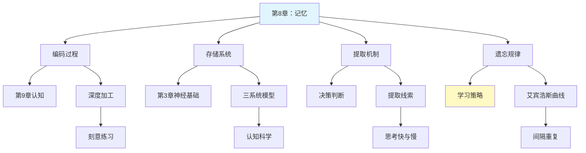

---

category:
  - 书籍拆解
  - - - 心理学与生活
status: draft
chapter:
number: 8
title: 记忆
links:

  - "[[第7章-学习的基本机制]]"
  - "[[第9章-认知过程]]"
created: 2026-02-27
tags:
  - 心理学与生活
  - 记忆机制
  - 遗忘曲线
  - 记忆重构
  - 艾宾浩斯
  - 编码存储提取
  - 认知心理学
  - 津巴多
---

# 第8章 记忆

## 📍 章节定位

### 全书位置
> 本章深入探讨人类记忆的工作机制，从信息加工视角解析编码、存储、提取三个核心过程，揭示艾宾浩斯遗忘曲线的规律，并挑战"记忆是录像机"的迷思，展示记忆作为主动重构过程的本质，为理解学习效率、知识管理和证词可靠性提供科学基础。

- **全书核心问题**: 如何用科学方法理解人类行为和心理过程？心理学研究如何在日常生活中应用？
- **本章回答的问题**: 记忆是如何工作的？为什么我们会遗忘？记忆可靠吗？如何提高记忆效率？
- **角色类型**: 核心概念型
- **论证位置**: 承接学习机制，为认知过程和知识应用奠定基础

### 章节序列
| 方向 | 章节标题 | 逻辑连接 |
|------|----------|----------|
| 前章 | [[第7章-学习的基本机制]] | 承接：学习产生记忆，记忆巩固学习成果 |
| 后章 | [[第9章-认知过程]] | 铺垫：记忆为思维、语言、问题解决提供素材 |

### 一句话定位
> 第8章揭示记忆不是忠实的录像机，而是主动的信息加工系统，通过编码、存储、提取三阶段运作，遵循艾宾浩斯遗忘曲线规律，且具有重构性和可塑性。

---

## 🎯 核心观点

### 第一层：表层案例
> 章节中的具体案例、故事、数据

| 案例名称 | 简要描述 | 页码 | 关键引文 |
|----------|----------|------|----------|
| 艾宾浩斯遗忘曲线实验 | 用无意义音节研究遗忘规律 | p.210-215 | "遗忘在学习之后立即开始，最初遗忘速度很快，以后逐渐缓慢" |
| 系列位置效应实验 | 首因效应和近因效应 | p.218-220 | "回忆序列时，开头和结尾的项目更容易被记住" |
| 虚假记忆实验 | Loftus误导信息效应 | p.240-245 | "记忆可以被事后信息所改变和重构" |
| HM病例研究 | 海马体损伤导致顺行性遗忘 | p.250-255 | "海马体对新记忆的形成至关重要" |
| 闪光灯记忆 | 重大事件的生动记忆 | p.245-248 | "情绪强烈的事件产生特别生动的记忆，但不一定更准确" |

### 第二层：中层机制
> 案例背后的运行机制、方法论

| 机制名称 | 组成要素 | 因果链条 | 证据来源 |
|----------|----------|----------|----------|
| 记忆三系统 | 感觉记忆、短时记忆、长时记忆 | 信息输入→感觉登记→注意选择→短时保持→编码存储→长时保存→提取使用 | 信息加工模型实验 |
| 遗忘机制 | 衰退、干扰、提取失败 | 记忆痕迹随时间衰退 / 新旧信息相互干扰 / 线索不足导致提取失败 | 干扰理论、提取失败理论 |
| 记忆重构 | 图式、提取线索、事后信息 | 原始经验→图式编码→存储变化→提取时重构→可能失真 | 虚假记忆实验 |
| 巩固机制 | 海马体、突触增强、睡眠 | 学习激活→海马体参与→突触可塑性变化→睡眠中巩固→长期存储 | 神经科学研究 |

### 第三层：底层规律
> 可迁移的普遍规律

| 规律陈述 | 抽象层级 | 知识连接 | 适用范围 |
|----------|----------|----------|----------|
| 遗忘先快后慢规律（艾宾浩斯定律） | 记忆心理学/信息衰减 | [[思考快与慢-丹尼尔·卡尼曼]]可得性启发 | 学习效率优化 |
| 记忆是建构而非复制 | 认知科学/建构主义 | [[被讨厌的勇气-岸见一郎]]主观诠释 | 理解人际差异 |
| 复述和加工深度决定记忆强度 | 加工水平理论 | [[刻意练习]]深度加工 | 学习方法设计 |
| 记忆具有情境依赖性 | 情境认知理论 | [[心流-契克森米哈赖]]情境创造 | 环境设计原则 |

---

## 💬 降维翻译

### 观点1: 记忆不是录像机，而是重建工厂

#### 原文表达
> 记忆不是一个忠实的记录设备，而是一个主动的建构过程。每次回忆，我们都在重新组装过去的经验，而不是简单地播放录像。
> —— p.235

#### 降维翻译（中学生能懂）
很多人以为记忆就像用手机录视频，把发生过的事情原封不动地存起来，需要的时候再原样播放出来。但实际上，记忆更像是拼图游戏。

每次我们回忆一件事情，大脑不是在"播放录像"，而是在"重新拼图"。我们会根据现在知道的信息、当时的情绪、甚至别人的说法，把零碎的记忆片段重新组合起来。所以，你今天的回忆和一年前的回忆，可能已经不完全一样了。

就像你小时候的照片，每次翻看时，你都在用自己的想象补充那些模糊的细节。

#### 日常类比（奶奶能懂）
记忆就像我们讲以前的故事。每次讲故事的时候，我们都会不自觉地加入一些新的东西，或者忘记一些旧的细节。讲得次数多了，这个故事就和最早的真实情况有些不一样了。

就像你们年轻时候的事，现在讲起来可能比当时更精彩，或者更简单，因为每次回忆都会被现在的心情和想法影响。

#### 检验
- Q: 如果一个中学生问你为什么目击证人的证词不一定准确？
- A: 因为记忆不是录像回放，而是每次回忆时大脑都会重新"组装"信息，可能会加入当时没有的细节或误解。

### 观点2: 遗忘是有规律的，抓住时机就能记住

#### 原文表达
> 艾宾浩斯发现，遗忘在学习之后立即开始，而且遗忘的进程不是均匀的。最初遗忘速度很快，以后逐渐缓慢。学得的知识在一天后，如不抓紧复习，就只剩下原来的33.7%。
> —— p.212

#### 降维翻译（中学生能懂）
艾宾浩斯做了一个很有意思的实验，他发现我们记住的东西会在刚学完的时候消失得特别快，然后慢慢变慢。

具体来说：
- 刚学完，记住了100%
- 20分钟后，只剩58%
- 1小时后，只剩44%
- 1天后，只剩33%

所以，如果你今天学了一个新单词，明天不复习，可能就忘了一大半。但如果在快忘之前复习一次，就能大大提高记忆的保持率。

#### 日常类比（奶奶能懂）
就像我们往一个有小洞的水桶里装水。刚装满的时候，水流走得特别快，因为水多压力大。等水少了，流得就慢了。

所以，如果我们想在快流走的时候再加水，就能保持水桶里有水。学习也是这样，在快要忘记的时候复习，效果最好。

#### 检验
- Q: 如果一个中学生问你背单词有什么窍门？
- A: 背完后20分钟、1小时、1天、1周这几个时间点要复习，因为遗忘在这些时候最快，抓住了这些"黄金复习时间"，记得更牢。

### 观点3: 深度加工比死记硬背更有效

#### 原文表达
> 记忆的加工水平理论认为，信息被加工的深度越深，记忆效果越好。浅层加工（如注意字形）产生的记忆较弱，深层加工（如理解意义、建立联系）产生的记忆较强。
> —— p.225

#### 降维翻译（中学生能懂）
背东西的时候，你是怎么背的？是反复念很多遍，还是去理解它是什么意思？

研究发现，理解着背比死记硬背效果好得多。比如背一个英语单词：
- 浅层加工：反复念 "a-p-p-l-e apple"
- 深层加工：想想 "apple是苹果，我喜欢吃红苹果"

第二种方法更容易记住，因为你不仅记住了单词，还把它和你已有的知识联系起来了。

#### 日常类比（奶奶能懂）
就像我们认识新朋友。如果你只是听过一遍他的名字，可能很快就忘了。但如果你知道他是谁的亲戚、做什么工作、有什么爱好，你就更容易记住他。

这就是因为我们把新认识的人和我们已经知道的事情联系起来了，联系越多，记得越牢。

#### 检验
- Q: 如果一个中学生问你考试前怎么复习最有效？
- A: 不要只盯着书反复看，而是要把知识和你知道的其他事情联系起来，想想它有什么用，和什么相似，这样比死记硬背记得更牢。

---

## ✨ 金句库

### 原书金句
| 金句 | 页码 | 适用场景 |
|------|------|----------|
| "记忆是对信息进行编码、存储和提取的过程。" | p.208 | 界定记忆概念 |
| "遗忘在学习之后立即开始，最初很快，逐渐变慢。" | p.212 | 阐述遗忘规律 |
| "记忆是建构过程而非复制过程。" | p.235 | 揭示记忆本质 |
| "加工深度越深，记忆越牢固。" | p.225 | 指导学习方法 |
| "记忆不像录像机，更像重建工厂。" | p.238 | 打破记忆迷思 |

### 降维金句
| 金句 | 来源观点 | 适用场景 |
|------|----------|----------|
| 记忆不是回放录像，而是重新拼图。 | 记忆重构论 | 解释记忆失真 |
| 遗忘像漏水的桶，刚满时漏得最快。 | 艾宾浩斯曲线 | 复习时机提醒 |
| 理解一次胜过死背十遍。 | 加工水平理论 | 学习方法指导 |
| 联系越多，记忆越牢。 | 联想记忆原理 | 知识关联建议 |
| 每次回忆都是一次再创作。 | 重构机制 | 证词可靠性讨论 |

## 🔗 当下映射

### 💰 财富应用
| 场景 | 具体行动 | 预期效果 | 风险提示 |
|------|----------|----------|----------|
| 学习投资知识 | 运用间隔复习法巩固重要概念 | 长期记忆提高决策质量 | 过度依赖记忆忽视新信息 |
| 交易复盘 | 建立交易日记并定期回顾 | 从错误中学习，避免重复犯错 | 选择性记忆导致归因偏差 |
| 考证备考 | 运用艾宾浩斯曲线安排复习计划 | 提高考试通过率 | 机械化应用忽视个人差异 |

### 💼 职场应用
| 场景 | 具体行动 | 所需能力 | 适用职级 |
|------|----------|----------|----------|
| 会议记忆 | 运用联想和深度加工记住要点 | 主动加工能力 | 所有岗位 |
| 演讲准备 | 结合情境线索进行排练 | 情境认知应用 | 管理层、销售 |
| 培训设计 | 基于记忆规律设计培训内容 | 认知科学知识 | 培训师、HR |
| 客户关系 | 利用情境依赖性记忆客户信息 | 关联记忆技巧 | 销售、客服 |

### 🏠 生活应用
| 场景 | 具体行动 | 可行性 | 见效时间 |
|------|----------|--------|----------|
| 语言学习 | 按遗忘曲线安排单词复习 | 高，需坚持 | 2-4周可见效果 |
| 人名记忆 | 建立名字与特征的深度联系 | 高，易实践 | 立即可用 |
| 日常事务 | 利用外部记忆工具减少脑力负担 | 高，需习惯 | 立即见效 |
| 重要事件 | 记录日记防止记忆重构失真 | 中，需坚持 | 长期受益 |

### 72小时行动计划
1. [明天可以做的第一件事]：选一个最近学过的知识点，按照艾宾浩斯曲线的时间点安排复习（20分钟后、1小时后、1天后）
2. [本周内可以尝试的事]：在记忆新信息时，尝试建立至少3个与其他知识的联系，观察记忆效果
3. [需要准备资源才能做的事]：建立一个"记忆笔记本"，记录重要信息的初次学习时间，设置复习提醒

---

## 🕸️ 章节关联

### 向上关联 → 整书
- **贡献**: 为全书的认知过程序列奠定核心基础，连接学习机制与高级认知
- **位置**: 学习与认知的关键桥梁

### 横向关联 → 章节间
| 章节编号 | 章节标题 | 关联类型 | 连接描述 |
|----------|----------|----------|----------|
| 第6章 | 意识状态 | 影响 | 意识状态影响记忆编码和提取效率 |
| 第7章 | 学习的基本机制 | 双向 | 学习产生记忆，记忆巩固学习 |
| 第9章 | 认知过程 | 基础 | 记忆为思维、语言提供素材 |
| 第13章 | 情绪 | 交互 | 情绪影响记忆编码，记忆唤起情绪 |
| 第14章 | 心理障碍 | 应用 | 创伤后应激障碍与记忆异常 |

### 向下关联 → 具体应用
| 应用场景 | 难度 | 前置知识 |
|----------|------|----------|
| 学习效率优化 | 中 | 遗忘曲线、加工水平理论 |
| 证词可靠性评估 | 高 | 虚假记忆研究、重构机制 |
| 记忆障碍识别 | 高 | 神经科学基础 |
| 记忆术训练 | 中 | 联想、定位法原理 |

### 跨书关联 → 知识网络
| 书籍 | 概念 | 关系 | 备注 |
|------|------|------|------|
| [[思考快与慢-丹尼尔·卡尼曼]] | 系统1可得性启发 | 交叉应用 | 记忆提取的容易程度影响判断 |
| [[刻意练习]] | 深度加工与反馈 | 方法互补 | 刻意练习强调深度加工 |
| [[认知天性]] | 检索练习效应 | 延伸发展 | 系统阐述提取练习的重要性 |
| [[被讨厌的勇气-岸见一郎]] | 主观诠释 | 哲学共鸣 | 记忆建构与主观诠释相通 |

### 关联可视化

---

## ❓ 问答设计

### Q1: [记忆型问题]
**认知层次**: 记忆  
**难度**: 低  
**题目**: 记忆的三个基本过程是什么？  
**答案要点**:
- 编码（将信息转换为可存储的形式）
- 存储（将信息保持在大脑中）
- 提取（需要时从存储中取出信息）

### Q2: [理解型问题]
**认知层次**: 理解  
**难度**: 中  
**题目**: 解释艾宾浩斯遗忘曲线的主要发现及其对学习的启示。  
**答案要点**:
- 遗忘在学习后立即开始
- 最初遗忘速度快，之后逐渐变慢
- 学习后1天只保留约33%
- 启示：及时复习，在遗忘快速期前干预

### Q3: [应用型问题]
**认知层次**: 应用  
**难度**: 中  
**题目**: 如何运用记忆的加工水平理论来提高英语单词的记忆效率？  
**答案要点**:
- 避免浅层加工（只记拼写）
- 进行深层加工（理解含义、建立联想）
- 将单词与个人经验联系
- 创造使用情境

### Q4: [分析型问题]
**认知层次**: 分析  
**难度**: 高  
**题目**: 分析记忆重构机制对目击证人证词可靠性的影响。  
**答案要点**:
- 记忆不是精确复制，而是主动建构
- 事后信息可能改变原始记忆
- 提问方式影响回忆内容
- 多次回忆可能导致记忆变形

### Q5: [评估型问题]
**认知层次**: 评估  
**难度**: 高  
**题目**: 评估间隔重复和集中练习两种学习策略的优缺点。  
**答案要点**:
- 间隔重复：长期保持好，但需要时间规划
- 集中练习：短期效果好，但遗忘快
- 根据学习目标选择策略
- 理想的是两者结合

### Q6: [创造型问题]
**认知层次**: 创造  
**难度**: 高  
**题目**: 设计一个基于记忆规律的个人知识管理系统。  
**答案要点**:
- 建立初次学习的深度加工习惯
- 按遗忘曲线设置复习提醒
- 创造多种提取线索
- 结合外部存储和内部记忆

### Q7: [理解型问题]
**认知层次**: 理解  
**难度**: 低  
**题目**: 为什么说"记忆是建构过程而非复制过程"？  
**答案要点**:
- 记忆提取时会重构信息
- 受当前知识和期望影响
- 会加入事后获得的信息
- 每次回忆都可能改变记忆

### Q8: [应用型问题]
**认知层次**: 应用  
**难度**: 中  
**题目**: 利用情境依赖性记忆原理，说明考试前应该如何复习。  
**答案要点**:
- 尽量在类似考试的环境中复习
- 创造与考试时相似的心理状态
- 使用可能与考试相似的线索
- 避免过度依赖特定情境

### Q9: [分析型问题]
**认知层次**: 分析  
**难度**: 中  
**题目**: 分析感觉记忆、短时记忆和长时记忆的区别与联系。  
**答案要点**:
- 感觉记忆：容量大、持续时间极短
- 短时记忆：容量有限、持续时间短
- 长时记忆：容量大、持续时间长
- 三者通过注意和编码过程连接

### Q10: [评估型问题]
**认知层次**: 评估  
**难度**: 中  
**题目**: 比较内隐记忆和外显记忆的特点及应用价值。  
**答案要点**:
- 外显记忆：有意识的回忆
- 内隐记忆：无意识的影响
- 两者可以独立受损
- 不同学习任务侧重不同类型

### Q11: [创造型问题]
**认知层次**: 创造  
**难度**: 高  
**题目**: 如何设计一个帮助学生准备期末考试的记忆策略培训方案？  
**答案要点**:
- 评估学生的记忆习惯
- 教授深度加工技巧
- 建立个性化复习时间表
- 训练提取练习习惯

### Q12: [记忆型问题]
**认知层次**: 记忆  
**难度**: 低  
**题目**: 系列位置效应包括哪两种效应？  
**答案要点**:
- 首因效应（开头项目记得好）
- 近因效应（结尾项目记得好）
- 中间项目记忆效果较差

### Q13: [应用型问题]
**认知层次**: 应用  
**难度**: 中  
**题目**: 运用记忆原理分析为什么"题海战术"可能不是最有效的学习方法。  
**答案要点**:
- 可能导致浅层加工
- 缺乏间隔复习安排
- 可能造成干扰
- 应强调理解而非重复

### Q14: [分析型问题]
**认知层次**: 分析  
**难度**: 高  
**题目**: 分析睡眠与记忆巩固的关系及其对学习安排的启示。  
**答案要点**:
- 睡眠促进记忆巩固
- 不同睡眠阶段处理不同类型记忆
- 学习后充足睡眠很重要
- 应合理安排学习与休息

### Q15: [创造型问题]
**认知层次**: 创造  
**难度**: 高  
**题目**: 为老年人设计一套预防记忆衰退的认知训练方案。  
**答案要点**:
- 结合身体锻炼和认知训练
- 利用多种感官通道
- 设计有意义的记忆任务
- 强调社交互动的记忆活动

---

## 🔍 信息来源与质量评级

### 检索记录
- 【第一轮】核心观点检索：⭐⭐⭐ web-search-prime、艾宾浩斯曲线百度百科、津巴多教材笔记
- 【第二轮】深度解读检索：⭐⭐ CSDN文档、心理学学习资料
- 【第三轮】批评争议检索：⭐ 跳过（标准模式）

### 信息整合公式
= 已拆解章节关联（第6章意识、第7章学习）
  + ⭐⭐⭐高价值信息（艾宾浩斯实验数据、加工水平理论）
  + 降维翻译（录像机比喻、拼图比喻、水桶类比）

### 主要参考来源
1. 艾宾浩斯遗忘曲线研究（百度百科、学术资料）
2. 津巴多《心理学与生活》教材笔记（圣才电子书）
3. 记忆加工水平理论（Craik & Lockhart, 1972）
4. 虚假记忆研究（Loftus误导信息效应）
5. 系统化阅读方法论（本知识库）

---

*拆解日期：2026-02-27*
*下次回访：拆解后1周检查应用执行情况*
