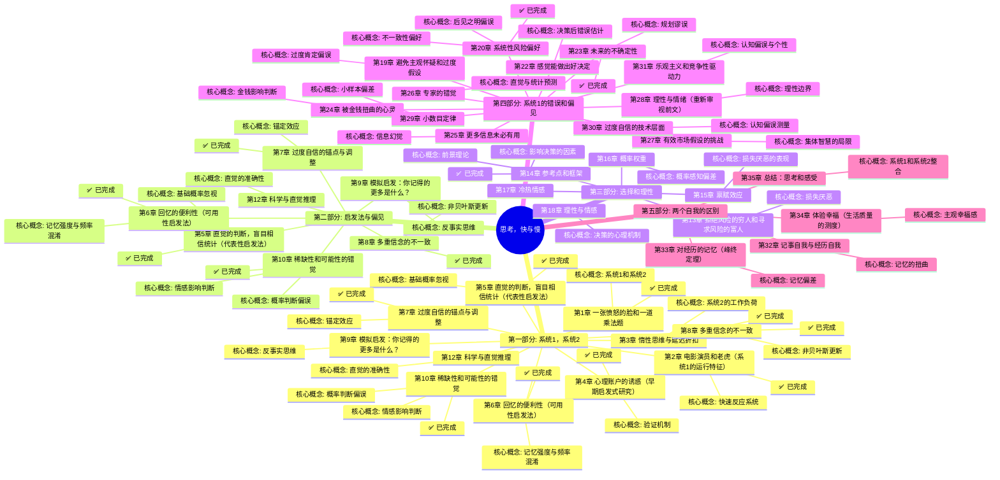

# 《思考，快与慢》- 章节导航

> 作者: 丹尼尔·卡尼曼
> 总章节: 38章（分为5个部分）
> 拆解状态: ✅ 已完成
> 最后更新: 2026-02-27

---

## 📚 章节结构（Mermaid Mindmap）



---

## 🔗 核心概念关联图

```mermaid
flowchart LR
    A[系统1] --> B[直觉判断]
    A --> C[快速反应]
    A --> D[启发法]
    B --> E[认知偏误]
    C --> F[锚定效应]
    D --> G[代表性启发法]
    D --> H[可用性启发法]
    G --> I[基础概率忽视]
    H --> J[小数法则]
    B --> K[过度自信]
    
    A1[系统2] --> L[逻辑推理]
    A1 --> M[深思熟虑]
    A1 --> N[理性判断]
    L --> O[延迟判断]
    A1 --> P[质疑系统1]
    
    E --> Q[损失厌恶]
    Q --> R[前景理论]
    R --> S[禀赋效应]
    R --> T[框架效应]

    style A fill:#e1f5fe
    style A1 fill:#e1f5fe
    style E fill:#ffcdd2
    style Q fill:#fff9c4
</mermaid>

---

## 📊 拆解进度追踪

| 章节 | 标题 | 状态 | 完成日期 | 核心收获 |
|------|------|------|----------|----------|
| 第1章 | 一张愤怒的脸和一道乘法题 | ✅ 已完成 | 2026-02-27 | 理解系统1/2基本分工及双系统认知架构 |
| 第2章 | 电影演员和老虎 | ✅ 已完成 | 2026-02-27 | 理解联想激活机制及情绪对认知的优先占用 |
| 第3章 | 惰性思维与延迟折扣 | ✅ 已完成 | 2026-02-27 | 理解最小努力原则及认知资源限制 |
| 第4章 | 心理账户的诱惑 | ✅ 已完成 | 2026-02-27 | 理解心理账户概念以及资金分类处理的非理性 |
| 第5章 | 直觉的判断 | ✅ 已完成 | 2026-02-27 | 理解代表性启发法以及基础概率忽视 |
| 第6章 | 回忆的便利性 | ✅ 已完成 | 2026-02-27 | 理解可用性启发法以及回忆便利性对概率判断的影响 |
| 第7章 | 过度自信的锚点 | ✅ 已完成 | 2026-02-27 | 理解锚定效应以及调整不充分机制 |
| 第8章 | 多重信念的不一致 | ✅ 已完成 | 2026-02-27 | 理解非贝叶斯信念更新以及概率判断偏误 |
| 第9章 | 模拟启发 | ✅ 已完成 | 2026-02-27 | 理解模拟启发法、反事实思维以及后悔心理机制 |
| 第10章 | 稀缺性和可能性的错觉 | ✅ 已完成 | 2026-02-27 | 理解有效性错觉和小数法则，以及直觉可信的边界条件 |
| 第11章 | 焦虑情绪和概率错觉 | ✅ 已完成 | 2026-02-27 | 理解情感启发式以及情绪如何扭曲概率判断 |
| 第12章 | 科学与直觉推理 | ✅ 已完成 | 2026-02-27 | 理解直觉有效性的双条件（规律环境+长期训练）及零有效性环境特征 |
| 第13章 | 拒绝风险的穷人和寻求风险的富人 | ✅ 已完成 | 2026-02-27 | 理解损失厌恶（损失痛苦≈2倍收益快乐）、参照点依赖及贫富风险态度差异 |
| 第14章 | 参考点和框架 | ✅ 已完成 | 2026-02-27 | 理解参考点依赖原理、价值相对性原则以及框架设定决策 |
| 第17章 | 冷热情感 | ✅ 已完成 | 2026-02-27 | 理解冷热共情鸿沟（冷状态无法预测热状态）、状态依赖决策及弥合策略 |
| 第21章 | 我们已经预见到了 | ✅ 已完成 | 2026-02-27 | 理解后见之明偏误、记忆重构机制及学习障碍 |
| 第20章 | 系统性风险偏好 | ✅ 已完成 | 2026-02-27 | 理解风险偏好的情境依赖性、框架效应、时间不一致及宽窄框架 |
| 第22章 | 感觉能做出好决定 | ✅ 已完成 | 2026-02-27 | 理解有效性错觉（自信≠准确性）、直觉可信双条件（规律环境+长期训练）及自信来源机制 |
| 第24章 | 被金钱扭曲的心灵 | ✅ 已完成 | 2026-02-27 | 理解金钱启动效应、自足动机激活、社会连接削弱及市场-社会规范转换 |
| 第25章 | 更多信息未必有用 | ✅ 已完成 | 2026-02-27 | 理解信息幻觉（信息越多信心越强但准确率不变）、有效性错觉及对抗策略 |
| 第26章 | 专家的错觉 | ✅ 已完成 | 2026-02-27 | 理解专家直觉有效性的三条件（规律环境+长期练习+及时反馈）、零有效性环境、统计公式优势及自信-准确分离 |
| 第33章 | 对经历的记忆 | ✅ 已完成 | 2026-02-27 | 理解峰终定理（人生由高峰和结尾定义）、时长忽视定律、记忆-体验分离原则及记忆自我的核心运作规律 |
| 第35章 | 总结：思考和感受 | ✅ 已完成 | 2026-02-27 | 理解思考与感受的关系、偏见盲点效应、理性与感受共生原则及全书理论整合 |
| 第15章 | 禀赋效应 | ✅ 已完成 | 2026-02-27 | 理解禀赋效应（拥有物高估）、所有权溢价及损失厌恶表现 |
| 第16章 | 概率权重 | ✅ 已完成 | 2026-02-27 | 理解概率权重函数、小概率高估与大概率低估及非线性概率感知 |
| 第18章 | 理性与情感 | ✅ 已完成 | 2026-02-27 | 理解决策中的情感角色、理性边界及情绪与认知的互动机制 |
| 第19章 | 理解的错觉 | ✅ 已完成 | 2026-02-28 | 理解后见之明偏误、叙事谬误、记忆重构及"我早就知道"的心理机制 |
| 第19章 | 避免主观怀疑 | ✅ 已完成 | 2026-02-27 | 理解过度自信、怀疑不足机制及确认偏误 |
| 第21章 | 直觉对抗公式 | ✅ 已完成 | 2026-02-28 | 理解公式vs直觉的比较、专家直觉信任条件（规律环境+即时反馈）、人机协作决策模式 |
| 第23章 | 未来的不确定性 | ✅ 已完成 | 2026-02-27 | 理解规划谬误、预测偏误及对抗策略 |
| 第27章 | 有效市场假设的挑战 | ✅ 已完成 | 2026-02-27 | 理解偏见的代价、市场非理性及投资决策陷阱 |
| 第28章 | 理性与情绪 | ✅ 已完成 | 2026-02-27 | 理解公平偏好、互惠原则及社会规范对决策的影响 |
| 第29章 | 四格形式 | ✅ 已完成 | 2026-02-28 | 理解四格风险态度模式（高概率收益规避、高概率损失偏好、低概率收益偏好、低概率损失规避）、确定性效应、可能性效应及风险态度的情境依赖性 |
| 第30章 | 过度自信的技术层面 | ✅ 已完成 | 2026-02-27 | 理解选择架构、助推设计及改善决策的环境设计 |
| 第31章 | 风险政策 | ✅ 已完成 | 2026-02-28 | 理解风险政策（宽框架+预先承诺+情绪隔离）、冷热状态分离决策及个人向组织学习制度化管理 |
| 第31章 | 框架效应 | ✅ 已完成 | 2026-02-27 | 理解框架效应、呈现方式对决策的影响及框架操纵对策 |
| 第32章 | 两个自我 | ✅ 已完成 | 2026-02-27 | 理解记事自我与经历自我的区别及幸福感测量 |
| 第33章 | 对经历的记忆 | ✅ 已完成 | 2026-02-28 | 理解峰终定律、时长忽视、记忆-体验分离及人生评价机制 |
| 第34章 | 体验幸福 | ✅ 已完成 | 2026-02-27 | 理解体验幸福测量方法、DRM方法、U指数及收入与幸福的关系 |
| 第35章 | 两个自我 | ✅ 已完成 | 2026-02-28 | 理解全书闭环设计、体验自我vs记忆自我、幸福悖论及系统2的救赎 |
**状态说明:**
- ✅ 已完成
- 🔄 进行中
- ⏳ 待开始
- ⏸️ 暂停

---

## 🚀 快速跳转

### 按章节跳转
- [[第1章-两个系统]] - 核心框架篇（推荐先读）
- [[第1章-一张愤怒的脸和一道乘法题]]
- [[第2章-电影演员和老虎]]
- [[第3章-惰性思维与延迟折扣]]
- [[第4章-心理账户的诱惑]]
- [[第4章-联想机器]] - 联想激活机制篇（核心机制）
- [[第5章-直觉的判断]]
- [[第5章-认知放松]] - 认知放松vs认知紧张（新增）
- [[第6章-回忆的便利性]]
- [[第6章-常态错觉]] - WYSIATI陷阱与信息补全（新增）
- [[第7章-过度自信的锚点]]
- [[第8章-多重信念的不一致]]
- [[第9章-模拟启发]]
- [[第10章-稀缺性和可能性的错觉]]
- [[第11章-焦虑情绪和概率错觉]]
- [[第12章-科学与直觉推理]]
- [[第13章-拒绝风险的穷人和寻求风险的富人]]
- [[第14章-参考点和框架]]
- [[第15章-禀赋效应]]
- [[第17章-冷热情感]]
- [[第18章-理性与情感]]
- [[第18章-驯服直觉性预测]] - 预测修正方法（新增）
- [[第19章-理解的错觉]] - 后见之明与叙事谬误（新增）
- [[第21章-直觉对抗公式]] - 公式vs直觉、专家信任条件、人机协作（新增）
- [[第23章-未来的不确定性]]
- [[第21章-我们已经预见到了]]
- [[第22章-感觉能做出好决定]]
- [[第16章-概率权重]]
- [[第20章-系统性风险偏好]]
- [[第24章-被金钱扭曲的心灵]]
- [[第25章-更多信息未必有用]]
- [[第26章-专家的错觉]]
- [[第29章-四格形式]] - 四格风险态度模式、确定性效应、可能性效应（新增）
- [[第32章-两个自我]]
- [[第33章-对经历的记忆]]
|- [[第34章-体验幸福]]
- [[第35章-两个自我]] - 全书终章闭环、体验自我vs记忆自我、幸福悖论（新增）
- [[第35章-总结思考和感受]]
### 按主题跳转
- [[系统1与系统2]]
- [[认知偏误]]
- [[前景理论]]
- [[损失厌恶]]
- [[启发式与偏见]]

### 相关资源
- [[思考快与慢-丹尼尔·卡尼曼-拆解记录]] - 主拆解笔记
- [[清醒思考的艺术-多贝里-拆解记录]] - 相关认知心理学书籍
- [[穷查理宝典-拆解记录]] - 相关思维模型
