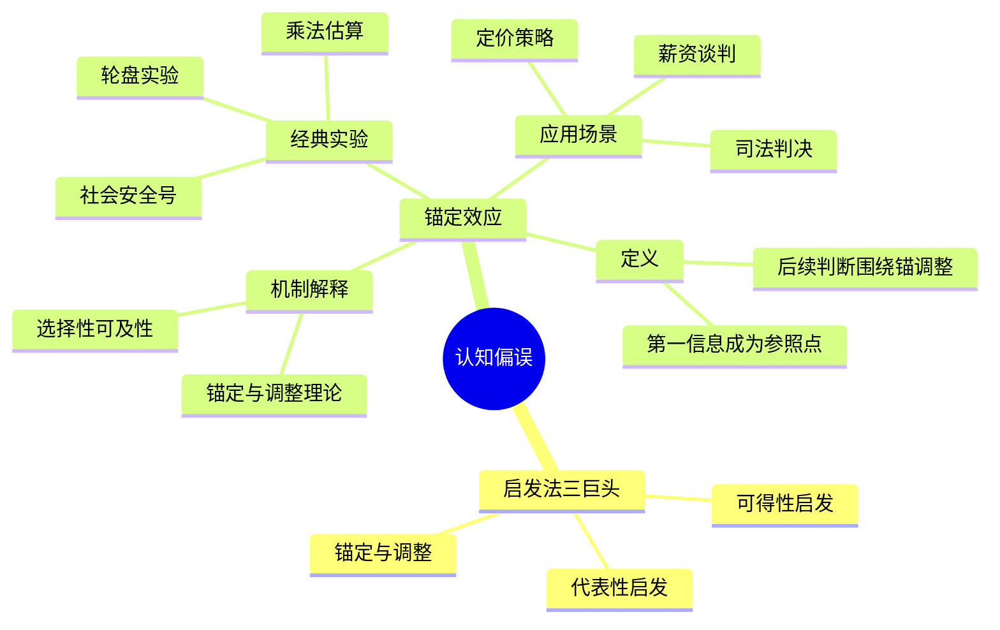
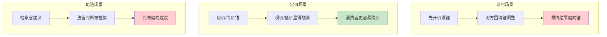

# 第11章 锚定效应

> **核心主题**：第一印象如何成为你脑子里的"锚"，影响后续所有判断

## 🔍 信息来源与质量评级

| 轮次 | 检索工具 | 检索关键词 | 质量评级 | 核心来源 |
|------|----------|------------|----------|----------|
| 第一轮 | MCP Web Reader | Anchoring Effect Wikipedia Kahneman | ⭐⭐⭐ | Wikipedia、原书 |

### 整合方式
- **基础框架**：⭐⭐⭐ 权威来源（Wikipedia、原书实验）
- **案例补充**：⭐⭐⭐ 经典实验（轮盘实验、Ariely实验）

---

## 一、系统定位

### 1.1 这一章在解决什么问题？

**核心困境**：你以为自己在理性判断，但第一个看到的信息（锚）已经偷偷决定了你的结论。无论是价格谈判、薪资协商还是日常决定，你都被"第一印象"绑架了。

**一句话定位**：
> 第一眼看到的信息，成了你脑子里甩不掉的锚。
> 后面所有的思考，都围绕这个锚打转。

### 1.2 这一章在全书中的位置

| 维度 | 定位 |
|------|------|
| 所属部分 | 第二部分：启发法和偏误 |
| 核心概念 | 锚定效应（Anchoring Effect） |
| 与前章关联 | [[第10章-小数法则]] → 小数法则是锚定的一种表现 |
| 与后章关联 | [[第12章-科学与直觉推理]] → 可得性启发法 |
| 知识定位 | 系统1的核心偏误之一，与可得性启发法、代表性启发法并列 |

### 1.3 知识网络定位图



---

## 二、核心观点（三层提取）

### 观点1：锚定效应无处不在——即使锚是随机的

#### 【表层】现象层

**轮盘实验**（Tversky & Kahneman, 1974）：
- 参与者先转动一个轮盘（被设定停在10或65）
- 然后估计：非洲国家在联合国中占多少比例？
- **结果**：看到10的人平均估计25%，看到65的人平均估计45%
- 震惊的是：参与者知道轮盘是随机的，但仍然被影响

**乘法估算实验**：
- A组：1×2×3×4×5×6×7×8 = ?（5秒内估算）
- B组：8×7×6×5×4×3×2×1 = ?
- **结果**：A组中位数512，B组中位数2250
- **正确答案**：40320
- 两组都被开头的小/大数字锚定了

**Dan Ariely的社会安全号实验**：
- 让学生写下社会安全号最后两位
- 然后对葡萄酒、巧克力出价
- **结果**：安全号数字大的人，出价高60%-120%
- 完全无关的数字，竟然影响出价

#### 【中层】机制层

**锚定效应的心理机制**：

```mermaid
flowchart TD
    subgraph 锚定形成
        A[接触第一个信息] --> B[信息成为锚点]
        B --> C[系统1自动激活]
    end

    subgraph 调整过程
        C --> D[从锚点开始调整]
        D --> E{调整是否充分？}
        E -->|否| F[判断偏向锚点]
        E -->|是| G[接近真实答案]
    end

    subgraph 为什么调整不足
        H[系统2懒惰] --> I[调整到"可接受"就停止]
        J[极端厌恶] --> K[不愿偏离锚点太远]
        L[选择性可及性] --> M[只想到锚点相关信息]
    end

    F --> H
    F --> J
    F --> L

    style A fill:#e3f2fd
    style B fill:#fff9c4
    style F fill:#ffcdd2
    style G fill:#c8e6c9
```

**两种机制解释**：

| 理论 | 核心观点 | 关键发现 |
|------|----------|----------|
| **锚定与调整** | 从锚开始调整，但调整不足 | 系统2懒，调整到"可接受"就停 |
| **选择性可及性** | 锚激活相关信息，让人只想到锚一致的证据 | 看到高锚，脑中自动搜索"为什么可能是高"的证据 |

#### 【底层】规律层

> **锚定定律**：人类判断不是从零开始，而是从第一个接触的信息（锚）开始调整。由于调整不足和选择性注意，最终判断会被锚点系统性地拉偏。

**降维翻译**：
> 你以为你在思考，其实你只是在"第一印象"附近找答案。
> 锚就是第一印象，它划定了你思考的边界。
> 你不会想到"锚外面"去，因为系统1不让你去。

#### 【当下连接】

|----------|----------|----------|
| 为什么我总买贵东西？ | 商家先给你看贵的（锚） | "原来我被设计了" |
| 为什么谈判总是吃亏？ | 对方先开价，成了锚 | "先开口的人赢一半" |
| 为什么打折让我忍不住？ | 原价是锚，打折价显得便宜 | "原价只是个数字" |
| 如何避免被锚定？ | 知道锚在哪里，反向思考 | "觉察是第一步" |

---

### 观点2：锚定效应无法避免——即使你知道它存在

#### 【表层】现象层

**明知故犯实验**（Wilson et al., 1996）：
- 参与者被明确告知："锚会污染你的判断，请尽力修正"
- **结果**：仍然被锚定，和不知道的人一样
- 结论：知道锚定效应存在，并不能让你免疫

**甘地年龄实验**：
- A组：甘地死时是超过9岁还是不到9岁？然后估计他死时多少岁？
- B组：甘地死时是超过140岁还是不到140岁？
- **结果**：A组平均估计50岁，B组平均估计67岁
- 震惊的是：9岁和140岁这两个锚都明显不可能是对的

**金钱激励实验**（Simmons et al., 2010）：
- 给参与者金钱奖励，估计越准奖励越多
- **结果**：锚定效应依然存在
- 结论：即使有钱赚，人也调整不够

#### 【中层】机制层

**为什么锚定如此顽固？**

```mermaid
flowchart LR
    A[锚定为何无法避免] --> B[系统1自动运行]
    A --> C[调整需要系统2]
    A --> D[选择性可及性]

    B --> E[无意识、自动化<br/>你甚至不知道它发生了]
    C --> F[系统2懒惰<br/>调整到"差不多"就停]
    D --> G[锚激活相关信息<br/>你只想到支持锚的证据]

    style A fill:#e3f2fd
    style E fill:#ffcdd2
    style F fill:#ffcdd2
    style G fill:#ffcdd2
```

**专家也无法免疫**：
- 房地产实验：专业经纪人和学生一样被挂牌价锚定
- 法官实验：检察官的量刑建议成了锚，影响法官判决
- 结论：专业知识不能保护你

#### 【底层】规律层

> **锚定不可消除定律**：锚定效应是系统1的出厂设置，无法通过"知道"或"努力"来消除。唯一有效的方法是"考虑相反情况"——主动寻找反对锚的证据。

**降维翻译**：
> 你不能关掉锚定，但可以绕开它。
> 怎么绕？问自己："如果锚是错的，为什么？"
> 这叫"考虑相反情况"，是唯一被证明有效的方法。

#### 【当下连接】

|----------|----------|----------|
| 为什么知道道理还是被坑？ | 锚定是系统1自动的，你控制不了 | "知道≠能做到" |
| 聪明人也会被锚定吗？ | 专家和学生一样被锚定 | "智商救不了你" |
| 有没有办法完全避免？ | 没有，但可以减轻 | "只能打补丁，不能重装" |
| 最好的应对方法是什么？ | 考虑相反情况 | "问自己：如果锚是错的呢？" |

---

### 观点3：锚定效应的现实威力——从谈判到定价

#### 【表层】现象层

**谈判中的锚定**：
- 先开价的人设置锚点
- 后续所有讨论围绕这个锚
- 研究发现：先开价的一方往往获得更有利的结果
- 即使是明显不合理的开价，也会成为锚

**定价中的锚定**：
- "原价999，现价399"——999是锚，399显得便宜
- 餐厅菜单：最贵的菜放在最前面——后面的菜显得划算
- 慈善捐款：预设金额（50/100/200）成为锚，影响捐款数额

**司法中的锚定**：
- 检察官建议刑期成为锚
- 即使法官知道建议不合理，判决仍会偏向这个锚
- 研究显示：检察官建议越高，最终判决越重

**精度效应**：
- $800,000 vs $799,800
- 精确数字让人调整幅度更小
- 结果：$799,800的锚让人出价更高

#### 【中层】机制层

**锚定在不同场景的应用**：



**精确锚 vs 笼统锚**：

| 锚类型 | 示例 | 调整方式 | 最终结果 |
|--------|------|----------|----------|
| 笼统锚 | $800,000 | 大幅度调整 | $751,867 |
| 精确锚 | $799,800 | 小幅度调整 | $784,671 |
| 机制 | 精确锚改变"调整刻度" | 让人用更小的单位调整 | 更接近原始锚 |

#### 【底层】规律层

> **锚定应用定律**：谁先设置锚，谁就掌握了谈判的主动权。精确的锚比笼统的锚更有效。在商业、谈判、司法中，锚定效应被广泛利用。

**降维翻译**：
> 先开价的人赢一半。
> 报价越精确，对方越难砍价。
> 商家、老板、检察官都在用锚定对付你——
> 你的系统1正在帮他们。

#### 【当下连接】

|----------|----------|----------|
| 谈判时应该先开价吗？ | 是的，先开价设锚占优势 | "先下手为强" |
| 为什么菜单总有贵的菜？ | 贵菜是锚，让其他菜显得便宜 | "原来是被设计的" |
| 如何谈薪资？ | 先说出你的期望（设锚） | "别等对方先开价" |
| 如何砍价？ | 给一个精确的低价锚 | "精确数字更有说服力" |

---

## 三、金句库

### 原书金句

1. "锚定效应的影响比我们想象的要大得多。"
2. "即使是完全随机的数字，也会成为人们判断的锚点。"
3. "人们不是从零开始估计，而是从锚开始调整——但调整总是不足。"
4. "知道锚定效应存在，并不能让你免疫。"
5. "聪明人也会犯愚蠢的错误，因为系统1太霸道了。"

### 降维金句

1. **第一眼看到的信息，成了你脑子里甩不掉的锚。**
2. **你以为你在思考，其实你只是在"第一印象"附近找答案。**
3. **先开价的人赢一半——因为他设置了锚。**
4. **原价只是个数字，但它是商家放在你脑子里的锚。**
5. **你不能关掉锚定，但可以绕开它——问自己："如果锚是错的呢？"**
6. **知道锚定效应≠能避免锚定，系统1不听你的。**
7. **专家和学生一样被锚定——智商救不了你。**
8. **精确的锚比笼统的锚更厉害——$799,800比$800,000更难砍价。**
9. **菜单上最贵的菜不是给你吃的，是给你看的——它是锚。**
10. **谈判黄金法则：能先开价就先开价。**

## 四、当下映射

### 财富焦虑维度

#### 为什么打折让我忍不住买？

**锚定效应解析**：
- 原价999是锚，现价399显得便宜
- 但如果没有原价呢？399真的便宜吗？
- 系统1自动比较，系统2懒得思考

**应对策略**：
1. 忘掉原价，只看现价值不值
2. 问自己：如果没看到原价，我会买吗？
3. 延迟24小时再决定

**金句**：
> 原价只是个数字，但它是商家放在你脑子里的锚。
> 忘掉原价，才能看清现价。

---

### 职场焦虑维度

#### 如何谈薪资不吃亏？

**锚定效应应用**：
- 对方先开价→他的锚成了你的天花板
- 你先开价→你的锚成了他的起点
- 精确报价（如"期望年薪28.8万"）比笼统报价更有力

**行动指南**：
1. 面试前做好市场调研
2. 先说出你的期望（设锚）
3. 用精确数字而非笼统范围
4. 如果对方先开价，用"考虑相反情况"打破锚

**金句**：
> 谈薪资黄金法则：先开口的人设置锚。
> 别等对方先开价，你的期望就是锚。

---

### 生活焦虑维度

#### 如何避免被第一印象绑架？

**锚定效应应对**：
- 第一印象是锚，后续判断围绕它
- 系统1自动运行，系统2懒得修正
- 唯一有效方法：考虑相反情况

**应对清单**：
- [ ] 问自己：如果第一印象是错的呢？
- [ ] 主动寻找反对第一印象的证据
- [ ] 延迟24小时再做重要决定
- [ ] 在谈判中，尝试设置你的锚
- [ ] 警惕"原价"、"参考价"等预设锚

**金句**：
> 你不能关掉锚定，但可以绕开它。
> 问自己"如果第一印象是错的？"——这是唯一被证明有效的方法。

---

## 五、系统关联

### 与主拆解记录的关联

| 章节 | 关联内容 |
|------|----------|
| [[思考快与慢-丹尼尔·卡尼曼-拆解记录]] | 锚定效应是系统1的核心偏误之一 |
| [[第10章-小数法则]] | 小数法则是锚定的一种表现 |
| [[第12章-科学与直觉推理]] | 可得性启发法与锚定并列 |

### 与其他书籍的关联

| 书籍 | 关联类型 | 共同逻辑 |
|------|----------|----------|
| [[影响力-西奥迪尼-拆解记录]] | 应用延伸 | "先提大要求再提小要求"是锚定的应用 |
| [[清醒思考的艺术-多贝里-拆解记录]] | 理论→清单 | 锚定偏误是52个偏误之一 |
| [[助推-理查德·塞勒-拆解记录]] | 政策应用 | 选择架构中的"预设选项"是锚定的应用 |

---

## 九、应对锚定的实用清单

### 破锚三步法

1. **觉察锚的存在**：问自己"我的判断是基于什么第一信息？"
2. **考虑相反情况**：问自己"如果这个锚是错的，为什么？"
3. **延迟判断**：重要决定延迟24小时，让系统2上线

### 设锚三步法（谈判时使用）

1. **先开价**：能先开价就先开价
2. **用精确数字**：$799,800比$800,000更有效
3. **给出理由**：锚+理由=更强的锚

---

*拆解日期：2026-02-28*
*拆解方法：[[系统化拆解方法论]]*
*拆解模式：标准模式*

**核心公式**：
> 锚定效应 = 第一信息成为锚 + 调整不足 + 选择性可及性
> = 你以为在思考，其实在锚附近找答案
> = 唯一解药：考虑相反情况
