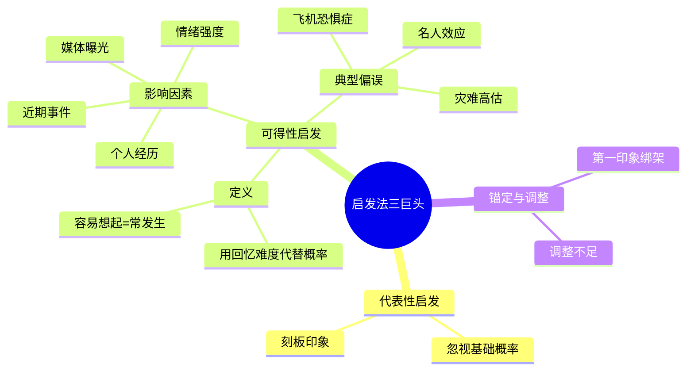
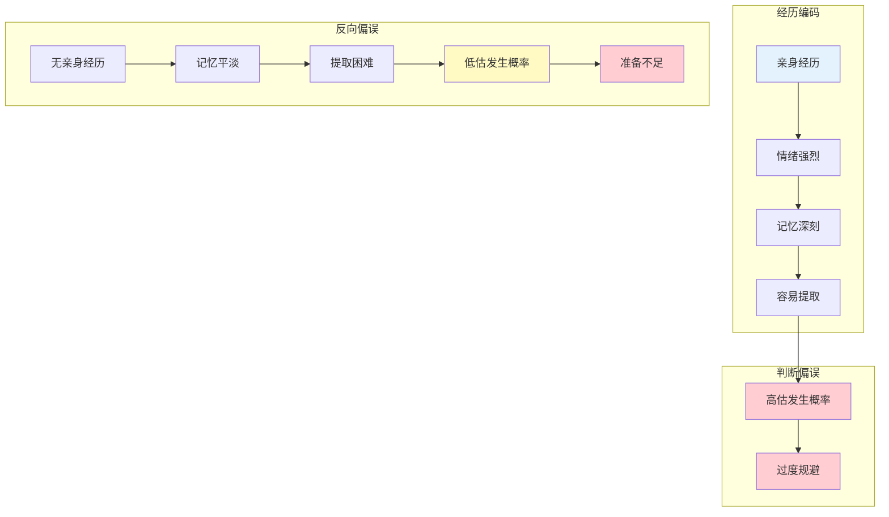

# 第12章 可得性启发式

> **核心主题**：为什么我们过度重视容易想到的事——大脑用"回忆难度"代替"真实概率"

## 🔍 信息来源与质量评级

| 轮次 | 检索工具 | 检索关键词 | 质量评级 | 核心来源 |
|------|----------|------------|----------|----------|
| 第一轮 | MCP Web Reader | Availability Heuristic Kahneman Tversky | ⭐⭐⭐ | Wikipedia、原书、经典论文 |

### 整合方式
- **基础框架**：⭐⭐⭐ 权威来源（原书、经典实验）
- **案例补充**：⭐⭐⭐ 经典实验（飞机vs车祸、名人案例）
- **理论延伸**：⭐⭐⭐ 媒体效应、生动性偏误研究

---

## 一、系统定位

### 1.1 这一章在解决什么问题？

**核心困境**：你以为自己在理性评估概率，但你只是根据"容易想起来吗"做判断。飞机失事比车祸更"容易被记住"，所以你觉得飞机更危险——但事实恰恰相反。媒体、经历、情绪都在偷偷修改你的概率表。

**一句话定位**：
> 你记住的不等于常发生的。
> 大脑用"回忆难度"当尺子，量"发生概率"——
> 但这把尺子是歪的。

### 1.2 这一章在全书中的位置

| 维度 | 定位 |
|------|------|
| 所属部分 | 第二部分：启发法和偏误 |
| 核心概念 | 可得性启发式（Availability Heuristic） |
| 与前章关联 | [[第11章-锚定效应]] → 两种启发法并列 |
| 与后章关联 | [[第13章-拒绝风险的穷人和寻求风险的富人]] → 从概率判断到风险态度 |
| 知识定位 | 启发法三巨头之一（代表性、可得性、锚定） |

### 1.3 知识网络定位图



---

## 二、核心观点（三层提取）

### 观点1：大脑用"回忆难度"当"概率尺"

#### 【表层】现象层

**飞机vs车祸实验**：
- 问题：哪种交通方式更危险？飞机还是汽车？
- 回答：大多数人认为飞机更危险
- **事实**：按里程计算，汽车事故死亡率是飞机的100倍以上
- **原因**：飞机失事会被大篇幅报道，车祸太常见没人报道

**名人死亡实验**：
- 问题：名人和普通人，谁的死更容易被记住？
- 结果：名人的死亡被高估概率约10倍
- **机制**：名人死亡媒体报道多，普通人死亡没报道

**字母位置实验**（Tversky & Kahneman, 1973）：
- 问题：英文单词中，K是更多出现在第一个字母还是第三个字母？
- 回答：大多数人认为第一个字母
- **事实**：第三个字母的K大约是第一个字母的2倍
- **原因**：更容易想起"以K开头的词"（kite, king, kite...）

#### 【中层】机制层

**可得性启发式的心理机制**：

```mermaid
flowchart TD
    subgraph 触发阶段
        A[需要估计概率] --> B[系统1自动搜索记忆]
        B --> C{回忆是否容易？}
    end

    subgraph 判断阶段
        C -->|容易| D[判断为"常见"]
        C -->|困难| E[判断为"罕见"]
    end

    subgraph 偏误来源
        F[媒体选择性报道] --> G[容易回忆≠常发生]
        H[个人经历特殊性] --> G
        I[情绪强烈程度] --> G
        J[事件新鲜程度] --> G
    end

    D --> K[概率高估]
    E --> L[概率低估]
    G --> K
    G --> L

    style A fill:#e3f2fd
    style D fill:#ffcdd2
    style E fill:#c8e6c9
    style G fill:#fff9c4
```

**影响"可得性"的四个因素**：

| 因素 | 机制 | 示例 |
|------|------|------|
| **媒体曝光** | 媒体偏好报道"有新闻价值"的事件 | 飞机失事、恐怖袭击 |
| **个人经历** | 自己经历过的事更容易想起 | 被狗咬过的人高估狂犬病风险 |
| **情绪强度** | 情绪强烈的事件更难忘 | 恐怖画面、创伤记忆 |
| **近期性** | 刚发生的事比旧事更容易想起 | 刚看完新闻后高估风险 |

#### 【底层】规律层

> **可得性启发定律**：当人们需要估计某事件的频率或概率时，系统1会自动用"从记忆中提取实例的难易程度"作为替代指标。由于媒体选择性报道、情绪偏见等因素，这个指标与真实概率常常严重偏离。

**降维翻译**：
> 你的大脑不会算概率，
> 它只会问："这事儿我记得住吗？"
> 记得住的，它就当成常发生的。
> 但媒体、经历、情绪都在偷偷改你的记忆——
> 所以你的概率表是歪的。

#### 【当下连接】

|----------|----------|----------|
| 为什么我这么怕坐飞机？ | 飞机失事媒体报道多，你想起来就容易 | "原来是被新闻吓的" |
| 为什么我觉得世界越来越危险？ | 坏事报道多，好事没人报 | "好事不出门，坏事传千里" |
| 为什么总担心小概率大灾难？ | 大灾难印象深刻，日常风险被忽视 | "你的恐惧被放大了" |
| 如何判断真实风险？ | 看统计数据，别看新闻标题 | "数据不会骗人" |

---

### 观点2：媒体是最大的"概率扭曲器"

#### 【表层】现象层

**新闻报道的选择性**：
- 飞机失事：头版头条，持续报道一周
- 车祸死亡：没人报道，太常见了
- **结果**：公众严重高估飞机风险，低估汽车风险

**恐布袭击vs日常事故**：
- 恐怖袭击：全世界报道，画面震撼
- 溺水死亡：每年全球约32万人，几乎不报道
- **结果**：公众认为恐怖袭击比溺水更致命（事实相反）

**犯罪的媒体报道偏误**：
- 媒体偏好报道：谋杀、绑架、恐怖袭击
- 媒体忽视报道：交通事故、心脏病、自杀
- **结果**：公众高估暴力犯罪风险，低估日常风险

#### 【中层】机制层

**媒体如何扭曲概率感知**：

```mermaid
flowchart LR
    subgraph 现实世界
        A[日常风险<br/>高频率、低关注]
        B[极端事件<br/>低频率、高关注]
    end

    subgraph 媒体选择
        C[忽视日常<br/>"没新闻价值"]
        D[放大极端<br/>"吸引眼球"]
    end

    subgraph 公众感知
        E[低估日常风险]
        F[高估极端风险]
    end

    A --> C --> E
    B --> D --> F

    style B fill:#ffcdd2
    style D fill:#ffcdd2
    style F fill:#ffcdd2
```

**"新闻价值"公式**：
- 新闻价值 = 罕见性 × 震撼性 × 视觉冲击力
- 结果：越罕见、越震撼的事，报道越多
- 公众感知：报道越多的事，越常见（逻辑反了！）

#### 【底层】规律层

> **媒体扭曲定律**：媒体天然偏好报道"罕见但震撼"的事件，导致公众系统性地高估极端事件概率，低估日常风险。这不是媒体的阴谋，是注意力经济的必然结果——但读者需要主动校正。

**降维翻译**：
> 新闻不是世界的镜子，是"卖点击的机器"。
> 越罕见的事，越上头条。
> 结果你以为：罕见=常见。
> 世界比新闻里安全多了。

#### 【当下连接】

|----------|----------|----------|
| 为什么看新闻觉得世界很乱？ | 媒体只报道乱的，不报道正常的 | "正常事不是新闻" |
| 如何判断真实安全？ | 看统计数据，别看新闻量 | "别让标题吓住你" |
| 孩子真的比以前更危险吗？ | 没有，是报道多了，你以为多了 | "世界比想象中安全" |
| 为什么老人总说"以前安全"？ | 以前不报道，现在随时能看到 | "信息过载的代价" |

---

### 观点3：个人经历是第二个"概率扭曲器"

#### 【表层】现象层

**"被狗咬过的人高估狂犬病风险"**：
- 没被狗咬过的人：狂犬病风险估计1%
- 被狗咬过的人：狂犬病风险估计15%
- **真实风险**：在发达国家，狂犬病几乎为零

**"自己生过病的人高估疾病风险"**：
- 得过重病的人，对同类疾病的风险估计高5-10倍
- 没得过的人，风险估计接近真实值

**"投资亏过钱的人高估风险"**：
- 亏过50%的人：认为股市风险极高
- 没亏过钱的人：风险估计更接近统计值

#### 【中层】机制层

**个人经历如何扭曲概率**：



**"可得性 cascade"（可得性级联）**：
- 个人经历 → 告诉别人 → 别人也记住 → 媒体报道 → 更多人记住
- 结果：一个罕见事件被全社会高估
- 案例：疫苗副作用、食品安全事件

#### 【底层】规律层

> **经历偏误定律**：亲身经历的事件会被情绪强化，形成强烈记忆，从而被高估概率。没有经历过的事件，即使统计上常见，也会因为"提取困难"而被低估。这种偏误在风险评估中尤为危险。

**降维翻译**：
> 你被狗咬过，全世界都是疯狗。
> 你没被狗咬过，狗都是好朋友。
> 两个判断都错了——
> 因为你用"我的经历"代替了"真实概率"。

#### 【当下连接】

|----------|----------|----------|
| 为什么我总担心某些事？ | 可能因为你经历过，记忆深刻 | "不是概率大，是记忆深" |
| 为什么别人觉得我杞人忧天？ | 他们没经历过，你想起来就容易 | "经历塑造判断" |
| 如何客观评估风险？ | 查数据，别只信自己的感觉 | "感觉会骗人" |
| 如何克服创伤带来的恐惧？ | 知道这是可得性偏误，用数据校准 | "理解是第一步" |

---

## 三、金句库

### 原书金句

1. "人们通过从记忆中提取实例的难易程度，来判断某类事件的频率或概率。"
2. "你记住的，不等于常发生的。"
3. "可得性启发法是系统1的核心操作之一——它用回忆难度替代概率估计。"
4. "媒体选择性地放大某些风险，让我们对这些风险的感知严重失真。"
5. "生动的记忆比枯燥的统计更有说服力——这正是问题所在。"

### 降维金句

1. **你记住的不等于常发生的——大脑用"回忆难度"当"概率尺"，但尺子是歪的。**
2. **新闻不是世界的镜子，是"卖点击的机器"——越罕见的事越上头条。**
3. **飞机失事上头条，车祸死亡没人报——所以你觉得飞机比车危险。**
4. **你被狗咬过，全世界都是疯狗——亲身经历是最不靠谱的"概率表"。**
5. **问自己：我是从统计数据判断，还是从记忆里翻故事？**
6. **世界比新闻里安全多了——坏事才叫新闻，好事不是。**
7. **可得性偏误=媒体+经历+情绪，三重滤镜扭曲你的概率表。**
8. **怕坐飞机的人，应该看看车祸统计——但你不会，因为车祸不"值得"报道。**
9. **数据不会骗人，但你的记忆会——记住这点，你就赢了一半。**
10. **想纠正可得性偏误？每次判断前问自己：我从哪里得到这个"概率"的？**

## 四、当下映射

### 财富焦虑维度

#### 为什么总觉得投资风险很大？

**可得性效应解析**：
- 2008金融危机、2015股灾、2020熔断——都在你记忆里
- 但牛市、稳定增长、长期上涨——你记不住
- 结果：你高估风险，错过机会

**应对策略**：
1. 看长期数据，别只记住大跌
2. 建立投资日记，记录好日子和坏日子
3. 问自己：我的恐惧来自统计还是记忆？

**金句**：
> 你记住的是跌，你忘掉的是涨。
> 所以你总觉得风险比收益大。
> 但长期数据告诉你：涨的日子比跌的多。

---

### 职场焦虑维度

#### 为什么总觉得跳槽风险很大？

**可得性效应解析**：
- 你记住的跳槽故事：失败、后悔、降薪
- 你忘掉的跳槽故事：成功、升职、加薪
- 结果：你高估跳槽风险，错过机会

**行动指南**：
1. 记录身边所有跳槽案例，成功和失败都记
2. 问自己：我的恐惧来自数据还是故事？
3. 找统计：跳槽后的平均薪资变化是多少？

**金句**：
> 你记住的是失败的跳槽故事，
> 你忘掉的是成功的那99个。
> 所以你以为跳槽=失败，其实是你记性不好。

---

### 生活焦虑维度

#### 为什么总觉得孩子比以前危险？

**可得性效应解析**：
- 以前：孩子走丢，村里人帮忙找，不报道
- 现在：孩子走丢，全网转发，上热搜
- 结果：你觉得现在的孩子更危险，其实没有

**应对清单**：
- [ ] 区分"报道多了"和"发生多了"
- [ ] 看统计数据，不看新闻量
- [ ] 理解：信息传播越快，恐惧放大越多
- [ ] 告诉自己：世界比新闻里安全

**金句**：
> 孩子没有比以前更危险，
> 只是危险被传播得更广了。
> 信息过载的代价，是我们的恐惧被无限放大。

---

## 五、系统关联

### 与主拆解记录的关联

| 章节 | 关联内容 |
|------|----------|
| [[思考快与慢-丹尼尔·卡尼曼-拆解记录]] | 可得性启发法是系统1的核心偏误之一 |
| [[第11章-锚定效应]] | 两种启发法并列：锚定=第一信息，可得性=回忆难度 |
| [[第13章-拒绝风险的穷人和寻求风险的富人]] | 从概率判断（本章）到风险态度（下章） |

### 与其他书籍的关联

| 书籍 | 关联类型 | 共同逻辑 |
|------|----------|----------|
| [[清醒思考的艺术-多贝里-拆解记录]] | 理论→应用 | 可得性偏误是52个偏误之一 |
| [[黑天鹅-塔勒布-拆解记录]] | 互补 | 塔勒布关注极端事件被忽视，卡尼曼关注极端事件被高估 |
| [[影响力-西奥迪尼-拆解记录]] | 应用延伸 | 社会认同原理利用了可得性偏误 |
| [[助推-理查德·塞勒-拆解记录]] | 政策应用 | 用可得性偏误设计更好的风险沟通 |

---

## 九、克服可得性偏误的实用清单

### 评估前自问三问题

1. **"我的判断来自哪里？"**
   - 统计数据？还是记忆里的故事？
   - 如果是故事，小心！

2. **"这个风险被媒体报道过吗？"**
   - 媒体爱报道罕见的、震撼的
   - 报道多≠发生多

3. **"我有亲身经历吗？"**
   - 经历会放大记忆，扭曲判断
   - 用数据校准，别只用感觉

### 纠正三步法

1. **找数据**：查统计年鉴、官方报告
2. **比记忆**：我的估计和统计数据差多少？
3. **调校准**：承认偏误，用数据修正直觉

---

*拆解日期：2026-02-28*
*拆解方法：[[系统化拆解方法论]]*
*拆解模式：标准模式*

**核心公式**：
> 可得性启发式 = 用"回忆难度"代替"真实概率"
> = 媒体选择性报道 + 个人经历放大 + 情绪强化
> = 你记住的 ≠ 常发生的
> = 唯一解药：看统计数据，校准直觉
