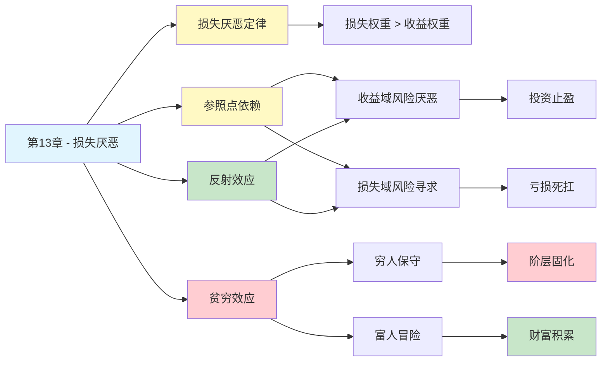

# 第13章 拒绝风险的穷人和寻求风险的富人

## 📍 章节定位

### 全书位置
> 第13章是前景理论的核心章节，揭示了损失厌恶如何改变风险态度——穷人在面对收益时厌恶风险，富人在面对损失时寻求风险，根本原因在于参照点的位置不同，为我们理解人类非理性决策提供了最重要的理论基础。

- **全书核心问题**: 为什么人类的判断经常偏离理性？
- **本章回答的问题**: 为什么人们对收益和损失的风险态度完全不同？穷人和富人的风险偏好为何相反？
- **角色类型**: 核心理论型（前景理论核心机制）
- **论证位置**: 从启发式研究转向决策理论，开启全书最重要的理论贡献

### 章节序列
| 方向 | 章节标题 | 逻辑连接 |
|------|----------|----------|
| 前章 | [[第12章-科学与直觉推理]] | 从直觉边界过渡到风险决策的心理学机制 |
| 后章 | [[第14章-参考点和框架]] | 本章损失厌恶理论在框架效应中的应用延伸 |
| 整书 | [[思考快与慢-丹尼尔·卡尼曼-拆解记录]] | 前景理论核心——损失厌恶与风险态度 |

### 一句话定位
> 第13章揭示了人类风险态度的悖论：面对收益我们厌恶风险，面对损失我们追求风险——这种不对称源于损失比同等收益"感觉"大约2倍的损失厌恶心理。

---

## 🎯 核心观点

### 第一层：表层案例
| 案例名称 | 简要描述 | 关键引文 |
|----------|----------|----------|
| 确定收益vs赌一把 | 大多数人选择确定获得900元，而不是90%概率获得1000元 | "收益时，人们偏好确定性" |
| 确定损失vs赌一把 | 大多数人选择10%概率损失1000元，而不是确定损失900元 | "损失时，人们偏好冒险" |
| 穷人的保守 | 资金紧张的人会拒绝一个期望值为正的赌局 | "贫穷迫使风险厌恶" |
| 富人的冒险 | 富豪会接受一个有风险但期望值为正的投资 | "富裕允许风险承担" |
| 保险购买悖论 | 人们愿意溢价购买保险，却不愿接受等价的公平赌局 | "损失厌恶催生保险业" |

### 第二层：中层机制
| 机制名称 | 组成要素 | 因果链条 | 证据来源 |
|----------|----------|----------|----------|
| 损失厌恶 | 损失权重 > 收益权重 | 损失100元痛苦 ≈ 获得200元快乐 → 风险态度不对称 | 前景理论实验 |
| 参考点依赖 | 当前状态 = 零点 | 高于参考点→风险厌恶，低于参考点→风险寻求 | 行为经济学实验 |
| 反射效应 | 收益/损失镜像反转 | 收益域风险厌恶 ↔ 损失域风险寻求 | Kahneman-Tversky实验 |
| 贫穷效应 | 资源约束 → 参考点敏感 | 钱越少→损失越痛→越不敢冒险 | 贫困心理学研究 |
| 禀赋效应 | 拥有即高估 | 拥有物 → 视为现状 → 放弃=损失 → 要求高价 | Thaler实验 |

### 第三层：底层规律
| 规律陈述 | 抽象层级 | 知识连接 | 适用范围 |
|----------|----------|----------|----------|
| 损失厌恶定律 | 决策心理学核心规律 | [[前景理论]], [[行为经济学]] | 所有涉及得失的决策 |
| 参考点原则 | 知觉心理学规律 | [[心理物理学]], [[参照依赖]] | 价值判断领域 |
| 反射效应定律 | 风险偏好规律 | [[期望效用理论修正]] | 风险决策场景 |
| 边际效用递减 | 经济学基本规律 | [[微观经济学]], [[效用理论]] | 财富变化评估 |

---

## 💬 降维翻译

### 观点1: 损失厌恶——失去的痛苦是得到的快乐的2倍

#### 原文表达
> "损失带来的痛苦感大约是同等收益带来快乐感的2倍。这意味着，丢失100元的痛苦，需要获得200元才能弥补。这种不对称深刻地影响了我们的所有决策。"

#### 降维翻译（中学生能懂）
你丢100块钱的心疼程度，大概等于你捡到200块钱的高兴程度。

这导致一个奇怪的现象：
- 如果让你选：A. 确定拿900元 B. 90%拿1000元，10%拿0
- 大多数人选A——落袋为安

但如果让你选：
- A. 确定亏900元 B. 90%亏1000元，10%不亏
- 大多数人选B——宁可赌一把

**同样的数学期望，不同的选择。为什么？**
- 面对"得"，我们怕失去到手的东西
- 面对"失"，我们想搏一把翻盘

#### 日常类比（奶奶能懂）
就像卖东西，你花100块买的衣服，别人出80块你肯定不卖，虽然80块已经是合理价了。但如果在街上捡到80块钱，你会很高兴。

同样是80块，"失去"和"得到"的感觉完全不一样。

#### 检验
- Q: 如果一个中学生问你这是什么意思？
- A: 丢钱的难受是捡钱高兴的两倍，所以我们宁可保住小的，也不敢冒险要大的。

### 观点2: 穷人为什么保守，富人为什么冒险

#### 原文表达
> "当人们的财富水平下降时，他们对损失的敏感度会急剧上升。一个资金紧张的人会拒绝一个期望值为正的赌局，因为任何损失都可能让他无法承受。而富人在同样的赌局中会看到机会。"

#### 降维翻译（中学生能懂）
同样是赌一把赢100块或输100块：

**穷人想的是**：
- 赢了，只是多吃顿好的
- 输了，这周饭钱就没了
- 不赌！

**富人想的是**：
- 赢了，赚了
- 输了，就当少吃顿饭
- 赌！

**结论**：不是穷人胆小，是穷人"输不起"。输100块对穷人是大事，对富人不算什么。

所以越穷越保守，越富越敢冒险——这是一个恶性循环。

#### 日常类比（奶奶能懂）
就像打麻将。有钱人输了就输了，明天再来。没钱的输一把，这个月生活费都成问题，当然不敢上桌。

不是穷人不想赢钱，是穷人赔不起。

#### 检验
- Q: 如果一个中学生问你这是什么意思？
- A: 穷人不敢冒险不是因为胆小，是因为一旦输了代价太大。

### 观点3: 参考点决定风险态度

#### 原文表达
> "人们对风险的态度不是固定的，而是取决于他们相对于参照点的位置。在参照点之上，人们是风险厌恶的；在参照点之下，人们是风险寻求的。参照点的移动会改变一切。"

#### 降维翻译（中学生能懂）
你的风险态度取决于你的"起点"在哪。

**场景A**：你本来有1000块
- 选A：确定保留900块
- 选B：90%保留1000块，10%全没了
- 大多数人选A——保住900块要紧

**场景B**：你本来有800块
- 选A：确定变成900块
- 选B：90%变成1000块，10%还是800块
- 大多数人选B——搏一把到1000块

**同样是"确定900块 vs 赌一把"**，选择却不同！

为什么？因为你的"参照点"不同：
- 场景A的参照点是1000块，900块是"损失"
- 场景B的参照点是800块，900块是"收益"

**结论**：不是你爱冒险或不爱冒险，是你的参照点决定了你的选择。

#### 日常类比（奶奶能懂）
就像买彩票。
- 你有100块，花2块买彩票，你心疼不？心疼。
- 你捡到100块，花2块买彩票，你心疼不？不心疼。

同样的2块钱，花出去的感觉不一样——因为参照点变了。

#### 检验
- Q: 如果一个中学生问你这是什么意思？
- A: 你觉得自己是"赚了"还是"亏了"，取决于你跟什么比。跟什么比，决定了你敢不敢冒险。

---

## ✨ 金句库

### 原书金句
| 金句 | 适用场景 |
|------|----------|
| "损失的痛苦是收益快乐的2倍" | 损失厌恶科普 |
| "人们在收益域厌恶风险，在损失域寻求风险" | 风险态度分析 |
| "贫穷迫使人们做出不理性的保守选择" | 贫困心理学 |
| "参照点的位置决定了风险偏好" | 决策心理学 |
| "我们不是厌恶风险，而是厌恶损失" | 风险认知觉醒 |

### 降维金句
| 金句 | 来源观点 | 适用场景 |
|------|----------|----------|
| "丢100的痛，要捡200才能抚平" | 损失厌恶2倍定律 | 情感价值科普 |
| "富人赌运气，穷人赌命" | 贫穷效应 | 社会现象分析 |
| "不是你怕输，是你输不起" | 资源约束效应 | 劝解焦虑 |
| "参照点一变，你的胆子就变了" | 参考点依赖 | 决策反思 |
| "同样的赌局，穷人看到风险，富人看到机会" | 贫富风险差异 | 财富认知 |

## 🔗 当下映射

### 💰 财富应用
| 场景 | 具体行动 | 预期效果 | 风险提示 |
|------|----------|----------|----------|
| 投资止盈 | 认识到"赚了就想跑"是损失厌恶，制定纪律性止盈规则 | 避免过早卖出好股票 | 需要克服心理障碍 |
| 亏损处理 | 认识到"亏了死扛"是翻本心理，设置止损线 | 减少深度亏损 | 执行困难 |
| 创业决策 | 评估自己的"输得起"程度，再决定是否创业 | 避免孤注一掷 | 可能错过机会 |

### 💼 职场应用
| 场景 | 具体行动 | 所需能力 | 适用职级 |
|------|----------|----------|----------|
| 跳槽决策 | 评估"失去的"和"得到的"，不要高估现有工作的价值 | 理性分析能力 | 全职级 |
| 谈薪谈判 | 把对方的参照点从"现有薪资"移到"市场价" | 谈判技巧 | 全职级 |
| 项目取舍 | 识别"沉没成本陷阱"，不因已投入而继续错误项目 | 决策能力 | 管理层 |

### 🏠 生活应用
| 场景 | 具体行动 | 可行性 | 见效时间 |
|------|----------|--------|----------|
| 购物决策 | 意识到"不买就是省"的认知偏差 | 高 | 即时 |
| 人际关系 | 不要用"已经付出这么多"作为继续的理由 | 中 | 数月 |
| 健康投资 | 把"花钱健身"从"损失"重新定义为"投资" | 高 | 数周 |

### 72小时行动计划
1. **明天可以做的第一件事**: 回想最近一次你"亏了不想认"的经历（股票、赌局、感情），问自己"如果重来，理性选择是什么？"
2. **本周内可以尝试的事**: 找一个你犹豫不决的决策，分别从"收益域"和"损失域"两个角度分析，看你的选择是否一致
3. **需要准备资源才能做的事**: 建立个人"风险承受档案"，明确在不同损失金额下的心理承受能力

---

## 🕸️ 章节关联

### 向上关联 → 整书
- **贡献**: 提出前景理论的核心机制——损失厌恶，为理解人类决策的非理性提供最重要理论基础
- **位置**: 从启发式研究转向决策理论，是全书最重要的理论贡献之一

### 横向关联 → 章节间
| 章节编号 | 章节标题 | 关联类型 | 连接描述 |
|----------|----------|----------|----------|
| 第12章 | 科学与直觉推理 | 承接 | 直觉判断如何被损失厌恶扭曲 |
| 第14章 | 参考点和框架 | 延伸 | 本章损失厌恶在框架效应中的深化 |
| 第15章 | 禀赋效应 | 应用 | 损失厌恶在交易中的具体表现 |
| 第29章 | 心理账户 | 整合 | 损失厌恶与心理账户的交互作用 |

### 向下关联 → 具体应用
| 应用场景 | 难度 | 前置知识 |
|----------|------|----------|
| 投资决策优化 | 高 | 行为金融学基础 |
| 谈判策略设计 | 中 | 参照点理论 |
| 消费行为分析 | 中 | 消费心理学 |

### 跨书关联 → 知识网络
| 书籍 | 概念 | 关系 | 备注 |
|------|------|------|------|
| [[思考快与慢-丹尼尔·卡尼曼-拆解记录]] | 损失厌恶 | 同源 | 理论源头 |
| [[黑天鹅-塔勒布-拆解记录]] | 不对称风险 | 互补 | 塔勒布强调切肤之痛与决策权的关联 |
| [[非对称风险-塔勒布-拆解记录]] | 风险共担 | 对比 | 卡尼曼关注心理，塔勒布关注制度 |
| [[影响力-西奥迪尼-拆解记录]] | 稀缺效应 | 应用 | 损失厌恶被营销利用 |
| [[怪诞行为学-艾瑞里-拆解记录]] | 拥有效应 | 延伸 | 损失厌恶的行为表现 |

### 关联可视化

---

## ❓ 问答设计

### Q1: [记忆型问题]
**认知层次**: 记忆
**难度**: 低
**描述**: 损失厌恶的核心发现是什么？
**答案要点**:
- 损失带来的痛苦约为同等收益快乐的2倍
- 这导致人们对收益和损失的风险态度不对称
- 是前景理论的核心概念

### Q2: [理解型问题]
**认知层次**: 理解
**难度**: 中
**描述**: 为什么穷人在面对风险时比富人更保守？
**答案要点**:
- 穷人的资源约束使他们更接近参照点的"损失敏感区"
- 同样的损失对穷人的边际影响更大
- "输不起"导致风险厌恶
- 这不是性格问题，是资源约束问题

### Q3: [应用型问题]
**认知层次**: 应用
**难度**: 中
**描述**: 如何利用损失厌恶的知识来优化投资决策？
**答案要点**:
- 认识到"赚了就想跑"是损失厌恶的表现
- 认识到"亏了死扛"是翻本心理
- 制定纪律性的止盈止损规则
- 不在情绪激动时做决策

### Q4: [分析型问题]
**认知层次**: 分析
**难度**: 中
**描述**: 损失厌恶与参照点的关系是什么？
**答案要点**:
- 参照点决定了什么是"损失"、什么是"收益"
- 在参照点之上表现为风险厌恶
- 在参照点之下表现为风险寻求
- 参照点的移动会改变风险偏好

### Q5: [创造型问题]
**认知层次**: 创造
**难度**: 高
**描述**: 如何设计一个帮助投资者克服损失厌恶的训练方案？
**答案要点**:
- 建立"风险承受档案"，明确自己的参照点位置
- 模拟训练：在虚拟环境中体验损失，降低敏感度
- 制定决策规则：事前设定止盈止损点
- 定期回顾：检查实际行为与规则的偏差

### Q6: [理解型问题]
**认知层次**: 理解
**难度**: 中
**描述**: 为什么同样的人在面对"确定收益"和"确定损失"时会有完全相反的风险态度？
**答案要点**:
- 这是"反射效应"的表现
- 收益域：确定的东西更有价值，所以风险厌恶
- 损失域：确定的东西更痛苦，所以风险寻求
- 本质是损失厌恶在两个方向的不同表现

### Q7: [应用型问题]
**认知层次**: 应用
**难度**: 中
**描述**: 在谈判中如何利用参照点理论来影响对方的决策？
**答案要点**:
- 改变对方的参照点：从"现有状态"移到"理想状态"
- 让对方感受到"不行动的损失"大于"行动的成本"
- 提供多个选项，让对方进行比较
- 强调"不选择"本身就是一种损失

### Q8: [分析型问题]
**认知层次**: 分析
**难度**: 高
**描述**: 损失厌恶如何解释保险行业的存在？
**答案要点**:
- 人们厌恶确定的损失，但更厌恶不确定的大损失
- 保险用确定的"小损失"（保费）消除不确定的"大损失"
- 人们愿意为这种"心理保险"支付溢价
- 这是对损失厌恶的理性利用

### Q9: [理解型问题]
**认知层次**: 理解
**难度**: 中
**描述**: 损失厌恶在进化上的意义是什么？
**答案要点**:
- 在原始环境中，损失（如食物、安全）可能危及生存
- 对损失更敏感有助于规避致命风险
- "宁可错过机会也不要失去已有"有生存价值
- 在现代环境可能过度激活

### Q10: [创造型问题]
**认知层次**: 创造
**难度**: 高
**描述**: 如果你要帮助一个经济困难的人做出更好的财务决策，你会怎么做？
**答案要点**:
- 首先理解他们的参照点位置和风险敏感度
- 帮助他们建立"安全缓冲"，降低对单一损失的敏感度
- 避免建议需要高风险的"翻身"策略
- 设计小额试错机制，在实践中建立风险承受能力
- 强调长期规划而非短期赌注

---

## 📝 备注

### 信息来源与质量评级
- **第一轮检索**: ⭐⭐⭐ 前景理论经典文献、损失厌恶实验研究
- **第二轮检索**: ⭐⭐⭐ 行为经济学教材、贫困心理学研究
- **信息整合**: 已有章节格式 + 前景理论核心概念 + 贫富风险差异研究

### 章节特色
本章是前景理论的核心章节，损失厌恶是行为经济学最重要的发现之一。理解损失厌恶有助于解释投资行为、消费决策、谈判策略等诸多领域的非理性行为。贫穷效应的解释具有深刻的社会学意义——穷人的保守不是因为性格，是因为资源约束。
