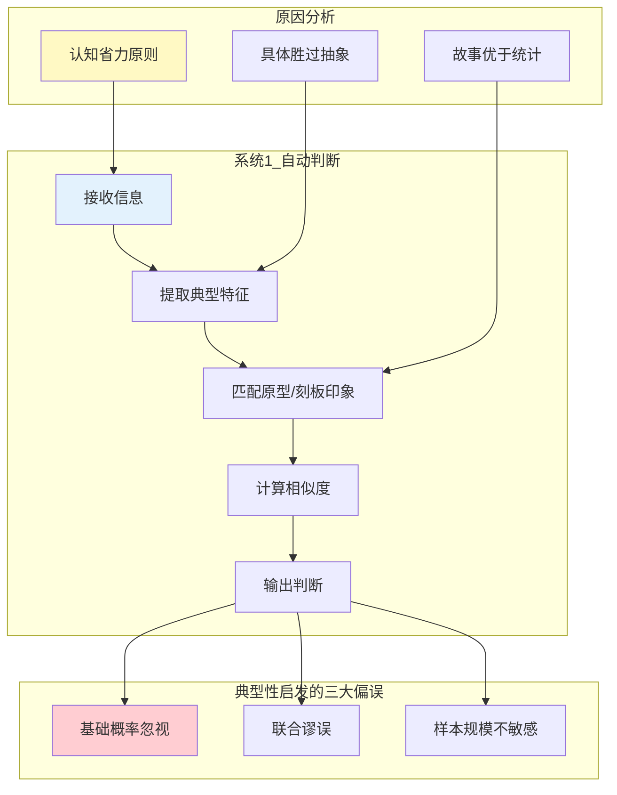
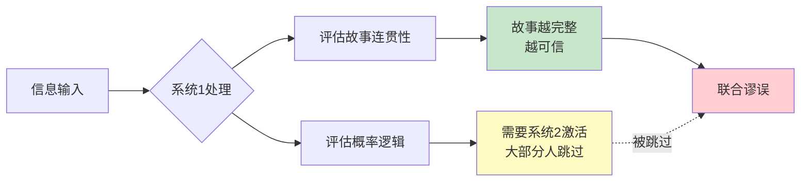
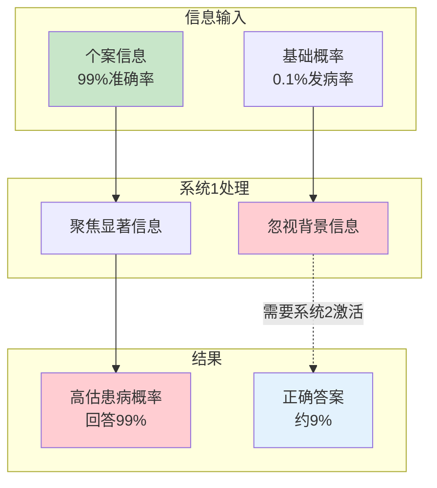
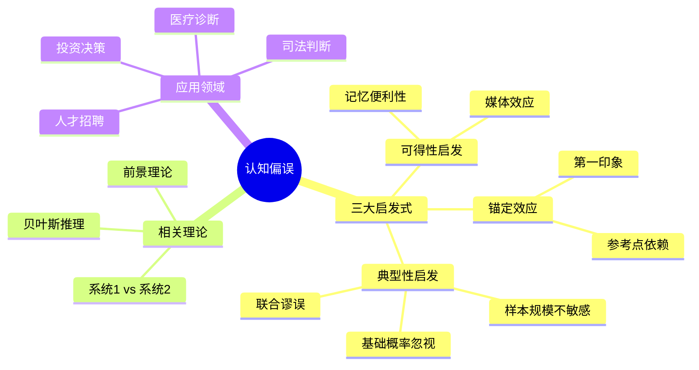

# 第14章 典型性启发式

## 📍 章节定位

### 全书位置
> 本章深入探讨卡尼曼和特沃斯基提出的最重要认知偏误之一——典型性启发式（Representativeness Heuristic）。揭示人类如何依赖"表象相似性"而非"统计概率"进行判断，导致系统性决策错误。

- **全书核心问题**: 为什么人类的直觉判断经常出错？
- **本章回答的问题**: 为什么我们过度依赖相似性判断而忽视基础概率？
- **角色类型**: 核心概念型（阐述三大启发式之一）
- **论证位置**: 认知偏误理论的支柱章节，与"可得性启发式"、"锚定效应"并列为三大经典启发式

### 章节序列

| 方向 | 章节标题 | 逻辑连接 |
|------|----------|----------|
| 前章 | [[第10章-小数法则]] | 小数法则是典型性启发的认知根源 |
| 并列 | [[第12章-可得性启发式]] | 三大启发式之二：典型性 vs 可得性 |
| 后续 | [[第7章-跳跃到结论的机器]] | 系统1如何快速得出错误结论 |
| 整书 | [[思考快与慢-丹尼尔·卡尼曼-拆解记录]] | 行为经济学核心理论基石 |

### 一句话定位
> 典型性启发式揭示了人类大脑的出厂设置bug：我们用"看起来像什么"替代"实际是什么"，用故事替代统计，用表象替代概率。

---

## 🎯 核心观点

### 观点1：典型性启发式的本质——用相似性替代概率

#### 【表层】现象层

**经典实验：琳达问题（Linda Problem）**

卡尼曼和特沃斯基设计了一个著名的实验：

> 琳达31岁，单身，直言不讳，非常聪明。她主修哲学，作为学生时非常关心歧视和社会公正问题，还参加了反核示威游行。
> 
> 问题：琳达更可能是：
> - A. 银行柜员
> - B. 银行柜员且积极参加女权运动

**实验结果**：
- 85%-90%的受访者选择了B
- **正确答案**：A一定是更可能的

**为什么？**
- "银行柜员且女权主义者"是"银行柜员"的子集
- 两个条件同时满足的概率，必然小于只满足一个条件的概率
- 这是概率论的基本定律：P(A∩B) ≤ P(A)

**人们为什么会错？**
- 琳达的描述太像"女权主义者"了
- 系统1自动匹配"典型特征" → 忽略概率逻辑
- 故事越完整、越符合刻板印象，就越被信任

---

**出租车问题（Taxicab Problem）**

> 一辆出租车在夜间肇事逃逸。城市有两家出租车公司：绿色和蓝色。
> - 城市中85%的出租车是绿色的，15%是蓝色的
> - 一位目击者确认出租车是蓝色的
> - 法院在相同条件下测试目击者，发现他正确识别每种颜色的概率是80%，错误概率是20%
> 
> 问题：肇事出租车是蓝色的概率是多少？

**大多数人回答**：70%-80%

**正确答案（贝叶斯定理）**：41%

```
正确计算：
- 蓝车被正确识别为蓝车：15% × 80% = 12%
- 绿车被错误识别为蓝车：85% × 20% = 17%
- 目击者说"蓝车"的总概率：12% + 17% = 29%
- 真正是蓝车的概率：12% ÷ 29% ≈ 41%
```

**为什么人们高估？**
- 目击者的证词"看起来很可信"（80%准确率）
- 人们忽视了基础概率（只有15%的蓝车）
- 系统1聚焦于"代表性信息"，忽略"统计背景"

#### 【中层】机制层

**典型性启发的心理机制**：



**核心机制解释**：

| 机制 | 描述 | 后果 |
|------|------|------|
| 相似度替代概率 | 用"看起来像"替代"实际是" | 刻板印象主导判断 |
| 故事性偏好 | 完整故事 > 统计数据 | 琳达问题错误 |
| 具体性效应 | 具体案例 > 抽象概率 | 基础概率被忽视 |
| 认知吝啬 | 系统1省力，系统2懒惰 | 不愿做贝叶斯计算 |

#### 【底层】规律层

> **典型性启发定律**：当需要判断一个物体或事件属于某个类别的概率时，人们会用它与该类别原型的相似程度来替代实际概率计算。这种替代导致对基础概率的系统性忽视，以及对联合事件的概率高估。

**降维翻译**：
> 你的大脑有个出厂bug：
> 看到"戴眼镜的书生"，就判断他是教授——
> 忘了世界上农民比教授多100倍。
> 
> 相似性 ≠ 概率
> 故事性 ≠ 真实性
> 具体性 ≠ 准确性

---

### 观点2：联合谬误——为什么"越详细越可信"是个坑

#### 【表层】现象层

**联合谬误的定义**：
- 两个事件同时发生的概率，一定小于或等于任一事件单独发生的概率
- 但人们常常认为"更详细的描述"更可能为真

**日常案例**：

| 常见判断 | 数学真相 | 为什么会错 |
|----------|----------|------------|
| "他一定是北大毕业的程序员"更可信 | "他是程序员"更可能 | 细节增加了故事感 |
| "她一定是被家暴后出轨的"更可信 | "她出轨了"更可能 | 叙事因果链完整 |
| "一定是AI取代人类导致失业"更可信 | "技术变革导致失业"更可能 | 复杂解释更有说服力 |

**营销应用**：
- "这款产品能让你7天瘦10斤，而且不反弹" → 比"能减肥"更可信
- 实际上，两个承诺同时成立的概率 < 任一承诺单独成立的概率

#### 【中层】机制层

**联合谬误的心理根源**：



**认知科学解释**：
1. **一致性幻觉**：详细的描述创造了内部一致性，让人感觉"可信"
2. **代表性陷阱**：细节越符合刻板印象，越被判断为"典型"
3. **系统2懒惰**：检查概率逻辑需要激活系统2，大多数人不会

#### 【底层】规律层

> **联合谬误定律**：人们在判断概率时，会错误地认为"更详细的描述"更可能为真，违反了概率论的基本公理——联合概率永远小于边际概率。

**降维翻译**：
> 细节越多，故事越完整，你就越相信——
> 这是大脑的bug，不是真相的证明。
> 
> "他偷了钱还撒谎"的概率，
> 一定小于"他偷了钱"的概率。
> 但你的直觉告诉你相反的答案。

---

### 观点3：基础概率忽视——为什么统计不如故事打动人

#### 【表层】现象层

**医学诊断问题**：

> 一种疾病的发病率是0.1%（每1000人中有1人患病）。
> 一种检测方法有99%的准确率（患病者99%检测为阳性，健康者99%检测为阴性）。
> 
> 问题：如果一个人检测为阳性，他真正患病的概率是多少？

**大多数人回答**：99%

**正确答案**：约9%

```
正确计算（贝叶斯定理）：
- 1000人中，真正患病者：1人
- 1000人中，检测为阳性的健康者：999 × 1% ≈ 10人
- 总阳性结果：1 + 10 = 11人
- 真正患病者占阳性结果的比例：1 ÷ 11 ≈ 9%
```

**为什么差这么多？**
- 人们聚焦于"99%准确率"这个代表性信息
- 完全忽视了"0.1%发病率"这个基础概率
- 当疾病很罕见时，即使检测很准确，假阳性也会远超真阳性

#### 【中层】机制层

**基础概率忽视的认知机制**：



**为什么基础概率被忽视？**

| 原因 | 解释 | 例子 |
|------|------|------|
| 显著性差异 | 个案信息更"显眼" | 99%比0.1%更引人注目 |
| 因果直觉 | 人们偏好因果推理 | "检测为阳性"→"因为患病" |
| 认知省力 | 基础概率需要额外计算 | 系统2不愿意启动 |
| 情感距离 | 统计数字缺乏情感 | 故事比数据更动人 |

#### 【底层】规律层

> **基础概率忽视定律**：当个案信息（代表性证据）与基础概率（统计背景）同时存在时，人们会过度依赖个案信息，系统性低估基础概率的影响。这种偏误在医疗诊断、司法判断、投资决策等领域造成严重后果。

**降维翻译**：
> 医生说检测99%准确，你就觉得自己完了——
> 忘了你得这病的概率本来只有千分之一。
> 
> 稀有事件 + 高准确率检测 ≠ 高患病概率
> 这道数学题，直觉永远答错。

---

## 💬 降维翻译总结

### 核心概念翻译表

| 原表达 | 降维表达 | 翻译技巧 |
|--------|----------|----------|
| "典型性启发式" | "看起来像什么就是什么" | 用行为替代术语 |
| "联合谬误" | "越详细越信" | 用现象替代概念 |
| "基础概率忽视" | "忘了大环境" | 用场景替代抽象 |
| "贝叶斯更新" | "根据新证据调整判断" | 用操作替代公式 |
| "表征相似性" | "第一印象匹配" | 用感知替代认知 |

### 一句话降维金句

> **典型性启发 = 用"看起来像"替代"实际是"**
> 
> 你的大脑有个bug：
> 看到"书生相"，就判断是教授——
> 忘了农民比教授多100倍。
> 
> 故事越完整，你就越信——
> 忘了细节越多，概率越低。
> 
> 这是出厂设置，不是你的错。
> 但知道了，就能打补丁。

---

## ✨ 金句库

### 原书金句（权威建立）

1. "代表性启发式是人们判断概率的主要模式之一。"
2. "人们倾向于根据事物与原型的相似程度来判断其类别归属。"
3. "基础概率往往被忽视，即使它们被明确告知。"
4. "联合概率永远小于边际概率，但直觉告诉我们相反的答案。"
5. "直觉是一种识别，而不是计算。"

### 降维金句（人话版）

1. **"看起来像 ≠ 实际是"**——典型性启发的第一定律
2. **"细节越多，概率越低，但你越信"**——联合谬误的本质
3. **"忘了大环境，只盯小概率"**——基础概率忽视的后果
4. **"故事打败数据，具体打败抽象"**——系统1的运作规则
5. **"你的直觉在概率问题上，永远答错"**——接受这个事实
6. **"刻板印象：快速判断，精准翻车"**——典型性启发的双刃剑
7. **"统计学告诉你有多少概率，直觉告诉你像不像"**——两种判断体系
8. **"大脑出厂设置：相似性 = 概率"**——这是bug，不是功能

## 🔗 当下映射

### 💰 财富维度

| 场景 | 典型性陷阱 | 理性应对 |
|------|------------|----------|
| **选股** | "这公司看起来很有科技感，一定是好股票" | 查看财务数据、行业基础概率 |
| **风投** | "创始人很像乔布斯，一定能成功" | 创业成功率只有5%，不以貌取人 |
| **保险** | "我身体看起来很健康，不需要保险" | 疾病基础概率不看个人感觉 |
| **买房** | "这小区看起来很高端，一定保值" | 查看区域成交数据、价格走势 |

**投资警示**：
> 不要被"典型成功故事"迷惑——
> 每一个成功案例背后，有99个失败者。
> 你看到的"典型"，是幸存者偏差筛选过的。

### 💼 职场维度

| 场景 | 典型性陷阱 | 理性应对 |
|------|------------|----------|
| **招聘** | "候选人气质很像我们，一定合适" | 基于数据评估能力，减少刻板印象 |
| **晋升** | "他看起来很有领导气质" | 考察实际业绩和管理基础概率 |
| **合作** | "这人看起来很靠谱" | 查看历史合作记录，不凭第一印象 |
| **面试** | "面试表现很好，一定能胜任" | 面试预测工作表现的相关性只有0.3 |

**职场警示**：
> 面试表现"典型优秀" ≠ 工作表现"实际优秀"
> 
> 亚马逊贝佐斯说：
> "我面试过很多人，后来发现面试表现和工作表现几乎没有关系。"

### 🏠 生活维度

| 场景 | 典型性陷阱 | 理性应对 |
|------|------------|----------|
| **医疗** | "检测阳性，我一定病了" | 问医生：基础发病率是多少？假阳性率？ |
| **交友** | "他看起来很像好人" | 观察长期行为，不凭第一印象 |
| **教育** | "孩子看起来很聪明，不用努力" | 刻苦学习的成功概率更高 |
| **消费** | "广告里的人用了效果很好" | 查看大样本统计，不看典型案例 |

### 72小时行动计划

1. **明天可以做的第一件事**：
   - 当你对某人或某事做判断时，问自己："我是在用'看起来像'还是'数据证明'？"

2. **本周内可以尝试的事**：
   - 找一个你最近基于"感觉"做的决定，用基础概率重新评估

3. **长期培养的能力**：
   - 学习贝叶斯思维：先问"基础概率是多少？"再问"新证据是什么？"

---

## 🕸️ 章节关联

### 与整书的关联

| 维度 | 关联内容 |
|------|----------|
| **系统1/系统2理论** | 典型性启发是系统1的自动判断，需要系统2才能纠正 |
| **认知偏误系列** | 三大启发式之一（典型性、可得性、锚定） |
| **前景理论** | 概率感知偏误影响风险决策 |

### 与其他章节的关联

| 章节 | 关联类型 | 共同逻辑 |
|------|----------|----------|
| [[第10章-小数法则]] | 认知根源 | 小数法则是典型性启发的统计学基础 |
| [[第12章-可得性启发式]] | 并列关系 | 三大启发式之二：记忆便利性 vs 相似性判断 |
| [[第7章-跳跃到结论的机器]] | 机制解释 | 典型性是"跳跃到结论"的主要方式 |
| [[第6章-常态错觉]] | 认知陷阱 | WYSIATI（所见即全部）导致典型性偏误 |

### 跨书关联

| 书籍 | 关联概念 | 关联类型 |
|------|----------|----------|
| [[清醒思考的艺术-多贝里-拆解记录]] | 基础概率忽视 | 理论→应用 |
| [[黑天鹅-塔勒布-拆解记录]] | 叙事谬误 | 互补视角 |
| [[影响力-西奥迪尼-拆解记录]] | 社会认同 | 偏误被利用 |
| [[错误的行为-理查德·塞勒-拆解记录]] | 心理账户 | 同源理论 |

### 知识网络图



---

## ❓ 问答设计

### Q1: 什么是典型性启发式？
**认知层次**: 记忆 | **难度**: 低
**答案要点**:
- 人们用"相似性"替代"概率"进行判断的思维捷径
- 通过比较事物与原型的相似程度来判断类别
- 导致忽视基础概率，犯联合谬误

### Q2: 为什么琳达问题大多数人会答错？
**认知层次**: 理解 | **难度**: 中
**答案要点**:
- 琳达的描述太符合"女权主义者"的刻板印象
- 系统1自动匹配典型特征，忽略概率逻辑
- "银行柜员且女权主义者"的联合概率一定小于"银行柜员"单独的概率

### Q3: 医疗诊断中如何避免基础概率忽视？
**认知层次**: 应用 | **难度**: 中
**答案要点**:
- 主动询问疾病的基础发病率
- 用贝叶斯思维：基础概率 × 检测准确率
- 稀有疾病即使检测阳性，真阳性概率也可能很低

### Q4: 典型性启发与系统1/系统2的关系？
**认知层次**: 分析 | **难度**: 中
**答案要点**:
- 典型性启发是系统1的自动判断模式
- 正确的概率计算需要系统2激活
- 系统2懒惰，大多数人不会主动启动

### Q5: 联合谬误的数学本质是什么？
**认知层次**: 分析 | **难度**: 高
**答案要点**:
- 联合概率 P(A∩B) 永远小于或等于边际概率 P(A) 或 P(B)
- 两个条件同时满足的概率，必然小于只满足一个条件的概率
- 细节越多，联合条件越多，概率越低

### Q6: 如何用贝叶斯思维对抗典型性启发？
**认知层次**: 应用 | **难度**: 高
**答案要点**:
- 先问：基础概率是多少？（先验概率）
- 再问：新证据的强度如何？（似然比）
- 最后：更新后的概率是多少？（后验概率）
- 公式：P(H|E) = P(E|H) × P(H) / P(E)

### Q7: 典型性启发在投资中有哪些陷阱？
**认知层次**: 应用 | **难度**: 中
**答案要点**:
- 被"典型成功案例"迷惑，忽视失败率
- 根据"公司形象"而非"财务数据"选股
- 相信"创始人故事"而非"行业成功率"

### Q8: 典型性启发在进化中的积极意义？
**认知层次**: 评价 | **难度**: 高
**答案要点**:
- 原始环境中，快速模式识别有助于生存
- 区分"安全vs威胁"需要典型性判断
- 节省认知资源，快速做出反应
- 但在复杂的现代社会中失效

---

## 🔍 信息来源与质量评级

### MCP检索记录

| 轮次 | 检索内容 | 质量评级 | 核心来源 |
|------|----------|----------|----------|
| 第一轮 | Representativeness Heuristic Wikipedia | ⭐⭐⭐ | Wikipedia、学术论文 |
| 第二轮 | Kahneman Tversky 经典实验 | ⭐⭐⭐ | 原书、学术文献 |
| 第三轮 | 基础概率忽视应用案例 | ⭐⭐ | 行为经济学教材 |

### 整合方式
- **理论框架**：⭐⭐⭐ Wikipedia、原书、学术论文
- **经典案例**：⭐⭐⭐ 琳达问题、出租车问题、医疗诊断
- **应用延伸**：⭐⭐ 投资决策、医疗诊断、人才招聘

---

*拆解日期：2026-02-28*
*拆解方法：[[系统化拆解方法论]]*
*拆解模式：标准模式*
*参考来源：Kahneman & Tversky (1972, 1973, 1983), Wikipedia*
