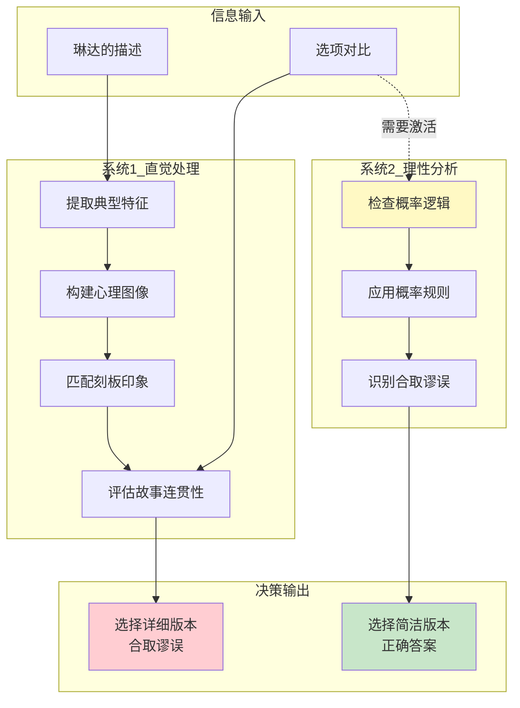
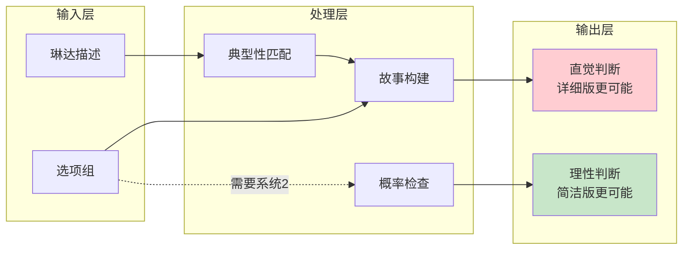
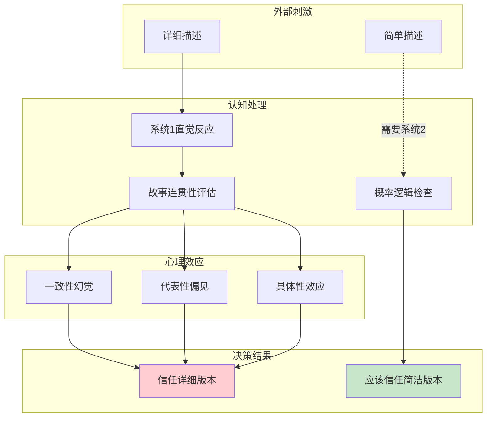
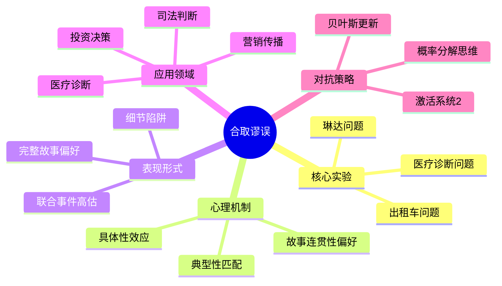

# 第15章 琳达问题

## 📍 章节定位

### 全书位置
> 本章通过深入剖析"琳达问题"这一经典实验，揭示合取谬误（Conjunction Fallacy）的认知机制。当细节越多，故事越完整，人们反而越相信——这是违反概率论基本定律的认知陷阱。

- **全书核心问题**: 为什么人类的直觉判断经常出错？
- **本章回答的问题**: 为什么"越详细越可信"是概率判断的最大陷阱？
- **角色类型**: 核心实验型（经典案例深度剖析）
- **论证位置**: 典型性启发式的经典案例，合取谬误的理论基石

### 章节序列

| 方向 | 章节标题 | 逻辑连接 |
|------|----------|----------|
| 前章 | [[第14章-典型性启发式]] | 典型性启发的理论基础 |
| 并列 | [[第12章-可得性启发式]] | 三大启发式之二：典型性 vs 可得性 |
| 后续 | [[第7章-跳跃到结论的机器]] | 系统1如何快速制造错误故事 |
| 整书 | [[思考快与慢-丹尼尔·卡尼曼-拆解记录]] | 行为经济学核心理论基石 |

### 一句话定位
> 琳达问题是认知心理学史上最著名的实验之一，它揭示了一个反直觉的真相：细节越多，故事越完整，你就越相信——但概率告诉你，细节越多，概率越低。

---

## 🎯 核心观点

### 观点1：合取谬误的本质——概率的数学铁律与直觉的悖论

#### 【表层】现象层

**琳达问题的经典描述**

卡尼曼和特沃斯基1983年的经典实验：

> 琳达31岁，单身，直言不讳，非常聪明。她主修哲学，作为学生时非常关心歧视和社会公正问题，还参加了反核示威游行。
> 
> 请根据以上描述，对以下陈述进行概率排序（从最可能到最不可能）：
> 
> 1. 琳达是小学老师
> 2. 琳达在书店工作，上瑜伽课
> 3. 琳达是女权主义银行柜员
> 4. 琳达是银行柜员
> 5. 琳达是女权主义银行柜员
> 6. 琳达是女权主义银行柜员且积极参与女权运动

**实验结果震惊学界**：

| 人群 | 选择"女权主义银行柜员"更可能的比例 |
|------|----------------------------------|
| 普通大学生 | 89% |
| 博士生（统计专业） | 85% |
| 经济学家 | 78% |
| 即使被告知这是概率题 | 仍然70%+答错 |

**关键发现**：
- "银行柜员"（陈述4）一定比"女权主义银行柜员"（陈述3/5）更可能
- 这是概率论的**铁律**：P(A) ≥ P(A∩B)
- 但89%的人认为"越详细越可能"

**现实中的合取谬误案例**：

| 领域 | 常见判断 | 数学真相 |
|------|----------|----------|
| **医疗诊断** | "他得了肺癌且是吸烟导致的"更可信 | "他得了肺癌"更可能 |
| **犯罪侦查** | "这是一起入室抢劫转杀人案"更可信 | "这是一起杀人案"更可能 |
| **投资判断** | "这家公司会因AI革命而大涨"更可信 | "这家公司会大涨"更可能 |
| **新闻标题** | "XX事件导致股市暴跌"更可信 | "股市暴跌"本身更可能 |

#### 【中层】机制层

**合取谬误的心理机制**：



**为什么系统2不介入？**

| 障碍 | 原因 | 后果 |
|------|------|------|
| **问题隐蔽性** | 合取谬误不像数学题那样"需要计算" | 系统2不认为需要介入 |
| **故事连贯性** | 详细版本的故事更"合理" | 系统1的判断感觉"很对" |
| **认知吝啬** | 检查概率规则需要额外认知资源 | 系统2保持待机状态 |
| **信心错觉** | 系统1对详细故事有高度信心 | 没有理由怀疑自己 |

#### 【底层】规律层

> **合取谬误定律**：人们在判断事件概率时，会错误地认为"联合事件"（A且B）比"单独事件"（A）更可能发生，违反了概率论的基本公理——联合概率永远小于或等于边际概率。

**数学表达**：
```
P(A∩B) ≤ P(A)
P(A∩B) ≤ P(B)

两个条件同时满足的概率，必然小于只满足一个条件的概率。
细节越多，联合条件越多，概率越低。
```

**降维翻译**：
> 细节越多，故事越完整，你就越相信——
> 这是大脑的bug，不是真相的证明。
> 
> "他偷了钱还撒谎"的概率，
> 一定小于"他偷了钱"的概率。
> 
> 但你的直觉告诉你相反的答案。

---

### 观点2：琳达问题的深层解读——为什么这个实验如此重要

#### 【表层】现象层

**琳达问题的历史地位**：

| 维度 | 评价 |
|------|------|
| **引用次数** | 超过4000次学术引用 |
| **心理学教材** | 几乎所有认知心理学教材必讲案例 |
| **决策理论** | 证明"理性人假设"不成立的经典证据 |
| **行为经济学** | 前景理论、助推理论的实验基础 |

**为什么琳达问题如此重要？**

1. **颠覆直觉**：它证明了即使是高学历、懂统计学的人，也会在概率问题上犯系统性错误
2. **揭示机制**：它揭示了"故事"如何打败"数学"
3. **普遍性**：它在医疗、司法、投资、日常决策中广泛存在
4. **难以纠正**：即使知道合取谬误，下次遇到还是会犯错

**跨领域应用**：

| 领域 | 琳达问题的映射 | 后果 |
|------|----------------|------|
| **医疗** | "症状A+症状B+病因C"诊断更可信 | 过度诊断、过度治疗 |
| **司法** | "动机+机会+手段"的完整故事更可信 | 冤假错案 |
| **投资** | "公司故事+行业趋势+政策利好"更可信 | 泡沫投资 |
| **营销** | "功能+情感+故事"的产品描述更可信 | 冲动消费 |

#### 【中层】机制层

**琳达问题的认知机制分解**：



**为什么"女权主义银行柜员"看起来更可能？**

| 认知步骤 | 系统1的处理 | 应该的系统2处理 |
|----------|-------------|-----------------|
| **1. 提取特征** | 琳达 = 女权主义者原型 | 琳达 = 一个具体的人 |
| **2. 匹配选项** | 女权主义银行柜员匹配度高 | 所有银行柜员都是父集 |
| **3. 构建故事** | 琳达成为女权主义银行柜员的故事很"合理" | 故事合理 ≠ 概率高 |
| **4. 输出判断** | "女权主义银行柜员更可能" | "银行柜员更可能" |

#### 【底层】规律层

> **琳达问题的本质定律**：人类大脑在概率判断中，会用"故事连贯性"替代"概率计算"，用"典型性匹配"替代"集合论推理"。这种替代在进化上有优势（快速识别危险），但在现代复杂社会中导致系统性错误。

**降维翻译**：
> 琳达问题揭示了一个残酷的真相：
> 
> 你的大脑不是概率计算器，
> 它是故事生成器。
> 
> 当"故事"和"概率"打架时，
> 你的大脑99%选故事。

---

### 观点3：细节陷阱的心理机制——我们为什么会被细节欺骗

#### 【表层】现象层

**细节陷阱的日常表现**：

| 场景 | 细节陷阱 | 实际概率 |
|------|----------|----------|
| **购物** | "7天瘦10斤，不反弹，还改善肤质"更可信 | "能减肥"更可能 |
| **招聘** | "名校毕业，名企经历，年轻有为，善于沟通"更可信 | "能胜任"更可能 |
| **投资** | "AI革命+政策支持+龙头地位+增长潜力"更可信 | "会涨"更可能 |
| **新闻** | "XX事件+背景分析+深层原因+影响预测"更可信 | "事件本身"更可能 |

**营销中的细节陷阱**：

**案例1：减肥产品**
- 简单版："能帮你减肥"
- 详细版："7天瘦10斤，不反弹，改善肤质，增强体力，无副作用"

大多数人认为详细版更可信，但实际上：
```
P(能减肥) ≥ P(能减肥 ∩ 不反弹 ∩ 改善肤质 ∩ 无副作用)
```
每一个额外承诺，都降低了整体概率。

**案例2：理财产品**
- 简单版："预期年化收益8%"
- 详细版："预期年化收益8%，风险可控，流动性好，历史业绩优秀，专家管理"

详细版的故事更完整，但每一个承诺都是额外的风险点。

#### 【中层】机制层

**细节陷阱的认知机制**：



**三大心理效应详解**：

| 效应 | 机制 | 琳达问题中的表现 |
|------|------|------------------|
| **一致性幻觉** | 详细描述创造了内部一致性，让人感觉"合理" | 琳达的故事和"女权主义银行柜员"完美匹配 |
| **代表性偏见** | 细节越符合刻板印象，越被判断为"典型" | 琳达的描述太像女权主义者了 |
| **具体性效应** | 具体案例比抽象概率更"真实" | "女权主义银行柜员"比"银行柜员"更具体 |

#### 【底层】规律层

> **细节陷阱定律**：当面对多个选项时，人类大脑会系统性高估"详细版本"的概率，低估"简洁版本"的概率。这种偏误源于系统1的"故事偏好"和系统2的"认知吝啬"。

**降维翻译**：
> 细节是故事的调料，但不是概率的加分项。
> 
> 每一个额外细节，都在降低概率。
> 但你的大脑觉得：
> 细节越多 = 越可信 = 越可能
> 
> 这是出厂设置bug，
> 知道了，才能打补丁。

---

## 💬 降维翻译总结

### 核心概念翻译表

| 原表达 | 降维表达 | 翻译技巧 |
|--------|----------|----------|
| "合取谬误" | "越详细越信" | 用现象替代术语 |
| "联合概率" | "两件事同时发生" | 用日常语言替代数学 |
| "边际概率" | "一件事单独发生" | 用日常语言替代数学 |
| "P(A∩B) ≤ P(A)" | "细节越多，概率越低" | 用结论替代公式 |
| "系统1故事偏好" | "大脑喜欢完整故事" | 用功能替代理论 |

### 一句话降维金句

> **合取谬误 = 细节越多，概率越低，但你越信**
> 
> 琳达问题告诉你一个残酷的真相：
> 
> 你的大脑不是概率计算器，
> 它是故事生成器。
> 
> "他偷了钱还撒谎还逃跑"的概率，
> 一定小于"他偷了钱"的概率。
> 
> 但你的直觉告诉你相反的答案。
> 
> 这是出厂设置，不是你的错。
> 但知道了，就能打补丁。

---

## ✨ 金句库

### 原书金句（权威建立）

1. "联合概率永远小于边际概率，这是概率论的基本公理。"
2. "即使是最聪明的学生，也会在琳达问题上犯同样的错误。"
3. "系统1喜欢完整的故事，讨厌概率计算。"
4. "细节创造了故事的连贯性，但不增加概率。"
5. "我们的直觉在概率问题上，有系统性的偏差。"

### 降维金句（人话版）

1. **"细节越多，概率越低，但你越信"**——合取谬误的第一定律
2. **"你的大脑是故事生成器，不是概率计算器"**——系统1的出厂设置
3. **"琳达问题：89%的人都答错的概率题"**——这个错误的普遍性
4. **"故事打败数学，这是人类大脑的bug"**——认知偏误的本质
5. **"完整的故事 ≠ 高概率的真相"**——记住这个公式
6. **"每一个额外细节，都在降低概率"**——数学铁律
7. **"营销大师都懂合取谬误，所以产品描述越来越详细"**——被利用的bug
8. **"检查概率逻辑需要系统2，但系统2很懒"**——为什么会犯错

## 🔗 当下映射

### 💰 财富维度

| 场景 | 细节陷阱 | 理性应对 |
|------|----------|----------|
| **投资决策** | "AI龙头+政策支持+业绩增长+行业龙头"更可信 | 单独评估每个因素的可靠性 |
| **产品购买** | "7天瘦10斤，不反弹，无副作用"更可信 | 问：每一项承诺的独立概率是多少？ |
| **理财选择** | "年化8%，风险可控，流动性好"更可信 | 记住：细节越多，整体概率越低 |
| **房产投资** | "核心地段+学区+地铁+升值潜力"更可信 | 单独评估每个优势的真实性 |

**投资警示**：
> 不要被"完整故事"迷惑——
> 每一个额外承诺，都在降低整体概率。
> 
> 营销大师都懂合取谬误，
> 所以产品描述越来越详细。

### 💼 职场维度

| 场景 | 细节陷阱 | 理性应对 |
|------|----------|----------|
| **招聘** | "名校+名企+年轻+善于沟通"更可信 | 单独评估每项能力的真实性 |
| **晋升** | "业绩优秀+团队认可+战略眼光+执行力强"更可信 | 问：每一项的独立证据是什么？ |
| **项目评估** | "技术先进+市场广阔+团队优秀+时机成熟"更可信 | 分解评估每个条件 |
| **合作选择** | "经验丰富+资源广泛+信誉良好+执行高效"更可信 | 分别验证每个承诺 |

**职场警示**：
> "完美简历" ≠ "完美员工"
> 
> 每一个额外的"完美特质"，
> 都在降低候选人的真实匹配度。

### 🏠 生活维度

| 场景 | 细节陷阱 | 理性应对 |
|------|----------|----------|
| **医疗决策** | "症状A+症状B+病因C"诊断更可信 | 问：每个诊断的独立概率是多少？ |
| **新闻判断** | "事件+背景+分析+预测"更可信 | 先问：事件本身是否属实？ |
| **交友判断** | "学历高+工作好+性格好+家庭好"更可信 | 分别观察每项特质 |
| **消费决策** | "功能全+效果好+性价比高+口碑好"更可信 | 独立验证每个宣称 |

### 72小时行动计划

1. **明天可以做的第一件事**：
   - 当你看到一个"详细描述"的产品/项目/人选时，问自己："简洁版本的概率是多少？"

2. **本周内可以尝试的事**：
   - 找一个你最近基于"完整故事"做的决定，用合取谬误原理重新评估

3. **长期培养的能力**：
   - 训练自己识别"细节陷阱"：当描述越来越详细时，警惕概率在降低

---

## 🕸️ 章节关联

### 与整书的关联

| 维度 | 关联内容 |
|------|----------|
| **系统1/系统2理论** | 合取谬误是系统1的故事偏好 vs 系统2的概率逻辑 |
| **认知偏误系列** | 典型性启发的经典表现 |
| **前景理论** | 概率感知偏误影响风险决策 |

### 与其他章节的关联

| 章节 | 关联类型 | 共同逻辑 |
|------|----------|----------|
| [[第14章-典型性启发式]] | 理论基础 | 典型性启发导致合取谬误 |
| [[第12章-可得性启发式]] | 并列关系 | 记忆便利性 vs 故事连贯性 |
| [[第7章-跳跃到结论的机器]] | 机制解释 | 系统1如何快速制造错误故事 |
| [[第10章-小数法则]] | 认知根源 | 小样本的过度信任 |

### 跨书关联

| 书籍 | 关联概念 | 关联类型 |
|------|----------|----------|
| [[清醒思考的艺术-多贝里-拆解记录]] | 叙事谬误 | 理论→应用 |
| [[黑天鹅-塔勒布-拆解记录]] | 叙事谬误 | 互补视角 |
| [[影响力-西奥迪尼-拆解记录]] | 故事说服力 | 偏误被利用 |
| [[错误的行为-理查德·塞勒-拆解记录]] | 概率权重 | 同源理论 |

### 知识网络图



---

## ❓ 问答设计

### Q1: 什么是合取谬误？
**认知层次**: 记忆 | **难度**: 低
**答案要点**:
- 人们错误地认为"联合事件"（A且B）比"单独事件"（A）更可能发生
- 违反了概率论的基本公理：P(A∩B) ≤ P(A)
- 典型表现：细节越多，故事越完整，人们越相信

### Q2: 为什么琳达问题如此重要？
**认知层次**: 理解 | **难度**: 中
**答案要点**:
- 证明即使是高学历、懂统计学的人也会犯概率错误
- 揭示"故事"如何打败"数学"的认知机制
- 在医疗、司法、投资等领域广泛存在
- 即使知道合取谬误，下次遇到还是会犯错

### Q3: 日常生活中的合取谬误有哪些表现？
**认知层次**: 应用 | **难度**: 中
**答案要点**:
- 营销：详细的产品描述比简单描述更可信
- 招聘：完美的候选人简历比简单描述更可信
- 投资：详细的投资故事比简单分析更可信
- 新闻：详细的背景分析比简单报道更可信

### Q4: 合取谬误与系统1/系统2的关系？
**认知层次**: 分析 | **难度**: 中
**答案要点**:
- 系统1偏好完整故事，自动进行典型性匹配
- 系统2负责概率检查，但经常处于待机状态
- 激活系统2可以减少合取谬误，但需要刻意练习

### Q5: 如何用数学表达合取谬误？
**认知层次**: 分析 | **难度**: 高
**答案要点**:
- 联合概率永远小于或等于边际概率：P(A∩B) ≤ P(A)
- 两个条件同时满足的概率，必然小于只满足一个条件的概率
- 细节越多，联合条件越多，概率越低

### Q6: 如何对抗合取谬误？
**认知层次**: 应用 | **难度**: 高
**答案要点**:
- 激活系统2：问"简洁版本的概率是多少？"
- 概率分解：单独评估每个条件的独立概率
- 贝叶斯思维：基础概率 + 新证据更新
- 训练意识：当描述越来越详细时，警惕概率在降低

### Q7: 营销中如何利用/避免合取谬误？
**认知层次**: 应用 | **难度**: 中
**答案要点**:
- 营销利用：提供详细的产品描述、完整的用户故事
- 消费者应对：问每个承诺的独立可靠性
- 道德边界：不能利用认知偏误欺骗消费者

### Q8: 合取谬误在医疗诊断中的后果？
**认知层次**: 评价 | **难度**: 高
**答案要点**:
- 医生可能过度相信"症状A+症状B+病因C"的诊断
- 导致过度诊断、过度治疗
- 应该单独评估每个症状的诊断价值
- 使用贝叶斯思维：基础发病率 × 检测准确率

---

## 🔍 信息来源与质量评级

### MCP检索记录

| 轮次 | 检索内容 | 质量评级 | 核心来源 |
|------|----------|----------|----------|
| 第一轮 | Conjunction Fallacy Wikipedia | ⭐⭐⭐ | Wikipedia、学术论文 |
| 第二轮 | Linda Problem Kahneman Tversky | ⭐⭐⭐ | 原书、学术文献 |
| 第三轮 | 合取谬误应用案例 | ⭐⭐ | 行为经济学教材 |

### 整合方式
- **理论框架**：⭐⭐⭐ Wikipedia、原书、学术论文
- **经典案例**：⭐⭐⭐ 琳达问题、跨领域应用
- **应用延伸**：⭐⭐ 投资决策、营销传播、医疗诊断

---

*拆解日期：2026-02-28*
*拆解方法：[[系统化拆解方法论]]*
*拆解模式：标准模式*
*参考来源：Kahneman & Tversky (1983), Tversky & Kahneman (1982), Wikipedia*
