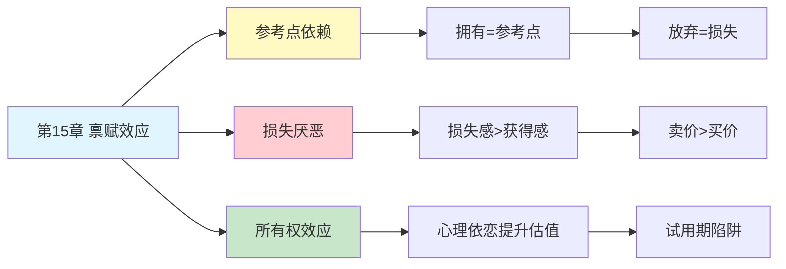

# 第15章 禀赋效应

## 📍 章节定位

### 全书位置
> 第15章深入探讨禀赋效应——人们倾向于高估自己拥有的东西，因为放弃的感觉比获得的喜悦更强烈。这是损失厌恶在日常生活中的具体表现，揭示了为什么"卖家的要价"总是高于"买家的出价"。

- **全书核心问题**: 人类的决策是如何偏离理性经济模型的？
- **本章回答的问题**: 为什么我们高估自己拥有的东西？为什么卖比买更难？
- **角色类型**: 核心概念型（损失厌恶的具体应用）
- **论证位置**: 承接第14章参考点概念，展示损失厌恶在交易中的表现

### 章节序列
| 方向 | 章节标题 | 逻辑连接 |
|------|----------|----------|
| 前章 | [[第14章-参考点和框架]] | 从参考点理论引出禀赋效应 |
| 后章 | [[第16章-概率权重]] | 从确定性效应转向概率感知 |
| 整书 | [[思考快与慢-丹尼尔·卡尼曼-拆解记录]] | 前景理论核心章节 |

### 一句话定位
> 第15章揭示了禀赋效应的本质——当你拥有某样东西时，它在你的参考点中是"已有"的，放弃它就是"损失"，而获得它只是"收益"，损失的痛苦大于收益的快乐，所以你给它标更高的价。

---

## 🎯 核心观点

### 第一层：表层案例

| 案例名称 | 简要描述 | 页码 | 关键引文 |
|----------|----------|------|----------|
| 马克杯实验 | 拥有马克杯的人要价是无杯者的两倍 | p.— | "同样的杯子，卖家的价是买家的两倍" |
| 猎人门票 | 有票的猎人不愿卖，没票的猎人不愿买 | p.— | "拥有改变价值判断" |
| 股票持有 | 亏损的股票更不舍得卖 | p.— | "持有的痛苦比割肉轻" |
| 房屋定价 | 房主对自家房子的估价偏高 | p.— | "自己的东西更值钱" |
| 试用期陷阱 | 试用后更难放弃产品 | p.— | "先拥有，再定价" |

### 第二层：中层机制

| 机制名称 | 组成要素 | 因果链条 | 证据来源 |
|----------|----------|----------|----------|
| 参考点依赖 | 当前状态 + 价值判断 | 拥有→成为参考点→放弃=损失 | 前景理论实验 |
| 损失厌恶倍率 | 损失权重 > 收益权重 | 损失感约是收益感的2倍 | 价值函数研究 |
| 所有权效应 | 心理所有权 + 价值感知 | 拥有产生依恋→提升估值 | 消费行为研究 |
| 现状偏好 | 维持现状 > 改变 | 改变意味着潜在损失 | 决策心理学 |
| 交易成本感知 | 交易摩擦 + 心理阻力 | 卖比买多一层心理负担 | 交易行为研究 |

### 第三层：底层规律

| 规律陈述 | 抽象层级 | 知识连接 | 适用范围 |
|----------|----------|----------|----------|
| 禀赋效应定律 | 行为经济学基础 | [[前景理论]], [[损失厌恶]] | 所有权与交易决策 |
| 参考点不对称原理 | 心理学基础 | [[参考点理论]], [[框架效应]] | 价值判断与决策 |
| 系统1的守恒本能 | 认知科学视角 | [[进化心理学]], [[风险规避]] | 损失相关的直觉判断 |

---

## 💬 降维翻译

### 观点1: 同样的东西，拥有后更值钱

#### 原文表达
> "禀赋效应是指人们一旦拥有某项物品，那么对该物品价值的评价要比未拥有之前大大增加。在一项经典实验中，研究者随机给一半学生发放马克杯，然后让学生自由交易。结果发现，拥有马克杯的学生对杯子的估价（卖价）是没杯子的学生（买价）的两倍。这违背了经济学的基本假设：同一物品在不同人眼中应该有相同的价值。"

> p.—

#### 降维翻译（中学生能懂）
想象一下，你和同桌面前有一个马克杯：
- 杯子在你手里：你心里想，"这杯子至少值20块吧"
- 杯子在他手里：你心里想，"这杯子10块我就买"

明明是同一个杯子，为什么你的估价会差一倍？因为你一旦拥有它，失去的感觉就很痛。

#### 日常类比（奶奶能懂）
就像你养了一只小鸡，别人来买，你总觉得它比别人家的鸡值钱。不是因为鸡真的更好，是因为你已经把它当"自己的"了，给出去像割肉。

#### 检验
- Q: 如果一个中学生问你这是什么意思？
- A: 东西一旦是你的，你就觉得它比别人认为的值钱，因为放弃它感觉像亏了。

### 观点2: 卖比买更难的心理原因

#### 原文表达
> "为什么'卖家的要价'总是高于'买家的出价'？这不仅仅是因为讨价还价的策略。更深层的心理机制是：卖方将物品视为'已有'的参考点，出售意味着放弃（损失）；而买方将物品视为'尚未拥有'，购买意味着获得（收益）。由于损失厌恶，放弃的痛苦约是获得快乐的2倍，所以卖方要价自然高于买方出价。"

> p.—

#### 降维翻译（中学生能懂）
想想你卖旧手机的时候：
- 买家出价500，你心里想："这也太低了吧，我这手机保养成这样，怎么也值800"
- 但如果你是买家，你可能会觉得："500有点贵，400差不多"

为什么换个角色，你的估价就变了？因为卖的时候你在"失去"，买的时候你在"获得"，失去的感觉比获得强烈一倍。

#### 日常类比（奶奶能懂）
就像你家的老母鸡，别人来买出价50块，你嫌少。但你如果去买别人家的鸡，50块你可能还嫌贵。东西一样，位置不同，感觉就两样。

#### 检验
- Q: 如果一个中学生问你这是什么意思？
- A: 同样的东西，卖的时候你觉得亏，买的时候你觉得贵，因为放弃的感觉比得到的感觉强烈。

### 观点3: 试用期是商家的心理陷阱

#### 原文表达
> "聪明的商家会利用禀赋效应。他们提供'免费试用'、'30天无理由退货'，表面上是给消费者保障，实际上是利用所有权效应。一旦你把商品带回家、开始使用，它就进入了你的'禀赋'，放弃它的心理成本大大增加。退货率远低于预期，正是禀赋效应在起作用。"

> p.—

#### 降维翻译（中学生能懂）
想想买东西的时候：
- 商家说："先拿回家试用7天，不喜欢可以退"
- 你想："好，反正不喜欢可以退，试试也无妨"
- 7天后：你已经用习惯了，退掉感觉很舍不得

这就是商家的套路。一旦东西在你手里，你就很难还回去。

#### 日常类比（奶奶能懂）
就像卖狗的人让你先把小狗带回家养几天。养了之后，小狗跟你熟了，你也舍不得送回去了。商人知道，东西在你手里多待一天，你就越难放手。

#### 检验
- Q: 如果一个中学生问你这是什么意思？
- A: 试用期的目的是让你产生"拥有"的感觉，一旦拥有，你就很难放弃。

---

## ✨ 金句库

### 原书金句
| 金句 | 页码 | 适用场景 |
|------|------|----------|
| "一旦拥有，价值翻倍" | p.— | 禀赋效应科普 |
| "卖家的价是买家的两倍" | p.— | 交易心理学 |
| "放弃的痛苦约是获得的快乐的2倍" | p.— | 损失厌恶解释 |
| "拥有创造依恋，依恋创造价值" | p.— | 心理所有权 |

### 降维金句
| 金句 | 来源观点 | 适用场景 |
|------|----------|----------|
| "自己的东西总比别人的值钱" | 禀赋效应本质 | 日常消费反思 |
| "卖比买更难，因为卖是失去" | 交易心理 | 购物决策 |
| "试用期是商家的心理陷阱" | 营销策略 | 消费警示 |
| "东西在你手里，就进你的心了" | 所有权效应 | 情感分析 |

## 🔗 当下映射

### 💰 财富应用
| 场景 | 具体行动 | 预期效果 | 风险提示 |
|------|----------|----------|----------|
| 投资决策 | 意识到持有股票的"禀赋溢价" | 避免因不舍得而持有亏损股 | 需要持续自我提醒 |
| 房产交易 | 理性评估自家房产的"情感溢价" | 避免定价脱离市场 | 可能低于心理预期 |
| 二手交易 | 以买家视角重新估价 | 加快成交速度 | 可能"贱卖"感 |

### 💼 职场应用
| 场景 | 具体行动 | 所需能力 | 适用职级 |
|------|----------|----------|----------|
| 谈判策略 | 理解对方的禀赋心理 | 心理洞察力 | 所有级别 |
| 薪酬谈判 | 利用"已有"的锚定效应 | 谈判技巧 | 中高级 |
| 项目交接 | 意识到放手时的心理阻力 | 情绪管理 | 管理层 |

### 🏠 生活应用
| 场景 | 具体行动 | 可行性 | 见效时间 |
|------|----------|--------|----------|
| 断舍离 | 问自己"如果我没有它，愿意花多少钱买" | 高 | 即时生效 |
| 冲动消费 | 试用期内主动归还 | 中 | 短期见效 |
| 情感决策 | 意识到"拥有的"不等于"更好的" | 中 | 长期见效 |

### 72小时行动计划
1. **明天可以做的第一件事**: 找一件你打算卖掉的东西，先问自己"如果我没有它，愿意花多少钱买"，再比较你的卖价，看看差距有多大
2. **本周内可以尝试的事**: 在一次购买决策中，问自己"如果我已经拥有它，我愿意以这个价格卖掉吗"
3. **需要准备资源才能做的事**: 建立投资"禀赋溢价"检查清单，定期审视投资组合中的"不舍得卖"的持仓

---

## 🕸️ 章节关联

### 向上关联 → 整书
- **贡献**: 揭示损失厌恶在交易中的具体表现，展示参考点依赖的实际应用
- **位置**: 承接第14章参考点概念，是前景理论的核心应用章节

### 横向关联 → 章节间
| 章节编号 | 章节标题 | 关联类型 | 连接描述 |
|----------|----------|----------|----------|
| 第14章 | 参考点和框架 | 前置 | 参考点是禀赋效应的理论基础 |
| 第16章 | 概率权重 | 延续 | 从确定性效应转向概率感知 |
| 第13章 | 拒绝风险的穷人和寻求风险的富人 | 相关 | 损失厌恶的基础表现 |
| 第4章 | 心理账户的诱惑 | 相关 | 所有权影响心理账户分类 |

### 向下关联 → 具体应用
| 应用场景 | 难度 | 前置知识 |
|----------|------|----------|
| 交易谈判 | 中 | 谈判心理学基础 |
| 投资决策 | 高 | 行为金融学 |
| 消费者行为分析 | 中 | 消费心理学 |

### 跨书关联 → 知识网络
| 书籍 | 概念 | 关系 | 备注 |
|------|------|------|------|
| [[思考快与慢-丹尼尔·卡尼曼-拆解记录]] | 禀赋效应 | 同源 | 理论来源 |
| [[助推-塞勒-拆解记录]] | 所有权效应 | 延伸 | 政策设计应用 |
| [[怪诞行为学-艾瑞里-拆解记录]] | 所有权依恋 | 相关 | 消费行为视角 |
| [[非对称风险-塔勒布-拆解记录]] | 切身利益 | 相关 | 拥有改变风险态度 |

### 关联可视化

---

## ❓ 问答设计

### Q1: [记忆型问题]
**认知层次**: 记忆
**难度**: 低
**描述**: 什么是禀赋效应？
**答案要点**:
- 拥有某物后对其价值评价大大增加
- 放弃的痛苦大于获得的快乐
- 违背经济学同物等价假设

### Q2: [理解型问题]
**认知层次**: 理解
**难度**: 中
**描述**: 为什么卖家的要价通常高于买家的出价？
**答案要点**:
- 卖家将物品视为"已有"，放弃=损失
- 买家将物品视为"未拥有"，购买=收益
- 损失厌恶导致放弃的心理成本更高

### Q3: [应用型问题]
**认知层次**: 应用
**难度**: 中
**描述**: 如何利用禀赋效应知识做出更好的投资决策？
**答案要点**:
- 意识到持有资产的"禀赋溢价"
- 以"如果我没有它，愿意花多少钱买"来评估
- 避免因不舍得而持有亏损股

### Q4: [分析型问题]
**认知层次**: 分析
**难度**: 中
**描述**: 禀赋效应与损失厌恶有什么关系？
**答案要点**:
- 禀赋效应是损失厌恶的具体表现
- 拥有使物品成为参考点
- 放弃参考点产生损失感

### Q5: [创造型问题]
**认知层次**: 创造
**难度**: 高
**描述**: 设计一个帮助人们克服禀赋效应的决策工具？
**答案要点**:
- "逆向评估"功能：以无主视角重新估价
- "损失感量化"：将不舍得转化为数字
- "冷却期提醒"：决策前的禀赋检查

### Q6: [理解型问题]
**认知层次**: 理解
**难度**: 中
**描述**: 为什么商家喜欢提供"免费试用"？
**答案要点**:
- 试用让物品进入消费者的"禀赋"
- 拥有后放弃的心理成本增加
- 退货率远低于预期

### Q7: [应用型问题]
**认知层次**: 应用
**难度**: 中
**描述**: 在断舍离时，如何减少禀赋效应的影响？
**答案要点**:
- 问自己"如果我没有它，愿意花多少钱买"
- 区分"使用价值"和"情感价值"
- 设定时间界限，过期未用则处理

### Q8: [分析型问题]
**认知层次**: 分析
**难度**: 高
**描述**: 禀赋效应如何违背传统经济学的理性假设？
**答案要点**:
- 传统经济学假设物品价值独立于拥有者
- 实际上拥有改变价值判断
- 同物不同价，违背"可替代性"原则

### Q9: [理解型问题]
**认知层次**: 高
**描述**: 禀赋效应的损失厌恶倍率是多少？
**答案要点**:
- 放弃的痛苦约是获得快乐的2倍
- 因此卖价约为买价的2倍
- 这是价值函数的斜率不对称导致的

### Q10: [创造型问题]
**认知层次**: 创造
**难度**: 高
**描述**: 如何在谈判中利用禀赋效应？
**答案要点**:
- 让对方先"拥有"谈判结果草案
- 强调对方放弃选项的损失
- 利用参考点依赖调整谈判策略

---
