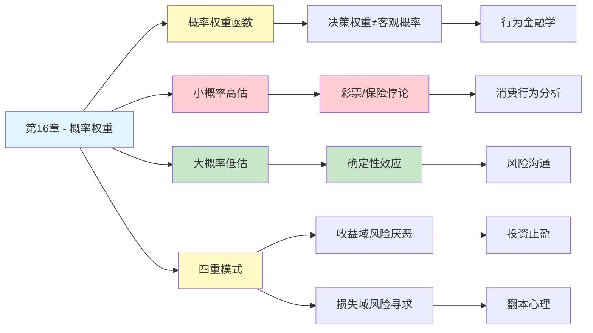

# 第16章 概率权重

## 📍 章节定位

### 全书位置
> 第16章深入探讨前景理论中的"概率权重函数"——揭示人类如何对概率进行非线性转换，我们系统性地高估小概率事件、低估大概率事件，这种"决策权重"与"客观概率"的偏离是理解彩票、保险、赌博等行为的关键。

- **全书核心问题**: 为什么人类的判断经常偏离理性？
- **本章回答的问题**: 为什么我们对概率的感知与真实概率不同？为什么小概率事件被高估、大概率事件被低估？
- **角色类型**: 核心理论型（前景理论核心机制）
- **论证位置**: 承接损失厌恶，深入前景理论的决策权重维度

### 章节序列
| 方向 | 章节标题 | 逻辑连接 |
|------|----------|----------|
| 前章 | [[第13章-拒绝风险的穷人和寻求风险的富人]] | 前章阐述损失厌恶，本章揭示概率感知的非线性特征 |
| 延伸 | 第15章 禀赋效应 | 损失厌恶的具体表现（导航显示此章在前）|
| 整书 | [[思考快与慢-丹尼尔·卡尼曼-拆解记录]] | 前景理论核心——概率权重与决策权重 |

### 一句话定位
> 第16章揭示了概率感知的核心悖论：1%不是1%，99%也不是99%——我们用"决策权重"而非"客观概率"做决定，高估小概率（买彩票）、低估大概率（不买保险），这种系统性偏差解释了人类最非理性的经济行为。

---

## 🎯 核心观点

### 第一层：表层案例
| 案例名称 | 简要描述 | 关键引文 |
|----------|----------|----------|
| 彩票悖论 | 千万分之一的中奖概率被高估，人们愿意溢价购买 | "小概率的希望被放大成确定的期待" |
| 保险购买 | 低概率灾难被高估，人们愿意溢价购买保险 | "小概率的恐惧被放大成确定的担忧" |
| 99%≠100% | 99%的胜率被低估，人们要求过高的确定性溢价 | "接近确定时，人们对残余风险过度敏感" |
| 1%≠1% | 1%的失败概率被高估，做出过激反应 | "小概率的灾难被放大成迫在眉睫的威胁" |

### 第二层：中层机制
| 机制名称 | 组成要素 | 因果链条 | 证据来源 |
|----------|----------|----------|----------|
| 概率权重函数 | 客观概率 → 决策权重 | p(客观) → w(p)(决策) → 决策 | Kahneman-Tversky前景理论实验 |
| 小概率高估 | 希望/恐惧情绪 + 可用性 | 小概率→情绪唤起→高估→过度反应 | 行为经济学实验 |
| 大概率低估 | 确定性效应 + 边际递减 | 接近100%→残余风险放大→低估 | Allais悖论实验 |
| 四重模式 | 收益/损失 × 高/低概率 | 四种情境下完全不同的风险偏好 | 前景理论整合模型 |

### 第三层：底层规律
| 规律陈述 | 抽象层级 | 知识连接 | 适用范围 |
|----------|----------|----------|----------|
| 概率权重定律 | 决策心理学核心规律 | [[第26章-前景理论]], [[行为经济学-拆解记录]] | 所有涉及概率的决策 |
| 小概率高估原则 | 认知偏误规律 | [[情感启发式]], [[可用性启发法]] | 风险评估、投资决策 |
| 确定性效应 | 心理物理学规律 | [[边际效用理论]], [[心理测量]] | 接近确定性的选择 |
| 四重模式定律 | 风险偏好规律 | [[损失厌恶-拆解记录]], [[反射效应]] | 风险决策场景 |

---

## 💬 降维翻译

### 观点1: 概率权重函数——1%不等于1%

#### 原文表达
> "人们在决策时使用的不是客观概率，而是'决策权重'。决策权重函数是一条反S形曲线：小概率被高估，大概率被低估。这意味着，1%的客观概率在决策时可能被当作5%甚至10%来对待。"

#### 降维翻译（中学生能懂）
数学上说1%就是1%，但在我们心里，1%不等于1%。

**举个栗子**：
- 中彩票概率是千万分之一（0.00001%）
- 但在你心里，这个概率可能"感觉"有千分之一（0.1%）
- 所以你愿意花2块钱去买，虽然理性说不值得

**反过来**：
- 某件事99%会成功
- 但在你心里，那1%的失败可能"感觉"有10%那么可怕
- 所以你不敢做，虽然理性说可以放手一搏

**核心结论**：我们用"感觉"代替"计算"，小概率被放大，大概率被缩小。

#### 日常类比（奶奶能懂）
就像买菜，一斤菜实际是一斤，但你心里觉得"好像不止一斤"。秤是准的，你的感觉不准。

同样的道理，概率是客观的数字，但我们心里的"感觉概率"总是走样——小概率放大，大概率缩小。

#### 检验
- Q: 如果一个中学生问你这是什么意思？
- A: 概率在你心里和纸上是两码事。小概率的事你觉得容易发生，大概率的事你觉得没那么稳。

### 观点2: 四重模式——收益和损失时的风险态度

#### 原文表达
> "风险偏好呈现出四重模式：高概率收益时风险厌恶，低概率收益时风险寻求；高概率损失时风险厌恶，低概率损失时风险寻求。这与期望效用理论的预测完全相反，但完美解释了人类的实际行为。"

#### 降维翻译（中学生能懂）
你敢不敢冒险，取决于两个因素：
1. 你是"赢"还是"输"
2. 赢面/输面是大还是小

**四种情况**：

| 情境 | 概率 | 你的选择 | 原因 |
|------|------|----------|------|
| 要赢了 | 大概率（90%） | 稳一点，落袋为安 | 怕煮熟的鸭子飞了 |
| 要赢了 | 小概率（1%） | 赌一把，万一呢 | 反正没啥可失去的 |
| 要输了 | 大概率（90%） | 赌一把，搏翻盘 | 反正输定了 |
| 要输了 | 小概率（1%） | 认赔，买个心安 | 怕万一真的发生 |

这就是为什么：
- 彩票存在（小概率收益→冒险）
- 保险存在（小概率损失→避险）
- 股票止盈（大概率收益→避险）
- 赌徒翻本（大概率损失→冒险）

#### 日常类比（奶奶能懂）
就像打牌，有四种情况：
1. 手牌好，快赢了 → 小心打，别出错
2. 手牌差，快输了 → 乱打，搏一把
3. 手牌好，但可能翻盘 → 赌一把，想赢大的
4. 手牌差，但可能翻盘 → 认输算了，别输更多

人的胆子不是固定的，看形势来变。

#### 检验
- Q: 如果一个中学生问你这是什么意思？
- A: 你敢不敢赌，取决于你觉得是"赢"还是"输"，还有赢/输的概率大小。四种情况，四种胆量。

### 观点3: 确定性效应——99%不等于100%

#### 原文表达
> "人们赋予确定性的权重远大于其客观概率。从99%到100%的心理跳跃，远大于从10%到11%的跳跃。这种对确定性的过度追求，解释了为什么人们愿意为消除最后1%的不确定性支付高昂代价。"

#### 降维翻译（中学生能懂）
99%和100%在数学上差1%，但在心里差很多很多。

**比如**：
- 99%会成功的事，你可能不敢做
- 但100%会成功的事，你就敢了

**举个例子**：
- 医生说手术99%成功 → 你还会犹豫
- 医生说手术100%成功 → 你就放心了

明明就差1%，为什么差别这么大？
- 因为那1%的"不确定性"让你焦虑
- 你愿意花大价钱消除这个"万一"

**这就是为什么**：
- 延保服务有人买（消除最后1%的风险）
- 法律合同有人审（消除最后1%的漏洞）
- 体检有人做（消除最后1%的担忧）

#### 日常类比（奶奶能懂）
就像过桥，99%安全的桥你可能不敢走，但100%安全的桥你就走了。其实两座桥几乎一样，但你心里觉得差很多。

确定性有一种"安心"的价值，这个价值不是概率算出来的，是感觉出来的。

#### 检验
- Q: 如果一个中学生问你这是什么意思？
- A: 差1%到100%，心里的差距比数学上的1%大得多。人愿意花钱买"绝对"。

---

## ✨ 金句库

### 原书金句
| 金句 | 适用场景 |
|------|----------|
| "1%的概率在决策时可能被当作5%甚至更高" | 概率权重科普 |
| "人们用决策权重而非客观概率做决定" | 行为经济学入门 |
| "确定性有一种特殊的吸引力" | 决策心理学 |
| "小概率的希望和恐惧都被过度放大" | 风险认知 |
| "从99%到100%的跳跃远大于从10%到11%" | 确定性效应 |

### 降维金句
| 金句 | 来源观点 | 适用场景 |
|------|----------|----------|
| "1%不等于1%，在你心里它可能是10%" | 概率权重函数 | 概率教育 |
| "彩票是卖'希望'的生意，保险是卖'安心'的生意" | 四重模式 | 商业洞察 |
| "99%和100%就差1%，但你愿意为这1%付很多钱" | 确定性效应 | 消费心理 |
| "小概率被放大，大概率被缩小——这是大脑的滤镜" | 概率感知偏差 | 认知科学 |
| "人的胆子不是固定的，看是赢还是输、概率大还是小" | 四重模式 | 风险决策 |

## 🔗 当下映射

### 💰 财富应用
| 场景 | 具体行动 | 预期效果 | 风险提示 |
|------|----------|----------|----------|
| 彩票购买 | 认识到"小概率高估"偏误，把买彩票当娱乐而非投资 | 减少非理性投入 | 可能错过"万一" |
| 保险配置 | 理性评估风险概率，不被营销话术恐吓 | 合理配置，不买冤枉险 | 需要理解真实风险 |
| 投资决策 | 不因小概率"暴富机会"孤注一掷，也不因小概率"黑天鹅"过度保守 | 更理性的风险收益权衡 | 需要克服心理偏误 |

### 💼 职场应用
| 场景 | 具体行动 | 所需能力 | 适用职级 |
|------|----------|----------|----------|
| 职业选择 | 不因小概率"可能失败"而放弃好机会，也不因大概率"稳"而固守平庸 | 风险评估能力 | 全职级 |
| 项目决策 | 用数据而非直觉评估风险概率，识别"小概率高估"偏误 | 数据分析能力 | 管理层 |
| 创业判断 | 理性评估成功概率，不被"幸存者偏差"误导 | 批判性思维 | 创业者 |

### 🏠 生活应用
| 场景 | 具体行动 | 可行性 | 见效时间 |
|------|----------|--------|----------|
| 健康决策 | 不因小概率副作用拒绝必要的治疗/疫苗 | 中 | 即时 |
| 安全防范 | 理性评估风险，不被媒体恐慌带节奏 | 高 | 数周 |
| 人际关系 | 不因小概率"可能被伤害"而拒绝真诚 | 中 | 数月 |

### 72小时行动计划
1. **明天可以做的第一件事**: 回想最近一次你因"万一"而做出的决定（买彩票、买保险、放弃机会），问自己"这个概率客观上是多少？我感觉是多少？"
2. **本周内可以尝试的事**: 找一个你犹豫不决的决策，列出最好和最坏结果的客观概率，对比你的"感觉概率"
3. **需要准备资源才能做的事**: 建立个人"概率校准档案"，记录预测和实际结果，训练概率感知能力

---

## 🕸️ 章节关联

### 向上关联 → 整书
- **贡献**: 完善前景理论的概率感知维度，揭示决策权重与客观概率的系统性偏离
- **位置**: 与损失厌恶、参照点并列，构成前景理论三大核心支柱

### 横向关联 → 章节间
| 章节编号 | 章节标题 | 关联类型 | 连接描述 |
|----------|----------|----------|----------|
| 第13章 | 拒绝风险的穷人和寻求风险的富人 | 前置 | 损失厌恶是概率权重发挥作用的心理基础 |
| 第6章 | 回忆的便利性 | 关联 | 可用性启发法是小概率高估的来源之一 |
| 第11章 | 焦虑情绪和概率错觉 | 关联 | 情感启发式放大小概率事件的感知权重 |
| 第29章 | 心理账户 | 整合 | 概率权重与心理账户的交互效应 |

### 向下关联 → 具体应用
| 应用场景 | 难度 | 前置知识 |
|----------|------|----------|
| 彩票/保险行为分析 | 中 | 行为经济学基础 |
| 投资决策优化 | 高 | 概率论+行为金融 |
| 风险沟通设计 | 高 | 认知心理学基础 |

### 跨书关联 → 知识网络
| 书籍 | 概念 | 关系 | 备注 |
|------|------|------|------|
| [[思考快与慢-丹尼尔·卡尼曼-拆解记录]] | 概率权重函数 | 同源 | 理论源头 |
| [[黑天鹅-塔勒布-拆解记录]] | 小概率大影响 | 延伸 | 塔勒布强调极端小概率的颠覆性 |
| [[随机漫步的傻瓜-塔勒布-拆解记录]] | 幸存者偏差 | 互补 | 小概率成功的"幸存者"被高估 |
| [[怪诞行为学-拆解记录]] | 非理性行为 | 应用 | 概率权重解释多种非理性行为 |
| [[影响力-西奥迪尼-拆解记录]] | 稀缺效应 | 关联 | "限量"利用小概率高估心理 |

### 关联可视化

---

## ❓ 问答设计

### Q1: [记忆型问题]
**认知层次**: 记忆
**难度**: 低
**描述**: 什么是概率权重函数？
**答案要点**:
- 描述客观概率与决策权重之间关系的函数
- 呈反S形：小概率被高估，大概率被低估
- 是前景理论的核心组成部分

### Q2: [理解型问题]
**认知层次**: 理解
**难度**: 中
**描述**: 为什么人们会高估小概率事件？
**答案要点**:
- 小概率事件往往带有强烈情绪（希望或恐惧）
- 情感启发式放大感知权重
- 可用性启发法使生动案例更容易被想起
- 系统1用"感觉"替代"计算"

### Q3: [应用型问题]
**认知层次**: 应用
**难度**: 中
**描述**: 如何利用概率权重的知识做出更好的投资决策？
**答案要点**:
- 认识到自己对小概率"暴富机会"可能高估
- 认识到自己对小概率"黑天鹅"可能过度恐惧
- 用数据校准主观概率感知
- 制定纪律性规则，避免情绪化决策

### Q4: [分析型问题]
**认知层次**: 分析
**难度**: 中
**描述**: 四重模式如何解释彩票和保险的共存？
**答案要点**:
- 买彩票：低概率收益→风险寻求（赌一把）
- 买保险：低概率损失→风险厌恶（买个心安）
- 同一个人可能同时做两件事
- 因为两种情境的风险偏好方向相反

### Q5: [创造型问题]
**认知层次**: 创造
**难度**: 高
**描述**: 如何设计一个帮助人们校准概率感知的训练方案？
**答案要点**:
- 建立预测档案：记录主观概率和实际结果
- 定期反馈：对比预测准确率
- 案例分析：研究典型的小概率高估/低估场景
- 情境模拟：在虚拟环境中练习概率判断

### Q6: [理解型问题]
**认知层次**: 理解
**难度**: 中
**描述**: 为什么从99%到100%的心理跳跃远大于从10%到11%？
**答案要点**:
- 确定性效应：确定性有特殊心理价值
- 消除最后1%的不确定性带来巨大心理安慰
- 人对"残余风险"特别敏感
- 这是心理物理学的边际效应

### Q7: [应用型问题]
**认知层次**: 应用
**难度**: 中
**描述**: 在商业谈判中如何利用概率权重知识？
**答案要点**:
- 强调小概率风险（利用对方的高估倾向）
- 强调高概率收益（利用对方的低估倾向）
- 提供"确定性"选项（利用确定性效应）
- 将概率信息转化为情绪化表达

### Q8: [分析型问题]
**认知层次**: 分析
**难度**: 高
**描述**: 概率权重与损失厌恶如何共同作用影响决策？
**答案要点**:
- 损失厌恶决定了参照点的敏感性
- 概率权重决定了风险概率的感知
- 两者叠加产生更复杂的决策偏误
- 共同构成前景理论的核心机制

### Q9: [理解型问题]
**认知层次**: 理解
**难度**: 中
**描述**: 概率权重在进化上的意义是什么？
**答案要点**:
- 高估小概率危险有助于生存（宁可误报）
- 在原始环境中成本较低
- 现代社会中可能过度激活
- 与损失厌恶共同构成风险规避机制

### Q10: [创造型问题]
**认知层次**: 创造
**难度**: 高
**描述**: 如果你要设计一个公共风险沟通方案，如何利用概率权重的知识？
**答案要点**:
- 避免过度强调小概率风险（防止恐慌）
- 用数据而非情绪化语言呈现风险
- 提供行动建议，减少无助感
- 强调可控性，降低焦虑
- 对比常见风险，帮助建立概率感

---

## 📝 备注

### 信息来源与质量评级
- **第一轮检索**: ⭐⭐⭐ 前景理论经典文献、概率权重函数研究
- **第二轮检索**: ⭐⭐⭐ 行为经济学教材、决策心理学研究
- **信息整合**: 已有章节格式 + 前景理论核心概念 + 概率感知偏差研究

### 章节特色
本章是前景理论的核心章节之一，揭示了概率感知的非线性特征。概率权重函数与损失厌恶、参照点共同构成前景理论的三大支柱。理解概率权重有助于解释彩票、保险、赌博等看似矛盾的经济行为，对投资决策、风险沟通、公共政策等领域有重要指导意义。
