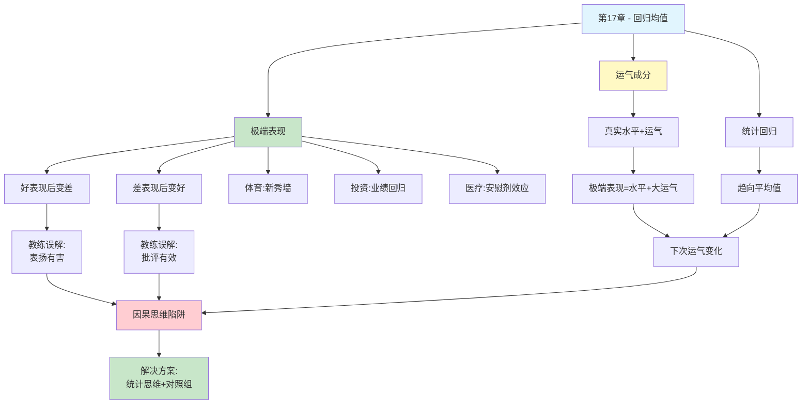

# 第17章 回归均值

## 📍 章节定位

### 全书位置
> 第17章探讨回归均值（Regression to the Mean）——统计学中最容易被误解的概念之一。当极端表现出现后，下一次自然会趋向平均水平，但我们的因果思维本能会将这种统计规律解释为某种"原因"导致的。这种误解影响教育、医疗、投资、体育等各个领域。

- **全书核心问题**: 为什么人类的判断经常偏离理性？
- **本章回答的问题**: 为什么我们总给随机事件找因果解释？为什么极端表现后总会"回归"？
- **角色类型**: 核心概念型（揭示统计直觉的盲区）
- **论证位置**: 承接概率判断研究，揭示因果思维如何误解统计规律

### 章节序列
| 方向 | 章节标题 | 逻辑连接 |
|------|----------|----------|
| 前章 | [[第16章-概率权重]] | 前章讨论概率感知偏差，本章揭示如何误解随机波动 |
| 后章 | [[第18章-理性与情感]] | 本章统计规律与后章情感决策形成认知偏误的完整图景 |
| 整书 | [[思考快与慢-丹尼尔·卡尼曼-拆解记录]] | 阐释核心认知偏误——回归谬误 |

### 一句话定位
> 第17章揭示了回归均值：极端表现后自然会趋向平均，但我们总忍不住编一个"原因"来解释——这是系统1的因果思维在欺骗我们。

---

## 🎯 核心观点

### 第一层：表层案例

| 案例名称 | 简要描述 | 关键引文 |
|----------|----------|----------|
| 飞行教练悖论 | 教练发现：表扬好表现→下次变差；批评差表现→下次变好 | "我们被统计学惩罚了——表扬后表现变差，批评后变好" |
| 以色列空军训练 | 卡尼曼讲课时的亲身经历，发现教练误解了回归均值 | "这是我职业生涯中最满足的顿悟时刻" |
| 掷靶实验 | 让军官背对黑板扔粉笔，好表现后变差，差表现后变好 | "用简单实验揭示了统计规律" |
| 跳雪解说悖论 | 解说员为回归均值编造因果故事："放松了所以表现好" | "解说员看到了回归，却编了一个假原因" |
| 抑郁儿童治疗 | 给抑郁儿童喝能量饮料，三个月后显著改善——但这是回归 | "极端群体会回归，不管喝不喝饮料" |
| 聪明女性择偶 | 高智商女性的丈夫平均智商低于她们——这不是因果，是统计 | "两个问题代数等价，但一个有趣一个无聊" |

### 第二层：中层机制

| 机制名称 | 组成要素 | 因果链条 | 证据来源 |
|----------|----------|----------|----------|
| 回归均值机制 | 极端表现 + 运气成分 + 统计规律 | 极端表现→含运气成分→下次运气变化→趋向平均 | Galton高尔顿实验 |
| 因果思维陷阱 | 系统1 + 因果本能 + 忽视统计 | 看到变化→自动找原因→错误归因→错误行动 | Kahneman飞行教练案例 |
| 表现分解模型 | 真实水平 + 随机误差 | 任何表现 = 水平 + 运气 → 极端表现运气成分大 → 回归不可避免 | 统计学原理 |
| 不完全相关定律 | 相关性 < 1 + 回归效应 | 两变量相关不完美 → 极端值必然回归 → 数学必然 | 相关性数学证明 |

### 第三层：底层规律

| 规律陈述 | 抽象层级 | 知识连接 | 适用范围 |
|----------|----------|----------|----------|
| 回归均值定律 | 统计学核心规律 | [[概率论]], [[随机过程]] | 任何涉及随机变量的测量 |
| 因果思维偏误 | 认知心理学规律 | [[系统1特征]], [[叙事谬误]] | 人类解释行为的普遍倾向 |
| 极端值回归原则 | 统计推断原则 | [[回归分析]], [[抽样理论]] | 极端事件预测领域 |
| 相关性-回归关系 | 数学定律 | [[相关系数]], [[回归系数]] | 双变量统计分析 |

---

## 💬 降维翻译

### 观点1: 什么是回归均值

#### 原文表达
> "如果一次测量结果是极端的，下一次测量很可能更接近平均值。这不是因为发生了什么变化，而是因为极端结果通常包含了较大的随机成分。"

#### 降维翻译（中学生能懂）
想象你在考试：
- 平时考70分的你，这次考了95分（超常发挥）
- 下次考试，你会考多少？
- 大概率会回到70-80分左右

这就是"回归均值"：
- **极端表现**：特别好或特别差的结果
- **均值**：你的正常水平
- **回归**：从极端回到正常

**为什么？** 因为极端表现往往有"运气"成分：
- 考95分 = 实力70分 + 运气25分
- 下次运气没了，就回到70分

**关键点**：这不是你变差了，只是运气用完了。

#### 日常类比（奶奶能懂）
就像种庄稼：
- 今年收成特别好（风调雨顺）
- 明年收成大概率没那么好
- 不是你变懒了，只是今年运气好

同样道理：
- 孩子这次考了100分，别指望每次都100分
- 股票今年涨了50%，别指望每年都涨50%
- 运动员这赛季爆发，下赛季大概率回落

**一句话**：好运气不会一直有，坏运气也不会一直有。

#### 检验
- Q: 如果一个中学生问你这是什么意思？
- A: 极端的事情很难持续，好的坏的都会往"正常"靠拢。

### 观点2: 飞行教练的误解

#### 原文表达
> "我给以色列空军讲课，一位教官说：'我表扬学员时他们下次表现变差，批评时他们下次变好。所以表扬有害，批评有效。'我立刻意识到这是回归均值——这是我职业生涯中最满足的顿悟时刻。"

#### 降维翻译（中学生能懂）
**教官的观察**：
- 表扬飞行好的学员 → 下次变差 ✓
- 批评飞行差的学员 → 下次变好 ✓

**教官的结论**：表扬有害，批评有效！

**卡尼曼的反驳**：错！这是回归均值！

**真正发生了什么？**
- 飞得特别好 = 真实水平 + 好运气
  - 下次运气没了 → 变差（回归）
  - 教官以为是"表扬害的"
  
- 飞得特别差 = 真实水平 + 坏运气
  - 下次运气变好 → 变好（回归）
  - 教官以为是"批评帮的"

**教训**：教官被统计规律骗了，还以为是自己的教学方法有效。

#### 日常类比（奶奶能懂）
就像你考试：
- 考了100分被表扬 → 下次考80分
- 妈妈说："表扬让你骄傲了"
- 其实只是：100分里有30分运气，下次运气没了

- 考了50分被骂 → 下次考70分
- 妈妈说："骂你才管用"
- 其实只是：50分里有20分倒霉，下次不倒霉了

**一句话**：表现波动很正常，别急着找原因。

#### 检验
- Q: 如果一个中学生问你这是什么意思？
- A: 好的表现后变差，差的表现后变好，这很正常。不是表扬有害，也不是批评有效，只是运气用完了。

### 观点3: 为什么我们会误解回归均值

#### 原文表达
> "系统1的因果思维本能让我们自动为变化寻找原因。当看到表现从好变差或从差变好，我们无法接受'没什么原因'这个答案，于是编造一个故事。"

#### 降维翻译（中学生能懂）
**问题在哪？**

你的大脑有个bug：**看到变化，就找原因**

- 孩子成绩变好 → "肯定是补习班有效"
- 股票涨了 → "肯定是CEO厉害"
- 球队赢了 → "肯定是换教练的功劳"

**真相**：可能只是回归均值。

**为什么我们喜欢找原因？**
1. 找原因让人有"掌控感"
2. "只是运气"让人不舒服
3. 大脑天生喜欢故事，讨厌随机

**结果**：
- 把运气当实力 → 高估自己
- 把回归当因果 → 做错误决定

#### 日常类比（奶奶能懂）
就像看球赛解说：
- 运动员第一跳很好 → 解说员说"他现在会紧张，第二跳可能差"
- 运动员第一跳很差 → 解说员说"他现在放松了，第二跳会好"

解说员看到了回归均值，但他**编了一个假原因**（紧张/放松）。

**真相**：可能没什么紧张放松，只是第一跳运气好/差，第二跳回归正常。

**一句话**：大脑喜欢故事，讨厌"没什么原因"这个答案。

#### 检验
- Q: 如果一个中学生问你这是什么意思？
- A: 你的大脑有个bug：看到变化就想找原因。但有时候真的只是运气变化，不是谁"做对了"或"做错了"。

### 观点4: 聪明女性的择偶悖论

#### 原文表达
> "有人问：为什么高智商女性倾向于嫁给不如她们聪明的男性？这是一个有趣的因果问题。但如果问：为什么夫妻智商的相关性不是完美的？这问题就很无聊。这两个问题代数等价。"

#### 降维翻译（中学生能懂）
**有趣的问题**：
- "为什么聪明女性的老公没她们聪明？"
- 大家开始猜测：是不是聪明女性不想竞争？是不是她们害怕孤独？

**无聊的问题**：
- "为什么夫妻智商相关性不是1.0？"
- 大家说：废话，当然不是1.0

**卡尼曼的揭示**：
这两个问题**数学上等价**！

如果：
- 男女平均智商相同
- 夫妻智商相关性 < 1（约0.5-0.6）

那么**必然**：
- 最聪明的女性 → 老公平均智商低于她
- 最聪明的男性 → 老婆平均智商低于他

**结论**：这不是"择偶策略"，只是数学必然。

#### 日常类比（奶奶能懂）
就像身高：
- 最高的人 → 配偶大概率没TA高
- 最矮的人 → 配偶大概率比TA高

不是因为"高个子喜欢矮个子"，只是：
- 最高的人已经是极值
- 配偶回归平均，自然比TA矮

**一句话**：极端值的伴侣必然没那么极端，这是数学，不是择偶策略。

#### 检验
- Q: 如果一个中学生问你这是什么意思？
- A: 最聪明的人的伴侣大概率没TA聪明，不是因为TA"向下找"，只是因为TA已经是极值了，伴侣自然没那么极端。

---

## ✨ 金句库

### 原书金句
| 金句 | 适用场景 |
|------|----------|
| "极端表现后会回归平均，这是统计学规律，不是因果规律" | 回归均值科普 |
| "我们被统计学惩罚了——表扬后表现变差，批评后变好" | 教育误区 |
| "这是我职业生涯中最满足的顿悟时刻" | 卡尼曼回忆 |
| "系统1喜欢因果故事，讨厌随机解释" | 认知偏误 |
| "解说员看到了回归，却编了一个假原因" | 叙事谬误 |
| "两个问题代数等价，但一个有趣一个无聊" | 思维偏误 |

### 降维金句
| 金句 | 来源观点 | 适用场景 |
|------|----------|----------|
| "好运气不会一直有，坏运气也不会一直有" | 回归本质 | 日常安慰 |
| "极端表现后变差，不是你退步了，是运气用完了" | 飞行教练 | 成绩/表现解读 |
| "表扬后变差，批评后变好——不是方法问题，是统计规律" | 教练悖论 | 教育反思 |
| "看到变化就想找原因，这是大脑的bug" | 因果思维 | 认知提升 |
| "最聪明的人的伴侣大概率没TA聪明，这是数学不是择偶策略" | 择偶悖论 | 关系讨论 |
| "解说员看到了回归，却编了一个假故事" | 跳雪案例 | 媒体批评 |

## 🔗 当下映射

### 💰 财富应用
| 场景 | 具体行动 | 预期效果 | 风险提示 |
|------|----------|----------|----------|
| 投资业绩分析 | 基金经理连续3年优异表现后，预期回归 | 避免追高 | 回归时间不确定 |
| 企业盈利预测 | 季度业绩异常高/低时，预期回归 | 更理性估值 | 需区分结构性变化 |
| 选股决策 | 不因单季度业绩极端就判断公司好坏 | 减少误判 | 需结合行业周期 |

### 💼 职场应用
| 场景 | 具体行动 | 所需能力 | 适用职级 |
|------|----------|----------|----------|
| 绩效评估 | 不因单次表现极好/极差就下定论 | 统计思维 | 管理层 |
| 招聘决策 | 看长期表现而非单次面试 | 数据分析 | HR/管理层 |
| 员工激励 | 理解表扬/批评后的变化可能是回归 | 认知科学 | 全职级 |

### 🏠 生活应用
| 场景 | 具体行动 | 可行性 | 见效时间 |
|------|----------|--------|----------|
| 子女教育 | 孩子成绩波动时，先想"是不是回归" | 高 | 即时 |
| 健康管理 | 症状缓解可能是回归，不一定是治疗有效 | 中 | 数周 |
| 人际关系 | 他人行为变化时，别急着归因 | 高 | 即时 |

### 72小时行动计划
1. **明天可以做的第一件事**: 回想最近一次你对某人"表现变化"做了因果判断，问自己"这是否可能是回归均值？"
2. **本周内可以尝试的事**: 观察身边的一个"极端表现"（成绩、业绩、健康指标），预测它是否会回归，并记录结果
3. **需要准备资源才能做的事**: 在下次团队会议中，分享回归均值概念，帮助团队建立更理性的绩效评估思维

---

## 🕸️ 章节关联

### 向上关联 → 整书
- **贡献**: 揭示系统1因果思维如何误解统计规律，完善认知偏误理论
- **位置**: 作为概率判断和因果推理偏误的重要案例

### 横向关联 → 章节间
| 章节编号 | 章节标题 | 关联类型 | 连接描述 |
|----------|----------|----------|----------|
| 第10章 | 小数法则 | 并列 | 小样本波动与回归均值的统计基础 |
| 第11章 | 锚定效应 | 对比 | 锚定是信息偏差，回归是归因偏差 |
| 第14章 | 参照点 | 延伸 | 回归均值中的"均值"即参照点 |
| 第19章 | 后见之明 | 互补 | 后见之明是事后编故事，回归谬误是即时编故事 |

### 向下关联 → 具体应用
| 应用场景 | 难度 | 前置知识 |
|----------|------|----------|
| 教育评估 | 低 | 基础认知 |
| 投资决策 | 中 | 统计学基础 |
| 医疗研究 | 高 | 临床试验设计 |

### 跨书关联 → 知识网络
| 书籍 | 概念 | 关系 | 备注 |
|------|------|------|------|
| [[思考快与慢-丹尼尔·卡尼曼-拆解记录]] | 回归均值 | 同源 | 理论源头 |
| [[清醒思考的艺术-多贝里-拆解记录]] | 回归谬误 | 应用 | 多贝里列举的52种偏误之一 |
| [[黑天鹅-塔勒布-拆解记录]] | 随机性 | 互补 | 塔勒布强调极端事件，卡尼曼强调回归 |
| [[随机漫步的傻瓜-塔勒布-拆解记录]] | 运气vs实力 | 延伸 | 如何区分运气和实力 |
| [[反脆弱-塔勒布-拆解记录]] | 波动利用 | 对比 | 回归是被动的，反脆弱是主动利用波动 |

### 关联可视化

---

## ❓ 问答设计

### Q1: [记忆型问题]
**认知层次**: 记忆
**难度**: 低
**描述**: 什么是回归均值？
**答案要点**:
- 极端表现后，下一次测量倾向于更接近平均值
- 这是统计学规律，不是因果规律
- 极端结果通常包含较大的随机成分

### Q2: [理解型问题]
**认知层次**: 理解
**难度**: 中
**描述**: 为什么飞行教练误以为"表扬有害，批评有效"？
**答案要点**:
- 教练观察：表扬好表现后下次变差，批评差表现后下次变好
- 真相：这是回归均值，不是表扬/批评的效果
- 好表现=实力+好运气，下次运气没了就变差
- 差表现=实力+坏运气，下次运气好了就变好

### Q3: [应用型问题]
**认知层次**: 应用
**难度**: 中
**描述**: 如何在投资中应用回归均值的概念？
**答案要点**:
- 基金经理连续几年优异表现后，预期回归
- 不因单季度业绩极端就判断公司好坏
- 区分结构性变化和统计回归
- 关注长期表现而非短期极端值

### Q4: [分析型问题]
**认知层次**: 分析
**难度**: 中
**描述**: 回归均值与系统1/系统2理论有什么关系？
**答案要点**:
- 系统1自动寻找因果解释
- 回归均值违反因果直觉
- 系统1编造故事解释回归现象
- 需要系统2的统计思维来理解回归

### Q5: [创造型问题]
**认知层次**: 创造
**难度**: 高
**描述**: 设计一个实验来帮助人们理解回归均值？
**答案要点**:
- 卡尼曼的掷靶实验：背对黑板扔粉笔
- 记录第一次和第二次的成绩
- 展示：好表现后变差，差表现后变好
- 关键：没有任何反馈，纯粹是统计规律
- 讨论：为什么我们总想找原因？

### Q6: [理解型问题]
**认知层次**: 理解
**难度**: 中
**描述**: 为什么说"聪明女性的丈夫不如她们聪明"是数学必然？
**答案要点**:
- 男女平均智商相同
- 夫妻智商相关性不是完美的（约0.5-0.6）
- 极端值（最聪明的人）的伴侣必然没那么极端
- 这不是择偶策略，是统计回归

### Q7: [应用型问题]
**认知层次**: 应用
**难度**: 中
**描述**: 如何在教育中避免回归谬误？
**答案要点**:
- 不因单次成绩极端就过度反应
- 关注长期趋势而非短期波动
- 表扬和批评应该基于努力程度，而非结果波动
- 理解成绩波动可能只是统计规律

### Q8: [分析型问题]
**认知层次**: 分析
**难度**: 高
**描述**: 回归均值与安慰剂效应有什么关系？
**答案要点**:
- 极端症状的患者会自然回归（症状减轻）
- 安慰剂组也会改善，这是回归均值
- 必须有对照组才能区分治疗效果和回归
- 很多"神奇疗法"可能只是回归效应

### Q9: [理解型问题]
**认知层次**: 理解
**难度**: 中
**描述**: 为什么系统1讨厌"没什么原因"这个答案？
**答案要点**:
- 系统1天生寻找因果解释
- 因果故事给人掌控感
- "只是运气"让人不舒服
- 大脑喜欢确定性，讨厌随机

### Q10: [创造型问题]
**认知层次**: 创造
**难度**: 高
**描述**: 如果你要给企业高管做培训，如何用5分钟讲清楚回归均值？
**答案要点**:
- 开场：问"表扬后表现变差，批评后变好，说明什么？"
- 故事：飞行教练的误解
- 实验：现场掷靶/掷硬币
- 结论：这是统计规律，不是管理方法
- 应用：看长期表现，不因短期波动过度反应

---

## 📝 备注

### 信息来源与质量评级
- **第一轮检索**: ⭐⭐⭐ Wikipedia、Farnam Street Blog、Galton原始论文
- **第二轮检索**: ⭐⭐⭐ 卡尼曼原书、学术解读、统计学教材
- **信息整合**: 已有章节格式 + 回归均值理论 + 认知偏误研究

### 章节特色
第17章揭示的回归均值是统计学和认知心理学的交叉领域。卡尼曼用飞行教练的案例生动展示了人们如何误解统计规律，这一发现对教育、医疗、投资、管理等各个领域都有深远影响。理解回归均值有助于我们：
1. 避免将统计规律误认为因果关系
2. 更理性地评估表现波动
3. 在实验设计中使用对照组

### 概念溯源
回归均值（Regression to the Mean）由弗朗西斯·高尔顿（Francis Galton）于1886年发现，最初研究遗传学中的身高问题。卡尼曼将这一统计学概念引入认知心理学，揭示人们如何系统性地误解回归现象，并将其归因于系统1的因果思维本能。

### 核心洞见
> "我们被统计学惩罚了——当我们表扬别人时，他们倾向于变差；当我们批评别人时，他们倾向于变好。这是回归均值在作祟，不是我们的奖惩方式有效。"

这个洞见提醒我们：在做任何因果判断之前，先问自己"这是否可能只是回归均值？"
