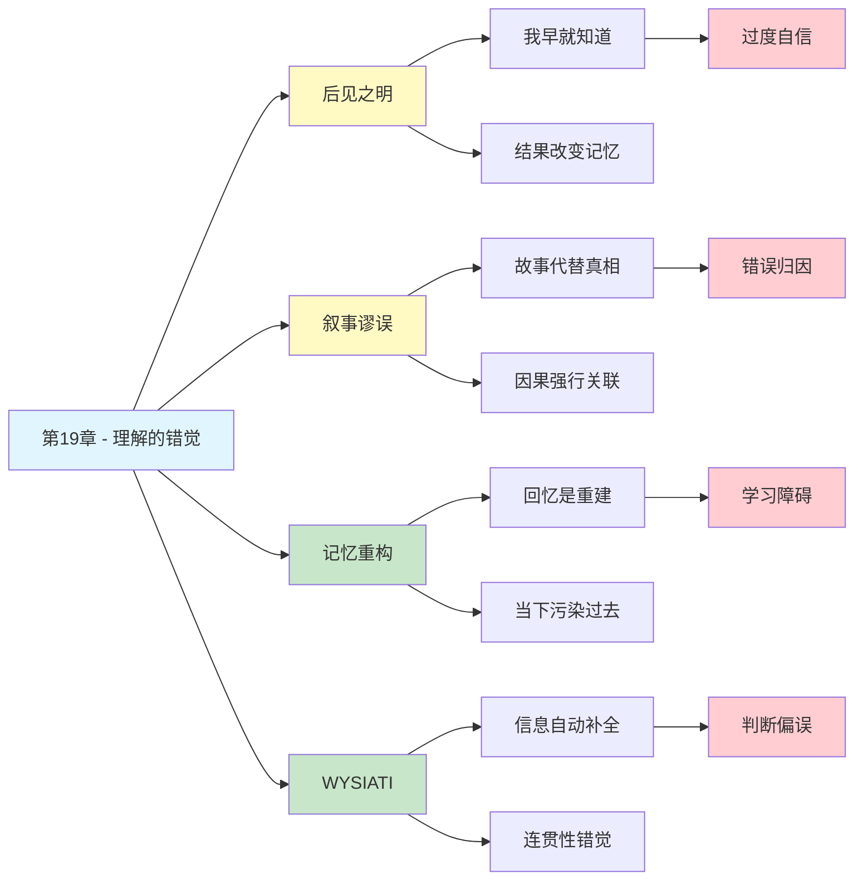

# 第19章 理解的错觉

## 📍 章节定位

### 全书位置
> 第19章揭示了我们最根深蒂固的认知错觉之一：我们以为自己"理解"了世界，但其实只是事后编造了一个说得通的故事。后见之明让我们误以为自己早就知道结果会怎样，叙事本能让我们相信一切都有原因——这两个错觉合谋，让我们对世界的理解充满自信，却常常是错的。

- **全书核心问题**: 为什么人类的判断经常偏离理性？
- **本章回答的问题**: 为什么我们总觉得自己"理解"了事情？这种理解是真的吗？
- **角色类型**: 核心理论型（揭示认知错觉的深层机制）
- **论证位置**: 第四部分"选择"的前奏，为后续过度自信研究提供心理基础

### 章节序列
| 方向 | 章节标题 | 逻辑连接 |
|------|----------|----------|
| 前章 | [[第18章-驯服直觉性预测]] | 从预测修正延伸到"为什么我们觉得自己能预测" |
| 后章 | [[第20章-系统性风险偏好]] | 从理解错觉到风险偏好的系统性偏差 |
| 整书 | [[思考快与慢-丹尼尔卡尼曼-拆解记录]] | 系统1的认知错觉在"理解"领域的体现 |

### 一句话定位
> 第19章告诉我们：我们以为自己在"理解"世界，其实只是在"编故事"——后见之明让我们忘了自己曾经的困惑，叙事本能让我们相信一切都有原因，这两个错觉加在一起，让我们对自己的理解能力过度自信。

---

## 🎯 核心观点

### 第一层：表层案例
| 案例名称 | 简要描述 | 关键引文 |
|----------|----------|----------|
| 医疗诊断 | 医生事后总说"我早就知道是这个病"，但事前诊断记录并非如此 | "后见之明改变了对过去的记忆" |
| 股市预测 | 股市大跌后，分析师纷纷说"迹象早就很明显了"，但大跌前没人这么说 | "我们对过去的理解是事后重构的" |
| 历史事件 | 历史学家总能为重大事件找到"必然原因"，但事发前没人能预测 | "历史叙事消除了偶然性" |
| 商业成败 | 成功公司的故事被写成"英明决策"，失败公司被写成"愚蠢错误" | "幸存者偏差扭曲了因果关系" |
| 体育比赛 | 赢了就是"战术高明"，输了就是"战术失误"——同一场比赛两种解读 | "结果决定了对过程的评价" |

### 第二层：中层机制
| 机制名称 | 组成要素 | 因果链条 | 证据来源 |
|----------|----------|----------|----------|
| 后见之明偏误 | 结果已知 + 记忆重构 | 知道结果后 → 重构过去 → 觉得"早就知道" | Fischhoff后见之明研究 |
| 叙事谬误 | 因果需求 + 故事本能 | 看到事件 → 编造因果 → 产生"理解"感 | Taleb叙事谬误理论 |
| 系统1的WYSIATI | 信息补全 + 联想激活 | 看到片段 → 自动补全 → 以为完整 | Kahneman WYSIATI理论 |
| 记忆的重构性 | 每次回忆都是重建 | 提取记忆 → 结合当下 → 重写存储 | 记忆心理学研究 |
| 确认偏误 | 选择性注意 + 选择性记忆 | 先有结论 → 只找支持证据 → 强化信念 | 认知偏误研究 |

### 第三层：底层规律
| 规律陈述 | 抽象层级 | 知识连接 | 适用范围 |
|----------|----------|----------|----------|
| 后见之明定律 | 认知心理学核心规律 | [[记忆重构]], [[因果推理]] | 所有事后评价 |
| 叙事谬误定律 | 认知科学规律 | [[故事思维]], [[系统1]] | 所有因果解释 |
| 理解错觉定律 | 元认知规律 | [[过度自信]], [[WYSIATI]] | 所有复杂系统理解 |
| 记忆建构定律 | 记忆心理学规律 | [[重构性记忆]], [[暗示效应]] | 所有回忆场景 |

---

## 💬 降维翻译

### 观点1: 后见之明——"我早就知道"是最大的谎言

#### 原文表达
> "当我们得知某个事件的结果后，我们对过去的记忆会立即发生改变。我们说服自己，我们的预测比实际上更准确。这种后见之明让我们误以为世界是可预测的，而实际上它远比我们想象的更不确定。"

#### 降维翻译（中学生能懂）
你有没有这种经历：
- 考试成绩出来后说"我早就知道会考这个"
- 股市大跌后说"我早就觉得要跌"
- 比赛结果出来后说"我早就猜到他会赢"

**问题是**：你真的"早就知道"吗？

真相是：**你的记忆骗了你。**

当你知道结果后，你的大脑会偷偷改写你的记忆，让你觉得自己"一直都知道"。这是为了保护你的自尊——承认"我不知道"太难受了。

**一句话**：后见之明不是你有先见之明，是你的记忆在帮你圆谎。

#### 日常类比（奶奶能懂）
就像打牌。你输了，然后说"我早就知道这把会输"。但你打牌的时候可没这么说，你当时还觉得自己能赢呢。

记性会骗人，特别是知道结果以后。

#### 检验
- Q: 如果一个中学生问你这是什么意思？
- A: 你觉得自己"早就知道"的事，大多是你知道了结果之后才"想起来"的。你的记忆在帮你自己圆场。

---

### 观点2: 叙事谬误——故事让我们产生"理解"的错觉

#### 原文表达
> "我们有一种强大的需求，要为发生的事情找到原因和意义。这种叙事本能让我们在随机事件中看到模式，在巧合中看到命运，在混乱中看到秩序。问题是，世界并不总是按照我们的故事逻辑运行。"

#### 降维翻译（中学生能懂）
你的大脑是个**故事机器**。

看到一件事，它会自动编一个故事来解释：
- 为什么那个人成功了？因为他努力、聪明、有眼光
- 为什么那家公司倒闭了？因为管理混乱、战略错误、不思进取

这些故事听起来很合理，但**真的是这样吗？**

现实是：
- 成功的人里，也有很多不努力、不聪明的——他们只是运气好
- 失败的公司里，也有很多管理好、战略对的——他们只是运气差

**故事让人舒服，但不一定是真相。**

**一句话**：你以为是因果关系，可能只是故事关系。

#### 日常类比（奶奶能懂）
就像听评书。坏人做坏事一定有原因，好人做好事也有原因，故事里什么都有道理。但真实世界不是评书，很多事情就是碰巧发生的，没有什么"道理"。

别把生活当故事看，生活比故事乱多了。

#### 检验
- Q: 如果一个中学生问你这是什么意思？
- A: 你的大脑喜欢编故事，看到什么都要找一个"为什么"。但很多事情就是碰巧发生的，不是每个"为什么"都有答案。

---

### 观点3: 理解的错觉——你"理解"的可能只是你编的故事

#### 原文表达
> "我们感觉自己理解了某件事，但这种理解感往往是错觉。系统1会利用有限的、甚至是片面的信息，迅速构建一个连贯的故事。这个故事越连贯，我们就越觉得自己理解了——但故事的连贯性不等于真实性。"

#### 降维翻译（中学生能懂）
你以为你"理解"了：
- 为什么股市会涨？
- 为什么这个人会成功？
- 为什么这件事会发生？

**但你"理解"的可能只是你自己编的故事。**

大脑有个毛病：给它一点点信息，它就会自动补全，编成一个完整的故事。

故事越完整，你就越觉得"我懂了"。但故事完整不等于故事真实。

**举个例子**：
- 你看到同事升职了，你"理解"了：他拍马屁、会来事、有人脉
- 真相可能是：他确实能力强、业绩好、该升

你的"理解"只是你编的故事，跟真相可能差很远。

**一句话**：理解感 ≠ 真理解，可能只是你的大脑编了个好故事。

#### 日常类比（奶奶能懂）
就像看魔术表演。你"理解"了魔术是怎么变的——但那是你猜的，不是真相。魔术师有自己的秘密，你编的故事只是让你自己觉得"懂了"。

#### 检验
- Q: 如果一个中学生问你这是什么意思？
- A: 你觉得自己"懂了"的时候，可能只是你的大脑编了一个说得通的故事。故事说得通，不代表故事是真的。

---

## ✨ 金句库

### 原书金句
| 金句 | 适用场景 |
|------|----------|
| "后见之明让我们误以为世界是可预测的" | 认知偏误科普 |
| "我们对过去的理解是事后重构的，不是当时的真实想法" | 记忆心理学 |
| "叙事是人类理解世界的方式，也是人类误解世界的方式" | 批判思维 |
| "故事的连贯性不等于真实性" | 科学方法论 |
| "我们无法重构过去的自己——那个不知道结果的自己" | 历史认知 |

### 降维金句
| 金句 | 来源观点 | 适用场景 |
|------|----------|----------|
| "我早就知道"是你知道结果后才"想起来"的 | 后见之明 | 自我反思 |
| "故事让人舒服，但不一定是真相" | 叙事谬误 | 批判思维 |
| "理解感 ≠ 真理解，可能只是故事编得好" | 理解错觉 | 认知谦逊 |
| "你的记忆会帮你圆谎——特别是对你自己" | 记忆重构 | 自我认知 |
| "别把生活当故事看，生活比故事乱多了" | 叙事局限 | 人生哲学 |
| "历史书是事后编的故事，不是当时发生的真相" | 历史叙事 | 批判阅读 |

## 🔗 当下映射

### 💰 财富应用
| 场景 | 具体行动 | 预期效果 | 风险提示 |
|------|----------|----------|----------|
| 投资复盘 | 区分"当时怎么想"和"现在怎么看"，不要用后见之明评价自己 | 更客观的投资复盘 | 需要诚实记录 |
| 财经阅读 | 对"事后诸葛亮"式分析保持警惕 | 避免被误导 | 需要批判思维 |
| 成功学 | 识别故事中的"叙事谬误"，区分运气和能力 | 更理性的成功观 | 可能打破幻想 |

### 💼 职场应用
| 场景 | 具体行动 | 所需能力 | 适用职级 |
|------|----------|----------|----------|
| 项目复盘 | 记录当时的决策依据，而非事后的解释 | 自我诚实 | 全职级 |
| 绩效评估 | 区分结果和过程，避免"成王败寇"思维 | 系统思维 | 管理层 |
| 竞争分析 | 对竞争对手的成功/失败分析保持怀疑 | 批判思维 | 战略层 |

### 🏠 生活应用
| 场景 | 具体行动 | 可行性 | 见效时间 |
|------|----------|--------|----------|
| 人际关系 | 不要用"我早就知道"来评判他人 | 高 | 即时 |
| 自我反思 | 承认"我不知道"比编故事更诚实 | 中 | 长期 |
| 学习习惯 | 学习时记录当时的困惑，而非只记"正确答案" | 高 | 中期 |

### 72小时行动计划
1. **明天可以做的第一件事**: 回想最近一次你说"我早就知道"的经历，问自己：我在知道结果之前，真的那么确定吗？
2. **本周内可以尝试的事**: 找一个"成功故事"或"失败故事"，试着找出其中的叙事谬误——哪些是真正的因果，哪些只是故事？
3. **需要准备资源才能做的事**: 建立"决策日记"，在做重要决策时记录当时的想法，事后对比，看看记忆是否被改写。

---

## 🕸️ 章节关联

### 向上关联 → 整书
- **贡献**: 揭示系统1在"理解"领域的核心错觉——后见之明和叙事谬误，为理解过度自信提供心理基础
- **位置**: 第四部分的核心理论铺垫，连接启发法与过度自信两大主题

### 横向关联 → 章节间
| 章节编号 | 章节标题 | 关联类型 | 连接描述 |
|----------|----------|----------|----------|
| 第10章 | 小数法则 | 基础 | 小样本导致过度模式识别，引发叙事谬误 |
| 第11章 | 锚定效应 | 基础 | 锚定效应是系统1"先入为主"的表现 |
| 第21章 | 我们已经预见到了 | 深化 | 后见之明偏误的专题讨论 |
| 第22章 | 感觉能做出好决定 | 延伸 | 理解错觉导致过度自信 |

### 向下关联 → 具体应用
| 应用场景 | 难度 | 前置知识 |
|----------|------|----------|
| 投资复盘 | 低 | 后见之明概念 |
| 历史批判阅读 | 中 | 叙事谬误概念 |
| 科学方法论 | 高 | 因果推理与统计思维 |

### 跨书关联 → 知识网络
| 书籍 | 概念 | 关系 | 备注 |
|------|------|------|------|
| [[思考快与慢-丹尼尔卡尼曼-拆解记录]] | 后见之明 | 同源 | 理论源头 |
| [[黑天鹅-塔勒布-拆解记录]] | 叙事谬误 | 深化 | Taleb对叙事的深入批判 |
| [[随机漫步的傻瓜-塔勒布]] | 幸存者偏差 | 互补 | 历史叙事的扭曲机制 |
| [[清醒思考的艺术-多贝里-拆解记录]] | 后见之明偏误 | 应用 | 更多日常案例 |

### 关联可视化

---

## ❓ 问答设计

### Q1: [记忆型问题]
**认知层次**: 记忆
**难度**: 低
**描述**: 什么是"后见之明"？
**答案要点**:
- 知道结果后，觉得自己"早就知道"会这样
- 记忆被结果"污染"，过去的想法被改写
- 这是一种认知偏误，不是真实的预测能力

### Q2: [理解型问题]
**认知层次**: 理解
**难度**: 中
**描述**: 为什么叙事会让我们产生"理解"的错觉？
**答案要点**:
- 大脑有寻找因果的本能需求
- 故事越连贯，越让人感觉"理解了"
- 但故事的连贯性不等于真实性
- 系统1会自动补全信息，制造连贯感

### Q3: [应用型问题]
**认知层次**: 应用
**难度**: 中
**描述**: 如何避免后见之明对投资复盘的影响？
**答案要点**:
- 在做决策时记录当时的想法和理由
- 复盘时对照当时的记录，而非事后的记忆
- 区分"当时的信息"和"现在的信息"
- 承认"当时不知道"是正常的

### Q4: [分析型问题]
**认知层次**: 分析
**难度**: 中
**描述**: 后见之明和叙事谬误有什么关系？
**答案要点**:
- 两者都是系统1的认知错觉
- 后见之明是"事后改变对过去的记忆"
- 叙事谬误是"事后编造因果解释"
- 两者共同作用，让我们对自己的理解过度自信

### Q5: [创造型问题]
**认知层次**: 创造
**难度**: 高
**描述**: 如何设计一个帮助人们识别"叙事谬误"的思维训练？
**答案要点**:
- 收集成功/失败的案例故事
- 让学习者分析故事中的因果关系
- 揭示哪些是真正因果，哪些是叙事
- 引入反例：同样的行为，不同的结果
- 练习区分"故事逻辑"和"现实逻辑"

### Q6: [理解型问题]
**认知层次**: 理解
**难度**: 中
**描述**: 为什么说"记忆是重构的"？
**答案要点**:
- 每次回忆都是一次重建
- 当下的知识、情绪会影响回忆
- 记忆不是录像机，是编辑器
- 后见之明就是记忆重构的一种表现

### Q7: [应用型问题]
**认知层次**: 应用
**难度**: 中
**描述**: 阅读商业传记时，如何识别叙事谬误？
**答案要点**:
- 注意"成功后的归因"往往是故事
- 寻找相反的例子：同样的做法，不同的结果
- 关注幸存者偏差：失败者的故事没被写出来
- 区分"这个人说的"和"作者解读的"

### Q8: [分析型问题]
**认知层次**: 分析
**难度**: 高
**描述**: 叙事谬误对历史学有什么启示？
**答案要点**:
- 历史叙事总是事后构建的
- 历史学家会消除偶然性，强化因果
- "历史必然性"可能是叙事的产物
- 好的历史学家会承认不确定性和偶然

### Q9: [理解型问题]
**认知层次**: 理解
**难度**: 中
**描述**: WYSIATI（所见即为全貌）与理解错觉有什么关系？
**答案要点**:
- WYSIATI是系统1的核心特征
- 它让大脑用有限信息构建完整故事
- 故事越完整，越感觉"理解了"
- 但完整感是大脑制造的，不是真实的

### Q10: [创造型问题]
**认知层次**: 创造
**难度**: 高
**描述**: 如果你要给一个初中生讲解"为什么不要相信成功学"，你会怎么说？
**答案要点**:
- 用例子开头：同一个做法，有人成功有人失败
- 讲故事的选择性：只讲成功的，不讲失败的
- 讲运气的角色：很多时候成功只是运气好
- 讲后见之明：成功后找原因，失败后找错误
- 教他问：如果这个人失败了，我们还会这么说吗？

---

## 📝 备注

### 信息来源与质量评级
- **第一轮检索**: ⭐⭐⭐ 《思考快与慢》原书第19章内容、后见之明研究文献
- **第二轮检索**: ⭐⭐⭐ 叙事谬误理论、记忆重构研究
- **信息整合**: 已有章节格式 + 后见之明/叙事谬误核心概念 + WYSIATI理论

### 章节特色
本章揭示了人类理解世界的两大错觉：后见之明和叙事谬误。这两个错觉共同作用，让我们对自己的理解能力过度自信。理解这两个错觉，有助于我们更谦逊地面对复杂世界，更批判地阅读历史和传记，更诚实地进行复盘和反思。

### 与其他第19章的关系
本书存在不同翻译版本：
- "理解的错觉"版本：侧重后见之明和叙事谬误
- "避免主观怀疑"版本：侧重过度自信的怀疑机制
- 两个版本互补，建议结合阅读

### 核心洞见
> 我们以为自己理解了世界，其实只是编了一个说得通的故事。真正的智慧，是知道自己编的只是故事。
