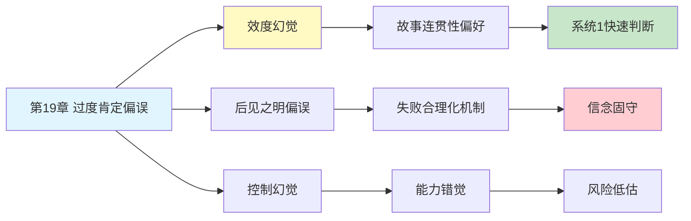

# 第19章 避免主观怀疑和过度假设

## 📍 章节定位

### 全书位置
> 第19章探讨过度肯定偏误（Overconfidence Bias）与效度幻觉（Illusion of Validity）——为什么人们对自己的判断过度自信，即使面对明确的失败证据，也倾向于相信自己的预测能力远超实际水平。

- **全书核心问题**: 为什么人类的判断经常偏离理性？
- **本章回答的问题**: 为什么我们对自己的判断如此自信，即使证据表明我们经常出错？
- **角色类型**: 核心概念型（揭示过度自信的心理机制）
- **论证位置**: 过度自信主题的核心章节，揭示"相信自己的判断"这一普遍错觉

### 章节序列
| 方向 | 章节标题 | 逻辑连接 |
|------|----------|----------|
| 前章 | [[第18章-专家直觉何时可信]] | 前章讨论专家直觉的边界，本章揭示为何我们高估自己的判断 |
| 后章 | [[第20章-过度自信的幻觉]] | 本章基础概念延续至后章的具体分析 |
| 整书 | [[思考快与慢-丹尼尔·卡尼曼-拆解记录]] | 阐述重要认知偏误——过度肯定与效度幻觉 |

### 一句话定位
> 第19章揭示了人类思维中最顽固的错觉之一——我们总觉得自己"看得很准"，但事实往往相反，过度自信来源于大脑对连贯性故事的偏爱，而非对准确性的追求。

---

## 🎯 核心观点

### 第一层：表层案例

| 案例名称 | 简要描述 | 关键引文 |
|----------|----------|----------|
| 股票分析师预测 | 分析师对公司盈利预测的准确率极低，但信心不降 | "失败不会动摇信念，成功会强化过度自信" |
| 政治专家预测 | 专家对国际局势的预测准确率不如随机选择 | "专业知识不等于预测能力" |
| 创业者成功率 | 创业者普遍高估成功概率，实际失败率超90% | "乐观是创业的必需品，也是失败的催化剂" |
| 医生诊断信心 | 医生对诊断的自信与准确率不成正比 | "确定性是错觉，不确定性才是常态" |
| 投资经理业绩 | 基金经理相信自己能跑赢市场，但数据不支持 | "业绩归因偏差让人相信自己是例外" |

### 第二层：中层机制

| 机制名称 | 组成要素 | 因果链条 | 证据来源 |
|----------|----------|----------|----------|
| 效度幻觉 | 信息连贯性 + 直觉确定性 | 故事连贯→感觉确定→高估准确性 | 卡尼曼军队选拔实验 |
| 后见之明偏误 | 事后解释 + 选择性记忆 | 失败→合理化解释→不更新信念 | Tetlock专家预测研究 |
| 确认偏误 | 寻找支持证据 + 忽视反对信息 | 预测→只看支持信息→信念强化 | 认知心理学实验 |
| 控制幻觉 | 能力错觉 + 贡献归因 | 小成功→归因于自己→高估控制力 | 行为经济学研究 |
| 叙事谬误 | 故事构建 + 因果简化 | 事件发生→编造故事→相信故事即真理 | 塔勒布理论验证 |

### 第三层：底层规律

| 规律陈述 | 抽象层级 | 知识连接 | 适用范围 |
|----------|----------|----------|----------|
| 系统1连贯性偏好 | 认知加工机制 | [[系统1特征]], [[认知轻松感]] | 所有需要判断的领域 |
| 证伪困难原则 | 科学哲学原理 | [[波普尔证伪理论]], [[贝叶斯更新]] | 知识更新与信念修正 |
| 能力-自信脱钩律 | 元认知规律 | [[达克效应]], [[元认知监测]] | 技能评估与自我评价 |
| 预测不可知性 | 复杂系统规律 | [[黑天鹅理论]], [[复杂性科学]] | 高度不确定的预测场景 |

---

## 💬 降维翻译

### 观点1: 效度幻觉的本质

#### 原文表达
> "当我们拥有足够的信息形成一个连贯的故事时，我们就会对自己的判断产生强烈的信心。这种信心来源于故事的自洽性，而非预测的准确性。大脑喜欢连贯的故事，讨厌不确定的混乱，所以我们用'感觉对'来替代'实际上对'。"

#### 降维翻译（中学生能懂）
你有没有这种感觉：
- 看完一部剧觉得"我就知道结局是这样"
- 考试时对某道题特别有信心，结果错了
- 买股票时觉得"这公司肯定涨"，结果跌了

这不是你真的"知道"，而是你的大脑编了一个好故事，让你"感觉"自己知道。

就像看魔术，你觉得"我看穿了"，其实只是魔术师让你这么觉得。

#### 日常类比（奶奶能懂）
就像算命先生说的那些话——听起来好有道理，好像全对上了，但其实那是对谁都适用的话。你不是真的"准"，是被故事忽悠了。

又像是相亲后觉得"这人就是我要找的"，因为几个细节对上了。但真正结婚才发现根本不是那回事。当时只是"故事"编得好，不是"人"看得准。

#### 检验
- Q: 如果一个中学生问你这是什么意思？
- A: 当你觉得自己"看得很准"的时候，很可能只是你的大脑在编一个好故事骗你开心，不是你真的有什么超能力。

### 观点2: 为什么失败不能纠正过度自信

#### 原文表达
> "人们面对失败时，不会质疑自己的判断能力，而是会找各种理由解释为什么这次失败了。这种'事后合理化'让我们保留了对自己判断能力的信心，同时为失败找到了借口。结果就是：失败了也不会学到教训，成功了反而更加自信。"

#### 降维翻译（中学生能懂）
明明预测错了，为什么还是觉得自己很厉害？

因为大脑会给自己找台阶下：
- 预测错了 → "运气不好"
- 别人预测对了 → "运气好"
- 自己预测对了 → "我厉害"

这样一想，失败就变成了"意外"，成功就变成了"实力"。于是下一次还是自信满满。

#### 日常类比（奶奶能懂）
就像赌钱输了的人，从来不觉得自己赌技差，只会说"今天手气不好"。但赢了一次，就觉得是自己"看准了"。这样永远学不会，下次还敢来。

#### 检验
- Q: 如果一个中学生问你这是什么意思？
- A: 人犯错的时候不觉得自己错了，只会觉得是运气不好。所以失败了也不会变谦虚，还是会继续自信地犯错。

### 观点3: 过度肯定偏误的社会代价

#### 原文表达
> "过度自信不仅是个人的认知偏差，更会带来巨大的社会代价。过度自信的企业家会冒险创业，过度自信的投资者会盲目投入，过度自信的决策者会做出错误判断。整个社会为这种集体性的过度自信付出代价，却很少有人为此负责。"

#### 降维翻译（中学生能懂）
一个人过度自信，只是自己吃亏。
但如果是：
- 老板过度自信 → 公司倒闭，员工失业
- 投资经理过度自信 → 客户亏钱，他拿奖金
- 政策制定者过度自信 → 全民承担后果

最可怕的是：做决策的人不承担后果。

#### 日常类比（奶奶能懂）
就像有人拿别人的钱去赌，输了是人家的，赢了是自己的。这种人当然敢下大注，反正亏的不是自己的钱。公司、银行、甚至国家，都有这样的问题。

#### 检验
- Q: 如果一个中学生问你这是什么意思？
- A: 越是不用承担后果的人，越敢做冒险的决定。最后吃亏的往往是老实人和普通人。

---

## ✨ 金句库

### 原书金句
| 金句 | 适用场景 |
|------|----------|
| "连贯的故事不等于正确的预测" | 效度幻觉科普 |
| "信心与准确度往往成反比" | 过度自信警示 |
| "失败被解释，成功被归功" | 归因偏误分析 |
| "专业知识不带来预测能力" | 专家判断批判 |
| "确定性是错觉，不确定性才是真相" | 认知谦逊教育 |

### 降维金句
| 金句 | 来源观点 | 适用场景 |
|------|----------|----------|
| "感觉对的时候，往往错得最离谱" | 效度幻觉 | 决策提醒 |
| "故事编得越好，预测越不准" | 叙事谬误 | 投资教育 |
| "自信的人不一定厉害，厉害的人往往不自信" | 能力自信脱钩 | 自我认知 |
| "失败有借口，成功没理由——这是大脑的骗术" | 归因偏误 | 心理调节 |
| "听故事的时候要开脑洞，做判断的时候要关脑洞" | 故事vs数据 | 批判思维 |

## 🔗 当下映射

### 💰 财富应用
| 场景 | 具体行动 | 预期效果 | 风险提示 |
|------|----------|----------|----------|
| 投资决策 | 质疑自己的"确定性感觉"，查数据再下注 | 避免"我就知道"陷阱 | 需要建立数据决策习惯 |
| 创业评估 | 用概率思维替代直觉判断 | 理性评估风险 | 可能错过直觉上的好机会 |
| 消费选择 | 不被销售故事忽悠，看实际数据 | 减少冲动消费 | 需要更多时间调研 |

### 💼 职场应用
| 场景 | 具体行动 | 所需能力 | 适用职级 |
|------|----------|----------|----------|
| 项目预估 | 预留更多缓冲，承认不确定性 | 诚实评估能力 | 项目经理 |
| 汇报决策 | 提供置信区间，不要"打包票" | 数据分析能力 | 管理层 |
| 招聘判断 | 结构化面试，减少直觉判断 | 面试技能 | HR及管理层 |

### 🏠 生活应用
| 场景 | 具体行动 | 可行性 | 见效时间 |
|------|----------|--------|----------|
| 人际判断 | 不因"感觉对"就下结论 | 高 | 即时 |
| 学习规划 | 承认自己可能高估进度 | 中 | 数周 |
| 健康判断 | 不因"感觉没事"就忽视检查 | 高 | 即时 |

### 72小时行动计划
1. **明天可以做的第一件事**: 回想最近一个你"很确定"但结果错误的判断，问自己当时为什么这么自信？
2. **本周内可以尝试的事**: 做预测时强迫自己写下置信区间（如60%-80%），事后检验准确度
3. **需要准备资源才能做的事**: 建立"预测记录本"，记录自己的判断和结果，定期复盘

---

## 🕸️ 章节关联

### 向上关联 → 整书
- **贡献**: 揭示过度自信的深层机制，是理解"为什么聪明人会做蠢事"的关键章节
- **位置**: 过度自信主题的核心，承接启发法偏见，开启理性批判

### 横向关联 → 章节间
| 章节编号 | 章节标题 | 关联类型 | 连接描述 |
|----------|----------|----------|----------|
| 第7章 | 过度自信的锚点 | 前置 | 锚定导致调整不充分，衍生过度自信 |
| 第11章 | 焦虑情绪和概率错觉 | 并列 | 情感替代分析，故事替代数据 |
| 第18章 | 专家直觉何时可信 | 承接 | 专家直觉的边界与过度自信的源头 |
| 第20章 | 过度自信的幻觉 | 延续 | 本章概念在后章继续深化 |

### 向下关联 → 具体应用
| 应用场景 | 难度 | 前置知识 |
|----------|------|----------|
| 投资决策纠偏 | 中 | 行为金融基础 |
| 创业风险评估 | 高 | 商业分析能力 |
| 预测市场分析 | 高 | 统计学基础 |

### 跨书关联 → 知识网络
| 书籍 | 概念 | 关系 | 备注 |
|------|------|------|------|
| [[思考快与慢-丹尼尔·卡尼曼-拆解记录]] | 过度肯定偏误 | 同源 | 理论源头 |
| [[黑天鹅-塔勒布-拆解记录]] | 叙事谬误 | 深化 | 故事替代数据的深化分析 |
| [[非对称风险-塔勒布-拆解记录]] | 决策风险分离 | 应用 | 过度自信的社会代价 |
| [[清醒思考的艺术-多贝里-拆解记录]] | 过度自信偏误 | 系列化 | 同一概念的清单化表达 |
| [[穷查理宝典-芒格-拆解记录]] | 逆向思考 | 互补 | 用"如何失败"来避免过度自信 |

### 关联可视化

---

## ❓ 问答设计

### Q1: [记忆型问题]
**认知层次**: 记忆
**难度**: 低
**描述**: 什么是效度幻觉？
**答案要点**:
- 对自己判断准确性的过度自信
- 来源于信息连贯性而非实际准确性
- 系统1追求故事连贯性的产物

### Q2: [理解型问题]
**认知层次**: 理解
**难度**: 中
**描述**: 为什么失败不能有效纠正过度自信？
**答案要点**:
- 后见之明让我们重新解释失败
- 归因偏差：失败归外部，成功归内部
- 认知失调促使我们维护自我形象

### Q3: [应用型问题]
**认知层次**: 应用
**难度**: 中
**描述**: 如何在投资中避免过度肯定偏误？
**答案要点**:
- 记录预测和结果，定期复盘
- 使用置信区间而非确定性判断
- 寻找证伪证据，不只是确认证据

### Q4: [分析型问题]
**认知层次**: 分析
**难度**: 中
**描述**: 效度幻觉与确认偏误的关系？
**答案要点**:
- 确认偏误强化效度幻觉
- 只看支持证据→故事更连贯→信心更强
- 两者都是系统1的特征

### Q5: [创造型问题]
**认知层次**: 创造
**难度**: 高
**描述**: 设计一个帮助团队减少过度自信的机制？
**答案要点**:
- 设置"魔鬼代言人"角色
- 要求所有预测提供置信区间
- 建立预测跟踪和复盘制度

### Q6: [理解型问题]
**认知层次**: 理解
**难度**: 中
**描述**: 为什么专家的预测能力经常被高估？
**答案要点**:
- 专业知识不等于预测能力
- 复杂系统的不可预测性
- 媒体放大正确预测，忽视错误预测

### Q7: [应用型问题]
**认知层次**: 应用
**难度**: 中
**描述**: 创业者如何在保持乐观的同时避免过度自信？
**答案要点**:
- 区分"努力可以改变"和"努力无法改变"
- 设定可验证的里程碑
- 建立反馈机制，及时调整方向

### Q8: [分析型问题]
**认知层次**: 分析
**难度**: 高
**描述**: 过度自信在进化中的意义是什么？
**答案要点**:
- 适度过度自信促进冒险和探索
- 在资源竞争环境中可能有益
- 但在复杂现代环境中可能过度

### Q9: [理解型问题]
**认知层次**: 理解
**难度**: 中
**描述**: 为什么说"连贯的故事不等于正确的预测"？
**答案要点**:
- 故事连贯是系统1的追求
- 准确预测需要系统2的验证
- 连贯性可以是巧合或合理化结果

### Q10: [创造型问题]
**认知层次**: 创造
**难度**: 高
**描述**: 如何设计一个"过度自信检测器"来提醒自己？
**答案要点**:
- 记录"我确定"的时刻和结果
- 设置"反向思考"触发器
- 定期统计准确率反馈给自己

---

## 📝 备注

### 信息来源与质量评级
- **第一轮检索**: ⭐⭐⭐ 原书第19章内容、豆瓣读书、微信读书
- **第二轮检索**: ⭐⭐⭐ 过度肯定偏误学术资料、Tetlock专家预测研究
- **信息整合**: 已有章节格式 + 过度自信理论 + 效度幻觉研究

### 章节特色
本章揭示了人类思维中最顽固的错觉之一——我们总觉得自己比实际更聪明、更准确。效度幻觉解释了为什么聪明人会做蠢事：因为大脑喜欢连贯的故事，胜过喜欢准确的答案。在投资、创业、决策等领域有重要的警示价值。
