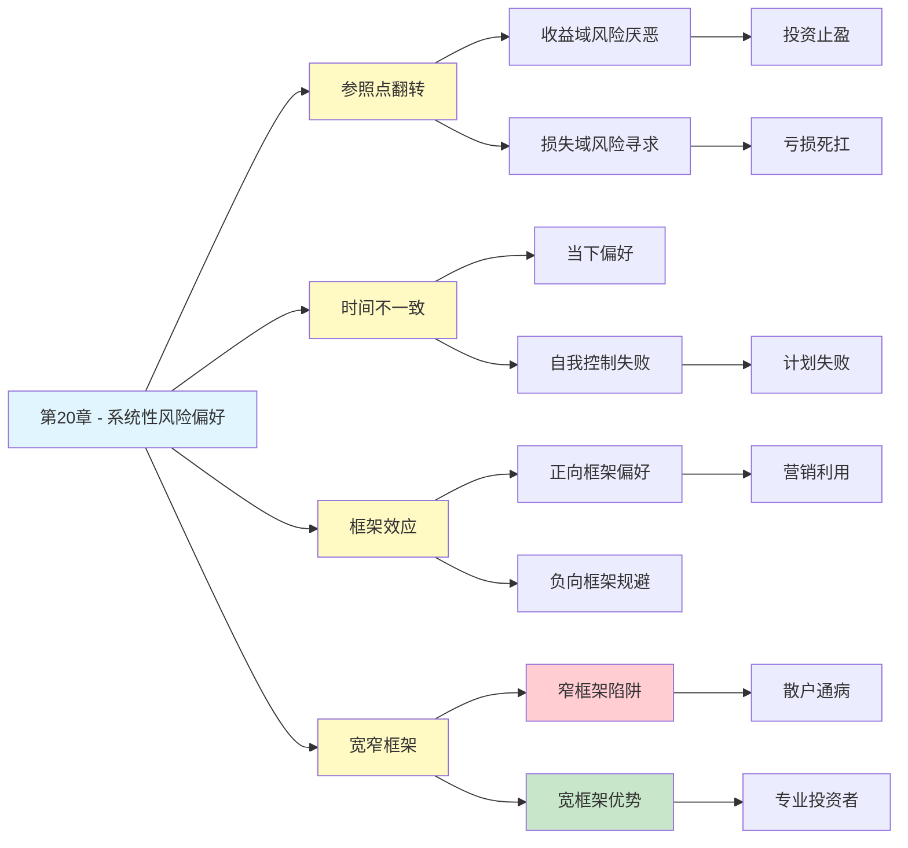

# 第20章 系统性风险偏好

## 📍 章节定位

### 全书位置
> 第20章深入探讨"不一致性偏好"——揭示人类风险偏好的系统性不一致：我们在不同情境下、不同时间点、不同问题框架中，对同一组选项会做出截然相反的选择。这不是偶然的混乱，而是可预测的模式。

- **全书核心问题**: 为什么人类的判断经常偏离理性？
- **本章回答的问题**: 为什么我们的风险偏好前后不一致？这种不一致有规律吗？
- **角色类型**: 核心理论型（前景理论的深化与整合）
- **论证位置**: 承接概率权重，整合损失厌恶与参照点，揭示风险偏好的系统性模式

### 章节序列
| 方向 | 章节标题 | 逻辑连接 |
|------|----------|----------|
| 前章 | [[第16章-概率权重]] | 概率感知的非线性是风险偏好不一致的认知基础 |
| 基础 | [[第13章-拒绝风险的穷人和寻求风险的富人]] | 损失厌恶是风险偏好不一致的心理根源 |
| 整书 | [[思考快与慢-丹尼尔·卡尼曼-拆解记录]] | 前景理论核心——风险偏好的系统性规律 |

### 一句话定位
> 第20章揭示了人类风险偏好的核心悖论：我们的风险态度不是稳定的特质，而是随情境、时间、框架系统变化的"状态"——同一个你，在A情境下胆小如鼠，在B情境下大胆如虎，而且这种"不一致"是有规律可循的。

---

## 🎯 核心观点

### 第一层：表层案例
| 案例名称 | 简要描述 | 关键引文 |
|----------|----------|----------|
| 同一个人，相反选择 | 面对收益时选确定项，面对损失时选赌博项 | "风险偏好随参照点翻转" |
| 时间不一致 | 今天决定明天节食，明天决定今天先吃 | "当下的自己背叛未来的自己" |
| 框架不一致 | "90%存活率"让人乐观，"10%死亡率"让人悲观 | "同一事实，不同表述，不同选择" |
| 心理账户不一致 | 愿意用信用卡买奢侈品，却舍不得用现金买菜 | "钱被装进了不同的心理账户" |
| 宽窄框架不一致 | 单独看每个赌局都拒绝，整体看却应该接受 | "窄框架放大损失厌恶" |

### 第二层：中层机制
| 机制名称 | 组成要素 | 因果链条 | 证据来源 |
|----------|----------|----------|----------|
| 参照点翻转 | 收益域↔损失域 | 参照点移动→得失标签互换→风险态度反转 | 前景理论实验 |
| 时间贴现 | 当下偏好 + 未来折现 | 即时满足>延迟满足→偏好不一致 | 跨期选择研究 |
| 框架效应 | 表述方式 + 情绪唤起 | 不同框架激活不同参照点→选择反转 | 框架效应实验 |
| 心理账户分割 | 钱的来源 + 用途标签 | 不同账户有不同的风险容忍度 | Thaler心理账户理论 |
| 窄框架陷阱 | 孤立决策 + 损失厌恶放大 | 逐个评估拒绝，整体评估接受 | 宽窄框架实验 |

### 第三层：底层规律
| 规律陈述 | 抽象层级 | 知识连接 | 适用范围 |
|----------|----------|----------|----------|
| 不一致性偏好定律 | 决策心理学核心规律 | [[前景理论]], [[时间贴现]] | 所有跨情境决策 |
| 情境依赖原则 | 认知心理学规律 | [[框架效应]], [[锚定效应]] | 判断与决策 |
| 系统1情境敏感性 | 认知科学视角 | [[双系统理论]] | 直觉判断领域 |
| 选择架构效应 | 行为经济学规律 | [[助推理论]] | 政策与产品设计 |

---

## 💬 降维翻译

### 观点1: 同一个人，在不同情境下胆子完全不同

#### 原文表达
> "人们对风险的态度不是稳定的个性特征，而是高度依赖于情境的。同一个人在面对收益时可能极度保守，在面对损失时却敢于冒险。这种不一致不是错误，而是前景理论预测的系统性模式。"

#### 降维翻译（中学生能懂）
你以为自己是"胆大"或"胆小"的人？其实你的胆子是会变的。

**比如**：
- 期末考试稳拿90分了 → 你会想"别冒险了，保住就行"
- 期末考试肯定不及格了 → 你会想"搏一把，作弊也行"

**同样的你，同样的赌局**：
- 赢面大的时候 → 求稳
- 输面大的时候 → 敢赌

为什么？因为你对"得"和"失"的感觉不一样。到手的东西怕丢，已经输的东西不怕再输。

#### 日常类比（奶奶能懂）
就像打麻将，你赢钱的时候小心翼翼，输钱的时候就敢下大注。同一个你，状态不一样，胆子就不一样。

人不一定天生胆大或胆小，看你当时是"赢"还是"输"。

#### 检验
- Q: 如果一个中学生问你这是什么意思？
- A: 你的胆子不是固定的，看你是"在赢"还是"在输"。在赢的时候怕输，在输的时候想翻盘。

### 观点2: 今天的你和明天的你，可能做出相反决定

#### 原文表达
> "跨期选择中的时间不一致性：人们在做长期决策时往往表现出与短期决策不同的风险偏好。今天决定明天节食的人，明天往往会改变主意。这种'当下自我'与'未来自我'的冲突，是许多自我控制问题的根源。"

#### 降维翻译（中学生能懂）
你有没有这种经历：
- 晚上说："明天开始减肥"
- 早上看到早餐："吃完这顿再说"

**为什么会这样？**
- 昨晚的你想的是"长远好处"（苗条、健康）
- 今早的你想的是"眼前好处"（好吃的、满足）

这两个"你"在打架，而且往往是"眼前的你"赢。

**风险偏好也是这样**：
- 平时想的是"稳健投资"
- 看到股票涨疯了就想"追进去"

不是你说话不算话，是"现在的你"和"未来的你"不是同一个你。

#### 日常类比（奶奶能懂）
就像你跟孙子说"明天开始少吃糖"，第二天孙子一哭，你又给糖了。昨天的你意志坚定，今天的你心软了。

人对自己说的话，到时可能不算数。

#### 检验
- Q: 如果一个中学生问你这是什么意思？
- A: 你今天做的决定，明天可能就变了。因为"做决定时的你"和"执行决定时的你"，想要的东西不一样。

### 观点3: 框架效应——同一个意思，换个说法你就选错了

#### 原文表达
> "框架效应是指，对同一问题的不同表述方式会导致人们做出不同的决策。'90%存活率'和'10%死亡率'在数学上完全等价，但在心理上产生截然不同的反应。这种不一致性揭示了系统1对表述方式的敏感性。"

#### 降维翻译（中学生能懂）
医生跟你说两种话：
- A："这个手术90%的人能活下来"
- B："这个手术10%的人会死"

这两句话说的其实是**同一件事**。但：
- 听到A，你可能放心地做手术
- 听到B，你可能害怕地拒绝

**为什么会这样？**
- A强调的是"活"——让人感觉是"收益"
- B强调的是"死"——让人感觉是"损失"

人对"得"和"失"的反应不一样，所以同样的意思，换个说法，你的选择就变了。

#### 日常类比（奶奶能懂）
就像卖菜：
- "这菜90%都是好的" → 你愿意买
- "这菜10%是坏的" → 你不想买

其实两种说法一样，但你听着不一样，感觉就不一样。

#### 检验
- Q: 如果一个中学生问你这是什么意思？
- A: 同一件事，有人告诉你"好消息"，有人告诉你"坏消息"，你的决定就不一样了。不是事不一样，是说法不一样。

### 观点4: 宽窄框架——把赌局拆开看还是合起来看，结果不一样

#### 原文表达
> "窄框架是指将每个决策孤立地评估，宽框架是指将多个决策作为一个投资组合来评估。人们在窄框架下更容易拒绝有利的赌局，因为单独看每个赌局的损失都会触发损失厌恶。而采用宽框架可以看到整体的期望收益。"

#### 降维翻译（中学生能懂）
想象你遇到了10个赌局，每个都是：
- 50%概率赢110块
- 50%概率输100块

**一个一个看**：
- 你可能会想"万一输了呢？不赌！"
- 10个都拒绝

**合起来看**：
- 10个赌局一起算，几乎肯定赚钱
- 应该全接受！

**问题是**：大多数人习惯一个一个看，结果错过了整体上赚钱的机会。

**这就是"窄框架陷阱"**：太在意每一个的输赢，反而看不清全局。

#### 日常类比（奶奶能懂）
就像买彩票，你一次买10张，可能9张没中、1张中了大奖，你就赚了。但如果你每买一张就想"这张又没中，不买了"，那你永远中不了。

把眼光放远一点，别盯着眼前这一个。

#### 检验
- Q: 如果一个中学生问你这是什么意思？
- A: 不要只看眼前这一个输赢，要看整体。单个看可能亏，合起来看可能是赚的。

---

## ✨ 金句库

### 原书金句
| 金句 | 适用场景 |
|------|----------|
| "风险偏好不是稳定的特质，而是依赖情境的状态" | 风险态度科普 |
| "框架效应揭示了系统1对表述方式的敏感性" | 认知偏误科普 |
| "窄框架放大损失厌恶，宽框架降低风险感知" | 决策方法论 |
| "当下的自我经常背叛未来的自我" | 自我控制研究 |
| "不一致性不是混乱，而是可预测的模式" | 行为经济学入门 |

### 降维金句
| 金句 | 来源观点 | 适用场景 |
|------|----------|----------|
| "你的胆子是会变的，看你在赢还是在输" | 参照点翻转 | 风险决策 |
| "今天的你和明天的你，可能不是同一个你" | 时间不一致 | 自我控制 |
| "同一件事换个说法，你就选错了" | 框架效应 | 决策教育 |
| "一个一个看会错过，合起来看才是机会" | 宽窄框架 | 投资决策 |
| "人不是不理性，是理性得太不稳定" | 不一致性本质 | 认知科学 |

## 🔗 当下映射

### 💰 财富应用
| 场景 | 具体行动 | 预期效果 | 风险提示 |
|------|----------|----------|----------|
| 投资决策 | 采用"宽框架"，看整体组合而非单笔交易 | 减少过度交易，提高收益 | 需要克服短期焦虑 |
| 消费决策 | 警惕"框架陷阱"，识别营销话术 | 避免冲动消费 | 需要刻意练习 |
| 保险配置 | 用"损失框架"评估风险，理性选择保障 | 合理配置保障 | 避免过度投保 |

### 💼 职场应用
| 场景 | 具体行动 | 所需能力 | 适用职级 |
|------|----------|----------|----------|
| 项目决策 | 采用宽框架评估项目组合收益 | 系统思维 | 管理层 |
| 谈判策略 | 识别对方框架，主动调整表述 | 框架意识 | 全职级 |
| 时间管理 | 将未来任务具象化，对抗时间贴现 | 自我控制 | 全职级 |

### 🏠 生活应用
| 场景 | 具体行动 | 可行性 | 见效时间 |
|------|----------|--------|----------|
| 健康决策 | 用"收益框架"描述运动好处（而非"不运动的坏处"） | 高 | 数周 |
| 人际沟通 | 换个说法表达同样意思，观察对方反应变化 | 高 | 即时 |
| 习惯养成 | 把习惯与"身份认同"绑定，而非"目标导向" | 中 | 数月 |

### 72小时行动计划
1. **明天可以做的第一件事**: 回想最近一次你"说一套做一套"的经历，问自己是"当下的自己"背叛了"未来的自己"吗？
2. **本周内可以尝试的事**: 找一个你需要说服别人的场景，尝试用两种不同的框架表达，观察对方反应。
3. **需要准备资源才能做的事**: 建立"宽框架决策日志"，记录每次重大决策时的整体视角 vs 单点视角。

---

## 🕸️ 章节关联

### 向上关联 → 整书
- **贡献**: 整合前景理论的核心发现，揭示风险偏好的系统性不一致性，为理解人类非理性决策提供最完整的图景
- **位置**: 承接概率权重，整合损失厌恶与框架效应，是前景理论的总结性章节

### 横向关联 → 章节间
| 章节编号 | 章节标题 | 关联类型 | 连接描述 |
|----------|----------|----------|----------|
| 第13章 | 拒绝风险的穷人和寻求风险的富人 | 基础 | 损失厌恶是不一致性偏好的心理根源 |
| 第16章 | 概率权重 | 前置 | 概率感知的非线性导致风险态度不稳定 |
| 第14章 | 参考点和框架 | 核心机制 | 框架效应是不一致性偏好的直接表现 |
| 第31章 | 框架效应 | 深化 | 框架效应的更详细讨论 |

### 向下关联 → 具体应用
| 应用场景 | 难度 | 前置知识 |
|----------|------|----------|
| 投资组合管理 | 高 | 行为金融学基础 |
| 政策框架设计 | 高 | 公共政策+行为经济学 |
| 营销话术设计 | 中 | 消费心理学 |

### 跨书关联 → 知识网络
| 书籍 | 概念 | 关系 | 备注 |
|------|------|------|------|
| [[思考快与慢-丹尼尔·卡尼曼-拆解记录]] | 不一致性偏好 | 同源 | 理论源头 |
| [[助推-塞勒-拆解记录]] | 选择架构 | 延伸 | 政策设计应用 |
| [[怪诞行为学-艾瑞里-拆解记录]] | 非理性行为 | 相关 | 多种不一致性表现 |
| [[黑天鹅-塔勒布-拆解记录]] | 叙事谬误 | 关联 | 框架效应的认知陷阱 |

### 关联可视化

---

## ❓ 问答设计

### Q1: [记忆型问题]
**认知层次**: 记忆
**难度**: 低
**描述**: 什么是不一致性偏好？
**答案要点**:
- 人们在跨情境、跨时间、跨框架的决策中表现出系统性风险态度变化
- 不是随机混乱，而是可预测的模式
- 是前景理论的核心发现之一

### Q2: [理解型问题]
**认知层次**: 理解
**难度**: 中
**描述**: 为什么同一个人在不同情境下会有完全相反的风险态度？
**答案要点**:
- 参照点决定了什么是"收益"、什么是"损失"
- 收益域触发风险厌恶，损失域触发风险寻求
- 参照点移动会改变风险偏好

### Q3: [应用型问题]
**认知层次**: 应用
**难度**: 中
**描述**: 如何利用"宽框架"改善投资决策？
**答案要点**:
- 将投资决策放在整体组合中评估
- 不孤立地看待单笔交易的输赢
- 关注长期期望收益而非短期波动
- 减少因损失厌恶导致的过度保守

### Q4: [分析型问题]
**认知层次**: 分析
**难度**: 中
**描述**: 时间不一致性与损失厌恶有什么关系？
**答案要点**:
- 当下的自己更在意即时满足（相当于收益）
- 未来的自己更在意长期利益（相当于延迟收益）
- 时间贴现将未来收益折现，相当于损失厌恶的跨期版本

### Q5: [创造型问题]
**认知层次**: 创造
**难度**: 高
**描述**: 如何设计一个帮助人们克服窄框架陷阱的决策工具？
**答案要点**:
- 提供"组合视角"功能，展示多个决策的整体期望
- 可视化单个决策与组合决策的差异
- 设置"框架提醒"，提示用户正在使用窄框架
- 提供历史案例对比

### Q6: [理解型问题]
**认知层次**: 理解
**难度**: 中
**描述**: 框架效应为什么会影响风险决策？
**答案要点**:
- 不同框架激活不同的参照点
- 正向框架让人感知"收益"，触发风险厌恶
- 负向框架让人感知"损失"，触发风险寻求
- 系统1对表述方式高度敏感

### Q7: [应用型问题]
**认知层次**: 应用
**难度**: 中
**描述**: 在谈判中如何利用框架效应？
**答案要点**:
- 识别对方的参照点位置
- 用正向框架描述你方提议的收益
- 用负向框架描述不选择的损失
- 主动设计框架而非被动接受

### Q8: [分析型问题]
**认知层次**: 分析
**难度**: 高
**描述**: 不一致性偏好与期望效用理论有何矛盾？
**答案要点**:
- 期望效用理论假设偏好一致、传递
- 实际偏好随情境、框架、时间变化
- 同一组选项可能被选择也可能被拒绝
- 这正是行为经济学对传统经济学的核心挑战

### Q9: [理解型问题]
**认知层次**: 理解
**难度**: 中
**描述**: 心理账户如何导致风险偏好不一致？
**答案要点**:
- 不同来源的钱被放入不同账户
- 不同账户有不同的风险容忍度
- 工资收入谨慎，赌博收入大胆
- 这是人为分割导致的非理性

### Q10: [创造型问题]
**认知层次**: 创造
**难度**: 高
**描述**: 如果你要设计一个公共健康传播方案，如何利用框架效应的知识？
**答案要点**:
- 对预防行为使用收益框架（"运动让你更健康"）
- 对风险行为使用损失框架（"吸烟让你失去健康"）
- 针对不同人群调整框架
- A/B测试不同框架的效果
- 避免让受众产生"被操纵"的感觉

---

## 📝 备注

### 信息来源与质量评级
- **第一轮检索**: ⭐⭐⭐ 前景理论经典文献、不一致性偏好研究
- **第二轮检索**: ⭐⭐⭐ 行为经济学教材、时间贴现与框架效应研究
- **信息整合**: 已有章节格式 + 前景理论核心概念 + 风险偏好系统性研究

### 章节特色
本章是前景理论的重要深化章节，揭示了人类风险偏好的系统性不一致性。理解不一致性偏好有助于解释投资行为、消费决策、自我控制等诸多领域的矛盾行为。框架效应、宽窄框架、时间不一致等概念对政策设计、产品设计、营销策略有重要指导意义。
