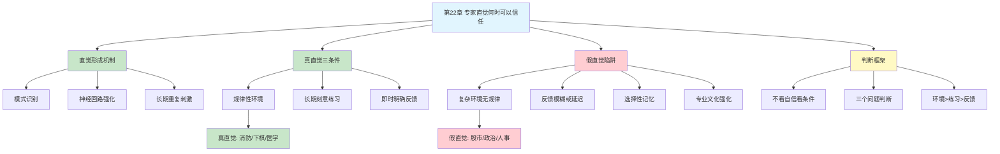

# 第22章 专家直觉何时可以信任

## 📍 章节定位

### 全书位置
> 第22章回答了全书最实用的决策问题之一：什么时候可以相信专家的直觉？卡尼曼与克莱因的对话揭示了一个关键判断标准——直觉的有效性取决于两个条件：规律性环境和即时反馈。这一章为"相信直觉还是相信公式"提供了科学答案。

- **全书核心问题**: 人类的决策是如何偏离理性的？
- **本章回答的问题**: 什么时候可以相信专家的直觉？什么时候应该用公式替代？
- **角色类型**: 核心应用型（直觉信任的边界条件）
- **论证位置**: 第四部分"选择"的关键章节，承接直觉对抗公式的讨论

### 章节序列
| 方向 | 章节标题 | 逻辑连接 |
|------|----------|----------|
| 前章 | [[第21章-直觉对抗公式]] | 从公式优势转向直觉可信条件 |
| 后章 | [[第23章-未来的不确定性]] | 从专家直觉转向规划预测 |
| 整书 | [[思考快与慢-丹尼尔·卡尼曼-拆解记录]] | 直觉决策的核心判断标准 |

### 一句话定位
> 第22章告诉我们：专家直觉不是"信或不信"的选择题，而是"满足条件才有效"的判断题——只有规律环境加长期练习加即时反馈，专家直觉才值得信任。

---

## 🎯 核心观点

### 第一层：表层案例

| 案例名称 | 简要描述 | 关键发现 |
|----------|----------|----------|
| 消防指挥官直觉 | 老消防员在火场"感觉不对劲"，下令撤离后大楼倒塌 | 真直觉：规律环境+即时反馈 |
| 国际象棋大师 | 大师看棋盘5秒，判断形势准确率极高 | 真直觉：固定规则+长期练习 |
| 护士判断早产 | NICU护士能直觉判断婴儿感染，比仪器更早 | 真直觉：反复接触+即时验证 |
| 股票分析师预测 | 分析师自信预测股价，长期记录不如随机 | 假直觉：复杂环境+反馈模糊 |
| 政治专家预测 | 学者预测国际事件，准确率不如抛硬币 | 假直觉：无规律+无反馈 |
| HR面试判断 | 面试官凭"眼缘"选人，预测工作表现很差 | 假直觉：信息少+反馈慢 |

### 第二层：中层机制

| 机制名称 | 组成要素 | 因果链条 | 证据来源 |
|----------|----------|----------|----------|
| 直觉形成机制 | 规律环境+长期练习+即时反馈 | 模式重复→神经回路强化→快速识别→直觉产生 | 技能习得研究 |
| 真直觉识别 | 可预测环境+足够练习+明确反馈 | 环境→练习→反馈→直觉有效 | Klein消防员研究 |
| 假直觉陷阱 | 复杂环境+反馈模糊+选择记忆 | 判断→无验证→记对忘错→虚假自信 | 专家预测研究 |
| 环境结构效应 | 规律性程度决定直觉上限 | 高规律→直觉可学；低规律→直觉无效 | 认知科学研究 |
| 反馈延迟效应 | 反馈越慢，学习越难 | 行动→延迟反馈→关联减弱→学不会 | 学习心理学 |

### 第三层：底层规律

| 规律陈述 | 抽象层级 | 知识连接 | 适用范围 |
|----------|----------|----------|----------|
| 直觉可信双条件定律 | 认知科学基础 | [[技能习得理论]], [[刻意练习]] | 专业判断领域 |
| 环境结构定律 | 认知科学规律 | [[规律环境]], [[随机环境]] | 区分有效/无效直觉 |
| 反馈即时性定律 | 学习科学规律 | [[强化学习]], [[反馈延迟]] | 技能习得场景 |
| 模式识别阈值定律 | 认知科学规律 | [[模式识别]], [[神经可塑性]] | 需要多少次练习才能形成直觉 |

---

## 💬 降维翻译

### 观点1: 直觉不是玄学，是模式识别

#### 原文表达
> "专家直觉不是神秘的第六感，而是经过长期训练后的大脑模式识别。当一个人在规律性环境中反复练习，并且能够获得即时反馈时，他的大脑就会形成快速识别模式的能力，这就是我们所说的'直觉'。"

#### 降维翻译（中学生能懂）
直觉不是什么超能力，是大脑的"模式匹配"功能。

举个例子：
- 你一眼认出你妈——这是直觉吗？是，因为你见过她无数次
- 老师一眼看出谁抄作业——这是直觉吗？是，因为他抓过无数次

**直觉的本质**：
- 见过很多次 → 大脑记住模式 → 再遇到自动识别 → "我感觉是这样"

**问题来了**：
- 见得不够多 → 直觉不准
- 见的没有规律 → 直觉瞎猜

#### 日常类比（奶奶能懂）
就像你认人。你认识的人，隔老远就能认出来，不用想。但让你认一个只见过一次的陌生人，你能认出来吗？不能，因为没见过几次。

直觉就是"认熟人"——见多了，自然就认识了。

#### 检验
- Q: 如果一个中学生问你这是什么意思？
- A: 直觉不是魔法，是见多了自然就会。就像你不用想就能认出好朋友，因为你见过很多次。

---

### 观点2: 什么时候信直觉？三个条件

#### 原文表达
> "直觉可信需要两个核心条件：第一，环境必须有足够的规律性，同样的情况会导致类似的结果；第二，专家必须有足够长的练习时间来学习这些规律。实际上，还有第三个条件：即时反馈，让专家能知道自己猜对了还是猜错了。"

#### 降维翻译（中学生能懂）
什么时候可以信专家的直觉？看三个条件：

**条件1：环境有规律**
- 国际象棋：规则固定，局面有限 → 有规律 → 可以信
- 股市：无数因素，变化莫测 → 没规律 → 不能信

**条件2：练习够久**
- 消防员：救过几百次火 → 够久 → 可以信
- 刚入职的分析师：只预测过几次 → 不够久 → 不能信

**条件3：反馈够快**
- 医生诊断：检查完马上知道对错 → 够快 → 可以信
- 政治预测：几年后才知道对错 → 太慢 → 不能信

**一句话**：三个条件全满足，直觉才靠谱。缺一个，直觉就是瞎猜。

#### 日常类比（奶奶能懂）
就像老农看天。他种了一辈子地（练习久），天气变化有规律（环境规律），第二天就知道预报准不准（反馈快）——所以他的天气预报可以信。

但你让老农预测股票，他再自信也没用，因为股票没规律，也没有及时反馈。

#### 检验
- Q: 如果一个中学生问你这是什么意思？
- A: 信直觉之前问自己：这事有规律吗？这个人练了很久吗？他能马上知道自己对不对吗？三个都是，才可信。

---

### 观点3: 为什么有些专家的直觉不靠谱

#### 原文表达
> "在低效性环境中，专家的直觉并不比普通人更准确。但专家自己并不知道这一点。选择性记忆让他们记住成功的预测，忘记失败的预测。专业文化让他们相信自己的判断。缺乏系统性的反馈让他们无法发现自己的错误。"

#### 降维翻译（中学生能懂）
为什么股评家、政治专家、HR面试官的直觉不靠谱？

**原因1：环境太复杂**
- 股市受政策、情绪、天气、甚至一条推特影响
- 没人能搞懂所有因素

**原因2：反馈太模糊**
- 股票涨了，是你预测对了，还是运气好？不知道
- 预测错了，是因为分析错了，还是市场疯了？不知道

**原因3：记忆会骗人**
- 预测对了 → 到处吹："我早就说了！"
- 预测错了 → 忘了，或者找借口："这次特殊情况"

**结果**：专家觉得自己很厉害，其实只是记得住对的，忘得了错的。

#### 日常类比（奶奶能懂）
就像一个天天买彩票的人。中奖那次他记得特别清楚，吹了一整年。没中奖的那364天，他全忘了。你问他中奖率高不高，他说"挺高的"。

专家预测也是这样，记住对的，忘记错的。

#### 检验
- Q: 如果一个中学生问你这是什么意思？
- A: 有些专家的直觉不准，因为事情太复杂没规律，而且他们只记得自己猜对的时候，猜错的全忘了。

---

### 观点4: 如何判断要不要信专家

#### 原文表达
> "判断专家直觉是否可信，不要看他的自信程度，不要看他的头衔，要看他所在领域的环境结构。问自己三个问题：这个领域有规律吗？他练习了多久？他能获得即时反馈吗？如果三个答案都是肯定的，那么他的直觉可能值得信任。"

#### 降维翻译（中学生能懂）
判断要不要信专家，不要看：
- 他有多自信（自信不等于正确）
- 他有什么头衔（头衔不等于能力）
- 他说得多肯定（说得好听不等于做得好）

要看三个问题：

| 问题 | 信 | 不信 |
|------|-----|------|
| 这个领域有规律吗？ | 消防、下棋、医学 | 股市、政治、人事 |
| 他练了多久？ | 几千次以上 | 几十次 |
| 反馈够快吗？ | 当天知道对错 | 几年后才知道 |

**一句话**：不要问"你确定吗"，要问"你在什么环境下练了多久，反馈有多快"。

#### 日常类比（奶奶能懂）
就像选出租车司机。你不问他"你确定能开到吗"，你问他"你开了几年了，这条路熟不熟"。

选专家也一样，不看他说什么，看他练了多久、环境熟不熟、能不能马上知道对错。

#### 检验
- Q: 如果一个中学生问你这是什么意思？
- A: 判断专家靠不靠谱，不要问他确定不确定，要看他做的事有没有规律、他练了多久、他能多快知道自己对不对。

---

## ✨ 金句库

### 原书金句
| 金句 | 适用场景 |
|------|----------|
| "直觉是模式识别，不是魔法" | 直觉科普 |
| "规律环境+长期练习+即时反馈=可信赖的直觉" | 判断标准 |
| "在低效性环境中，专家的直觉并不比普通人更准确" | 专家审视 |
| "选择性记忆让专家记住成功，忘记失败" | 认知偏误 |
| "判断直觉的可信度，看环境结构，不看自信程度" | 决策原则 |

### 降维金句
| 金句 | 来源观点 | 适用场景 |
|------|----------|----------|
| "直觉是见多了自然就会，不是想有就能有" | 直觉本质 | 日常科普 |
| "三个条件全满足，直觉才靠谱：有规律+练很久+反馈快" | 信任条件 | 快速判断 |
| "老农可以信天气预报，不能信股票预测——区别在环境" | 环境结构 | 投资警示 |
| "专家只记得猜对的时候，猜错的早就忘了" | 记忆偏误 | 质疑权威 |
| "别问专家'你确定吗'，问'你在什么环境练了多久'" | 判断方法 | 决策技巧 |

## 🔗 当下映射

### 💰 财富应用
| 场景 | 具体行动 | 预期效果 | 风险提示 |
|------|----------|----------|----------|
| 投资决策 | 区分"规律领域"和"随机领域"，股市属于后者 | 减少对专家直觉的依赖 | 可能错过真正的规律机会 |
| 选基金 | 看长期业绩数据，不听基金经理"故事" | 更理性的选择 | 过去不代表未来 |
| 买房决策 | 用"规律+练习+反馈"框架评估中介建议 | 减少被忽悠 | 需要自己做功课 |
| 创业方向 | 评估行业规律性，不凭直觉选赛道 | 更客观的判断 | 可能过于保守 |

### 💼 职场应用
| 场景 | 具体行动 | 所需能力 | 适用职级 |
|------|----------|----------|----------|
| 招聘决策 | 用结构化面试替代"眼缘"判断 | 评估框架设计 | HR及以上 |
| 战略判断 | 区分可预测和不可预测因素 | 不确定性分析 | 高管层 |
| 绩效预测 | 用数据替代对员工的"直觉判断" | 数据分析能力 | 管理层 |
| 咨询决策 | 用"三条件框架"评估顾问建议 | 批判性思维 | 所有职级 |

### 🏠 生活应用
| 场景 | 具体行动 | 可行性 | 见效时间 |
|------|----------|--------|----------|
| 看医生 | 区分"经验诊断"和"数据诊断" | 高 | 即时生效 |
| 选学校 | 看数据而非听"口碑故事" | 中 | 长期受益 |
| 买保险 | 不信销售员"专业判断"，看条款数据 | 高 | 即时生效 |
| 选培训班 | 评估培训效果的可验证性 | 中 | 中期见效 |

### 72小时行动计划
1. **明天可以做的第一件事**: 回想最近一次听"专家建议"的经历，用"三条件框架"重新评估（有规律？练很久？反馈快？）
2. **本周内可以尝试的事**: 列出你经常凭"直觉"判断的3件事，检验它们是否满足"三条件"
3. **需要准备资源才能做的事**: 建立"专家可信度评估表"，每次咨询专家前先用三条件打分

---

## 🕸️ 章节关联

### 向上关联 → 整书
- **贡献**: 提供判断专家直觉可信度的科学框架，是全书理论的最实用应用
- **位置**: 第四部分"选择"的核心章节，承接公式vs直觉的讨论

### 横向关联 → 章节间
| 章节编号 | 章节标题 | 关联类型 | 连接描述 |
|----------|----------|----------|----------|
| 第21章 | 直觉对抗公式 | 前置 | 公式优势引出问题：直觉什么时候有用 |
| 第11章 | 锚定效应 | 机制 | 直觉受锚定影响，公式不会 |
| 第20章 | 有效性的错觉 | 相关 | 过度自信让我们高估直觉 |
| 第26章 | 专家的错觉 | 深化 | 专家直觉失败的具体案例 |

### 向下关联 → 具体应用
| 应用场景 | 难度 | 前置知识 |
|----------|------|----------|
| 投资决策纠偏 | 中 | 金融基础 |
| 招聘面试改进 | 中 | HR专业知识 |
| 咨询顾问评估 | 低 | 无 |
| 个人直觉校准 | 低 | 无 |

### 跨书关联 → 知识网络
| 书籍 | 概念 | 关系 | 备注 |
|------|------|------|------|
| [[思考快与慢-丹尼尔·卡尼曼-拆解记录]] | 直觉可信条件 | 同源 | 本章核心主题 |
| [[超预测-泰洛克]] | 狐狸型思维 | 相关 | 预测方法比较 |
| [[黑天鹅-塔勒布-拆解记录]] | 专家预测失败 | 延伸 | 复杂系统的不可预测性 |
| [[刻意练习-艾利克森]] | 技能习得 | 基础 | 直觉形成机制的理论基础 |

### 关联可视化

---

## ❓ 问答设计

### Q1: [记忆型问题]
**认知层次**: 记忆
**难度**: 低
**描述**: 直觉可信需要哪三个条件？
**答案要点**:
- 环境具有足够的规律性
- 专家经过长期刻意练习
- 能够获得即时、明确的反馈
- 三个条件缺一不可

### Q2: [理解型问题]
**认知层次**: 理解
**难度**: 中
**描述**: 为什么消防员的直觉比股票分析师的直觉更可信？
**答案要点**:
- 火场有物理规律，股市变量太多太复杂
- 消防员有即时反馈（成功或失败很快知道）
- 股票分析师的反馈模糊且延迟
- 环境结构决定直觉上限

### Q3: [应用型问题]
**认知层次**: 应用
**难度**: 中
**描述**: 如何用"三条件框架"评估一个医疗专家的建议是否值得听取？
**答案要点**:
- 问：这个病有规律吗？（常见病vs罕见病）
- 问：这个医生看过多少类似病例？（经验丰富vs刚入行）
- 问：诊断效果能很快验证吗？（实验室检查vs长期随访）
- 三条件都满足，建议更可信

### Q4: [分析型问题]
**认知层次**: 分析
**难度**: 中
**描述**: 为什么专家预测失败后往往不承认错误，继续保持自信？
**答案要点**:
- 选择性记忆：记住对的，忘记错的
- 反馈缺失：没有系统性追踪预测准确性
- 后见之明：事后觉得自己"其实有预感"
- 身份认同：承认失败威胁专家身份
- 专业文化：行业内部强化自信

### Q5: [创造型问题]
**认知层次**: 创造
**难度**: 高
**描述**: 设计一个帮助团队评估"是否应该相信某专家建议"的决策流程
**答案要点**:
- 第一步：识别问题领域（规律vs随机）
- 第二步：评估专家经验（练习次数、年资）
- 第三步：检查反馈机制（能多快验证对错）
- 第四步：查看历史记录（如果有的话）
- 第五步：综合打分，决定权重
- 附加：建立预测追踪机制，持续验证

### Q6: [理解型问题]
**认知层次**: 理解
**难度**: 中
**描述**: 直觉的本质是什么？为什么说它不是"第六感"？
**答案要点**:
- 直觉是模式识别，是大脑的快速匹配功能
- 经过长期重复刺激后，神经回路强化
- 遇到类似情况时，大脑自动调用已有模式
- 不是神秘的超能力，是可解释的神经活动
- 就像认人、认路一样平常

### Q7: [应用型问题]
**认知层次**: 应用
**难度**: 中
**描述**: 在招聘面试中，如何减少对"直觉"的依赖？
**答案要点**:
- 使用结构化面试，减少随意聊天
- 预设评分标准，主观判断转化为客观评分
- 延迟形成判断，多轮独立评估
- 用行为证据替代"眼缘感受"
- 建立预测追踪机制，验证面试判断的准确性

### Q8: [分析型问题]
**认知层次**: 分析
**难度**: 高
**描述**: 为什么反馈延迟会导致直觉学习失败？
**答案要点**:
- 学习需要行为和结果的关联
- 延迟越长，关联越弱
- 中间发生的事情干扰归因
- 无法判断是技能导致结果还是运气
- 例子：政治预测几年后才知道对错

### Q9: [理解型问题]
**认知层次**: 理解
**难度**: 中
**描述**: "规律环境"和"随机环境"的区别是什么？各举两个例子
**答案要点**:
- 规律环境：同样的情况会导致类似的结果
  - 国际象棋：规则固定，局面有限
  - 消防：火有物理规律
- 随机环境：变量太多，无法预测
  - 股市：受政策、情绪、天气等无数因素影响
  - 政治：人类行为太复杂
- 区别：能否从过去学到可重复的模式

### Q10: [创造型问题]
**认知层次**: 创造
**难度**: 高
**描述**: 如果你是一家公司的CEO，如何利用本章知识改进公司的决策流程？
**答案要点**:
- 识别公司决策的类型（规律vs随机）
- 规律领域：信任资深员工的直觉，但建立验证机制
- 随机领域：减少对"专家直觉"的依赖，用数据决策
- 建立"决策追踪"制度，验证每次判断的准确性
- 培养"三条件思维"：每次听建议都问环境、练习、反馈
- 对战略性预测，引入"事前验尸"机制

---

## 📝 备注

### 信息来源与质量评级
- **第一轮检索**: ⭐⭐⭐ 《思考快与慢》原书第22章内容、专家直觉理论
- **第二轮检索**: ⭐⭐⭐ Klein消防员研究、技能习得研究
- **信息整合**: 已有章节格式 + 直觉可信条件理论 + 卡尼曼-克莱因对话

### 章节特色
本章是全书最实用的章节之一，回答了一个关键问题：什么时候可以相信专家的直觉？卡尼曼与克莱因的跨学科对话揭示了一个简洁的判断框架：规律环境+长期练习+即时反馈。这个框架可以帮助我们在投资、医疗、招聘等重要决策中，更理性地评估"专家建议"的价值。

### 核心洞见
> 直觉不是"信或不信"的选择题，而是"满足条件才有效"的判断题。判断专家的直觉，不要看他说得多么确定，要看他所在的环境有没有规律、他练了多久、他能多快知道自己对不对。
