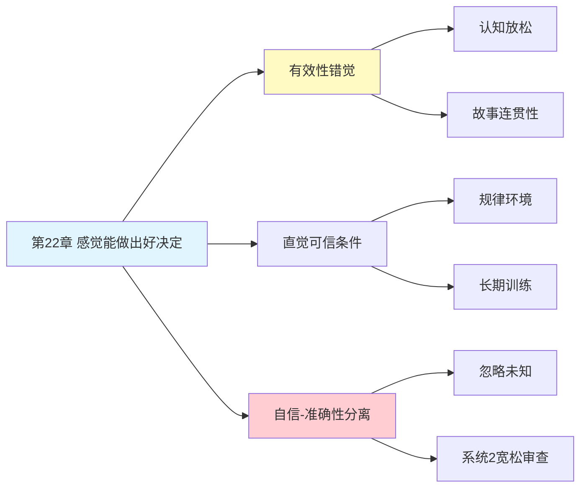

# 第22章 感觉能做出好决定

## 📍 章节定位

### 全书位置
> 第22章探讨专家直觉的可信度边界——什么时候可以相信直觉，什么时候不能。核心揭示一个悖论：我们对判断的自信程度，与判断的实际准确性几乎没有关系。这就是"有效性错觉"。

- **全书核心问题**: 为什么人类的判断经常偏离理性？
- **本章回答的问题**: 为什么我们觉得自己做出了好决定，实际上可能完全错了？什么时候可以相信专家的直觉？
- **角色类型**: 核心概念型（揭示自信与准确性的分离）
- **论证位置**: 过度自信部分的核心章节，连接直觉形成机制与判断错误

### 章节序列
| 方向 | 章节标题 | 逻辑连接 |
|------|----------|----------|
| 前章 | [[第21章-我们已经预见到了]] | 后见之明偏误延续到对当前判断的过度自信 |
| 后章 | [[第23章-未来的不确定性]] | 从直觉可信度转向规划预测的失败 |
| 整书 | [[思考快与慢-丹尼尔·卡尼曼-拆解记录]] | 深入剖析过度自信的核心机制 |

### 一句话定位
> 第22章揭示了"有效性错觉"——我们对判断的自信来自认知放松和故事连贯性，而非判断的实际准确性，这使得自信成为预测准确性的糟糕指标。

---

## 🎯 核心观点

### 第一层：表层案例

| 案例名称 | 简要描述 | 关键引文 |
|----------|----------|----------|
| 消防指挥官直觉 | 老消防员在火场"感觉不对劲"下令撤离，事后证明正确 | "直觉识别出环境规律" |
| 股票分析师预测 | 分析师对公司前景高度自信，但预测准确率接近随机 | "自信与准确性完全脱钩" |
| 医生诊断直觉 | 有经验医生快速识别疾病模式 | "专业技能需要规律环境+长期训练" |
| 政治专家预测 | 政治学者对国际事件预测，准确性不如随机选择 | "复杂环境无规律可循" |
| 招聘面试官 | HR对候选人"第一印象"高度自信，但预测工作表现很差 | "主观自信不可靠" |

### 第二层：中层机制

| 机制名称 | 组成要素 | 因果链条 | 证据来源 |
|----------|----------|----------|----------|
| 有效性错觉 | 认知放松 + 故事连贯性 | 信息有限→构建连贯故事→感觉"有效"→产生自信 | 认知心理学实验 |
| 直觉形成条件 | 规律环境 + 长期训练 + 即时反馈 | 环境可预测→技能可习得→模式可识别→直觉可靠 | 技能习得研究 |
| 自信-准确性分离 | 系统1抑制怀疑 + 眼见即为事实 | 忽略未知信息→认知放松→错误自信 | 判断与决策研究 |
| 技能错觉 | 专业文化 + 选择性记忆 | 成功被记住→失败被遗忘→高估能力 | 认知偏误研究 |

### 第三层：底层规律

| 规律陈述 | 抽象层级 | 知识连接 | 适用范围 |
|----------|----------|----------|----------|
| 自信≠准确性定律 | 认知心理学基础 | [[有效性错觉]], [[过度自信效应]] | 所有主观判断领域 |
| 直觉可信的双条件 | 技能习得理论 | [[刻意练习]], [[模式识别理论]] | 专业技能判断 |
| 零效度环境定理 | 预测理论 | [[随机游走]], [[有效市场假说]] | 复杂社会预测 |

---

## 💬 降维翻译

### 观点1: 自信不等于正确

#### 原文表达
> "人们对直觉的自信心不能作为他们判断有效性的可靠指标。即使判断的是错误的问题，在作出这一判断时仍可能有高度的自信。系统1通常会用另一个问题快速替换掉难题，创造出并不存在的关联，而系统2会宽松地审查这个答案。"

#### 降维翻译（中学生能懂）
感觉自己很确定，不代表你是对的：

- 你对答案越有信心，不代表答案越正确
- 脑子觉得"这事儿我懂"，可能只是因为你听过类似的故事
- 第一反应特别快、特别顺，反而要警惕

就像考试时你觉得"这题我会"，结果错了。感觉和事实是两回事。

#### 日常类比（奶奶能懂）
就像打牌时，你觉得这把稳赢，心里特别踏实，结果输得最惨。那个"稳赢的感觉"是脑子自己骗自己的，跟牌的好坏没关系。

#### 检验
- Q: 如果一个中学生问你这是什么意思？
- A: 觉得自己是对的，和真的是对的，这两件事没啥关系。越感觉确定，越可能出错。

### 观点2: 什么时候可以相信直觉

#### 原文表达
> "直觉可信需要两个条件：一个可预测的、有足够规律可循的环境；一次通过长期训练学习这些规律的机会。如果这两个条件满足，联想机制就会识别情境并做出快速且准确的预测。不幸的是，大多数专业判断的环境并不满足这些条件。"

#### 降维翻译（中学生能懂）
直觉靠谱需要两个条件都满足：

1. **环境有规律**：事情发生有规律可循，不是乱来的
   - 消防员面对的火场有物理规律 → 直觉可信
   - 股市受无数因素影响 → 直觉不可信

2. **你练了很久**：不是"我觉得"，而是"我见过无数次"
   - 下棋大师看过10万盘棋 → 直觉可信
   - 股票分析师预测过几十次 → 直觉不可信

两个条件缺一个，直觉就不靠谱。

#### 日常类比（奶奶能懂）
就像老中医看一眼就知道你哪不舒服，因为他看过几万个病人，病的表现有规律。但让同一个老中医预测明天股市涨跌，他就跟普通人一样瞎猜。

#### 检验
- Q: 如果一个中学生问你这是什么意思？
- A: 直觉要靠谱，得是"有规律的事"加上"练了很久"。缺一样，直觉就是瞎猜，不管你多自信。

### 观点3: 为什么我们会过度自信

#### 原文表达
> "联想机制会抑制怀疑并引发与当前情况相符的想法与信息，遵从眼见即为事实原则。我们的大脑通过忽略自己所不知道的事而变得过于自信。认知放松和一致性给了我们自信的感觉，但这种自信与判断的实际质量无关。"

#### 降维翻译（中学生能懂）
自信是怎么产生的？不是因为你真的厉害，而是因为：

- 脑子自动忽略你不知道的信息
- 只找支持你想法的证据
- 故事编得通，就觉得是对的

就像你只看朋友圈的点赞，觉得自己人缘好，但看不到有多少人把你屏蔽了。

#### 日常类比（奶奶能懂）
就像井底之蛙觉得天只有井口那么大，因为它只能看到那么多。它不是蠢，是看不见更大的世界，所以特别自信。

#### 检验
- Q: 如果一个中学生问你这是什么意思？
- A: 我们自信，往往是因为不知道自己不知道什么。不是我们厉害，是我们不知道的太多。

---

## ✨ 金句库

### 原书金句
| 金句 | 适用场景 |
|------|----------|
| "主观自信不能作为直觉准确性的可靠指标" | 决策纠偏提醒 |
| "自信来自认知放松，而非判断质量" | 过度自信警示 |
| "忽略未知让我们变得过于自信" | 认知局限说明 |
| "直觉可信需要规律环境和长期训练" | 直判断标准 |

### 降维金句
| 金句 | 来源观点 | 适用场景 |
|------|----------|----------|
| "感觉对不等于真的对" | 自信≠正确 | 决策提醒 |
| "越自信，越可能出错" | 过度自信悖论 | 投资警示 |
| "直觉需要两个条件：有规律+练很久" | 直觉可信条件 | 专业判断 |
| "自信是脑子编的故事，不是事实的证明" | 自信来源解密 | 认知科普 |

## 🔗 当下映射

### 💰 财富应用
| 场景 | 具体行动 | 预期效果 | 风险提示 |
|------|----------|----------|----------|
| 投资决策 | 区分"规律环境"和"随机环境"，股市属于后者 | 避免过度自信导致的频繁交易 | 可能错过真正的规律机会 |
| 择业判断 | 警惕"我觉得这行有前途"的直觉判断 | 更理性地评估行业前景 | 分析过度导致决策瘫痪 |
| 消费选择 | 对销售员的"专业建议"保持警惕 | 减少被自信话术忽悠 | 可能错过真正专业的建议 |

### 💼 职场应用
| 场景 | 具体行动 | 所需能力 | 适用职级 |
|------|----------|----------|----------|
| 招聘决策 | 用结构化面试替代直觉判断 | 评估框架设计能力 | HR及以上 |
| 战略规划 | 区分可预测和不可预测因素 | 不确定性分析能力 | 高管层 |
| 项目评估 | 建立"直觉审计"机制，质疑自信来源 | 批判性思维 | 项目经理及以上 |

### 🏠 生活应用
| 场景 | 具体行动 | 可行性 | 见效时间 |
|------|----------|--------|----------|
| 健康判断 | 区分医生"经验直觉"和"数据诊断" | 高 | 即时生效 |
| 人际关系 | 警惕"第一眼感觉"的过度自信 | 中 | 持续练习 |
| 学习评估 | 用测试替代"我觉得学会了"的自信 | 高 | 即时生效 |

### 72小时行动计划
1. **明天可以做的第一件事**: 回顾最近一次"特别有信心"的判断，检查它是否真的正确
2. **本周内可以尝试的事**: 列出你自认为"有直觉"的领域，用"规律环境+长期训练"标准检验
3. **需要准备资源才能做的事**: 建立个人"自信-准确性追踪表"，记录每次自信判断的实际结果

---

## 🕸️ 章节关联

### 向上关联 → 整书
- **贡献**: 揭示过度自信的核心机制——自信与准确性分离
- **位置**: 过度自信部分关键章节，连接直觉理论与判断错误

### 横向关联 → 章节间
| 章节编号 | 章节标题 | 关联类型 | 连接描述 |
|----------|----------|----------|----------|
| 第21章 | 我们已经预见到了 | 延续 | 后见之明偏误导致对当前判断过度自信 |
| 第23章 | 未来的不确定性 | 承接 | 规划谬误是过度自信的另一种表现 |
| 第11章 | 焦虑情绪和概率错觉 | 相关 | 情感影响判断自信 |
| 第12章 | 科学与直觉推理 | 核心关联 | 直何时可信的完整回答 |

### 向下关联 → 具体应用
| 应用场景 | 难度 | 前置知识 |
|----------|------|----------|
| 投资决策纠偏 | 中 | 金融基础 |
| 招聘面试改进 | 中 | HR专业知识 |
| 医疗判断审视 | 高 | 医学背景 |

### 跨书关联 → 知识网络
| 书籍 | 概念 | 关系 | 备注 |
|------|------|------|------|
| [[思考快与慢-丹尼尔·卡尼曼-拆解记录]] | 有效性错觉 | 同源 | 核心理论来源 |
| [[噪声-卡尼曼-拆解记录]] | 判断噪声 | 延伸 | 自信无法减少噪声 |
| [[穷查理宝典-拆解记录]] | 能力圈 | 互补 | 知道边界才能避免过度自信 |
| [[黑天鹅-塔勒布-拆解记录]] | 叙事谬误 | 相关 | 故事连贯性≠事实准确性 |

### 关联可视化

---

## ❓ 问答设计

### Q1: [记忆型问题]
**认知层次**: 记忆
**难度**: 低
**描述**: 直觉可信需要哪两个条件？
**答案要点**:
- 可预测的、有足够规律可循的环境
- 通过长期训练学习这些规律的机会

### Q2: [理解型问题]
**认知层次**: 理解
**难度**: 中
**描述**: 为什么主观自信不能作为判断准确性的指标？
**答案要点**:
- 自信来自认知放松和故事连贯性
- 脑子忽略未知信息产生虚假自信
- 系统2对系统1的输出宽松审查

### Q3: [应用型问题]
**认知层次**: 应用
**难度**: 中
**描述**: 股票分析师的直觉预测可信吗？为什么？
**答案要点**:
- 基本不可信
- 股市是低规律环境，难以形成有效直觉
- 分析师自信与预测准确性长期分离

### Q4: [分析型问题]
**认知层次**: 分析
**难度**: 中
**描述**: 消防员的火场直觉为什么比股票分析师的预测更可信？
**答案要点**:
- 火场有物理规律，股市充满随机性
- 消防员有即时反馈，分析师反馈滞后
- 环境规律性决定直觉可靠性

### Q5: [创造型问题]
**认知层次**: 创造
**难度**: 高
**描述**: 设计一个帮助组织减少"有效性错觉"的决策流程？
**答案要点**:
- 决策前强制列出"我不知道什么"
- 引入"事前验尸"机制
- 用历史数据校准自信程度
- 区分"规律环境"和"随机环境"决策

### Q6: [理解型问题]
**认知层次**: 理解
**难度**: 中
**描述**: 什么是"有效性错觉"？
**答案要点**:
- 对判断质量的错误自信
- 来自认知放松而非实际准确性
- 故事连贯性被误认为事实准确性

### Q7: [应用型问题]
**认知层次**: 应用
**难度**: 中
**描述**: 在招聘中如何避免"第一印象"导致的过度自信？
**答案要点**:
- 使用结构化面试
- 延迟形成判断
- 多人独立评估
- 用行为证据替代直觉感受

### Q8: [分析型问题]
**认知层次**: 分析
**难度**: 高
**描述**: 为什么专业领域的专家仍然会过度自信？
**答案要点**:
- 选择性记忆成功案例
- 专业文化强化自信
- 缺乏有效反馈机制
- 混淆"专业能力"和"预测能力"

### Q9: [理解型问题]
**认知层次**: 高
**难度**: 中
**描述**: 系统1和系统2如何共同产生有效性错觉？
**答案要点**:
- 系统1快速构建连贯故事
- 系统1抑制怀疑和未知信息
- 系统2宽松审查，接受故事
- 认知放松产生自信感

### Q10: [创造型问题]
**认知层次**: 创造
**难度**: 高
**描述**: 如果你是一名投资顾问，如何利用本章知识帮助客户？
**答案要点**:
- 区分可预测和不可预测因素
- 建立决策自信校准机制
- 用数据替代直觉判断
- 教育客户理解"自信≠正确"

---
