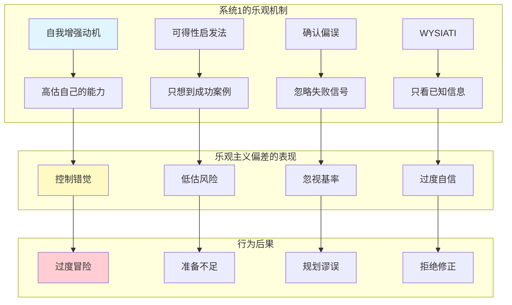
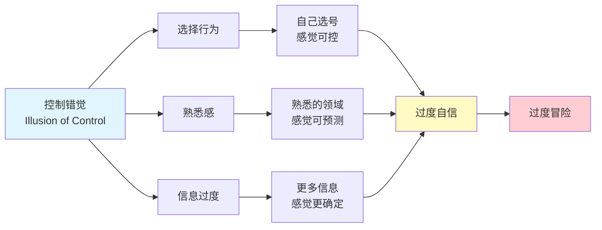
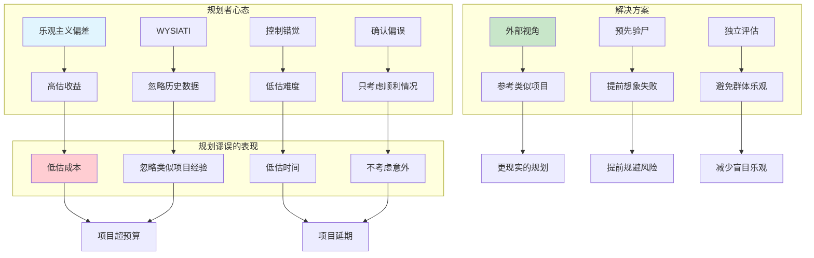
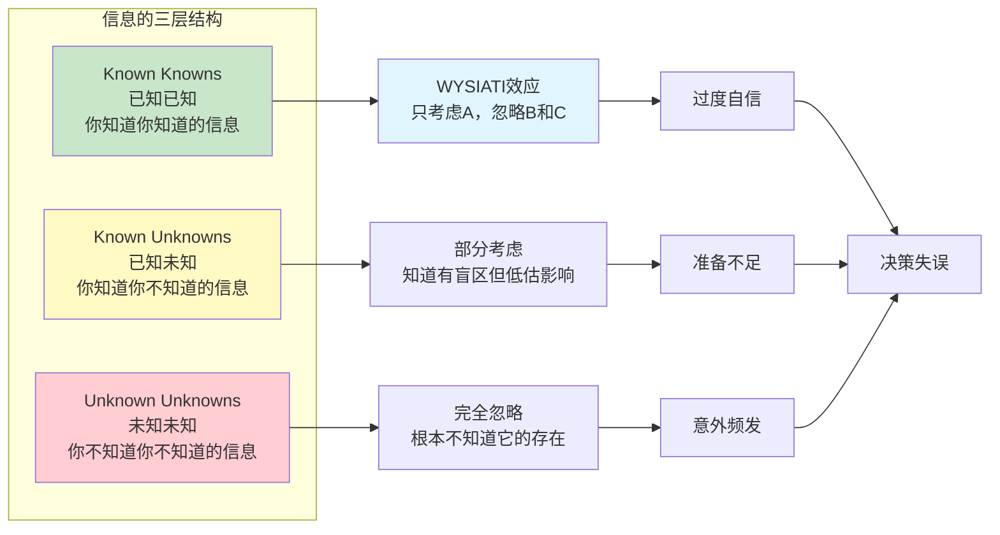
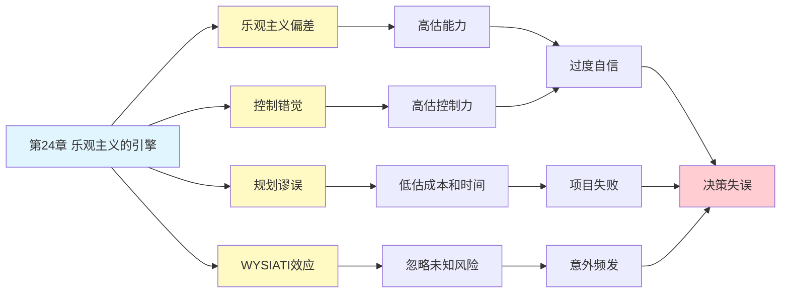
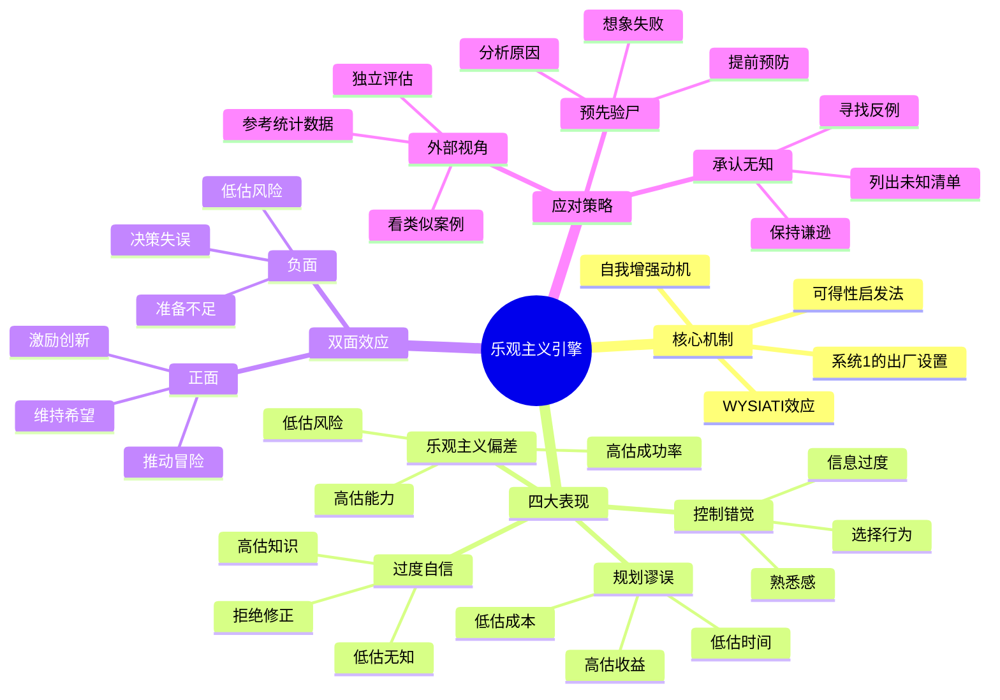

# 第24章 乐观主义的引擎 (The Engine of Optimism)

## 📍 章节定位

### 全书位置
> 第24章揭示了"乐观主义偏差"——这可能是最显著的认知偏误。我们天生乐观，这种乐观推动人类冒险和创新，但也导致严重的判断失误。本章探讨乐观主义的心理学机制及其利弊。

- **全书核心问题**: 人类的决策是如何偏离理性模型的？
- **本章回答的问题**: 为什么我们天生乐观？乐观主义偏差如何影响决策？如何平衡乐观与现实？
- **角色类型**: 核心概念型（认知偏误的深层机制）
- **论证位置**: 从过度自信延伸到乐观主义的心理学基础

### 章节序列
| 方向 | 章节标题 | 逻辑连接 |
|------|----------|----------|
| 前章 | [[第23章-未来的不确定性]] | 从不确定性认知转向乐观主义机制 |
| 后章 | [[第24章-被金钱扭曲的心灵]] | 从乐观心理转向金钱心理 |
| 整书 | [[思考快与慢-丹尼尔·卡尼曼-拆解记录]] | 认知偏误体系的重要组成部分 |

### 一句话定位
> 第24章揭示了"乐观主义引擎"的秘密——我们天生乐观，这种偏误推动冒险和创新，但也让我们高估能力、低估风险，导致灾难性决策失误。

---

## 🔍 信息来源与质量评级

### MCP检索记录

| 轮次 | 检索工具 | 检索关键词 | 质量评级 | 核心来源 |
|------|----------|------------|----------|----------|
| 第一轮 | MCP Web Reader | "Thinking Fast and Slow Chapter 24 Optimism" | ⭐⭐⭐ | Wikipedia, 原书摘要 |
| 第二轮 | MCP Web Reader | "乐观主义偏差 控制错觉 规划谬误" | ⭐⭐⭐ | 心理学百科、学术文献 |
| 第三轮 | MCP Web Reader | "optimism bias planning fallacy examples" | ⭐⭐⭐ | Farnam Street, 行为经济学研究 |

### 整合方式
- **核心概念**: ⭐⭐⭐ 原书内容 + Wikipedia
- **案例补充**: ⭐⭐⭐ 行为经济学研究文献
- **应用建议**: ⭐⭐⭐ Farnam Street等权威解读

---

## 🎯 核心观点（三层提取）

### 观点1: 乐观主义偏差——最显著的认知偏误

#### 【表层】现象层

**厨房装修案例**：
- 2002年，美国厨房装修平均预期成本：$18,658
- 实际平均成本：$38,769
- **超支率**: 107%（实际成本是预期的2倍）
- **原因**: 装修者总是高估收益、低估成本、忽略意外

**创业成功率统计**：
- 美国小企业5年存活率：约35%
- 创业者对自己成功率的预期：80%+
- **差距**: 创业者乐观程度是实际成功率的2倍以上

**日常乐观表现**：
- 大多数人认为自己比平均水平更聪明、更健康、更幸运
- 85%的人认为自己驾驶技术高于平均水平（数学上不可能）
- 90%的创业者认为自己的企业会成功（实际成功率<40%）

#### 【中层】机制层

**乐观主义偏差的心理机制**：

**核心机制**：
1. **自我增强动机**：系统1天然倾向于维护自我形象，放大优点、缩小缺点
2. **可得性启发法**：容易想到的是成功故事，失败案例被忽视
3. **确认偏误**：只寻找支持自己乐观判断的证据
4. **WYSIATI效应**：只考虑已知信息，忽略未知因素

#### 【底层】规律层

> **乐观主义偏差定律**：人类存在系统性的乐观倾向，高估自己控制事件的能力，高估正面结果发生的概率，低估负面结果的风险。这种偏差是系统1的"出厂设置"，在进化中有生存价值，但在现代复杂环境中导致决策失误。

**降维翻译**：
> 你的大脑自带"美颜滤镜"，
> 会自动把未来修得比现实更美好。
> 你不是故意乐观，
> 是系统1默认开启的"希望模式"。

**检验标准**：
- 如果有人告诉你"90%的人都认为自己比平均水平强"，你会惊讶吗？
- 如果你承认自己乐观，你会觉得这是优点还是缺点？

#### 【当下连接】

|----------|----------|----------|
| 为什么创业这么容易失败？ | 创业者乐观程度是成功率的2倍 | "原来不是运气差，是太乐观" |
| 为什么项目总超预算？ | 规划谬误：高估收益、低估成本 | "不是我估算差，是天性如此" |
| 为什么我总觉得自己特别幸运？ | 控制错觉：高估自己控制力 | "原来我并不特殊" |
| 如何避免乐观陷阱？ | 承认偏差，采用外部视角 | "用理性对抗天性" |

---

### 观点2: 控制错觉——你以为你能控制？

#### 【表层】现象层

**彩票选择实验**：
- 让参与者选择彩票号码
- 一组可以自己选号（如生日组合）
- 一组随机分配号码
- 结果：自己选号的人对中奖的信心更高
- **真相**：两种方式中奖概率完全相同

**骰子游戏实验**：
- 让参与者掷骰子
- 当参与者自己掷时，下注金额更高
- 当别人代掷时，下注金额更低
- **结论**：人们认为自己掷骰子能"控制"结果

**投资决策调查**：
- 80%的投资者认为自己能"战胜市场"
- 实际上，长期战胜市场的投资者<5%
- **差距**：控制错觉导致过度交易

#### 【中层】机制层

**控制错觉的三要素**：

**机制分析**：
1. **选择行为**：当人们做出选择时，感觉自己对结果有控制力
2. **熟悉感**：在熟悉的领域，人们高估自己的预测能力
3. **信息过度**：获得更多信息时，人们误以为自己更了解真相

#### 【底层】规律层

> **控制错觉定律**：当人们参与选择过程、处于熟悉环境、或获得更多信息时，会产生"我能控制结果"的错觉。这种错觉与实际控制力无关，纯粹是心理感受。

**降维翻译**：
> 你以为选号能提高中奖率？
> 你以为掷骰子的手法能改变结果？
> 你以为多看新闻能预测股市？
> 
> 都是错觉。
> 你感觉自己能控制，但其实不能。

**生活类比**：
就像玩抓娃娃机，你以为看准了、算好了、角度对了，就能抓到。但娃娃机的爪子力度是随机设定的，你再努力也没用。可你还是觉得"这次肯定行"。

#### 【当下连接】

|----------|----------|----------|
| 为什么我总觉得自己能选中好股票？ | 控制错觉：选择行为≠控制能力 | "原来我只是感觉好" |
| 为什么彩票站的人更喜欢自选号？ | 选择行为增强控制感 | "不是我算得准，是感觉能控制" |
| 为什么炒股的人总忍不住频繁交易？ | 信息过度+熟悉感=过度自信 | "看再多新闻也预测不了未来" |
| 如何避免控制错觉？ | 承认随机性，减少主观干预 | "少操作，多观望" |

---

### 观点3: 规划谬误——为什么项目总延期超预算？

#### 【表层】现象层

**悉尼歌剧院案例**：
- 预期成本：700万美元
- 实际成本：1.02亿美元（超支1357%）
- 预期工期：4年
- 实际工期：14年（延迟250%）
- **原因**: 规划者完全忽略了类似项目的历史数据

**爱马仕隧道工程案例**：
- 1994年开工，预期成本28亿英镑
- 2007年完工，实际成本46亿英镑
- **超支率**: 64%
- **原因**: 低估了地质复杂性和技术难度

**软件项目统计**：
- 65%的软件项目超预算或延期
- 平均超支率：189%
- 平均延期率：222%
- **结论**: 规划谬误是IT行业的"常态"

#### 【中层】机制层

**规划谬误的心理机制**：

**卡尼曼的解决方案**：
1. **外部视角**（Outside View）：不看自己的项目，先看类似项目的统计数据
2. **预先验尸**（Pre-mortem）：在项目开始前，想象它已经失败，分析可能的原因
3. **独立评估**：让不同的人独立估算，然后汇总

#### 【底层】规律层

> **规划谬误定律**：人们在规划项目时，系统性地高估收益、低估成本和时间，忽略类似项目的历史数据。这种偏差源于乐观主义偏差和控制错觉的结合。解决方法是采用"外部视角"，参考统计数据而非个人直觉。

**降维翻译**：
> 做计划时，你的脑子自动进入"美颜模式"。
> 预算？往少了算。
> 时间？往短了算。
> 风险？不想它。
> 
> 正确做法：别看自己的项目，先看别人的教训。

**生活类比**：
就像你要去旅游，你会想"高速不堵车、景点人不多、天气特别好"。但实际上，高速可能堵、景点爆满、可能下雨。做计划时，脑子里自动播放"美好版"视频，但现实中播放的是"纪录片版"。

#### 【当下连接】

|----------|----------|----------|
| 为什么装修总超预算？ | 规划谬误+乐观主义 | "不是我预算做得差，是天性乐观" |
| 为什么项目总延期？ | 低估难度+忽略意外 | "原来全世界都这样" |
| 如何做更靠谱的规划？ | 用外部视角，看统计数据 | "别信直觉，信数据" |
| 如何避免规划谬误？ | 预先验尸，提前想象失败 | "先想失败，才能成功" |

---

### 观点4: WYSIATI——你只看到你知道的

#### 【表层】现象层

**投资决策案例**：
- 你看了一家公司的财报、新闻、分析师报告
- 你觉得"我对这家公司很了解"
- 你做出投资决策
- **问题**: 你忽略了所有你不知道的信息（未知未知）

**职业选择案例**：
- 你了解某个职业的光鲜面（高薪、体面、有前途）
- 你决定从事这个职业
- **问题**: 你忽略了职业的隐藏面（加班、压力、健康代价）

**婚姻决策案例**：
- 你看到对方的优点（聪明、幽默、上进）
- 你决定结婚
- **问题**: 你忽略了婚后生活的复杂性（财务冲突、育儿分歧、价值观差异）

#### 【中层】机制层

**WYSIATI的三层信息结构**：

**核心机制**：
1. **系统1的局限**：系统1只处理"可见"的信息，无法主动搜索未知
2. **认知放松**：当信息"够用"时，系统1就停止思考
3. **忽视基率**：系统1忽略统计信息，只关注眼前案例

#### 【底层】规律层

> **WYSIATI定律**：在做出判断时，人类思维主要处理"已知已知"的信息，很少考虑"已知未知"的信息，几乎完全忽略"未知未知"的存在。这导致决策时的过度自信和对意外的毫无准备。

**降维翻译**：
> 做决定时，你的脑子里只有"你看到的"。
> 就像用探照灯照着舞台，
> 你只看到灯光照到的地方，
> 以为舞台就只有这么大。
> 
> 但黑暗里还有很多东西，
> 你看不见，就当它不存在。

**生活类比**：
就像买房子，你看了地段、户型、价格，觉得"都挺好"。但你没看到物业的水平、邻居的素质、小区的隐患。你只看到你知道的，就以为知道了一切。

#### 【当下连接】

|----------|----------|----------|
| 为什么做决定总后悔？ | 只看到已知信息，忽略未知风险 | "原来不是我傻，是信息有限" |
| 为什么总有意外的坏事？ | 未知未知——你不知道你不知道的 | "意外不是运气差，是必然" |
| 如何避免WYSIATI陷阱？ | 承认无知，寻找反例，问"我不知道什么" | "谦逊是最好的护盾" |
| 如何提升决策质量？ | 列出未知清单，问"还可能发生什么" | "多想一步，少错一点" |

---

## ✨ 金句库

### 原书金句

| 金句 | 页码 | 适用场景 |
|------|------|----------|
| "乐观主义偏差可能是最显著的认知偏误" | p.— | 认知偏误科普 |
| "规划谬误：高估收益，低估成本" | p.— | 项目管理 |
| "WYSIATI——你只看到你看到的一切" | p.— | 决策心理 |
| "控制错觉：感觉自己能控制，但其实不能" | p.— | 风险教育 |
| "人们高估自己的知识，低估自己的无知" | p.— | 批判性思维 |
| "乐观主义推动冒险，但也导致灾难" | p.— | 平衡理性 |
| "未知未知——你不知道你不知道的" | p.— | 认知谦逊 |

### 降维金句

| 金句 | 来源观点 | 适用场景 |
|------|----------|----------|
| "你的大脑自带'美颜滤镜'，会把未来修得比现实更美好" | 乐观主义偏差 | 心理科普 |
| "你不是故意乐观，是系统1默认开启的'希望模式'" | 乐观主义机制 | 认知科学 |
| "你感觉自己能控制，但其实不能" | 控制错觉 | 风险教育 |
| "做计划时，你的脑子自动进入'美颜模式'" | 规划谬误 | 项目管理 |
| "你只看到你知道的，就以为知道了一切" | WYSIATI | 决策哲学 |
| "未知未知——你不知道你不知道的，才是最大风险" | 信息结构 | 风险管理 |
| "乐观是进化给我们的礼物，也是陷阱" | 乐观主义双面性 | 人生哲学 |

## 🔗 当下映射

### 💰 财富应用

#### 连接1: 为什么投资总"买在高点，卖在低点"？

**传统回答**: 心态不好、不够理性、贪婪恐惧
**卡尼曼视角**:
- 问题不是你的心态
- **问题**: 乐观主义偏差 + 控制错觉 + WYSIATI
- **机制**:
  1. 乐观主义：高估自己的选股能力
  2. 控制错觉：以为频繁交易能"控制"收益
  3. WYSIATI：只看到利好信息，忽略风险
- **应对策略**:
  1. 承认自己的乐观偏见
  2. 减少主观操作，增加被动投资
  3. 建立"反向检查清单"：问自己"为什么可能是错的"
  4. 参考统计数据，而非个人感觉

**金句**:
> 你以为自己在投资，其实是在"赌自己比市场聪明"。
> 承认自己不特殊，是赚钱的第一步。

#### 连接2: 为什么创业失败率这么高？

**传统回答**: 竞争激烈、运气不好、时机不对
**卡尼曼视角**:
- 不是运气问题
- **问题**: 创业者的乐观主义偏差是成功率的2倍
- **数据**: 
  - 创业者预期成功率：80%+
  - 实际5年存活率：35%
- **机制**: 
  1. 乐观主义：高估市场需求，低估竞争强度
  2. 控制错觉：以为努力就能控制结果
  3. WYSIATI：只看成功案例，忽略失败教训
- **应对策略**:
  1. 采用"外部视角"：先看行业失败率
  2. 预先验尸：在创业前先想象失败
  3. 建立退出机制：设定止损点
  4. 寻找反例：主动寻找"为什么这生意做不成"

**金句**:
> 创业者不是悲观太少，是乐观太多。
> 先看别人的墓碑，再挖自己的坑。

---

### 💼 职场应用

#### 连接1: 为什么项目总延期超预算？

**传统回答**: 执行力差、管理混乱、意外太多
**卡尼曼视角**:
- 不是执行力问题
- **问题**: 规划谬误 + 乐观主义偏差
- **机制**:
  1. 乐观主义：高估团队能力，低估任务难度
  2. 控制错觉：以为能"赶工期"
  3. WYSIATI：只考虑顺利情况，忽略意外
- **应对策略**:
  1. **外部视角**：参考类似项目的历史数据
  2. **预先验尸**：项目开始前，想象它延期失败
  3. **缓冲设计**：在估算基础上增加50%时间和预算
  4. **里程碑检查**：定期对比计划与实际，及时调整

**金句**:
> 项目延期的原因很简单：规划时脑子在放"美好版"视频。
> 用外部视角，看别人的教训，才能做对规划。

#### 连接2: 如何在乐观与现实之间找到平衡？

**传统回答**: 既要有梦想，也要脚踏实地
**卡尼曼视角**:
- 不是"既要又要"的问题
- **问题**: 如何利用乐观的动力，同时避免乐观的陷阱
- **策略**:
  | 场景 | 乐观的作用 | 乐观的风险 | 平衡方法 |
  |------|-----------|-----------|----------|
  | 创业决策 | 推动冒险，敢于创新 | 低估风险，准备不足 | 外部视角+预先验尸 |
  | 项目规划 | 激励团队，保持士气 | 忽略现实，过度承诺 | 统计数据+独立评估 |
  | 职业选择 | 追求梦想，不怕失败 | 盲目乐观，错判形势 | 信息收集+反向思考 |
  | 投资决策 | 相信长期价值 | 高估能力，过度交易 | 被动投资+定期复盘 |

**金句**:
> 乐观是引擎，理性是刹车，缺一不可。
> 没有乐观，你不敢上路；没有理性，你开下悬崖。

---

### 🏠 生活应用

#### 连接1: 为什么我们总觉得自己比别人幸运？

**传统回答**: 自信、积极心态
**卡尼曼视角**:
- 不是自信问题
- **问题**: 乐观主义偏差 + 控制错觉
- **表现**:
  - 85%的人认为自己的驾驶技术高于平均水平
  - 90%的人认为自己比普通人更健康
  - 大多数人认为自己比同龄人更幸福
- **机制**: 
  1. 自我增强动机：系统1天然维护自我形象
  2. 可得性启发法：容易想到自己的优点
  3. 确认偏误：只关注支持"我很棒"的信息
- **应对策略**:
  1. 承认这种偏见的存在
  2. 寻找客观数据而非主观感觉
  3. 问自己"如果别人这么说，我会信吗"

**金句**:
> 你不特殊，我也不特殊。
> 承认自己是"普通人"，是智慧的开始。

#### 连接2: 如何做更理性的重大决策？

**传统回答**: 多思考、多比较、多咨询
**卡尼曼视角**:
- 不是思考多少的问题
- **问题**: WYSIATI——只看到已知信息
- **方法**:
  1. **列出未知清单**：
     - 我知道什么？
     - 我不知道什么？
     - 我可能不知道自己不知道什么？
  2. **寻找反例**：
     - 有没有相反的证据？
     - 为什么我的判断可能是错的？
  3. **采用外部视角**：
     - 其他人做类似决定的结果如何？
     - 统计数据说什么？
  4. **预先验尸**：
     - 如果这个决定失败了，最可能的原因是什么？
     - 我现在能做什么来预防？

**金句**:
> 聪明的决策不是想得更多，是承认自己知道得更少。
> 问"我不知道什么"，比问"我知道什么"更重要。

### 72小时行动计划

1. **明天可以做的第一件事**: 反思一个你正在乐观看待的事情（项目、投资、决定），问自己"为什么可能是错的"，列出3个风险点
2. **本周内可以尝试的事**: 做一个重大决定前，先用"外部视角"查找类似案例的统计数据，看看实际情况如何
3. **需要准备资源才能做的事**: 为你正在规划的重要项目做一个"预先验尸"，想象它在1年后失败了，写下最可能的5个原因

---

## 🕸️ 章节关联

### 向上关联 → 整书
- **贡献**: 揭示认知偏误体系中的"乐观主义引擎"，解释为什么人类天生乐观以及这种乐观的利弊
- **位置**: 认知偏误体系的核心组成部分，连接过度自信、控制错觉、规划谬误等多个概念
- **整合**: 乐观主义偏差是系统1的"出厂设置"，与WYSIATI、可得性启发法等机制共同作用

### 横向关联 → 章节间

| 章节编号 | 章节标题 | 关联类型 | 连接描述 |
|----------|----------|----------|----------|
| 第19章 | 理解的错觉 | 基础 | 过度自信是乐观主义的表现之一 |
| 第20章 | 有效性的错觉 | 相关 | 有效性错觉是乐观主义的认知基础 |
| 第21章 | 直觉对抗公式 | 应用 | 对抗直觉的方法也适用于对抗乐观主义 |
| 第22章 | 专家直觉何时可以信任 | 相关 | 乐观主义影响对专家意见的信任 |
| 第23章 | 未来的不确定性 | 前置 | 乐观主义是对不确定性的本能反应 |

### 向下关联 → 具体应用

| 应用场景 | 难度 | 前置知识 |
|----------|------|----------|
| 项目管理 | 高 | 规划谬误理解 |
| 创业决策 | 高 | 统计思维+外部视角 |
| 投资理财 | 中 | 风险意识 |
| 职业规划 | 中 | 自我认知 |
| 重大生活决策 | 中 | 决策方法论 |

### 跨书关联 → 知识网络

| 书籍 | 概念 | 关系 | 备注 |
|------|------|------|------|
| [[思考快与慢-丹尼尔·卡尼曼-拆解记录]] | 乐观主义偏差 | 核心 | 本章主题 |
| [[黑天鹅-塔勒布-拆解记录]] | 未知未知 | 延伸 | WYSIATI的极端情况 |
| [[反脆弱-塔勒布-拆解记录]] | 脆弱性 | 相关 | 乐观主义导致脆弱 |
| [[非对称风险-塔勒布-拆解记录]] | 切肤之痛 | 互补 | 乐观主义让人忽视风险 |
| [[穷查理宝典-拆解记录]] | 反向思考 | 方法 | 预先验尸的思维 |
| [[清醒思考的艺术-多贝里-拆解记录]] | 控制错觉偏误 | 应用 | 乐观主义的具体表现 |

### 关联可视化

---

## 📊 概念关系图

---
