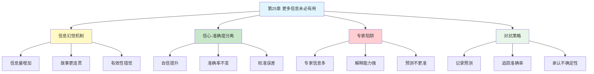

# 第25章 更多信息未必有用

## 📍 章节定位

### 全书位置
> 第25章揭示了一个反直觉的真相：拥有更多信息不仅不会提升预测准确率，反而会让人过度自信。这种"信息幻觉"（Illusion of Validity）解释了为什么专家们信心满满却屡屡预测失误。

- **全书核心问题**: 为什么人类的判断经常偏离理性？
- **本章回答的问题**: 为什么更多信息反而导致更差的判断？信息为什么会产生虚假的信心？
- **角色类型**: 核心概念型（揭示信息与判断的悖论关系）
- **论证位置**: 第四部分"系统1的错误和偏见"，承接过度自信主题，连接专家判断问题

### 章节序列
| 方向 | 章节标题 | 逻辑连接 |
|------|----------|----------|
| 前章 | [[第24章-被金钱扭曲的心灵]] | 从金钱影响转向信息影响 |
| 后章 | [[第26章-专家的错觉]] | 从信息幻觉延伸到专家直觉局限 |
| 整书 | [[思考快与慢-丹尼尔·卡尼曼-拆解记录]] | 认知偏误核心章节 |

### 一句话定位
> 第25章告诉我们一个残酷真相：信息越多，你可能越自信，但不会更准确——你的信心增长来自"能讲出更连贯的故事"，而不是"做出了更好的判断"。

---

## 🎯 核心观点

### 第一层：表层案例

| 案例名称 | 简要描述 | 页码 | 关键引文 |
|----------|----------|------|----------|
| 军官选拔预测 | 拥有更多信息但预测准确率几乎为零 | p.— | "统计显示我们的预测毫无价值" |
| 股票分析师 | 信息最丰富的专家，预测准确率接近随机 | p.— | "推荐买入和卖出的股票表现无差异" |
| 政治预测家 | 拥有大量信息的专家，预测准确率不如简单模型 | p.— | "信息越多，自信越强，准确率不变" |
| 医生诊断 | 更多检查未必提高诊断准确率，但增加自信 | p.— | "信息幻觉让医生过度自信" |
| 赛马预测 | 给更多数据，预测信心上升但准确率不变 | p.— | "信息创造了有效性的错觉" |

### 第二层：中层机制

| 机制名称 | 组成要素 | 因果链条 | 证据来源 |
|----------|----------|----------|----------|
| 信息-自信悖论 | 信息量增加 + 故事连贯性 | 更多信息→更连贯故事→更强信心→准确率不变 | 预测研究 |
| 有效性错觉 | 内部一致性 + 叙事流畅性 | 信息能讲故事→产生"我理解了"的感觉→虚假信心 | 认知心理学 |
| 确认偏误强化 | 选择性注意 + 信息过滤 | 更多信息→更多支持证据→强化原有判断 | 决策研究 |
| 系统1联想增强 | 启动效应 + 联想激活 | 信息丰富→联想网络更密集→故事更连贯 | 认知神经科学 |

### 第三层：底层规律

| 规律陈述 | 抽象层级 | 知识连接 | 适用范围 |
|----------|----------|----------|----------|
| 信息幻觉定律 | 行为经济学基础 | [[过度自信]], [[有效性错觉]] | 所有预测判断场景 |
| 信心-准确度分离原理 | 认知科学基础 | [[校准误差]], [[元认知]] | 人类判断行为 |
| 叙事连贯性陷阱 | 心理学视角 | [[故事思维]], [[因果解释偏误]] | 复杂预测环境 |

---

## 💬 降维翻译

### 观点1: 信息创造的是信心，不是准确

#### 原文表达
> "拥有更多信息的人，会产生更强的信心，但他们的预测准确率并不会因此提高。这种现象被称为'有效性错觉'——你觉得自己的判断很可靠，因为你能用这些信息讲出一个连贯的故事。但故事连贯不等于预测准确。"

> p.—

#### 降维翻译（中学生能懂）
想象两个同学预测期末考试第一名：
- 同学A：只看了成绩表，说"应该是小明吧"
- 同学B：看了成绩表、了解了学习方法、问过老师、观察过学习习惯，说"肯定是小明！他最近状态超好，每天学到很晚，老师都说他进步很大……"

谁的预测更准？可能一样。但B更自信，因为他能讲出更多"理由"。

**关键发现**：能讲故事≠预测准确。你越能解释，越觉得自己对，但不一定真对。

#### 日常类比（奶奶能懂）
就像算命的，说的话越多、越细节，你就越觉得他准。但仔细想想，他说了一堆，真正说中的有多少？

信息也一样。给你越多信息，你能编的故事越丰富，你就越信自己。但准确率可能跟抛硬币差不多。

#### 检验
- Q: 如果一个中学生问你这是什么意思？
- A: 知道越多，你会觉得自己越厉害，但不代表你真的更厉害。你的自信来自"能说出更多道理"，不是"真的更准"。

### 观点2: 为什么信息越多反而越不准？

#### 原文表达
> "更多信息带来的一个副作用是：你更容易找到支持自己判断的证据，而忽略反对的证据。这叫确认偏误。当信息量足够大时，几乎任何结论都能找到支持它的'证据'。信息不是中性的，它会强化而非纠正你原有的偏见。"

> p.—

#### 降维翻译（中学生能懂）
你想证明"某同学是学霸"：
- 信息少：只能看成绩
- 信息多：你能找到成绩、课堂表现、作业完成度、老师评价……总能找到支持"他是学霸"的证据

但如果他其实不是学霸呢？信息多反而让你更固执，因为你找到了更多"证据"支持你的错误判断。

**核心机制**：信息是武器。你心里想证明什么，信息就帮你证明什么。

#### 日常类比（奶奶能懂）
就像你想证明某个保健品有用，网上搜一圈全是好评。不是它真有用，是你只看到了支持你的信息。

信息多了，你就更容易活在自己编织的"证据茧房"里。

#### 检验
- Q: 如果一个中学生问你这是什么意思？
- A: 信息不是越多越好。信息多了，你更容易只看你想看的，反而更固执。

### 观点3: 专家的信心是最危险的

#### 原文表达
> "研究显示，专家的信心往往比普通人更高，但预测准确率未必更好，甚至更差。这是因为专家拥有更多的信息，能构建出更复杂、更连贯的解释框架。这种'解释能力'让他们产生强大的信心，但信心和能力是两回事。"

> p.—

#### 降维翻译（中学生能懂）
想想电视上的股评专家：
- 普通人：说"可能会涨"
- 专家：说"从宏观政策、行业周期、资金流向、技术指标来看，这只股票的上涨逻辑非常清晰……"

谁更自信？专家。
谁更准？可能都差不多。

**危险之处**：专家的自信不是来自准确率，而是来自"能说出复杂的道理"。

#### 日常类比（奶奶能懂）
就像老中医，说的理论一套一套的，让你觉得他什么都懂。但真正治好病的概率，可能跟普通医生差不多。

越能说的人，越容易让你相信。但"能说"和"能治"是两回事。

#### 检验
- Q: 如果一个中学生问你这是什么意思？
- A: 专家说的道理越多，不一定越准，但一定越自信。别被自信骗了。

### 观点4: 如何对抗信息幻觉？

#### 原文表达
> "对抗信息幻觉的方法不是减少信息，而是：1）记录预测并追踪准确率；2）区分'解释'和'预测'；3）用简单模型替代复杂判断；4）保持谦逊，承认不确定性的存在。知道自己不知道，比假装知道更重要。"

> p.—

#### 降维翻译（中学生能懂）
怎么不被信息骗？
1. **写下来**：预测什么，写下来，过段时间看看准不准
2. **分清楚**：能解释"为什么发生了"不等于能预测"会发生什么"
3. **简单点**：有时候简单规则比复杂分析更准
4. **承认不知道**：说"我不知道"比瞎猜强

#### 日常类比（奶奶能懂）
就像买种子，别听卖的人说得多天花乱坠。记下来他说的产量，秋收后看看真产了多少。年年对比，你就知道谁靠谱谁不靠谱了。

**核心方法**：用事实检验，不要被道理说服。

#### 检验
- Q: 如果一个中学生问你这是什么意思？
- A: 不要被"能讲故事"的人骗。记录他们的预测，看看到底准不准。准才是真本事，会说只是嘴皮子。

---

## ✨ 金句库

### 原书金句
| 金句 | 页码 | 适用场景 |
|------|------|----------|
| "信息创造的是信心，不是准确" | p.— | 信息时代警示 |
| "有效性错觉：你觉得对，因为你能讲出道理" | p.— | 认知偏误科普 |
| "专家的信心来自信息量，不来自准确率" | p.— | 专家预测批判 |
| "故事越连贯，越要警惕" | p.— | 批判性思维 |

### 降维金句
| 金句 | 来源观点 | 适用场景 |
|------|----------|----------|
| "信息越多越自信，但不代表更准" | 信息-自信悖论 | 投资决策 |
| "能讲故事不等于能预测未来" | 有效性错觉 | 认知科普 |
| "专家的自信是信息堆出来的泡沫" | 专家陷阱 | 财经评论 |
| "信息是偏见的武器，不是纠正的工具" | 确认偏误 | 媒体素养 |

## 🔗 当下映射

### 💰 财富应用
| 场景 | 具体行动 | 预期效果 | 风险提示 |
|------|----------|----------|----------|
| 投资决策 | 区分"能解释"和"能预测"的股评 | 减少被忽悠 | 需要记录检验 |
| 信息消费 | 减少追逐"内幕消息"和"深度分析" | 节省时间精力 | 可能错过真机会 |
| 投资跟踪 | 记录自己的判断和理由，定期复盘 | 发现真实的判断能力 | 需要诚实面对失败 |

### 💼 职场应用
| 场景 | 具体行动 | 所需能力 | 适用职级 |
|------|----------|----------|----------|
| 招聘面试 | 不被能说会道的候选人迷惑 | 行为面试技巧 | HR/管理层 |
| 方案评审 | 区分"故事好听"和"逻辑可行" | 批判性思维 | 所有评审者 |
| 战略规划 | 用简单模型检验复杂判断 | 建模能力 | 高管层 |

### 🏠 生活应用
| 场景 | 具体行动 | 可行性 | 见效时间 |
|------|----------|--------|----------|
| 消费决策 | 减少收集信息的时间，设定决策时限 | 高 | 即时生效 |
| 健康选择 | 不被"能解释复杂道理"的养生理论迷惑 | 中 | 长期见效 |
| 教育规划 | 记录对孩子发展的预测，检验准确率 | 中 | 长期见效 |

### 72小时行动计划
1. **明天可以做的第一件事**: 回顾最近一个大决策，问自己"我的信心来自信息，还是来自过去的准确率记录？"
2. **本周内可以尝试的事**: 选择一个你经常看的"专家"，记录他的3个预测，一周后检验准确率
3. **需要准备资源才能做的事**: 建立个人"预测日记"，每次重要判断都记录下来，定期复盘校准

---

## 🕸️ 章节关联

### 向上关联 → 整书
- **贡献**: 揭示信息与判断的悖论关系，解释过度自信的信息根源
- **位置**: 第四部分"系统1的错误和偏见"核心章节

### 横向关联 → 章节间
| 章节编号 | 章节标题 | 关联类型 | 连接描述 |
|----------|----------|----------|----------|
| 第24章 | 被金钱扭曲的心灵 | 前置 | 从金钱影响转向信息影响 |
| 第26章 | 专家的错觉 | 延续 | 信息幻觉导致专家过度自信 |
| 第19章 | 避免主观怀疑和过度假设 | 相关 | 过度肯定偏误的信息版本 |
| 第21章 | 我们已经预见到了 | 相关 | 后见之明与信息幻觉都涉及虚假信心 |

### 向下关联 → 具体应用
| 应用场景 | 难度 | 前置知识 |
|----------|------|----------|
| 投资决策改进 | 中 | 基础投资知识 |
| 专家评估体系 | 高 | 统计学基础 |
| 预测能力训练 | 高 | 概率思维 |

### 跨书关联 → 知识网络
| 书籍 | 概念 | 关系 | 备注 |
|------|------|------|------|
| [[思考快与慢-丹尼尔·卡尼曼-拆解记录]] | 有效性错觉 | 同源 | 理论来源 |
| [[噪声-卡尼曼-拆解记录]] | 判断噪声 | 延伸 | 信息增加噪声 |
| [[超预测-泰洛克-拆解记录]] | 狐狸型思维 | 应用 | 用简单模型对抗信息幻觉 |
| [[黑天鹅-塔勒布-拆解记录]] | 叙事谬误 | 相关 | 故事连贯性的陷阱 |
| [[穷查理宝典-拆解记录]] | 能力圈 | 互补 | 承认不知道的智慧 |

### 关联可视化

---

## ❓ 问答设计

### Q1: [记忆型问题]
**认知层次**: 记忆
**难度**: 低
**描述**: 什么是"信息幻觉"（Illusion of Validity）？
**答案要点**:
- 拥有更多信息会让人产生更强的信心
- 但预测准确率并不会提升
- 信心来自"能讲出连贯故事"，不是"判断更准确"

### Q2: [理解型问题]
**认知层次**: 理解
**难度**: 中
**描述**: 为什么信息越多反而判断不一定更准？
**答案要点**:
- 信息更容易找到支持原有判断的证据
- 确认偏误被强化而非纠正
- 任何结论都能找到"支持证据"

### Q3: [应用型问题]
**认知层次**: 应用
**难度**: 中
**描述**: 如何在日常决策中对抗信息幻觉？
**答案要点**:
- 记录预测并追踪准确率
- 区分"解释"和"预测"
- 用简单规则替代复杂分析
- 承认不确定性的存在

### Q4: [分析型问题]
**认知层次**: 分析
**难度**: 中
**描述**: 为什么专家更容易陷入信息幻觉？
**答案要点**:
- 专家拥有更多信息
- 能构建更复杂的解释框架
- 解释能力强→信心强→但预测未必更准
- 信心和能力是两回事

### Q5: [创造型问题]
**认知层次**: 创造
**难度**: 高
**描述**: 设计一个帮助投资者减少信息幻觉的决策工具？
**答案要点**:
- 强制记录预测和理由
- 定期展示准确率数据
- 对比简单模型和复杂判断的结果
- 标注"不确定"选项鼓励承认无知

### Q6: [理解型问题]
**认知层次**: 理解
**难度**: 中
**描述**: "解释能力"和"预测能力"有什么区别？
**答案要点**:
- 解释能力：事后能说清楚为什么发生
- 预测能力：事前能判断会发生什么
- 两者常常分离：能解释的人未必能预测
- 信息提升解释能力，不提升预测能力

### Q7: [应用型问题]
**认知层次**: 应用
**难度**: 中
**描述**: 如何识别一个被信息幻觉影响的"专家"？
**答案要点**:
- 检查是否有预测记录和准确率数据
- 观察是否过分自信
- 看是否总能为错误找到解释
- 区分"能说"和"能预测"

### Q8: [分析型问题]
**认知层次**: 分析
**难度**: 高
**描述**: 信息幻觉与确认偏误有什么关系？
**答案要点**:
- 信息是确认偏误的"燃料"
- 信息越多，越容易找到支持证据
- 确认偏误被信息强化
- 形成自我强化的偏见循环

### Q9: [理解型问题]
**认知层次**: 理解
**难度**: 中
**描述**: 为什么"简单模型"有时比"复杂判断"更准？
**答案要点**:
- 简单模型不受信息幻觉影响
- 避免确认偏误的干扰
- 不会被"能讲故事"迷惑
- 人脑处理复杂信息的能力有限

### Q10: [创造型问题]
**认知层次**: 创造
**难度**: 高
**描述**: 在信息爆炸时代，如何建立健康的"信息消费"习惯？
**答案要点**:
- 设定信息收集的时限
- 优先关注预测记录而非理论深度
- 用准确率数据校准信心
- 培养"不知道"的勇气
- 建立个人预测追踪系统

---
