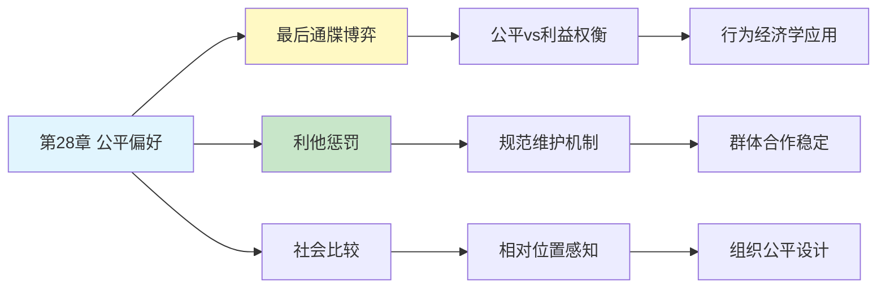

# 第28章 公平偏好

## 📍 章节定位

### 全书位置
> 第28章探讨人类与生俱来的公平感——我们如何在经济决策中优先考虑公平而非纯粹利益最大化，揭示了利他行为、惩罚不公的动机以及社会规范对经济行为的深刻影响。

- **全书核心问题**: 人类的决策是如何偏离纯粹理性计算的？
- **本章回答的问题**: 为什么人们愿意为公平付出代价？为什么我们会惩罚不公即使自己受损？
- **角色类型**: 核心概念型（探讨社会偏好的心理基础）
- **论证位置**: 从个体认知偏误扩展到社会性偏好，连接心理学与行为经济学

### 章节序列
| 方向 | 章节标题 | 逻辑连接 |
|------|----------|----------|
| 前章 | [[第27章-偏见的代价]] | 从个体偏误代价转向社会公平心理 |
| 后章 | [[第29章-心理账户]] | 从社会公平转向个体心理记账 |
| 整书 | [[思考快与慢-丹尼尔·卡尼曼-拆解记录]] | 展示人类决策的社会性维度 |

### 一句话定位
> 第28章揭示了人类独特的"公平基因"——我们愿意为公平付出代价、惩罚不公即使自己受损，这种社会性偏好挑战了传统经济学的"理性人"假设。

---

## 🎯 核心观点

### 第一层：表层案例

| 案例名称 | 简要描述 | 页码 | 关键引文 |
|----------|----------|------|----------|
| 最后通牒博弈 | 人们拒绝不公平分配，即使意味着一无所获 | p.— | "拒绝不公平报价是一种惩罚" |
| 独裁者博弈 | 人在无惩罚风险时仍选择分享 | p.— | "即使匿名，人也倾向公平" |
| 信任博弈 | 信任与互惠的双向关系 | p.— | "信任建立在公平预期上" |
| 公共品博弈 | 搭便车问题与合作意愿的矛盾 | p.— | "惩罚不合作者是维护公平的代价" |
| 工资公平感 | 工资差距对工作满意度的影响 | p.— | "公平比绝对收入更重要" |

### 第二层：中层机制

| 机制名称 | 组成要素 | 因果链条 | 证据来源 |
|----------|----------|----------|----------|
| 公平惩罚动机 | 不公平感知 + 情感愤怒 + 惩罚冲动 | 不公平→愤怒→惩罚行为→自己承担成本 | 最后通牒博弈实验 |
| 利他惩罚 | 无直接收益 + 维护规范 | 付出代价→惩罚违规者→维护群体规范 | 公共品博弈研究 |
| 互惠偏好 | 善意回报 + 恶意报复 | 获益→回报善意；受损→报复恶意 | 信任博弈实验 |
| 社会比较 | 相对位置 + 公平判断 | 比较他人→判断公平→影响满意度 | 社会比较理论 |

### 第三层：底层规律

| 规律陈述 | 抽象层级 | 知识连接 | 适用范围 |
|----------|----------|----------|----------|
| 社会偏好原理 | 行为经济学基础 | [[第26章-前景理论]], [[行为博弈论]] | 社会互动决策 |
| 进化稳定策略 | 生物学视角 | [[进化心理学-拆解记录]], [[合作进化]] | 群体合作行为 |
| 规范内化机制 | 社会心理学基础 | [[社会化理论]], [[道德发展理论]] | 道德与规范行为 |

---

## 💬 降维翻译

### 观点1: 人们愿意为公平付钱

#### 原文表达
> "在最后通牒博弈中，当一方提出不公平分配时，另一方会选择拒绝，即使这意味着双方都一无所获。这种行为违背了传统经济学的预测：为什么人们宁愿要0元也不接受1元？答案是，不公平带来的心理成本超过了金钱收益。人们实际上是在花钱买公平。"

> p.—

#### 降维翻译（中学生能懂）
游戏规则是这样的：给你100块钱，你来分，对方决定接不接受。如果对方拒绝，两人都拿不到钱。

经济学预测：分给对方1块钱，对方也应该接受，因为1块比0块多。
实际情况：如果你分得太不公平（比如99:1），对方会选择都不要。

为什么？因为"被欺负"的感觉比1块钱更难受。宁可都不要，也不想让你太得意。

#### 日常类比（奶奶能懂）
就像分家产，老二觉得老大分多了，宁愿闹到法院花掉一半也要争。不是图钱，是咽不下这口气。公平这东西，有时候比钱还重要。

#### 检验
- Q: 如果一个中学生问你这是什么意思？
- A: 人有时候会为了"争口气"放弃好处。公平感是刻在脑子里的，不是算账能算出来的。

### 观点2: 利他惩罚——花钱也要惩罚不公

#### 原文表达
> "更有趣的是利他惩罚现象：即使与自己无关，人们也愿意付出代价去惩罚违反公平规范的人。这种行为不能用自己的利益来解释，但它对维护群体合作至关重要。我们似乎天生就是'公平警察'。"

> p.—

#### 降维翻译（中学生能懂）
你看到有人插队被罚款，虽然跟你没关系，但你心里暗爽。如果让你花1块钱就能让插队的人被罚100块，你愿意吗？

很多人愿意。这就是"利他惩罚"——自己花钱，也要惩罚不守规矩的人。好像脑子里有个"正义感开关"，看到不公平就想去纠正。

#### 日常类比（奶奶能懂）
就像你看到有人欺负弱小，虽然不是自家孩子，也会想上去管一管。即使自己可能吃亏，也忍不住要出手。这种"路见不平"的感觉是天生的。

#### 检验
- Q: 如果一个中学生问你这是什么意思？
- A: 人有正义感，看到不公平的事，即使不关自己的事、即使自己要付出代价，也想去管。

---

## ✨ 金句库

### 原书金句
| 金句 | 页码 | 适用场景 |
|------|------|----------|
| "人们愿意花钱买公平" | p.— | 行为经济学科普 |
| "利他惩罚是群体合作的基石" | p.— | 社会合作讨论 |
| "公平感写在我们的基因里" | p.— | 进化心理学 |

### 降维金句
| 金句 | 来源观点 | 适用场景 |
|------|----------|----------|
| "宁可都不要，也不让你太占便宜" | 最后通牒博弈 | 公平感讨论 |
| "正义感比利益更值钱" | 利他惩罚 | 道德教育 |
| "人是天生的公平警察" | 社会规范维护 | 社会行为分析 |

## 🔗 当下映射

### 💰 财富应用
| 场景 | 具体行动 | 预期效果 | 风险提示 |
|------|----------|----------|----------|
| 薪资谈判 | 了解行业标准，避免漫天要价 | 建立公平基础上的合作 | 可能低估自己 |
| 合同签订 | 确保条款对双方公平 | 降低违约和纠纷风险 | 可能错失不对称优势 |
| 合伙经营 | 建立透明分配机制 | 维护长期合作关系 | 需要更多沟通成本 |

### 💼 职场应用
| 场景 | 具体行动 | 所需能力 | 适用职级 |
|------|----------|----------|----------|
| 团队激励 | 确保贡献与回报匹配 | 公平评估能力 | 所有管理层 |
| 冲突解决 | 关注公平感而非纯粹利益 | 同理心与调解能力 | 中层及以上 |
| 绩效管理 | 建立透明公平的评估体系 | 制度设计能力 | HR及管理层 |

### 🏠 生活应用
| 场景 | 具体行动 | 可行性 | 见效时间 |
|------|----------|--------|----------|
| 家庭分工 | 确保家务分配的公平感 | 高 | 即时生效 |
| 朋友相处 | 不总让一方付出 | 高 | 长期维护 |
| 社区参与 | 参与公共事务维护公平 | 中 | 长期见效 |

### 72小时行动计划
1. **明天可以做的第一件事**: 回想最近一次感到"不公平"的经历，分析是否值得为之付出代价
2. **本周内可以尝试的事**: 在一次合作中主动确保对方的公平感，观察关系变化
3. **需要准备资源才能做的事**: 建立团队/家庭的公平规则，形成书面共识

---

## 🕸️ 章节关联

### 向上关联 → 整书
- **贡献**: 展示人类决策的社会性维度，挑战"理性人"假设
- **位置**: 从个体认知扩展到社会偏好，连接心理学与社会学

### 横向关联 → 章节间
| 章节编号 | 章节标题 | 关联类型 | 连接描述 |
|----------|----------|----------|----------|
| 第27章 | 偏见的代价 | 延续 | 个体偏误的社会性后果 |
| 第29章 | 心理账户 | 承接 | 公平感也会影响心理账户分类 |
| 第14章 | 参考点和框架 | 相关 | 框架影响公平感知 |
| 第15章 | 禀赋效应 | 相关 | "我的"和"你的"影响公平判断 |

### 向下关联 → 具体应用
| 应用场景 | 难度 | 前置知识 |
|----------|------|----------|
| 组织公平设计 | 中 | 管理学基础 |
| 谈判策略优化 | 中 | 博弈论入门 |
| 社会政策制定 | 高 | 经济学原理 |

### 跨书关联 → 知识网络
| 书籍 | 概念 | 关系 | 备注 |
|------|------|------|------|
| [[思考快与慢-丹尼尔·卡尼曼-拆解记录]] | 公平偏好 | 同源 | 核心理论来源 |
| [[助推-理查德·塞勒-拆解记录]] | 社会规范 | 延伸 | 如何利用公平偏好设计政策 |
| [[道德动物-赖特-拆解记录]] | 进化心理学 | 基础 | 公平感的进化起源 |
| [[合作的进化-阿克塞尔罗德-拆解记录]] | 互惠合作 | 相关 | 合作策略研究 |

### 关联可视化

---

## ❓ 问答设计

### Q1: [记忆型问题]
**认知层次**: 记忆
**难度**: 低
**描述**: 什么是最后通牒博弈？
**答案要点**:
- 一方提出分配方案
- 另一方选择接受或拒绝
- 拒绝则双方都得不到任何东西

### Q2: [理解型问题]
**认知层次**: 理解
**难度**: 中
**描述**: 为什么人们会拒绝不公平的分配？
**答案要点**:
- 不公平感带来的心理成本
- 惩罚不公平的动机
- 公平感比金钱收益更重要

### Q3: [应用型问题]
**认知层次**: 应用
**难度**: 中
**描述**: 在团队合作中如何利用公平偏好提升效率？
**答案要点**:
- 确保贡献与回报匹配
- 建立透明的分配机制
- 及时处理不公平感知

### Q4: [分析型问题]
**认知层次**: 分析
**难度**: 中
**描述**: 公平偏好如何挑战"理性人"假设？
**答案要点**:
- 人们愿意为公平付出代价
- 不总是追求自身利益最大化
- 社会性偏好影响经济决策

### Q5: [创造型问题]
**认知层次**: 创造
**难度**: 高
**描述**: 设计一个利用公平偏好改善公共政策的方案？
**答案要点**:
- 透明化政策制定过程
- 确保利益分配公平感知
- 建立违规惩罚机制

### Q6: [理解型问题]
**认知层次**: 理解
**难度**: 中
**描述**: 利他惩罚与普通惩罚有什么区别？
**答案要点**:
- 利他惩罚者自己承担成本
- 无直接利益驱动
- 维护群体规范而非个人利益

### Q7: [应用型问题]
**认知层次**: 应用
**难度**: 中
**描述**: 在薪资谈判中如何考虑对方的公平感？
**答案要点**:
- 提供市场基准参考
- 解释薪资决定逻辑
- 确保程序公平透明

### Q8: [分析型问题]
**认知层次**: 分析
**难度**: 高
**描述**: 公平偏好的进化意义是什么？
**答案要点**:
- 维护群体合作稳定
- 惩罚搭便车者
- 促进互惠利他行为

### Q9: [理解型问题]
**认知层次**: 高
**描述**: 社会比较如何影响公平判断？
**答案要点**:
- 相对位置影响满意度
- 与他人比较形成公平感
- 参照群体决定判断标准

### Q10: [创造型问题]
**认知层次**: 创造
**难度**: 高
**描述**: 如何设计一个公平的家庭资源分配机制？
**答案要点**:
- 明确分配规则和标准
- 确保参与和透明
- 定期评估和调整

---
