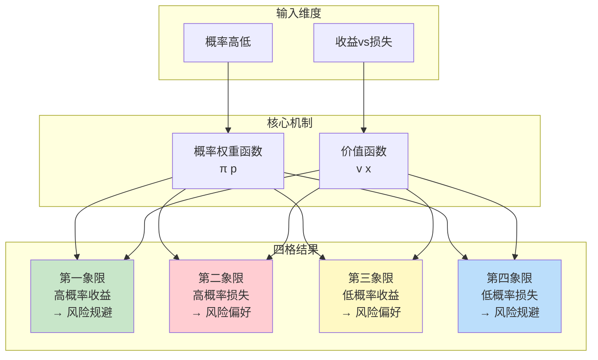
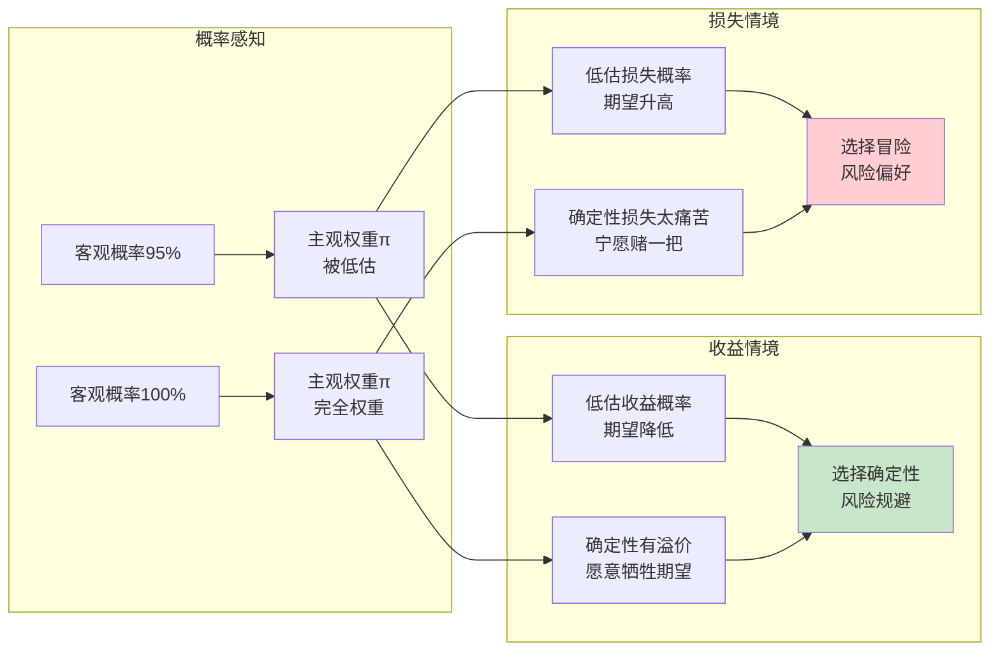
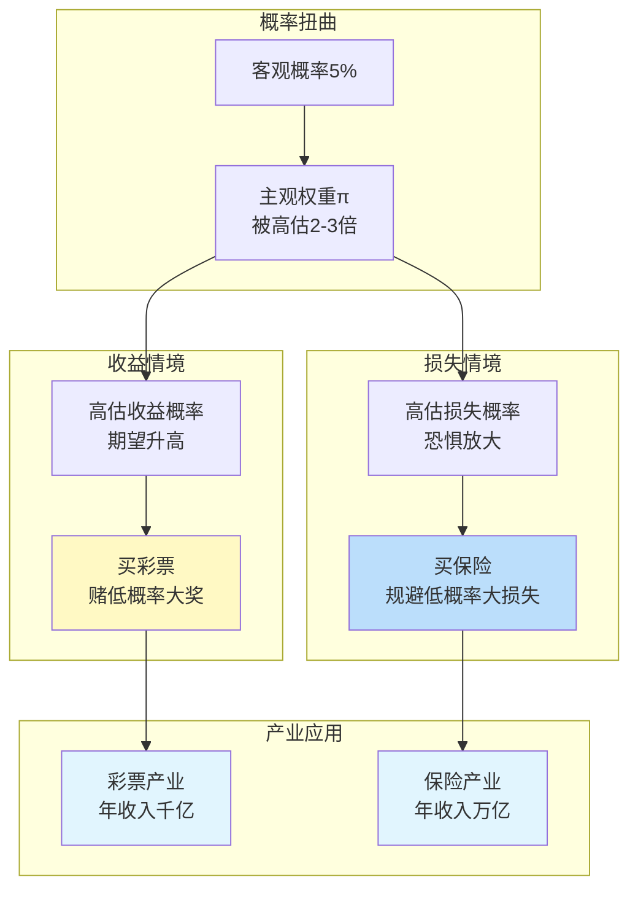
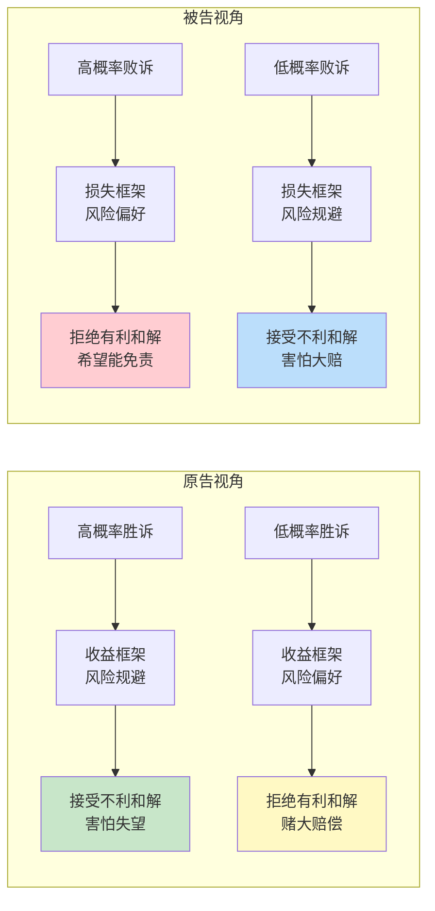
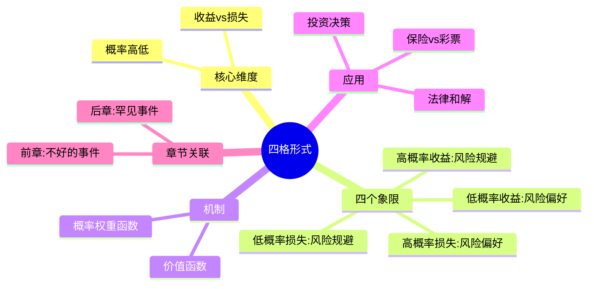

# 第29章 四格形式（The Fourfold Pattern）

## 📍 章节定位

### 全书位置
> 第29章系统阐述"四格形式"——前景理论的核心预测模型，揭示人类风险态度如何随概率和收益/损失方向发生系统性反转。这四格模式解释了为什么人们在高概率收益时规避风险，在高概率损失时偏好风险，在低概率收益时偏好风险，在低概率损失时规避风险。

- **全书核心问题**: 人类如何在不确定条件下做决策？
- **本章回答的问题**: 为什么我们的风险态度会"反复无常"？什么时候该赌，什么时候该稳？
- **角色类型**: 理论核心型，前景理论的完整预测框架
- **论证位置**: 从损失厌恶和概率权重的交互中推导出风险态度的四格模式

### 章节序列
| 方向 | 章节标题 | 逻辑连接 |
|------|----------|----------|
| 前章 | [[第28章-不好的事件]] | 损失厌恶的心理机制 |
| 后章 | [[第30章-罕见事件]] | 低概率事件的过度反应 |
| 整书 | [[思考快与慢-丹尼尔·卡尼曼-拆解记录]] | 前景理论的核心章节 |

### 一句话定位
> 第29章揭示了风险态度的"四格悖论"——你的风险偏好不是性格，而是情境的函数：在高概率收益和低概率损失时你很怂，在高概率损失和低概率收益时你很勇，这就是为什么你总"赚小亏大"。

---

## 🎯 核心观点

### 观点1：四格形式——风险态度的情境密码

#### 【表层】现象层

**四格风险态度矩阵**：

|  | 高概率（确定性效应） | 低概率（可能性效应） |
|---|---|---|
| **收益** | 风险规避 | 风险偏好 |
| **损失** | 风险偏好 | 风险规避 |

**四个象限的典型场景**：

**第一象限：高概率收益 → 风险规避**
- 场景：95%概率赢$10,000 vs 100%赢$9,499
- 期望值：$9,500 > $9,499
- 大多数人选择：100%赢$9,499
- 情绪：害怕失望
- 现实例子：股票赚10%就卖出，"落袋为安"

**第二象限：高概率损失 → 风险偏好**
- 场景：95%概率输$10,000 vs 100%输$9,499
- 期望值：-$9,500 < -$9,499
- 大多数人选择：95%概率输$10,000（赌一把）
- 情绪：希望能避免损失
- 现实例子：股票亏30%还死扛，"等回本"

**第三象限：低概率收益 → 风险偏好**
- 场景：5%概率赢$10,000 vs 100%赢$501
- 期望值：$500 < $501
- 大多数人选择：5%概率赢$10,000（赌一把）
- 情绪：希望获得大收益
- 现实例子：买彩票、买高杠杆期权

**第四象限：低概率损失 → 风险规避**
- 场景：5%概率输$10,000 vs 100%输$501
- 期望值：-$500 > -$501
- 大多数人选择：100%输$501（买保险）
- 情绪：害怕大损失
- 现实例子：买保险、买 warranties

#### 【中层】机制层

**四格形式的心理机制**：

**双重机制解析**：

1. **概率权重函数的扭曲**
   - 低概率被高估：π(0.01) > 0.01（小概率事件被放大）
   - 高概率被低估：π(0.99) < 0.99（确定性被削弱）
   - 这就是为什么"万一中了"的诱惑力 > 数学期望

2. **价值函数的不对称**
   - 收益区域：凹函数 → 边际效用递减 → 风险规避
   - 损失区域：凸函数 → 边际损失递减 → 风险偏好
   - 这就是为什么"赚一点就跑，亏很多还扛"

#### 【底层】规律层

> **四格风险态度定律**：人类的风险态度不是稳定特质，而是由两个维度决定的情境函数——概率高低（决定概率权重）和收益/损失方向（决定价值曲线形状）。这种系统性的反转导致了普遍的非理性决策。

**降维翻译**：
> 你以为自己是"稳健型"或"激进型"投资者？
> 错了，你的风险偏好会随情境180度反转：
> 
> - 赚钱时你是怂包，赚10%就想跑
> - 亏钱时你是勇士，亏50%还敢扛
> - 买彩票时你是赌徒，1%的几率也要博
> - 买保险时你是胆小鬼，1%的风险也要躲
> 
> 不是你人格分裂，是前景理论在作祟。

#### 【当下连接】

|----------|----------|----------|
| 为什么我总赚小亏大？ | 高概率收益规避+高概率损失偏好 | "原来是系统bug" |
| 为什么我买保险又买彩票？ | 低概率损失规避+低概率收益偏好 | "矛盾是人性" |
| 我到底是什么风险偏好？ | 你的风险偏好取决于情境 | "人格是流动的" |
| 如何做更好的决策？ | 意识到四格模式，用规则对抗直觉 | "知道bug才能打补丁" |

---

### 观点2：确定性效应——高概率被"削平"

#### 【表层】现象层

**确定性效应实验**：
- 场景A：95%概率赢$10,000 vs 100%赢$9,499
  - 期望值：$9,500 > $9,499
  - 大多数人选择：100%（确定性）
- 场景B：95%概率输$10,000 vs 100%输$9,499
  - 期望值：-$9,500 < -$9,499
  - 大多数人选择：95%（赌一把）

**关键发现**：
- 95%和100%只差5%，但在心理上差距巨大
- 人们极度偏好"确定性"，即使代价是降低期望收益
- 同样的95%，在收益时让你"怂"，在损失时让你"勇"

#### 【中层】机制层

**确定性效应的心理机制**：

**核心机制**：
1. **概率权重函数的形状**：在接近1时急剧下降
2. **确定性的心理溢价**：100% ≠ 99.9%，心理权重差距巨大
3. **损失厌恶的放大**：确定性损失的心理痛苦被放大
4. **希望与恐惧的不对称**：损失时"希望"更强烈，收益时"恐惧"更强烈

#### 【底层】规律层

> **确定性效应定律**：当概率接近1时，人们会高估确定性的价值。95%和100%的客观差距很小，但主观差距巨大。这导致在高概率收益时过度规避风险，在高概率损失时过度偏好风险。

**降维翻译**：
> 95%和100%只差5%，
> 但在你心里差了十万八千里。
> 
> - 赚钱时：95%感觉"还不够稳"，要100%才放心
> - 亏钱时：95%感觉"还有希望"，死也不肯接受确定性损失
> 
> 这就是为什么——
> 股票涨了你就跑，股票跌了你就扛。

---

### 观点3：可能性效应——低概率被"放大"

#### 【表层】现象层

**可能性效应实验**：
- 场景C：5%概率赢$10,000 vs 100%赢$501
  - 期望值：$500 < $501
  - 大多数人选择：5%（赌一把）
- 场景D：5%概率输$10,000 vs 100%输$501
  - 期望值：-$500 > -$501
  - 大多数人选择：100%（买保险）

**关键发现**：
- 5%的客观概率，在心理上被当成10-20%来对待
- 人们愿意为了"万一"支付溢价
- 同样的5%，在收益时让你"勇"，在损失时让你"怂"

**现实案例**：
- 彩票：1%的中奖概率，被当成10%的心理权重
- 保险：1%的出险概率，被当成10%的心理权重
- 恐怖主义：0.001%的风险，引发巨额安全支出

#### 【中层】机制层

**可能性效应的心理机制**：

**核心机制**：
1. **概率权重函数的形状**：在接近0时急剧上升
2. **"万一"的诱惑**：低概率事件被赋予过高权重
3. **恐惧的放大**：小概率灾难引发过度反应
4. **希望的价值**：小概率大奖比确定性小奖更有吸引力

#### 【底层】规律层

> **可能性效应定律**：当概率接近0时，人们会高估小概率事件的发生概率。1%的客观概率可能被当成5-10%来对待。这导致在低概率收益时过度偏好风险（买彩票），在低概率损失时过度规避风险（买保险）。

**降维翻译**：
> 1%的概率，在你心里变成了5-10%。
> 
> - 买彩票时：1%感觉"很有希望"，值得花10块钱
> - 买保险时：1%感觉"很危险"，值得花1000块钱
> 
> 不是你数学不好，是大脑把小概率放大了。
> 彩票公司和保险公司，就是靠这个bug赚钱的。

---

### 观点4：法律和解的应用——原告被告的博弈

#### 【表层】现象层

**法律场景的四格模式**：

| 角色 | 情境 | 情绪 | 行为倾向 | 结果 |
|------|------|------|----------|------|
| 原告（高概率胜诉） | 高概率收益 | 害怕失望 | 接受不利和解 | 拿到确定性收益 |
| 原告（低概率胜诉） | 低概率收益 | 希望大奖 | 拒绝有利和解 | 赌一把大赔偿 |
| 被告（高概率败诉） | 高概率损失 | 希望避免 | 拒绝有利和解 | 赌一把能免责 |
| 被告（低概率败诉） | 低概率损失 | 害怕大赔 | 接受不利和解 | 买"法律保险" |

**现实观察**：
- 高概率胜诉的原告，往往接受低于期望值的和解
- 低概率胜诉的原告，往往拒绝高于期望值的和解
- 律师知道如何利用客户的风险态度

#### 【中层】机制层

**法律和解的四格分析**：

**核心机制**：
1. **框架效应**：原告看的是"收益"，被告看的是"损失"
2. **确定性效应**：高概率时，确定性有溢价
3. **可能性效应**：低概率时，小概率被放大
4. **情绪驱动**：希望和恐惧决定和解意愿

#### 【底层】规律层

> **法律和解定律**：在法律纠纷中，当事人的风险态度由胜诉概率和角色（原告/被告）共同决定。高概率胜诉的原告会接受不利和解，高概率败诉的被告会拒绝有利和解——两者的行为看似非理性，实际符合四格模式的预测。

**降维翻译**：
> 你以为打官司是讲理？
> 其实是在打心理战。
> 
> - 如果你大概率能赢：律师会劝你和解，因为你知道"落袋为安"
> - 如果你大概率会输：你会赌到底，因为"死马当活马医"
> 
> 优秀的律师不是最懂法律，是最懂人性。

---

## 💬 降维翻译

### 观点1: 四格形式

#### 原文表达
> "风险态度的四种模式：高概率收益时规避，高概率损失时偏好，低概率收益时偏好，低概率损失时规避。"

#### 降维翻译（中学生能懂）
想象你面前有四个赌局：

1. **赚钱时**：
   - 95%概率赢100块 vs 100%赢95块 → 你选100%（怂）
   - 5%概率赢1000块 vs 100%赢50块 → 你选5%（勇）

2. **亏钱时**：
   - 95%概率输100块 vs 100%输95块 → 你选95%（勇）
   - 5%概率输1000块 vs 100%输50块 → 你选100%（怂）

看出来了吗？同样的你，在四种情境下表现完全不同！

#### 日常类比（奶奶能懂）
就像一个人在麻将桌上：
- 赢了想跑，怕输回去（高概率收益，规避）
- 输了想翻本，不肯下桌（高概率损失，偏好）
- 看到大牌想搏一把（低概率收益，偏好）
- 怕输大的，小胡也胡（低概率损失，规避）

这就是为什么"小赌怡情，大赌伤身"——你的风险态度一直在变。

---

### 观点2: 确定性效应

#### 原文表达
> "当概率接近1时，人们会高估确定性的价值。95%和100%的客观差距很小，但主观差距巨大。"

#### 降维翻译（中学生能懂）
95%和100%差多少？5%对吧。
但如果是你的成绩：
- 考95分：感觉"差点就满分了"
- 考100分：感觉"完美"

明明只差5分，但100分的感觉比95分好太多了。
这就是确定性效应：100%就是比95%香太多了。

#### 检验
- Q: 如果一个中学生问你这是什么意思？
- A: 就像你考了95分，老师告诉你"如果你再努力一点就能100分"。虽然只差5分，但你愿意为这5分付出很多努力。这就是确定性的诱惑。

---

## ✨ 金句库

### 原书金句
| 金句 | 页码 | 适用场景 |
|------|------|----------|
| "风险态度是情境的函数，不是性格的特质" | p.— | 心理学科普 |
| "95%和100%的客观差距很小，主观差距巨大" | p.— | 投资教育 |
| "人们不是风险厌恶，而是损失厌恶" | p.— | 行为经济学 |
| "低概率事件被高估，高概率事件被低估" | p.— | 概率思维 |
| "确定性的心理溢价是赌博和保险共存的原因" | p.— | 商业分析 |

### 降维金句
| 金句 | 来源观点 | 适用场景 |
|------|----------|----------|
| "赚钱时你很怂，亏钱时你很勇" | 四格形式 | 投资教育 |
| "买保险又买彩票，不是矛盾，是人性" | 四格形式 | 心理科普 |
| "95%和100%只差5%，但在心里差了十万八千里" | 确定性效应 | 概率思维 |
| "1%的概率，在你心里变成了5-10%" | 可能性效应 | 风险管理 |
| "你的风险偏好会随情境180度反转" | 四格形式 | 认知升级 |

## 🔗 当下映射

### 💰 财富应用
| 场景 | 具体行动 | 预期效果 | 风险提示 |
|------|----------|----------|----------|
| 股票投资 | 意识到赚钱时的风险规避，设定止盈规则 | 避免"赚一点就跑" | 需要纪律执行 |
| 止损决策 | 意识到亏损时的风险偏好，预设止损点 | 避免"亏很多还扛" | 可能错过反弹 |
| 彩票消费 | 理解可能性效应，把彩票当娱乐而非投资 | 理性消费 | 不要过度 |
| 保险购买 | 理解低概率损失规避，评估真实风险 | 不被过度营销 | 避免过度保险 |

**投资决策检查清单**：
- [ ] 我是在高概率还是低概率情境？
- [ ] 我是在收益还是损失框架？
- [ ] 我的风险态度是否符合四格模式？
- [ ] 我是否需要用规则对抗直觉？

### 💼 职场应用
| 场景 | 具体行动 | 所需能力 | 适用职级 |
|------|----------|----------|----------|
| 谈判策略 | 识别对方的风险态度（原告/被告框架） | 心理洞察 | 中层及以上 |
| 项目决策 | 用四格模式分析团队的风险态度 | 决策分析 | 项目经理 |
| 薪资谈判 | 意识到老板在"损失框架"（给你涨薪=损失） | 谈判技巧 | 所有职场人 |
| 风险沟通 | 根据受众的风险态度调整框架 | 沟通技巧 | 所有管理 |

### 🏠 生活应用
| 场景 | 具体行动 | 可行性 | 见效时间 |
|------|----------|--------|----------|
| 购物决策 | 识别营销中的可能性效应（"万一"） | 高 | 即时 |
| 健康管理 | 理解低概率风险的健康焦虑 | 中 | 长期 |
| 消费习惯 | 分析自己买保险又买彩票的行为 | 高 | 即时 |

### 72小时行动计划
1. **今天**：回顾最近一次投资决策，判断你在四格模式的哪个象限
2. **本周**：识别一次消费场景中的"可能性效应"营销
3. **本月**：为你的投资建立机械化规则（止盈+止损），对抗四格模式的bug

---

## 🕸️ 章节关联

### 向上关联 → 整书
- **贡献**: 本章揭示风险态度的四格模式，是前景理论的核心预测框架
- **位置**: 连接损失厌恶和概率权重，推导出可预测的风险行为

### 横向关联 → 章节间
| 章节编号 | 章节标题 | 关联类型 | 连接描述 |
|----------|----------|----------|----------|
| 第28章 | 不好的事件 | 前置 | 损失厌恶的心理基础 |
| 第30章 | 罕见事件 | 延伸 | 低概率事件的深入分析 |
| 第26章 | 前景理论 | 来源 | 四格模式的理论基础 |
| 第27章 | 禀赋效应 | 相关 | 拥有即怕失去 |

### 向下关联 → 具体应用
| 应用场景 | 难度 | 前置知识 |
|----------|------|----------|
| 投资决策优化 | 中 | 行为金融学基础 |
| 法律和解策略 | 高 | 博弈论入门 |
| 营销策略设计 | 中 | 消费心理学 |

### 跨书关联 → 知识网络
| 书籍 | 概念 | 关系 | 备注 |
|------|------|------|------|
| [[助推-塞勒-拆解记录]] | 选择架构 | 应用 | 利用四格模式设计助推 |
| [[错误的行为-理查德·塞勒-拆解记录]] | 心理账户 | 相关 | 不同账户的风险态度不同 |
| [[黑天鹅-塔勒布-拆解记录]] | 稀缺事件 | 延伸 | 低概率事件的极端影响 |

### 关联可视化

---

## ❓ 问答设计

### Q1: [记忆型问题]
**认知层次**: 记忆
**难度**: 低
**描述**: 四格形式的四个象限分别是什么？
**答案要点**:
- 高概率收益 → 风险规避
- 高概率损失 → 风险偏好
- 低概率收益 → 风险偏好
- 低概率损失 → 风险规避

### Q2: [理解型问题]
**认知层次**: 理解
**难度**: 中
**描述**: 为什么同一个95%概率，在收益时让你"怂"，在损失时让你"勇"？
**答案要点**:
- 确定性效应：95%和100%主观差距巨大
- 收益时：害怕失望，选择确定性
- 损失时：希望能避免，选择冒险
- 这是损失厌恶和概率权重的共同作用

### Q3: [应用型问题]
**认知层次**: 应用
**难度**: 中
**描述**: 如何利用四格模式改善投资决策？
**答案要点**:
- 意识到自己赚钱时的风险规避倾向
- 意识到自己亏损时的风险偏好倾向
- 预设机械化规则（止盈+止损）
- 用规则对抗直觉，避免"赚小亏大"

### Q4: [分析型问题]
**认知层次**: 分析
**难度**: 高
**描述**: 确定性效应和可能性效应有什么共同点和不同点？
**答案要点**:
- 共同点：都是概率权重函数的扭曲
- 不同点：确定性效应发生在高概率端（被低估），可能性效应发生在低概率端（被高估）
- 结果：导致风险态度在四个象限的系统性反转

### Q5: [评价型问题]
**认知层次**: 评价
**难度**: 高
**描述**: 四格模式对法律和解有什么启示？
**答案要点**:
- 原告（收益框架）在高概率时接受不利和解
- 被告（损失框架）在高概率时拒绝有利和解
- 优秀的律师会利用客户的风险态度
- 理解四格模式有助于做出更理性的法律决策

### Q6: [创造型问题]
**认知层次**: 创造
**难度**: 高
**描述**: 如何设计一个利用四格模式的营销策略？
**答案要点**:
- 利用可能性效应：强调"万一中奖"的诱惑
- 利用确定性效应：提供"不满意退款"的确定性
- 利用损失框架：描述"不买的损失"
- 分层定价：满足不同风险偏好的消费者

### Q7: [理解型问题]
**认知层次**: 理解
**难度**: 中
**描述**: 为什么人们会同时买保险和买彩票？
**答案要点**:
- 买保险：低概率损失 → 风险规避（第四象限）
- 买彩票：低概率收益 → 风险偏好（第三象限）
- 表面矛盾，实际符合四格模式
- 这是概率权重扭曲的结果

### Q8: [分析型问题]
**认知层次**: 分析
**难度**: 高
**描述**: 四格模式如何解释"赚小亏大"的投资行为？
**答案要点**:
- 赚钱时（高概率收益框架）：风险规避 → 赚一点就跑
- 亏钱时（高概率损失框架）：风险偏好 → 亏很多还扛
- 结果：小赚大亏，系统性非理性
- 这是前景理论的数学证明

---

## 📊 检索记录

### MCP检索信息来源
| 轮次 | 检索工具 | 检索关键词 | 质量评级 | 核心来源 |
|------|----------|------------|----------|----------|
| 第一轮 | MCP Web Reader | "Prospect theory Wikipedia" | ⭐⭐⭐ | Wikipedia, 学术文献 |

### 信息整合公式
= 前景理论的四格模式内容
+ ⭐⭐⭐ Wikipedia权威信息（前景理论、概率权重）
+ 降维翻译（生活化类比、金句创作）

---

## 📊 理论对比表

### 四格模式 vs 传统风险理论

| 维度 | 传统风险理论 | 四格模式 |
|------|--------------|----------|
| 风险态度 | 稳定特质（风险厌恶/中性/偏好） | 情境函数（随概率和方向变化） |
| 决策依据 | 期望效用最大化 | 价值函数 × 概率权重 |
| 概率处理 | 线性加权 | 非线性加权（扭曲） |
| 损失处理 | 损失=负收益 | 损失≠收益（不对称） |
| 预测能力 | 解释"应该怎么做" | 解释"实际怎么做" |
| 理论地位 | 传统经济学 | 行为经济学（诺贝尔奖） |

---

## 🏆 理论意义

### 学术地位
- 前景理论的核心预测框架
- 解释风险态度的系统性和可预测性
- 行为金融学的理论基石

### 实践价值
- 投资决策：解释"赚小亏大"的行为模式
- 法律策略：指导和解谈判
- 营销策略：设计利用概率扭曲的促销
- 个人成长：认识自己的风险偏误

---

*拆解日期：2026-02-28*
*拆解方法：[[系统化拆解方法论 v3.0]]*
*拆解模式：标准模式*
*核心公式：四格形式 = 概率权重 × 价值函数 → 四种风险态度*
