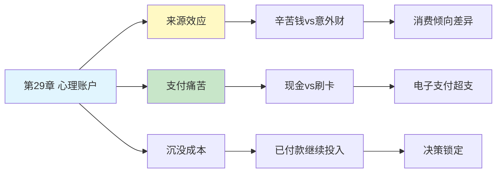

# 第29章 心理账户

## 📍 章节定位

### 全书位置
> 第29章深入探讨心理账户机制——人们如何在心中将金钱分门别类，对不同来源、不同用途的钱采取截然不同的态度，揭示这种非理性记账方式如何影响消费和投资决策。

- **全书核心问题**: 人类的决策是如何偏离理性经济模型的？
- **本章回答的问题**: 为什么同样的钱在不同情境下价值不同？我们如何在心里"记账"？
- **角色类型**: 核心概念型（行为经济学核心概念）
- **论证位置**: 从社会偏好转向个体消费心理，展示有限理性的具体表现

### 章节序列
| 方向 | 章节标题 | 逻辑连接 |
|------|----------|----------|
| 前章 | [[第28章-公平偏好]] | 从社会公平转向个体金钱心理 |
| 后章 | [[第30章-选择架构]] | 心理账户是选择架构设计的重要考量 |
| 整书 | [[思考快与慢-丹尼尔·卡尼曼-拆解记录]] | 行为经济学核心概念章节 |

### 一句话定位
> 第29章揭示了心理账户的非理性特征——我们把钱分成"辛苦钱""意外之财""度假基金"等类别，导致同样的100块钱在不同账户里有着截然不同的消费倾向。

---

## 🎯 核心观点

### 第一层：表层案例

| 案例名称 | 简要描述 | 页码 | 关键引文 |
|----------|----------|------|----------|
| 戏剧票实验 | 丢了票 vs 丢了等额现金，购票意愿不同 | p.— | "丢了票不买，丢了钱会买" |
| 工资与奖金 | 同样金额，工资省着花，奖金大方花 | p.— | "钱的来源决定花的速度" |
| 沉没成本 | 已付的钱影响继续消费的意愿 | p.— | "花了钱就要用完" |
| 信用卡vs现金 | 刷卡消费更容易超支 | p.— | "刷卡感觉不到花钱" |
| 打折与返现 | 同样优惠，返现比打折更受欢迎 | p.— | "返现像额外收入" |

### 第二层：中层机制

| 机制名称 | 组成要素 | 因果链条 | 证据来源 |
|----------|----------|----------|----------|
| 来源效应 | 钱的来源 + 消费倾向 | 辛苦钱→谨慎消费；意外之财→随意消费 | 消费行为研究 |
| 预算约束 | 心理预算 + 消费限额 | 设定账户限额→超限产生心理痛苦 | 消费心理实验 |
| 支付痛苦 | 支付方式 + 消费感受 | 现金→痛苦明显；信用卡→痛苦钝化 | 支付方式研究 |
| 沉没成本谬误 | 已付成本 + 继续投入 | 已付钱→不舍得放弃→继续投入 | 决策偏误研究 |

### 第三层：底层规律

| 规律陈述 | 抽象层级 | 知识连接 | 适用范围 |
|----------|----------|----------|----------|
| 可替代性违背原理 | 行为经济学基础 | [[心理账户理论]], [[塞勒行为经济学]] | 所有涉及金钱的决策 |
| 情感标签效应 | 心理学基础 | [[情感经济学]], [[认知标签理论]] | 消费与投资行为 |
| 支付疼痛机制 | 神经经济学视角 | [[脑科学消费研究]], [[痛苦中枢理论]] | 支付决策领域 |

---

## 💬 降维翻译

### 观点1: 同样的钱，不同的待遇

#### 原文表达
> "传统经济学假设金钱是可替代的：100块钱就是100块钱，不管它来自哪里。但心理账户研究表明，人们对钱的来源高度敏感。辛苦赚来的工资和意外得到的奖金被放在不同的'心理账户'里，前者谨慎消费，后者更容易挥霍。这种非理性违背了金钱的可替代性原则。"

> p.—

#### 降维翻译（中学生能懂）
同样是100块钱，但你不一定用一样的方式花掉：

- 工资发的100块：存起来，或者精打细算
- 奶奶给的100块压岁钱：可能直接买零食
- 捡到的100块：花得最快，像白来的一样

钱明明一样，为什么待遇不同？因为你在脑子里给它们开了不同的"账户"。

#### 日常类比（奶奶能懂）
就像你家里有好几个罐子存钱：一个装辛苦攒的，一个装儿女给的，一个装中奖得的。每个罐子花的节奏不一样，虽然里面的钱都一样花。

#### 检验
- Q: 如果一个中学生问你这是什么意思？
- A: 人会把钱分成不同的"心理口袋"，不同口袋里的钱花起来感觉不一样。

### 观点2: 支付方式影响消费

#### 原文表达
> "支付痛苦（pain of paying）因支付方式而异。现金支付时，掏钱这个动作让消费的痛苦感更强烈；而刷卡或电子支付时，这个过程被抽象化，痛苦感大大降低。这就是为什么用信用卡消费更容易超支——我们感觉不到在花钱。"

> p.—

#### 降维翻译（中学生能懂）
想想你用钱买东西的时候：

- 用现金：一张一张掏出去，看着钱包变薄，有点心疼
- 刷卡：滴一下就完了，好像没花钱一样
- 手机支付：更没感觉，点两下就完事

所以用手机付钱的时候，特别容易买多。因为你的脑子感觉不到"失去钱"的痛苦。

#### 日常类比（奶奶能懂）
以前买东西要掏真金白银，花多少心里有数。现在手机扫一下，钱没了都不知道怎么没的。就像开着水龙头不关，因为看不见水流出去。

#### 检验
- Q: 如果一个中学生问你这是什么意思？
- A: 付钱的方式会影响你花多少钱的意愿。越"无感"的支付方式，越容易让你花超。

---

## ✨ 金句库

### 原书金句
| 金句 | 页码 | 适用场景 |
|------|------|----------|
| "钱有心理标签，不是所有钱都一样" | p.— | 消费心理科普 |
| "刷卡消除了支付痛苦" | p.— | 支付方式分析 |
| "心理账户是人类理性的边界" | p.— | 行为经济学讨论 |

### 降维金句
| 金句 | 来源观点 | 适用场景 |
|------|----------|----------|
| "辛苦钱存着，意外财花掉" | 来源效应 | 理财教育 |
| "刷卡不疼，所以花得多" | 支付痛苦 | 消费警示 |
| "心里有本算不清的账" | 心理账户复杂 | 自我觉察 |

## 🔗 当下映射

### 💰 财富应用
| 场景 | 具体行动 | 预期效果 | 风险提示 |
|------|----------|----------|----------|
| 日常消费 | 大额消费用现金支付 | 增加支付痛苦，减少冲动 | 不便捷 |
| 奖金处理 | 把意外收入转入储蓄账户 | 避免"意外之财"心态挥霍 | 可能降低消费幸福感 |
| 预算管理 | 建立统一账户管理 | 减少心理账户的干扰 | 需要自律 |

### 💼 职场应用
| 场景 | 具体行动 | 所需能力 | 适用职级 |
|------|----------|----------|----------|
| 薪酬设计 | 把奖金和工资分开发放 | 心理学知识 | HR及管理层 |
| 营销策略 | 利用返现而非打折 | 消费心理洞察 | 营销岗位 |
| 项目预算 | 统一预算视角，避免分项决策 | 财务管理能力 | 项目经理 |

### 🏠 生活应用
| 场景 | 具体行动 | 可行性 | 见效时间 |
|------|----------|--------|----------|
| 家庭财务 | 建立统一记账系统 | 高 | 长期见效 |
| 冲动消费 | 设置支付冷却期 | 高 | 即时生效 |
| 旅游预算 | 设定独立账户避免超支 | 中 | 短期见效 |

### 72小时行动计划
1. **明天可以做的第一件事**: 统计本周各渠道消费，看看不同支付方式下的消费金额差异
2. **本周内可以尝试的事**: 尝试一天只用现金支付，感受支付痛苦的变化
3. **需要准备资源才能做的事**: 建立个人"统一账户"视角，重新审视所有财务决策

---

## 🕸️ 章节关联

### 向上关联 → 整书
- **贡献**: 揭示金钱决策的非理性机制，展示有限理性的具体表现
- **位置**: 从社会偏好转向个体消费心理，是行为经济学核心章节

### 横向关联 → 章节间
| 章节编号 | 章节标题 | 关联类型 | 连接描述 |
|----------|----------|----------|----------|
| 第28章 | 公平偏好 | 前置 | 公平感也会影响心理账户分类 |
| 第30章 | 选择架构 | 延续 | 心理账户是选择架构的重要考量 |
| 第4章 | 心理账户的诱惑 | 前置 | 心理账户概念的早期引入 |
| 第14章 | 参考点和框架 | 相关 | 框架影响心理账户分类 |

### 向下关联 → 具体应用
| 应用场景 | 难度 | 前置知识 |
|----------|------|----------|
| 消费者行为分析 | 中 | 消费心理学基础 |
| 薪酬激励设计 | 高 | 人力资源管理 |
| 个人理财规划 | 中 | 财务知识 |

### 跨书关联 → 知识网络
| 书籍 | 概念 | 关系 | 备注 |
|------|------|------|------|
| [[思考快与慢-丹尼尔·卡尼曼-拆解记录]] | 心理账户 | 同源 | 理论来源 |
| [[助推-理查德·塞勒-拆解记录]] | 心理账户应用 | 延伸 | 塞勒是该概念创始人 |
| [[怪诞行为学-拆解记录]] | 非理性消费 | 相关 | 消费行为学视角 |
| [[金钱心理学-拆解记录]] | 财富心理 | 延伸 | 投资心理视角 |

### 关联可视化

---

## ❓ 问答设计

### Q1: [记忆型问题]
**认知层次**: 记忆
**难度**: 低
**描述**: 什么是心理账户？
**答案要点**:
- 人在心中将钱分门别类
- 不同账户有不同的消费规则
- 违背金钱可替代性原则

### Q2: [理解型问题]
**认知层次**: 理解
**难度**: 中
**描述**: 为什么辛苦赚的钱和意外得到的钱消费方式不同？
**答案要点**:
- 来源不同产生不同情感标签
- 辛苦钱带有"珍惜"心理
- 意外之财被视为"额外"的

### Q3: [应用型问题]
**认知层次**: 应用
**难度**: 中
**描述**: 如何利用心理账户知识帮助控制消费？
**答案要点**:
- 用现金支付增加支付痛苦
- 把意外收入快速转入储蓄
- 建立统一账户视角

### Q4: [分析型问题]
**认知层次**: 分析
**难度**: 中
**描述**: 心理账户如何违背传统经济学的"可替代性"假设？
**答案要点**:
- 传统经济学认为钱是等价的
- 实际上钱的来源影响使用
- 情感标签导致非等价对待

### Q5: [创造型问题]
**认知层次**: 创造
**难度**: 高
**描述**: 设计一个帮助人们克服心理账户偏误的个人财务系统？
**答案要点**:
- 统一账户视角呈现
- 支付方式提醒功能
- 消费分类与统计

### Q6: [理解型问题]
**认知层次**: 理解
**难度**: 中
**描述**: 支付痛苦是如何影响消费决策的？
**答案要点**:
- 现金支付痛苦明显
- 电子支付痛苦钝化
- 痛苦感与消费意愿负相关

### Q7: [应用型问题]
**认知层次**: 应用
**难度**: 中
**描述**: 为什么商家喜欢用返现而非直接打折？
**答案要点**:
- 返现被心理账户视为"额外收入"
- 打折只是"少花"
- 返现更受欢迎

### Q8: [分析型问题]
**认知层次**: 分析
**难度**: 高
**描述**: 沉没成本谬误与心理账户有什么关系？
**答案要点**:
- 已付的钱在特定账户里
- 不想"浪费"账户余额
- 导致继续投入

### Q9: [理解型问题]
**认知层次**: 高
**描述**: 为什么说心理账户是"人类理性的边界"？
**答案要点**:
- 违背经济学基本假设
- 体现有限理性特征
- 情感因素干扰理性计算

### Q10: [创造型问题]
**认知层次**: 创造
**难度**: 高
**描述**: 如何设计营销策略利用消费者的心理账户特点？
**答案要点**:
- 分期付款降低支付痛苦
- 返现/积分刺激消费
- 创造"意外之财"感觉

---
