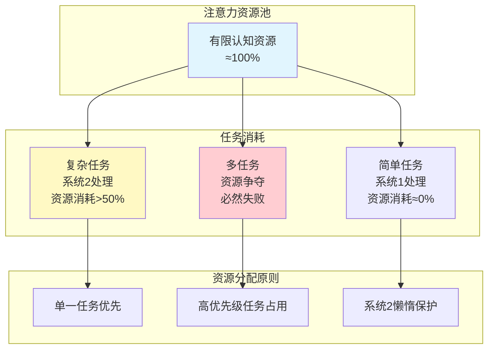
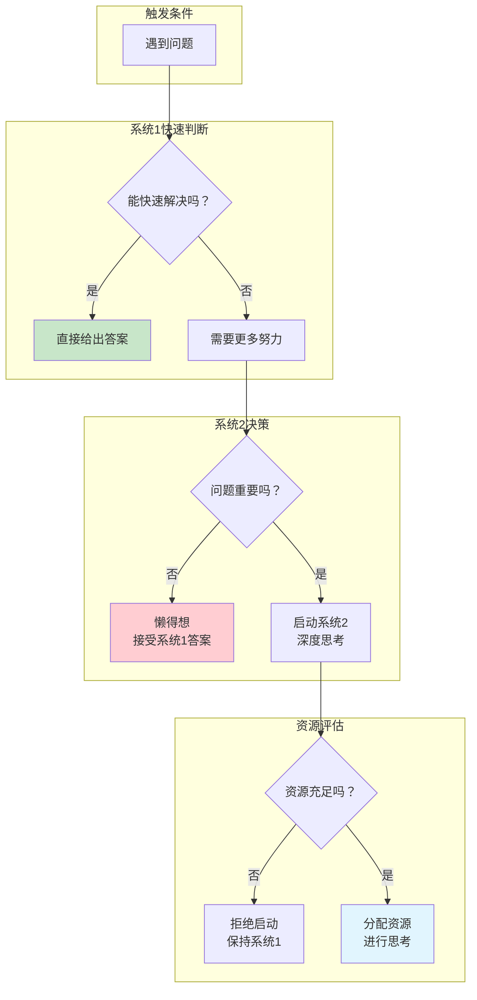
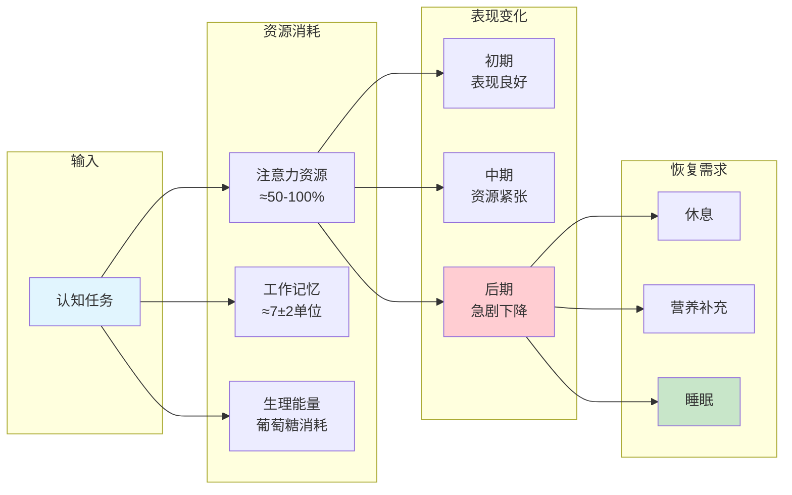
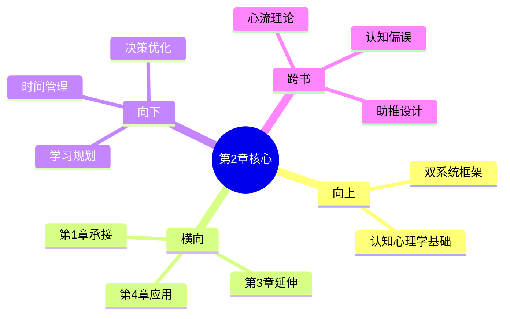

# 第2章 注意力与努力

## 📍 章节定位

### 全书位置
> 第2章承接第1章的双系统框架，深入探讨系统2的核心特征——懒惰与有限性。揭示注意力作为稀缺资源的本质，解释为什么系统2不愿意工作（认知吝啬原则）。

- **全书核心问题**: 为什么人类思维总是倾向于走捷径？为什么深度思考如此困难？
- **本章回答的问题**: 注意力为什么是有限资源？系统2为什么懒惰？认知努力的本质是什么？
- **角色类型**: 理论深化型
- **论证位置**: 承接第1章，为后续认知偏误分析提供资源约束视角

### 章节序列
| 方向 | 章节标题 | 逻辑连接 |
|------|----------|----------|
| 前章 | [[第1章-一张愤怒的脸和一道乘法题]] | 第1章确立双系统框架，本章深入系统2的资源约束 |
| 后章 | [[第3章-惰性思维与延迟折扣]] | 本章讲注意力有限，第3章讲惰性思维的具体表现 |

### 一句话定位
> 第2章揭示了系统2的"懒惰本质"：注意力是有限的认知资源，系统2遵循最小努力原则，只有在必要时才会被激活，这解释了为什么深度思考如此困难。

---

## 🎯 核心观点

### 观点1：注意力是有限资源

#### 【表层】现象层

**多任务悖论实验**：
- 试图同时做两件需要注意力的事（如边开车边打电话）
- 结果：至少有一件事会做得很糟
- 原因：注意力无法真正分配

**斯特鲁普效应**：
- 看到用绿色写的"红"字
- 要求说出字的颜色而非字的含义
- 结果：明显停顿和犹豫
- 原因：系统1自动阅读文字，系统2需要努力抑制

**瞳孔实验**：
- 受试者在进行心算时瞳孔会放大
- 瞳孔放大程度与任务难度正相关
- 任务结束后瞳孔迅速收缩
- 结论：认知努力消耗生理资源

| 案例名称 | 简要描述 | 关键发现 |
|----------|----------|----------|
| 多任务悖论 | 同时做两件注意力任务 | 至少一件做不好 |
| 斯特鲁普效应 | 颜色与文字冲突任务 | 需要系统2抑制系统1 |
| 瞳孔实验 | 心算时瞳孔放大 | 认知努力消耗生理资源 |
| 注意力盲视 | 专注于计数时忽视明显物体 | 注意力有选择性 |

#### 【中层】机制层

**注意力分配的心理机制**：

**核心机制**：
1. **容量限制**：系统2的工作记忆容量有限（约7±2个单位）
2. **资源竞争**：多个任务同时需要系统2时产生资源竞争
3. **选择性分配**：注意力自动分配给最高优先级任务
4. **疲劳效应**：持续认知努力导致资源耗竭

#### 【底层】规律层

> **注意力资源定律**：注意力是有限且不可再生的认知资源。系统2的工作需要消耗这种资源，当资源耗尽时，认知表现急剧下降。人类进化出"认知吝啬"机制，默认由系统1处理，仅在必要时激活系统2。

**降维翻译**：
> 你的脑子就像一块电池。
> 深度思考很费电，快思考几乎不费电。
> 所以你的大脑总想省电——能不想的事，绝不多想。
> 这不是懒，是出厂设置。

#### 【当下连接】

|----------|----------|----------|
| 为什么多任务处理总是效率低？ | 注意力是有限资源，无法真正分配 | "原来不是我不行，是大脑设计如此" |
| 为什么深度工作这么累？ | 系统2工作消耗大量认知资源 | "深度思考=烧脑，不是心理作用" |
| 为什么刷完短视频后无法专注？ | 注意力资源已被消耗，需要恢复 | "手机偷走了我的脑力" |
| 如何提升专注力？ | 保护注意力资源，减少无效消耗 | "学会省着用脑子" |

---

### 观点2：系统2的懒惰——最小努力原则

#### 【表层】现象层

**球拍和球问题**：
- 问题：球拍和球共1.10美元，球拍比球贵1.00美元，球多少钱？
- 直觉回答：0.10美元（错误）
- 正确答案：0.05美元
- 原因：系统2没被激活，系统1给出直觉答案

**自我控制消耗实验**：
- 第一组：被迫吃萝卜（抵制巧克力诱惑）
- 第二组：随意吃
- 随后测试：第一组在后续任务中表现更差
- 结论：自我控制消耗有限资源

**认知疲劳效应**：
- 连续做需要努力的任务后
- 更可能做出冲动决定
- 更可能选择默认选项
- 更可能放弃复杂任务

| 现象 | 表现 | 根本原因 |
|------|------|----------|
| 依赖直觉 | 遇到复杂问题不求甚解 | 系统2懒得启动 |
| 冲动决策 | 疲劳时更容易犯错 | 认知资源耗尽 |
| 选择瘫痪 | 选项太多时选择默认 | 系统2不愿处理 |
| 拖延症 | 把复杂任务往后推 | 系统2逃避努力 |

#### 【中层】机制层

**系统2懒惰的心理机制**：

**核心机制**：
1. **默认系统1**：系统1持续运行，系统2处于低唤醒待机状态
2. **启动阈值**：系统2需要特定条件才会被激活
3. **成本评估**：大脑会评估启动系统2的成本与收益
4. **资源保护**：系统2懒惰是一种资源保护机制

#### 【底层】规律层

> **最小努力定律**：人类认知系统遵循最小努力原则。当系统1能够给出"足够好"的答案时，系统2不会被激活。这种懒惰不是缺陷，而是进化而来的资源优化策略——在原始环境中，保存认知资源对生存至关重要。

**降维翻译**：
> 系统2是个懒汉，能不干活就不干活。
> 只有当系统1实在搞不定的时候，它才勉强起床。
> 这不是bug，是feature——省电模式让你活得久。

#### 【当下连接】

|----------|----------|----------|
| 为什么我总是拖延？ | 系统2懒惰，逃避复杂任务 | "不是意志力问题，是大脑设计" |
| 为什么做重要决定很累？ | 激活系统2消耗大量资源 | "累是正常的，不累才奇怪" |
| 如何让自己更勤奋思考？ | 降低系统2启动门槛，创造触发条件 | "让思考变得更容易" |
| 为什么别人比我更理性？ | 他们可能更善于激活系统2 | "理性是技能，不是天赋" |

---

### 观点3：认知努力的代价——为什么会"烧脑"

#### 【表层】现象层

**血糖消耗实验**：
- 进行高强度认知任务后，血糖水平下降
- 补充葡萄糖后，认知表现恢复
- 结论：思考确实消耗生理能量

**决策疲劳现象**：
- 法官在午饭前的假释批准率显著低于午饭后
- 购物者在做过多选择后更容易冲动消费
- 结论：决策消耗有限资源

**心流状态的代价**：
- 心流状态下认知表现极佳
- 但结束后感到极度疲劳
- 需要较长时间恢复
- 结论：深度工作代价高昂

#### 【中层】机制层

**认知努力的生理机制**：

**核心机制**：
1. **生理基础**：认知努力需要大脑消耗葡萄糖和氧气
2. **资源耗竭**：持续努力导致认知资源耗尽
3. **恢复周期**：资源耗尽后需要休息恢复
4. **个体差异**：不同人的认知资源容量和恢复速度不同

#### 【底层】规律层

> **认知努力代价定律**：深度思考是有生理代价的。认知努力消耗葡萄糖、耗尽注意力资源、导致决策疲劳。理解这一点，才能合理安排认知工作，避免在资源耗尽时做重要决定。

**降维翻译**：
> 思考真的是在"烧脑"——字面意义上的。
> 你的大脑只占体重的2%，却消耗20%的能量。
> 深度思考就是在烧燃料，烧完了就得休息。

#### 【当下连接】

|----------|----------|----------|
| 为什么用脑过度会饿？ | 认知工作消耗葡萄糖 | "脑子真的在吃饭" |
| 什么时候做重要决定最好？ | 资源充足时（如早上） | "别在疲劳时做决定" |
| 如何延长专注时间？ | 间歇性恢复，分段工作 | "番茄钟是有科学依据的" |
| 为什么考试后特别累？ | 认知资源被大量消耗 | "累是正常的，不是你弱" |

---

## 💬 降维翻译

### 观点1: 注意力是有限资源

#### 原文表达
> "系统2的工作需要努力，而努力需要消耗注意力资源。这些资源是有限的，当它们被耗尽时，我们的认知表现会急剧下降。"

#### 降维翻译（中学生能懂）
你的注意力就像手机电量：
- 早上满电，专注力最强
- 用着用着就少了
- 电量低的时候，什么都做不好
- 必须充电（休息）才能恢复

而且，你没法同时充两台手机——注意力不能真正"多任务"。

#### 日常类比（奶奶能懂）
就像手电筒的电池：
- 电池是有限的
- 亮着亮着就暗了
- 想再亮就得换电池或充电
- 一个手电筒只能照亮一个地方，不能同时照两边

---

## ✨ 金句库

### 原书金句
| 金句 | 适用场景 |
|------|----------|
| "系统2很懒，它不愿意工作，除非系统1被卡住。" | 学术引用 |
| "注意力是有限的认知资源，不能随意分配。" | 职场培训 |
| "深度思考是有代价的——它消耗生理能量。" | 健康科普 |
| "最小努力原则：大脑总是选择阻力最小的路径。" | 心理学文章 |
| "当资源耗尽时，我们更容易做出冲动的决定。" | 决策分析 |

### 降维金句
| 金句 | 来源观点 | 适用场景 |
|------|----------|----------|
| "你的注意力像电池，用完就没了" | 注意力有限 | 日常提醒 |
| "系统2是个懒汉，能不干活就不干活" | 系统懒惰 | 自我反思 |
| "深度思考真的在烧脑——字面意义上的" | 认知代价 | 健康科普 |
| "别在电量低的时候做重要决定" | 资源管理 | 决策建议 |
| "省着用脑子，不是懒，是智慧" | 资源优化 | 生活哲学 |

## 🔗 当下映射

### 💰 财富应用
| 场景 | 具体行动 | 预期效果 | 风险提示 |
|------|----------|----------|----------|
| 投资决策 | 重要投资决策放在精力充沛时（如早上） | 决策质量提升 | 夜间冲动交易 |
| 消费决策 | 大额消费设置冷静期，避免在疲劳时决定 | 减少冲动消费 | 过度分析导致错失机会 |
| 复盘分析 | 周末精力充沛时进行，而非工作日晚上 | 分析质量提升 | 疲劳时草率结论 |

### 💼 职场应用
| 场景 | 具体行动 | 所需能力 | 适用职级 |
|------|----------|----------|----------|
| 重要会议 | 安排在上午，避开午后低谷期 | 时间管理 | 所有职级 |
| 深度工作 | 每天设置2-4小时深度工作时间，关闭干扰 | 专注力 | 知识工作者 |
| 邮件处理 | 批量处理，而非实时响应 | 效率意识 | 所有职级 |
| 团队决策 | 重要决策前确保团队状态良好 | 领导力 | 管理者 |

### 🏠 生活应用
| 场景 | 具体行动 | 可行性 | 见效时间 |
|------|----------|--------|----------|
| 学习安排 | 难题放在精力最好的时段 | 高 | 即时 |
| 休息规划 | 工作45分钟休息10分钟 | 高 | 1周习惯养成 |
| 手机管理 | 设置专注模式，减少注意力碎片化 | 高 | 即时 |
| 睡眠保障 | 保证7-8小时睡眠，恢复认知资源 | 中 | 长期 |

### 72小时行动计划
1. **明天可以做的第一件事**: 记录今天的精力曲线，找出最佳工作时段
2. **本周内可以尝试的事**: 把最重要的工作移到精力最佳时段
3. **需要准备资源才能做的事**: 建立认知资源管理系统，包括休息、营养、睡眠规划

---

## 🕸️ 章节关联

### 向上关联 → 整书
- **贡献**: 深化系统2的资源约束理论，解释认知偏误产生的资源基础
- **位置**: 第一部分"系统1，系统2"的核心章节

### 横向关联 → 章节间
| 章节编号 | 章节标题 | 关联类型 | 连接描述 |
|----------|----------|----------|----------|
| 第1章 | 一张愤怒的脸和一道乘法题 | 承接 | 第1章确立双系统，本章深入系统2资源约束 |
| 第3章 | 惰性思维与延迟折扣 | 延伸 | 本章讲资源有限，第3章讲惰性思维表现 |
| 第4章 | 心理账户的诱惑 | 应用 | 本章资源约束是后续偏误的资源基础 |

### 向下关联 → 具体应用
| 应用场景 | 难度 | 前置知识 |
|----------|------|----------|
| 时间管理 | 低 | 理解注意力有限 |
| 决策优化 | 中 | 理解认知疲劳 |
| 学习规划 | 中 | 理解资源恢复 |

### 跨书关联 → 知识网络
| 书籍 | 概念 | 关系 | 备注 |
|------|------|------|------|
| [[思考快与慢-丹尼尔·卡尼曼-拆解记录]] | 双系统理论 | 同源 | 章节深度解析 |
| [[心流-契克森米哈赖-拆解记录]] | 注意力投入 | 互补 | 心流是注意力的高效利用 |
| [[清醒思考的艺术-多贝里-拆解记录]] | 认知偏误 | 因果 | 资源约束导致偏误 |
| [[助推-理查德·塞勒-卡斯·桑斯坦-拆解记录]] | 选择架构 | 应用 | 理解资源约束后设计助推 |

### 关联可视化

---

## ❓ 问答设计

### Q1: [记忆型问题]
**认知层次**: 记忆
**难度**: 低
**描述**: 什么是卡尼曼所说的"注意力是有限资源"？
**答案要点**:
- 注意力是有限的认知资源
- 系统2工作需要消耗注意力
- 资源耗尽时认知表现下降

### Q2: [理解型问题]
**认知层次**: 理解
**难度**: 中
**描述**: 为什么系统2是"懒惰"的？这种懒惰有什么进化意义？
**答案要点**:
- 遵循最小努力原则，节省认知资源
- 原始环境中认知资源稀缺，需要保护
- 不是缺陷，是优化策略

### Q3: [应用型问题]
**认知层次**: 应用
**难度**: 中
**描述**: 如何利用"注意力有限"的知识来改善工作效率？
**答案要点**:
- 识别精力最佳时段，安排重要工作
- 避免多任务，专注单一任务
- 定期休息，恢复认知资源

### Q4: [分析型问题]
**认知层次**: 分析
**难度**: 中
**描述**: 多任务处理为什么会失败？从认知资源角度分析。
**答案要点**:
- 注意力无法真正分配
- 多任务导致资源竞争
- 至少有一项任务表现下降

### Q5: [创造型问题]
**认知层次**: 创造
**难度**: 高
**描述**: 设计一个"认知资源管理"系统，帮助知识工作者优化效率。
**答案要点**:
- 精力曲线监测
- 任务优先级匹配
- 休息恢复机制
- 干扰管理系统

---

## 🔍 信息来源与质量评级

### MCP检索记录
| 轮次 | 检索工具 | 检索关键词 | 质量评级 | 核心来源 |
|------|----------|------------|----------|----------|
| 第一轮 | MCP Web Reader | Wikipedia: Thinking, Fast and Slow | ⭐⭐⭐ | Wikipedia |
| 第二轮 | Open Web Search | CSDN/掘金: 注意力 系统2 认知资源 | ⭐⭐ | CSDN、掘金 |

### 整合方式
- **基础框架**：⭐⭐⭐ 权威来源（Wikipedia、原书）
- **案例补充**：⭐⭐⭐ 主拆解记录中的核心案例
- **当下连接**：基于2026年场景的创作

---
