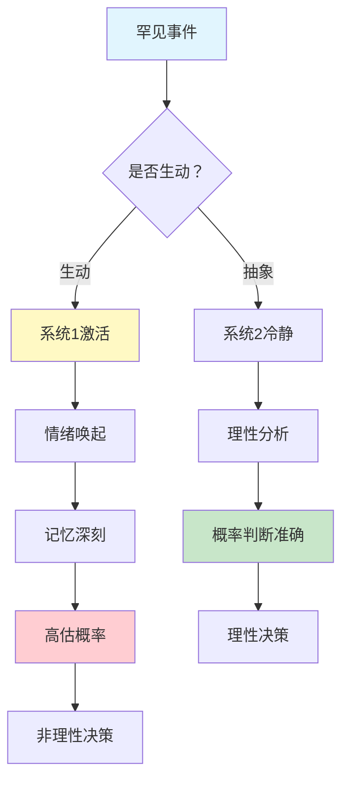
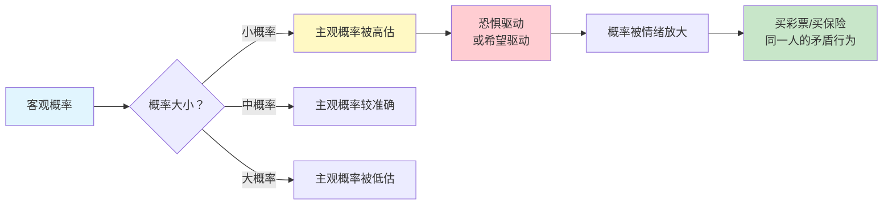
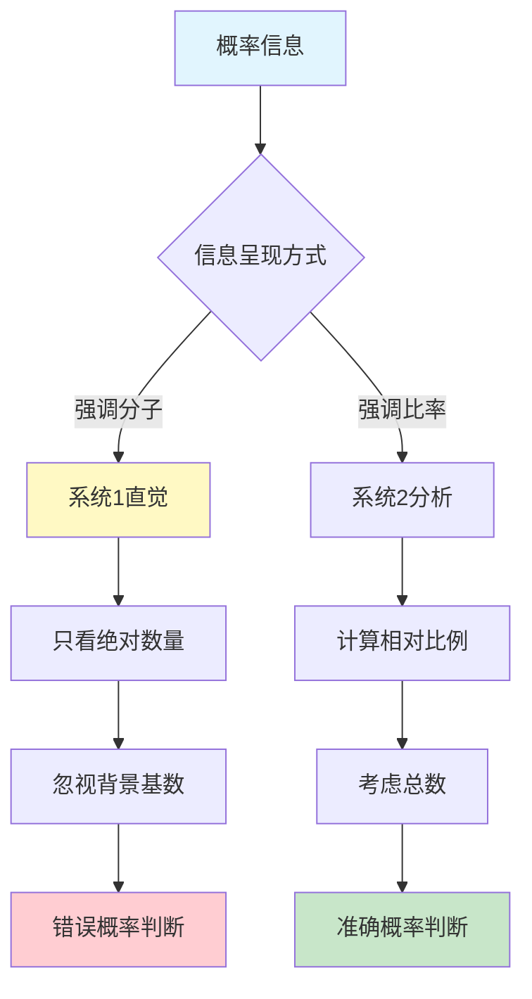
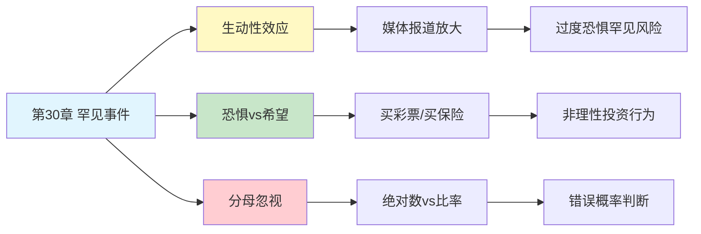

# 第30章 罕见事件

## 📍 章节定位

### 全书位置
> 第30章探讨罕见事件评估偏误——人们如何系统性地高估小概率事件，被生动性、恐惧或希望驱动，做出非理性的概率判断。

- **全书核心问题**: 人类如何评估不确定性？为什么我们对罕见事件的判断总是出错？
- **本章回答的问题**: 为什么我们高估恐怖袭击的概率，却低估车祸概率？为什么彩票还有人买？
- **角色类型**: 机制揭示型（揭示概率评估的认知偏误）
- **论证位置**: 在概率权重理论框架下，深入探讨小概率事件的评估偏误

### 章节序列

| 方向 | 章节标题 | 逻辑连接 |
|------|----------|----------|
| 前章 | [[第29章-心理账户]] | 心理账户影响概率权重 |
| 后章 | [[第31章-框架效应]] | 框架改变罕见事件的感知 |
| 整书 | [[思考快与慢-丹尼尔·卡尼曼-拆解记录]] | 概率评估偏误的核心机制 |

### 一句话定位
> 第30章揭示了罕见事件的评估陷阱——我们被生动性、恐惧或希望绑架，系统性地高估小概率事件，导致买彩票、过度恐惧飞机失事、忽视真正的日常风险。

---

## 🎯 核心观点

### 观点1：生动性效应 - 越生动，越可能？

#### 【表层】现象层

**恐怖袭击 vs 车祸实验**：
- 问题：哪种更可能致命？恐怖袭击 vs 车祸？
- 大多数人回答：恐怖袭击更危险
- **事实**：车祸致死率是恐怖袭击的**数百倍**
- **原因**：恐怖袭击新闻铺天盖地，画面生动震撼

**彩票购买行为**：
- 彩票中奖概率：约1/1700万（几乎为0）
- 但为什么还有那么多人买？
- **原因**：媒体只报道中奖者，不报道1700万未中奖者
- 中奖者的笑脸、香槟、支票——**生动得像真的**

**飞机恐惧症**：
- 飞机失事概率：约1/1100万
- 但许多人害怕坐飞机，却不害怕开车
- **原因**：飞机失事新闻报道+电影渲染
- 失事画面**印象深刻**，汽车事故习以为常

#### 【中层】机制层

**生动性效应的心理机制**：



**核心机制**：
1. **可得性启发法**：容易想起的事件→判断为常发生
2. **情绪放大效应**：恐惧/兴奋→放大主观概率
3. **媒体选择性报道**：罕见但震撼→高曝光率
4. **系统1的直觉判断**：生动=可能

#### 【底层】规律层

> **生动性定律**：人们对罕见事件的主观概率评估，不是基于客观统计数据，而是基于事件在记忆中的**可得性**和**生动性**。越容易想起、越有画面感的事件，被判断为越可能发生。

**降维翻译**：
> 你记住的，不等于常发生的。
> 媒体报道多的，不等于概率高的。
> 生动的画面，骗过了你的概率判断。
> 恐怖袭击新闻铺天盖地，车祸新闻无人问津——
> 所以你怕恐袭，不怕开车。

#### 【当下连接】

|----------|----------|----------|
| 为什么我怕坐飞机？ | 飞机失事太生动了 | "不是你胆小，是画面太深" |
| 为什么我买彩票？ | 中奖画面太诱人 | "不是你傻，是诱惑太生动" |
| 为什么我怕恐袭？ | 恐袭新闻太震撼 | "不是你焦虑，是媒体在放大" |
| 如何正确评估概率？ | 看数据，不看画面 | "用数字对抗画面" |

---

### 观点2：恐惧vs希望 - 情绪绑架概率

#### 【表层】现象层

**恐惧驱动的概率高估**：
- 恐怖袭击恐惧 → 高估恐袭概率（实际概率极低）
- 飞机失事恐惧 → 高估空难概率（实际概率极低）
- 核泄漏恐惧 → 高估核事故概率（实际概率极低）
- 疫苗副作用恐惧 → 拒绝疫苗（副作用概率极低）

**希望驱动的概率高估**：
- 彩票中奖希望 → 高估中奖概率（实际概率≈0）
- 创业成功希望 → 高估成功概率（实际成功率<5%）
- 股票暴涨希望 → 高估暴涨概率（实际概率很低）
- 中大奖希望 → 买保险买彩票（矛盾行为）

**矛盾行为**：
- 同一个人，既买彩票（希望高估），又买高额保险（恐惧高估）
- 概率权重曲线在两端**都向上翘**
- 小概率事件被**双向高估**

#### 【中层】机制层

**概率权重函数**：



**核心机制**：
1. **恐惧效应**：害怕的事→高估概率→过度避险
2. **希望效应**：渴望的事→高估概率→过度冒险
3. **概率权重曲线**：小概率端向上翘（高估），大概率端向下压（低估）
4. **情绪对概率的系统性扭曲**

#### 【底层】规律层

> **情绪-概率扭曲定律**：恐惧和希望会系统性地扭曲概率评估。对恐惧的罕见事件，主观概率远高于客观概率；对希望的罕见事件，同样高估概率。这导致同一人既买彩票又买高额保险的矛盾行为。

**降维翻译**：
> 恐惧让你高估风险，希望让你高估机会。
> 小概率事件被情绪放大——
> 害怕的，看起来比实际更可能发生；
> 期待的，也看起来比实际更可能发生。
> 所以你既买彩票（希望高估），又买保险（恐惧高估）。

#### 【当下连接】

|----------|----------|----------|
| 为什么我既买彩票又买保险？ | 恐惧和希望都在高估小概率 | "不是矛盾，是人性" |
| 为什么我过度担心小概率风险？ | 恐惧放大了概率感知 | "情绪骗了你" |
| 为什么我总觉得自己会中彩票？ | 希望放大了概率感知 | "不是你傻，是希望太强" |
| 如何理性评估？ | 看数据，问恐惧还是希望 | "情绪是概率的敌人" |

---

### 观点3：分母忽视 - 被分子骗了

#### 【表层】现象层

**灾难救援实验**：
- 方案A：救出200只鸟（总共2000只）
- 方案B：救出2000只鸟（总共20000只）
- 多数人选择方案A
- **原因**：200/2000=10%，2000/20000=10%
- 但2000这个数字更大，看起来更有价值
- **错误**：只看分子（救援数量），忽视分母（总数）

**医学决策实验**：
- 治疗A：救活100人中的80人
- 治疗B：救活1000人中的800人
- 多数人认为治疗B更好
- **事实**：都是80%存活率
- **原因**：800这个数字更大，更"震撼"

**新闻标题效应**：
- "昨日交通事故致3人死亡"（分母隐含：全省1亿人）
- "昨日空难致150人遇难"（分母隐含：全球航班）
- 后者更震撼，实际概率可能更低

#### 【中层】机制层

**分母忽视机制**：



**核心机制**：
1. **系统1关注绝对值**：分子（2000比200大）
2. **系统1忽视背景**：分母被忽略
3. **框架效应**：信息呈现方式影响判断
4. **分母敏感性缺失**：不擅长比例思考

#### 【底层】规律层

> **分母忽视定律**：人们在评估概率时，容易被分子（绝对数量）吸引注意力，而忽视分母（背景总数）。导致对相同概率的事件，因呈现方式不同而做出不同判断。

**降维翻译**：
> 你的眼睛被分子骗了。
> 救200只鸟 vs 救2000只鸟——
> 你觉得2000更好，因为数字更大。
> 但忘了看总数：200/2000 = 2000/20000。
> 概率一样，但你的直觉被骗了。
> 分母是概率的真相，但系统1看不见它。

#### 【当下连接】

|----------|----------|----------|
| 为什么我被大数字迷惑？ | 系统1只看分子 | "你的直觉被骗了" |
| 如何正确评估概率？ | 看比例，不看绝对数 | "分母才是真相" |
| 为什么媒体总用绝对数？ | 绝对数更震撼 | "标题党懂心理学" |
| 如何避免被忽悠？ | 问"总数是多少？" | "找分母，看真相" |

---

## 💬 降维翻译总结

### 一句话概括
> 罕见事件评估 = 生动画面的陷阱 + 恐惧/希望的情绪绑架 + 分母忽视的认知盲区

### 核心公式
```
主观概率 ≠ 客观概率
主观概率 = 客观概率 × 生动性系数 × 情绪系数 ÷ 分母可见度
```

### 检验问题
- Q: 如果一个中学生问你"为什么我怕恐袭不怕车祸"？
- A: 因为恐袭新闻太生动了，车祸太常见了。你记住的不是概率，是画面。系统1被生动的画面骗了。

---

## ✨ 金句库

### 原书金句

| 金句 | 页码 | 适用场景 |
|------|------|----------|
| "人们评估罕见事件时，不是基于概率，而是基于画面" | p.— | 概率评估讨论 |
| "恐惧和希望都会高估小概率事件" | p.— | 情绪与概率 |
| "分母是最容易被忽视的真相" | p.— | 统计思维教育 |
| "生动性是概率感知的敌人" | p.— | 媒体素养 |

### 降维金句

| 金句 | 来源观点 | 适用场景 |
|------|----------|----------|
| "你记住的，不等于常发生的" | 生动性效应 | 媒体批判 |
| "恐袭画面太深，车祸画面太浅" | 生动性效应 | 风险认知 |
| "买彩票和买保险，是同一类错误" | 恐惧vs希望 | 行为分析 |
| "分母是概率的真相，但系统1看不见它" | 分母忽视 | 统计思维 |
| "情绪是概率的敌人" | 情绪绑架 | 决策教育 |

## 🔗 当下映射

### 💰 财富应用

| 场景 | 罕见事件陷阱 | 理性应对 |
|------|--------------|----------|
| 彩票购买 | 中奖画面太生动 | 记住：1700万人买，1人中 |
| 保险购买 | 灾难恐惧放大 | 算真实概率，买需要的 |
| 股票投资 | 暴涨故事太生动 | 看历史数据，不看幸存者故事 |
| 创业决策 | 成功案例太生动 | 看失败率统计（>95%） |

### 💼 职场应用

| 场景 | 罕见事件陷阱 | 理性应对 |
|------|--------------|----------|
| 职业选择 | 成功故事太生动 | 看行业平均成功率 |
| 项目决策 | 最佳案例太生动 | 看整体成功概率 |
| 风险评估 | 灾难案例太震撼 | 算真实发生概率 |

### 🏠 生活应用

| 场景 | 罕见事件陷阱 | 理性应对 |
|------|--------------|----------|
| 健康决策 | 罕见副作用恐惧 | 看发生率统计数据 |
| 出行选择 | 飞机恐惧 | 算每公里死亡率 |
| 投资理财 | 暴富故事 | 看平均回报率 |

### 72小时行动计划

1. **明天可以做的第一件事**: 列出你害怕的三件事，查它们的真实概率
2. **本周内可以尝试的事**: 对一个重要决策，问"分母是多少？"
3. **需要准备资源才能做的事**: 建立个人"概率真相清单"，对抗媒体放大效应

---

## 🕸️ 章节关联

### 向上关联 → 整书
- **贡献**: 揭示概率评估的核心偏误，解释为何人类不擅长统计思维
- **位置**: 概率权重理论框架下，深入探讨小概率端的行为偏误

### 横向关联 → 章节间

| 章节编号 | 章节标题 | 关联类型 | 连接描述 |
|----------|----------|----------|----------|
| 第11章 | 焦虑情绪和概率错觉 | 前置 | 焦虑如何影响概率判断 |
| 第12章 | 科学与直觉推理 | 前置 | 直觉vs科学的概率判断 |
| 第31章 | 框架效应 | 延续 | 框架改变罕见事件的呈现 |
| 第10章 | 小数法则 | 相关 | 小样本也涉及概率误解 |

### 向下关联 → 具体应用

| 应用场景 | 难度 | 前置知识 |
|----------|------|----------|
| 媒体素养培养 | 低 | 基础概率知识 |
| 投资决策优化 | 中 | 统计学基础 |
| 公共政策设计 | 高 | 行为经济学、政策学 |

### 跨书关联 → 知识网络

| 书籍 | 概念 | 关系 | 备注 |
|------|------|------|------|
| [[思考快与慢-丹尼尔·卡尼曼-拆解记录]] | 概率权重 | 同源 | 理论基础 |
| [[黑天鹅-塔勒布-拆解记录]] | 极端事件 | 延伸 | 塔勒布关注罕见事件的影响 |
| [[清醒思考的艺术-多贝里-拆解记录]] | 忽视概率偏误 | 相关 | 同一偏误的不同命名 |

### 关联可视化



---

## ❓ 问答设计

### Q1: [记忆型问题]
**认知层次**: 记忆
**难度**: 低
**描述**: 什么是生动性效应？
**答案要点**:
- 容易想起的事件被判断为更可能发生
- 媒体报道多的≠概率高的
- 画面感强的≠常发生的

### Q2: [理解型问题]
**认知层次**: 理解
**难度**: 中
**描述**: 为什么人们既买彩票又买保险？
**答案要点**:
- 彩票：希望高估小概率（中奖）
- 保险：恐惧高估小概率（灾难）
- 同一机制的双向表现

### Q3: [应用型问题]
**认知层次**: 应用
**难度**: 中
**描述**: 如何避免被生动性效应骗了？
**答案要点**:
- 看统计数据，不看生动故事
- 问"真实概率是多少？"
- 激活系统2，延迟判断

### Q4: [分析型问题]
**认知层次**: 分析
**难度**: 中
**描述**: 媒体如何利用生动性效应？
**答案要点**:
- 选择性报道罕见但震撼的事件
- 忽视常见但平淡的事件
- 制造"可得性"，扭曲公众概率感知

### Q5: [创造型问题]
**认知层次**: 创造
**难度**: 高
**描述**: 设计一个帮助人们正确评估罕见风险的教育项目？
**答案要点**:
- 展示真实概率数据
- 对比生动案例vs统计数据
- 培养概率思维习惯

### Q6: [理解型问题]
**认知层次**: 理解
**难度**: 中
**描述**: 什么是分母忽视？
**答案要点**:
- 只看绝对数量，忽视总数
- 系统1关注分子，忽略分母
- 相同概率因呈现方式不同而判断不同

### Q7: [应用型问题]
**认知层次**: 应用
**难度**: 中
**描述**: 在投资决策中如何避免罕见事件陷阱？
**答案要点**:
- 不看暴富故事，看平均回报率
- 计算真实风险概率
- 避免"希望"驱动决策

### Q8: [分析型问题]
**认知层次**: 分析
**难度**: 高
**描述**: 恐惧和希望如何系统性扭曲概率评估？
**答案要点**:
- 恐惧→高估风险概率→过度避险
- 希望→高估机会概率→过度冒险
- 小概率事件被双向高估

### Q9: [理解型问题]
**认知层次**: 理解
**难度**: 高
**描述**: 罕见事件评估偏误与系统1/2的关系？
**答案要点**:
- 系统1依赖生动性、情绪做判断
- 系统2需要主动激活才能理性分析
- 分母需要系统2参与才能看见

### Q10: [创造型问题]
**认知层次**: 创造
**难度**: 高
**描述**: 如果你是媒体编辑，如何负责任地报道罕见事件？
**答案要点**:
- 提供真实概率数据
- 对比常见事件的概率
- 避免过度渲染生动画面
- 平衡报道罕见和常见

---
